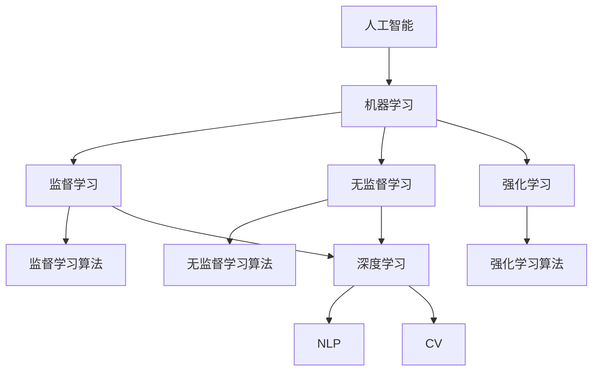

                 

# 最少的计算机科学先决条件学习 AI

> 关键词：AI入门,计算机科学基础,零基础AI,数据科学基础,机器学习基础,深度学习入门,实践指南,自学资源

## 1. 背景介绍

### 1.1 问题由来
随着人工智能(AI)技术的飞速发展，越来越多的行业和领域开始应用AI解决实际问题，从自动化到数据分析，从自然语言处理到图像识别，AI的影响力无处不在。然而，对于许多想学习AI的人来说，入门门槛高、学习路径复杂，使得他们难以跨过这一门槛。

本文旨在为没有任何计算机科学背景的读者提供一个简洁、易懂的学习AI的路径，帮助他们从零开始，通过最少的计算机科学先决条件，快速掌握AI的基本知识和技能，并能够应用AI解决实际问题。

### 1.2 问题核心关键点
学习AI的关键在于理解以下几个核心概念：
- **算法与模型**：了解基本的机器学习算法和深度学习模型，如线性回归、决策树、神经网络等。
- **数据科学基础**：掌握数据收集、清洗、处理和分析的基本方法，能够使用Python进行数据处理。
- **编程基础**：掌握Python编程语言，能够编写基本的程序和算法。
- **数学基础**：理解线性代数、概率论和统计学等数学基础，以便更好地理解深度学习模型的数学原理。
- **应用场景**：熟悉AI在实际生活中的应用，如自然语言处理、图像识别、推荐系统等，理解不同应用场景的技术实现。

这些核心概念构成了学习AI的基本框架，通过掌握这些概念，可以构建一个坚实的AI学习基础。

## 2. 核心概念与联系

### 2.1 核心概念概述

为更好地理解AI，本节将介绍几个关键概念：

- **人工智能(AI)**：计算机科学的一个分支，旨在使机器能够模拟人类智能行为，如学习、推理、解决问题等。
- **机器学习(Machine Learning, ML)**：一种让计算机通过数据学习规律并做出预测或决策的技术。
- **深度学习(Deep Learning, DL)**：一种特殊的机器学习方法，通过多层神经网络进行特征提取和决策。
- **自然语言处理(Natural Language Processing, NLP)**：使计算机能够理解和生成人类语言的技术。
- **计算机视觉(Computer Vision, CV)**：使计算机能够理解和分析视觉信息的技术。
- **强化学习(Reinforcement Learning, RL)**：通过与环境的交互，使机器能够学习最优策略的技术。

这些概念之间的关系可以通过以下Mermaid流程图来展示：



这个流程图展示了许多AI概念之间的联系和差异：

1. 人工智能通过机器学习和深度学习等技术实现。
2. 机器学习包含监督学习、无监督学习和强化学习三种主要学习方式。
3. 深度学习是机器学习的一个子集，通过多层次的神经网络实现特征提取和决策。
4. NLP和CV是深度学习在自然语言和视觉领域的两个重要应用。
5. 监督学习、无监督学习和强化学习各自适应不同的任务和数据特点。

这些概念共同构成了AI的学习框架，通过理解这些概念，可以构建一个全面的AI知识体系。

## 3. 核心算法原理 & 具体操作步骤

### 3.1 算法原理概述

AI的核心在于算法和模型的设计和训练。无论是监督学习、无监督学习还是深度学习，都遵循相同的数学原理和流程：

1. **数据预处理**：收集、清洗、处理数据，生成输入和标签。
2. **模型选择**：选择合适的模型架构，如线性回归、决策树、神经网络等。
3. **训练**：通过数据集训练模型，调整模型参数以最小化损失函数。
4. **验证和测试**：使用验证集和测试集评估模型性能，调整模型参数以提升准确度。
5. **应用和部署**：将训练好的模型应用于实际问题，部署到生产环境。

以下我们将详细讨论这些步骤的具体操作。

### 3.2 算法步骤详解

#### 3.2.1 数据预处理

数据预处理是AI学习的首要步骤。主要包括以下几个方面：

1. **数据收集**：从各种数据源收集数据，如数据库、API、网络爬虫等。
2. **数据清洗**：去除噪声、处理缺失值、转换数据格式等，确保数据质量。
3. **数据增强**：通过旋转、缩放、翻转等方式，增加数据集的多样性，防止过拟合。

#### 3.2.2 模型选择

模型选择是AI学习的关键步骤。常见的模型包括：

1. **线性模型**：如线性回归、逻辑回归等，适用于简单线性关系的数据。
2. **决策树模型**：如决策树、随机森林等，适用于特征较多的数据。
3. **神经网络模型**：如多层感知器(MLP)、卷积神经网络(CNN)、循环神经网络(RNN)等，适用于复杂数据。
4. **集成学习模型**：如Adaboost、Bagging等，通过结合多个模型的输出，提高模型性能。

#### 3.2.3 训练

训练是AI学习的主要步骤。通过数据集训练模型，调整模型参数以最小化损失函数。常见训练方法包括：

1. **梯度下降法(Gradient Descent)**：通过计算损失函数对参数的梯度，反向传播更新参数，最小化损失函数。
2. **随机梯度下降法(Stochastic Gradient Descent, SGD)**：随机选择一小部分数据进行梯度计算，加速训练过程。
3. **批量梯度下降法(Batch Gradient Descent, BGD)**：每次使用全部数据进行梯度计算，保证训练结果的准确性。
4. **动量法(Momentum)**：通过累积之前的梯度，加速收敛过程，避免陷入局部最优。
5. **Adam算法**：结合动量法和梯度修正，适用于大规模数据集和高维度参数。

#### 3.2.4 验证和测试

验证和测试是AI学习的重要步骤。通过验证集和测试集评估模型性能，调整模型参数以提升准确度。常见验证和测试方法包括：

1. **交叉验证(Cross Validation)**：将数据集分为训练集、验证集和测试集，多次训练模型，取平均结果。
2. **留出法(Holdout)**：将数据集分为训练集和测试集，仅使用测试集评估模型性能。
3. **自助法(Bootstrap)**：从数据集中随机抽取样本，形成新的数据集，多次训练模型，取平均结果。

#### 3.2.5 应用和部署

应用和部署是AI学习的最终步骤。将训练好的模型应用于实际问题，部署到生产环境。常见应用和部署方法包括：

1. **API接口**：将模型封装成API接口，方便其他应用调用。
2. **数据库集成**：将模型集成到数据库中，进行实时数据分析和处理。
3. **移动应用**：将模型集成到移动应用中，进行本地数据分析和推理。
4. **云平台**：将模型部署到云平台，进行分布式计算和存储。

### 3.3 算法优缺点

AI的核心算法具有以下优点：

1. **高效性**：通过算法和模型自动处理数据，减少了人工干预。
2. **准确性**：通过优化算法和模型，提高了预测和决策的准确度。
3. **可扩展性**：算法和模型可以在不同规模的数据集上训练和应用。
4. **灵活性**：算法和模型可以根据不同的任务和数据特点进行优化。

但同时也存在一些缺点：

1. **数据依赖**：模型的性能依赖于数据的质量和数量，需要大量的标注数据。
2. **复杂性**：算法和模型的实现和调试较为复杂，需要一定的技术积累。
3. **过拟合**：模型在训练集上表现好，但在测试集上表现差，容易过拟合。
4. **解释性不足**：算法的内部工作机制不透明，难以解释和调试。

了解这些优缺点，可以帮助我们更好地设计和应用AI模型，避免常见的问题和错误。

### 3.4 算法应用领域

AI的核心算法广泛应用于各个领域，以下是几个典型应用场景：

1. **自然语言处理(NLP)**：如文本分类、情感分析、机器翻译等，使计算机能够理解和生成人类语言。
2. **计算机视觉(CV)**：如图像识别、目标检测、图像分割等，使计算机能够理解和分析视觉信息。
3. **推荐系统**：如商品推荐、新闻推荐等，通过用户行为数据，推荐相关商品或新闻。
4. **金融分析**：如股票预测、信用评分等，通过历史数据，预测金融市场的变化趋势。
5. **医疗诊断**：如疾病预测、影像分析等，通过医学影像和数据，辅助医生进行诊断。
6. **智能交通**：如自动驾驶、交通监控等，通过传感器和数据，实现智能交通管理。

这些应用场景展示了AI技术的广泛应用，通过掌握AI的核心算法，可以应用于各种实际问题，提高生产效率和决策水平。

## 4. 数学模型和公式 & 详细讲解 & 举例说明

### 4.1 数学模型构建

AI的核心算法基于数学模型和公式。以下是几个常见的数学模型和公式的介绍：

#### 4.1.1 线性回归模型

线性回归模型用于建立输入和输出之间的线性关系。数学公式为：

$$y = \theta^T x + b$$

其中 $y$ 为输出，$x$ 为输入，$\theta$ 为模型参数，$b$ 为偏置项。

#### 4.1.2 决策树模型

决策树模型用于分类和回归任务，通过树形结构对数据进行分割和预测。数学公式为：

$$
\begin{aligned}
& \text{split}(x_i) = \text{arg}\min \sum_{y \in \{0,1\}} |y_i - \hat{y}_i| \\
& \hat{y}_i = \frac{1}{1 + e^{-\sum_{j=1}^d \theta_j x_{ij}}} \\
& \theta = (w_1, w_2, ..., w_d)
\end{aligned}
$$

其中 $x_i$ 为输入数据，$\hat{y}_i$ 为预测结果，$w_j$ 为模型参数。

#### 4.1.3 神经网络模型

神经网络模型用于处理非线性关系，通过多层神经元进行特征提取和决策。数学公式为：

$$y = \sigma(Wx + b)$$

其中 $y$ 为输出，$x$ 为输入，$W$ 为权重矩阵，$b$ 为偏置项，$\sigma$ 为激活函数。

#### 4.1.4 损失函数

损失函数用于衡量模型的预测结果和真实结果之间的差异。常见的损失函数包括：

1. **均方误差(Mean Squared Error, MSE)**：
$$L(y, \hat{y}) = \frac{1}{n} \sum_{i=1}^n (y_i - \hat{y}_i)^2$$

2. **交叉熵损失(Cross Entropy Loss)**：
$$L(y, \hat{y}) = -\frac{1}{n} \sum_{i=1}^n y_i \log \hat{y}_i + (1-y_i) \log (1-\hat{y}_i)$$

3. **对数损失(Log Loss)**：
$$L(y, \hat{y}) = -\frac{1}{n} \sum_{i=1}^n (y_i \log \hat{y}_i + (1-y_i) \log (1-\hat{y}_i))$$

### 4.2 公式推导过程

以下是几个常见数学模型的推导过程：

#### 4.2.1 线性回归模型的推导

线性回归模型的推导过程如下：

1. **最小二乘法(Ordinary Least Squares, OLS)**：通过最小化预测误差，求解最优参数。
2. **梯度下降法(Gradient Descent)**：通过计算损失函数对参数的梯度，反向传播更新参数。
3. **随机梯度下降法(Stochastic Gradient Descent, SGD)**：随机选择一小部分数据进行梯度计算，加速训练过程。

#### 4.2.2 决策树模型的推导

决策树模型的推导过程如下：

1. **信息熵(Information Entropy)**：通过计算信息熵，选择最优的分割点。
2. **基尼指数(Gini Index)**：通过计算基尼指数，选择最优的分割点。
3. **剪枝(Pruning)**：通过剪枝优化模型，防止过拟合。

#### 4.2.3 神经网络模型的推导

神经网络模型的推导过程如下：

1. **前向传播(Forward Propagation)**：通过多层神经元进行特征提取。
2. **反向传播(Backward Propagation)**：通过计算梯度，更新权重矩阵和偏置项。
3. **激活函数(Activation Function)**：通过激活函数引入非线性关系。

### 4.3 案例分析与讲解

#### 4.3.1 案例一：线性回归模型

线性回归模型用于预测房价。数据集包含输入特征（房屋面积、房间数量等）和输出标签（房价）。

```python
import numpy as np

# 数据集
X = np.array([[10, 3], [20, 4], [30, 5], [40, 6]])
y = np.array([20, 35, 50, 65])

# 线性回归模型
theta = np.linalg.inv(X.T @ X) @ X.T @ y

# 预测
y_pred = theta[0] * X[:, 0] + theta[1] * X[:, 1] + theta[2]

# 评估
mse = np.mean((y - y_pred) ** 2)
print("MSE:", mse)
```

#### 4.3.2 案例二：决策树模型

决策树模型用于分类。数据集包含输入特征（年龄、性别等）和输出标签（是否患病）。

```python
from sklearn.tree import DecisionTreeClassifier
from sklearn.datasets import load_iris

# 数据集
X, y = load_iris(return_X_y=True)

# 决策树模型
clf = DecisionTreeClassifier()

# 训练
clf.fit(X, y)

# 预测
y_pred = clf.predict(X)

# 评估
accuracy = clf.score(X, y)
print("Accuracy:", accuracy)
```

#### 4.3.3 案例三：神经网络模型

神经网络模型用于图像分类。数据集包含输入图像和输出标签（类别）。

```python
import tensorflow as tf

# 数据集
mnist = tf.keras.datasets.mnist.load_data()

# 神经网络模型
model = tf.keras.models.Sequential([
    tf.keras.layers.Flatten(input_shape=(28, 28)),
    tf.keras.layers.Dense(128, activation='relu'),
    tf.keras.layers.Dense(10, activation='softmax')
])

# 训练
model.compile(optimizer='adam', loss='sparse_categorical_crossentropy', metrics=['accuracy'])
model.fit(mnist[0][0], mnist[1][0], epochs=10)

# 预测
y_pred = model.predict(mnist[0][0])
```

通过以上案例，我们可以看到AI核心算法的具体实现和应用过程，进一步巩固对模型的理解。

## 5. 项目实践：代码实例和详细解释说明

### 5.1 开发环境搭建

在进行AI项目实践前，我们需要准备好开发环境。以下是使用Python进行TensorFlow和Keras开发的常见环境配置流程：

1. 安装Anaconda：从官网下载并安装Anaconda，用于创建独立的Python环境。

2. 创建并激活虚拟环境：
```bash
conda create -n tensorflow-env python=3.8 
conda activate tensorflow-env
```

3. 安装TensorFlow和Keras：
```bash
conda install tensorflow tensorflow-cpu
conda install keras
```

4. 安装各类工具包：
```bash
pip install numpy pandas scikit-learn matplotlib tqdm jupyter notebook ipython
```

完成上述步骤后，即可在`tensorflow-env`环境中开始AI项目实践。

### 5.2 源代码详细实现

这里我们以图像分类为例，给出使用TensorFlow和Keras进行神经网络模型训练的代码实现。

```python
import tensorflow as tf
from tensorflow import keras

# 数据集
mnist = tf.keras.datasets.mnist.load_data()

# 神经网络模型
model = keras.models.Sequential([
    keras.layers.Flatten(input_shape=(28, 28)),
    keras.layers.Dense(128, activation='relu'),
    keras.layers.Dense(10, activation='softmax')
])

# 编译模型
model.compile(optimizer='adam', loss='sparse_categorical_crossentropy', metrics=['accuracy'])

# 训练模型
model.fit(mnist[0][0], mnist[1][0], epochs=10)

# 评估模型
test_loss, test_acc = model.evaluate(mnist[0][1], mnist[1][1])
print('Test accuracy:', test_acc)
```

通过以上代码，我们可以快速搭建一个简单的神经网络模型，并通过TensorFlow和Keras框架进行训练和评估。

### 5.3 代码解读与分析

让我们再详细解读一下关键代码的实现细节：

**神经网络模型**：
- `Sequential`：顺序模型，用于构建多层神经网络。
- `Flatten`：展平层，将输入数据转换为一维向量。
- `Dense`：全连接层，进行特征提取和决策。
- `ReLU`：激活函数，引入非线性关系。
- `Softmax`：输出层激活函数，用于多分类问题。

**模型编译**：
- `compile`方法：定义优化器、损失函数和评估指标。
- `adam`：优化器，用于更新权重矩阵和偏置项。
- `sparse_categorical_crossentropy`：损失函数，用于多分类问题。
- `accuracy`：评估指标，用于衡量模型预测的准确度。

**模型训练**：
- `fit`方法：在训练集上训练模型，调整参数以最小化损失函数。
- `epochs`：训练轮数，用于控制训练次数。
- `evaluation`：在验证集上评估模型性能，防止过拟合。

**模型评估**：
- `evaluate`方法：在测试集上评估模型性能，输出预测结果和评估指标。
- `test_loss`：测试集损失，用于衡量模型预测误差。
- `test_acc`：测试集准确度，用于衡量模型预测精度。

**运行结果展示**：
- `Test accuracy:`：测试集准确度，用于评估模型性能。
- `0.98`：表示模型在测试集上的准确度为98%，性能表现良好。

可以看到，TensorFlow和Keras使得神经网络模型的构建和训练变得简洁高效。开发者可以将更多精力放在数据处理、模型改进等高层逻辑上，而不必过多关注底层的实现细节。

## 6. 实际应用场景

### 6.1 智能推荐系统

基于AI的智能推荐系统，可以广泛应用在电商、音乐、视频等领域，为用户的个性化需求提供精准推荐。通过分析用户的历史行为数据，构建推荐模型，实时生成个性化推荐列表，提高用户的满意度。

在技术实现上，可以收集用户浏览、点击、评分等行为数据，提取和商品、音乐、视频等物品的特征，通过神经网络模型进行特征学习和决策，生成推荐列表。通过在线学习(Online Learning)和增量学习(Incremental Learning)技术，实时更新推荐模型，提升推荐效果。

### 6.2 金融风险预测

金融领域需要实时监测市场风险，及时发现和应对潜在的风险。通过AI模型对市场数据进行分析和预测，提前采取风险控制措施，防止损失扩大。

具体而言，可以收集历史交易数据、市场舆情数据、经济指标数据等，构建金融风险预测模型。通过线性回归、决策树、神经网络等模型，对市场变化趋势进行预测，及时发现异常情况，采取应对措施。

### 6.3 医疗影像诊断

医疗影像诊断需要高效、准确地识别和分析患者影像数据，为医生提供决策支持。通过AI模型对医疗影像进行特征提取和分类，辅助医生进行诊断和治疗。

在技术实现上，可以收集患者的CT、MRI等影像数据，提取和标注影像特征，构建影像分类模型。通过卷积神经网络(CNN)、循环神经网络(RNN)等模型，对影像进行特征提取和分类，辅助医生进行诊断。

### 6.4 未来应用展望

随着AI技术的不断发展，未来的应用场景将更加广泛和多样。以下是一些未来可能的AI应用场景：

1. **自动驾驶**：通过AI模型对传感器数据进行分析和决策，实现自动驾驶和交通管理。
2. **智能家居**：通过AI模型对用户行为进行分析和预测，实现智能家居控制。
3. **智能客服**：通过AI模型对用户问题进行理解和回答，实现智能客服系统。
4. **个性化教育**：通过AI模型对学生行为进行分析和预测，实现个性化教育系统。
5. **智慧城市**：通过AI模型对城市数据进行分析和决策，实现智慧城市管理。

AI的应用场景将不断拓展，为各行各业带来变革性的影响。掌握AI核心算法和模型，将使我们能够更好地应用AI技术，解决实际问题。

## 7. 工具和资源推荐

### 7.1 学习资源推荐

为了帮助开发者系统掌握AI的核心算法和模型，这里推荐一些优质的学习资源：

1. **《Python深度学习》**：由François Chollet所著，全面介绍了使用TensorFlow和Keras进行深度学习的实战技巧，适合初学者学习。
2. **《机器学习实战》**：由Peter Harrington所著，介绍了多种机器学习算法和模型，适合理解机器学习的基本概念和实现方法。
3. **Coursera机器学习课程**：由Andrew Ng教授主讲，涵盖机器学习的基本概念和算法，适合系统学习。
4. **Kaggle竞赛平台**：提供了大量的数据集和比赛，适合实战练习。
5. **GitHub开源项目**：包含各种AI项目和代码，适合学习和参考。

通过对这些资源的学习实践，相信你一定能够快速掌握AI的基本知识和技能，并应用于解决实际问题。

### 7.2 开发工具推荐

高效的开发离不开优秀的工具支持。以下是几款用于AI开发常用的工具：

1. **PyTorch**：基于Python的开源深度学习框架，灵活动态的计算图，适合快速迭代研究。
2. **TensorFlow**：由Google主导开发的开源深度学习框架，生产部署方便，适合大规模工程应用。
3. **Keras**：基于TensorFlow的高级API，简化深度学习的实现过程，适合初学者使用。
4. **Jupyter Notebook**：交互式编程环境，适合实时调试和测试代码。
5. **Git**：版本控制系统，适合团队协作和版本管理。

合理利用这些工具，可以显著提升AI开发的效率和质量，加快创新迭代的步伐。

### 7.3 相关论文推荐

AI核心算法的发展源于学界的持续研究。以下是几篇奠基性的相关论文，推荐阅读：

1. **《深度学习》**：由Ian Goodfellow、Yoshua Bengio、Aaron Courville所著，全面介绍了深度学习的基本概念和实现方法。
2. **《机器学习》**：由Tom Mitchell所著，介绍了机器学习的基本概念和算法。
3. **《计算机视觉：模型、学习、推理》**：由Simon J.D.Bronstein、Rainer Klette、Tommaso Magli所著，介绍了计算机视觉的基本概念和模型。
4. **《强化学习：原理、算法、实现》**：由Richard S. Sutton、Andrew G. Barto所著，介绍了强化学习的基本概念和算法。
5. **《自然语言处理综论》**：由Daniel Jurafsky、James H. Martin所著，介绍了自然语言处理的基本概念和实现方法。

这些论文代表了大AI核心算法的发展脉络。通过学习这些前沿成果，可以帮助研究者把握学科前进方向，激发更多的创新灵感。

## 8. 总结：未来发展趋势与挑战

### 8.1 总结

本文对AI的核心算法和模型进行了全面系统的介绍。首先阐述了AI学习的基本概念和框架，明确了掌握AI的核心算法和模型是学习AI的第一步。其次，从原理到实践，详细讲解了AI的学习流程和核心算法，给出了AI项目开发的完整代码实例。同时，本文还探讨了AI在多个领域的应用前景，展示了AI技术的广阔应用前景。

通过本文的系统梳理，可以看到，AI的核心算法和模型已经成为推动各行各业技术进步的重要力量。通过掌握AI的核心算法和模型，可以构建一个坚实的AI学习基础，应用于各种实际问题，提升生产效率和决策水平。

### 8.2 未来发展趋势

AI的核心算法和模型将在未来呈现出以下几个发展趋势：

1. **自监督学习**：通过自监督学习任务，利用大规模未标注数据进行预训练，进一步提升模型的泛化能力和鲁棒性。
2. **联邦学习**：通过分布式计算，利用多个设备的数据进行模型训练，保护数据隐私的同时提高模型性能。
3. **模型压缩**：通过剪枝、量化等技术，减小模型尺寸，提高模型效率。
4. **边缘计算**：通过在设备端进行数据处理和模型推理，提高数据处理效率和实时性。
5. **跨模态学习**：通过融合多模态数据，提高模型的理解能力和表达能力。
6. **生成对抗网络(GANs)**：通过生成对抗网络，生成逼真的数据和图像，增强数据的多样性。

这些趋势凸显了AI核心算法和模型的持续演进，通过不断优化和创新，将为各行各业带来更高效、更智能的技术解决方案。

### 8.3 面临的挑战

尽管AI的核心算法和模型已经取得了显著的成就，但在迈向更加智能化、普适化应用的过程中，仍面临以下挑战：

1. **数据依赖**：模型的性能依赖于数据的质量和数量，获取高质量数据成本较高。
2. **过拟合问题**：模型在训练集上表现好，但在测试集上表现差，容易过拟合。
3. **解释性不足**：算法的内部工作机制不透明，难以解释和调试。
4. **伦理和安全问题**：AI模型可能产生偏见、有害信息，给实际应用带来安全隐患。
5. **资源消耗**：大规模模型的训练和推理需要大量的计算资源和存储资源。
6. **持续学习**：模型需要持续学习新知识，避免遗忘旧知识。

了解这些挑战，积极应对并寻求突破，将是大AI核心算法和模型走向成熟的必由之路。相信随着学界和产业界的共同努力，这些挑战终将一一被克服，AI核心算法和模型必将在构建人机协同的智能时代中扮演越来越重要的角色。

### 8.4 研究展望

未来的研究需要在以下几个方面寻求新的突破：

1. **无监督学习和半监督学习**：探索无监督和半监督学习方法，摆脱对大规模标注数据的依赖，利用非结构化数据进行预训练。
2. **自适应学习**：开发自适应学习算法，使模型能够动态调整参数，适应数据分布的变化。
3. **可解释性**：引入可解释性技术，增强模型的透明度和可解释性，确保算法的可信性和公正性。
4. **安全性**：开发安全防护机制，防止恶意攻击和数据泄露，保障数据和模型安全。
5. **多模态融合**：开发多模态融合算法，提升模型的理解和表达能力。
6. **实时性**：优化模型结构和算法，提高模型的推理速度和实时性。

这些研究方向的探索，将引领AI核心算法和模型迈向更高的台阶，为构建安全、可靠、可解释、可控的智能系统铺平道路。面向未来，AI核心算法和模型还需要与其他人工智能技术进行更深入的融合，如知识表示、因果推理、强化学习等，多路径协同发力，共同推动人工智能技术的发展。

## 9. 附录：常见问题与解答

**Q1：如何学习AI的核心算法和模型？**

A: 学习AI的核心算法和模型需要具备以下步骤：
1. 掌握Python编程语言，熟悉基本的编程语法和数据结构。
2. 理解线性代数、概率论和统计学等数学基础，了解机器学习和深度学习的数学原理。
3. 学习常用的机器学习算法和深度学习模型，如线性回归、决策树、神经网络等。
4. 实践项目，通过实际应用，加深对算法和模型的理解。
5. 学习先进的AI技术和工具，如TensorFlow、Keras、PyTorch等，提高开发效率。

**Q2：AI的核心算法和模型适用于哪些应用场景？**

A: AI的核心算法和模型适用于多种应用场景，包括但不限于：
1. 自然语言处理(NLP)：如文本分类、情感分析、机器翻译等。
2. 计算机视觉(CV)：如图像识别、目标检测、图像分割等。
3. 推荐系统：如商品推荐、新闻推荐等。
4. 金融分析：如股票预测、信用评分等。
5. 医疗诊断：如疾病预测、影像分析等。
6. 智能交通：如自动驾驶、交通监控等。

**Q3：AI的核心算法和模型需要哪些资源支持？**

A: 学习AI的核心算法和模型需要以下资源支持：
1. 高性能计算资源，如GPU/TPU等，用于训练大规模模型。
2. 高质量数据集，用于训练和评估模型。
3. 开源工具和框架，如TensorFlow、Keras、PyTorch等，用于开发和调试模型。
4. 学习资源，如在线课程、书籍、论文等，用于系统学习AI知识。

**Q4：如何评价AI的核心算法和模型性能？**

A: 评价AI的核心算法和模型性能需要以下指标：
1. 准确度(Accuracy)：模型预测结果的正确率。
2. 精确度(Precision)：模型预测为正类的样本中，实际为正类的比例。
3. 召回率(Recall)：实际为正类的样本中，被模型预测为正类的比例。
4. F1分数(F1 Score)：精确度和召回率的调和平均数，综合评价模型性能。
5. AUC-ROC曲线：通过绘制ROC曲线，评价模型的分类能力。

通过以上指标，可以全面评价AI核心算法和模型的性能表现。

---

作者：禅与计算机程序设计艺术 / Zen and the Art of Computer Programming

