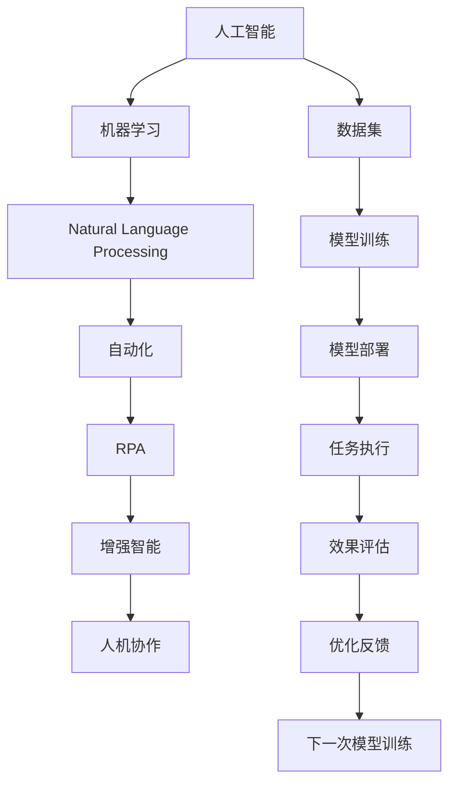

                 

## 1. 背景介绍

随着人工智能技术的迅猛发展，尤其是机器学习和自然语言处理等技术的突破，我们正在见证一个全新的未来工作模式——人机协作。这不仅仅是一场技术革命，更是一场人类劳动关系的深刻变革。本文将探讨人机协作的原理与实践，分析其对职业未来的重塑，并提出应对策略。

## 2. 核心概念与联系

### 2.1 核心概念概述

- **人工智能 (AI)**：通过算法和数据训练出来的系统，能够执行人类指令，甚至在特定领域内超越人类。
- **机器学习 (ML)**：使机器具备自我学习能力的算法，通常依赖大量标注数据进行训练。
- **自然语言处理 (NLP)**：使机器能够理解、处理和生成人类语言的技术。
- **人机协作 (Human-Machine Collaboration)**：人类与机器协同工作，共同完成任务的互动模式。
- **自动化 (Automation)**：使用机器自动化执行重复性高、规则明确的任务。
- **增强智能 (Augmented Intelligence)**：使用机器来提升人类智能和效率，而非取代人类。
- **机器人流程自动化 (RPA)**：自动执行一系列复杂业务流程的机器程序。

这些概念通过协作网络相联系，共同构成了未来工作的生态系统。人工智能和机器学习是实现人机协作的技术基础，自然语言处理则为人机沟通提供了语言桥梁。自动化和RPA则将具体任务执行交给机器，增强智能则聚焦于提升人类的工作效率和决策能力。

### 2.2 核心概念原理和架构的 Mermaid 流程图



## 3. 核心算法原理 & 具体操作步骤

### 3.1 算法原理概述

人机协作的核心在于将人工智能与人类智慧相结合，实现优势互补。机器在处理数据、执行重复性任务方面具有天然优势，而人类在理解复杂情境、处理多模态信息等方面具有不可替代性。

人机协作的算法原理包括以下几个步骤：

1. **数据预处理**：收集和清洗数据，为机器学习模型的训练提供基础。
2. **模型训练**：使用机器学习算法训练模型，使其具备一定的通用性。
3. **任务适配**：根据具体任务需求，对预训练模型进行微调，以适应特定的业务场景。
4. **协作流程设计**：设计人机协作的交互界面和工作流程，实现无缝衔接。
5. **效果评估与优化**：评估人机协作效果，根据反馈不断优化模型和流程。

### 3.2 算法步骤详解

#### 3.2.1 数据预处理

数据预处理包括数据收集、清洗、标注等步骤。对于大规模数据集，需要采用分布式存储和处理技术，如Hadoop和Spark。对于结构化数据，可以使用SQL进行查询和处理；对于非结构化数据，可以使用NLP技术进行文本预处理。

#### 3.2.2 模型训练

模型训练的核心是选择合适的机器学习算法，并使用预处理后的数据进行训练。常用的算法包括监督学习、无监督学习、半监督学习等。监督学习通常用于分类、回归等任务，无监督学习则用于聚类、降维等任务。半监督学习结合了两者，使用少量标注数据进行训练，同时利用未标注数据提高模型性能。

#### 3.2.3 任务适配

任务适配是将通用模型应用于特定任务的过程。常用的方法包括：

- **迁移学习**：将模型在某任务上学习到的知识迁移到另一任务上，如BERT模型在多个NLP任务上的应用。
- **微调**：对模型进行特定任务的微调，如对BERT模型进行命名实体识别任务的微调。
- **参数高效微调**：通过调整部分模型参数实现微调，如使用AdaLoRA等方法减少参数量。

#### 3.2.4 协作流程设计

协作流程设计包括交互界面设计、工作流程编排、实时通信机制等。常见的方式包括：

- **API接口**：通过RESTful API接口实现人机协作，机器处理数据，人类进行审核和决策。
- **聊天机器人**：使用NLP技术构建聊天机器人，实现智能客服、自动问答等功能。
- **可视化仪表盘**：通过可视化仪表盘，实时展示机器处理结果和人类决策过程，便于监控和调试。

#### 3.2.5 效果评估与优化

效果评估与优化包括模型评估、用户反馈收集、持续改进等步骤。常用的模型评估指标包括精度、召回率、F1分数等。用户反馈可以通过问卷调查、A/B测试等方式收集。根据评估结果和用户反馈，不断优化模型和流程，以提高人机协作的效率和效果。

### 3.3 算法优缺点

#### 3.3.1 优点

- **提升效率**：机器处理速度快，能够快速处理大量数据，减轻人类负担。
- **降低成本**：自动化和RPA可以大幅降低人工成本，尤其是在重复性高、规则明确的领域。
- **增强决策**：通过数据分析和机器学习，提供更科学、客观的决策支持。

#### 3.3.2 缺点

- **依赖数据**：数据质量和数量直接影响模型性能，需要大量高质量标注数据。
- **技术门槛**：涉及算法设计、模型训练、系统集成等多个环节，技术门槛较高。
- **安全风险**：涉及隐私数据，需要严格的安全防护措施，避免数据泄露和模型滥用。

### 3.4 算法应用领域

人机协作在多个领域已得到应用：

- **金融行业**：使用机器学习进行风险评估、欺诈检测、投资分析等。
- **医疗健康**：利用AI进行疾病诊断、个性化治疗、健康管理等。
- **制造业**：通过机器人流程自动化进行生产调度、质量检测、供应链管理等。
- **客服行业**：使用聊天机器人进行智能客服、自动问答、用户投诉处理等。
- **教育培训**：采用个性化推荐系统进行课程推荐、学习进度监控、作业批改等。

## 4. 数学模型和公式 & 详细讲解 & 举例说明

### 4.1 数学模型构建

假设有一个分类任务，数据集为$D=\{(x_i, y_i)\}_{i=1}^N$，其中$x_i$为输入特征，$y_i$为标签。使用随机梯度下降(SGD)算法进行模型训练，模型参数为$\theta$。

数学模型构建如下：

- **损失函数**：$L(\theta)=\frac{1}{N}\sum_{i=1}^N\ell(f(x_i),y_i)$，其中$\ell$为损失函数，$f(x_i)=\theta^Tx_i$为模型输出。
- **优化算法**：$\nabla_{\theta}L(\theta)=\frac{1}{N}\sum_{i=1}^N\nabla_{\theta}\ell(f(x_i),y_i)$。

### 4.2 公式推导过程

以线性回归为例，假设输入特征为$x$，模型输出为$f(x)=\theta^Tx$，标签为$y$。则损失函数为：

$$
L(\theta)=\frac{1}{N}\sum_{i=1}^N(y_i-f(x_i))^2=\frac{1}{N}\sum_{i=1}^N(y_i-\theta^Tx_i)^2
$$

对$\theta$求导得：

$$
\nabla_{\theta}L(\theta)=\frac{2}{N}\sum_{i=1}^N(x_i)(y_i-\theta^Tx_i)
$$

结合SGD算法，更新模型参数如下：

$$
\theta \leftarrow \theta-\eta\nabla_{\theta}L(\theta)
$$

其中$\eta$为学习率。

### 4.3 案例分析与讲解

以股票预测为例，使用历史股价数据进行模型训练和测试。输入特征为前$n$天的股价$x$，标签为第$n+1$天的股价$y$。使用LSTM模型进行预测，其中$x$的长度为$n$，模型输出为$y$的预测值。

在训练过程中，将数据集分为训练集和测试集，使用交叉验证进行参数调优。在测试集上评估模型效果，计算均方误差。如果模型效果不佳，则调整模型结构或优化算法。

## 5. 项目实践：代码实例和详细解释说明

### 5.1 开发环境搭建

开发环境搭建包括安装Python、安装相关库和工具等步骤。

1. **安装Python**：建议使用Anaconda，快速搭建Python环境。
2. **安装相关库**：
   - 安装NumPy、Pandas、Scikit-learn等数据处理库。
   - 安装TensorFlow或PyTorch进行深度学习模型开发。
   - 安装Scikit-learn进行机器学习模型开发。
3. **安装工具**：
   - 安装Jupyter Notebook进行交互式编程。
   - 安装Git进行版本控制。
   - 安装Docker进行模型部署和运行。

### 5.2 源代码详细实现

以线性回归为例，使用Python和Scikit-learn库进行模型训练和评估。

```python
import numpy as np
from sklearn.linear_model import LinearRegression

# 生成随机数据
np.random.seed(0)
X = np.random.randn(100, 10)
y = np.dot(X, np.array([1, 2, 3, 4, 5, 6, 7, 8, 9, 10])) + 10

# 创建模型并训练
model = LinearRegression()
model.fit(X, y)

# 预测新数据
X_test = np.random.randn(10, 10)
y_pred = model.predict(X_test)

# 评估模型效果
from sklearn.metrics import mean_squared_error
mse = mean_squared_error(y, y_pred)
print(f"均方误差: {mse}")
```

### 5.3 代码解读与分析

在上述代码中，我们首先使用NumPy生成随机数据$X$和标签$y$。然后，使用Scikit-learn库中的LinearRegression模型进行训练，使用均方误差作为评估指标。最后，在测试集上评估模型效果。

## 6. 实际应用场景

### 6.1 智能客服系统

智能客服系统使用聊天机器人进行自动问答和用户投诉处理。通过NLP技术，将用户输入的文本转换为机器可理解的形式，然后调用预训练的模型进行理解和回答。同时，将用户反馈和机器处理结果反馈给人工客服，进行进一步的审核和处理。

### 6.2 金融行业

金融行业使用AI进行风险评估和欺诈检测。通过收集历史交易数据和用户行为数据，训练机器学习模型，预测交易风险和欺诈行为。同时，利用强化学习进行实时监控和预警。

### 6.3 制造业

制造业使用机器人流程自动化进行生产调度和管理。通过传感器和设备的数据采集，训练机器学习模型，优化生产流程和资源配置。同时，使用AI进行质量检测和缺陷分析，提高生产效率和产品质量。

### 6.4 教育培训

教育培训使用个性化推荐系统进行课程推荐和学习进度监控。通过分析学生的学习行为和成绩，训练推荐模型，推荐适合学生的课程和学习资源。同时，使用AI进行作业批改和考试评估，提高教学质量和学习效率。

## 7. 工具和资源推荐

### 7.1 学习资源推荐

- **《机器学习》**：周志华著，介绍机器学习算法及其应用。
- **《深度学习》**：Ian Goodfellow等著，介绍深度学习算法及其应用。
- **《自然语言处理综论》**：Daniel Jurafsky等著，介绍自然语言处理技术及其应用。
- **《Python数据科学手册》**：Jake VanderPlas著，介绍Python在数据科学中的应用。
- **Coursera和edX在线课程**：提供从入门到高级的机器学习和深度学习课程，涵盖各种前沿技术。

### 7.2 开发工具推荐

- **Jupyter Notebook**：交互式编程环境，便于实验和调试。
- **Git**：版本控制工具，便于团队协作和版本管理。
- **Docker**：容器化技术，便于模型部署和运行。
- **AWS和Google Cloud**：云平台，提供强大的计算和存储资源，支持大规模数据处理和模型训练。

### 7.3 相关论文推荐

- **Deep Residual Learning for Image Recognition**：He等，介绍深度残差网络。
- **Attention is All You Need**：Vaswani等，介绍Transformer模型。
- **BERT: Pre-training of Deep Bidirectional Transformers for Language Understanding**：Devlin等，介绍BERT模型及其应用。
- **ImageNet Classification with Deep Convolutional Neural Networks**：Krizhevsky等，介绍卷积神经网络在图像分类中的应用。
- **Google's Neural Machine Translation System**：Wu等，介绍谷歌神经机器翻译系统。

## 8. 总结：未来发展趋势与挑战

### 8.1 研究成果总结

未来工作的人机协作将更加智能化、高效化、个性化。随着AI技术的发展，人类将从重复性、低附加值的任务中解放出来，专注于更具创造性和战略性的工作。同时，人机协作将带来更高的生产效率和创新能力，推动社会和经济的发展。

### 8.2 未来发展趋势

1. **智能化提升**：随着AI技术的不断进步，人机协作将更加智能化，能够理解和处理更复杂的情境。
2. **个性化定制**：通过大数据和AI技术，人机协作将实现个性化定制，满足不同用户的需求。
3. **自动化提升**：机器人流程自动化将进一步提升效率，减少人工干预，提高生产效率。
4. **协作模式多样化**：人机协作将不再是单一模式，而是多种协作模式的结合，如人机对话、人机协同设计等。
5. **跨领域融合**：人机协作将跨领域融合，如AI与物联网、AI与大数据、AI与生物技术等，推动技术创新和产业升级。

### 8.3 面临的挑战

1. **技术成熟度**：当前AI技术在特定领域的成熟度不一，需要进一步研究和优化。
2. **数据质量与隐私**：数据质量和隐私保护问题仍然是AI技术应用的瓶颈。
3. **伦理与法律**：AI技术的应用涉及伦理和法律问题，需要建立规范和标准。
4. **人力转型**：AI技术的应用将带来就业结构的转变，需要培训和适应新的就业技能。
5. **安全性与可靠性**：AI系统需要具备更高的安全性和可靠性，避免误导和滥用。

### 8.4 研究展望

未来，人机协作技术将进一步发展，有望实现以下几个方向：

1. **多模态融合**：将视觉、语音、文本等多种模态数据融合，实现更全面的人机协作。
2. **认知增强**：通过认知计算，提升机器的理解和推理能力，实现更智能的协作。
3. **自适应学习**：使机器具备自适应学习能力，能够根据任务需求进行动态调整。
4. **社会交互**：使机器具备社会交互能力，能够理解人类情感和行为，实现更自然的协作。
5. **伦理与责任**：建立AI伦理和责任体系，确保人机协作的公平、透明和可解释。

## 9. 附录：常见问题与解答

**Q1：人机协作的未来发展方向是什么？**

A：未来，人机协作将更加智能化、高效化、个性化。随着AI技术的不断进步，人机协作将更加智能化，能够理解和处理更复杂的情境。同时，人机协作将实现个性化定制，满足不同用户的需求。此外，协作模式将多样化，如人机对话、人机协同设计等，推动技术创新和产业升级。

**Q2：人机协作的实现难点有哪些？**

A：人机协作的实现难点包括：
1. **数据质量与隐私**：数据质量和隐私保护问题仍然是AI技术应用的瓶颈。
2. **技术成熟度**：当前AI技术在特定领域的成熟度不一，需要进一步研究和优化。
3. **伦理与法律**：AI技术的应用涉及伦理和法律问题，需要建立规范和标准。
4. **安全性与可靠性**：AI系统需要具备更高的安全性和可靠性，避免误导和滥用。

**Q3：如何应对人机协作带来的就业转型？**

A：应对人机协作带来的就业转型，需要采取以下措施：
1. **培训与教育**：通过职业培训和教育，提升劳动者的技能和知识。
2. **转型支持**：为劳动者提供转型支持，如职业指导、就业咨询等。
3. **新岗位创造**：通过技术创新和新产业的崛起，创造更多新岗位。
4. **社会保险**：建立完善的社会保险体系，保障劳动者的基本生活。

**Q4：人机协作如何实现多模态融合？**

A：实现多模态融合，可以采用以下方法：
1. **多模态数据采集**：采集视觉、语音、文本等多种模态的数据。
2. **数据融合与表示**：将多种模态数据进行融合，生成统一的数据表示。
3. **多模态模型训练**：使用多模态数据训练模型，提高模型的综合能力。
4. **多模态交互设计**：设计多模态交互界面，实现人机多渠道互动。

**Q5：人机协作如何确保公平与透明？**

A：确保人机协作的公平与透明，可以采取以下措施：
1. **数据透明**：公开数据采集和使用过程，确保数据透明。
2. **算法透明**：公开算法模型和决策过程，确保算法透明。
3. **伦理审查**：建立伦理审查机制，确保人机协作的公平和透明。
4. **用户反馈**：建立用户反馈机制，及时调整和优化人机协作过程。

---

作者：禅与计算机程序设计艺术 / Zen and the Art of Computer Programming

