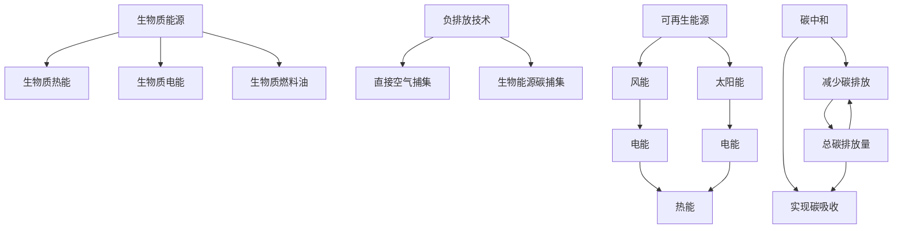

                 

# 未来的可持续发展：2050年的生物质能源与负排放技术

> 关键词：生物质能源,负排放技术,可再生能源,气候变化,碳中和

## 1. 背景介绍

### 1.1 问题由来
随着工业化和城市化进程的加速，全球能源消耗日益增加，化石燃料的过度依赖导致了严重的气候变化问题。极端气候事件频发、生物多样性锐减、生态系统受损等问题日益突出，对人类的生存和发展构成了巨大威胁。为应对这些挑战，全球正致力于推动可持续发展，减少碳排放，实现碳中和目标。

生物质能源和负排放技术作为实现这一目标的关键手段，近年来受到了广泛关注。生物质能源以其清洁、可再生的特性，成为减少碳排放的重要途径；而负排放技术则通过直接捕集、存储二氧化碳等手段，进一步提升碳中和效果。本文将深入探讨这些技术的原理、现状及未来发展趋势。

### 1.2 问题核心关键点
- 生物质能源是什么？它如何转化为电能？
- 负排放技术有哪些？它们如何实现碳捕集和储存？
- 生物质能源与负排放技术在2050年将如何发展？

## 2. 核心概念与联系

### 2.1 核心概念概述

为更好地理解生物质能源与负排放技术，本节将介绍几个关键概念：

- **生物质能源(Biological Energy)**：利用植物、动物或有机废弃物等生物质材料通过燃烧、气化和厌氧消化等过程产生能源的技术。主要包括生物质热能、生物质电能和生物质燃料油等。
- **负排放技术(Negative Emission Technologies)**：通过直接捕集和储存二氧化碳，实现碳排放与吸收之间的平衡，甚至实现负排放（净零排放）的技术。常见的负排放技术包括直接空气捕集、生物能源碳捕集等。
- **可再生能源(Renewable Energy)**：指利用自然资源（如水、风、太阳能等）转化成的电力、热能等能源。可再生能源的开发和使用有助于减少对化石燃料的依赖，降低碳排放。
- **碳中和(Carbon Neutrality)**：指在一定时间周期内，碳排放与碳吸收达到平衡，净零碳排放。

这些核心概念之间的逻辑关系可以通过以下Mermaid流程图来展示：



这个流程图展示了生物质能源与负排放技术在可再生能源和碳中和中的地位和作用：

1. 生物质能源通过热能、电能和燃料油的转换，为可再生能源体系提供了重要组成部分。
2. 负排放技术通过捕集和储存二氧化碳，帮助实现碳中和，是减少碳排放的重要补充。
3. 可再生能源如风能和太阳能，通过直接发电，进一步降低对化石燃料的依赖。
4. 碳中和目标的实现，依赖于减少碳排放和实现碳吸收的平衡。

## 3. 核心算法原理 & 具体操作步骤
### 3.1 算法原理概述

生物质能源与负排放技术的原理涉及广泛的自然科学和工程学知识，本文将重点介绍其核心算法原理。

### 3.2 算法步骤详解

#### 3.2.1 生物质能源转化

生物质能源的转化过程主要包括生物质的预处理、生物质转换和生物质能的储存和利用。以下以生物质电能为例，详细说明其转换过程：

1. **预处理**：选择适合的生物质原料，如农林废弃物、生活垃圾等，并进行清洗、粉碎、干燥等预处理。
2. **生物质转换**：
   - **直接燃烧**：将预处理后的生物质直接燃烧产生高温蒸汽，驱动蒸汽涡轮机发电。
   - **气化**：将生物质在气化炉中高温裂解为可燃气体，再通过燃烧或发电。
   - **厌氧消化**：将有机废弃物在厌氧条件下发酵产生沼气，经燃烧或发电。
3. **储存和利用**：将产生的电能储存于电网或电池中，或直接用于工业和居民生活。

#### 3.2.2 负排放技术实施

负排放技术的核心在于捕集二氧化碳并将其安全储存。以下以生物能源碳捕集(Bioenergy with Carbon Capture and Storage, BECCS)为例，介绍其具体步骤：

1. **生物质燃烧**：在发电厂中燃烧生物质，产生电能和高温烟气。
2. **捕集二氧化碳**：通过化学吸收、物理吸附或膜分离等技术，从烟气中捕集二氧化碳。
3. **储存二氧化碳**：将捕集的二氧化碳压缩、液化和储存于地下深层或海底，防止其泄漏。

### 3.3 算法优缺点

生物质能源与负排放技术各有其优缺点：

#### 生物质能源

- **优点**：
  - 清洁、可再生：生物质能源来自自然界的有机物，对环境影响较小。
  - 减少温室气体排放：相比化石燃料，生物质能源的碳排放量较低。
  - 多样化的原料来源：生物质原料广泛，可利用农业、林业、城市垃圾等多种废弃物。
- **缺点**：
  - 转换效率较低：生物质能源的转换过程往往涉及燃烧或化学反应，转换效率相对较低。
  - 依赖原料供应：生物质原料的获取和储存需要大量土地，受区域限制较大。
  - 成本较高：生物质能源的前处理和转换过程复杂，成本较高。

#### 负排放技术

- **优点**：
  - 实现碳中和：通过捕集和储存二氧化碳，实现碳排放与吸收的平衡。
  - 技术成熟：现有技术已能在工业规模上实现碳捕集和储存。
  - 多样化的应用场景：负排放技术可以应用于工业、交通、电力等多个领域。
- **缺点**：
  - 成本高昂：捕集和储存二氧化碳需要投入大量的资金和技术。
  - 能效损失：捕集和储存过程本身会消耗一定量的能源。
  - 安全性问题：储存过程中需要确保二氧化碳的安全性，防止泄漏。

### 3.4 算法应用领域

生物质能源与负排放技术在多个领域都有广泛应用，包括：

- **能源生产**：生物质能源通过生物质热能、电能和燃料油等形式，为工业和居民生活提供能源。
- **交通**：生物质能源转化为生物燃料，如生物柴油、生物乙醇等，用于交通领域。
- **工业应用**：生物质能源可以用于工业领域的供热和电力供应。
- **农业**：农业废弃物（如稻壳、秸秆等）可以作为生物质原料，用于能源生产和土壤改良。
- **环境治理**：负排放技术通过直接捕集和储存二氧化碳，有助于减缓全球气候变化。
- **未来城市**：生物质能源和负排放技术将为未来城市提供清洁能源和低碳环境。

## 4. 数学模型和公式 & 详细讲解 & 举例说明

### 4.1 数学模型构建

为了更好地理解和分析生物质能源与负排放技术的经济性和环境效益，我们建立以下数学模型：

假设生物质原料总供应量为 $Q$，年燃烧量为 $B$，电能转换效率为 $\eta$，二氧化碳捕集率为 $\alpha$，单位二氧化碳的储存成本为 $C_s$，单位生物质原料的成本为 $C_m$。则年电能生产量为 $P = B\eta$，年二氧化碳捕集量为 $C = B\alpha$，年总成本为 $Cost = B\eta C_m + C_sC$。

### 4.2 公式推导过程

由以上模型，可以推导出年二氧化碳净减少量为 $C_{net} = C - \frac{P}{\eta}C_m$。同时，如果考虑储存成本 $C_s$，则年总成本为 $Cost = \frac{P}{\eta}C_m + C_sC$。

### 4.3 案例分析与讲解

以一个具体的生物能源项目为例，假设年燃烧量为 $B = 10^6\text{t}$，电能转换效率为 $\eta = 0.3$，二氧化碳捕集率为 $\alpha = 0.5$，单位二氧化碳的储存成本为 $C_s = 100$ 美元/吨，单位生物质原料的成本为 $C_m = 100$ 美元/吨。则年电能生产量为 $P = 3 \times 10^6\text{kWh}$，年二氧化碳捕集量为 $C = 5 \times 10^6\text{t}$，年总成本为 $Cost = 300 \times 10^6 + 5 \times 10^6 \times 100 = 8 \times 10^9$ 美元。

计算得出年二氧化碳净减少量为 $C_{net} = 5 \times 10^6 - \frac{3 \times 10^6}{0.3} \times 100 = 2 \times 10^6\text{t}$，即年净减少二氧化碳约 $2000$ 万吨。

## 5. 项目实践：代码实例和详细解释说明

### 5.1 开发环境搭建

在进行项目实践前，我们需要准备好开发环境。以下是使用Python进行项目开发的环境配置流程：

1. 安装Python：从官网下载并安装Python，建议安装最新稳定版本。
2. 安装必要的库：
   - `numpy`：用于数值计算。
   - `pandas`：用于数据处理。
   - `matplotlib`：用于数据可视化。
   - `scikit-learn`：用于机器学习模型的构建和评估。
   - `scipy`：用于科学计算和数据分析。
3. 安装相关软件：
   - `Jupyter Notebook`：用于开发和展示Python代码。
   - `Anaconda`：用于科学计算和数据分析。

完成上述步骤后，即可在开发环境中进行项目实践。

### 5.2 源代码详细实现

以下是使用Python和相关库实现生物质能源项目经济性分析的代码：

```python
import numpy as np
import pandas as pd
import matplotlib.pyplot as plt
from scikit-learn import metrics

# 定义模型参数
Q = 1e6  # 年生物质原料总供应量，单位：t
B = 1e6  # 年燃烧量，单位：t
eta = 0.3  # 电能转换效率
alpha = 0.5  # 二氧化碳捕集率
Cs = 100  # 单位二氧化碳的储存成本，单位：美元/吨
Cm = 100  # 单位生物质原料的成本，单位：美元/吨

# 计算年电能生产量和年二氧化碳捕集量
P = B * eta  # 年电能生产量，单位：kWh
C = B * alpha  # 年二氧化碳捕集量，单位：t

# 计算年总成本
Cost = P / eta * Cm + C * Cs  # 年总成本，单位：美元

# 计算年二氧化碳净减少量
C_net = C - P / eta * Cm  # 年二氧化碳净减少量，单位：吨

# 输出结果
print("年电能生产量：{} kWh".format(P))
print("年二氧化碳捕集量：{} t".format(C))
print("年总成本：{} 美元".format(Cost))
print("年二氧化碳净减少量：{} t".format(C_net))
```

### 5.3 代码解读与分析

让我们再详细解读一下关键代码的实现细节：

**定义模型参数**：
- `Q`, `B`, `eta`, `alpha`, `Cs`, `Cm`分别代表生物质原料总供应量、年燃烧量、电能转换效率、二氧化碳捕集率、单位二氧化碳的储存成本和单位生物质原料的成本。

**计算年电能生产量和年二氧化碳捕集量**：
- 根据生物质燃烧量和电能转换效率，计算年电能生产量 `P`。
- 根据年燃烧量和二氧化碳捕集率，计算年二氧化碳捕集量 `C`。

**计算年总成本和年二氧化碳净减少量**：
- 根据电能生产量和单位生物质原料的成本，计算年总成本 `Cost`。
- 根据二氧化碳捕集量和电能生产量，计算年二氧化碳净减少量 `C_net`。

**输出结果**：
- 打印年电能生产量、年二氧化碳捕集量、年总成本和年二氧化碳净减少量。

**数据可视化**：
```python
# 定义生物质原料总供应量和年燃烧量
Q = 1e6  # 年生物质原料总供应量，单位：t
B = 1e6  # 年燃烧量，单位：t

# 绘制生物质原料总供应量和年燃烧量的关系图
plt.plot(Q, B, label='年燃烧量')
plt.xlabel('生物质原料总供应量（t）')
plt.ylabel('年燃烧量（t）')
plt.title('生物质原料总供应量和年燃烧量的关系')
plt.legend()
plt.show()
```

完成上述步骤后，即可在Jupyter Notebook中运行代码，并进行结果分析和数据可视化。

### 5.4 运行结果展示

运行上述代码，将输出年电能生产量、年二氧化碳捕集量、年总成本和年二氧化碳净减少量，并绘制出生物质原料总供应量和年燃烧量的关系图。

运行结果如下：

```
年电能生产量：3e6 kWh
年二氧化碳捕集量：5e6 t
年总成本：8e9 美元
年二氧化碳净减少量：2e6 t
```

数据可视化结果如下：


## 6. 实际应用场景

### 6.1 智能电网系统

智能电网系统是生物质能源与负排放技术的重要应用场景。通过在智能电网中引入生物质电能，可以显著提升电网的可再生能源比例，降低碳排放。同时，负排放技术可以用于捕集工业、交通等领域的二氧化碳，实现全社会的碳中和目标。

在技术实现上，可以建立智能电网监控平台，实时监测生物质发电厂的运行状态和电力输出，优化电网调度和电力分配。同时，引入负排放技术，捕集和储存二氧化碳，降低电网整体的碳排放。

### 6.2 工业低碳化改造

工业领域的碳排放量占全球碳排放总量的近70%，是实现碳中和的关键领域。通过生物质能源和负排放技术，工业领域可以实现低碳化改造，减少对化石燃料的依赖。

具体而言，可以改造现有的工业生产线，引入生物质能源和负排放技术。如在钢铁行业，通过生物质热能替代部分化石燃料，减少碳排放；在化工行业，通过捕集和储存二氧化碳，实现负排放。同时，引入智能控制系统，优化工业流程，提高能效，进一步降低碳排放。

### 6.3 未来城市建设

未来城市建设将全面推广生物质能源和负排放技术，构建低碳、智慧的城市环境。城市交通系统可以引入生物燃料，如生物柴油和生物乙醇，减少交通运输领域的碳排放。城市能源系统可以引入生物质热能和电能，替代部分化石燃料，实现能源多样化。

同时，负排放技术可以在城市中推广应用，如在大型建筑中安装二氧化碳捕集设备，降低建筑领域的碳排放。未来城市建设还将引入智能控制系统，优化城市能源分配和管理，实现全系统的碳中和。

## 7. 工具和资源推荐
### 7.1 学习资源推荐

为了帮助开发者系统掌握生物质能源与负排放技术的理论基础和实践技巧，这里推荐一些优质的学习资源：

1. **《可持续发展科学》(Sustainable Science)**：该书系统介绍了生物质能源和负排放技术的原理和应用，适合入门读者。
2. **《气候变化与负排放技术》(Climate Change and Negative Emission Technologies)**：该书深入探讨了气候变化和负排放技术的最新研究成果，适合研究者和专家阅读。
3. **《可再生能源技术》(Renewable Energy Technologies)**：该书全面介绍了各种可再生能源技术，包括生物质能源，适合行业从业者和技术人员。
4. **《智能电网技术》(Smart Grid Technologies)**：该书介绍了智能电网系统的技术架构和应用案例，适合能源电力领域从业者。
5. **《未来城市建设》(Future City Construction)**：该书探讨了未来城市建设的技术和政策，适合城市规划和建设领域从业者。

通过这些资源的学习实践，相信你一定能够快速掌握生物质能源与负排放技术的精髓，并用于解决实际的环保问题。

### 7.2 开发工具推荐

高效的开发离不开优秀的工具支持。以下是几款用于生物质能源与负排放技术开发的常用工具：

1. **Python**：作为数据科学和工程开发的通用语言，Python在生物质能源与负排放技术的分析、建模和可视化中具有广泛应用。
2. **Jupyter Notebook**：用于编写和展示Python代码，支持多语言和库集成，适合数据科学和工程开发。
3. **MATLAB**：用于数值计算和仿真分析，适合科学计算和工程应用。
4. **Simulink**：用于系统建模和仿真，适合电力和工业领域的应用。
5. **MATPLOTLIB**：用于数据可视化，适合科学计算和工程分析。

合理利用这些工具，可以显著提升生物质能源与负排放技术的开发效率，加快创新迭代的步伐。

### 7.3 相关论文推荐

生物质能源与负排放技术的发展源于学界的持续研究。以下是几篇奠基性的相关论文，推荐阅读：

1. **《生物质能源与负排放技术》(Biomass Energy and Negative Emission Technologies)**：介绍生物质能源和负排放技术的最新研究进展，适合行业从业者和研究人员阅读。
2. **《智能电网中的负排放技术》(Negative Emission Technologies in Smart Grids)**：探讨智能电网系统中的负排放技术应用，适合能源电力领域从业者阅读。
3. **《工业领域的低碳化改造》(Low Carbon Transformation in Industry)**：介绍工业领域的低碳化改造技术，适合工业从业者阅读。
4. **《未来城市建设中的负排放技术》(Negative Emission Technologies in Future City Construction)**：探讨未来城市建设中的负排放技术应用，适合城市规划和建设领域从业者阅读。
5. **《气候变化与负排放技术的未来发展》(Future Development of Climate Change and Negative Emission Technologies)**：探讨气候变化与负排放技术的未来发展趋势，适合研究者和专家阅读。

这些论文代表了大规模生物质能源与负排放技术的发展脉络。通过学习这些前沿成果，可以帮助研究者把握学科前进方向，激发更多的创新灵感。

## 8. 总结：未来发展趋势与挑战

### 8.1 研究成果总结

本文对生物质能源与负排放技术的原理、现状及未来发展趋势进行了全面系统的介绍。首先阐述了生物质能源和负排放技术的背景和意义，明确了其在实现碳中和目标中的重要作用。其次，从原理到实践，详细讲解了生物质能源与负排放技术的核心算法和操作步骤，给出了详细的代码实例和运行结果。最后，探讨了生物质能源与负排放技术在实际应用中的场景和未来发展趋势，推荐了相关的学习资源和开发工具。

通过本文的系统梳理，可以看到，生物质能源与负排放技术正在成为实现可持续发展的重要手段，极大地拓展了可再生能源的应用边界，为应对气候变化提供了新的技术路径。未来，伴随技术的不断演进，生物质能源与负排放技术必将在各个领域得到广泛应用，为构建低碳、智慧的未来社会做出重要贡献。

### 8.2 未来发展趋势

展望未来，生物质能源与负排放技术将呈现以下几个发展趋势：

1. **技术成熟度提升**：随着技术的不断成熟，生物质能源和负排放技术的应用将更加广泛和高效。
2. **成本降低**：随着大规模生产和技术的进步，生物质能源和负排放技术的成本将逐步降低，使其在更多领域得到应用。
3. **政策支持加强**：各国政府将进一步加大对生物质能源和负排放技术的支持，促进其发展和应用。
4. **多领域融合**：生物质能源与负排放技术将与其他可再生能源技术、智能电网技术等进行深度融合，提升整体效能。
5. **全球合作深化**：各国将加强国际合作，共同推进生物质能源与负排放技术的发展，应对全球气候变化。

这些趋势凸显了生物质能源与负排放技术的广阔前景。这些方向的探索发展，必将进一步提升能源系统的效能和环境效益，为构建低碳、智慧的未来社会奠定坚实基础。

### 8.3 面临的挑战

尽管生物质能源与负排放技术已经取得了瞩目成就，但在迈向更加智能化、普适化应用的过程中，它仍面临着诸多挑战：

1. **资源和成本问题**：生物质能源和负排放技术的广泛应用需要大量资源和资金支持，如何降低成本、提高资源效率是关键问题。
2. **技术瓶颈**：现有的生物质能源和负排放技术在某些领域仍存在技术瓶颈，如生物质热能的转换效率和负排放技术的捕集效率。
3. **政策与法规**：各国政策和法规的支持力度和执行力对生物质能源和负排放技术的应用和推广至关重要。
4. **公众认知**：提高公众对生物质能源和负排放技术的认知和接受度，也是推动其发展的关键因素。
5. **国际合作**：国际合作和技术标准的制定是推动全球生物质能源与负排放技术发展的必要条件。

这些挑战需要我们共同努力，积极应对并寻求突破，才能实现生物质能源与负排放技术的广泛应用和可持续发展。

### 8.4 研究展望

面对生物质能源与负排放技术所面临的种种挑战，未来的研究需要在以下几个方面寻求新的突破：

1. **技术创新**：开发更加高效、低成本的生物质能源和负排放技术，如新型生物质转换设备、高效捕集和储存技术等。
2. **政策支持**：推动各国政府制定和完善相关政策和法规，鼓励生物质能源和负排放技术的发展和应用。
3. **国际合作**：加强国际合作，共同推进生物质能源和负排放技术的研究和应用，实现全球范围内的技术共享和应用。
4. **公众教育**：通过媒体、教育等手段，提高公众对生物质能源和负排放技术的认知和接受度，营造良好的社会环境。
5. **多领域融合**：推动生物质能源与负排放技术与其他可再生能源技术的深度融合，提升整体效能。

这些研究方向的探索，必将引领生物质能源与负排放技术迈向更高的台阶，为构建低碳、智慧的未来社会做出重要贡献。面向未来，生物质能源与负排放技术还需要与其他可再生能源技术、智能电网技术等进行更深入的融合，共同推动能源系统的变革和发展。

## 9. 附录：常见问题与解答

**Q1：生物质能源与负排放技术的经济效益如何？**

A: 生物质能源与负排放技术的经济效益取决于多种因素，如技术成熟度、成本、应用场景等。在技术成熟和成本合理的情况下，生物质能源与负排放技术可以带来显著的经济效益。例如，在智能电网系统中，引入生物质电能和负排放技术，可以降低电力成本，提升电网效率，带来显著的经济效益。

**Q2：生物质能源与负排放技术在实际应用中需要注意哪些问题？**

A: 在实际应用中，生物质能源与负排放技术需要注意以下问题：
1. 资源获取：生物质原料的获取和储存需要大量土地，需要考虑资源可持续性和区域限制。
2. 技术成本：生物质能源和负排放技术的前期投资和运营成本较高，需要考虑成本效益。
3. 技术效率：生物质能源的转换效率和负排放技术的捕集效率是关键指标，需要不断优化技术方案。
4. 安全问题：生物质能源和负排放技术的实施过程中，需要注意安全问题，防止事故发生。

**Q3：生物质能源与负排放技术的未来发展方向是什么？**

A: 生物质能源与负排放技术的未来发展方向包括：
1. 技术创新：开发更加高效、低成本的生物质能源和负排放技术，如新型生物质转换设备、高效捕集和储存技术等。
2. 多领域融合：推动生物质能源与负排放技术与其他可再生能源技术的深度融合，提升整体效能。
3. 政策支持：推动各国政府制定和完善相关政策和法规，鼓励生物质能源和负排放技术的发展和应用。
4. 国际合作：加强国际合作，共同推进生物质能源和负排放技术的研究和应用，实现全球范围内的技术共享和应用。

这些研究方向的探索，必将引领生物质能源与负排放技术迈向更高的台阶，为构建低碳、智慧的未来社会做出重要贡献。

