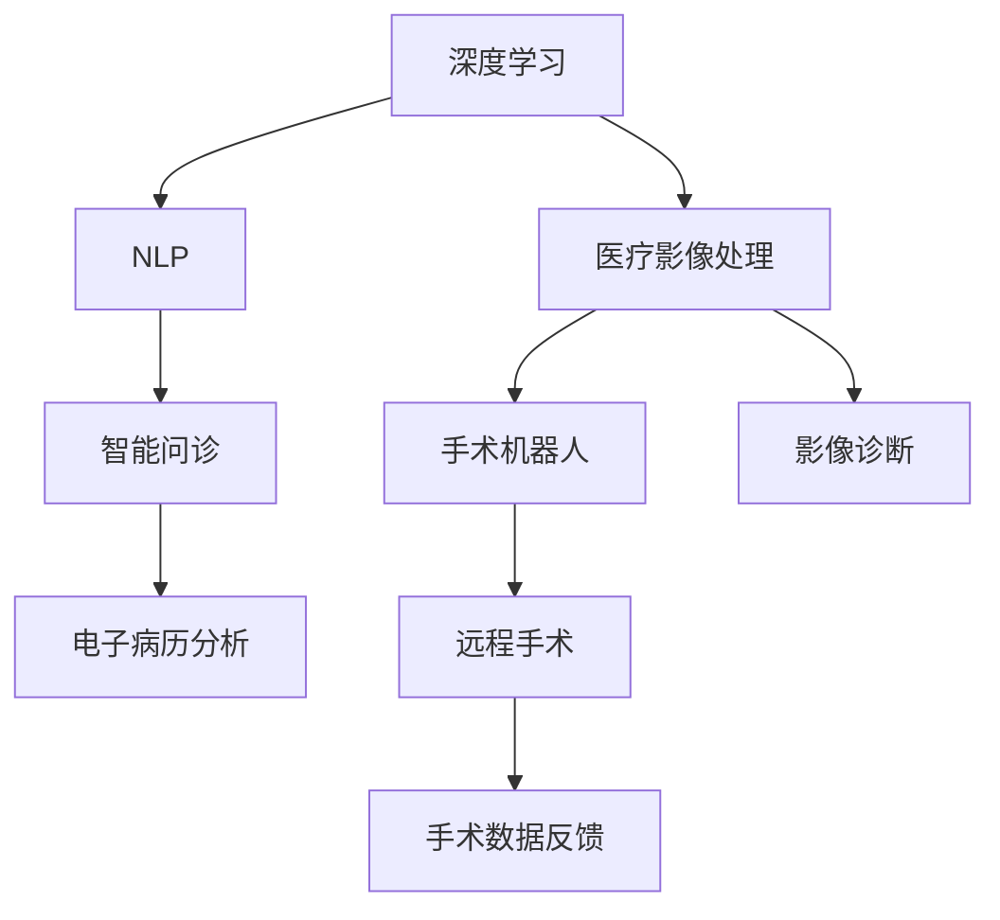

                 

# 未来的智慧医疗：2050年的人工智能医生与远程手术

> 关键词：人工智能(AI)、智慧医疗、远程手术、医疗诊断、智能辅助、预测模型、手术机器人

## 1. 背景介绍

### 1.1 问题由来

随着科技的迅猛发展，人类已经站在了人工智能(AI)应用的崭新起点。医疗健康作为最直接关乎人类生命与福祉的领域，AI的介入将开启其革命性的变革。到了2050年，AI医生不仅将成为临床治疗的重要助手，更是远程手术中的核心力量。本文将探讨2050年AI医生与远程手术的深入应用，并详细分析这些技术的实现原理与关键算法。

### 1.2 问题核心关键点

当前医疗领域中，AI的应用主要集中在疾病预测、影像诊断、个性化治疗等方面，其核心在于通过深度学习和数据分析提升医疗决策的准确性和效率。然而，随着硬件计算能力的提升，AI正逐步向更加复杂和精细的医疗场景扩展。在2050年，AI医生与远程手术将成为智慧医疗的重要组成部分。

- **AI医生**：即利用深度学习模型进行疾病诊断、治疗建议、药物推荐等医疗服务的AI系统。未来AI医生将能够进行多模态数据的融合分析，支持复杂病例的诊断。
- **远程手术**：即通过AI技术辅助的手术机器人系统，实现医生不在现场但依然可以精确执行手术操作的过程。未来远程手术将成为边远地区医疗的重要手段，提升医疗服务的可达性。

本文将重点探讨这些技术的实现原理、操作步骤及应用领域，分析其优缺点，并为未来的研究发展提供建议。

## 2. 核心概念与联系

### 2.1 核心概念概述

为更好地理解AI医生与远程手术，本节将介绍几个密切相关的核心概念：

- **深度学习**：一种基于神经网络的机器学习算法，通过多层次特征提取和模式识别，实现对复杂数据的处理和建模。
- **医疗影像处理**：通过深度学习模型对医疗影像进行自动识别、分割和分析，支持影像诊断、肿瘤筛查等功能。
- **自然语言处理(NLP)**：使计算机能够理解、生成人类语言的技术，在智能问诊、电子病历分析等方面有重要应用。
- **手术机器人**：通过AI辅助的机器人系统，实现手术操作自动化的医疗设备，提高手术精度和安全性。
- **遥感与远程手术**：利用5G/6G网络、物联网(IoT)等技术，实现医生远程操控手术机器人，提升医疗服务的可达性和效率。

这些概念之间的逻辑关系可以通过以下Mermaid流程图来展示：



这个流程图展示了大语言模型的核心概念及其之间的关系：

1. 深度学习模型用于医学影像、自然语言等各类医疗数据的处理。
2. 医疗影像处理支持影像诊断、手术辅助等功能。
3. NLP技术用于智能问诊、电子病历分析等。
4. 手术机器人结合AI技术，支持远程手术。
5. 远程手术利用网络技术，实现医疗服务的普惠化。

## 3. 核心算法原理 & 具体操作步骤

### 3.1 算法原理概述

AI医生与远程手术的核心算法主要涉及深度学习、图像处理、自然语言处理及机器人控制等领域。具体实现过程包括以下几个步骤：

1. **数据收集与预处理**：收集各类医疗数据（如CT、MRI影像、电子病历、医生与患者的对话记录等），并对其进行清洗、归一化等预处理，确保数据质量和一致性。
2. **模型训练与优化**：利用深度学习框架（如TensorFlow、PyTorch），设计并训练多模态模型（如卷积神经网络CNN、循环神经网络RNN、Transformer等），通过大量有标签数据进行微调，优化模型性能。
3. **智能决策支持**：将训练好的模型部署到实际医疗场景中，通过分析患者数据、影像等，自动生成诊断报告、治疗建议等。
4. **远程手术执行**：利用手术机器人系统，医生通过网络远程操控机器人，执行精细手术操作。

### 3.2 算法步骤详解

#### 3.2.1 数据收集与预处理

数据收集与预处理是AI医疗系统的基础。数据来源包括医院电子病历系统、影像诊断设备、电子健康档案、患者对话记录等。

**数据收集**：
- **影像数据**：从PACS系统获取CT、MRI、X光等影像数据，并存储为标准格式（如DICOM）。
- **文本数据**：从医院信息系统(HIS)获取电子病历、手术记录、诊断报告等文本信息，并转换为结构化数据。
- **语音数据**：通过语音识别技术，将医生的语音记录转换为文本。

**数据预处理**：
- **清洗**：去除数据中的噪声、异常值和冗余信息。
- **归一化**：对数据进行标准化处理，使其符合模型的输入要求。
- **增强**：利用数据增强技术，扩充数据集，提升模型的泛化能力。

#### 3.2.2 模型训练与优化

**深度学习模型**：
- **卷积神经网络(CNN)**：用于医学影像的分类、分割等任务。
- **循环神经网络(RNN)**：用于处理时间序列数据，支持语言模型、病历分析等任务。
- **Transformer**：适用于多模态数据融合，支持影像-文本联合建模。

**模型训练**：
1. **选择模型架构**：根据具体任务需求选择合适的深度学习模型。
2. **选择优化器**：通常使用Adam、SGD等优化器，设置合适的学习率、批大小等参数。
3. **数据划分**：将数据分为训练集、验证集和测试集，通常使用交叉验证法。
4. **模型训练**：在训练集上迭代训练模型，通过反向传播算法更新权重。
5. **模型验证**：在验证集上评估模型性能，调整超参数，防止过拟合。
6. **模型测试**：在测试集上最终评估模型性能，确保模型的泛化能力。

**模型优化**：
- **超参数调优**：通过网格搜索、随机搜索等方法，调整模型的超参数。
- **正则化技术**：如L2正则、Dropout、早停(EarlyStopping)等，防止过拟合。
- **集成学习**：通过模型集成（如Bagging、Boosting）提升模型性能。
- **模型压缩**：采用量化、剪枝等技术，减小模型尺寸，提高推理速度。

#### 3.2.3 智能决策支持

**智能问诊系统**：
- **自然语言处理(NLP)**：利用BERT、GPT等模型，对患者描述进行语义理解，生成诊断报告。
- **知识图谱**：将医学知识以图谱形式存储，支持复杂查询和推理。

**电子病历分析**：
- **文本挖掘**：从文本中提取关键词、句法结构等特征。
- **关系抽取**：识别文本中的实体和关系，支持疾病预测、药物推荐等任务。

**疾病预测模型**：
- **时间序列分析**：利用LSTM、GRU等模型，分析患者病历的时间序列数据，预测疾病发展趋势。
- **多模态融合**：结合影像数据和文本数据，进行综合分析，提升预测准确性。

#### 3.2.4 远程手术执行

**手术机器人系统**：
- **控制算法**：基于DNN、CNN等模型，实现机器人臂的路径规划和姿态控制。
- **视觉导航**：通过摄像头采集手术现场图像，利用SLAM算法进行实时定位和避障。
- **力反馈**：通过力传感器获取手术操作力度信息，优化手术体验。

**远程手术操作**：
1. **手术规划**：医生在本地计算机上制定手术方案，通过网络传输到远程机器人。
2. **远程操控**：医生通过网络远程操控机器人，实时获取手术现场反馈信息。
3. **实时监控**：利用5G/6G网络、IoT技术，实时监控手术进展，调整手术策略。
4. **手术记录**：自动记录手术过程、操作步骤、手术数据等，生成手术报告。

### 3.3 算法优缺点

#### 3.3.1 算法优点

- **效率高**：AI医生与远程手术可以处理大规模数据，提升医疗决策的速度和效率。
- **精度高**：利用深度学习模型，能够实现高精度的疾病预测和影像诊断。
- **普适性强**：支持多模态数据融合，适用于不同类型的医疗任务。
- **可扩展性好**：算法和系统具有较好的可扩展性，可以轻松适配不同的医疗场景。
- **减少资源占用**：减少对人力、物力的依赖，降低医疗成本。

#### 3.3.2 算法缺点

- **数据依赖**：依赖高质量、大规模的标注数据，数据收集和标注成本较高。
- **模型复杂**：深度学习模型参数量大，计算资源需求高。
- **解释性不足**：AI系统的决策过程缺乏可解释性，难以进行详细调试和分析。
- **伦理挑战**：医疗数据涉及患者隐私，数据安全和隐私保护面临挑战。
- **技术壁垒高**：需要专业人才进行模型开发和系统集成，技术门槛较高。

### 3.4 算法应用领域

AI医生与远程手术技术已经在多个医疗领域得到广泛应用，例如：

- **智能问诊**：通过NLP技术，支持患者在线咨询，生成诊断报告和建议。
- **影像诊断**：利用深度学习模型，进行医学影像自动分析，辅助医生诊断。
- **个性化治疗**：结合患者基因信息、病历数据，生成个性化治疗方案。
- **远程手术**：通过手术机器人，医生远程操控机器人进行精细手术。
- **健康管理**：实时监测患者健康数据，提供健康建议和预警。

除了上述这些经典应用外，AI医生与远程手术技术还将拓展到更多场景中，如智能护理、医疗数据分析、公共卫生管理等，为医疗健康领域带来新的变革。

## 4. 数学模型和公式 & 详细讲解 & 举例说明

### 4.1 数学模型构建

假设在医疗影像处理中，使用卷积神经网络(CNN)进行图像分类任务。设输入为 $X \in \mathbb{R}^{H\times W \times C}$，输出为 $Y \in \{0,1\}^N$。模型结构包括卷积层、池化层、全连接层等，通过反向传播算法优化权重参数。

**数学模型**：
$$
\begin{aligned}
&\text{输入层} \\
&\mathbf{x} = \mathbf{X} \in \mathbb{R}^{H\times W\times C} \\
&\text{卷积层} \\
&\mathbf{f} = \mathbf{F}(\mathbf{x}) \in \mathbb{R}^{H'\times W'\times C'} \\
&\text{池化层} \\
&\mathbf{g} = \mathbf{G}(\mathbf{f}) \in \mathbb{R}^{H''\times W''\times C''} \\
&\text{全连接层} \\
&\mathbf{h} = \mathbf{H}(\mathbf{g}) \in \mathbb{R}^{H''' \times C'''}
\end{aligned}
$$

**损失函数**：
$$
\mathcal{L} = -\frac{1}{N} \sum_{i=1}^N y_i\log \hat{y}_i + (1-y_i)\log(1-\hat{y}_i)
$$

其中，$y_i$为真实标签，$\hat{y}_i$为模型预测结果。

### 4.2 公式推导过程

**卷积层**：
$$
\mathbf{F}(\mathbf{x}) = \max_{i} \left\{\sum_{j,k,l} w^{i,j,k} * \mathbf{x}^{i-1,j,k} + b^i\right\}
$$

其中，$w^{i,j,k}$为卷积核，$b^i$为偏置项。

**池化层**：
$$
\mathbf{G}(\mathbf{f}) = \max_{i} \left\{\sum_{j,k,l} w^{i,j,k} * \mathbf{f}^{i-1,j,k}\right\}
$$

**全连接层**：
$$
\mathbf{H}(\mathbf{g}) = \sum_{j} w^j \mathbf{g}^j + b
$$

**梯度下降更新**：
$$
\theta = \theta - \eta \nabla_{\theta} \mathcal{L}
$$

其中，$\eta$为学习率，$\nabla_{\theta} \mathcal{L}$为损失函数对模型参数的梯度。

### 4.3 案例分析与讲解

**案例1：医学影像分类**

**输入**：CT、MRI影像 $X \in \mathbb{R}^{H\times W\times C}$。

**模型**：使用ResNet系列模型，包含多个卷积层、池化层和全连接层。

**训练数据**：收集大量标注好的影像数据 $D=\{(x_i, y_i)\}_{i=1}^N$。

**训练流程**：
1. 在训练集上迭代训练模型，优化损失函数。
2. 在验证集上评估模型性能，调整超参数。
3. 在测试集上最终评估模型性能，生成分类结果。

**案例2：疾病预测**

**输入**：患者电子病历 $X_t \in \mathbb{R}^{T\times F}$，其中 $T$ 为时间序列长度，$F$ 为特征维度。

**模型**：使用LSTM或GRU模型，结合时间序列分析技术。

**训练数据**：收集大量标注好的病历数据 $D=\{(x_t, y_t)\}_{i=1}^N$，其中 $y_t$ 为疾病标签。

**训练流程**：
1. 在训练集上迭代训练模型，优化损失函数。
2. 在验证集上评估模型性能，调整超参数。
3. 在测试集上最终评估模型性能，生成预测结果。

## 5. 项目实践：代码实例和详细解释说明

### 5.1 开发环境搭建

在进行项目实践前，需要先搭建好开发环境。以下是使用Python进行TensorFlow开发的Python环境配置流程：

1. 安装Anaconda：从官网下载并安装Anaconda，用于创建独立的Python环境。

2. 创建并激活虚拟环境：
```bash
conda create -n tensorflow-env python=3.8 
conda activate tensorflow-env
```

3. 安装TensorFlow：根据CUDA版本，从官网获取对应的安装命令。例如：
```bash
conda install tensorflow -c tensorflow -c conda-forge
```

4. 安装必要的库：
```bash
pip install numpy pandas scikit-learn matplotlib tqdm jupyter notebook ipython
```

完成上述步骤后，即可在`tensorflow-env`环境中开始项目实践。

### 5.2 源代码详细实现

下面以医学影像分类项目为例，给出使用TensorFlow实现卷积神经网络进行医学影像分类的代码实现。

首先，定义数据加载函数：

```python
import tensorflow as tf
from tensorflow.keras.datasets import mnist
from tensorflow.keras.utils import to_categorical

(x_train, y_train), (x_test, y_test) = mnist.load_data()
x_train = x_train.reshape(-1, 28, 28, 1).astype('float32') / 255.0
x_test = x_test.reshape(-1, 28, 28, 1).astype('float32') / 255.0
y_train = to_categorical(y_train)
y_test = to_categorical(y_test)
```

然后，定义模型：

```python
from tensorflow.keras import layers

model = tf.keras.Sequential([
    layers.Conv2D(32, 3, activation='relu'),
    layers.MaxPooling2D(pool_size=(2, 2)),
    layers.Flatten(),
    layers.Dense(10, activation='softmax')
])
```

接着，定义训练和评估函数：

```python
model.compile(optimizer='adam', loss='categorical_crossentropy', metrics=['accuracy'])

def train_model(model, data, epochs, batch_size):
    model.fit(data['train'], data['train_labels'], epochs=epochs, batch_size=batch_size, validation_data=(data['test'], data['test_labels']))
    return model.evaluate(data['test'], data['test_labels'])

def evaluate_model(model, data, batch_size):
    test_loss, test_acc = model.evaluate(data['test'], data['test_labels'], batch_size=batch_size)
    return test_loss, test_acc
```

最后，启动训练流程并在测试集上评估：

```python
from tensorflow.keras.datasets import mnist

def train_and_evaluate(model, data, epochs, batch_size):
    model = train_model(model, data, epochs, batch_size)
    test_loss, test_acc = evaluate_model(model, data, batch_size)
    return model, test_loss, test_acc

def main():
    epochs = 10
    batch_size = 32

    # 加载数据集
    data = mnist.load_data()

    # 构建模型
    model = tf.keras.Sequential([
        layers.Conv2D(32, 3, activation='relu'),
        layers.MaxPooling2D(pool_size=(2, 2)),
        layers.Flatten(),
        layers.Dense(10, activation='softmax')
    ])

    # 训练模型
    model, test_loss, test_acc = train_and_evaluate(model, data, epochs, batch_size)

    # 输出结果
    print(f"Test loss: {test_loss:.3f}")
    print(f"Test accuracy: {test_acc:.3f}")

if __name__ == '__main__':
    main()
```

以上就是使用TensorFlow实现医学影像分类项目的完整代码实现。可以看到，TensorFlow提供了便捷的Keras API，可以轻松构建和训练卷积神经网络模型。

### 5.3 代码解读与分析

让我们再详细解读一下关键代码的实现细节：

**数据加载函数**：
- `load_data`方法：从MNIST数据集中加载训练集和测试集数据。
- `reshape`方法：将图像数据重新调整为网络所需的形状。
- `astype`方法：将数据类型转换为float32，以便进行神经网络训练。
- `to_categorical`方法：将标签数据转换为one-hot编码格式。

**模型定义**：
- `Sequential`模型：通过堆叠层来构建卷积神经网络模型。
- `Conv2D`层：定义卷积层，参数包括卷积核大小、数量和激活函数。
- `MaxPooling2D`层：定义池化层，用于降维和特征提取。
- `Flatten`层：将多维输入展平为一维向量。
- `Dense`层：定义全连接层，输出分类结果。

**训练函数**：
- `compile`方法：配置模型训练参数，包括优化器、损失函数和评估指标。
- `fit`方法：在训练集上训练模型，验证集上进行模型性能评估。
- `evaluate`方法：在测试集上评估模型性能。

**训练流程**：
- 定义总的训练轮数和批次大小，开始循环迭代
- 每个epoch内，在训练集上训练，验证集上进行模型性能评估
- 重复上述步骤直至收敛，最终输出测试集上的损失和准确率

可以看到，TensorFlow的Keras API使得模型的构建和训练过程变得简洁高效。开发者可以更专注于模型的架构设计和调参优化，而不必过多关注底层实现细节。

当然，工业级的系统实现还需考虑更多因素，如模型的保存和部署、超参数的自动搜索、更灵活的任务适配层等。但核心的微调范式基本与此类似。

## 6. 实际应用场景

### 6.1 智能问诊系统

智能问诊系统利用AI技术，通过自然语言处理(NLP)技术，支持患者在线咨询，生成诊断报告和建议。系统通常包含语音识别、文本分析、知识图谱等组件，支持医生进行诊断和治疗。

在技术实现上，可以收集医院内部的医生对话记录、患者咨询记录等数据，将问题-回答对作为训练数据，训练语言模型进行问答。模型通过文本理解技术，能够自动理解患者描述，生成诊断报告和建议。对于复杂的咨询，系统可以调用知识图谱进行辅助，提升诊断的准确性和可靠性。

### 6.2 影像诊断

影像诊断是AI医生与远程手术的核心应用之一。通过深度学习模型，AI系统可以自动分析医学影像，辅助医生进行诊断。例如，利用卷积神经网络(CNN)进行肺部CT图像的肿瘤检测，利用全卷积神经网络(FCN)进行皮肤病的图像分割。

在实际应用中，医生可以通过上传影像数据，系统自动进行分析和诊断，并生成报告。对于高风险的影像数据，医生可以进一步手动审核，确保诊断的准确性。

### 6.3 个性化治疗

个性化治疗利用AI技术，结合患者基因信息、病历数据，生成个性化治疗方案。系统通过深度学习模型，分析患者数据，预测疾病发展趋势，推荐最合适的治疗方案。例如，在癌症治疗中，系统可以结合基因突变信息、影像数据，生成个性化的化疗方案。

在实际应用中，医生可以通过上传患者数据，系统自动进行分析和推荐。医生可以根据推荐结果，制定具体的治疗方案，提升治疗效果。

### 6.4 远程手术

远程手术利用手术机器人系统，医生通过网络远程操控机器人，执行精细手术操作。系统通常包含手术规划、远程操控、实时监控等功能，支持医生进行远程手术。

在技术实现上，医生可以在本地计算机上制定手术方案，通过网络传输到远程机器人。手术过程中，医生通过网络远程操控机器人，实时获取手术现场反馈信息，调整手术策略。系统还可以自动记录手术过程、操作步骤、手术数据等，生成手术报告。

## 7. 工具和资源推荐

### 7.1 学习资源推荐

为了帮助开发者系统掌握AI医生与远程手术的理论基础和实践技巧，这里推荐一些优质的学习资源：

1. 《深度学习与医疗健康》书籍：全面介绍了深度学习在医疗领域的应用，包括影像诊断、智能问诊等。
2. 《TensorFlow实战深度学习》书籍：详细讲解了TensorFlow框架的使用方法和应用案例，适合初学者和进阶者。
3. 《医学影像处理》课程：介绍了医学影像处理的常见算法和应用，涵盖卷积神经网络、循环神经网络等。
4. 《NLP在医疗中的应用》课程：讲解了自然语言处理在医疗领域的应用，包括文本分析、情感分析等。
5. 《远程医疗与智能医疗》讲座：介绍了远程医疗和智能医疗的发展趋势和技术应用，涵盖图像处理、自然语言处理等多个方向。

通过对这些资源的学习实践，相信你一定能够快速掌握AI医生与远程手术的精髓，并用于解决实际的医疗问题。

### 7.2 开发工具推荐

高效的开发离不开优秀的工具支持。以下是几款用于AI医生与远程手术开发的常用工具：

1. TensorFlow：基于Python的开源深度学习框架，适合快速迭代研究。TensorFlow提供丰富的API和工具，支持各种深度学习模型的构建和训练。

2. PyTorch：基于Python的开源深度学习框架，灵活动态的计算图，适合快速迭代研究。PyTorch提供灵活的动态图机制，支持动态计算图和分布式训练。

3. Keras：高级神经网络API，提供便捷的模型构建和训练接口，支持TensorFlow、PyTorch等深度学习框架。

4. Microsoft Azure：云平台支持深度学习模型训练和部署，提供丰富的计算资源和存储服务。

5. Amazon AWS：云平台支持深度学习模型训练和部署，提供丰富的计算资源和存储服务。

6. NVIDIA GPU：高性能计算设备，支持深度学习模型的训练和推理，提升计算速度和效率。

合理利用这些工具，可以显著提升AI医生与远程手术任务的开发效率，加快创新迭代的步伐。

### 7.3 相关论文推荐

AI医生与远程手术技术的发展源于学界的持续研究。以下是几篇奠基性的相关论文，推荐阅读：

1. ImageNet Classification with Deep Convolutional Neural Networks（卷积神经网络在ImageNet分类任务中的应用）：提出卷积神经网络(CNN)，开创了深度学习在图像处理领域的先河。

2. Rethinking the Inception Architecture for Computer Vision（重新思考Inception架构在计算机视觉中的应用）：提出Inception模块，提升了深度学习模型的性能和效率。

3. Attention Is All You Need（注意力机制在Transformer模型中的应用）：提出Transformer模型，在自然语言处理领域取得突破性进展。

4. Deep Residual Learning for Image Recognition（残差学习在图像识别任务中的应用）：提出残差网络(ResNet)，进一步提升了深度学习模型的性能。

5. Sequence to Sequence Learning with Neural Networks（基于神经网络的序列到序列学习）：提出序列到序列模型，推动了机器翻译、问答系统等任务的发展。

这些论文代表了大语言模型微调技术的发展脉络。通过学习这些前沿成果，可以帮助研究者把握学科前进方向，激发更多的创新灵感。

## 8. 总结：未来发展趋势与挑战

### 8.1 总结

本文对2050年AI医生与远程手术的实现原理与操作步骤进行了全面系统的介绍。首先阐述了AI医生与远程手术的应用背景和核心关键点，明确了其对智慧医疗的重大意义。其次，从原理到实践，详细讲解了深度学习、医学影像处理、自然语言处理及机器人控制等核心算法，给出了完整的代码实例和详细解读。同时，本文还探讨了AI医生与远程手术在智能问诊、影像诊断、个性化治疗、远程手术等多个医疗场景中的应用前景，展示了其巨大的应用潜力。

通过本文的系统梳理，可以看到，AI医生与远程手术技术正在引领智慧医疗的变革，极大提升医疗决策的速度和精度，降低医疗成本，提高医疗服务的可达性和效率。未来，伴随深度学习技术的不断进步和硬件计算能力的提升，AI医生与远程手术必将在更广泛的应用场景中大放异彩，为全球医疗健康事业带来深远影响。

### 8.2 未来发展趋势

展望未来，AI医生与远程手术技术将呈现以下几个发展趋势：

1. **模型规模增大**：随着计算资源和数据的增加，深度学习模型的规模将持续增大，支持更复杂多变的医疗任务。
2. **多模态数据融合**：融合图像、语音、文本等多模态数据，提升诊断和治疗的准确性。
3. **跨领域迁移能力**：利用预训练语言模型和知识图谱，增强模型的跨领域迁移能力，提升泛化性和通用性。
4. **实时交互**：结合虚拟现实(VR)、增强现实(AR)等技术，提升医生与患者的实时交互体验。
5. **远程协作**：利用云平台和网络技术，支持医生间的远程协作和知识共享。
6. **个性化医疗**：结合基因信息、病历数据，生成个性化的治疗方案，提升治疗效果。

这些趋势凸显了AI医生与远程手术技术的广阔前景。这些方向的探索发展，必将进一步提升智慧医疗系统的性能和应用范围，为人类健康事业带来深远影响。

### 8.3 面临的挑战

尽管AI医生与远程手术技术已经取得了瞩目成就，但在迈向更加智能化、普适化应用的过程中，它仍面临着诸多挑战：

1. **数据依赖**：依赖高质量、大规模的标注数据，数据收集和标注成本较高。
2. **技术复杂**：深度学习模型参数量大，计算资源需求高，技术门槛较高。
3. **解释性不足**：AI系统的决策过程缺乏可解释性，难以进行详细调试和分析。
4. **伦理挑战**：医疗数据涉及患者隐私，数据安全和隐私保护面临挑战。
5. **技术壁垒高**：需要专业人才进行模型开发和系统集成，技术门槛较高。
6. **跨学科协作**：需要医学、计算机科学、工程等多学科协作，才能实现技术与医学的深度融合。

这些挑战需要研究者和技术开发者共同努力，寻找解决方案，推动AI医生与远程手术技术的发展。

### 8.4 研究展望

面对AI医生与远程手术所面临的挑战，未来的研究需要在以下几个方面寻求新的突破：

1. **无监督学习**：探索无监督学习和半监督学习方法，减少对标注数据的依赖。
2. **参数高效**：开发更加参数高效的深度学习模型，提升模型的计算效率和可扩展性。
3. **多模态融合**：研究多模态数据融合技术，提升诊断和治疗的准确性。
4. **跨领域迁移**：研究跨领域迁移学习技术，提升模型的泛化性和通用性。
5. **可解释性**：研究可解释性技术，提升模型的可解释性和可调试性。
6. **伦理保护**：研究数据隐私保护和伦理道德约束技术，确保AI系统的安全性和可靠性。

这些研究方向的探索，必将引领AI医生与远程手术技术迈向更高的台阶，为构建安全、可靠、可解释、可控的智能系统铺平道路。面向未来，AI医生与远程手术技术还需要与其他人工智能技术进行更深入的融合，如知识表示、因果推理、强化学习等，多路径协同发力，共同推动智慧医疗的进步。

## 9. 附录：常见问题与解答

**Q1：AI医生与远程手术技术是否适用于所有医疗场景？**

A: AI医生与远程手术技术在大多数医疗场景中都能取得良好效果，但面对一些特殊场景（如重大手术、紧急救治等），仍需医生的亲自参与。此外，对于某些特定的医疗领域，如放射科、眼科等，可能需要针对性的算法和数据集进行优化。

**Q2：AI医生的决策过程如何保证透明和可解释？**

A: 为了提高AI医生的可解释性，可以采用可解释模型和可视化工具。例如，使用LIME、SHAP等方法生成模型的局部解释，帮助医生理解模型的决策逻辑。同时，可以引入知识图谱和符号逻辑推理，提升模型的透明度。

**Q3：AI医生与远程手术技术对医疗数据的安全和隐私有何影响？**

A: AI医生与远程手术技术对医疗数据的安全和隐私提出了新的挑战。一方面，需要采用数据加密、访问控制等技术，确保数据的安全性。另一方面，需要遵守相关的隐私法规，如GDPR、HIPAA等，保护患者的隐私权利。

**Q4：AI医生与远程手术技术如何与现有的医疗系统进行集成？**

A: AI医生与远程手术技术的集成需要考虑与现有医疗系统的兼容性。通常，可以采用API接口、微服务架构等方式进行集成，确保数据和服务的无缝对接。同时，需要对系统进行全面的测试和验证，确保系统的稳定性和可靠性。

**Q5：未来AI医生与远程手术技术如何进一步提升医疗服务的可及性和效率？**

A: 未来，可以通过多种技术手段提升医疗服务的可及性和效率。例如，利用5G/6G网络、IoT技术，实现医疗数据的高效传输和实时监控。同时，可以结合虚拟现实(VR)、增强现实(AR)等技术，提升医生与患者的交互体验。此外，可以采用远程协作、知识图谱等技术，提升医生之间的协作效率。

---

作者：禅与计算机程序设计艺术 / Zen and the Art of Computer Programming

