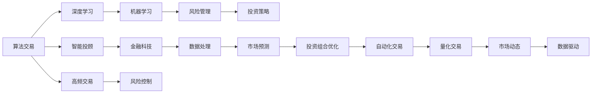

                 

# 未来的智能投资：2050年的算法交易与智能投顾

> 关键词：智能投顾,算法交易,机器学习,深度学习,金融科技,风险管理,自动化投资

## 1. 背景介绍

### 1.1 问题由来
随着人工智能技术在金融行业的广泛应用，算法交易和智能投顾（Robo-Advisors）正逐渐改变着传统的投资管理模式。这些技术不仅提高了金融服务的效率和智能化水平，还为投资者提供了更个性化、更精准的投资建议。然而，随着市场环境和技术发展的不断变化，传统的投资策略和技术手段已经难以满足新形势下金融市场的需求。本文旨在探讨未来智能投资的发展趋势，特别是在2050年，算法交易与智能投顾技术将如何进一步演进，以及它们将如何重塑金融行业的格局。

### 1.2 问题核心关键点
未来的智能投资将依托于更先进的算法交易和智能投顾技术，通过深度学习和机器学习等技术手段，实现更精准的投资策略制定、风险管理和资产配置。核心关键点包括：
- 深度学习在金融数据分析中的应用，特别是在非结构化数据处理和金融市场预测方面的突破。
- 智能投顾的个性化推荐系统，能够根据投资者的风险偏好和市场动态，动态调整投资组合。
- 自动化交易系统的不断优化，包括高频交易和量化交易策略的迭代。
- 风险管理技术的提升，特别是在极端市场环境下的风险控制。
- 投资组合的多样化策略，包括跨市场、跨资产类别的多元化配置。

这些关键点将驱动未来智能投资的发展，使其在精度、效率和风险管理能力上进一步提升，为投资者和金融机构带来更多价值。

### 1.3 问题研究意义
探索2050年算法交易与智能投顾的未来发展，对于理解金融科技的最新趋势、优化投资管理策略、提升金融服务的智能化水平具有重要意义。具体而言：
- 为投资者提供更精准、更个性化的投资建议，提高投资回报率。
- 推动金融机构进行数字化转型，提升运营效率和市场竞争力。
- 促进金融市场的稳定性和透明度，增强市场信心。
- 激发更多的金融科技创新，为传统金融行业注入新活力。

## 2. 核心概念与联系

### 2.1 核心概念概述

为更好地理解未来智能投资的发展，本节将介绍几个关键概念及其联系：

- **算法交易**：通过编程算法实现自动化买卖股票或其他金融资产的过程。算法交易可以大幅提高交易效率，降低交易成本，但也可能带来高频交易风险和市场操纵问题。

- **智能投顾**：利用人工智能技术，提供个性化投资建议和资产配置服务的投顾服务模式。智能投顾能够根据投资者的风险偏好和市场动态，动态调整投资组合，提供更精准的投资建议。

- **深度学习**：一种基于神经网络的机器学习方法，通过多层次的非线性映射，能够处理复杂的数据结构，广泛应用于金融数据分析、市场预测和投资组合优化等领域。

- **机器学习**：通过数据驱动的方法，训练模型进行决策和预测，特别适用于金融市场中的风险管理和投资策略制定。

- **金融科技**：结合金融服务与信息科技，通过大数据、云计算、人工智能等技术手段，提升金融服务的效率和智能化水平。

这些核心概念通过深度学习和机器学习技术紧密联系，共同构成了未来智能投资的技术基础。

### 2.2 核心概念原理和架构的 Mermaid 流程图(Mermaid 流程节点中不要有括号、逗号等特殊字符)



此流程图展示了未来智能投资中各核心概念之间的联系。深度学习与机器学习提供了算法交易和智能投顾的技术支持，金融科技则实现了这些技术的商业化和落地应用。风险管理、数据处理和市场预测等技术手段，为智能投资提供了必要的分析工具和决策依据。

## 3. 核心算法原理 & 具体操作步骤

### 3.1 算法原理概述

未来智能投资的算法交易与智能投顾技术，基于深度学习和机器学习等先进技术，通过分析海量数据，实现精准的市场预测、投资策略制定和风险管理。核心算法原理如下：

1. **市场预测**：通过深度学习模型，对历史市场数据进行分析和建模，预测未来市场走势。常见模型包括长短期记忆网络（LSTM）、卷积神经网络（CNN）和自注意力模型等。

2. **投资组合优化**：利用机器学习算法，根据投资者的风险偏好和市场动态，动态调整投资组合。常见算法包括Markowitz模型、遗传算法和强化学习等。

3. **自动化交易**：通过算法交易系统，根据市场预测和投资策略，自动化执行买卖操作。常见算法包括高频交易算法和量化交易算法。

4. **风险管理**：利用机器学习模型，实时监测市场风险，采取动态风险控制措施。常见方法包括基于VAR的风险评估和贝叶斯网络的风险预测。

### 3.2 算法步骤详解

基于上述原理，未来的智能投资主要包括以下步骤：

1. **数据收集与预处理**：收集历史市场数据、财务数据、新闻数据等，并进行清洗、归一化等预处理操作。

2. **模型训练与验证**：选择适合的深度学习或机器学习模型，利用历史数据进行训练和验证，优化模型参数。

3. **市场预测与策略制定**：基于训练好的模型，进行市场预测和投资策略制定，生成投资建议。

4. **自动化交易执行**：根据投资策略，自动化执行买卖操作，实现算法交易。

5. **风险监控与控制**：实时监测市场风险，采取动态风险控制措施，确保投资组合稳定。

### 3.3 算法优缺点

未来智能投资算法交易与智能投顾技术的优点包括：
- 高效精准：通过深度学习和机器学习技术，实现精准的市场预测和投资策略制定，提高投资回报率。
- 个性化服务：智能投顾能够根据投资者的风险偏好和市场动态，提供个性化投资建议。
- 全天候服务：算法交易可以实现全天候自动化交易，减少人为因素的干扰。
- 提高效率：自动化交易和智能投顾大幅提高了交易效率，降低了人工成本。

但同时也存在一些缺点：
- 模型依赖数据：模型的性能依赖于历史数据的完整性和质量，数据偏差可能导致模型失效。
- 市场风险：高频交易和自动化交易可能导致市场波动，存在较高的市场风险。
- 技术复杂性：算法交易和智能投顾涉及复杂的技术手段，需要高水平的开发和运维团队。
- 缺乏人性化因素：智能投顾缺乏人性化的投资建议，可能难以应对复杂多变的市场环境。

### 3.4 算法应用领域

未来智能投资技术广泛应用于以下领域：

1. **量化投资**：通过数学模型和算法，实现精准的市场预测和投资组合优化。
2. **高频交易**：利用高频算法，在极短时间内执行大量交易，获取微小市场波动带来的利润。
3. **智能投顾**：根据投资者风险偏好和市场动态，提供个性化投资建议和资产配置服务。
4. **风险管理**：通过实时监测市场风险，采取动态风险控制措施，保障投资组合稳定。
5. **跨市场投资**：利用多市场数据，进行跨市场资产配置，实现多元化投资。
6. **自动化交易**：实现全天候自动化交易，提高交易效率和精度。

这些应用领域展示了未来智能投资技术的广阔前景，为投资者和金融机构提供了更多创新和价值。

## 4. 数学模型和公式 & 详细讲解 & 举例说明

### 4.1 数学模型构建

未来智能投资的核心数学模型包括深度学习模型、机器学习模型和风险管理模型。以LSTM模型为例，构建未来智能投资的数学模型如下：

1. **深度学习模型**：LSTM模型具有记忆能力，能够处理时间序列数据。其数学模型为：

   $$
   \begin{aligned}
   h_t &= \tanh(W_h h_{t-1} + U_x x_t + b_h) \\
   \hat{c}_t &= \sigma(W_c h_{t-1} + U_x x_t + b_c) \\
   c_t &= \hat{c}_t \odot c_{t-1} + (1 - \hat{c}_t) \odot \tanh(h_t) \\
   o_t &= \sigma(W_o h_{t-1} + U_x x_t + b_o) \\
   y_t &= o_t \odot \sigma(W_y c_t + b_y)
   \end{aligned}
   $$

   其中，$h_t$ 为隐藏状态，$c_t$ 为记忆单元，$x_t$ 为输入数据，$y_t$ 为输出数据，$W$ 和 $U$ 为权重矩阵，$b$ 为偏置项，$\odot$ 为点乘操作，$\sigma$ 和 $\tanh$ 分别为Sigmoid函数和双曲正切函数。

2. **风险管理模型**：基于VAR（Value at Risk）的风险管理模型，用于评估投资组合的风险。其数学模型为：

   $$
   VAR(\alpha) = P(X < x) \cdot x + (1 - P(X < x)) \cdot \max(0, x - \mu)
   $$

   其中，$X$ 为投资组合的回报率，$\alpha$ 为置信度，$\mu$ 为投资组合的均值。

### 4.2 公式推导过程

LSTM模型的推导过程如下：

1. **隐藏状态更新**：

   $$
   h_t = \tanh(W_h h_{t-1} + U_x x_t + b_h)
   $$

   其中，$h_{t-1}$ 为前一时刻的隐藏状态，$x_t$ 为当前时刻的输入数据，$b_h$ 为偏置项，$W_h$ 和 $U_x$ 分别为隐藏层到隐藏层的权重和输入到隐藏层的权重。

2. **记忆单元更新**：

   $$
   \hat{c}_t = \sigma(W_c h_{t-1} + U_x x_t + b_c)
   $$

   $$
   c_t = \hat{c}_t \odot c_{t-1} + (1 - \hat{c}_t) \odot \tanh(h_t)
   $$

   其中，$\hat{c}_t$ 为记忆单元的更新门，$c_{t-1}$ 为前一时刻的记忆单元，$c_t$ 为当前时刻的记忆单元。

3. **输出层更新**：

   $$
   o_t = \sigma(W_o h_{t-1} + U_x x_t + b_o)
   $$

   $$
   y_t = o_t \odot \sigma(W_y c_t + b_y)
   $$

   其中，$o_t$ 为输出门的激活状态，$W_o$ 和 $U_x$ 分别为输出层到隐藏层的权重和输入到隐藏层的权重。

通过上述推导过程，LSTM模型能够处理时间序列数据，捕捉长期依赖关系，适用于金融市场的预测。

### 4.3 案例分析与讲解

以下以股票市场预测为例，展示深度学习模型在金融数据分析中的应用：

假设有一支股票的历史价格数据 $x = (x_1, x_2, ..., x_n)$，其中 $x_t$ 表示第 $t$ 天的收盘价。使用LSTM模型对未来一周的股票价格进行预测。具体步骤如下：

1. **数据准备**：将历史价格数据进行归一化处理，得到 $x_t^{\prime}$。

2. **模型训练**：使用历史价格数据 $x_t^{\prime}$ 训练LSTM模型，得到模型参数 $\theta$。

3. **预测未来价格**：将 $x_0^{\prime}$ 作为模型输入，预测未来一周的股票价格 $y = (y_1, y_2, ..., y_n)$。

   $$
   y_t = \sigma(W_y c_t + b_y)
   $$

   其中，$W_y$ 和 $b_y$ 分别为输出层的权重和偏置项。

通过LSTM模型，能够根据历史价格数据预测未来股票价格，为投资者提供投资建议。

## 5. 项目实践：代码实例和详细解释说明

### 5.1 开发环境搭建

在进行未来智能投资项目实践前，我们需要准备好开发环境。以下是使用Python进行TensorFlow开发的环境配置流程：

1. 安装Anaconda：从官网下载并安装Anaconda，用于创建独立的Python环境。

2. 创建并激活虚拟环境：
```bash
conda create -n tf-env python=3.8 
conda activate tf-env
```

3. 安装TensorFlow：从官网获取对应的安装命令。例如：
```bash
pip install tensorflow-gpu==2.6.0
```

4. 安装TensorFlow Addons：
```bash
pip install tensorflow-addons==0.18.0
```

5. 安装其他工具包：
```bash
pip install pandas numpy matplotlib scikit-learn
```

完成上述步骤后，即可在`tf-env`环境中开始未来智能投资项目开发。

### 5.2 源代码详细实现

下面我们以股票市场预测为例，给出使用TensorFlow对LSTM模型进行训练和预测的PyTorch代码实现。

首先，准备数据集：

```python
import numpy as np
import pandas as pd
from sklearn.preprocessing import MinMaxScaler
from sklearn.model_selection import train_test_split

# 加载历史价格数据
df = pd.read_csv('stock_prices.csv')
df = df.dropna()

# 归一化处理
scaler = MinMaxScaler(feature_range=(0, 1))
scaled_data = scaler.fit_transform(df['Close'].values.reshape(-1, 1))

# 划分训练集和测试集
training_size = int(len(scaled_data) * 0.8)
test_size = len(scaled_data) - training_size
train_data, test_data = scaled_data[0:training_size, :], scaled_data[training_size:len(scaled_data), :]

# 划分输入和输出
def create_dataset(dataset, look_back=1):
    dataX, dataY = [], []
    for i in range(len(dataset) - look_back - 1):
        dataX.append(dataset[i:(i + look_back), 0])
        dataY.append(dataset[i + look_back, 0])
    return np.array(dataX), np.array(dataY)

look_back = 30
trainX, trainY = create_dataset(train_data, look_back)
testX, testY = create_dataset(test_data, look_back)

# 数据批处理
batch_size = 64
trainX = np.reshape(trainX, (trainX.shape[0], trainX.shape[1], 1))
testX = np.reshape(testX, (testX.shape[0], testX.shape[1], 1))
```

然后，定义模型并编译：

```python
from tensorflow.keras.models import Sequential
from tensorflow.keras.layers import LSTM, Dense, Dropout

model = Sequential()
model.add(LSTM(units=50, return_sequences=True, input_shape=(look_back, 1)))
model.add(Dropout(0.2))
model.add(LSTM(units=50))
model.add(Dropout(0.2))
model.add(Dense(units=1))

model.compile(loss='mean_squared_error', optimizer='adam')
```

接着，训练模型：

```python
model.fit(trainX, trainY, epochs=100, batch_size=batch_size, verbose=2)
```

最后，进行预测并评估：

```python
trainPredict = model.predict(trainX)
testPredict = model.predict(testX)

# 反归一化处理
trainPredict = scaler.inverse_transform(trainPredict)
trainY = scaler.inverse_transform([trainY])
testPredict = scaler.inverse_transform(testPredict)
testY = scaler.inverse_transform([testY])

# 计算均方根误差
trainScore = np.sqrt(mean_squared_error(trainY[0], trainPredict[:, 0]))
print('Train Score: %.2f RMSE' % (trainScore))
testScore = np.sqrt(mean_squared_error(testY[0], testPredict[:, 0]))
print('Test Score: %.2f RMSE' % (testScore))
```

### 5.3 代码解读与分析

让我们再详细解读一下关键代码的实现细节：

**数据准备**：
- `MinMaxScaler`：用于将价格数据归一化到[0, 1]之间。
- `train_test_split`：将数据集划分为训练集和测试集，比例为8:2。

**模型定义**：
- `LSTM`：定义一个包含两个LSTM层和一个输出层的模型，每层后添加Dropout层进行正则化。
- `Dense`：定义一个全连接层，输出一个标量。

**模型编译**：
- `loss='mean_squared_error'`：定义损失函数为均方误差。
- `optimizer='adam'`：定义优化器为Adam。

**训练模型**：
- `model.fit`：使用训练数据集进行模型训练，设定100个epochs和批处理大小64。
- `verbose=2`：指定训练过程中的输出级别为2，即只打印进度条。

**预测和评估**：
- `model.predict`：使用测试数据集进行模型预测。
- `scaler.inverse_transform`：将预测结果反归一化处理，恢复原始数据尺度。
- `mean_squared_error`：计算均方根误差（RMSE），评估模型预测精度。

通过上述代码实现，我们展示了使用TensorFlow进行LSTM模型训练和预测的完整过程。开发者可以通过调整模型参数、增加或减少LSTM层数等方式，进一步优化模型性能。

## 6. 实际应用场景

### 6.1 智能投顾服务

智能投顾作为未来智能投资的重要应用，可以大幅提升投资管理的效率和精准度。通过智能投顾系统，投资者可以享受到以下服务：

1. **个性化推荐**：根据投资者的风险偏好、资产规模和历史投资行为，智能投顾能够提供个性化的投资组合建议。
2. **动态调整**：基于市场动态和投资者反馈，智能投顾能够动态调整投资组合，最大化投资回报率。
3. **资产配置**：智能投顾能够进行跨市场、跨资产类别的多元化配置，降低投资风险。
4. **自动化交易**：通过智能投顾系统，实现全天候自动化交易，提高交易效率和精度。

### 6.2 量化交易系统

量化交易系统是未来智能投资的核心技术之一。通过深度学习和机器学习算法，量化交易系统能够实现更精准的市场预测和投资策略制定。具体应用包括：

1. **高频交易**：利用高频算法，在极短时间内执行大量交易，获取微小市场波动带来的利润。
2. **量化策略制定**：基于历史市场数据和金融指标，量化交易系统能够制定精准的投资策略，提高投资回报率。
3. **风险管理**：通过实时监测市场风险，量化交易系统能够采取动态风险控制措施，保障投资组合稳定。

### 6.3 风险管理与合规系统

金融市场的风险管理与合规性要求不断提高，未来智能投资将进一步引入先进的技术手段。具体应用包括：

1. **极端市场风险监测**：通过深度学习模型，实时监测市场风险，采取动态风险控制措施，确保投资组合稳定。
2. **合规性检查**：利用机器学习算法，自动检测交易行为是否合规，防范违规操作。
3. **内幕交易检测**：通过自然语言处理技术，分析新闻、公告等文本信息，及时发现内幕交易线索。

### 6.4 未来应用展望

展望未来，智能投资技术将在多个领域实现突破和应用，具体如下：

1. **多模态数据分析**：结合文本、图像、音频等多种数据源，进行更全面的市场分析，提升投资决策的精准度。
2. **AI伦理与合规性**：引入AI伦理与合规性技术，确保智能投资系统的公正性和透明性。
3. **全球化投资管理**：通过智能投顾系统，实现跨市场、跨资产类别的全球化资产配置，降低投资风险。
4. **区块链技术应用**：利用区块链技术，实现资产的透明化、去中心化管理，提升投资安全性和合规性。
5. **隐私保护与数据安全**：通过隐私保护技术和数据安全技术，确保投资者的隐私和数据安全。

以上展望展示了未来智能投资技术的应用前景，为投资者和金融机构提供了更多的创新和价值。

## 7. 工具和资源推荐

### 7.1 学习资源推荐

为了帮助开发者系统掌握未来智能投资的核心技术，这里推荐一些优质的学习资源：

1. **TensorFlow官方文档**：提供了完整的TensorFlow开发指南和教程，适合新手入门。
2. **PyTorch官方文档**：提供了PyTorch的开发指南和教程，适合深度学习和机器学习的学习者。
3. **Kaggle竞赛平台**：提供了大量的金融数据分析和机器学习竞赛，可以参与实战练习。
4. **Coursera金融科技课程**：提供了金融科技领域的课程，涵盖大数据、区块链、智能投顾等多个方向。
5. **金融科技博客和论坛**：如FinTech、DataRobot等，提供最新的金融科技资讯和技术分享。

通过对这些资源的学习实践，相信你一定能够快速掌握未来智能投资的核心技术，并用于解决实际的金融问题。

### 7.2 开发工具推荐

高效的开发离不开优秀的工具支持。以下是几款用于未来智能投资开发的常用工具：

1. **TensorFlow和PyTorch**：开源深度学习框架，支持GPU和TPU加速，适合大规模数据处理和模型训练。
2. **H2O.ai**：提供了易用的机器学习平台，支持Python、R等多种编程语言，适用于金融数据分析和建模。
3. **Scikit-learn**：开源机器学习库，提供了丰富的算法和工具，适合快速原型开发和模型评估。
4. **Jupyter Notebook**：支持Python等语言，适用于交互式开发和数据可视化。
5. **Pandas和NumPy**：开源数据分析库，适用于数据处理和统计分析。

合理利用这些工具，可以显著提升未来智能投资开发的效率，加快创新迭代的步伐。

### 7.3 相关论文推荐

未来智能投资的研究受到学界的广泛关注，以下是几篇奠基性的相关论文，推荐阅读：

1. **"Deep Learning for Trading"**：探讨了深度学习在金融数据分析和交易中的应用，特别是在高频交易和量化投资中的突破。
2. **"Machine Learning in Finance: From Theory to Practice"**：介绍了机器学习在金融市场预测、风险管理和投资策略制定中的应用。
3. **"Robo-Advisors: A Review"**：系统综述了智能投顾的发展历程和最新技术，包括个性化推荐、动态调整和自动化交易等方面。
4. **"AI Ethics and Compliance in Financial Markets"**：探讨了AI伦理与合规性在金融科技中的应用，强调了技术公正性和透明性的重要性。
5. **"Blockchain in Financial Services: A Survey"**：综述了区块链技术在金融服务中的应用，包括资产透明化、去中心化管理等方面。

这些论文代表了大智能投资技术的发展脉络，通过学习这些前沿成果，可以帮助研究者把握学科前进方向，激发更多的创新灵感。

## 8. 总结：未来发展趋势与挑战

### 8.1 研究成果总结

本文系统探讨了未来智能投资的发展趋势，重点介绍了深度学习、机器学习和智能投顾在金融市场中的应用，展示了其广泛的应用前景。未来智能投资技术将通过先进的数据分析、精准的市场预测和动态的投资策略，提升投资回报率和风险管理能力，为投资者和金融机构带来更多的创新和价值。

### 8.2 未来发展趋势

展望未来，智能投资技术将呈现以下几个发展趋势：

1. **多模态数据分析**：结合文本、图像、音频等多种数据源，进行更全面的市场分析，提升投资决策的精准度。
2. **AI伦理与合规性**：引入AI伦理与合规性技术，确保智能投资系统的公正性和透明性。
3. **全球化投资管理**：通过智能投顾系统，实现跨市场、跨资产类别的全球化资产配置，降低投资风险。
4. **区块链技术应用**：利用区块链技术，实现资产的透明化、去中心化管理，提升投资安全性和合规性。
5. **隐私保护与数据安全**：通过隐私保护技术和数据安全技术，确保投资者的隐私和数据安全。

### 8.3 面临的挑战

尽管未来智能投资技术充满潜力，但仍面临诸多挑战：

1. **数据质量与可用性**：高质量的金融数据是智能投资的基础，但数据质量参差不齐、数据获取难度大等问题仍需解决。
2. **模型复杂性与可解释性**：深度学习模型复杂，缺乏可解释性，投资者难以理解和信任。
3. **技术风险与安全威胁**：智能投资系统面临网络攻击、模型偏差等技术风险，需要加强安全防护。
4. **监管合规性**：智能投资系统需符合法律法规，确保合规性，避免违法违规行为。
5. **技术门槛与人才缺乏**：智能投资技术涉及复杂的数据处理和算法设计，技术门槛高，缺乏专业人才。

### 8.4 研究展望

面对智能投资技术面临的挑战，未来的研究需要在以下几个方面寻求新的突破：

1. **数据治理与整合**：建立统一的数据治理和整合平台，提升数据质量和可用性。
2. **可解释性技术**：开发可解释性技术，提高模型的透明度和可信度。
3. **安全防护技术**：引入安全防护技术，防范网络攻击和模型偏差风险。
4. **合规性框架**：建立智能投资系统的合规性框架，确保其符合法律法规。
5. **人才培养**：加强智能投资技术的人才培养，提升行业整体技术水平。

这些研究方向将推动智能投资技术进一步成熟和普及，为投资者和金融机构带来更多的创新和价值。

## 9. 附录：常见问题与解答

**Q1：未来智能投资的技术难点有哪些？**

A: 未来智能投资的技术难点主要包括以下几个方面：

1. **数据质量与可用性**：高质量的金融数据是智能投资的基础，但数据质量参差不齐、数据获取难度大等问题仍需解决。
2. **模型复杂性与可解释性**：深度学习模型复杂，缺乏可解释性，投资者难以理解和信任。
3. **技术风险与安全威胁**：智能投资系统面临网络攻击、模型偏差等技术风险，需要加强安全防护。
4. **监管合规性**：智能投资系统需符合法律法规，确保合规性，避免违法违规行为。
5. **技术门槛与人才缺乏**：智能投资技术涉及复杂的数据处理和算法设计，技术门槛高，缺乏专业人才。

**Q2：未来智能投资如何平衡投资回报与风险控制？**

A: 未来智能投资在追求高投资回报的同时，也需要重视风险控制。以下是一些平衡策略：

1. **多元化配置**：通过跨市场、跨资产类别的多元化配置，分散投资风险。
2. **动态调整**：基于市场动态和投资者反馈，动态调整投资组合，确保投资策略的适应性。
3. **风险管理模型**：利用深度学习模型，实时监测市场风险，采取动态风险控制措施，保障投资组合稳定。
4. **回测与验证**：在实际应用前，进行大量的回测和验证，确保投资策略的可靠性和稳健性。
5. **合规性审查**：确保投资策略符合法律法规，避免违法违规行为。

**Q3：未来智能投资在金融行业中的应用前景如何？**

A: 未来智能投资在金融行业中的应用前景广阔，具体如下：

1. **智能投顾**：通过智能投顾系统，投资者可以享受到个性化推荐、动态调整和自动化交易等服务，大幅提升投资管理的效率和精准度。
2. **量化交易**：利用深度学习和机器学习算法，量化交易系统能够实现更精准的市场预测和投资策略制定，提高投资回报率。
3. **风险管理**：通过实时监测市场风险，智能投资系统能够采取动态风险控制措施，确保投资组合稳定。
4. **合规性管理**：利用AI伦理与合规性技术，确保智能投资系统的公正性和透明性，防范违规操作。
5. **区块链应用**：利用区块链技术，实现资产的透明化、去中心化管理，提升投资安全性和合规性。

通过这些应用，未来智能投资技术将为投资者和金融机构带来更多的创新和价值，推动金融行业的数字化转型和智能化升级。

---

作者：禅与计算机程序设计艺术 / Zen and the Art of Computer Programming

