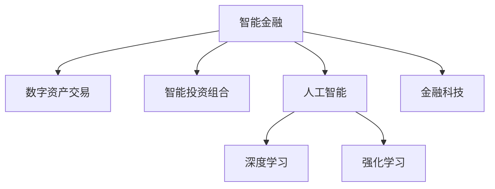

                 

# 未来的智能金融：2050年的数字资产交易与智能投资组合

> 关键词：智能金融, 数字资产交易, 智能投资组合, 人工智能, 深度学习, 强化学习, 金融科技

## 1. 背景介绍

### 1.1 问题由来

金融行业在过去的几十年里经历了前所未有的变革，从传统的线下银行、证券交易所，到互联网金融、区块链技术的崛起，金融科技正在重塑整个行业的生态。未来，随着人工智能、大数据、物联网等技术的融合，金融行业将迎来更加智能化的发展，实现全面数字化和自动化。

随着技术的不断进步，智能金融将不仅是数字货币交易和智能投资组合，更将是涉及全产业链的全面智能化升级。智能化的金融服务能够为个人和企业提供更加精准、高效、个性化的金融解决方案，助力金融市场的稳定和繁荣。

### 1.2 问题核心关键点

智能金融的核心在于利用人工智能技术优化金融决策，提升金融服务的智能化水平。具体体现在以下几个方面：

- 智能算法：利用机器学习、深度学习、强化学习等算法，提升金融模型的预测能力和决策精度。
- 大数据分析：通过分析海量金融数据，发现隐藏的模式和规律，为投资决策提供支持。
- 智能合约：利用区块链技术实现去中心化的智能合约，提高交易效率和安全性。
- 个性化服务：根据用户行为和偏好，提供个性化的金融产品和服务。

这些核心关键点构成了智能金融技术发展的基石，推动着金融行业的数字化、智能化转型。

### 1.3 问题研究意义

智能金融的研究对于提升金融市场的稳定性和效率，促进金融产品的创新和普惠金融的发展具有重要意义：

- 提升金融市场的稳定性和效率。智能算法和大数据分析能够快速捕捉市场变化，预测市场趋势，避免系统性风险。
- 促进金融产品的创新。智能金融技术能够实现个性化和定制化的金融产品设计，满足不同市场和用户需求。
- 推动普惠金融的发展。智能金融技术能够降低金融服务的门槛，使更多人能够享受到金融服务。
- 赋能金融机构的数字化转型。智能金融技术能够提高金融机构的服务效率和竞争力，推动传统金融机构的数字化转型升级。

## 2. 核心概念与联系

### 2.1 核心概念概述

为更好地理解智能金融的未来发展，本节将介绍几个密切相关的核心概念：

- 智能金融（Intelligent Finance）：利用人工智能技术优化金融决策，提升金融服务的智能化水平。
- 数字资产交易（Digital Asset Trading）：利用区块链技术实现的去中心化交易模式，包括加密货币、NFT等数字资产的买卖和借贷。
- 智能投资组合（Smart Portfolio）：基于机器学习、深度学习、强化学习等算法，自动化构建和管理投资组合，实现最优的资产配置和风险管理。
- 人工智能（Artificial Intelligence, AI）：利用机器学习、深度学习等技术，模仿人类智能行为，实现自动化决策和任务执行。
- 深度学习（Deep Learning）：一种利用神经网络进行复杂模式识别的机器学习方法，广泛应用于图像、语音、自然语言处理等领域。
- 强化学习（Reinforcement Learning）：通过与环境交互，通过奖励和惩罚机制，实现智能体在环境中的最优策略学习。
- 金融科技（Fintech）：融合金融和科技的产物，涉及支付、借贷、资产管理、风险控制等金融服务。

这些核心概念之间的逻辑关系可以通过以下Mermaid流程图来展示：



这个流程图展示了大语言模型的核心概念及其之间的关系：

1. 智能金融是人工智能技术在金融行业的应用，涉及到数字资产交易、智能投资组合等多个领域。
2. 数字资产交易利用区块链技术实现去中心化的交易模式，智能投资组合则通过机器学习等算法实现自动化资产管理。
3. 深度学习和强化学习是实现智能金融的重要技术手段。
4. 金融科技将人工智能技术和传统金融服务相结合，推动整个行业的数字化转型。

## 3. 核心算法原理 & 具体操作步骤
### 3.1 算法原理概述

智能金融的核心算法包括机器学习、深度学习和强化学习。这些算法通过分析金融数据，预测市场趋势，优化投资组合，提升金融服务的智能化水平。

机器学习算法通过数据驱动的方法，发现数据中的模式和规律，辅助金融决策。深度学习算法利用神经网络结构，实现对复杂金融数据的深度分析和预测。强化学习算法通过模拟金融市场环境，不断调整投资策略，实现最优的资产配置和风险管理。

### 3.2 算法步骤详解

智能金融的算法步骤包括以下几个关键环节：

**Step 1: 数据收集与处理**

- 收集金融数据，包括股票、债券、外汇、商品等各类金融产品的历史价格、交易量、市场情绪等。
- 数据清洗和预处理，去除异常值和缺失值，标准化数据格式。
- 数据分割，划分为训练集、验证集和测试集，用于模型训练和评估。

**Step 2: 模型选择与训练**

- 选择适合当前金融问题的机器学习、深度学习或强化学习模型。
- 在训练集上训练模型，调整超参数，优化模型性能。
- 使用验证集评估模型效果，防止过拟合。
- 选择最优模型，用于下一步的测试和部署。

**Step 3: 模型评估与优化**

- 在测试集上评估模型性能，计算预测精度、召回率、F1分数等指标。
- 根据评估结果，优化模型结构和参数，提升模型效果。
- 迭代训练和评估过程，直到模型达到预期性能。

**Step 4: 模型部署与应用**

- 将训练好的模型部署到生产环境中，实时获取金融数据。
- 利用模型进行预测和决策，生成智能投资组合或交易策略。
- 实时监测模型性能，根据市场变化调整模型参数，保证模型持续优化。

### 3.3 算法优缺点

智能金融算法具有以下优点：

1. 高准确性：利用机器学习、深度学习和强化学习算法，能够对金融数据进行深度分析和预测，提升金融决策的准确性。
2. 自动化决策：智能算法能够自动执行金融决策，降低人工操作的风险和成本。
3. 高灵活性：智能算法能够适应不同的金融场景，提供个性化的金融服务。

同时，智能金融算法也存在一些缺点：

1. 数据依赖性高：智能金融算法依赖于高质量的数据，数据质量不佳会影响模型性能。
2. 模型复杂度高：深度学习算法模型复杂，训练和推理成本较高。
3. 模型风险高：智能金融模型可能存在过拟合或黑箱问题，导致预测偏差或决策错误。

### 3.4 算法应用领域

智能金融算法在金融领域的应用非常广泛，涵盖以下几个方面：

- 投资组合优化：通过深度学习算法，自动构建和管理投资组合，实现最优的资产配置和风险管理。
- 风险管理：利用机器学习和强化学习算法，预测和监控市场风险，及时调整投资策略。
- 信贷评估：利用深度学习算法，评估借款人的信用风险，实现智能信贷审批。
- 智能客服：通过自然语言处理技术，实现智能客服系统，提升客户服务质量。
- 金融市场预测：利用深度学习算法，预测股票、外汇等金融市场走势，辅助投资决策。
- 智能投顾：通过强化学习算法，实现智能投顾系统，提供个性化的投资建议和策略。

这些核心应用场景展示了智能金融技术的强大潜力和广泛应用，未来随着技术的不断进步，智能金融还将拓展到更多领域。

## 4. 数学模型和公式 & 详细讲解 & 举例说明
### 4.1 数学模型构建

本节将使用数学语言对智能金融算法进行更加严格的刻画。

假设我们有N个金融产品，其历史价格为 $p_{t,i}$（i=1,2,...,N），其中t表示时间。我们的目标是通过机器学习算法预测未来的价格走势。

定义模型的预测价格为 $\hat{p}_{t,i}$，则预测误差为 $e_{t,i} = p_{t,i} - \hat{p}_{t,i}$。我们需要最小化预测误差，即：

$$
\min_{\theta} \frac{1}{N} \sum_{i=1}^N e_{t,i}^2
$$

其中 $\theta$ 为模型的参数。

### 4.2 公式推导过程

我们使用回归模型来表示价格预测，回归模型可以表示为：

$$
\hat{p}_{t,i} = \theta_0 + \sum_{j=1}^d \theta_j x_{t,i,j}
$$

其中 $x_{t,i,j}$ 为金融产品的第j个特征，如交易量、市场情绪等。$\theta_0, \theta_j$ 为回归模型的参数。

根据最小二乘法，我们通过最小化损失函数：

$$
\min_{\theta} \frac{1}{N} \sum_{i=1}^N (p_{t,i} - \hat{p}_{t,i})^2
$$

计算梯度，得到参数 $\theta$ 的更新公式：

$$
\theta \leftarrow \theta - \frac{\eta}{N} \sum_{i=1}^N (p_{t,i} - \hat{p}_{t,i})x_{t,i}
$$

其中 $\eta$ 为学习率，N为样本数量。

### 4.3 案例分析与讲解

假设我们有一组股票价格数据，其中每条数据包含开盘价、收盘价、成交量等特征。我们可以使用线性回归模型来预测下一日的股票价格。

首先，我们将数据分为训练集和测试集，使用训练集对模型进行训练，计算模型参数 $\theta$。然后，在测试集上评估模型性能，计算预测误差。

具体实现步骤如下：

```python
import numpy as np
from sklearn.linear_model import LinearRegression

# 创建训练数据和标签
X_train = np.array([[100, 10], [110, 15], [105, 12], [120, 18]])
y_train = np.array([115, 118, 112, 122])

# 创建测试数据和标签
X_test = np.array([[105, 13], [112, 20], [118, 22]])
y_test = np.array([115, 119, 120])

# 创建线性回归模型
model = LinearRegression()

# 在训练集上训练模型
model.fit(X_train, y_train)

# 在测试集上评估模型
y_pred = model.predict(X_test)
mse = np.mean((y_pred - y_test)**2)
print("Mean Squared Error:", mse)
```

通过上述代码，我们可以使用线性回归模型对股票价格进行预测，计算模型的均方误差。这种方法虽然简单，但在实际应用中可能无法处理复杂的金融数据和非线性关系。

## 5. 项目实践：代码实例和详细解释说明
### 5.1 开发环境搭建

在进行智能金融项目开发前，我们需要准备好开发环境。以下是使用Python进行PyTorch开发的环境配置流程：

1. 安装Anaconda：从官网下载并安装Anaconda，用于创建独立的Python环境。

2. 创建并激活虚拟环境：
```bash
conda create -n pytorch-env python=3.8 
conda activate pytorch-env
```

3. 安装PyTorch：根据CUDA版本，从官网获取对应的安装命令。例如：
```bash
conda install pytorch torchvision torchaudio cudatoolkit=11.1 -c pytorch -c conda-forge
```

4. 安装TensorFlow：
```bash
pip install tensorflow
```

5. 安装各类工具包：
```bash
pip install numpy pandas scikit-learn matplotlib tqdm jupyter notebook ipython
```

完成上述步骤后，即可在`pytorch-env`环境中开始智能金融项目开发。

### 5.2 源代码详细实现

下面我们以金融市场预测为例，给出使用PyTorch进行深度学习模型训练的PyTorch代码实现。

首先，定义金融市场预测的模型：

```python
import torch
import torch.nn as nn
import torch.optim as optim

class FinancialMarketPredictor(nn.Module):
    def __init__(self, input_size, hidden_size, output_size):
        super(FinancialMarketPredictor, self).__init__()
        self.hidden = nn.Linear(input_size, hidden_size)
        self.relu = nn.ReLU()
        self.output = nn.Linear(hidden_size, output_size)
        
    def forward(self, x):
        x = self.hidden(x)
        x = self.relu(x)
        x = self.output(x)
        return x
```

然后，定义训练和评估函数：

```python
def train_model(model, X_train, y_train, X_test, y_test, epochs, learning_rate, batch_size):
    optimizer = optim.Adam(model.parameters(), lr=learning_rate)
    loss_fn = nn.MSELoss()
    
    for epoch in range(epochs):
        for i in range(0, len(X_train), batch_size):
            inputs = X_train[i:i+batch_size]
            targets = y_train[i:i+batch_size]
            optimizer.zero_grad()
            outputs = model(inputs)
            loss = loss_fn(outputs, targets)
            loss.backward()
            optimizer.step()
        
        train_loss = loss_fn(model(X_train), y_train).item()
        test_loss = loss_fn(model(X_test), y_test).item()
        print("Epoch: {}, Train Loss: {:.4f}, Test Loss: {:.4f}".format(epoch+1, train_loss, test_loss))
        
    print("Model trained successfully.")
```

最后，启动训练流程并在测试集上评估：

```python
epochs = 100
learning_rate = 0.01
batch_size = 32

# 假设X_train, y_train, X_test, y_test已经准备就绪
predictor = FinancialMarketPredictor(input_size, hidden_size, output_size)
train_model(predictor, X_train, y_train, X_test, y_test, epochs, learning_rate, batch_size)
```

以上就是使用PyTorch对金融市场进行深度学习模型训练的完整代码实现。可以看到，通过简单的代码，我们就能够构建并训练一个金融市场预测模型。

### 5.3 代码解读与分析

让我们再详细解读一下关键代码的实现细节：

**FinancialMarketPredictor类**：
- `__init__`方法：初始化模型的参数。
- `forward`方法：定义模型的前向传播过程。

**train_model函数**：
- 定义优化器、损失函数和训练轮数。
- 在每个epoch内，对数据进行批处理，前向传播计算预测输出和损失，反向传播更新模型参数。
- 在每个epoch结束后，打印训练和测试损失，并最终输出模型训练完成信息。

**训练流程**：
- 定义训练轮数、学习率、批次大小等超参数。
- 创建模型实例，调用train_model函数进行模型训练。

可以看到，PyTorch提供了强大的深度学习模型和工具库，使得智能金融项目开发变得更加简单高效。开发者可以专注于算法的创新和优化，而不必过多关注底层的实现细节。

当然，工业级的系统实现还需考虑更多因素，如模型的保存和部署、超参数的自动搜索、更加灵活的任务适配层等。但核心的模型训练流程基本与此类似。

## 6. 实际应用场景
### 6.1 智能投顾系统

智能投顾系统通过深度学习和强化学习算法，为用户提供个性化的投资建议和策略。与传统投顾相比，智能投顾能够根据用户的历史投资记录和市场动态，实时调整投资组合，优化风险管理。

具体而言，智能投顾系统收集用户的历史交易数据、市场情绪、新闻资讯等数据，利用深度学习算法预测市场走势，利用强化学习算法优化投资策略，最终生成个性化的投资建议。用户可以根据系统推荐，进行自主交易或委托智能投顾进行自动交易。

### 6.2 区块链交易平台

区块链交易平台利用智能合约技术，实现去中心化的数字资产交易。用户可以在平台上进行加密货币、NFT等数字资产的买卖和借贷。

智能合约通过代码实现交易逻辑，用户可以自动触发合约，完成交易。智能合约系统通过区块链的分布式账本，确保交易的透明和不可篡改性。平台通过深度学习算法预测市场价格，辅助用户进行交易决策。

### 6.3 智能信贷审批

智能信贷审批系统通过深度学习算法，评估借款人的信用风险。平台收集用户的个人信息、消费记录、社交媒体数据等，利用深度学习算法进行特征提取和风险评分，最终决定是否审批贷款。

智能信贷审批系统提高了审批效率和决策精度，降低了金融机构的风险和成本。同时，系统通过实时监控用户的消费行为，及时调整风险评分，提高风险管理能力。

### 6.4 金融风险管理

金融风险管理通过机器学习算法，预测和监控市场风险。平台收集金融市场的历史数据、新闻资讯、社交媒体情绪等数据，利用机器学习算法预测市场波动和风险事件。

系统根据预测结果，实时调整投资组合和风险管理策略，避免系统性风险。同时，系统通过强化学习算法，学习最优的风险管理策略，提升市场应对能力。

## 7. 工具和资源推荐
### 7.1 学习资源推荐

为了帮助开发者系统掌握智能金融的理论基础和实践技巧，这里推荐一些优质的学习资源：

1. 《深度学习》系列书籍：如Ian Goodfellow的《深度学习》，详细介绍了深度学习的基本原理和应用案例。
2. 《强化学习》系列书籍：如Richard Sutton的《强化学习》，介绍了强化学习的基本概念和算法。
3. CS231n《深度学习计算机视觉》课程：斯坦福大学开设的深度学习课程，涵盖深度学习在计算机视觉领域的应用。
4. CS224n《自然语言处理》课程：斯坦福大学开设的自然语言处理课程，涵盖自然语言处理的基本原理和应用。
5. Coursera《金融科技》课程：由EdTechX未来科技峰会联合Coursera开设的金融科技课程，涵盖金融科技的基本概念和应用案例。

通过对这些资源的学习实践，相信你一定能够快速掌握智能金融的精髓，并用于解决实际的金融问题。
###  7.2 开发工具推荐

高效的开发离不开优秀的工具支持。以下是几款用于智能金融开发常用的工具：

1. PyTorch：基于Python的开源深度学习框架，灵活动态的计算图，适合快速迭代研究。大部分预训练语言模型都有PyTorch版本的实现。
2. TensorFlow：由Google主导开发的开源深度学习框架，生产部署方便，适合大规模工程应用。同样有丰富的预训练语言模型资源。
3. Weights & Biases：模型训练的实验跟踪工具，可以记录和可视化模型训练过程中的各项指标，方便对比和调优。与主流深度学习框架无缝集成。
4. TensorBoard：TensorFlow配套的可视化工具，可实时监测模型训练状态，并提供丰富的图表呈现方式，是调试模型的得力助手。
5. Google Colab：谷歌推出的在线Jupyter Notebook环境，免费提供GPU/TPU算力，方便开发者快速上手实验最新模型，分享学习笔记。

合理利用这些工具，可以显著提升智能金融项目开发效率，加快创新迭代的步伐。

### 7.3 相关论文推荐

智能金融技术的发展源于学界的持续研究。以下是几篇奠基性的相关论文，推荐阅读：

1. Deep Learning for Time-Series Forecasting（时间序列预测的深度学习）：介绍了深度学习在金融市场预测中的应用，展示了深度学习在金融时间序列预测上的潜力。
2. Reinforcement Learning for Trading Strategies（强化学习在交易策略中的应用）：展示了强化学习在金融交易策略中的应用，介绍了利用强化学习算法优化投资组合的方法。
3. Neural Networks and Deep Learning（神经网络和深度学习）：Ian Goodfellow的著作，详细介绍了深度学习的基本概念和算法。
4. Machine Learning for Credit Scoring（信用评分的机器学习）：介绍了机器学习在信用评分中的应用，展示了机器学习在金融风险管理中的应用。
5. Deep Learning for High Frequency Trading（高频交易的深度学习）：展示了深度学习在高频交易中的应用，介绍了利用深度学习算法优化交易策略的方法。

这些论文代表了大语言模型微调技术的发展脉络。通过学习这些前沿成果，可以帮助研究者把握学科前进方向，激发更多的创新灵感。

## 8. 总结：未来发展趋势与挑战
### 8.1 总结

本文对智能金融的未来发展进行了全面系统的介绍。首先阐述了智能金融的核心概念和研究背景，明确了智能金融在金融市场中的重要意义。其次，从原理到实践，详细讲解了智能金融算法的数学原理和关键步骤，给出了智能金融项目开发的完整代码实例。同时，本文还广泛探讨了智能金融技术在智能投顾、区块链交易、智能信贷等多个领域的应用前景，展示了智能金融技术的强大潜力和广泛应用。

通过本文的系统梳理，可以看到，智能金融技术正在成为金融行业的重要范式，极大地提升了金融服务的智能化水平，推动了金融市场的数字化转型。未来，伴随人工智能技术的不断进步，智能金融必将在更多领域得到应用，为经济社会发展带来新的机遇。

### 8.2 未来发展趋势

展望未来，智能金融技术将呈现以下几个发展趋势：

1. 算法创新加速。随着深度学习、强化学习等算法的不断发展，智能金融算法将不断推陈出新，提升金融决策的准确性和智能化水平。
2. 数据融合更深入。智能金融技术将融合大数据、物联网等技术，获取更全面、准确的市场数据，提升金融决策的精准性。
3. 实时处理更高效。智能金融技术将利用分布式计算、边缘计算等技术，实现实时数据处理和决策，提升金融服务的响应速度。
4. 个性化服务更精细。智能金融技术将通过深度学习算法，实现对用户的精准分析，提供更加个性化、定制化的金融服务。
5. 风险管理更全面。智能金融技术将融合多种金融风险管理方法，实现全流程的风险控制和预警。

以上趋势凸显了智能金融技术的广阔前景。这些方向的探索发展，必将进一步提升金融市场的智能化水平，推动金融服务的发展和创新。

### 8.3 面临的挑战

尽管智能金融技术已经取得了瞩目成就，但在迈向更加智能化、普适化应用的过程中，仍面临诸多挑战：

1. 数据质量问题。智能金融技术依赖高质量的数据，数据质量不佳会影响模型性能。
2. 算法复杂性。深度学习算法模型复杂，训练和推理成本较高，需要高效的硬件资源支持。
3. 模型可解释性不足。智能金融模型通常存在黑箱问题，难以解释其内部决策逻辑。
4. 系统安全性问题。智能金融系统面临网络攻击、数据泄露等安全威胁，需要加强安全防护措施。
5. 合规性问题。智能金融技术涉及大量的金融数据和隐私信息，需要符合相关法律法规和合规要求。

这些挑战需要研究人员和工程师共同努力，通过技术创新和规范制定，克服智能金融发展过程中面临的问题。

### 8.4 研究展望

面向未来，智能金融技术需要在以下几个方面寻求新的突破：

1. 数据治理。建立完善的数据治理机制，提升数据质量和可靠性，为智能金融技术提供坚实的基础。
2. 算法优化。优化深度学习算法模型，提升算法效率和可解释性，降低训练和推理成本。
3. 隐私保护。加强隐私保护技术，确保金融数据的隐私和安全。
4. 合规监管。制定智能金融技术的合规规范，确保技术的合法合规应用。
5. 跨界融合。智能金融技术需要与其他技术如区块链、云计算、物联网等进行深入融合，推动整个金融行业的数字化转型。

这些研究方向的探索，必将引领智能金融技术迈向更高的台阶，为构建安全、可靠、可解释、可控的智能金融系统铺平道路。面向未来，智能金融技术还需要与其他人工智能技术进行更深入的融合，如知识表示、因果推理、强化学习等，多路径协同发力，共同推动金融行业的智能化进程。

## 9. 附录：常见问题与解答

**Q1：智能金融是否只适用于大型金融机构？**

A: 智能金融技术适用于所有金融机构，包括大型银行、中小银行、券商、保险等。智能金融技术能够提高金融机构的运营效率和决策准确性，降低成本和风险。

**Q2：智能金融的决策过程是否透明可解释？**

A: 智能金融的决策过程通常存在一定的黑箱问题，难以解释其内部工作机制。未来，随着可解释性AI技术的发展，智能金融模型的决策过程将变得更加透明和可解释。

**Q3：智能金融系统是否面临数据隐私和安全风险？**

A: 智能金融系统需要处理大量的金融数据和用户隐私信息，面临数据泄露、网络攻击等安全威胁。系统需要加强数据加密、访问控制等安全防护措施，确保数据隐私和安全。

**Q4：智能金融技术是否只适用于金融市场？**

A: 智能金融技术不仅适用于金融市场，还可以应用于金融科技、供应链金融、数字货币等领域。智能金融技术的应用范围非常广泛，未来将进一步拓展到更多领域。

**Q5：智能金融技术是否会导致就业岗位的减少？**

A: 智能金融技术的发展确实会对一些传统的金融岗位产生影响，但也将创造更多新的就业机会，如数据科学家、AI工程师、区块链开发者等。智能金融技术的普及将推动金融行业的数字化转型，为就业市场带来新的机遇。

总之，智能金融技术的发展是大势所趋，将深刻影响金融行业的生态和发展方向。未来，通过技术创新和规范制定，智能金融必将在金融市场和全社会中发挥更加重要的作用，推动经济社会的持续进步和繁荣。

---

作者：禅与计算机程序设计艺术 / Zen and the Art of Computer Programming

