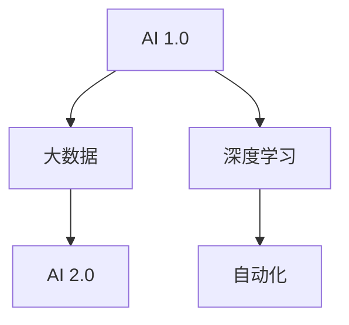

                 

# 李开复：AI 2.0 时代的趋势

> 关键词：人工智能,AI 2.0,深度学习,大数据,机器学习,自动化,未来趋势

## 1. 背景介绍

在过去的几十年里，人工智能（AI）技术经历了从概念到实践的飞速发展，尤其是深度学习和大数据技术的结合，使得AI技术在图像识别、自然语言处理、自动驾驶等诸多领域取得了突破性进展。然而，随着技术的不断演进，AI的下一步发展方向和趋势逐渐成为行业内外关注的焦点。本文将探讨李开复对AI 2.0时代的见解，分析其中的核心概念与联系，深入挖掘其背后的算法原理，并提供实际操作和应用场景的指导。

## 2. 核心概念与联系

### 2.1 核心概念概述

为了更好地理解AI 2.0时代的趋势，本节将介绍几个关键概念：

- AI 1.0：即传统的符号计算时代，依赖专家规则和知识库进行问题求解。
- AI 2.0：指基于深度学习和大数据的自动学习时代，通过算法自动提取和学习数据中的知识。
- 大数据：指大规模、多来源、复杂的数据集合，是深度学习和AI 2.0的基础。
- 深度学习：一种基于神经网络的机器学习范式，通过多层非线性变换提取数据特征，广泛应用于图像识别、自然语言处理等任务。
- 自动化：指AI系统能够自主执行任务，无需人工干预，推动各行各业的智能化转型。

这些核心概念共同构成了AI 2.0时代的技术基础，并相互影响，共同推动AI技术的不断进步。

### 2.2 核心概念原理和架构的 Mermaid 流程图



该流程图展示了AI 2.0时代的核心概念及其关系：

1. AI 1.0时代通过专家知识库和符号计算解决特定问题。
2. 大数据时代的到来提供了海量的数据资源，为深度学习提供了数据基础。
3. 深度学习技术通过多层神经网络学习数据中的隐含模式，提升了解决问题的能力。
4. 自动化技术将深度学习应用到各个行业，实现了自主决策和执行，推动了各行各业的智能化转型。

## 3. 核心算法原理 & 具体操作步骤

### 3.1 算法原理概述

AI 2.0时代，深度学习是核心算法，其核心思想是通过多层神经网络自动学习数据中的特征和规律，从而实现对复杂任务的自动处理。深度学习的核心算法包括卷积神经网络（CNN）、循环神经网络（RNN）、生成对抗网络（GAN）等。

深度学习的训练过程通常分为两个阶段：预训练和微调。预训练阶段通过在大规模无标签数据上训练模型，学习到数据的通用特征。微调阶段则在大规模标注数据上训练模型，使其能够适应特定任务，提高模型的性能。

### 3.2 算法步骤详解

深度学习的训练流程通常包括以下几个关键步骤：

**Step 1: 数据准备**
- 收集大规模数据集，分为训练集、验证集和测试集。
- 对数据进行预处理，如数据清洗、归一化等。

**Step 2: 模型选择与设计**
- 选择合适的深度学习模型，如CNN、RNN等。
- 设计模型结构，包括输入层、隐藏层、输出层等。
- 确定损失函数和优化器。

**Step 3: 预训练**
- 在大规模无标签数据上训练模型，学习数据特征。
- 通过正则化技术，如Dropout、L2正则等，防止过拟合。

**Step 4: 微调**
- 在大规模标注数据上训练模型，适应特定任务。
- 调整学习率，防止破坏预训练权重。
- 应用正则化技术，如Early Stopping、Data Augmentation等。

**Step 5: 测试与部署**
- 在测试集上评估模型性能，对比预训练和微调后的效果。
- 将模型集成到实际应用系统中，进行部署和优化。

### 3.3 算法优缺点

深度学习的优点包括：

- 强大的特征学习能力：通过多层神经网络自动学习数据特征。
- 广泛的应用领域：广泛应用于图像识别、自然语言处理、自动驾驶等。
- 数据驱动的决策：通过大量数据驱动模型决策，减少人工干预。

深度学习的缺点包括：

- 计算资源需求高：需要高性能计算设备和大量数据。
- 可解释性差：深度学习模型往往被视为"黑盒"，难以解释其内部工作机制。
- 数据依赖性强：依赖大规模标注数据，标注成本高。

### 3.4 算法应用领域

深度学习在AI 2.0时代得到了广泛应用，覆盖了几乎所有常见任务，例如：

- 图像识别：如人脸识别、物体检测、医学影像分析等。
- 自然语言处理：如文本分类、机器翻译、情感分析等。
- 自动驾驶：如视觉感知、路径规划、决策控制等。
- 机器人学：如路径规划、避障、人机交互等。
- 游戏AI：如游戏角色行为生成、策略优化等。

此外，深度学习还被应用于更多创新场景中，如音乐生成、艺术创作、智能推荐等，为AI技术带来了全新的突破。

## 4. 数学模型和公式 & 详细讲解 & 举例说明

### 4.1 数学模型构建

在深度学习中，常见的数学模型包括卷积神经网络（CNN）和循环神经网络（RNN）。

- CNN模型：包括卷积层、池化层、全连接层等。通过卷积操作提取图像特征，通过池化操作减少特征维度，通过全连接层进行分类或回归。

- RNN模型：包括循环层、LSTM层等。通过循环神经网络模型处理序列数据，如自然语言文本。LSTM层能够有效解决长序列问题，提升模型性能。

### 4.2 公式推导过程

以CNN模型为例，其基本结构可以表示为：

$$
H_{l+1} = f(W_l \cdot H_l + b_l)
$$

其中，$H_{l+1}$ 表示第$l+1$层输出，$W_l$ 为第$l$层权重，$H_l$ 为第$l$层输入，$b_l$ 为第$l$层偏置，$f$ 为激活函数，通常采用ReLU函数。

通过多层堆叠，CNN模型能够自动提取图像中的特征，从而实现分类、检测等任务。

### 4.3 案例分析与讲解

以医学影像分析为例，深度学习模型可以通过卷积神经网络提取影像中的特征，并通过分类器进行诊断。具体步骤如下：

1. 收集大规模医学影像数据集。
2. 对数据进行预处理，如归一化、裁剪等。
3. 设计CNN模型结构，包括卷积层、池化层、全连接层等。
4. 在大规模无标签数据上预训练模型，学习影像特征。
5. 在大规模标注数据上微调模型，适应特定诊断任务。
6. 在测试集上评估模型性能，进行部署和优化。

## 5. 项目实践：代码实例和详细解释说明

### 5.1 开发环境搭建

在进行深度学习项目实践前，我们需要准备好开发环境。以下是使用Python进行TensorFlow开发的环境配置流程：

1. 安装Anaconda：从官网下载并安装Anaconda，用于创建独立的Python环境。

2. 创建并激活虚拟环境：
```bash
conda create -n tf-env python=3.8 
conda activate tf-env
```

3. 安装TensorFlow：根据CUDA版本，从官网获取对应的安装命令。例如：
```bash
conda install tensorflow-gpu=2.7.0 -c conda-forge -c pypi -c pypi_simplicial
```

4. 安装各类工具包：
```bash
pip install numpy pandas scikit-learn matplotlib tqdm jupyter notebook ipython
```

完成上述步骤后，即可在`tf-env`环境中开始深度学习项目实践。

### 5.2 源代码详细实现

这里我们以医学影像分类任务为例，给出使用TensorFlow进行CNN模型训练的代码实现。

```python
import tensorflow as tf
from tensorflow.keras import datasets, layers, models

# 加载数据集
(train_images, train_labels), (test_images, test_labels) = datasets.cifar10.load_data()

# 数据预处理
train_images, test_images = train_images / 255.0, test_images / 255.0

# 定义模型
model = models.Sequential([
    layers.Conv2D(32, (3,3), activation='relu', input_shape=(32,32,3)),
    layers.MaxPooling2D((2,2)),
    layers.Conv2D(64, (3,3), activation='relu'),
    layers.MaxPooling2D((2,2)),
    layers.Conv2D(64, (3,3), activation='relu'),
    layers.Flatten(),
    layers.Dense(64, activation='relu'),
    layers.Dense(10)
])

# 编译模型
model.compile(optimizer='adam',
              loss=tf.keras.losses.SparseCategoricalCrossentropy(from_logits=True),
              metrics=['accuracy'])

# 训练模型
history = model.fit(train_images, train_labels, epochs=10, 
                    validation_data=(test_images, test_labels))
```

以上代码展示了使用TensorFlow构建CNN模型的完整流程。可以看到，TensorFlow提供了丰富的API，可以方便地进行模型设计、编译和训练。

### 5.3 代码解读与分析

让我们再详细解读一下关键代码的实现细节：

**模型定义**：
- 首先加载CIFAR-10数据集，并进行数据归一化处理。
- 使用Sequential模型定义卷积神经网络，包括卷积层、池化层、全连接层等。
- 编译模型，指定优化器、损失函数和评估指标。

**训练过程**：
- 使用fit方法训练模型，指定训练集、验证集、训练轮数等参数。
- 通过历史数据记录模型的训练和验证性能，便于后续分析和优化。

可以看到，TensorFlow提供了简单易用的API，使得深度学习模型的实现变得高效便捷。

当然，工业级的系统实现还需考虑更多因素，如模型的保存和部署、超参数的自动搜索、更灵活的任务适配层等。但核心的深度学习模型构建流程基本与此类似。

## 6. 实际应用场景

### 6.1 智能医疗

深度学习在智能医疗领域的应用广泛，如医学影像分析、疾病预测、个性化治疗等。通过深度学习模型，医生能够快速准确地分析医学影像，提供诊断建议。同时，深度学习还能在药物研发、基因组学等领域发挥重要作用，推动医疗科技的发展。

### 6.2 智能交通

深度学习在智能交通领域的应用包括自动驾驶、交通流量预测、智能停车等。通过深度学习模型，自动驾驶车辆能够实时感知周围环境，进行路径规划和避障决策。同时，深度学习还能在交通管理中发挥作用，优化交通流量，减少交通拥堵。

### 6.3 金融科技

深度学习在金融科技领域的应用包括风险评估、客户行为分析、智能投顾等。通过深度学习模型，金融机构能够预测市场走势，进行风险控制。同时，深度学习还能在客户服务中发挥作用，提高客户满意度，提升运营效率。

### 6.4 未来应用展望

随着深度学习技术的不断演进，其应用领域将进一步扩展。未来，深度学习将深度融入各个行业，推动各行各业的智能化转型。

在智慧医疗领域，深度学习将实现更加精准的诊断和治疗方案，提高医疗服务的质量和效率。在智能交通领域，自动驾驶技术将大幅提升交通安全性和出行效率。在金融科技领域，深度学习将实现更加智能的投资管理和风险控制。在更多领域，深度学习将发挥重要作用，推动社会进步。

## 7. 工具和资源推荐

### 7.1 学习资源推荐

为了帮助开发者系统掌握深度学习技术，这里推荐一些优质的学习资源：

1. 《深度学习》课程：斯坦福大学Andrew Ng教授开设的深度学习课程，涵盖了深度学习的基础知识和核心算法。
2. 《动手学深度学习》书籍：李沐、阿斯顿·张合著，系统介绍了深度学习的理论基础和实践技巧。
3. TensorFlow官方文档：提供了丰富的教程和示例代码，是深度学习学习的必备工具。
4. PyTorch官方文档：提供了丰富的API和示例代码，支持灵活的模型构建和训练。

通过对这些资源的学习实践，相信你一定能够快速掌握深度学习技术的精髓，并用于解决实际的AI问题。

### 7.2 开发工具推荐

高效的深度学习开发离不开优秀的工具支持。以下是几款用于深度学习开发的常用工具：

1. TensorFlow：由Google主导开发的深度学习框架，生产部署方便，支持分布式计算。
2. PyTorch：由Facebook主导开发的深度学习框架，灵活高效，支持动态图和静态图。
3. Keras：基于TensorFlow和Theano的高级API，简单易用，适合快速原型开发。
4. JAX：基于NumPy的深度学习框架，支持自动微分和动态计算图，适合科研和实验。
5. MXNet：支持多种编程语言和多种深度学习框架的分布式深度学习框架，适合大规模生产部署。

合理利用这些工具，可以显著提升深度学习项目的开发效率，加快创新迭代的步伐。

### 7.3 相关论文推荐

深度学习在AI 2.0时代得到了广泛研究，以下是几篇奠基性的相关论文，推荐阅读：

1. ImageNet Classification with Deep Convolutional Neural Networks：提出深度卷积神经网络在图像分类任务中的优越性，开启了深度学习时代。
2. Long Short-Term Memory（LSTM） Networks：提出LSTM网络，解决了长期依赖问题，提升了序列数据建模的准确性。
3. Generative Adversarial Networks（GANs）：提出生成对抗网络，实现了生成式建模，推动了深度学习在生成式任务中的应用。
4. Attention is All You Need（即Transformer原论文）：提出Transformer模型，提升了序列数据建模的效率和准确性。
5. AlphaGo Zero：提出AlphaGo Zero，实现了自我对弈的深度强化学习算法，展示了深度学习在复杂决策问题中的应用。

这些论文代表了大深度学习技术的发展脉络。通过学习这些前沿成果，可以帮助研究者把握学科前进方向，激发更多的创新灵感。

## 8. 总结：未来发展趋势与挑战

### 8.1 总结

本文对AI 2.0时代的深度学习技术进行了全面系统的介绍。首先阐述了AI 1.0向AI 2.0的演进过程，明确了深度学习在AI 2.0时代的重要地位。其次，从原理到实践，详细讲解了深度学习的数学模型和核心算法，提供了实际操作和应用场景的指导。最后，本文探讨了深度学习在未来各行业的广泛应用，展望了其发展趋势和面临的挑战。

通过本文的系统梳理，可以看到，深度学习技术正在成为AI 2.0时代的重要驱动力，其广泛应用为各行各业带来了深远影响。未来，伴随深度学习技术的不断进步，AI 2.0时代将迎来更多创新和突破。

### 8.2 未来发展趋势

展望未来，深度学习技术将呈现以下几个发展趋势：

1. 深度学习技术将不断进步，模型规模和复杂度将继续提升，解决更多复杂问题。
2. 跨领域深度学习将不断拓展，将深度学习技术应用于更多垂直领域，实现跨学科融合。
3. 深度学习与人类认知结合将不断深入，推动人工智能迈向通用智能。
4. 深度学习在边缘计算、物联网等新兴领域的应用将不断扩大，实现随时随地智能化。
5. 深度学习与AI伦理、可解释性等研究将不断深入，推动AI技术的负责任发展。

以上趋势凸显了深度学习技术的广阔前景，这些方向的探索发展，必将进一步提升深度学习技术的应用范围和效果。

### 8.3 面临的挑战

尽管深度学习技术已经取得了瞩目成就，但在迈向更加智能化、普适化应用的过程中，其面临的挑战仍然不少：

1. 计算资源需求高：深度学习模型规模大，计算需求高，需要高性能计算设备和大量数据。
2. 可解释性差：深度学习模型往往被视为"黑盒"，难以解释其内部工作机制和决策逻辑。
3. 数据依赖性强：深度学习依赖大规模标注数据，标注成本高，数据获取难。
4. 模型鲁棒性不足：深度学习模型在处理异常数据时，鲁棒性不足，容易产生误判。
5. 模型偏见问题：深度学习模型可能学习到数据中的偏见，影响模型公平性和公正性。

### 8.4 研究展望

为了解决上述挑战，未来的研究需要在以下几个方面寻求新的突破：

1. 探索无监督和半监督深度学习：通过无监督和半监督学习，减少对大规模标注数据的依赖，提升模型泛化能力。
2. 开发更加高效的深度学习算法：开发高效、轻量级的深度学习算法，降低计算资源需求，提升模型推理速度。
3. 引入可解释性和公正性约束：在深度学习模型中引入可解释性和公正性约束，提升模型可信度和公正性。
4. 加强跨学科深度学习研究：推动深度学习与认知科学、伦理学等学科的交叉研究，提升深度学习技术的理论深度和应用广度。
5. 探索深度学习与其他AI技术结合：将深度学习与知识图谱、强化学习等AI技术结合，推动AI技术的进一步发展。

这些研究方向的探索，必将引领深度学习技术迈向更高的台阶，为构建安全、可靠、可解释、可控的智能系统铺平道路。面向未来，深度学习技术还需要与其他AI技术进行更深入的融合，共同推动自然语言理解和智能交互系统的进步。只有勇于创新、敢于突破，才能不断拓展深度学习技术的边界，让智能技术更好地造福人类社会。

## 9. 附录：常见问题与解答

**Q1：深度学习是否适用于所有领域？**

A: 深度学习在AI 2.0时代的应用非常广泛，但并不是所有领域都适合使用深度学习。深度学习通常适用于数据量较大、特征维度高、任务复杂的应用场景。例如，图像识别、自然语言处理、语音识别等。对于一些特征维度低、任务简单的应用场景，传统机器学习模型可能更加适合。

**Q2：深度学习模型的可解释性如何提升？**

A: 提升深度学习模型的可解释性可以从以下几个方面入手：

1. 使用可解释性较强的模型：如决策树、线性回归等。
2. 引入可解释性技术：如LIME、SHAP等，通过局部可解释性方法解释模型决策。
3. 设计可解释性模型：如可解释性增强网络（XAI），在模型设计中引入可解释性约束。

**Q3：如何缓解深度学习模型的过拟合问题？**

A: 缓解深度学习模型的过拟合问题可以从以下几个方面入手：

1. 数据增强：通过数据增强技术扩充训练数据，提升模型泛化能力。
2. 正则化：通过L2正则、Dropout等技术，防止模型过拟合。
3. 早停：通过早停技术，及时停止训练，避免模型过拟合。
4. 模型集成：通过模型集成技术，如Bagging、Boosting等，提升模型泛化能力。

**Q4：深度学习模型的训练时间如何优化？**

A: 优化深度学习模型的训练时间可以从以下几个方面入手：

1. 优化模型结构：通过模型剪枝、量化等技术，减小模型尺寸，提升训练速度。
2. 优化硬件资源：使用高性能计算设备和分布式训练技术，提升训练速度。
3. 优化超参数：通过超参数调优，找到最优训练参数，提升模型训练效率。

通过以上措施，可以显著缩短深度学习模型的训练时间，提升模型训练效率。

---

作者：禅与计算机程序设计艺术 / Zen and the Art of Computer Programming

