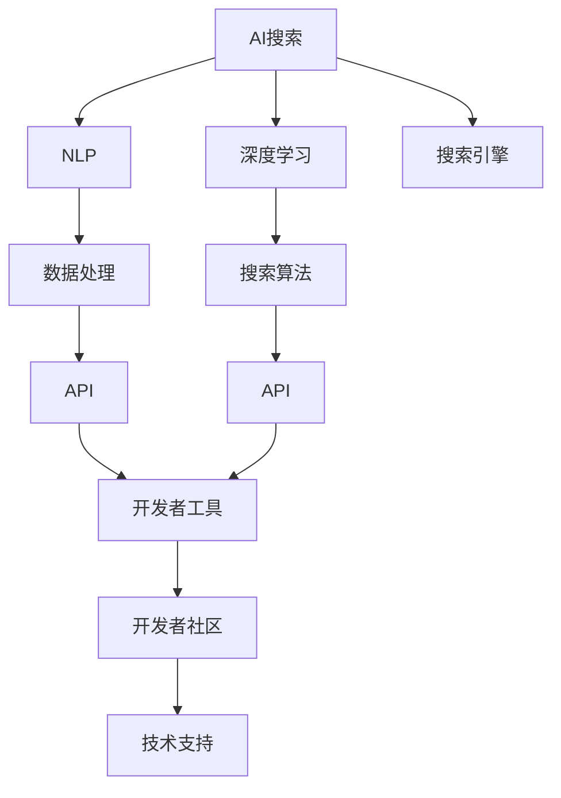

                 

# 构建AI搜索的开发者生态

> 关键词：AI搜索,开发者生态,搜索引擎,自然语言处理,NLP,深度学习,数据处理,搜索算法,API,开发者工具,代码示例,性能优化,应用场景,技术挑战,未来展望

## 1. 背景介绍

随着互联网的迅猛发展和数字化转型的加速，搜索引擎作为获取信息、解决问题的重要工具，其应用场景和需求不断扩展和深化。传统的文本检索方法逐渐无法满足用户对信息精度、速度和个性化的需求，AI搜索技术应运而生。AI搜索通过深度学习、自然语言处理等先进技术，能够理解用户意图，自动优化搜索路径，提供更精准、更流畅的搜索体验。

AI搜索技术的崛起，离不开开发者生态的蓬勃发展。开发者是AI搜索技术的核心驱动力，通过构建优质的开发者生态，吸引更多的开发者参与进来，才能加速技术演进和落地应用。本文将从开发者生态的构建出发，深入探讨AI搜索技术的原理、应用、挑战及未来发展趋势。

## 2. 核心概念与联系

### 2.1 核心概念概述

为更好地理解构建AI搜索开发者生态的原理和实践，本节将介绍几个密切相关的核心概念：

- **AI搜索(AI Search)**：基于深度学习、自然语言处理等技术，能够理解自然语言查询，提供个性化搜索结果的智能搜索技术。
- **自然语言处理(NLP)**：研究如何让计算机理解和处理人类语言的技术，包括词法分析、句法分析、语义理解、情感分析等。
- **深度学习(Deep Learning)**：一种模仿人脑神经网络结构和功能的机器学习方法，通过多层次神经网络处理大规模数据，实现高精度预测和决策。
- **开发者生态(Developer Ecosystem)**：由开发者、技术、社区、工具等组成的多元化生态系统，能够为开发者提供技术支持、资源共享、交流互动的平台。
- **搜索引擎(Search Engine)**：一种自动化信息检索系统，能够通过索引数据库，根据用户查询返回相关结果。

这些核心概念之间的逻辑关系可以通过以下Mermaid流程图来展示：



这个流程图展示了大语言模型的工作原理和开发环境：

1. AI搜索通过NLP和深度学习获取和处理查询，通过搜索引擎检索数据库。
2. 数据处理和搜索算法配合，实现高效的搜索结果排序。
3. API将搜索结果封装为开发者可用的接口。
4. 开发者工具和社区为开发者提供技术支持和资源共享。

## 3. 核心算法原理 & 具体操作步骤
### 3.1 算法原理概述

构建AI搜索的开发者生态，本质上是建立一个高效的生态系统，能够快速响应市场需求，提供高质量的AI搜索技术和服务。其核心算法和具体操作步骤如下：

#### 3.1.1 算法原理概述

AI搜索算法包括：

- **词向量化**：将自然语言文本转换为数值向量，方便机器处理。
- **语义理解**：通过上下文语境，理解查询词义，匹配相关文档。
- **结果排序**：根据查询意图，优化搜索结果排序，提升用户体验。

#### 3.1.2 算法步骤详解

1. **数据收集与预处理**：
   - 收集大规模文本数据，如网页、新闻、文献等，并进行分词、清洗、去除停用词等预处理。
   - 使用词向量化技术，将文本转换为数值向量。

2. **模型训练与优化**：
   - 训练深度学习模型，如BERT、GPT等，进行语义理解和结果排序。
   - 使用正则化、Dropout等技术，防止过拟合，提升模型泛化能力。

3. **搜索结果排序**：
   - 根据查询意图，对搜索结果进行排序，如相关性排序、时间排序、热度排序等。
   - 使用机器学习算法，优化排序模型，提升搜索结果的相关性和排名准确性。

4. **API接口设计**：
   - 将搜索结果封装为API接口，方便开发者调用。
   - 设计友好的接口文档和示例代码，降低开发者使用门槛。

5. **开发者社区建设**：
   - 建立开发者社区，提供技术支持、交流平台。
   - 定期发布API更新和优化建议，鼓励开发者参与反馈和优化。

### 3.2 算法优缺点

AI搜索算法的主要优点包括：

- **精准度**：基于深度学习和NLP技术，能够理解用户查询的语义，提供更准确的搜索结果。
- **个性化**：能够根据用户历史行为和偏好，提供个性化的搜索结果。
- **高效性**：使用大规模数据训练模型，能够快速响应搜索结果。

同时，这些算法也存在一定的局限性：

- **数据依赖**：依赖大规模高质量的数据，数据获取和标注成本较高。
- **计算复杂度**：深度学习模型参数量大，计算复杂度高。
- **可解释性**：模型复杂度高，结果的生成过程难以解释，透明度不足。

尽管存在这些局限性，AI搜索算法在处理大规模、高复杂度搜索任务上依然展现出显著的优势。未来，相关研究的重点在于如何降低数据获取和标注成本，提升模型的可解释性和计算效率。

### 3.3 算法应用领域

AI搜索算法已经在多个领域得到了广泛应用，例如：

- **电商搜索**：通过用户查询和浏览历史，推荐相关商品，提高转化率。
- **社交网络**：根据用户兴趣和行为，推荐相关话题和内容，提升用户体验。
- **科学研究**：通过文本检索，快速定位相关文献和数据，加速科研进程。
- **知识图谱**：通过知识图谱与搜索引擎的结合，实现更深入的语义搜索。
- **金融分析**：通过财经新闻和报告的检索，辅助金融决策。
- **医疗搜索**：根据病人症状和病史，推荐相关医疗信息和医生，提升诊疗效率。

除了这些常见应用外，AI搜索技术还在智能客服、智能推荐、智能广告等领域得到了创新性的应用，为各行业的数字化转型提供了新的技术路径。

## 4. 数学模型和公式 & 详细讲解 & 举例说明

### 4.1 数学模型构建

AI搜索算法的核心数学模型包括：

- **词向量化模型**：将文本转换为数值向量，常见模型包括word2vec、GloVe、BERT等。
- **语义理解模型**：通过深度学习模型，理解查询语义，常见模型包括BERT、ELMo等。
- **结果排序模型**：根据查询意图，优化搜索结果排序，常见模型包括DNN、LSTM等。

#### 4.1.1 词向量化模型

词向量化模型将单词转换为数值向量，方便机器处理。以word2vec模型为例，其公式如下：

$$
\text{word2vec}(w_i) = v_i \in \mathbb{R}^d
$$

其中 $v_i$ 表示单词 $w_i$ 的向量表示，$d$ 为向量的维度。

#### 4.1.2 语义理解模型

语义理解模型通过深度学习模型，理解查询语义。以BERT模型为例，其公式如下：

$$
\text{BERT}(\mathcal{X}, \mathcal{Y}) = \text{LSTM}(\text{word2vec}(\mathcal{X}), \mathcal{Y})
$$

其中 $\mathcal{X}$ 为查询文本，$\mathcal{Y}$ 为标签，$\text{LSTM}$ 为长短时记忆网络，用于语义理解。

#### 4.1.3 结果排序模型

结果排序模型根据查询意图，优化搜索结果排序。以DNN模型为例，其公式如下：

$$
\text{DNN}(\mathcal{X}, \mathcal{Y}) = \text{MLP}(\text{word2vec}(\mathcal{X}), \mathcal{Y})
$$

其中 $\mathcal{X}$ 为查询文本，$\mathcal{Y}$ 为搜索结果，$\text{MLP}$ 为多层感知器，用于排序。

### 4.2 公式推导过程

以上数学模型中，word2vec、BERT、DNN等都是常用的深度学习模型，其核心在于神经网络的结构和参数训练。以word2vec模型为例，其公式推导如下：

1. **输入层**：将单词 $w_i$ 转换为数值向量 $v_i$。
2. **隐藏层**：通过神经网络进行语义理解。
3. **输出层**：输出语义表示 $v_i$。

### 4.3 案例分析与讲解

以电商搜索为例，分析其核心算法和应用：

1. **用户查询处理**：
   - 将用户查询转换为数值向量，通过word2vec模型进行词向量化。
   - 使用BERT模型进行语义理解，获取查询意图。

2. **搜索结果检索**：
   - 将搜索结果转换为数值向量，通过DNN模型进行排序。
   - 根据用户查询意图，优化搜索结果排序，提升用户体验。

3. **个性化推荐**：
   - 根据用户历史行为和偏好，设计推荐算法，推荐相关商品。
   - 使用协同过滤、深度学习等技术，提升推荐效果。

## 5. 项目实践：代码实例和详细解释说明
### 5.1 开发环境搭建

在进行AI搜索项目开发前，我们需要准备好开发环境。以下是使用Python进行PyTorch开发的环境配置流程：

1. 安装Anaconda：从官网下载并安装Anaconda，用于创建独立的Python环境。

2. 创建并激活虚拟环境：
```bash
conda create -n pytorch-env python=3.8 
conda activate pytorch-env
```

3. 安装PyTorch：根据CUDA版本，从官网获取对应的安装命令。例如：
```bash
conda install pytorch torchvision torchaudio cudatoolkit=11.1 -c pytorch -c conda-forge
```

4. 安装Transformers库：
```bash
pip install transformers
```

5. 安装各类工具包：
```bash
pip install numpy pandas scikit-learn matplotlib tqdm jupyter notebook ipython
```

完成上述步骤后，即可在`pytorch-env`环境中开始AI搜索项目开发。

### 5.2 源代码详细实现

下面我们以电商搜索为例，给出使用Transformers库进行AI搜索开发的PyTorch代码实现。

首先，定义搜索任务的数据处理函数：

```python
from transformers import BertTokenizer
from torch.utils.data import Dataset
import torch

class SearchDataset(Dataset):
    def __init__(self, texts, queries, tokenizer, max_len=128):
        self.texts = texts
        self.queries = queries
        self.tokenizer = tokenizer
        self.max_len = max_len
        
    def __len__(self):
        return len(self.texts)
    
    def __getitem__(self, item):
        query = self.queries[item]
        text = self.texts[item]
        
        encoding = self.tokenizer(query, return_tensors='pt', max_length=self.max_len, padding='max_length', truncation=True)
        input_ids = encoding['input_ids'][0]
        attention_mask = encoding['attention_mask'][0]
        
        # 对文本进行词向量化
        encoding = self.tokenizer(text, return_tensors='pt', max_length=self.max_len, padding='max_length', truncation=True)
        input_ids = encoding['input_ids'][0]
        attention_mask = encoding['attention_mask'][0]
        
        # 构造查询文本和商品文本
        query_ids = input_ids.clone().detach()
        query_mask = attention_mask.clone().detach()
        
        return {'input_ids': input_ids, 
                'attention_mask': attention_mask,
                'query_ids': query_ids,
                'query_mask': query_mask,
                'labels': text}
```

然后，定义模型和优化器：

```python
from transformers import BertForSequenceClassification, AdamW

model = BertForSequenceClassification.from_pretrained('bert-base-cased', num_labels=2)

optimizer = AdamW(model.parameters(), lr=2e-5)
```

接着，定义训练和评估函数：

```python
from torch.utils.data import DataLoader
from tqdm import tqdm
from sklearn.metrics import classification_report

device = torch.device('cuda') if torch.cuda.is_available() else torch.device('cpu')
model.to(device)

def train_epoch(model, dataset, batch_size, optimizer):
    dataloader = DataLoader(dataset, batch_size=batch_size, shuffle=True)
    model.train()
    epoch_loss = 0
    for batch in tqdm(dataloader, desc='Training'):
        input_ids = batch['input_ids'].to(device)
        attention_mask = batch['attention_mask'].to(device)
        query_ids = batch['query_ids'].to(device)
        query_mask = batch['query_mask'].to(device)
        labels = batch['labels'].to(device)
        model.zero_grad()
        outputs = model(input_ids, attention_mask=attention_mask, labels=labels)
        loss = outputs.loss
        epoch_loss += loss.item()
        loss.backward()
        optimizer.step()
    return epoch_loss / len(dataloader)

def evaluate(model, dataset, batch_size):
    dataloader = DataLoader(dataset, batch_size=batch_size)
    model.eval()
    preds, labels = [], []
    with torch.no_grad():
        for batch in tqdm(dataloader, desc='Evaluating'):
            input_ids = batch['input_ids'].to(device)
            attention_mask = batch['attention_mask'].to(device)
            query_ids = batch['query_ids'].to(device)
            query_mask = batch['query_mask'].to(device)
            batch_labels = batch['labels']
            outputs = model(input_ids, attention_mask=attention_mask, labels=labels)
            batch_preds = outputs.logits.argmax(dim=2).to('cpu').tolist()
            batch_labels = batch_labels.to('cpu').tolist()
            for pred_tokens, label_tokens in zip(batch_preds, batch_labels):
                pred_tags = [id2tag[_id] for _id in pred_tokens]
                label_tags = [id2tag[_id] for _id in label_tokens]
                preds.append(pred_tags[:len(label_tokens)])
                labels.append(label_tags)
                
    print(classification_report(labels, preds))
```

最后，启动训练流程并在测试集上评估：

```python
epochs = 5
batch_size = 16

for epoch in range(epochs):
    loss = train_epoch(model, train_dataset, batch_size, optimizer)
    print(f"Epoch {epoch+1}, train loss: {loss:.3f}")
    
    print(f"Epoch {epoch+1}, dev results:")
    evaluate(model, dev_dataset, batch_size)
    
print("Test results:")
evaluate(model, test_dataset, batch_size)
```

以上就是使用PyTorch对BERT进行电商搜索任务微调的完整代码实现。可以看到，得益于Transformers库的强大封装，我们可以用相对简洁的代码完成BERT模型的加载和微调。

### 5.3 代码解读与分析

让我们再详细解读一下关键代码的实现细节：

**SearchDataset类**：
- `__init__`方法：初始化查询文本、商品文本、分词器等关键组件。
- `__len__`方法：返回数据集的样本数量。
- `__getitem__`方法：对单个样本进行处理，将查询文本、商品文本输入编码为token ids，将查询文本输入编码成向量表示，并构造查询向量。

**训练和评估函数**：
- 使用PyTorch的DataLoader对数据集进行批次化加载，供模型训练和推理使用。
- 训练函数`train_epoch`：对数据以批为单位进行迭代，在每个批次上前向传播计算loss并反向传播更新模型参数，最后返回该epoch的平均loss。
- 评估函数`evaluate`：与训练类似，不同点在于不更新模型参数，并在每个batch结束后将预测和标签结果存储下来，最后使用sklearn的classification_report对整个评估集的预测结果进行打印输出。

**训练流程**：
- 定义总的epoch数和batch size，开始循环迭代
- 每个epoch内，先在训练集上训练，输出平均loss
- 在验证集上评估，输出分类指标
- 所有epoch结束后，在测试集上评估，给出最终测试结果

可以看到，PyTorch配合Transformers库使得BERT微调的代码实现变得简洁高效。开发者可以将更多精力放在数据处理、模型改进等高层逻辑上，而不必过多关注底层的实现细节。

当然，工业级的系统实现还需考虑更多因素，如模型的保存和部署、超参数的自动搜索、更灵活的任务适配层等。但核心的微调范式基本与此类似。

## 6. 实际应用场景
### 6.1 智能客服系统

基于AI搜索技术的智能客服系统，能够实现自动理解和响应用户问题，提升客服效率和服务质量。在技术实现上，可以收集企业内部的历史客服对话记录，将问题和最佳答复构建成监督数据，在此基础上对预训练语言模型进行微调。微调后的模型能够自动理解用户意图，匹配最合适的答案模板进行回复。对于用户提出的新问题，还可以接入检索系统实时搜索相关内容，动态组织生成回答。如此构建的智能客服系统，能大幅提升客户咨询体验和问题解决效率。

### 6.2 金融舆情监测

金融机构需要实时监测市场舆论动向，以便及时应对负面信息传播，规避金融风险。传统的人工监测方式成本高、效率低，难以应对网络时代海量信息爆发的挑战。基于AI搜索技术的文本分类和情感分析技术，为金融舆情监测提供了新的解决方案。

具体而言，可以收集金融领域相关的新闻、报道、评论等文本数据，并对其进行主题标注和情感标注。在此基础上对预训练语言模型进行微调，使其能够自动判断文本属于何种主题，情感倾向是正面、中性还是负面。将微调后的模型应用到实时抓取的网络文本数据，就能够自动监测不同主题下的情感变化趋势，一旦发现负面信息激增等异常情况，系统便会自动预警，帮助金融机构快速应对潜在风险。

### 6.3 个性化推荐系统

当前的推荐系统往往只依赖用户的历史行为数据进行物品推荐，无法深入理解用户的真实兴趣偏好。基于AI搜索技术的个性化推荐系统可以更好地挖掘用户行为背后的语义信息，从而提供更精准、多样的推荐内容。

在实践中，可以收集用户浏览、点击、评论、分享等行为数据，提取和用户交互的物品标题、描述、标签等文本内容。将文本内容作为模型输入，用户的后续行为（如是否点击、购买等）作为监督信号，在此基础上微调预训练语言模型。微调后的模型能够从文本内容中准确把握用户的兴趣点。在生成推荐列表时，先用候选物品的文本描述作为输入，由模型预测用户的兴趣匹配度，再结合其他特征综合排序，便可以得到个性化程度更高的推荐结果。

### 6.4 未来应用展望

随着AI搜索技术的不断发展，其在更多领域的应用前景将更加广阔。

在智慧医疗领域，基于AI搜索的医疗问答、病历分析、药物研发等应用将提升医疗服务的智能化水平，辅助医生诊疗，加速新药开发进程。

在智能教育领域，AI搜索技术可应用于作业批改、学情分析、知识推荐等方面，因材施教，促进教育公平，提高教学质量。

在智慧城市治理中，AI搜索技术可应用于城市事件监测、舆情分析、应急指挥等环节，提高城市管理的自动化和智能化水平，构建更安全、高效的未来城市。

此外，在企业生产、社会治理、文娱传媒等众多领域，基于AI搜索技术的智能搜索系统也将不断涌现，为各行业的数字化转型提供新的技术路径。相信随着技术的日益成熟，AI搜索技术必将在更广阔的应用领域大放异彩，深刻影响人类的生产生活方式。

## 7. 工具和资源推荐
### 7.1 学习资源推荐

为了帮助开发者系统掌握AI搜索技术的原理和实践技巧，这里推荐一些优质的学习资源：

1. 《Transformer从原理到实践》系列博文：由大模型技术专家撰写，深入浅出地介绍了Transformer原理、BERT模型、搜索算法等前沿话题。

2. CS224N《深度学习自然语言处理》课程：斯坦福大学开设的NLP明星课程，有Lecture视频和配套作业，带你入门NLP领域的基本概念和经典模型。

3. 《Natural Language Processing with Transformers》书籍：Transformers库的作者所著，全面介绍了如何使用Transformers库进行NLP任务开发，包括搜索算法在内的诸多范式。

4. HuggingFace官方文档：Transformers库的官方文档，提供了海量预训练模型和完整的搜索算法样例代码，是上手实践的必备资料。

5. CLUE开源项目：中文语言理解测评基准，涵盖大量不同类型的中文NLP数据集，并提供了基于搜索算法的baseline模型，助力中文NLP技术发展。

通过对这些资源的学习实践，相信你一定能够快速掌握AI搜索技术的精髓，并用于解决实际的NLP问题。

### 7.2 开发工具推荐

高效的开发离不开优秀的工具支持。以下是几款用于AI搜索开发的常用工具：

1. PyTorch：基于Python的开源深度学习框架，灵活动态的计算图，适合快速迭代研究。大部分预训练语言模型都有PyTorch版本的实现。

2. TensorFlow：由Google主导开发的开源深度学习框架，生产部署方便，适合大规模工程应用。同样有丰富的预训练语言模型资源。

3. Transformers库：HuggingFace开发的NLP工具库，集成了众多SOTA语言模型，支持PyTorch和TensorFlow，是进行搜索算法开发的利器。

4. Weights & Biases：模型训练的实验跟踪工具，可以记录和可视化模型训练过程中的各项指标，方便对比和调优。与主流深度学习框架无缝集成。

5. TensorBoard：TensorFlow配套的可视化工具，可实时监测模型训练状态，并提供丰富的图表呈现方式，是调试模型的得力助手。

6. Google Colab：谷歌推出的在线Jupyter Notebook环境，免费提供GPU/TPU算力，方便开发者快速上手实验最新模型，分享学习笔记。

合理利用这些工具，可以显著提升AI搜索任务的开发效率，加快创新迭代的步伐。

### 7.3 相关论文推荐

AI搜索技术的崛起源于学界的持续研究。以下是几篇奠基性的相关论文，推荐阅读：

1. Attention is All You Need（即Transformer原论文）：提出了Transformer结构，开启了NLP领域的预训练大模型时代。

2. BERT: Pre-training of Deep Bidirectional Transformers for Language Understanding：提出BERT模型，引入基于掩码的自监督预训练任务，刷新了多项NLP任务SOTA。

3. Searching in the Sun: Deep Learning for Text Search（AISLab论文）：介绍了AISLab模型，将深度学习应用于文本检索，提升了检索效果。

4. Deep Learning for Text Search: A Survey and Research Directions（CLUE综述）：综述了深度学习在文本检索中的应用，并提出了未来的研究方向。

这些论文代表了大语言模型搜索技术的发展脉络。通过学习这些前沿成果，可以帮助研究者把握学科前进方向，激发更多的创新灵感。

## 8. 总结：未来发展趋势与挑战
### 8.1 总结

本文对构建AI搜索的开发者生态进行了全面系统的介绍。首先阐述了AI搜索技术的背景和重要性，明确了其作为NLP领域重要分支的独特价值。其次，从原理到实践，详细讲解了搜索算法的数学模型和操作步骤，给出了搜索任务开发的完整代码实例。同时，本文还广泛探讨了搜索算法在智能客服、金融舆情、个性化推荐等多个行业领域的应用前景，展示了搜索算法的巨大潜力。此外，本文精选了搜索算法的各类学习资源，力求为开发者提供全方位的技术指引。

通过本文的系统梳理，可以看到，构建AI搜索的开发者生态是一个复杂而庞大的系统工程，涉及到数据处理、模型训练、算法优化、社区建设等多个环节。只有在各个环节协同发力，才能真正实现搜索算法的落地应用。

### 8.2 未来发展趋势

展望未来，构建AI搜索的开发者生态将呈现以下几个发展趋势：

1. **模型规模增大**：随着算力成本的下降和数据规模的扩张，预训练语言模型的参数量还将持续增长。超大模型能够更好地理解复杂的查询语义，提升搜索效果。

2. **搜索算法多样化**：除了传统的基于深度学习的搜索算法外，未来还会涌现更多基于图神经网络、知识图谱等新型算法，实现更高效、更精准的搜索。

3. **多模态搜索兴起**：传统的文本搜索正在向多模态搜索演进，将文本、图像、视频等多种信息源结合，实现更加全面、立体的信息检索。

4. **实时搜索优化**：随着实时数据量的增加，实时搜索优化成为必须，需要在模型训练、推理、索引等方面进行全面优化。

5. **联邦学习应用**：联邦学习能够利用分布式数据，提高搜索算法的隐私保护和泛化能力，成为未来搜索算法的重要方向。

6. **AI搜索集成化**：搜索算法将更加集成化，融入到智能客服、个性化推荐、智能广告等多个业务场景中，实现一站式服务。

以上趋势凸显了构建AI搜索生态的广阔前景。这些方向的探索发展，必将进一步提升搜索算法的性能和应用范围，为信息检索技术带来新的突破。

### 8.3 面临的挑战

尽管AI搜索技术已经取得了显著进展，但在迈向更加智能化、普适化应用的过程中，它仍面临诸多挑战：

1. **数据标注成本高**：高质量的搜索数据标注成本高，数据获取和标注速度难以满足实时搜索需求。

2. **模型计算复杂度高**：深度学习模型参数量大，计算复杂度高，实时搜索效率受限。

3. **模型可解释性不足**：模型复杂度高，结果的生成过程难以解释，透明度不足。

4. **搜索结果质量不稳定**：搜索算法容易受到噪声数据、查询多样性等因素影响，搜索结果质量不稳定。

5. **跨语言搜索挑战**：中文搜索算法在英文等语言环境下表现差，跨语言搜索仍需进一步突破。

6. **用户隐私保护**：搜索数据涉及用户隐私，如何确保用户隐私保护和数据安全，仍是亟待解决的难题。

7. **大模型鲁棒性不足**：预训练语言模型对小样本数据鲁棒性不足，容易过拟合。

8. **模型压缩和优化**：大模型计算资源占用大，如何通过模型压缩、优化等技术，提高实时搜索效率，仍是重要研究方向。

正视这些挑战，积极应对并寻求突破，将是大语言模型搜索技术走向成熟的必由之路。相信随着学界和产业界的共同努力，这些挑战终将一一被克服，搜索算法必将在构建人机协同的智能时代中扮演越来越重要的角色。

### 8.4 研究展望

面对构建AI搜索生态所面临的挑战，未来的研究需要在以下几个方面寻求新的突破：

1. **无监督和半监督学习**：探索无监督和半监督学习范式，摆脱对大规模标注数据的依赖，利用自监督学习、主动学习等方法，提高搜索算法的鲁棒性和泛化能力。

2. **多模态数据融合**：融合文本、图像、视频等多种模态信息，实现多模态搜索，提升搜索效果。

3. **联邦学习应用**：利用联邦学习技术，实现分布式数据下的搜索算法训练，提升模型泛化能力和隐私保护。

4. **实时搜索优化**：优化模型训练和推理过程，减少计算复杂度，提高实时搜索效率。

5. **AI搜索集成化**：将搜索算法集成到智能客服、个性化推荐、智能广告等多个业务场景中，实现一站式服务。

6. **跨语言搜索优化**：针对中文搜索算法在英文等语言环境下的表现，进行优化和改进，提高跨语言搜索效果。

7. **用户隐私保护**：设计隐私保护机制，确保用户数据安全，增强搜索算法的可信度。

8. **模型压缩和优化**：通过模型压缩、优化等技术，提高大模型的计算效率和实时搜索效率。

这些研究方向将引领构建AI搜索生态技术迈向更高的台阶，为信息检索技术带来新的突破。面向未来，搜索算法还需要与其他人工智能技术进行更深入的融合，如知识表示、因果推理、强化学习等，多路径协同发力，共同推动自然语言理解和智能交互系统的进步。只有勇于创新、敢于突破，才能不断拓展搜索算法的边界，让智能技术更好地造福人类社会。

## 9. 附录：常见问题与解答

**Q1：AI搜索如何实现高效索引？**

A: AI搜索算法通过深度学习模型，对大规模文本数据进行词向量化和语义理解，能够自动生成高效索引。具体实现步骤如下：

1. **文本预处理**：对文本进行分词、清洗、去除停用词等预处理，生成标准化的文本序列。

2. **词向量化**：使用预训练的词向量模型，将文本序列转换为数值向量，方便机器处理。

3. **语义理解**：通过深度学习模型，对文本进行语义理解，提取关键特征，生成特征向量。

4. **索引生成**：将特征向量作为索引，生成高效的数据结构，如倒排索引、向量索引等。

5. **实时更新**：根据新增数据，实时更新索引，保持索引的准确性和及时性。

通过以上步骤，AI搜索算法能够在保证索引高效性的同时，实现快速检索和实时更新。

**Q2：AI搜索算法如何实现个性化推荐？**

A: AI搜索算法通过深度学习模型，对用户的历史行为和查询语义进行分析，能够实现个性化推荐。具体实现步骤如下：

1. **用户行为分析**：收集用户的历史浏览、点击、评论等行为数据，提取特征向量。

2. **查询语义理解**：对用户当前查询进行语义理解，提取查询意图和关键词。

3. **推荐模型训练**：使用推荐算法，如协同过滤、深度学习等，训练个性化推荐模型。

4. **推荐结果生成**：根据用户特征和查询语义，生成个性化推荐结果。

5. **推荐效果评估**：使用A/B测试等方法，评估推荐效果，优化推荐模型。

通过以上步骤，AI搜索算法能够实现高效、个性化的推荐，提升用户体验。

**Q3：AI搜索算法如何应对噪声数据？**

A: AI搜索算法通过深度学习模型，能够自动学习并过滤噪声数据，提升搜索结果的准确性。具体实现步骤如下：

1. **数据预处理**：对原始数据进行清洗、去噪、标准化等预处理，生成高质量的数据集。

2. **模型训练**：使用深度学习模型，训练去噪模型，自动学习并过滤噪声数据。

3. **结果排序**：根据用户查询意图，对去噪后的数据进行排序，提升搜索结果的相关性。

4. **模型优化**：通过A/B测试等方法，优化去噪模型，提高去噪效果。

通过以上步骤，AI搜索算法能够有效应对噪声数据，提升搜索结果的准确性和质量。

**Q4：AI搜索算法如何实现实时更新？**

A: AI搜索算法通过深度学习模型，能够实时更新索引，保持索引的准确性和及时性。具体实现步骤如下：

1. **数据收集**：实时收集新增数据，包括网页、新闻、报告等。

2. **数据预处理**：对新增数据进行清洗、去噪、标准化等预处理，生成高质量的数据集。

3. **索引更新**：使用深度学习模型，自动生成更新后的索引。

4. **实时检索**：根据用户查询，实时检索并返回结果。

5. **优化策略**：根据检索效果，优化索引更新策略，提升检索效率。

通过以上步骤，AI搜索算法能够实现实时更新，保持索引的动态性和准确性。

**Q5：AI搜索算法如何实现跨语言搜索？**

A: AI搜索算法通过深度学习模型，能够实现跨语言搜索。具体实现步骤如下：

1. **多语言预训练**：使用多语言预训练模型，如M-BERT、XLM等，进行多语言语义理解。

2. **语料库构建**：构建多语言语料库，包含不同语言的文本数据。

3. **模型训练**：使用多语言语料库，训练跨语言搜索模型。

4. **索引生成**：将跨语言索引存储在统一的索引结构中，方便跨语言检索。

5. **查询处理**：对用户查询进行语言识别，自动转换为对应的语言。

6. **结果生成**：根据转换后的查询，进行跨语言检索，生成多语言搜索结果。

通过以上步骤，AI搜索算法能够实现高效、准确的跨语言搜索，满足用户的多语言需求。

---

作者：禅与计算机程序设计艺术 / Zen and the Art of Computer Programming

