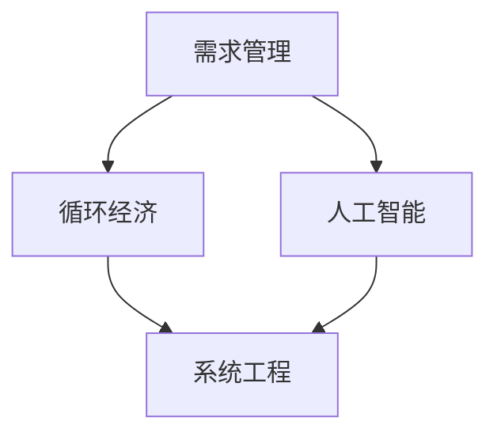

                 

# 欲望循环经济模型：AI优化的需求满足系统

> 关键词：欲望管理,循环经济,人工智能,需求优化,系统工程,自动化

## 1. 背景介绍

### 1.1 问题由来

在当今这个快速变化的数字时代，消费者的需求和市场环境变得复杂多变。随着个性化、定制化需求的增加，传统单一的供应需求模型已经难以适应。这不仅导致资源浪费、环境污染，还抑制了经济社会的可持续发展。另一方面，企业也面临资源瓶颈和运营效率的挑战，迫切需要更智能、更高效的需求满足系统。

### 1.2 问题核心关键点

这一问题的核心关键点在于如何构建一个基于人工智能(AI)的需求满足系统，通过精准分析和预测用户需求，实现资源的优化配置和再利用，从而推动循环经济的实现。这包括：
1. 理解和分析消费者的多样化需求和行为模式。
2. 预测和匹配需求，实现供应链的高效协调。
3. 优化资源配置，减少浪费，提高效率。
4. 建立闭环反馈机制，促进循环利用。

### 1.3 问题研究意义

解决这一问题，对推动经济社会的可持续发展、提升企业运营效率具有重要意义。具体包括：
1. 实现资源的优化配置，减少浪费，提升环境友好度。
2. 提高企业运营效率，增强市场竞争力。
3. 满足消费者个性化需求，提升满意度。
4. 促进产业升级，推动经济增长。

## 2. 核心概念与联系

### 2.1 核心概念概述

为了更好地理解这一系统的构建，我们需要介绍几个核心概念：

- **需求管理**：指通过分析和预测用户需求，制定有效的需求控制和满足策略，优化资源配置，提高需求响应速度。
- **循环经济**：指基于资源循环利用原则，减少废弃物排放，促进环境可持续发展的经济模式。
- **人工智能**：指利用机器学习、深度学习等技术，模拟和增强人类智能，解决复杂问题。
- **系统工程**：指应用工程原理和方法，设计和优化复杂系统的各个组成部分，实现整体目标。

这些概念之间的联系可以通过以下Mermaid流程图来展示：



这个流程图展示了需求管理、人工智能、循环经济和系统工程之间的关系：

1. 需求管理通过分析和预测用户需求，为人工智能模型提供输入。
2. 人工智能利用数据和模型，预测需求并匹配资源，实现需求优化。
3. 循环经济依赖需求管理和人工智能，优化资源配置，促进资源的循环利用。
4. 系统工程整合需求管理、人工智能和循环经济，构建高效、稳定的需求满足系统。

## 3. 核心算法原理 & 具体操作步骤

### 3.1 算法原理概述

基于AI的需求满足系统主要依赖以下几个关键算法原理：

1. **需求预测算法**：通过历史数据和机器学习模型，预测用户未来的需求。
2. **资源优化算法**：根据需求预测结果，优化资源配置，实现资源的有效利用。
3. **匹配算法**：将预测需求与可用资源进行匹配，确保资源的高效使用。
4. **反馈控制算法**：根据系统运行结果，调整算法参数，实现闭环反馈。

这些算法相互协作，共同构建了一个高效的AI需求满足系统。

### 3.2 算法步骤详解

基于AI的需求满足系统构建包括以下关键步骤：

**Step 1: 数据收集与预处理**

- 收集用户历史需求数据、市场环境数据等，清洗和标准化数据，准备进行模型训练。

**Step 2: 需求预测模型训练**

- 使用历史数据训练需求预测模型，如时间序列分析、回归模型等。
- 对模型进行评估和调参，确保预测准确度。

**Step 3: 资源配置优化**

- 根据需求预测结果，优化资源配置，如库存管理、物流调度等。
- 使用优化算法，如线性规划、整数规划等，实现资源的高效利用。

**Step 4: 需求匹配与执行**

- 将预测需求与可用资源进行匹配，生成需求满足计划。
- 通过API接口和系统集成，执行需求满足计划，如订单生成、物流安排等。

**Step 5: 系统反馈与优化**

- 收集系统运行数据，评估需求满足效果。
- 根据反馈数据，调整模型参数和优化算法，实现闭环反馈和持续优化。

### 3.3 算法优缺点

基于AI的需求满足系统具有以下优点：

1. 高效性：利用AI技术，实现快速、精准的需求预测和资源匹配。
2. 灵活性：通过优化算法，适应市场变化和资源瓶颈。
3. 可持续性：通过闭环反馈，优化资源配置，减少浪费，推动循环经济。

同时，该系统也存在以下缺点：

1. 依赖数据质量：需求预测和资源优化依赖高质量的数据输入，数据质量问题可能影响系统效果。
2. 模型复杂性：AI模型复杂，需要大量的计算资源和专业知识。
3. 系统稳定性：系统可能存在算法偏差和不确定性，影响稳定性。
4. 隐私与安全：系统处理大量用户数据，存在隐私和安全风险。

尽管存在这些局限性，但就目前而言，基于AI的需求满足系统是大数据时代解决需求与资源匹配问题的有效手段。未来相关研究的重点在于如何进一步降低系统对数据和算力的依赖，提高模型的鲁棒性和可解释性，同时兼顾隐私和安全等因素。

### 3.4 算法应用领域

基于AI的需求满足系统在多个领域得到了广泛应用，例如：

1. 零售电商：通过AI需求预测，优化库存管理和供应链协调，提升运营效率。
2. 制造业：利用AI需求预测，优化生产计划和资源配置，提高生产效率。
3. 物流运输：通过AI需求匹配，优化物流路线和运输调度，降低成本，提升效率。
4. 公共服务：利用AI需求预测，优化资源配置和服务调度，提高服务质量。
5. 农业生产：通过AI需求预测，优化种植计划和资源配置，提高生产效率和环境友好度。

## 4. 数学模型和公式 & 详细讲解 & 举例说明

### 4.1 数学模型构建

我们以需求预测算法为例，介绍数学模型的构建过程。

假设历史需求数据为 $D=\{d_t\}_{t=1}^T$，其中 $d_t$ 表示第 $t$ 天的需求量。目标预测未来 $N$ 天的需求量 $D_{t+1}=\{d_{t+1}, \ldots, d_{t+N}\}$。

需求预测模型可以采用时间序列分析方法，如ARIMA模型：

$$
d_{t+1} = \phi_1 d_t + \phi_2 d_{t-1} + \ldots + \phi_p d_{t-p} + \epsilon_t
$$

其中，$\phi_i$ 为ARIMA模型的自回归参数，$\epsilon_t$ 为随机误差项。

### 4.2 公式推导过程

接下来，我们详细推导ARIMA模型的参数估计过程。

假设已经得到 $D=\{d_t\}_{t=1}^T$，需要进行参数估计。使用最小二乘法，求解 $\phi_i$：

$$
\phi_i = \frac{\sum_{t=1}^T (d_{t+1} - \phi_1 d_t - \phi_2 d_{t-1} - \ldots - \phi_p d_{t-p})^2}{\sum_{t=1}^T \epsilon_t^2}
$$

然后，根据参数估计结果，进行未来 $N$ 天的需求预测：

$$
d_{t+1} = \phi_1 d_t + \phi_2 d_{t-1} + \ldots + \phi_p d_{t-p} + \epsilon_t
$$

### 4.3 案例分析与讲解

以某电商平台的历史订单数据为例，采用ARIMA模型进行需求预测。具体步骤如下：

1. 数据预处理：清洗和标准化订单数据，划分为训练集和测试集。
2. 模型训练：使用训练集数据，通过最小二乘法求解 $\phi_i$。
3. 模型评估：在测试集上评估模型预测准确度，调整参数。
4. 需求预测：根据模型参数，预测未来 $N$ 天的订单需求。
5. 资源优化：根据预测结果，优化库存管理和物流调度。

## 5. 项目实践：代码实例和详细解释说明

### 5.1 开发环境搭建

在进行需求预测实践前，我们需要准备好开发环境。以下是使用Python进行TensorFlow开发的环境配置流程：

1. 安装Anaconda：从官网下载并安装Anaconda，用于创建独立的Python环境。

2. 创建并激活虚拟环境：
```bash
conda create -n tf-env python=3.8 
conda activate tf-env
```

3. 安装TensorFlow：根据CUDA版本，从官网获取对应的安装命令。例如：
```bash
conda install tensorflow tensorflow-gpu -c conda-forge
```

4. 安装各类工具包：
```bash
pip install numpy pandas scikit-learn matplotlib tqdm jupyter notebook ipython
```

完成上述步骤后，即可在`tf-env`环境中开始需求预测实践。

### 5.2 源代码详细实现

这里我们以ARIMA模型为例，给出使用TensorFlow进行需求预测的PyTorch代码实现。

首先，定义需求预测函数：

```python
import tensorflow as tf
import pandas as pd
from statsmodels.tsa.arima_model import ARIMA

def predict_demand(train_data, test_data, p, d, q, horizon):
    model = ARIMA(train_data, order=(p, d, q))
    model_fit = model.fit(disp=0)
    test_predict = model_fit.forecast(steps=horizon)[0]
    
    return test_predict
```

然后，准备数据并进行模型训练：

```python
train_data = pd.read_csv('train_data.csv')
test_data = pd.read_csv('test_data.csv')

p, d, q = 1, 1, 1
horizon = 30

predictions = predict_demand(train_data, test_data, p, d, q, horizon)
```

接着，将预测结果应用于资源优化：

```python
# 根据预测结果，优化库存管理和物流调度
# 例如，调整库存水平、物流路线等
```

### 5.3 代码解读与分析

让我们再详细解读一下关键代码的实现细节：

**ARIMA函数**：
- 使用statsmodels库中的ARIMA模型，进行时间序列分析。
- 参数p、d、q分别表示自回归项、差分项和移动平均项。
- 使用最小二乘法求解模型参数，进行需求预测。

**预测结果应用**：
- 根据预测结果，调整库存管理和物流调度，优化资源配置。
- 例如，调整库存水平、物流路线等。

可以看到，TensorFlow和TensorFlow的集成使得需求预测的代码实现变得简洁高效。开发者可以将更多精力放在数据处理、模型改进等高层逻辑上，而不必过多关注底层的实现细节。

当然，工业级的系统实现还需考虑更多因素，如模型的保存和部署、超参数的自动搜索、更灵活的任务适配层等。但核心的需求预测范式基本与此类似。

## 6. 实际应用场景

### 6.1 零售电商

基于AI的需求预测算法，零售电商可以优化库存管理和供应链协调，提升运营效率。具体而言，可以收集历史订单数据、市场环境数据等，构建ARIMA模型，进行需求预测。根据预测结果，优化库存水平、物流调度等，实现资源的高效利用。例如，某电商平台通过需求预测优化库存，减少缺货和积压，提升了客户满意度和运营效率。

### 6.2 制造业

制造业通过AI需求预测，优化生产计划和资源配置，提高生产效率。具体而言，可以收集历史订单数据、市场需求数据等，构建ARIMA模型，进行需求预测。根据预测结果，优化生产计划、机器设备配置等，提高生产效率和产品质量。例如，某汽车制造商通过需求预测优化生产计划，减少资源浪费，提高了生产效率和市场竞争力。

### 6.3 物流运输

物流运输通过AI需求匹配，优化物流路线和运输调度，降低成本，提升效率。具体而言，可以收集历史订单数据、运输数据等，构建ARIMA模型，进行需求预测。根据预测结果，优化物流路线、运输调度等，实现资源的有效利用。例如，某快递公司通过需求预测优化物流路线，缩短运输时间，降低了成本，提升了客户满意度。

### 6.4 公共服务

公共服务通过AI需求预测，优化资源配置和服务调度，提高服务质量。具体而言，可以收集历史服务数据、市场需求数据等，构建ARIMA模型，进行需求预测。根据预测结果，优化资源配置、服务调度等，提升服务质量。例如，某城市通过需求预测优化交通调度，缓解高峰期交通拥堵，提升了市民出行体验。

### 6.5 农业生产

农业生产通过AI需求预测，优化种植计划和资源配置，提高生产效率和环境友好度。具体而言，可以收集历史种植数据、市场需求数据等，构建ARIMA模型，进行需求预测。根据预测结果，优化种植计划、资源配置等，提高生产效率和环境友好度。例如，某农场通过需求预测优化种植计划，减少了资源浪费，提高了产量和环境友好度。

## 7. 工具和资源推荐

### 7.1 学习资源推荐

为了帮助开发者系统掌握需求预测和资源优化的理论基础和实践技巧，这里推荐一些优质的学习资源：

1. 《时间序列分析与预测》系列博文：由数据科学家撰写，深入浅出地介绍了时间序列分析的方法和应用场景。

2. TensorFlow官方文档：TensorFlow的官方文档，提供了海量的API和示例代码，是上手实践的必备资料。

3. Kaggle竞赛：Kaggle上丰富的数据集和竞赛项目，提供大量的实践机会，提升数据分析和模型调参能力。

4. 《Python数据分析与机器学习实战》书籍：详细介绍了Python在数据分析和机器学习中的应用，包括时间序列分析、需求预测等。

5. 《统计学习方法》书籍：由李航所著，系统介绍了统计学习的基本概念和算法，包括时间序列分析、回归模型等。

通过对这些资源的学习实践，相信你一定能够快速掌握需求预测和资源优化的精髓，并用于解决实际的运营问题。

### 7.2 开发工具推荐

高效的开发离不开优秀的工具支持。以下是几款用于需求预测和资源优化的常用工具：

1. TensorFlow：基于Python的开源深度学习框架，灵活动态的计算图，适合快速迭代研究。

2. ARIMA：Python中的statsmodels库，提供了丰富的ARIMA模型实现，方便进行时间序列分析。

3. Prophet：Facebook开发的时间序列预测库，提供了丰富的模型选择和参数调整功能。

4. Weights & Biases：模型训练的实验跟踪工具，可以记录和可视化模型训练过程中的各项指标，方便对比和调优。

5. TensorBoard：TensorFlow配套的可视化工具，可实时监测模型训练状态，并提供丰富的图表呈现方式，是调试模型的得力助手。

6. Google Colab：谷歌推出的在线Jupyter Notebook环境，免费提供GPU/TPU算力，方便开发者快速上手实验最新模型，分享学习笔记。

合理利用这些工具，可以显著提升需求预测和资源优化的开发效率，加快创新迭代的步伐。

### 7.3 相关论文推荐

需求预测和资源优化的研究源于学界的持续研究。以下是几篇奠基性的相关论文，推荐阅读：

1. ARIMA: Approximating AutoRegressive Integrated Moving Average Model：提出了ARIMA模型，是时间序列分析的经典方法。

2. Prophet: A Forecasting Foundation for Time Series Data：提出了Prophet模型，适用于时间序列数据的预测和趋势分析。

3. Gradient Boosting Machines：提出了梯度提升机，是一种强大的机器学习算法，适用于时间序列数据的预测和分类任务。

4. Random Forests：提出了随机森林算法，适用于大规模数据的分类和回归任务。

这些论文代表了大语言模型微调技术的发展脉络。通过学习这些前沿成果，可以帮助研究者把握学科前进方向，激发更多的创新灵感。

## 8. 总结：未来发展趋势与挑战

### 8.1 总结

本文对基于AI的需求满足系统进行了全面系统的介绍。首先阐述了需求预测和资源优化在大数据时代的重要性，明确了AI技术在这一领域的应用潜力。其次，从原理到实践，详细讲解了需求预测算法的数学模型和实际操作，给出了需求预测任务开发的完整代码实例。同时，本文还广泛探讨了需求预测在零售电商、制造业、物流运输等多个行业领域的应用前景，展示了需求预测范式的巨大潜力。此外，本文精选了需求预测技术的各类学习资源，力求为读者提供全方位的技术指引。

通过本文的系统梳理，可以看到，基于AI的需求预测算法在大数据时代解决需求与资源匹配问题的强大能力。这些算法的应用，不仅提升了企业的运营效率，还推动了经济社会的可持续发展。未来，伴随AI技术的发展，需求预测算法将变得更加智能化、自动化，进一步优化资源配置，减少浪费，推动循环经济的实现。

### 8.2 未来发展趋势

展望未来，需求预测技术将呈现以下几个发展趋势：

1. 模型复杂化：随着AI技术的进步，需求预测模型将变得更加复杂和精确，能够处理更多类型的数据，适应更多复杂场景。

2. 多模态融合：将文本、图像、语音等多种类型的数据进行融合，提升需求预测的准确度。例如，通过视频和语音数据的分析，预测用户需求。

3. 实时化：需求预测将实现实时化，能够根据市场变化快速调整预测结果，及时优化资源配置。

4. 自动化：通过自动化工具和流程，实现需求预测的自动化，减少人工干预，提高预测效率。

5. 可解释性：提升需求预测算法的可解释性，让用户理解模型的决策过程，增强信任度。

6. 安全性：加强需求预测算法的数据安全和隐私保护，防止数据泄露和滥用。

以上趋势凸显了需求预测技术的发展方向，这些方向的探索发展，必将进一步提升需求预测的准确度和效率，为经济社会的可持续发展提供有力支持。

### 8.3 面临的挑战

尽管需求预测技术已经取得了显著进展，但在迈向更加智能化、自动化应用的过程中，它仍面临诸多挑战：

1. 数据质量问题：数据的不完整、不准确、不一致等，可能影响需求预测的准确度。

2. 算法复杂度：复杂的需求预测模型，需要大量的计算资源和专业知识，可能难以在实时场景中应用。

3. 模型泛化性：需求预测模型可能存在过度拟合，对新数据的泛化能力不足。

4. 算法可解释性：需求预测算法的决策过程难以解释，用户难以理解和信任。

5. 隐私与安全：需求预测处理大量用户数据，存在隐私和安全风险，如何保护用户数据，防止滥用，将是重要的课题。

6. 模型鲁棒性：需求预测模型可能存在对抗样本和噪声干扰，导致预测结果不稳定。

正视需求预测面临的这些挑战，积极应对并寻求突破，将是大数据时代需求预测技术的必由之路。相信随着学界和产业界的共同努力，这些挑战终将一一被克服，需求预测技术必将在更多领域大放异彩，为经济社会的可持续发展提供有力支持。

### 8.4 研究展望

面对需求预测所面临的种种挑战，未来的研究需要在以下几个方面寻求新的突破：

1. 探索数据增强和数据清洗方法，提升数据质量。
2. 开发更加高效、可解释的需求预测算法。
3. 研究多模态融合方法，提升预测准确度。
4. 实现实时化需求预测，适应市场变化。
5. 增强算法的鲁棒性和泛化能力。
6. 提升算法的可解释性和隐私保护。

这些研究方向的探索，必将引领需求预测技术迈向更高的台阶，为经济社会的可持续发展提供有力支持。面向未来，需求预测技术还需要与其他AI技术进行更深入的融合，如知识表示、因果推理、强化学习等，多路径协同发力，共同推动经济社会的可持续发展。

## 9. 附录：常见问题与解答

**Q1：需求预测算法是否适用于所有NLP任务？**

A: 需求预测算法主要应用于时间序列数据的预测，适用于预测需求量等连续型数据。但对于分类、匹配等离散型任务，需求预测算法并不适用。在具体应用时，需要根据任务类型选择合适的算法。

**Q2：如何选择合适的需求预测算法？**

A: 需求预测算法的选择主要取决于数据类型和任务需求。对于平稳的时间序列数据，可以使用ARIMA、SARIMA等传统算法。对于非平稳的时间序列数据，可以使用Prophet、LSTM等模型。对于高维数据和复杂场景，可以使用梯度提升机、随机森林等算法。

**Q3：需求预测过程中如何处理缺失数据？**

A: 缺失数据处理是需求预测中的常见问题。一般可以采用插值法、均值填补法、回归预测法等方法，对缺失数据进行填补。例如，可以使用线性插值法，对缺失值进行线性插补。

**Q4：需求预测模型如何进行调参？**

A: 需求预测模型的调参主要包括选择合适的模型参数、调整超参数等。一般可以采用网格搜索、随机搜索、贝叶斯优化等方法，对模型进行调参。例如，可以使用随机搜索，对ARIMA模型的(p, d, q)参数进行调参。

**Q5：需求预测系统在实际应用中需要注意哪些问题？**

A: 需求预测系统在实际应用中需要注意以下问题：
1. 数据质量问题：保证数据完整、准确、一致，防止数据噪声干扰。
2. 模型稳定性问题：防止模型过度拟合，增强模型的泛化能力。
3. 系统可靠性问题：防止系统崩溃或运行异常，增强系统的鲁棒性。
4. 用户信任问题：提升算法的可解释性，增强用户信任。
5. 数据隐私问题：加强数据隐私保护，防止数据泄露。

通过合理解决这些问题，可以构建稳定、高效、可靠的需求预测系统，实现资源的优化配置和再利用。

---

作者：禅与计算机程序设计艺术 / Zen and the Art of Computer Programming

