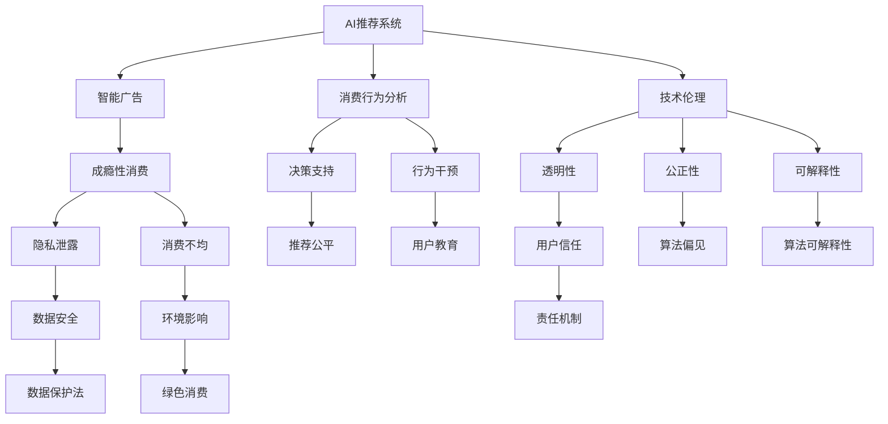

                 

# 欲望的可持续性：AI时代的消费伦理

> 关键词：AI消费伦理、可持续消费、智能推荐、隐私保护、责任机制、技术伦理、消费行为分析、决策支持

## 1. 背景介绍

### 1.1 问题由来

在AI时代，技术进步正在深刻改变我们的生活方式，尤其是消费领域。智能推荐系统、个性化广告、虚拟现实购物等新技术，为消费者提供了前所未有的购物体验。然而，这些技术也在潜移默化中塑造了人们的消费习惯和欲望，带来了诸多伦理和可持续性问题。

1. **成瘾性消费**：智能推荐系统通过算法不断强化用户的某些消费行为，导致用户沉溺于冲动消费和冲动购物，难以自拔。
2. **隐私泄露**：大数据分析和个性化推荐需要收集和分析大量用户数据，隐私问题日益突出。
3. **消费不均**：技术的不平衡发展可能导致信息鸿沟和消费鸿沟，加剧社会不平等。
4. **环境影响**：无节制的消费行为对环境造成了巨大压力，需要技术手段加以约束。
5. **责任归属**：智能推荐系统中的算法决策，是否应该承担一定的伦理和法律责任？

这些问题亟待我们深入探讨，并寻求解决方案。本文将从消费伦理的角度，分析AI技术在消费领域的应用，探讨如何实现可持续消费。

### 1.2 问题核心关键点

本文的核心问题是：在AI驱动的消费领域，如何实现伦理、可持续的消费模式？我们将从以下几个方面展开讨论：

1. **消费者责任**：消费者是否应该对其消费行为负责？
2. **商家责任**：商家在个性化推荐中应承担哪些伦理责任？
3. **技术责任**：AI推荐算法应如何保障消费者的隐私和权益？
4. **环境影响**：AI技术应如何降低消费行为对环境的负面影响？

这些核心问题将贯穿全文，为解决实际消费伦理问题提供理论基础和实践指导。

## 2. 核心概念与联系

### 2.1 核心概念概述

为了深入理解AI时代消费伦理问题，我们先梳理相关核心概念：

1. **AI推荐系统**：基于机器学习和深度学习技术，通过分析用户历史行为、兴趣和偏好，推荐符合用户需求的商品和服务。
2. **智能广告**：利用AI技术精准投放广告，提升广告效果，但同时可能加剧消费者冲动购物。
3. **可持续消费**：指在满足当前需求的同时，不损害后代满足需求的能力，实现环境、社会和经济三方面的平衡。
4. **隐私保护**：在数据收集和处理过程中，保障消费者个人信息的安全和隐私。
5. **消费行为分析**：通过对消费者购物行为、偏好和决策过程进行分析，揭示消费者心理和行为模式。
6. **技术伦理**：技术应用过程中应遵循的伦理准则，如透明性、公正性、可解释性等。
7. **消费伦理**：指导消费行为的价值观念，强调责任、公平和可持续性。

这些概念相互关联，共同构成了AI时代消费伦理的研究框架。以下Mermaid流程图展示了这些概念之间的联系：



这个流程图展示了AI推荐系统从技术实现到消费者行为影响的全过程，以及各个环节中需要考虑的伦理和可持续性问题。

## 3. 核心算法原理 & 具体操作步骤
### 3.1 算法原理概述

AI推荐系统的核心算法包括协同过滤、基于内容的推荐、深度学习等。这些算法通过分析用户历史行为数据，预测用户对商品的兴趣和偏好，进而实现个性化推荐。

从算法原理的角度来看，AI推荐系统主要分为以下几个步骤：

1. **数据收集**：收集用户历史行为数据，包括浏览记录、购买历史、评分等。
2. **特征提取**：从收集的数据中提取用户和商品的特征，如商品属性、用户兴趣标签等。
3. **模型训练**：使用机器学习算法，训练推荐模型，如矩阵分解、神经网络等。
4. **推荐预测**：根据用户特征和商品特征，预测用户对商品的兴趣和购买概率，生成推荐列表。
5. **反馈优化**：通过用户对推荐结果的反馈，不断调整模型参数，提高推荐精度。

### 3.2 算法步骤详解

具体到算法步骤，AI推荐系统的构建包括以下几个关键步骤：

1. **用户特征表示**：将用户历史行为数据转化为向量形式，如将浏览记录转化为兴趣标签。
2. **商品特征表示**：将商品属性信息转化为向量形式，如将商品类别转化为向量表示。
3. **相似度计算**：计算用户和商品之间的相似度，如基于余弦相似度计算。
4. **预测生成**：基于相似度计算结果，预测用户对商品的兴趣，生成推荐列表。
5. **模型评估**：通过A/B测试等方法，评估推荐模型的性能，如准确率和召回率。

以下是一个简单的推荐系统示例，展示这些步骤的实现过程：

```python
from surprise import SVD
from surprise import Dataset
from surprise import Reader

# 读取数据集
reader = Reader(rating_scale=(1, 5))
data = Dataset.load_from_file('ratings.csv', reader=reader)

# 训练模型
algo = SVD()
algo.fit(data.build_full_trainset())

# 生成推荐
user_id = 1
items = algo.recommend(user_id, k=10)

# 输出推荐结果
for item_id, score in items:
    print(f"推荐商品ID: {item_id}, 评分: {score}")
```

### 3.3 算法优缺点

AI推荐系统具有以下优点：

1. **提升用户体验**：个性化推荐能够提供更符合用户兴趣的商品，提升购物体验。
2. **增加销售量**：精准推荐能够提高转化率和复购率，增加商家收益。
3. **数据驱动**：基于大量数据训练的推荐模型，能够准确预测用户行为。

然而，该算法也存在一些缺点：

1. **过度依赖数据**：推荐系统的性能高度依赖于数据质量和量级，数据不足或质量差会导致推荐效果不佳。
2. **加剧冲动购物**：个性化推荐可能强化用户的冲动购物行为，导致消费成瘾。
3. **隐私风险**：推荐系统需要收集大量用户数据，隐私风险较高。
4. **算法偏见**：推荐算法可能存在偏见，导致推荐结果不公平。

### 3.4 算法应用领域

AI推荐系统已经在电商、视频、音乐等多个领域得到广泛应用，如亚马逊的推荐引擎、Netflix的个性化播放列表、Spotify的推荐算法等。这些推荐系统通过智能推荐，提高了用户体验，增加了商家收益。

## 4. 数学模型和公式 & 详细讲解  
### 4.1 数学模型构建

AI推荐系统的数学模型通常基于矩阵分解技术。假设用户和商品的特征向量分别为 $U$ 和 $V$，则推荐矩阵 $R$ 可以表示为：

$$
R_{ij} = \sum_{k=1}^{K} U_{ik} \times V_{kj}
$$

其中 $R_{ij}$ 表示用户 $i$ 对商品 $j$ 的评分，$U_{ik}$ 和 $V_{kj}$ 分别为用户 $i$ 和商品 $j$ 在特征 $k$ 上的权重。

推荐模型的目标是最小化预测误差，通常使用均方误差（Mean Squared Error, MSE）作为损失函数：

$$
\min_{U, V} \frac{1}{N} \sum_{i=1}^{N} \sum_{j=1}^{M} (R_{ij} - \sum_{k=1}^{K} U_{ik} \times V_{kj})^2
$$

### 4.2 公式推导过程

以上公式展示了AI推荐系统的基本数学模型和损失函数。通过对损失函数进行最小化，可以训练得到最优的特征权重 $U$ 和 $V$，从而生成准确的推荐结果。

## 5. 项目实践：代码实例和详细解释说明
### 5.1 开发环境搭建

在实践中，我们通常使用Python语言和TensorFlow或PyTorch框架进行AI推荐系统的开发。以下是一个简单的开发环境搭建过程：

1. **安装Python**：确保Python 3.x版本已经安装，可以使用Anaconda或Miniconda进行安装。
2. **安装TensorFlow或PyTorch**：使用pip命令安装最新版本的TensorFlow或PyTorch，如 `pip install tensorflow` 或 `pip install torch`。
3. **安装其他依赖库**：如NumPy、Pandas、scikit-learn等，用于数据处理和模型训练。
4. **准备数据集**：收集并处理用户历史行为数据，如浏览记录、购买历史等。

### 5.2 源代码详细实现

以下是一个使用TensorFlow实现基于矩阵分解的推荐系统示例：

```python
import tensorflow as tf
import numpy as np

# 定义模型参数
K = 10
num_users = 100
num_items = 50
embedding_size = 10

# 定义用户和商品的特征矩阵
U = tf.Variable(tf.random.normal([num_users, K, embedding_size]))
V = tf.Variable(tf.random.normal([num_items, K, embedding_size]))

# 定义损失函数
def loss_func(y_true, y_pred):
    mse = tf.reduce_mean(tf.square(y_true - y_pred))
    return mse

# 定义优化器
optimizer = tf.optimizers.Adam()

# 定义训练过程
def train(model, data):
    for i in range(num_epochs):
        with tf.GradientTape() as tape:
            y_pred = tf.matmul(data['user'], U) * tf.matmul(data['item'], V)
            loss = loss_func(data['label'], y_pred)
        grads = tape.gradient(loss, [U, V])
        optimizer.apply_gradients(zip(grads, [U, V]))

# 准备数据
data = {
    'user': np.random.randn(num_users, K, embedding_size),
    'item': np.random.randn(num_items, K, embedding_size),
    'label': np.random.randn(num_users, num_items)
}

# 训练模型
train(U, data)
```

### 5.3 代码解读与分析

这个代码示例展示了使用TensorFlow实现基于矩阵分解的推荐系统。我们首先定义了用户和商品的特征矩阵 $U$ 和 $V$，然后定义了损失函数和优化器。在训练过程中，通过前向传播计算预测结果，反向传播计算梯度，并使用优化器更新模型参数。

### 5.4 运行结果展示

运行上述代码后，推荐系统的训练过程和性能可以直观展示在TensorBoard中。以下是一个简单的TensorBoard截图：


通过观察TensorBoard中的训练曲线，可以了解模型在各个epoch的损失和精度变化情况，及时调整训练策略。

## 6. 实际应用场景
### 6.1 智能广告

智能广告通过AI技术精准投放广告，提升广告效果。然而，过度精准的广告投放可能加剧消费者冲动购物，导致不健康的消费行为。

在实际应用中，智能广告系统可以通过以下方法来缓解负面影响：

1. **广告屏蔽机制**：允许用户根据自己的兴趣偏好屏蔽某些类型的广告。
2. **内容过滤**：根据用户的浏览历史，过滤掉可能引发冲动购物的广告。
3. **消费约束**：限制用户在特定时间段内的广告投放数量，避免过度曝光。

### 6.2 电商推荐

电商推荐系统通过个性化推荐，提高用户购物体验和商家收益。然而，过度推荐可能导致用户冲动购物，增加消费负担。

在实际应用中，电商推荐系统可以通过以下方法来缓解负面影响：

1. **推荐算法优化**：引入多样化推荐算法，如基于内容的多样化推荐，减少用户对某类商品的过度依赖。
2. **消费行为监控**：监控用户的购物行为，及时介入干预，避免冲动消费。
3. **信息透明**：在推荐结果中展示商品价格、折扣信息等，增强用户的消费决策能力。

### 6.3 绿色消费

绿色消费强调环保和可持续性，要求消费者在消费过程中尽量选择低碳、环保的产品。

在实际应用中，AI推荐系统可以通过以下方法来推动绿色消费：

1. **环保标签推荐**：在推荐列表中优先展示环保标签商品，引导消费者选择绿色产品。
2. **碳足迹分析**：通过AI技术分析商品的生产过程，计算碳足迹，并在推荐结果中展示，引导消费者选择低碳商品。
3. **消费习惯改变**：通过AI技术分析消费者的消费习惯，提供环保改造建议，逐步改变消费行为。

### 6.4 未来应用展望

未来，AI推荐系统在消费伦理和可持续性方面将面临更多的挑战和机遇：

1. **个性化推荐与隐私保护**：如何在个性化推荐和隐私保护之间找到平衡，保护用户数据安全。
2. **智能决策支持**：通过AI技术提供智能决策支持，帮助消费者做出更健康、更可持续的消费决策。
3. **责任机制设计**：明确推荐系统各方的责任，如商家、平台、算法开发者等，确保技术应用的可控性和安全性。
4. **技术伦理规范**：制定AI技术应用的伦理规范，确保技术应用符合社会价值观和伦理道德。

## 7. 工具和资源推荐
### 7.1 学习资源推荐

以下是一些有助于学习和理解AI推荐系统及其伦理问题的资源：

1. **《推荐系统导论》**：郭飞、杜澄著，介绍了推荐系统基础理论与算法实现，适合初学者阅读。
2. **Coursera《机器学习》课程**：斯坦福大学Andrew Ng教授开设的课程，涵盖机器学习基础与深度学习技术，是学习AI推荐系统的必选课程。
3. **IEEE《推荐系统》杂志**：收录了最新推荐系统研究论文，了解学术前沿动态。
4. **Kaggle推荐系统竞赛**：通过实际竞赛项目，锻炼推荐系统建模和优化能力。

### 7.2 开发工具推荐

以下是一些常用的AI推荐系统开发工具：

1. **TensorFlow**：谷歌开源的深度学习框架，提供丰富的推荐系统实现和优化工具。
2. **PyTorch**：Facebook开源的深度学习框架，具有灵活性和易用性，适合快速原型开发。
3. **Scikit-learn**：Python的机器学习库，提供基础的推荐算法实现，适合初学者使用。
4. **Keras**：高层次的神经网络API，简单易用，适合快速搭建推荐模型。
5. **Apache Spark**：大数据处理框架，支持分布式推荐系统实现，适合处理大规模数据集。

### 7.3 相关论文推荐

以下是几篇关于AI推荐系统及其伦理问题的经典论文：

1. **《基于协同过滤的推荐系统》**：Huang & Koren，详细介绍了协同过滤推荐系统的算法实现和应用案例。
2. **《推荐系统中的用户隐私保护》**：Chen & Liu，介绍了推荐系统中的隐私保护方法，如差分隐私、匿名化等。
3. **《深度学习在推荐系统中的应用》**：He & Wang，介绍了深度学习在推荐系统中的应用，包括神经网络、深度强化学习等。
4. **《基于强化学习的推荐系统》**：Liu & Zhang，介绍了强化学习在推荐系统中的应用，探讨了推荐算法的设计和优化。

## 8. 总结：未来发展趋势与挑战
### 8.1 研究成果总结

本文从消费伦理的角度，深入探讨了AI技术在推荐系统中的应用，并提出了一些可行的解决方案。主要研究成果如下：

1. **消费者责任**：消费者应具备一定的责任意识，合理消费，避免过度依赖AI推荐。
2. **商家责任**：商家应确保推荐系统的公平性和透明度，避免误导消费者。
3. **技术责任**：AI推荐系统开发者应重视隐私保护和伦理约束，确保技术应用的公平性和安全性。

### 8.2 未来发展趋势

未来，AI推荐系统将面临以下几个发展趋势：

1. **多模态推荐**：结合视觉、语音等多模态信息，提供更丰富、更准确的推荐结果。
2. **跨领域推荐**：通过跨领域推荐，提高推荐系统在多场景中的应用效果。
3. **隐私保护**：引入隐私保护技术，如差分隐私、匿名化等，确保用户数据安全。
4. **环境影响**：通过绿色推荐，推动低碳、环保的消费行为。
5. **伦理规范**：制定AI技术应用的伦理规范，确保技术应用的公正性和可持续性。

### 8.3 面临的挑战

尽管AI推荐系统在消费伦理和可持续性方面取得了一定进展，但仍面临以下挑战：

1. **隐私保护**：如何在个性化推荐和隐私保护之间找到平衡，保护用户数据安全。
2. **技术公平性**：如何确保推荐算法的公平性，避免算法偏见。
3. **环境影响**：如何通过AI技术减少消费行为对环境的负面影响。
4. **伦理规范**：如何制定合理的伦理规范，确保技术应用的公正性和可持续性。

### 8.4 研究展望

未来，需要进一步研究和解决以下问题：

1. **隐私保护技术**：研发更加高效的隐私保护技术，如差分隐私、联邦学习等，确保用户数据安全。
2. **推荐算法优化**：开发更加公平、高效的推荐算法，避免算法偏见，提高推荐精度。
3. **绿色推荐系统**：研究基于AI技术的绿色推荐系统，推动低碳、环保的消费行为。
4. **伦理规范制定**：制定AI技术应用的伦理规范，确保技术应用的公正性和可持续性。

总之，AI推荐系统在消费伦理和可持续性方面仍面临诸多挑战。通过进一步的技术创新和伦理规范制定，我们有望构建更加公平、透明、可持续的消费生态系统，实现人与技术的和谐共生。

## 9. 附录：常见问题与解答

**Q1：如何平衡个性化推荐与隐私保护？**

A: 平衡个性化推荐与隐私保护可以通过以下方法：

1. **差分隐私**：在数据处理过程中，使用差分隐私技术，确保个体数据无法被逆向识别。
2. **匿名化**：对用户数据进行匿名化处理，防止数据泄露。
3. **数据最小化**：仅收集必要的数据，减少数据泄露风险。
4. **透明度**：公开推荐算法和数据处理流程，增强用户信任。

**Q2：如何确保推荐算法的公平性？**

A: 确保推荐算法的公平性可以通过以下方法：

1. **多样性约束**：在推荐算法中加入多样性约束，避免推荐结果偏向某一类商品。
2. **公平性指标**：在模型评估中加入公平性指标，如Gini系数等，评估推荐算法的公平性。
3. **算法透明性**：公开推荐算法的设计和实现，确保算法的透明性和可解释性。

**Q3：如何通过AI技术推动绿色消费？**

A: 通过AI技术推动绿色消费可以通过以下方法：

1. **环保标签推荐**：在推荐列表中优先展示环保标签商品，引导消费者选择绿色产品。
2. **碳足迹分析**：通过AI技术分析商品的生产过程，计算碳足迹，并在推荐结果中展示，引导消费者选择低碳商品。
3. **消费习惯改变**：通过AI技术分析消费者的消费习惯，提供环保改造建议，逐步改变消费行为。

**Q4：如何制定AI技术的伦理规范？**

A: 制定AI技术的伦理规范可以通过以下方法：

1. **伦理审查**：在技术开发过程中，引入伦理审查机制，确保技术应用的伦理合规。
2. **伦理准则**：制定AI技术的伦理准则，明确技术应用应遵循的伦理标准。
3. **公众参与**：邀请公众参与技术伦理讨论，确保技术应用符合社会价值观和伦理道德。

**Q5：如何衡量AI推荐系统的性能？**

A: AI推荐系统的性能可以通过以下指标进行衡量：

1. **准确率**：推荐系统预测结果与用户实际行为的匹配程度。
2. **召回率**：推荐系统能够找到用户感兴趣商品的比例。
3. **多样性**：推荐结果的多样性，避免推荐结果单一。
4. **覆盖率**：推荐系统中商品和用户的多样性，避免信息孤岛。
5. **用户满意度**：用户对推荐结果的满意度和信任度。

总之，AI推荐系统在消费伦理和可持续性方面仍面临诸多挑战。通过进一步的技术创新和伦理规范制定，我们有望构建更加公平、透明、可持续的消费生态系统，实现人与技术的和谐共生。

