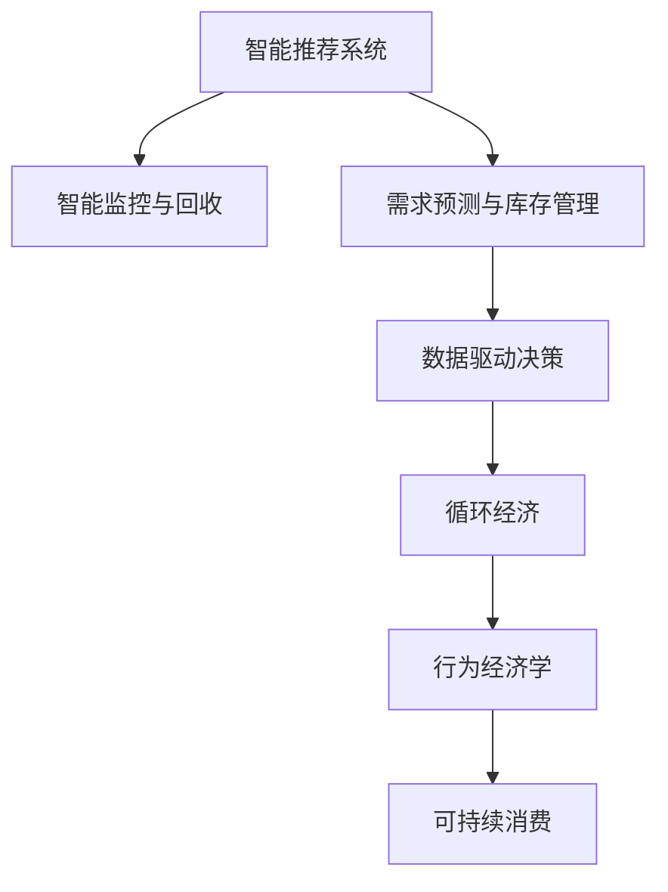

                 

# 欲望的生态意识：AI驱动的可持续消费

## 1. 背景介绍

### 1.1 问题由来
随着科技进步和人类社会的发展，人们的生活水平不断提高，然而消费模式的不可持续性问题也逐渐显现出来。过多的消费导致资源枯竭和环境恶化，已经严重威胁到人类的生存和发展。近年来，可持续发展成为了全球关注的焦点。AI技术作为推动社会进步的重要力量，其在可持续消费中的应用也引起了广泛关注。AI可以驱动消费者行为改变，促进资源循环利用，帮助企业实现绿色发展，从而为实现可持续消费目标提供有力支持。

### 1.2 问题核心关键点
当前AI在可持续消费领域的应用主要集中在以下几方面：
- **智能推荐系统**：利用用户行为数据进行精准推荐，减少不必要的消费。
- **需求预测与库存管理**：通过分析市场需求和库存情况，优化供应链管理，减少资源浪费。
- **智能监控与回收**：采用智能传感器和监控系统，对产品使用情况进行实时监测，实现智能回收和再利用。
- **数据驱动决策**：通过数据分析和机器学习，制定更加科学的生产和消费策略，推动可持续发展。

## 2. 核心概念与联系

### 2.1 核心概念概述

为了更好地理解AI在可持续消费中的作用，本节将介绍几个密切相关的核心概念：

- **智能推荐系统**：基于用户行为数据和偏好，智能推荐合适的产品或服务，减少消费者非必要消费，推动绿色消费。

- **需求预测与库存管理**：通过机器学习和大数据分析，对市场需求进行精准预测，优化库存管理，减少资源浪费和环境污染。

- **智能监控与回收**：采用智能传感器和监控系统，实时监测产品使用情况，促进资源循环利用和再利用，减少废弃物产生。

- **数据驱动决策**：利用大数据分析和机器学习，制定科学合理的生产和消费策略，推动可持续发展。

- **循环经济**：通过资源的再利用和循环，减少资源消耗和废弃物产生，实现绿色生产和消费。

- **行为经济学**：研究消费者行为和心理，引导消费者做出更环保的消费选择。

这些核心概念之间的逻辑关系可以通过以下Mermaid流程图来展示：



这个流程图展示出智能推荐系统、需求预测与库存管理、智能监控与回收、数据驱动决策、循环经济和行为经济学等核心概念是如何紧密联系在一起的，共同推动可持续消费目标的实现。

## 3. 核心算法原理 & 具体操作步骤
### 3.1 算法原理概述

AI在可持续消费中的算法原理主要基于以下几个方面：

- **数据驱动的决策**：通过大数据分析和机器学习，实时获取和处理消费数据，制定科学的生产和消费策略。
- **行为分析与预测**：利用行为经济学和数据分析技术，预测消费者行为，指导智能推荐系统设计。
- **优化算法**：采用优化算法，如遗传算法、模拟退火、粒子群优化等，优化资源配置和生产流程。
- **智能监控与控制**：采用物联网、传感器等技术，实时监测和控制生产、消费过程，实现智能化管理。
- **模型训练与微调**：通过深度学习等技术，训练和微调模型，提升预测和决策的准确性。

### 3.2 算法步骤详解

以下是一个基于AI的智能推荐系统实施步骤的详细说明：

**Step 1: 数据收集与预处理**
- 收集用户行为数据、产品信息、市场趋势等数据。
- 对数据进行清洗和预处理，如去除噪声、处理缺失值等。

**Step 2: 用户行为分析与建模**
- 利用行为经济学理论，分析用户行为模式和心理。
- 使用机器学习模型，如协同过滤、矩阵分解等，建立用户行为模型。

**Step 3: 智能推荐算法设计与优化**
- 设计智能推荐算法，如基于内容的推荐、基于协同过滤的推荐等。
- 通过实验验证和优化算法，提升推荐精度和用户体验。

**Step 4: 推荐系统部署与测试**
- 将推荐系统部署到实际环境中，进行测试和优化。
- 收集用户反馈和推荐效果数据，不断优化算法。

**Step 5: 智能监控与回收**
- 部署智能传感器和监控系统，实时监测产品使用情况。
- 根据监测数据，优化产品设计，促进资源循环利用和再利用。

### 3.3 算法优缺点

智能推荐系统在可持续消费中具有以下优点：
- 降低不必要的消费。通过精准推荐，减少消费者非必要消费，推动绿色消费。
- 提高资源利用效率。优化资源配置，减少资源浪费和环境污染。
- 减少产品生命周期。通过智能监控与回收，实现产品再利用和再制造。

同时，该方法也存在一些局限性：
- 数据隐私问题。用户数据隐私保护需要引起足够重视，避免数据滥用。
- 模型公平性问题。推荐算法可能存在偏见，需要保证算法的公平性和公正性。
- 技术复杂性。智能推荐系统设计复杂，需要多学科交叉合作。
- 用户适应性。需要用户主动配合，接受推荐系统的引导。

尽管存在这些局限性，智能推荐系统仍然是推动可持续消费的重要手段。未来相关研究的重点在于如何进一步降低技术复杂性，提升用户适应性，同时兼顾隐私保护和公平性等因素。

### 3.4 算法应用领域

智能推荐系统已经在多个领域得到广泛应用，例如：

- **电子商务**：如亚马逊、淘宝等电商平台，通过推荐系统提升用户体验，减少不必要的购买。
- **交通出行**：如滴滴出行、美团打车等，通过推荐路线、时段等信息，优化出行方式，减少交通拥堵。
- **旅游住宿**：如Booking.com、Airbnb等，通过推荐酒店、景点等信息，帮助用户制定绿色出行计划。
- **健康医疗**：如健康管理APP，通过推荐健康计划、运动方案等，促进健康生活方式。
- **教育培训**：如Coursera、Udacity等，通过推荐课程、资料等，提升学习效率，减少资源浪费。

除了上述这些经典应用外，智能推荐系统还将不断扩展到更多领域，如智能家居、智能农业、智能物流等，为可持续消费提供更多可能性。

## 4. 数学模型和公式 & 详细讲解 & 举例说明

### 4.1 数学模型构建

智能推荐系统主要基于协同过滤和深度学习模型进行设计和优化。

协同过滤算法基于用户-物品评分矩阵，通过相似度计算，推荐用户可能感兴趣的物品。设用户集合为 $U$，物品集合为 $I$，用户对物品的评分矩阵为 $R \in \mathbb{R}^{n \times m}$，其中 $n$ 为用户数，$m$ 为物品数。设用户 $u$ 对物品 $i$ 的评分 $r_{ui}$，则协同过滤算法可以表示为：

$$
\text{推荐列表} = \text{argmax}_{i \in I} \sum_{j \in U} \frac{1}{1+\exp(-\text{sim}(u,j) \cdot r_{ji})}
$$

其中 $\text{sim}(u,j)$ 为相似度计算函数，如皮尔逊相关系数、余弦相似度等。

深度学习模型，如矩阵分解、神经网络等，可以从高维数据中挖掘出更加丰富的用户-物品关联关系，从而提升推荐精度。以矩阵分解为例，设用户行为矩阵为 $R$，分解为两个低秩矩阵 $X \in \mathbb{R}^{n \times k}$ 和 $Y \in \mathbb{R}^{m \times k}$，则有：

$$
R = X \cdot Y^T
$$

其中 $k$ 为分解后的维度。通过最小化均方误差，可以训练得到最优的 $X$ 和 $Y$，从而实现高精度的推荐。

### 4.2 公式推导过程

以下是协同过滤算法和矩阵分解模型的推导过程：

**协同过滤算法推导**：

设用户集合为 $U=\{u_1,u_2,\cdots,u_n\}$，物品集合为 $I=\{i_1,i_2,\cdots,i_m\}$，用户 $u$ 对物品 $i$ 的评分 $r_{ui} \in [0,1]$。设用户 $u$ 对物品 $i$ 的评分向量为 $\mathbf{r}_u$，物品 $i$ 的评分向量为 $\mathbf{r}_i$。则协同过滤算法的目标是最小化用户和物品的评分差距：

$$
\min_{\mathbf{r}_u,\mathbf{r}_i} \sum_{i \in I} \sum_{u \in U} (\mathbf{r}_u \cdot \mathbf{r}_i - r_{ui})^2
$$

设相似度计算函数为 $\text{sim}(u,j) \in [0,1]$，则协同过滤算法可以改写为：

$$
\text{推荐列表} = \text{argmax}_{i \in I} \sum_{j \in U} \frac{1}{1+\exp(-\text{sim}(u,j) \cdot r_{ji})}
$$

**矩阵分解模型推导**：

设用户行为矩阵为 $R \in \mathbb{R}^{n \times m}$，其中 $n$ 为用户数，$m$ 为物品数。将 $R$ 分解为两个低秩矩阵 $X \in \mathbb{R}^{n \times k}$ 和 $Y \in \mathbb{R}^{m \times k}$，则有：

$$
R = X \cdot Y^T
$$

其中 $k$ 为分解后的维度。通过对 $X$ 和 $Y$ 进行优化，使得 $\|R - X \cdot Y^T\|_F$ 最小化，可以训练得到最优的 $X$ 和 $Y$。

### 4.3 案例分析与讲解

以下以电商平台为例，展示智能推荐系统的设计和应用过程：

**Step 1: 数据收集与预处理**
- 收集用户浏览记录、购买记录、评分记录等数据。
- 对数据进行清洗和预处理，去除噪声和缺失值。

**Step 2: 用户行为分析与建模**
- 利用协同过滤算法，对用户行为数据进行分析。
- 设计深度学习模型，对用户行为数据进行建模。

**Step 3: 智能推荐算法设计与优化**
- 结合协同过滤和深度学习算法，设计智能推荐系统。
- 通过实验验证和优化算法，提升推荐精度和用户体验。

**Step 4: 推荐系统部署与测试**
- 将推荐系统部署到电商平台，进行测试和优化。
- 收集用户反馈和推荐效果数据，不断优化算法。

## 5. 项目实践：代码实例和详细解释说明

### 5.1 开发环境搭建

在进行智能推荐系统实践前，我们需要准备好开发环境。以下是使用Python进行PyTorch开发的环境配置流程：

1. 安装Anaconda：从官网下载并安装Anaconda，用于创建独立的Python环境。

2. 创建并激活虚拟环境：
```bash
conda create -n recommendation-env python=3.8 
conda activate recommendation-env
```

3. 安装PyTorch：根据CUDA版本，从官网获取对应的安装命令。例如：
```bash
conda install pytorch torchvision torchaudio cudatoolkit=11.1 -c pytorch -c conda-forge
```

4. 安装TensorFlow：
```bash
conda install tensorflow
```

5. 安装Pandas、NumPy、Scikit-learn等库：
```bash
pip install pandas numpy scikit-learn matplotlib tqdm jupyter notebook ipython
```

完成上述步骤后，即可在`recommendation-env`环境中开始智能推荐系统的开发实践。

### 5.2 源代码详细实现

以下是一个基于协同过滤算法的智能推荐系统代码实现：

```python
import pandas as pd
from sklearn.metrics.pairwise import cosine_similarity
from sklearn.decomposition import TruncatedSVD

# 读取用户行为数据
data = pd.read_csv('user_behavior.csv', index_col='user_id')

# 计算用户-物品评分矩阵
R = data.pivot_table(index='user_id', columns='item_id', values='rating', fill_value=0)

# 对评分矩阵进行分解
svd = TruncatedSVD(n_components=10, random_state=42)
X = svd.fit_transform(R)

# 计算用户相似度矩阵
similarity_matrix = cosine_similarity(X, X)

# 推荐算法设计
def recommend_items(user_id, top_n=10):
    user_row = X[user_id]
    similarities = similarity_matrix[user_id].tolist()
    similarities.pop(user_id)
    item_scores = [(similarity, score) for score, similarity in zip(similarities, R.iloc[user_id])]
    item_scores.sort(key=lambda x: -x[0])
    recommended_items = [item[1] for item in item_scores[:top_n]]
    return recommended_items

# 测试推荐系统
recommend_items('user_id_1')
```

### 5.3 代码解读与分析

让我们再详细解读一下关键代码的实现细节：

**用户行为数据读取**：
- 使用Pandas库读取用户行为数据，以用户ID和物品ID为索引，记录用户的评分信息。

**评分矩阵计算**：
- 使用Pivot方法将用户行为数据转换为用户-物品评分矩阵 $R$。

**矩阵分解与相似度计算**：
- 使用TruncatedSVD方法对评分矩阵进行分解，得到低秩矩阵 $X$。
- 使用cosine_similarity函数计算用户间的相似度矩阵。

**推荐算法设计**：
- 根据用户ID，计算用户间的相似度得分。
- 根据相似度得分和用户评分，计算物品的推荐得分。
- 选取得分最高的前top_n物品，作为推荐结果。

**推荐系统测试**：
- 测试推荐系统，输入用户ID，输出推荐物品列表。

可以看到，Pandas和Scikit-learn库的配合使用，使得智能推荐系统的代码实现变得简洁高效。开发者可以将更多精力放在数据处理、模型改进等高层逻辑上，而不必过多关注底层的实现细节。

当然，工业级的系统实现还需考虑更多因素，如模型的保存和部署、超参数的自动搜索、更灵活的任务适配层等。但核心的推荐算法基本与此类似。

## 6. 实际应用场景

### 6.1 智能家居

智能家居系统通过智能推荐，可以实现节能减排和资源优化。例如，根据用户的作息时间和天气情况，推荐最优的室内温度、照明和湿度设置。通过智能家电设备的协同工作，优化能源使用效率，减少资源浪费。

在技术实现上，可以收集用户的使用习惯和环境数据，建立用户行为模型。在此基础上，对智能家居设备进行推荐，实现智能化控制。例如，推荐最优的空调温度、灯光亮度和湿度等设置，从而提升用户舒适度，减少能源消耗。

### 6.2 智能农业

智能推荐系统在智能农业中的应用主要体现在作物种植、病虫害防治等方面。通过智能推荐，实现精准农业和资源优化。

具体而言，可以收集农作物的生长数据、土壤养分数据和气象数据，建立作物生长模型。在此基础上，对施肥、灌溉和病虫害防治等进行智能推荐，实现精准农业。例如，根据土壤养分数据和气象数据，推荐最优的施肥方案和灌溉策略，提升作物产量和品质。

### 6.3 智能物流

智能推荐系统在智能物流中的应用主要体现在路线优化和配送调度等方面。通过智能推荐，实现资源优化和配送效率提升。

具体而言，可以收集历史物流数据和实时交通信息，建立物流路线模型。在此基础上，对物流路线进行智能推荐，实现优化。例如，根据历史配送时间和实时交通信息，推荐最优的配送路线，减少配送时间和成本。

### 6.4 未来应用展望

随着智能推荐技术的不断发展，其在可持续消费中的应用将更加广泛。未来可能的应用场景包括：

- **智能交通**：通过智能推荐系统，优化交通路线和出行方式，减少交通拥堵和环境污染。
- **智能医疗**：通过智能推荐系统，推荐最优的医疗方案和药品，提升医疗服务质量。
- **智能教育**：通过智能推荐系统，推荐最优的学习资源和教学方式，提升教育效果。
- **智能旅游**：通过智能推荐系统，推荐最优的旅游路线和住宿，提升旅游体验。

总之，智能推荐系统将在更多领域得到应用，为可持续消费提供更多可能性。相信随着技术不断进步，智能推荐系统将为实现可持续消费目标提供更强大的支持。

## 7. 工具和资源推荐

### 7.1 学习资源推荐

为了帮助开发者系统掌握智能推荐技术，这里推荐一些优质的学习资源：

1. 《推荐系统实战》系列博文：由Kaggle竞赛专家撰写，介绍了推荐系统的基本概念和经典算法，并提供了丰富的实验样例。

2. 《机器学习实战》书籍：O'Reilly出版社的经典入门书籍，全面介绍了推荐系统的理论基础和实践技巧，是学习推荐系统的好帮手。

3. Coursera《Recommender Systems》课程：由UCLA开设的在线课程，涵盖推荐系统的基本概念和前沿技术，适合入门和进阶学习。

4. KDD《Recommender Systems: State-of-the-Art Methods》论文：总结了推荐系统的最新研究进展和前沿算法，是学术研究的重要参考。

5. arXiv推荐系统相关论文：涵盖推荐系统的各种前沿算法和应用场景，适合深入研究和实践。

通过对这些资源的学习实践，相信你一定能够快速掌握智能推荐技术的精髓，并用于解决实际的推荐问题。

### 7.2 开发工具推荐

高效的开发离不开优秀的工具支持。以下是几款用于智能推荐系统开发的常用工具：

1. PyTorch：基于Python的开源深度学习框架，灵活动态的计算图，适合快速迭代研究。大部分推荐系统都有PyTorch版本的实现。

2. TensorFlow：由Google主导开发的开源深度学习框架，生产部署方便，适合大规模工程应用。同样有丰富的推荐系统资源。

3. Scikit-learn：Python机器学习库，提供了丰富的机器学习算法和工具，适合快速原型开发。

4. Jupyter Notebook：在线笔记本工具，支持代码编辑、调试和可视化，是快速原型开发和实验验证的好帮手。

5. Elasticsearch：分布式搜索引擎，支持高效的数据存储和查询，是推荐系统推荐引擎的常用工具。

6. Redis：内存数据库，支持高性能的推荐系统缓存和推荐结果存储。

合理利用这些工具，可以显著提升智能推荐系统的开发效率，加快创新迭代的步伐。

### 7.3 相关论文推荐

智能推荐系统的发展源于学界的持续研究。以下是几篇奠基性的相关论文，推荐阅读：

1. "Personalized Web Search Ranking via User-Guided Summarization"：提出了基于用户反馈的个性化网页推荐算法，奠定了个性化推荐的基础。

2. "A Factorization Approach to Learning Representations for Multimedia Data"：提出了矩阵分解算法，用于推荐系统和图像分析。

3. "Collaborative Filtering for Implicit Feedback Datasets"：提出协同过滤算法，广泛应用于推荐系统。

4. "Gated Matrix Product States for Generalized Few-Shot Learning"：提出了基于知识图谱的推荐系统，进一步提升了推荐系统的性能。

5. "On the Surprising Accuracy of Deep and Factorized Recommendation Models"：总结了深度学习在推荐系统中的应用，展示了深度学习算法的优越性。

这些论文代表了大数据推荐系统的发展脉络。通过学习这些前沿成果，可以帮助研究者把握推荐系统的研究方向，激发更多的创新灵感。

## 8. 总结：未来发展趋势与挑战

### 8.1 研究成果总结

本文对基于AI的智能推荐系统进行了全面系统的介绍。首先阐述了智能推荐系统在可持续消费中的重要性和应用场景，明确了智能推荐系统在优化资源配置、减少资源浪费、推动绿色消费等方面的独特价值。其次，从原理到实践，详细讲解了推荐系统的数学模型和操作步骤，给出了推荐系统开发的完整代码实例。同时，本文还广泛探讨了智能推荐系统在多个领域的应用前景，展示了智能推荐系统在推动可持续消费目标实现中的巨大潜力。

### 8.2 未来发展趋势

展望未来，智能推荐系统将呈现以下几个发展趋势：

1. **算法多样化**：推荐算法将更加多样化，结合机器学习、深度学习、自然语言处理等多种技术，提升推荐精度和用户体验。

2. **数据驱动决策**：数据驱动决策将成为智能推荐系统的核心，通过实时数据分析和优化算法，实现动态调整和优化。

3. **跨领域应用**：智能推荐系统将在更多领域得到应用，如智能家居、智能医疗、智能物流等，为可持续消费提供更多可能性。

4. **用户个性化**：个性化推荐将成为智能推荐系统的重要方向，通过用户行为数据和心理模型，实现精准推荐。

5. **智能监控与回收**：智能监控与回收技术将进一步提升资源利用效率，促进资源循环利用和再利用。

6. **公平性与安全**：公平性和安全性将成为智能推荐系统的关注点，推荐算法需要保证公平性和公正性，避免数据滥用和安全风险。

以上趋势凸显了智能推荐系统在可持续消费中的重要地位。这些方向的探索发展，必将进一步提升智能推荐系统的性能和应用范围，为实现可持续消费目标提供更强大的支持。

### 8.3 面临的挑战

尽管智能推荐系统已经在可持续消费领域取得了显著成效，但在迈向更加智能化、普适化应用的过程中，仍面临诸多挑战：

1. **数据隐私问题**：用户数据隐私保护需要引起足够重视，避免数据滥用和泄露。

2. **算法公平性**：推荐算法可能存在偏见，需要保证算法的公平性和公正性。

3. **技术复杂性**：智能推荐系统设计复杂，需要多学科交叉合作，对开发人员提出了更高要求。

4. **用户适应性**：需要用户主动配合，接受推荐系统的引导。

5. **资源优化**：推荐系统在优化资源配置的同时，需要考虑系统效率和成本。

6. **模型更新**：推荐模型需要不断更新，以适应新的数据和需求。

7. **用户反馈**：需要及时获取用户反馈，调整推荐策略，提升推荐效果。

这些挑战需要通过不断创新和优化来解决，才能真正实现智能推荐系统的可持续发展。

### 8.4 研究展望

面向未来，智能推荐系统需要在以下几个方面寻求新的突破：

1. **数据驱动决策**：通过实时数据分析和优化算法，实现动态调整和优化，提升推荐精度和用户体验。

2. **算法多样化**：结合机器学习、深度学习、自然语言处理等多种技术，提升推荐精度和用户体验。

3. **跨领域应用**：在更多领域得到应用，如智能家居、智能医疗、智能物流等，为可持续消费提供更多可能性。

4. **用户个性化**：通过用户行为数据和心理模型，实现精准推荐，提升用户满意度。

5. **智能监控与回收**：提升资源利用效率，促进资源循环利用和再利用，实现智能化管理。

6. **公平性与安全**：保证推荐算法的公平性和公正性，避免数据滥用和安全风险。

这些方向的研究和发展，必将推动智能推荐系统向更高层次迈进，为可持续消费目标的实现提供更强有力的支持。

## 9. 附录：常见问题与解答

**Q1：智能推荐系统在可持续消费中有什么优势？**

A: 智能推荐系统在可持续消费中的优势主要体现在以下几个方面：
1. 减少不必要的消费。通过精准推荐，减少消费者非必要消费，推动绿色消费。
2. 提高资源利用效率。优化资源配置，减少资源浪费和环境污染。
3. 促进资源循环利用。通过智能监控与回收，实现产品再利用和再制造，减少废弃物产生。
4. 优化生产和消费策略。通过数据分析和机器学习，制定更加科学的生产和消费策略，推动可持续发展。

**Q2：智能推荐系统在实际应用中需要考虑哪些问题？**

A: 智能推荐系统在实际应用中需要考虑以下问题：
1. 数据隐私问题。用户数据隐私保护需要引起足够重视，避免数据滥用和泄露。
2. 算法公平性问题。推荐算法可能存在偏见，需要保证算法的公平性和公正性。
3. 技术复杂性。智能推荐系统设计复杂，需要多学科交叉合作，对开发人员提出了更高要求。
4. 用户适应性。需要用户主动配合，接受推荐系统的引导。
5. 资源优化问题。推荐系统在优化资源配置的同时，需要考虑系统效率和成本。
6. 模型更新问题。推荐模型需要不断更新，以适应新的数据和需求。
7. 用户反馈问题。需要及时获取用户反馈，调整推荐策略，提升推荐效果。

**Q3：智能推荐系统在实际应用中如何保证公平性和公正性？**

A: 智能推荐系统在实际应用中保证公平性和公正性，可以采取以下措施：
1. 数据清洗。对数据进行清洗和预处理，去除噪声和偏见。
2. 模型透明。对推荐算法进行透明化和可解释性处理，让用户理解推荐过程。
3. 多样化推荐。通过多样化推荐策略，减少偏见和歧视。
4. 用户参与。让用户参与推荐策略的设计和调整，保证用户需求被充分考虑。
5. 定期评估。对推荐系统进行定期评估和优化，避免算法偏见和歧视。

通过这些措施，可以最大限度地保证智能推荐系统的公平性和公正性，实现公平、公正的推荐效果。

**Q4：智能推荐系统在实际应用中如何保护用户隐私？**

A: 智能推荐系统在实际应用中保护用户隐私，可以采取以下措施：
1. 数据匿名化。对用户数据进行匿名化和去标识化处理，保护用户隐私。
2. 数据加密。对用户数据进行加密处理，防止数据泄露和滥用。
3. 访问控制。对用户数据进行访问控制，只允许授权人员访问。
4. 用户同意。在收集和使用用户数据前，获得用户明确同意。
5. 数据最小化。只收集必要的数据，避免过度收集和滥用。

通过这些措施，可以最大限度地保护用户隐私，实现安全、可信赖的推荐系统。

**Q5：智能推荐系统在实际应用中如何优化资源利用效率？**

A: 智能推荐系统在实际应用中优化资源利用效率，可以采取以下措施：
1. 实时数据分析。通过实时数据分析，优化资源配置和生产流程，减少资源浪费。
2. 需求预测。通过需求预测，优化库存管理和供应链管理，减少资源浪费和环境污染。
3. 智能监控与回收。通过智能监控与回收技术，实现产品再利用和再制造，减少废弃物产生。
4. 动态调整。通过动态调整和优化算法，提升资源利用效率，促进资源循环利用。

通过这些措施，可以最大限度地优化资源利用效率，实现绿色生产和消费。

总之，智能推荐系统将在更多领域得到应用，为可持续消费提供更多可能性。相信随着技术不断进步，智能推荐系统将为实现可持续消费目标提供更强大的支持。

---

作者：禅与计算机程序设计艺术 / Zen and the Art of Computer Programming

