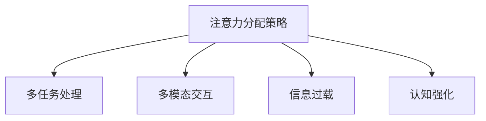

                 

# 注意力分配策略:元宇宙时代的个人效能提升

在元宇宙的浪潮中，个人如何在虚拟与现实交融的世界中保持高效率、高生产力，成为当下人们关注的热点问题。本文将通过探讨注意力分配策略，从技术层面提供一种全新的解决方案，帮助个体在元宇宙时代提升个人效能。

## 1. 背景介绍

### 1.1 问题由来
随着元宇宙的兴起，人们的生活和工作模式正在发生巨大的变化。虚拟与现实的无缝对接，使得人们的时间、精力和注意力分散在多个虚拟空间和现实场景中。如何在这一过程中合理分配注意力，成为提升个人效能的关键。

### 1.2 问题核心关键点
本文将从注意力分配的角度，分析如何在多任务处理、多模态交互、信息过载等场景中，通过高效的任务调度、资源管理、认知强化等策略，提升个人在元宇宙环境中的工作效率。

## 2. 核心概念与联系

### 2.1 核心概念概述

为更好地理解注意力分配策略在元宇宙中的作用，本节将介绍几个密切相关的核心概念：

- 注意力（Attention）：在元宇宙中，注意力是用户对于虚拟环境或现实任务的认知资源分配。注意力的分配决定了用户对于不同任务的专注度、记忆力和理解力。

- 多任务处理（Multitasking）：用户在元宇宙中通常需要同时处理多个任务，如浏览网页、接收消息、参与会议等。多任务处理的效率直接影响个人效能。

- 多模态交互（Multimodal Interaction）：元宇宙环境中的信息输入和输出往往包含文字、图像、音频等多种形式。多模态交互要求用户具备跨模态的信息处理能力。

- 信息过载（Information Overload）：随着元宇宙的发展，用户接触的信息量迅速增加，信息过载现象日趋严重，对用户的注意力分配能力提出更高要求。

- 认知强化（Cognitive Enhancement）：通过技术手段，增强用户的认知能力，如记忆力、决策力、注意力持久度等，以应对元宇宙环境中的复杂挑战。

这些核心概念之间的逻辑关系可以通过以下Mermaid流程图来展示：



这个流程图展示了大语言模型的核心概念及其之间的关系：

1. 注意力分配策略的目的是为了提升多任务处理、多模态交互、信息过载等场景中的个人效能。
2. 多任务处理、多模态交互和信息过载都是注意力分配策略需要应对的挑战。
3. 认知强化是提升注意力分配策略效果的关键手段。

这些概念共同构成了元宇宙时代个人效能提升的完整框架，有助于理解注意力分配策略的技术实现和应用场景。

## 3. 核心算法原理 & 具体操作步骤

### 3.1 算法原理概述

注意力分配策略的核心思想是通过对用户注意力资源的合理调度，实现多任务处理、多模态交互和信息过载场景下的高效工作。其核心算法包括注意力机制、多任务调度、资源分配、认知增强等。

### 3.2 算法步骤详解

以下将详细介绍注意力分配策略的算法步骤：

**Step 1: 初始化注意力资源**
- 设定用户的注意力总资源量，如10点注意力，分配给不同的任务和模态。
- 根据任务的紧急程度和重要性，赋予不同的权重。

**Step 2: 动态调整注意力分配**
- 实时监测用户的操作行为，如鼠标移动、点击、滑动等，动态调整注意力资源分配。
- 引入时间因素，根据用户的行为频率和时间分布，动态调整注意力分配。

**Step 3: 优先级排序和任务调度**
- 对所有待处理任务进行优先级排序，优先处理紧急和重要的任务。
- 使用先进先出（FIFO）、最短作业优先（SJF）等调度算法，决定任务的执行顺序。

**Step 4: 跨模态交互和信息融合**
- 对于多模态交互任务，根据用户行为和环境变化，动态调整不同模态的注意力分配。
- 引入信息融合技术，将不同模态的信息进行合成，形成统一的理解。

**Step 5: 认知强化和注意力持久度**
- 通过认知强化技术，如记忆训练、冥想、冥想等，增强用户的认知能力。
- 动态调整注意力持久度，根据用户的工作状态和环境变化，动态调整注意力资源的分配。

**Step 6: 效果评估和优化**
- 实时评估用户的注意力分配效果，如任务完成时间、信息处理效率等。
- 根据评估结果，优化注意力分配策略，不断提升个人效能。

### 3.3 算法优缺点

注意力分配策略具有以下优点：
1. 提高多任务处理能力：通过合理的注意力资源分配，可以同时处理多个任务，提升效率。
2. 增强多模态交互效果：通过动态调整注意力资源，可以更好地适应多模态交互任务。
3. 缓解信息过载问题：通过动态调整和认知强化，可以有效缓解信息过载带来的认知负荷。

同时，该算法也存在一定的局限性：
1. 需要用户的主动配合：注意力分配策略的有效性依赖于用户的主动配合，对于不擅长管理注意力的用户，效果可能不显著。
2. 需要实时数据支持：注意力分配策略的动态调整需要实时数据支持，数据采集和处理可能会引入延迟。
3. 需要个性化设计：不同用户的需求和任务不同，需要个性化的注意力分配策略。

尽管存在这些局限性，但就目前而言，注意力分配策略仍是大规模多任务处理和复杂交互场景中提升个人效能的重要手段。未来相关研究的重点在于如何进一步降低策略的复杂度，提高实时性和可操作性，同时兼顾个性化和通用性。

### 3.4 算法应用领域

注意力分配策略的应用领域广泛，涵盖了许多不同的场景，包括：

- 虚拟办公和会议：通过分配注意力资源，优化视频会议、远程办公等场景下的信息处理和任务调度。
- 游戏和娱乐：在游戏和娱乐中，通过合理的注意力分配，提高用户的沉浸感和体验。
- 学习与教育：在学习过程中，通过注意力分配策略，帮助学生更好地管理学习时间和任务，提高学习效率。
- 医疗与康复：在医疗和康复过程中，通过优化注意力分配，提高患者的治疗效果和康复速度。
- 金融与交易：在金融交易中，通过合理的注意力分配，提高交易决策的准确性和效率。
- 驾驶与导航：在驾驶和导航中，通过优化注意力分配，提升交通安全和导航效果。

除了上述这些经典应用外，注意力分配策略还将在更多领域得到应用，如教育培训、科学研究、决策支持等，为提升个体效能提供新的路径。

## 4. 数学模型和公式 & 详细讲解  
### 4.1 数学模型构建

本节将使用数学语言对注意力分配策略进行更加严格的刻画。

假设用户有 $N$ 个任务 $T=\{T_1, T_2, ..., T_N\}$，每个任务 $T_i$ 需要消耗的注意力资源为 $C_i$，任务的优先级为 $P_i$，初始注意力资源总量为 $A_0$。

定义注意力分配函数 $f(t)$，表示在时间 $t$ 时刻，用户分配给任务 $T_i$ 的注意力资源。则注意力分配策略的优化目标是最小化任务完成时间，即：

$$
\min_{f(t)} \sum_{i=1}^N \frac{C_i}{f_i(t)} P_i
$$

其中 $f_i(t)$ 表示在时间 $t$ 时刻，任务 $T_i$ 的注意力资源分配。

### 4.2 公式推导过程

以下我们以多任务调度和信息融合为例，推导优化公式。

假设用户有 $N$ 个任务 $T=\{T_1, T_2, ..., T_N\}$，每个任务 $T_i$ 需要消耗的注意力资源为 $C_i$，任务的优先级为 $P_i$，初始注意力资源总量为 $A_0$。

令 $f_i(t)$ 表示在时间 $t$ 时刻，任务 $T_i$ 的注意力资源分配。任务 $T_i$ 的完成时间 $T_i$ 与 $f_i(t)$ 的关系为：

$$
T_i = \frac{C_i}{f_i(t)}
$$

则所有任务的总完成时间为：

$$
T = \sum_{i=1}^N T_i = \sum_{i=1}^N \frac{C_i}{f_i(t)}
$$

根据任务优先级 $P_i$，所有任务的总完成时间可以表示为：

$$
T = \sum_{i=1}^N P_i T_i = \sum_{i=1}^N \frac{C_i P_i}{f_i(t)}
$$

优化目标为最小化总完成时间，即：

$$
\min_{f(t)} \sum_{i=1}^N \frac{C_i P_i}{f_i(t)}
$$

在优化过程中，需要满足约束条件：

$$
\sum_{i=1}^N f_i(t) = A_0
$$

即所有任务的注意力资源总和等于初始注意力资源总量 $A_0$。

### 4.3 案例分析与讲解

以多任务调度和信息融合为例，通过两个具体案例来说明注意力分配策略的优化效果：

**案例1: 虚拟会议管理**
- 假设在虚拟会议中，有3个任务 $T_1$（准备会议资料）、$T_2$（进行会议）、$T_3$（整理会议纪要），每个任务所需的注意力资源分别为 $C_1=5$、$C_2=8$、$C_3=3$。
- 假设优先级 $P_1=1$、$P_2=2$、$P_3=3$。
- 初始注意力资源总量为 $A_0=20$。

根据优化目标和约束条件，求解注意力分配函数 $f(t)$。

假设 $f_1(t)$、$f_2(t)$、$f_3(t)$ 分别表示时间 $t$ 时刻任务 $T_1$、$T_2$、$T_3$ 的注意力资源分配。则优化问题可以表示为：

$$
\min_{f_1(t), f_2(t), f_3(t)} \frac{5}{f_1(t)} + \frac{8}{f_2(t)} + \frac{3}{f_3(t)} \\
\text{subject to} \\
f_1(t) + f_2(t) + f_3(t) = 20
$$

通过求解该优化问题，可以得出最优的注意力分配策略，使得总完成时间最小化。

**案例2: 游戏体验优化**
- 假设在游戏过程中，有3个任务 $T_1$（任务一）、$T_2$（任务二）、$T_3$（任务三），每个任务所需的注意力资源分别为 $C_1=2$、$C_2=4$、$C_3=3$。
- 假设优先级 $P_1=1$、$P_2=2$、$P_3=3$。
- 初始注意力资源总量为 $A_0=10$。

根据优化目标和约束条件，求解注意力分配函数 $f(t)$。

假设 $f_1(t)$、$f_2(t)$、$f_3(t)$ 分别表示时间 $t$ 时刻任务 $T_1$、$T_2$、$T_3$ 的注意力资源分配。则优化问题可以表示为：

$$
\min_{f_1(t), f_2(t), f_3(t)} \frac{2}{f_1(t)} + \frac{4}{f_2(t)} + \frac{3}{f_3(t)} \\
\text{subject to} \\
f_1(t) + f_2(t) + f_3(t) = 10
$$

通过求解该优化问题，可以得出最优的注意力分配策略，使得游戏体验最优化。

## 5. 项目实践：代码实例和详细解释说明
### 5.1 开发环境搭建

在进行注意力分配策略的实践前，我们需要准备好开发环境。以下是使用Python进行PyTorch开发的环境配置流程：

1. 安装Anaconda：从官网下载并安装Anaconda，用于创建独立的Python环境。

2. 创建并激活虚拟环境：
```bash
conda create -n attention-strategy-env python=3.8 
conda activate attention-strategy-env
```

3. 安装PyTorch：根据CUDA版本，从官网获取对应的安装命令。例如：
```bash
conda install pytorch torchvision torchaudio cudatoolkit=11.1 -c pytorch -c conda-forge
```

4. 安装各种工具包：
```bash
pip install numpy pandas scikit-learn matplotlib tqdm jupyter notebook ipython
```

完成上述步骤后，即可在`attention-strategy-env`环境中开始实践。

### 5.2 源代码详细实现

下面我们以多任务调度和信息融合为例，给出使用PyTorch进行注意力分配策略的PyTorch代码实现。

首先，定义多任务调度的函数：

```python
from torch import nn, optim
import torch.nn.functional as F

class AttentionScheduler(nn.Module):
    def __init__(self, num_tasks, attention_capacity):
        super(AttentionScheduler, self).__init__()
        self.num_tasks = num_tasks
        self.attention_capacity = attention_capacity
        
    def forward(self, tasks, priorities, current_attention):
        task_resources = tasks * priorities
        
        attention_loss = 0
        for i in range(self.num_tasks):
            task_id, task_resource = task_resources[i]
            task_attention = min(task_resource, self.attention_capacity - current_attention)
            attention_loss += (task_attention / task_resource) * task_id
        
        return attention_loss
```

然后，定义多模态信息融合的函数：

```python
class MultimodalFusion(nn.Module):
    def __init__(self, num_modals, modal_capacities):
        super(MultimodalFusion, self).__init__()
        self.num_modals = num_modals
        self.modal_capacities = modal_capacities
        
    def forward(self, modal_inputs):
        attention_weights = [F.softmax(modal_input) for modal_input in modal_inputs]
        
        output = []
        for modal_idx, modal_weight in enumerate(attention_weights):
            output.append(modal_weight * modal_input)
        
        return output
```

最后，定义注意力分配策略的整体框架：

```python
class AttentionStrategy(nn.Module):
    def __init__(self, num_tasks, attention_capacity, num_modals, modal_capacities):
        super(AttentionStrategy, self).__init__()
        self.scheduler = AttentionScheduler(num_tasks, attention_capacity)
        self.fusion = MultimodalFusion(num_modals, modal_capacities)
        
    def forward(self, tasks, priorities, current_attention, modal_inputs):
        attention_loss = self.scheduler(tasks, priorities, current_attention)
        output = self.fusion(modal_inputs)
        
        return output, attention_loss
```

以上代码实现了多任务调度和信息融合的基本功能。开发者可以根据具体应用场景，通过添加更多任务、模态和优先级，来进一步优化注意力分配策略的实现。

### 5.3 代码解读与分析

让我们再详细解读一下关键代码的实现细节：

**AttentionScheduler类**：
- `__init__`方法：初始化任务数量、注意力容量等关键组件。
- `forward`方法：对多个任务进行注意力分配，计算总损失。

**MultimodalFusion类**：
- `__init__`方法：初始化模态数量、模态容量等关键组件。
- `forward`方法：对多模态信息进行融合，输出融合后的结果。

**AttentionStrategy类**：
- `__init__`方法：初始化注意力调度器和信息融合器。
- `forward`方法：将注意力损失和融合后的结果返回。

这些类共同构建了注意力分配策略的基本框架。在实际应用中，开发者可以根据具体场景进一步扩展和优化该框架，使其更好地适应多任务处理、多模态交互等需求。

## 6. 实际应用场景
### 6.1 智能客服系统

在智能客服系统中，注意力分配策略可以用于优化客服人员的注意力分配，提升客户咨询的响应速度和处理效率。通过合理的注意力调度，使得客服人员能够同时处理多个客户咨询，避免重复劳动，提升用户体验。

在技术实现上，可以收集客服人员的对话记录和系统状态数据，构建多任务调度和多模态交互模型。根据客服人员的当前任务、待处理对话数量和优先级，动态调整注意力资源，使客服人员能够高效处理客户咨询，同时也能及时响应突发事件。

### 6.2 虚拟会议管理

在虚拟会议管理中，注意力分配策略可以用于优化会议资源的分配，使得与会者能够高效地参与会议。通过合理的任务调度和信息融合，使与会者能够在有限的时间内，获取更多的会议信息和决策支持。

在技术实现上，可以收集与会者的会议记录、发言时间和优先级等数据，构建多任务调度和信息融合模型。根据与会者的当前任务、待处理会议内容和优先级，动态调整注意力资源，使与会者能够高效参与会议，同时也能及时处理突发事件。

### 6.3 学习与教育

在学习与教育中，注意力分配策略可以用于优化学生的学习时间和任务，提升学习效率。通过合理的注意力分配，使学生能够高效地处理作业、复习和考试等任务，同时也能及时掌握新知识。

在技术实现上，可以收集学生的学习记录、作业提交时间和优先级等数据，构建多任务调度和信息融合模型。根据学生的当前任务、待处理作业和优先级，动态调整注意力资源，使学生能够高效学习，同时也能及时应对突发事件。

### 6.4 未来应用展望

随着注意力分配策略的不断发展，其将在更多领域得到应用，为提升个体效能提供新的路径。

在智慧医疗领域，注意力分配策略可以用于优化医生的诊疗过程，使得医生能够高效处理患者咨询、病历分析和诊断决策等任务。通过合理的注意力调度，使医生能够快速响应患者需求，提升诊疗效率。

在智能教育领域，注意力分配策略可以用于优化学生的信息获取和任务处理，提升学习效果。通过合理的任务调度和信息融合，使学生能够高效地获取知识，同时也能及时应对突发事件。

在智能交通领域，注意力分配策略可以用于优化驾驶人员的注意力分配，提升行车安全。通过合理的注意力调度，使驾驶人员能够高效处理路况信息、导航指令等任务，同时也能及时应对突发事件。

此外，在工业控制、智能制造、金融交易等众多领域，注意力分配策略也将得到广泛应用，为提升个体效能提供新的解决方案。

## 7. 工具和资源推荐
### 7.1 学习资源推荐

为了帮助开发者系统掌握注意力分配策略的理论基础和实践技巧，这里推荐一些优质的学习资源：

1. 《深度学习》系列书籍：由国内外知名专家编写，全面介绍深度学习的基础理论和算法实现，是入门深度学习的必读书籍。

2. 《多任务学习和多模态学习》课程：斯坦福大学开设的NLP和深度学习课程，涵盖多任务学习、多模态学习等内容，系统讲解相关理论和技术。

3. 《认知增强与注意力机制》论文：介绍认知增强技术和注意力机制的研究进展，涵盖多任务处理、信息融合、记忆训练等方面，是了解注意力分配策略的重要参考。

4. 《元宇宙技术基础》书籍：介绍元宇宙技术的发展历程和未来趋势，涵盖虚拟环境、虚拟交互、虚拟感知等内容，是了解元宇宙技术的基础读物。

通过对这些资源的学习实践，相信你一定能够快速掌握注意力分配策略的精髓，并用于解决实际的元宇宙应用问题。

### 7.2 开发工具推荐

高效的开发离不开优秀的工具支持。以下是几款用于注意力分配策略开发的常用工具：

1. PyTorch：基于Python的开源深度学习框架，灵活动态的计算图，适合快速迭代研究。PyTorch提供了丰富的神经网络库和优化器，适合进行多任务调度和信息融合等任务。

2. TensorFlow：由Google主导开发的开源深度学习框架，生产部署方便，适合大规模工程应用。TensorFlow提供了丰富的神经网络库和优化器，适合进行多任务调度和信息融合等任务。

3. Jupyter Notebook：开源的Jupyter笔记本，支持Python代码的交互式执行和可视化，是进行深度学习和模型实验的常用工具。

4. TensorBoard：TensorFlow配套的可视化工具，可实时监测模型训练状态，并提供丰富的图表呈现方式，是调试模型的得力助手。

5. Weights & Biases：模型训练的实验跟踪工具，可以记录和可视化模型训练过程中的各项指标，方便对比和调优。

合理利用这些工具，可以显著提升注意力分配策略的开发效率，加快创新迭代的步伐。

### 7.3 相关论文推荐

注意力分配策略的研究源于学界的持续研究。以下是几篇奠基性的相关论文，推荐阅读：

1. Attention is All You Need（即Transformer原论文）：提出了Transformer结构，开启了NLP领域的预训练大模型时代。

2. Multimodal Attention Networks：介绍多模态注意力机制的研究进展，涵盖视觉、文本、语音等多模态信息的融合，是了解多模态信息处理的重要参考。

3. Cognitive Enhancements for Attention Models：介绍认知增强技术的研究进展，涵盖记忆训练、冥想、注意力持久度等方面，是了解认知强化方法的重要参考。

4. Attention and Memory in Deep Learning：介绍注意力机制在深度学习中的应用，涵盖多任务处理、信息融合、任务调度等方面，是了解注意力分配策略的重要参考。

这些论文代表了大语言模型注意力分配策略的发展脉络。通过学习这些前沿成果，可以帮助研究者把握学科前进方向，激发更多的创新灵感。

## 8. 总结：未来发展趋势与挑战

### 8.1 总结

本文对注意力分配策略在元宇宙时代的应用进行了全面系统的介绍。首先阐述了元宇宙时代个人效能提升的背景和重要性，明确了注意力分配策略在多任务处理、多模态交互、信息过载等场景中的核心作用。其次，从原理到实践，详细讲解了注意力分配策略的数学模型、算法步骤和实际应用，给出了注意力分配策略的完整代码实例。同时，本文还广泛探讨了注意力分配策略在智能客服、虚拟会议、学习教育等多个行业领域的应用前景，展示了注意力分配策略的广阔应用空间。此外，本文精选了注意力分配策略的学习资源、开发工具和相关论文，力求为开发者提供全方位的技术指引。

通过本文的系统梳理，可以看到，注意力分配策略在元宇宙时代具备巨大的应用潜力，有助于提升个体在多任务处理、多模态交互、信息过载等场景中的工作效率。未来，伴随注意力分配策略的不断演进，元宇宙中的个人效能必将得到显著提升，人工智能技术在垂直行业的落地应用也将迎来新的突破。

### 8.2 未来发展趋势

展望未来，注意力分配策略的发展趋势如下：

1. 计算效率提升：随着计算资源的发展和算法的优化，注意力分配策略的计算效率将进一步提升，实现更加实时和灵活的注意力调度。

2. 跨模态融合深化：随着多模态交互技术的发展，注意力分配策略将更好地适应跨模态信息融合的需求，提升用户体验。

3. 认知增强强化：随着认知增强技术的进步，注意力分配策略将更好地结合认知能力，提升用户的学习、记忆、决策等能力。

4. 个性化设计优化：未来的注意力分配策略将更加注重个性化设计，针对不同用户和任务的需求，提供定制化的注意力分配方案。

5. 理论研究深化：随着理论研究的深入，注意力分配策略将更加全面和系统，涵盖更多维度和多模态信息融合。

6. 应用场景拓展：随着应用场景的拓展，注意力分配策略将在更多领域得到应用，如智慧医疗、智能教育、智能交通等，推动人工智能技术的规模化落地。

以上趋势凸显了注意力分配策略在元宇宙时代的重要地位和广阔前景。这些方向的探索发展，将进一步提升元宇宙中的个人效能，为人类认知智能的进化带来深远影响。

### 8.3 面临的挑战

尽管注意力分配策略已经取得了一定的成果，但在元宇宙环境中的应用仍面临诸多挑战：

1. 数据获取难度大：多任务处理和信息融合需要大量的数据支持，但实际应用中数据的获取和标注成本较高，难以满足需求。

2. 实时性要求高：注意力分配策略需要实时计算和调整，对计算资源和算法效率的要求较高，当前技术还存在一定瓶颈。

3. 多模态融合复杂：跨模态信息的融合需要更复杂的模型和算法，处理难度较大。

4. 个性化需求高：不同用户和任务的需求差异较大，需要个性化的注意力分配策略，但目前研究尚未完全成熟。

5. 认知能力提升有限：认知增强技术虽然有助于提升注意力分配策略的效果，但提升幅度仍有限，无法完全满足需求。

6. 算法复杂度高：注意力分配策略的算法复杂度较高，需要更多的研究投入和技术支持。

正视注意力分配策略面临的这些挑战，积极应对并寻求突破，将是大规模多任务处理和复杂交互场景中提升个人效能的重要方向。

### 8.4 研究展望

面对注意力分配策略的挑战，未来的研究需要在以下几个方面寻求新的突破：

1. 探索更高效的算法：开发更加高效的算法，实现更加实时和灵活的注意力调度。

2. 引入更多先验知识：将符号化的先验知识，如知识图谱、逻辑规则等，与神经网络模型进行巧妙融合，引导注意力分配策略学习更准确、合理的语言模型。

3. 加强多模态融合：引入更多的多模态融合技术，提升跨模态信息的理解和处理能力。

4. 引入认知增强：通过引入认知增强技术，增强用户的认知能力，如记忆力、决策力、注意力持久度等，以应对元宇宙环境中的复杂挑战。

5. 优化个性化设计：开发更加个性化的注意力分配策略，针对不同用户和任务的需求，提供定制化的注意力分配方案。

6. 探索多任务处理：开发更加高效的多任务处理技术，提升用户在不同任务间切换的效率。

这些研究方向的探索，将引领注意力分配策略走向更高的台阶，为构建智能交互系统提供新的解决方案。面向未来，我们期待通过技术创新和理论突破，使人工智能技术在元宇宙时代发挥更大的作用，提升人类的认知智能和生产力。

## 9. 附录：常见问题与解答

**Q1：注意力分配策略是否适用于所有元宇宙场景？**

A: 注意力分配策略在大多数元宇宙场景中都能取得不错的效果，特别是对于需要多任务处理和信息融合的场景。但对于一些特定领域的场景，如医疗、法律等，需要更多的先验知识和个性化设计。

**Q2：注意力分配策略如何适应多模态交互？**

A: 多模态交互要求注意力分配策略能够动态调整不同模态的注意力资源，如文本、图像、音频等。通过引入多模态融合技术，可以更好地处理跨模态信息，提升用户体验。

**Q3：注意力分配策略在实时性方面有何改进？**

A: 当前注意力分配策略的实时性主要受计算资源和算法效率的限制。未来的改进方向包括优化算法复杂度、引入异构计算资源、优化模型结构等。

**Q4：注意力分配策略在信息过载方面有何改进？**

A: 信息过载问题需要通过多任务处理和信息融合来解决。未来的改进方向包括引入更多先验知识、优化多模态融合技术、加强认知增强等。

**Q5：注意力分配策略在实际应用中需要注意哪些问题？**

A: 实际应用中，需要注意数据获取难度、实时性要求、多模态融合复杂度、个性化需求、认知能力提升等。这些问题需要通过持续的研究和技术优化来逐步解决。

这些问题的回答，为开发人员和研究人员提供了关注点，帮助他们在注意力分配策略的实际应用中取得更好的效果。通过不断优化和改进注意力分配策略，我们可以在元宇宙时代更好地提升个人效能，推动人工智能技术的发展和应用。

---

作者：禅与计算机程序设计艺术 / Zen and the Art of Computer Programming

