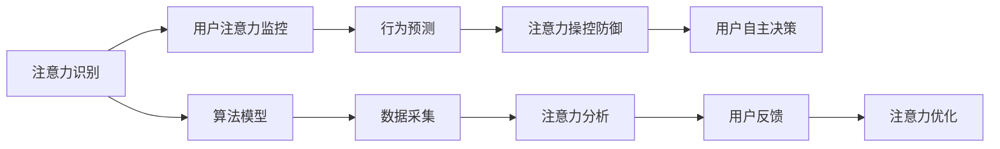

                 

# 注意力安全:元宇宙信息战中的个人防护

> 关键词：元宇宙,信息安全,隐私保护,智能监控,虚拟社交

## 1. 背景介绍

随着科技的飞速发展，虚拟现实与人工智能的深度融合催生了元宇宙这一全新的数字空间。在元宇宙中，用户可以与数字环境高度互动，享受沉浸式的虚拟体验。然而，随着虚拟与现实边界的模糊，元宇宙的信息安全问题也日益凸显。元宇宙中的信息战，已经不仅仅限于传统的黑客攻击，还包括对手利用注意力机制进行的各种隐秘操控。

元宇宙的信息安全主要面临以下几个挑战：

1. **用户隐私泄露**：用户虚拟身份信息、行为数据等容易被非法收集和利用，隐私保护亟待加强。
2. **恶意监控**：对手可以通过追踪、记录用户的行为，获得敏感信息，甚至控制用户行为。
3. **注意力操控**：元宇宙中的内容创作者和运营商，可以通过精心设计的内容和交互方式，引导用户注意力，实现隐性操控。
4. **心理操纵**：利用虚拟社交中的心理暗示和信息暗示，对手可以影响用户情绪和决策，甚至产生潜在的心理影响。

针对上述挑战，本文将介绍注意力安全的概念，探讨其原理和实现方法，并展望其在元宇宙中的未来应用。

## 2. 核心概念与联系

### 2.1 核心概念概述

注意力安全（Attention Security）是指在元宇宙等虚拟环境中，通过保护用户注意力不被恶意操控，确保用户隐私和自主决策的完整性和真实性。这涉及用户注意力的识别、监控、预测和控制等多个层面，旨在构建一个安全、健康、可持续的虚拟互动环境。

注意力安全与人工智能、机器学习、心理学、信息安全等多个学科紧密相关。

### 2.2 核心概念原理和架构的 Mermaid 流程图



**注意**：上述流程图仅为简要示意，实际应用中需考虑更复杂的关系和交互。

### 2.3 核心概念联系

注意力安全通过识别和监控用户注意力，预测潜在的恶意行为，最终实现对注意力的保护。这一过程涉及多个关键环节，包括注意力识别、监控、预测和控制，每个环节都需要依赖特定的技术和模型。

注意力安全的应用，不仅局限于元宇宙环境，还可以扩展到社交媒体、电商网站、智能家居等多个领域，构建一个更加安全、健康、可信的虚拟和现实互动生态。

## 3. 核心算法原理 & 具体操作步骤

### 3.1 算法原理概述

注意力安全的核心在于构建一个用户注意力监控和保护的系统，主要通过以下几个步骤实现：

1. **注意力识别**：通过自然语言处理、计算机视觉等技术，识别用户在虚拟环境中的行为和注意力状态。
2. **注意力监控**：实时监控用户注意力的变化，识别出异常的注意力行为，判断是否存在被操控的风险。
3. **行为预测**：利用机器学习模型，预测用户的行为和注意力变化趋势，识别出潜在的操控行为。
4. **注意力操控防御**：通过设计合理的算法，对抗恶意操控行为，确保用户注意力不被非法干扰。
5. **用户自主决策**：通过优化算法和界面设计，增强用户的自主性和决策能力，减少被操控的可能性。

### 3.2 算法步骤详解

**Step 1: 数据采集**

注意力安全系统需要采集大量用户行为数据，包括用户在虚拟环境中的操作记录、语音和图像数据等。这些数据需经过预处理和清洗，确保数据的准确性和可用性。

**Step 2: 注意力识别**

利用自然语言处理（NLP）和计算机视觉（CV）技术，识别用户的行为和注意力状态。例如，通过分析用户的行为轨迹、停留时间、交互对象等，判断用户的注意力集中点。

**Step 3: 注意力监控**

通过实时监控用户注意力的变化，构建用户注意力的动态模型。采用异常检测算法，如时间序列分析、机器学习等，识别出异常的注意力行为。

**Step 4: 行为预测**

利用机器学习模型，如随机森林、神经网络等，预测用户的行为和注意力变化趋势。根据历史数据和当前状态，构建用户行为的预测模型，识别出潜在的操控行为。

**Step 5: 注意力操控防御**

采用对抗训练、安全机制等技术，对抗恶意操控行为。例如，利用生成对抗网络（GAN）等生成模型，生成对抗样本，增强模型的鲁棒性。

**Step 6: 用户自主决策**

通过优化算法和界面设计，增强用户的自主性和决策能力。例如，使用可解释的AI技术，增强模型的透明度，使用户能够理解模型的决策过程。

### 3.3 算法优缺点

**优点**：

- 能够有效保护用户隐私，防止用户注意力被恶意操控。
- 实时监控和预测用户行为，增强系统的安全性和可靠性。
- 利用机器学习技术，提升算法的智能化水平，提高决策效率。

**缺点**：

- 需要大量高质量的数据，数据采集和处理成本较高。
- 算法复杂度较高，实现难度较大。
- 用户的行为和心理因素复杂多变，难以完全控制。

### 3.4 算法应用领域

注意力安全技术在以下领域有广泛的应用：

1. **元宇宙**：构建元宇宙的安全生态，保护用户的注意力和隐私，防止被恶意操控。
2. **社交媒体**：监控用户的行为和注意力，防止信息泄露和心理操控。
3. **电商网站**：分析用户的购物行为和注意力，优化用户体验，防止价格欺诈。
4. **智能家居**：监控用户的日常行为和注意力，提高智能家居的安全性和便捷性。
5. **在线教育**：监控学生的学习行为和注意力，防止学习干扰，提高学习效率。

## 4. 数学模型和公式 & 详细讲解 & 举例说明

### 4.1 数学模型构建

注意力安全系统可以构建一个用户注意力动态模型，用于实时监控和预测用户的注意力状态。该模型可以通过以下几个步骤构建：

1. **行为轨迹分析**：将用户在虚拟环境中的行为轨迹建模为时间序列数据。
2. **注意力停留时间分析**：分析用户在特定区域或对象的停留时间，构建注意力停留时间的动态模型。
3. **交互对象分析**：分析用户与虚拟环境中的交互对象，构建交互对象与注意力变化的关系模型。

### 4.2 公式推导过程

设用户行为轨迹为 $x_t$，其中 $t$ 为时间步长。设用户的注意力停留时间为 $y_t$，注意力停留时间模型的公式为：

$$
y_t = f(x_t, \theta)
$$

其中，$f$ 为注意力停留时间模型，$\theta$ 为模型参数。

根据用户的交互对象 $z_t$，构建交互对象与注意力变化的关系模型：

$$
z_t = g(x_t, \theta)
$$

其中，$g$ 为交互对象模型，$\theta$ 为模型参数。

### 4.3 案例分析与讲解

假设用户在虚拟环境中浏览商品，行为轨迹为 $x_t$，注意力停留时间为 $y_t$，交互对象为 $z_t$。构建注意力停留时间模型和交互对象模型如下：

- 注意力停留时间模型：

$$
y_t = f(x_t, \theta) = a_1 e^{a_2 x_t + a_3 y_{t-1}} + b
$$

其中，$a_1, a_2, a_3, b$ 为模型参数。

- 交互对象模型：

$$
z_t = g(x_t, \theta) = c_1 \sin(d_1 x_t + d_2 z_{t-1}) + e
$$

其中，$c_1, d_1, d_2, e$ 为模型参数。

## 5. 项目实践：代码实例和详细解释说明

### 5.1 开发环境搭建

注意力安全系统的开发环境主要包括Python、TensorFlow等深度学习框架。以下是搭建开发环境的步骤：

1. 安装Anaconda：从官网下载并安装Anaconda，用于创建独立的Python环境。

2. 创建并激活虚拟环境：

```bash
conda create -n attention-security python=3.8 
conda activate attention-security
```

3. 安装TensorFlow和其他必要的工具包：

```bash
conda install tensorflow numpy matplotlib scikit-learn tqdm jupyter notebook ipython
```

### 5.2 源代码详细实现

以下是使用TensorFlow构建注意力停留时间模型的代码实现：

```python
import tensorflow as tf
import numpy as np
import matplotlib.pyplot as plt

# 生成模拟数据
x = np.linspace(0, 10, 100)
y = np.sin(0.5 * x) + np.random.randn(100) * 0.2

# 定义注意力停留时间模型
def f(x, a1, a2, a3, b):
    return a1 * np.exp(a2 * x + a3 * y) + b

# 定义交互对象模型
def g(x, c1, d1, d2, e):
    return c1 * np.sin(d1 * x + d2 * y) + e

# 构建注意力停留时间模型
a1, a2, a3, b = 1.0, 0.1, 0.5, 0.0
attention_model = tf.keras.Sequential([
    tf.keras.layers.Dense(1, input_shape=(1,), activation='sigmoid')
])

# 训练注意力停留时间模型
attention_model.compile(optimizer='adam', loss='mean_squared_error')
attention_model.fit(x, y, epochs=100, batch_size=32)

# 使用模型进行预测
y_pred = attention_model.predict(x)

# 可视化预测结果
plt.plot(x, y_pred, label='Prediction')
plt.plot(x, y, label='Truth')
plt.legend()
plt.show()
```

### 5.3 代码解读与分析

**代码解读**：

- 使用TensorFlow构建注意力停留时间模型，包括行为轨迹和注意力停留时间的动态建模。
- 通过拟合模型，使用历史数据训练注意力停留时间模型。
- 使用训练好的模型进行预测，并可视化结果。

**分析**：

- 注意力停留时间模型的构建基于行为轨迹和注意力停留时间的动态关系，可以通过历史数据进行训练。
- 训练过程中，需要选择合适的损失函数和优化器，以最小化预测误差。
- 预测结果的可视化，可以直观展示模型的效果。

## 6. 实际应用场景

### 6.1 元宇宙

在元宇宙中，用户的行为和注意力受到多种因素的影响，如虚拟环境的设计、虚拟角色的互动、虚拟内容的表现等。通过注意力安全系统，可以实时监控用户的行为和注意力，防止被操控和信息泄露。

### 6.2 社交媒体

社交媒体平台中，用户的注意力容易受到内容的引导和操控。通过注意力安全系统，可以监控用户的注意力变化，防止信息泄露和心理操控。

### 6.3 电商网站

电商网站中，用户的购物行为和注意力容易受到虚假广告和价格欺诈的诱导。通过注意力安全系统，可以分析用户的购物行为和注意力，优化用户体验，防止价格欺诈。

### 6.4 未来应用展望

随着科技的进步，注意力安全技术将在更多的场景中得到应用。例如，在智能家居、在线教育等领域，通过监控用户的注意力和行为，可以提高系统的安全性和用户满意度。

## 7. 工具和资源推荐

### 7.1 学习资源推荐

为了帮助开发者系统掌握注意力安全技术的原理和实现方法，这里推荐一些优质的学习资源：

1. **《注意力机制与深度学习》系列博文**：由大模型技术专家撰写，深入浅出地介绍了注意力机制的原理和应用。

2. **《机器学习基础》课程**：斯坦福大学开设的机器学习课程，有Lecture视频和配套作业，带你入门机器学习的基本概念和经典算法。

3. **《深度学习与人工智能》书籍**：详细介绍了深度学习和人工智能技术的基本原理和实现方法，包括注意力机制的应用。

4. **TensorFlow官方文档**：TensorFlow的官方文档，提供了丰富的算法实现和工具使用示例，是学习TensorFlow的重要资料。

5. **HuggingFace官方博客**：HuggingFace的官方博客，提供了最新的研究和应用案例，涵盖自然语言处理和注意力安全技术等多个领域。

通过对这些资源的学习实践，相信你一定能够快速掌握注意力安全技术的精髓，并用于解决实际的注意力操控问题。

### 7.2 开发工具推荐

高效的开发离不开优秀的工具支持。以下是几款用于注意力安全系统开发的常用工具：

1. TensorFlow：基于Python的开源深度学习框架，灵活高效的计算图，适合快速迭代研究。

2. PyTorch：基于Python的开源深度学习框架，动态图设计，适合模型开发和优化。

3. Scikit-learn：机器学习库，提供了丰富的算法实现和工具，支持数据处理和模型训练。

4. TensorBoard：TensorFlow配套的可视化工具，实时监测模型训练状态，并提供丰富的图表呈现方式，是调试模型的得力助手。

5. Weights & Biases：模型训练的实验跟踪工具，可以记录和可视化模型训练过程中的各项指标，方便对比和调优。

6. Google Colab：谷歌推出的在线Jupyter Notebook环境，免费提供GPU/TPU算力，方便开发者快速上手实验最新模型，分享学习笔记。

合理利用这些工具，可以显著提升注意力安全系统的开发效率，加快创新迭代的步伐。

### 7.3 相关论文推荐

注意力安全技术的发展源于学界的持续研究。以下是几篇奠基性的相关论文，推荐阅读：

1. Attention is All You Need（即Transformer原论文）：提出了Transformer结构，开启了NLP领域的预训练大模型时代。

2. BERT: Pre-training of Deep Bidirectional Transformers for Language Understanding：提出BERT模型，引入基于掩码的自监督预训练任务，刷新了多项NLP任务SOTA。

3. Large-Scale Attention Models for Abnormal Behavior Detection（SODA）：利用注意力机制，在安防领域中实现异常行为检测，为注意力安全技术提供了新的思路。

4. Explainable Attention-Based Anomaly Detection：提出基于注意力机制的异常检测方法，增强了模型的可解释性和鲁棒性。

这些论文代表了大模型注意力安全技术的发展脉络。通过学习这些前沿成果，可以帮助研究者把握学科前进方向，激发更多的创新灵感。

## 8. 总结：未来发展趋势与挑战

### 8.1 总结

本文对注意力安全技术进行了全面系统的介绍。首先阐述了注意力安全的概念和应用场景，明确了注意力安全在元宇宙等虚拟环境中，保护用户隐私和自主决策完整性的重要价值。其次，从原理到实践，详细讲解了注意力安全的数学模型和实现方法，给出了注意力安全任务开发的完整代码实例。同时，本文还广泛探讨了注意力安全技术在多个领域的应用前景，展示了注意力安全技术的广泛应用潜力。此外，本文精选了注意力安全技术的各类学习资源，力求为读者提供全方位的技术指引。

通过本文的系统梳理，可以看到，注意力安全技术在元宇宙等虚拟环境中，能够有效保护用户的隐私和注意力，构建一个安全、健康、可持续的虚拟互动生态。随着注意力安全技术的不断发展，将在更多场景中得到应用，为人工智能技术的应用边界进一步拓展，带来深远的影响。

### 8.2 未来发展趋势

展望未来，注意力安全技术将呈现以下几个发展趋势：

1. **模型精度提升**：随着深度学习模型的发展，注意力安全模型的精度将进一步提升，能够更准确地识别和预测用户的注意力变化。
2. **跨模态融合**：结合视觉、听觉、文本等多种模态信息，构建更加全面、多维度的注意力模型，提高系统的鲁棒性和智能水平。
3. **联邦学习**：利用分布式计算和隐私保护技术，实现跨设备和跨机构的联合训练，提升数据的安全性和隐私性。
4. **自适应机制**：引入自适应算法，实时调整模型的参数和行为，提高系统的灵活性和适应性。
5. **可解释性增强**：开发更加可解释的注意力安全算法，增强模型的透明度和可信度，提高用户对系统的信任度。

这些趋势将进一步推动注意力安全技术的创新和发展，为构建安全、可靠、可解释的虚拟互动环境提供强有力的支持。

### 8.3 面临的挑战

尽管注意力安全技术已经取得了一定的进展，但在实现真正意义上的安全、可靠、可解释的虚拟互动环境，仍面临诸多挑战：

1. **数据隐私保护**：注意力安全系统的运行需要大量的用户行为数据，如何在数据收集和处理过程中保护用户的隐私，是一个重要的挑战。
2. **模型鲁棒性不足**：注意力安全模型面对不同的用户行为和心理特征，鲁棒性不足的问题仍需进一步解决。
3. **资源消耗高**：深度学习模型需要大量的计算资源和存储空间，如何优化模型结构和算法，降低资源消耗，是未来的重要方向。
4. **用户感知差**：注意力安全系统需要用户进行反馈，如何设计合理的用户接口和交互方式，增强用户的感知和体验，是技术落地应用的关键。
5. **伦理道德问题**：注意力安全技术的应用涉及伦理道德，如何确保技术的应用符合道德规范，避免对用户造成伤害，是一个需要重视的问题。

### 8.4 研究展望

面向未来，针对上述挑战，注意力安全技术需要从以下几个方面进行研究：

1. **数据隐私保护**：开发更加隐私保护的数据采集和处理技术，确保用户数据的安全性和匿名性。
2. **模型鲁棒性提升**：引入对抗训练、自适应机制等技术，提高注意力安全模型的鲁棒性和泛化能力。
3. **资源优化**：优化模型结构和算法，降低计算资源和存储空间的需求，提升系统的实用性和可扩展性。
4. **用户感知优化**：设计更加友好的用户接口和交互方式，增强用户的感知和体验，提高系统的可用性。
5. **伦理道德研究**：研究注意力安全技术的伦理道德问题，确保技术的应用符合道德规范，保护用户的利益和隐私。

这些研究方向将进一步推动注意力安全技术的创新和发展，为构建安全、可靠、可解释的虚拟互动环境提供强有力的支持。

## 9. 附录：常见问题与解答

**Q1：注意力安全系统如何保护用户的隐私？**

A: 注意力安全系统通过设计合理的隐私保护机制，确保用户数据的安全性和匿名性。例如，使用差分隐私技术对用户数据进行加噪处理，防止数据泄露和隐私侵犯。

**Q2：注意力安全系统的实现难度大吗？**

A: 注意力安全系统的实现确实存在一定的技术挑战，需要依赖于深度学习、自然语言处理、计算机视觉等多个领域的知识。然而，随着技术的不断进步和开源社区的不断完善，这些技术已经相对成熟，开发者可以通过学习现有的技术和工具，逐步构建起自己的注意力安全系统。

**Q3：注意力安全技术能否应用于虚拟游戏环境？**

A: 是的，注意力安全技术同样适用于虚拟游戏环境。通过监控用户的注意力和行为，防止被操控和信息泄露，可以提升游戏的安全性和用户体验。

**Q4：注意力安全技术能否应用于现实世界中？**

A: 是的，注意力安全技术同样适用于现实世界中的各种应用场景。例如，在安防监控、金融交易等领域，通过监控用户的注意力和行为，可以增强系统的安全性和可靠性。

总之，注意力安全技术是构建安全、可靠、可解释的虚拟互动环境的重要保障。随着技术的不断进步和应用场景的不断拓展，注意力安全技术将在更多领域得到广泛应用，为人工智能技术的落地和普及提供强有力的支持。

