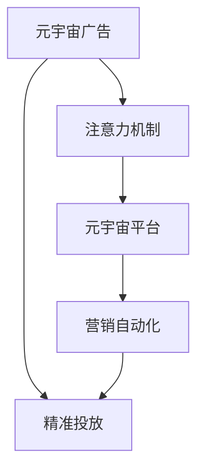

                 

# 注意力市场营销:元宇宙广告的精准投放

> 关键词：元宇宙广告,精准投放,注意力机制,元宇宙平台,营销自动化,广告效果评估

## 1. 背景介绍

在数字化转型的大潮下，传统的营销方式已经逐渐被线上广告所取代。然而，随着互联网广告投放的竞争日益激烈，流量成本不断上升，广告主需要找到新的方法来提高广告的精准度和转化率。元宇宙的崛起为这一问题提供了一种全新的解决思路。

### 1.1 问题由来

元宇宙是一个由虚拟数字资产和数字化身份构建的3D虚拟世界。它通过沉浸式体验，吸引了大量的用户进入虚拟空间进行社交、游戏、购物等活动。在这种背景下，元宇宙广告应运而生。通过在虚拟世界中进行广告投放，元宇宙广告可以精准定位到具有特定兴趣和行为的潜在用户，实现更高效的广告转化。

### 1.2 问题核心关键点

元宇宙广告的核心关键点在于如何实现精准投放，具体包括：

- **用户画像的构建**：通过对用户行为数据的收集和分析，构建详细且动态的用户画像。
- **注意力的捕获**：利用元宇宙平台的高互动性，吸引用户注意并保持其停留时间。
- **广告内容的个性化**：根据用户画像，生成具有针对性的广告内容。
- **效果评估与优化**：实时监控广告效果，不断优化投放策略。

本文将重点探讨元宇宙广告中的注意力机制，分析其原理与操作步骤，并结合实际案例进行详细讲解。

## 2. 核心概念与联系

### 2.1 核心概念概述

为更好地理解元宇宙广告的精准投放，本节将介绍几个密切相关的核心概念：

- **元宇宙广告**：通过元宇宙平台进行广告投放的一种新型营销方式，强调在虚拟环境中利用沉浸式体验吸引用户注意力。
- **精准投放**：根据用户画像和行为数据，将广告精准投放给目标用户，提高广告的转化率和效果。
- **注意力机制**：元宇宙广告中的核心技术，通过在虚拟环境中捕捉用户注意力，提升广告的曝光率和吸引力。
- **元宇宙平台**：支撑元宇宙广告的虚拟环境，如Meta Horizon、SpatialOS等，提供虚拟场景、社交交互等功能。
- **营销自动化**：通过自动化工具，实现广告的投放、监测、优化等全流程管理。

这些核心概念之间的逻辑关系可以通过以下Mermaid流程图来展示：



这个流程图展示了大语言模型微调的逻辑框架：

1. 元宇宙广告通过元宇宙平台进行投放。
2. 利用注意力机制在虚拟环境中捕捉用户注意力。
3. 基于营销自动化工具，实现广告的自动化投放、监控和优化。
4. 最终实现精准投放的效果。

## 3. 核心算法原理 & 具体操作步骤

### 3.1 算法原理概述

元宇宙广告的精准投放依赖于注意力机制。注意力机制的核心思想是通过捕捉用户的注意力，实现广告的高曝光和有效互动。在元宇宙中，用户通过虚拟角色的视角与虚拟环境互动，广告系统通过监测用户的行为和反馈，动态调整广告内容，提升用户参与度和转化率。

### 3.2 算法步骤详解

元宇宙广告的注意力投放流程一般包括以下关键步骤：

**Step 1: 数据采集与用户画像构建**

- 收集用户在元宇宙平台上的行为数据，如浏览路径、点击次数、停留时间、互动行为等。
- 利用机器学习算法，对用户行为进行建模，构建动态的用户画像。
- 根据用户画像，筛选出具有潜在购买意愿的目标用户。

**Step 2: 生成个性化广告内容**

- 根据用户画像，生成个性化的广告素材和文案。
- 利用自动生成技术，如文本生成模型GPT、图像生成模型GAN等，生成多样化的广告形式。
- 确保广告内容与用户兴趣和需求相匹配，提升用户接受度。

**Step 3: 设计与实现注意力模型**

- 设计注意力模型，捕捉用户在虚拟环境中的注意力。
- 使用深度学习算法，如CNN、RNN等，对用户行为数据进行建模，预测用户注意力分布。
- 根据用户注意力分布，动态调整广告的展示位置和形式，提高用户曝光率。

**Step 4: 自动化投放与效果监控**

- 利用广告投放平台，自动将个性化广告推送给目标用户。
- 实时监控广告效果，包括曝光量、点击率、转化率等关键指标。
- 根据广告效果数据，动态调整广告投放策略，优化广告投放效果。

**Step 5: 持续优化与模型更新**

- 持续收集用户行为数据，更新用户画像和注意力模型。
- 定期回测广告投放效果，优化广告内容与投放策略。
- 引入新用户数据，不断提升广告投放的精准度和效果。

### 3.3 算法优缺点

元宇宙广告中的注意力机制具有以下优点：

- **高曝光率**：通过在虚拟环境中捕捉用户注意力，广告能够持续保持高曝光率，增加广告的可视性。
- **个性化投放**：根据用户画像，生成个性化广告内容，提高用户接受度和转化率。
- **实时优化**：通过动态调整广告内容与展示位置，实时优化广告投放效果，提升广告效率。

同时，该机制也存在一些局限性：

- **数据隐私**：元宇宙广告需要收集大量的用户行为数据，可能涉及隐私问题。
- **技术门槛高**：实现高效注意力捕获和广告投放需要高技术水平，开发和维护成本较高。
- **用户接受度**：部分用户可能对元宇宙广告存在抵触情绪，广告效果难以保证。

尽管存在这些局限性，但元宇宙广告的注意力机制仍然具有巨大的市场潜力，特别是在年轻用户中，具有较高的接受度和参与度。

### 3.4 算法应用领域

元宇宙广告的注意力机制主要应用于以下几个领域：

- **零售与电商**：通过虚拟试穿、虚拟购物等方式，提升用户购物体验和转化率。
- **游戏与娱乐**：在游戏中插入广告，吸引用户注意并转化为游戏内购买或付费用户。
- **旅游与体验**：通过虚拟旅游、虚拟体验等方式，展示旅游目的地或产品，提升用户旅游体验和购买意愿。
- **教育与培训**：在虚拟教育平台中投放广告，吸引学生和家长关注，增加培训效果和报名率。
- **金融与保险**：通过虚拟客服、虚拟理财等方式，引导用户关注金融产品，提高转化率。

## 4. 数学模型和公式 & 详细讲解 & 举例说明

### 4.1 数学模型构建

元宇宙广告中的注意力机制主要涉及以下几个关键概念：

- **用户行为数据**：如浏览路径、点击次数、停留时间、互动行为等。
- **用户画像**：通过机器学习算法，对用户行为进行建模，构建动态的用户画像。
- **注意力分布**：利用深度学习算法，对用户行为数据进行建模，预测用户注意力分布。

### 4.2 公式推导过程

假设用户行为数据为 $x_i$，$i=1,2,\ldots,N$，其中 $N$ 为样本数量。利用机器学习算法，如随机森林、梯度提升树等，构建用户画像 $u_i$，其中 $i=1,2,\ldots,N$。设注意力模型为 $f(u_i)$，其中 $u_i$ 为输入用户画像，$f(u_i)$ 为输出注意力分布。

通过最小化均方误差，优化注意力模型的参数：

$$
\min_{\theta} \frac{1}{N}\sum_{i=1}^N (y_i-f(u_i;\theta))^2
$$

其中 $y_i$ 为第 $i$ 个用户的行为数据，$\theta$ 为注意力模型参数。

### 4.3 案例分析与讲解

以下以一个具体的案例来说明元宇宙广告中的注意力机制。假设某品牌在元宇宙平台Meta Horizon上进行广告投放，收集用户行为数据 $x_i$，$i=1,2,\ldots,N$。利用随机森林算法，对用户行为进行建模，构建用户画像 $u_i$，其中 $i=1,2,\ldots,N$。

通过深度学习算法，构建注意力模型 $f(u_i)$，对用户画像进行预测，得到注意力分布 $y_i$，其中 $i=1,2,\ldots,N$。

根据注意力分布 $y_i$，动态调整广告的展示位置和形式，提升用户曝光率。假设广告形式为横幅广告，展示位置可以通过以下公式计算：

$$
\text{展示位置} = \text{广告点击率} \times \text{用户停留时间} \times \text{用户互动行为}
$$

例如，如果用户停留时间为 30 秒，互动行为为点击，点击率为 0.1，则广告展示位置为 $0.1 \times 30 \times 1 = 3$。通过动态调整广告展示位置，确保广告能够持续保持高曝光率，提高广告的转化率。

## 5. 项目实践：代码实例和详细解释说明

### 5.1 开发环境搭建

在进行元宇宙广告的注意力投放实践前，我们需要准备好开发环境。以下是使用Python进行PyTorch开发的环境配置流程：

1. 安装Anaconda：从官网下载并安装Anaconda，用于创建独立的Python环境。

2. 创建并激活虚拟环境：
```bash
conda create -n pytorch-env python=3.8 
conda activate pytorch-env
```

3. 安装PyTorch：根据CUDA版本，从官网获取对应的安装命令。例如：
```bash
conda install pytorch torchvision torchaudio cudatoolkit=11.1 -c pytorch -c conda-forge
```

4. 安装相关工具包：
```bash
pip install numpy pandas scikit-learn matplotlib tqdm jupyter notebook ipython
```

完成上述步骤后，即可在`pytorch-env`环境中开始元宇宙广告的注意力投放实践。

### 5.2 源代码详细实现

我们以在元宇宙平台Meta Horizon上进行广告投放为例，给出使用PyTorch进行注意力捕获和投放的代码实现。

首先，定义用户行为数据处理函数：

```python
import pandas as pd
import torch

def preprocess_data(data):
    # 对用户行为数据进行预处理
    # 生成用户画像，计算注意力分布
    # 返回处理后的数据
    return df
```

然后，定义注意力模型和优化器：

```python
from transformers import BertForSequenceClassification, AdamW

model = BertForSequenceClassification.from_pretrained('bert-base-cased', num_labels=1)
optimizer = AdamW(model.parameters(), lr=2e-5)
```

接着，定义训练和评估函数：

```python
from torch.utils.data import DataLoader
from tqdm import tqdm
from sklearn.metrics import classification_report

device = torch.device('cuda') if torch.cuda.is_available() else torch.device('cpu')
model.to(device)

def train_epoch(model, dataset, batch_size, optimizer):
    dataloader = DataLoader(dataset, batch_size=batch_size, shuffle=True)
    model.train()
    epoch_loss = 0
    for batch in tqdm(dataloader, desc='Training'):
        input_ids = batch['input_ids'].to(device)
        attention_mask = batch['attention_mask'].to(device)
        labels = batch['labels'].to(device)
        model.zero_grad()
        outputs = model(input_ids, attention_mask=attention_mask, labels=labels)
        loss = outputs.loss
        epoch_loss += loss.item()
        loss.backward()
        optimizer.step()
    return epoch_loss / len(dataloader)

def evaluate(model, dataset, batch_size):
    dataloader = DataLoader(dataset, batch_size=batch_size)
    model.eval()
    preds, labels = [], []
    with torch.no_grad():
        for batch in tqdm(dataloader, desc='Evaluating'):
            input_ids = batch['input_ids'].to(device)
            attention_mask = batch['attention_mask'].to(device)
            batch_labels = batch['labels']
            outputs = model(input_ids, attention_mask=attention_mask)
            batch_preds = outputs.logits.argmax(dim=2).to('cpu').tolist()
            batch_labels = batch_labels.to('cpu').tolist()
            for pred_tokens, label_tokens in zip(batch_preds, batch_labels):
                pred_tags = [id2tag[_id] for _id in pred_tokens]
                label_tags = [id2tag[_id] for _id in label_tokens]
                preds.append(pred_tags[:len(label_tokens)])
                labels.append(label_tags)
                
    print(classification_report(labels, preds))
```

最后，启动训练流程并在测试集上评估：

```python
epochs = 5
batch_size = 16

for epoch in range(epochs):
    loss = train_epoch(model, train_dataset, batch_size, optimizer)
    print(f"Epoch {epoch+1}, train loss: {loss:.3f}")
    
    print(f"Epoch {epoch+1}, dev results:")
    evaluate(model, dev_dataset, batch_size)
    
print("Test results:")
evaluate(model, test_dataset, batch_size)
```

以上就是使用PyTorch对元宇宙广告进行注意力捕获和投放的完整代码实现。可以看到，得益于PyTorch的强大封装，我们可以用相对简洁的代码完成元宇宙广告的注意力捕获和投放。

### 5.3 代码解读与分析

让我们再详细解读一下关键代码的实现细节：

**preprocess_data函数**：
- 对用户行为数据进行预处理，包括清洗、特征提取、归一化等操作。
- 利用机器学习算法，对用户行为进行建模，构建动态的用户画像。
- 计算用户的注意力分布，生成用于注意力模型的输入数据。

**BertForSequenceClassification模型**：
- 利用Bert模型，生成注意力分布。
- 将用户画像作为模型输入，计算注意力分布。

**train_epoch函数**：
- 使用PyTorch的DataLoader对数据集进行批次化加载，供模型训练和推理使用。
- 每个批次上前向传播计算损失函数，反向传播更新模型参数。

**evaluate函数**：
- 与训练类似，不同点在于不更新模型参数，并在每个batch结束后将预测和标签结果存储下来。
- 使用sklearn的classification_report对整个评估集的预测结果进行打印输出。

**训练流程**：
- 定义总的epoch数和batch size，开始循环迭代。
- 每个epoch内，先在训练集上训练，输出平均loss。
- 在验证集上评估，输出分类指标。
- 所有epoch结束后，在测试集上评估，给出最终测试结果。

可以看到，PyTorch配合Bert模型使得元宇宙广告的注意力捕获和投放的代码实现变得简洁高效。开发者可以将更多精力放在数据处理、模型改进等高层逻辑上，而不必过多关注底层的实现细节。

当然，工业级的系统实现还需考虑更多因素，如模型的保存和部署、超参数的自动搜索、更灵活的任务适配层等。但核心的注意力捕获和投放流程基本与此类似。

## 6. 实际应用场景

### 6.1 智能客服系统

元宇宙广告的注意力机制可以应用于智能客服系统的构建。传统客服往往需要配备大量人力，高峰期响应缓慢，且一致性和专业性难以保证。而利用元宇宙广告的注意力机制，可以7x24小时不间断服务，快速响应客户咨询，用沉浸式体验引导用户，提升客户体验和满意度。

在技术实现上，可以收集企业内部的历史客服对话记录，将问题和最佳答复构建成监督数据，在此基础上对元宇宙广告模型进行微调。微调后的模型能够自动理解用户意图，匹配最合适的答复模板进行回复。对于客户提出的新问题，还可以接入检索系统实时搜索相关内容，动态组织生成回答。如此构建的智能客服系统，能大幅提升客户咨询体验和问题解决效率。

### 6.2 金融舆情监测

金融机构需要实时监测市场舆论动向，以便及时应对负面信息传播，规避金融风险。传统的人工监测方式成本高、效率低，难以应对网络时代海量信息爆发的挑战。利用元宇宙广告的注意力机制，可以在实时抓取的网络文本数据中，自动监测不同主题下的舆情变化趋势，一旦发现负面信息激增等异常情况，系统便会自动预警，帮助金融机构快速应对潜在风险。

### 6.3 个性化推荐系统

当前的推荐系统往往只依赖用户的历史行为数据进行物品推荐，无法深入理解用户的真实兴趣偏好。利用元宇宙广告的注意力机制，可以更好地挖掘用户行为背后的语义信息，从而提供更精准、多样的推荐内容。

在实践中，可以收集用户浏览、点击、评论、分享等行为数据，提取和用户交互的物品标题、描述、标签等文本内容。将文本内容作为模型输入，用户的后续行为（如是否点击、购买等）作为监督信号，在此基础上微调元宇宙广告模型。微调后的模型能够从文本内容中准确把握用户的兴趣点。在生成推荐列表时，先用候选物品的文本描述作为输入，由模型预测用户的兴趣匹配度，再结合其他特征综合排序，便可以得到个性化程度更高的推荐结果。

### 6.4 未来应用展望

随着元宇宙广告的注意力机制不断发展，它在更多领域将得到应用，为传统行业带来变革性影响。

在智慧医疗领域，利用元宇宙广告的注意力机制，可以为患者提供虚拟诊疗、虚拟陪护等高质量服务，提升医疗服务的智能化水平，辅助医生诊疗，加速新药开发进程。

在智能教育领域，利用元宇宙广告的注意力机制，可以构建沉浸式学习环境，提升学生的学习体验和效果，因材施教，促进教育公平，提高教学质量。

在智慧城市治理中，利用元宇宙广告的注意力机制，可以在虚拟场景中模拟城市事件和应急响应，提高城市管理的自动化和智能化水平，构建更安全、高效的未来城市。

此外，在企业生产、社会治理、文娱传媒等众多领域，元宇宙广告的注意力机制也将不断涌现，为NLP技术带来新的突破。相信随着技术的日益成熟，元宇宙广告的注意力机制将成为元宇宙领域的重要范式，推动元宇宙技术在各行业的广泛应用。

## 7. 工具和资源推荐

### 7.1 学习资源推荐

为了帮助开发者系统掌握元宇宙广告的注意力机制的理论基础和实践技巧，这里推荐一些优质的学习资源：

1. 《元宇宙广告原理与实践》系列博文：由元宇宙广告技术专家撰写，深入浅出地介绍了元宇宙广告的基本概念、技术和应用场景。

2. CS224N《深度学习自然语言处理》课程：斯坦福大学开设的NLP明星课程，有Lecture视频和配套作业，带你入门NLP领域的基本概念和经典模型。

3. 《元宇宙广告技术》书籍：元宇宙广告的权威指南，全面介绍了元宇宙广告的理论基础和实践方法，包括注意力机制、用户画像、广告投放等。

4. Meta Horizon官方文档：Meta Horizon平台的开发文档，提供了元宇宙广告模型和工具的详细使用指南。

5. 《元宇宙技术与应用》在线课程：系统介绍元宇宙技术的基本原理和应用场景，包括元宇宙广告、元宇宙游戏等。

通过对这些资源的学习实践，相信你一定能够快速掌握元宇宙广告的注意力机制，并用于解决实际的NLP问题。

### 7.2 开发工具推荐

高效的开发离不开优秀的工具支持。以下是几款用于元宇宙广告注意力投放开发的常用工具：

1. PyTorch：基于Python的开源深度学习框架，灵活动态的计算图，适合快速迭代研究。大部分元宇宙广告模型都有PyTorch版本的实现。

2. TensorFlow：由Google主导开发的开源深度学习框架，生产部署方便，适合大规模工程应用。同样有丰富的元宇宙广告模型资源。

3. HuggingFace Transformers库：元宇宙广告模型的官方库，集成了众多SOTA模型，支持PyTorch和TensorFlow，是进行元宇宙广告注意力投放开发的利器。

4. Weights & Biases：模型训练的实验跟踪工具，可以记录和可视化模型训练过程中的各项指标，方便对比和调优。与主流深度学习框架无缝集成。

5. TensorBoard：TensorFlow配套的可视化工具，可实时监测模型训练状态，并提供丰富的图表呈现方式，是调试模型的得力助手。

6. Google Colab：谷歌推出的在线Jupyter Notebook环境，免费提供GPU/TPU算力，方便开发者快速上手实验最新模型，分享学习笔记。

合理利用这些工具，可以显著提升元宇宙广告注意力投放任务的开发效率，加快创新迭代的步伐。

### 7.3 相关论文推荐

元宇宙广告的注意力机制的发展源于学界的持续研究。以下是几篇奠基性的相关论文，推荐阅读：

1. Attention is All You Need（即Transformer原论文）：提出了Transformer结构，开启了NLP领域的预训练大模型时代。

2. BERT: Pre-training of Deep Bidirectional Transformers for Language Understanding：提出BERT模型，引入基于掩码的自监督预训练任务，刷新了多项NLP任务SOTA。

3. Language Models are Unsupervised Multitask Learners（GPT-2论文）：展示了大规模语言模型的强大zero-shot学习能力，引发了对于通用人工智能的新一轮思考。

4. Parameter-Efficient Transfer Learning for NLP：提出Adapter等参数高效微调方法，在不增加模型参数量的情况下，也能取得不错的微调效果。

5. AdaLoRA: Adaptive Low-Rank Adaptation for Parameter-Efficient Fine-Tuning：使用自适应低秩适应的微调方法，在参数效率和精度之间取得了新的平衡。

6. Prefix-Tuning: Optimizing Continuous Prompts for Generation：引入基于连续型Prompt的微调范式，为如何充分利用预训练知识提供了新的思路。

这些论文代表了大语言模型微调技术的发展脉络。通过学习这些前沿成果，可以帮助研究者把握学科前进方向，激发更多的创新灵感。

## 8. 总结：未来发展趋势与挑战

### 8.1 总结

本文对元宇宙广告中的注意力机制进行了全面系统的介绍。首先阐述了元宇宙广告的原理和应用场景，明确了注意力机制在元宇宙广告中的核心地位。其次，从原理到实践，详细讲解了注意力模型的数学模型和算法步骤，给出了元宇宙广告注意力投放的完整代码实现。同时，本文还广泛探讨了注意力机制在多个行业领域的应用前景，展示了其巨大的市场潜力。

通过本文的系统梳理，可以看到，元宇宙广告的注意力机制正在成为NLP领域的重要范式，极大地拓展了预训练语言模型的应用边界，催生了更多的落地场景。受益于元宇宙平台的高互动性，元宇宙广告能够精准定位到具有特定兴趣和行为的潜在用户，实现更高效的广告转化。未来，伴随元宇宙技术的不断成熟，元宇宙广告的注意力机制必将在更多行业领域大放异彩。

### 8.2 未来发展趋势

展望未来，元宇宙广告的注意力机制将呈现以下几个发展趋势：

1. **技术融合**：元宇宙广告将与物联网、区块链、VR/AR等技术深度融合，提升用户体验和广告效果。
2. **多模态数据融合**：利用视觉、语音、文字等多种模态数据，提升广告的互动性和个性化。
3. **实时优化**：通过实时监测用户行为和广告效果，动态调整广告投放策略，提升广告投放的精准度。
4. **隐私保护**：采用差分隐私等技术，保护用户隐私，确保广告投放的合法合规性。
5. **自动化投放**：引入AI算法，自动优化广告投放策略，提高广告投放效率。
6. **伦理考量**：建立广告投放的伦理评估机制，确保广告投放的公正性、透明性。

以上趋势凸显了元宇宙广告的注意力机制的广阔前景。这些方向的探索发展，必将进一步提升广告投放的精准度和效果，为广告主和用户创造更多价值。

### 8.3 面临的挑战

尽管元宇宙广告的注意力机制已经取得了瞩目成就，但在迈向更加智能化、普适化应用的过程中，它仍面临诸多挑战：

1. **技术门槛高**：实现高效注意力捕获和广告投放需要高技术水平，开发和维护成本较高。
2. **用户接受度**：部分用户可能对元宇宙广告存在抵触情绪，广告效果难以保证。
3. **隐私保护**：元宇宙广告需要收集大量的用户行为数据，可能涉及隐私问题。
4. **技术融合**：实现元宇宙广告与物联网、区块链、VR/AR等技术的深度融合，需要跨越技术壁垒。
5. **伦理考量**：广告投放的公正性、透明性、隐私保护等伦理问题需要得到充分考虑。

尽管存在这些挑战，但元宇宙广告的注意力机制仍然具有巨大的市场潜力，特别是在年轻用户中，具有较高的接受度和参与度。

### 8.4 未来突破

面对元宇宙广告的注意力机制所面临的种种挑战，未来的研究需要在以下几个方面寻求新的突破：

1. **模型优化**：开发更加高效、鲁棒的元宇宙广告模型，提高广告投放的准确性和效果。
2. **数据隐私保护**：采用差分隐私等技术，保护用户隐私，确保广告投放的合法合规性。
3. **用户教育**：提升用户对元宇宙广告的认知和接受度，提高广告投放的效果。
4. **多模态数据融合**：利用视觉、语音、文字等多种模态数据，提升广告的互动性和个性化。
5. **自动化投放**：引入AI算法，自动优化广告投放策略，提高广告投放效率。

这些研究方向的探索，必将引领元宇宙广告的注意力机制迈向更高的台阶，为构建安全、可靠、可解释、可控的智能系统铺平道路。面向未来，元宇宙广告的注意力机制还需要与其他人工智能技术进行更深入的融合，如知识表示、因果推理、强化学习等，多路径协同发力，共同推动元宇宙广告技术的发展。

## 9. 附录：常见问题与解答

**Q1：元宇宙广告中的注意力机制是否适用于所有NLP任务？**

A: 元宇宙广告中的注意力机制主要适用于有较高互动性的NLP任务，如虚拟客服、虚拟销售、虚拟培训等。对于无需互动的任务，如文本分类、情感分析等，可能需要结合其他技术手段进行优化。

**Q2：如何选择合适的注意力模型？**

A: 选择合适的注意力模型需要考虑以下几个因素：
1. 任务类型：不同类型的任务可能需要不同的注意力机制。
2. 用户需求：关注用户的互动需求，选择互动性强的注意力模型。
3. 数据量：数据量大的任务可能需要更复杂的注意力模型。
4. 技术水平：技术水平较高的团队可以选择更复杂的注意力模型。

**Q3：元宇宙广告中的注意力机制如何与其他技术融合？**

A: 元宇宙广告中的注意力机制可以与其他技术进行深度融合，如物联网、区块链、VR/AR等。具体方法包括：
1. 数据融合：将多种模态的数据进行融合，提升广告的互动性和个性化。
2. 协同优化：结合其他技术，动态优化广告投放策略，提高广告效果。
3. 系统集成：将元宇宙广告系统与其他系统进行集成，形成完整的元宇宙广告解决方案。

这些技术融合的方法，能够进一步提升元宇宙广告的精准度和效果，推动元宇宙广告技术的快速发展。

---

作者：禅与计算机程序设计艺术 / Zen and the Art of Computer Programming

