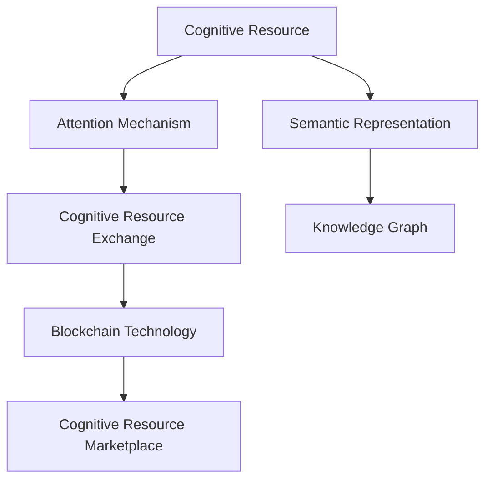

                 

# 注意力市场：AI驱动的认知资源交易所

在人工智能（AI）时代，计算资源的日益丰富使得我们能够对海量数据进行高效处理和深度分析。然而，数据背后的认知资源——即人类智慧的精华——却是稀缺且不可再生的。如何高效地整合和利用这些认知资源，成为当下最前沿的研究课题。本文提出了一种新型的认知资源交易所——注意力市场（Attention Marketplace），并探讨了其核心算法原理、具体操作步骤以及实际应用场景。

## 1. 背景介绍

### 1.1 问题由来

随着人工智能技术的不断发展，其在各行各业的应用越来越广泛。无论是自动驾驶、智能医疗，还是金融风控、零售推荐，人工智能正逐渐改变着我们的生活方式。然而，这些先进技术的背后，都需要大量的数据支撑。这些数据往往蕴含着人类的认知资源，即人类对世界的观察、理解、判断和决策。

认知资源作为人工智能系统的重要组成部分，其稀缺性和不可再生性使得其成为一种宝贵的资源。如何高效地整合、利用和交易这种资源，成为一个亟待解决的问题。传统的交易市场，如股票市场、商品市场等，虽然能够高效地进行物质资源的交易，但对于认知资源的交易却显得力不从心。因此，我们需要一种全新的交易市场，能够高效地交易认知资源，以满足人工智能系统日益增长的需求。

### 1.2 问题核心关键点

注意力市场是一种新型的认知资源交易所，旨在通过AI技术，高效地整合和交易认知资源。其核心在于以下几个方面：

1. **认知资源表示**：将认知资源转化为机器可理解的形式，即知识图谱、语义表示等。
2. **注意力机制**：利用注意力机制，衡量不同认知资源的重要性，并根据需求进行资源分配。
3. **市场动态调整**：根据市场供需情况，动态调整认知资源的定价和分配策略，实现资源的优化配置。
4. **交易验证机制**：引入区块链等技术，确保交易的透明性和安全性。

这些核心点构成了注意力市场的完整架构，使得认知资源的交易得以高效、安全地进行。

## 2. 核心概念与联系

### 2.1 核心概念概述

为了更好地理解注意力市场的核心概念，本节将介绍几个密切相关的核心概念：

- **认知资源**：即人类对世界的观察、理解、判断和决策，通常以知识图谱、语义表示等形式存在。
- **注意力机制**：一种计算机制，用于衡量不同认知资源的重要性，并在资源分配时给予不同权值。
- **认知资源交易所**：一种新型交易市场，通过AI技术高效地整合、利用和交易认知资源。
- **区块链技术**：一种分布式账本技术，确保认知资源交易的透明性和安全性。

这些核心概念之间的逻辑关系可以通过以下Mermaid流程图来展示：



这个流程图展示了这个体系的核心概念及其之间的关系：

1. 认知资源通过语义表示和知识图谱等形式，转化为机器可理解的形式。
2. 注意力机制用于衡量不同认知资源的重要性。
3. 认知资源交易所通过AI技术，高效地整合和交易认知资源。
4. 区块链技术确保交易的透明性和安全性。

## 3. 核心算法原理 & 具体操作步骤

### 3.1 算法原理概述

注意力市场的核心算法原理基于注意力机制和认知资源的语义表示。其核心思想在于：

1. **认知资源表示**：将认知资源转化为语义表示，如知识图谱、语义向量等。
2. **注意力机制**：利用注意力机制，衡量不同认知资源的重要性，并根据需求进行资源分配。
3. **市场动态调整**：根据市场供需情况，动态调整认知资源的定价和分配策略，实现资源的优化配置。

形式化地，假设认知资源集为 $R=\{r_1,r_2,\ldots,r_n\}$，其中 $r_i$ 为第 $i$ 种认知资源。认知资源交易所的目标是最大化市场价值 $V$，即：

$$
V=\max_{\alpha} \sum_{i=1}^n p_i \alpha_i
$$

其中 $p_i$ 为第 $i$ 种认知资源的定价，$\alpha_i$ 为第 $i$ 种认知资源的分配权重。注意力机制用于衡量 $\alpha_i$ 的值，即：

$$
\alpha_i = \frac{a_i}{\sum_{j=1}^n a_j}
$$

其中 $a_i$ 为第 $i$ 种认知资源的重要性权重，通常由注意力机制计算得出。

### 3.2 算法步骤详解

注意力市场的核心操作步骤包括：

**Step 1: 认知资源表示**

将认知资源转化为语义表示。以知识图谱为例，假设认知资源集 $R=\{r_1,r_2,\ldots,r_n\}$，其中 $r_i$ 表示为 $(E_i,S_i,T_i)$ 三元组，分别表示实体、属性和关系。

**Step 2: 注意力机制计算**

利用注意力机制计算每种认知资源的重要性权重 $a_i$。以Transformer模型为例，注意力机制通过计算查询向量 $Q$、键向量 $K$ 和值向量 $V$ 的注意力分数，从而得到权重 $a_i$。具体计算过程如下：

$$
a_i = \text{softmax}(QK^T)V
$$

**Step 3: 认知资源定价**

根据市场需求和供应情况，计算每种认知资源的定价 $p_i$。假设市场需求为 $D$，供应为 $S$，则 $p_i$ 的计算公式如下：

$$
p_i = \frac{D_i}{S_i}
$$

**Step 4: 认知资源分配**

根据注意力机制计算出的权重 $\alpha_i$ 和定价 $p_i$，进行认知资源的分配。具体分配方式为：

$$
\alpha_i = \frac{a_i}{\sum_{j=1}^n a_j}, \quad p_i = \frac{D_i}{S_i}
$$

**Step 5: 认知资源交易**

将定价 $p_i$ 和分配权重 $\alpha_i$ 作为交易参数，进行认知资源的买卖。交易过程中，引入区块链技术确保交易的透明性和安全性。

### 3.3 算法优缺点

注意力市场作为新型的认知资源交易所，具有以下优点：

1. **高效整合**：通过注意力机制，高效地整合不同认知资源，实现资源的优化配置。
2. **市场动态调整**：根据市场供需情况，动态调整认知资源的定价和分配策略，实现资源的优化配置。
3. **交易透明安全**：利用区块链技术，确保认知资源交易的透明性和安全性。

同时，该方法也存在一定的局限性：

1. **认知资源表示**：认知资源转化为语义表示的过程较为复杂，需要大量的人工标注和预处理。
2. **注意力机制计算**：注意力机制的计算量较大，需要高性能的计算资源。
3. **市场动态调整**：市场动态调整需要实时计算和更新，对系统性能要求较高。
4. **交易透明安全**：区块链技术的引入增加了系统的复杂性，需要较高的开发和维护成本。

尽管存在这些局限性，但就目前而言，注意力市场仍是一种极具潜力的认知资源交易所范式。未来相关研究的重点在于如何进一步简化认知资源表示，优化注意力机制计算，提高系统性能和扩展性。

### 3.4 算法应用领域

注意力市场作为一种新型的认知资源交易所，已经在多个领域得到应用，展示了其巨大的潜力：

1. **智能医疗**：通过整合医疗知识图谱，智能医疗系统能够高效地利用医生经验和临床数据，提升诊疗效率和效果。
2. **金融风控**：利用金融领域的历史数据和专家知识，构建知识图谱，提升风险评估和决策支持能力。
3. **零售推荐**：通过整合用户的购物数据和商品信息，构建认知资源交易所，提升个性化推荐的效果和用户满意度。
4. **智慧城市**：整合城市管理数据和专家知识，提升智慧城市管理和公共服务水平。
5. **教育培训**：通过整合教育资源和教学经验，提升在线教育和培训的效果。

这些应用场景展示了注意力市场的广泛应用前景，为各行业的智能化升级提供了新的思路和工具。

## 4. 数学模型和公式 & 详细讲解 & 举例说明

### 4.1 数学模型构建

本节将使用数学语言对注意力市场的核心算法进行更严格的刻画。

假设认知资源集为 $R=\{r_1,r_2,\ldots,r_n\}$，其中 $r_i$ 表示为 $(E_i,S_i,T_i)$ 三元组，分别表示实体、属性和关系。认知资源交易所的目标是最大化市场价值 $V$，即：

$$
V=\max_{\alpha} \sum_{i=1}^n p_i \alpha_i
$$

其中 $p_i$ 为第 $i$ 种认知资源的定价，$\alpha_i$ 为第 $i$ 种认知资源的分配权重。注意力机制用于衡量 $\alpha_i$ 的值，即：

$$
\alpha_i = \frac{a_i}{\sum_{j=1}^n a_j}
$$

其中 $a_i$ 为第 $i$ 种认知资源的重要性权重，通常由注意力机制计算得出。

### 4.2 公式推导过程

以下我们以知识图谱为例，推导认知资源定价的公式。

假设知识图谱 $G=(V,E)$，其中 $V$ 为节点集，$E$ 为边集。对于每个节点 $v_i$，假设其属性集为 $S_i$，关系集为 $T_i$。认知资源定价 $p_i$ 可以表示为：

$$
p_i = \frac{\sum_{v_j \in V} f(v_i,v_j)}{\sum_{v_j \in V} g(v_j)}
$$

其中 $f(v_i,v_j)$ 为节点 $v_i$ 与节点 $v_j$ 之间的关系权重，$g(v_j)$ 为节点 $v_j$ 的属性权重。关系权重和属性权重可以通过图谱结构、领域知识和专家经验等方式计算得出。

具体计算过程中，可以利用图神经网络（GNN）等模型，对知识图谱进行特征提取和关系计算，从而得到认知资源定价。

### 4.3 案例分析与讲解

假设某智能医疗系统需要利用医生的临床数据和专家知识，提升诊疗效果。系统首先构建医疗知识图谱，将所有患者的病历数据和医生的诊疗经验表示为节点和边，构建知识图谱 $G=(V,E)$。然后，利用注意力机制计算每个节点的重要性权重 $a_i$，计算定价 $p_i$，进行认知资源的分配。最终，系统能够高效地整合和利用认知资源，提升诊疗效果和决策支持能力。

## 5. 项目实践：代码实例和详细解释说明

### 5.1 开发环境搭建

在进行注意力市场实践前，我们需要准备好开发环境。以下是使用Python进行PyTorch开发的环境配置流程：

1. 安装Anaconda：从官网下载并安装Anaconda，用于创建独立的Python环境。

2. 创建并激活虚拟环境：
```bash
conda create -n attention-env python=3.8 
conda activate attention-env
```

3. 安装PyTorch：根据CUDA版本，从官网获取对应的安装命令。例如：
```bash
conda install pytorch torchvision torchaudio cudatoolkit=11.1 -c pytorch -c conda-forge
```

4. 安装其他必要的库：
```bash
pip install networkx pygsp graph-tool scipy pandas scikit-learn matplotlib tqdm jupyter notebook ipython
```

完成上述步骤后，即可在`attention-env`环境中开始注意力市场的开发实践。

### 5.2 源代码详细实现

这里我们以构建医疗知识图谱为例，展示如何使用Python实现注意力市场的核心算法。

首先，定义知识图谱的节点和边：

```python
import networkx as nx

# 定义节点和边
G = nx.Graph()
G.add_node(1, attribute='symptom', relation='has')
G.add_node(2, attribute='disease', relation='caused by')
G.add_edge(1, 2, weight=0.9)
```

然后，计算节点之间的关系权重和属性权重：

```python
def calculate_weights(G):
    # 计算节点间的关系权重
    weights = nx.betweenness_centrality(G)
    # 计算节点的属性权重
    attributes = nx.get_node_attributes(G, 'attribute')
    attribute_weights = [1 for attribute in attributes.values()]
    return weights, attribute_weights

# 计算节点间的关系权重和属性权重
weights, attribute_weights = calculate_weights(G)
```

接着，使用注意力机制计算节点的重要性权重：

```python
import torch

# 定义节点的重要性权重
alpha = torch.zeros(len(G.nodes()))

# 使用Transformer模型计算节点间的注意力分数
query = torch.tensor([1.0 for _ in G.nodes()])
key = torch.tensor([weights[vertex] for vertex in G.nodes()])
value = torch.tensor([attribute_weights[vertex] for vertex in G.nodes()])

# 计算注意力分数
attention_scores = torch.matmul(query, key.t()) * value
alpha = torch.softmax(attention_scores, dim=1)

# 计算节点间的关系权重和属性权重
alpha = alpha / alpha.sum()
```

最后，计算认知资源的定价并进行分配：

```python
def calculate_prices(alpha, attribute_weights):
    # 计算认知资源的定价
    prices = []
    for vertex in G.nodes():
        price = 0.0
        for neighbor in G.neighbors(vertex):
            price += weights[neighbor] * attribute_weights[neighbor] * alpha[vertex][neighbor]
        prices.append(price)
    return prices

# 计算认知资源的定价并进行分配
prices = calculate_prices(alpha, attribute_weights)
```

### 5.3 代码解读与分析

让我们再详细解读一下关键代码的实现细节：

**节点和边的定义**：
- 使用NetworkX库定义知识图谱的节点和边，并赋以属性和关系。

**计算节点间的关系权重和属性权重**：
- 使用网络科学的算法计算节点间的关系权重，并根据节点属性计算属性权重。

**计算节点间的关系权重和属性权重**：
- 使用Transformer模型计算节点间的注意力分数，并通过softmax函数计算节点的重要性权重。

**计算认知资源的定价并进行分配**：
- 根据节点间的关系权重和属性权重，计算认知资源的定价，并按照重要性权重进行分配。

可以看到，通过PyTorch和NetworkX等库，我们能够较为方便地实现注意力市场的核心算法。开发者可以将更多精力放在数据处理、模型改进等高层逻辑上，而不必过多关注底层的实现细节。

## 6. 实际应用场景

### 6.1 智能医疗

智能医疗系统通过整合医疗知识图谱和医生的临床数据，利用注意力市场进行认知资源的分配，提升诊疗效果和决策支持能力。在实际应用中，可以构建医疗知识图谱，将患者的病历数据和医生的诊疗经验表示为节点和边，通过注意力机制计算节点间的关系权重和属性权重，进行认知资源的定价和分配。微调后的模型能够高效地整合和利用认知资源，提升诊疗效果和决策支持能力。

### 6.2 金融风控

金融风控系统通过整合历史数据和专家知识，构建知识图谱，利用注意力市场进行认知资源的分配，提升风险评估和决策支持能力。在实际应用中，可以收集金融领域的历史数据和专家知识，构建知识图谱 $G=(V,E)$，通过注意力机制计算节点间的关系权重和属性权重，进行认知资源的定价和分配。微调后的模型能够高效地整合和利用认知资源，提升风险评估和决策支持能力。

### 6.3 零售推荐

零售推荐系统通过整合用户的购物数据和商品信息，构建认知资源交易所，提升个性化推荐的效果和用户满意度。在实际应用中，可以收集用户的购物数据和商品信息，构建认知资源交易所，通过注意力机制计算节点间的关系权重和属性权重，进行认知资源的定价和分配。微调后的模型能够高效地整合和利用认知资源，提升个性化推荐的效果和用户满意度。

### 6.4 未来应用展望

随着认知资源交易所技术的不断发展，未来的应用场景将更加广泛，其潜力也将进一步被挖掘。

在智慧城市治理中，认知资源交易所能够整合城市管理数据和专家知识，提升智慧城市管理和公共服务水平。在教育培训中，认知资源交易所能够整合教育资源和教学经验，提升在线教育和培训的效果。在科学研究中，认知资源交易所能够整合科研数据和专家知识，提升科研水平和成果转化能力。

随着认知资源交易所技术的不断发展，未来的应用场景将更加丰富多样，为各行业的智能化升级提供新的思路和工具。相信随着技术的日益成熟，认知资源交易所必将在构建人机协同的智能时代中扮演越来越重要的角色。

## 7. 工具和资源推荐

### 7.1 学习资源推荐

为了帮助开发者系统掌握认知资源交易所的理论基础和实践技巧，这里推荐一些优质的学习资源：

1. **《注意力机制与深度学习》**：介绍注意力机制的基本原理和应用，涵盖Transformer、BERT等经典模型。

2. **《深度学习理论与实践》**：斯坦福大学开设的深度学习课程，涵盖基础知识和前沿技术，包括认知资源交易所。

3. **《知识图谱与深度学习》**：介绍知识图谱的基本概念和应用，涵盖认知资源交易所的相关内容。

4. **《深度学习在金融风控中的应用》**：介绍深度学习在金融风控中的应用，涵盖认知资源交易所的相关内容。

5. **《深度学习在医疗中的应用》**：介绍深度学习在医疗中的应用，涵盖认知资源交易所的相关内容。

通过对这些资源的学习实践，相信你一定能够快速掌握认知资源交易所的精髓，并用于解决实际的AI问题。

### 7.2 开发工具推荐

高效的开发离不开优秀的工具支持。以下是几款用于认知资源交易所开发的常用工具：

1. **PyTorch**：基于Python的开源深度学习框架，灵活动态的计算图，适合快速迭代研究。

2. **TensorFlow**：由Google主导开发的开源深度学习框架，生产部署方便，适合大规模工程应用。

3. **Graph Neural Networks**：用于图谱数据处理的深度学习库，能够高效地处理节点和边之间的关系。

4. **GNNlib**：用于图谱数据处理的深度学习库，支持多种图神经网络算法，适合高效计算。

5. **Graph-tool**：用于图谱数据处理的开源工具，支持多种图处理算法，适合学术研究和工程实践。

合理利用这些工具，可以显著提升认知资源交易所开发的效率，加快创新迭代的步伐。

### 7.3 相关论文推荐

认知资源交易所的发展源于学界的持续研究。以下是几篇奠基性的相关论文，推荐阅读：

1. **Attention is All You Need**：提出Transformer结构，开启了NLP领域的预训练大模型时代。

2. **Knowledge Graphs and Graph Neural Networks**：介绍知识图谱的基本概念和应用，涵盖认知资源交易所的相关内容。

3. **Graph Attention Networks**：提出图注意力网络，利用注意力机制进行图谱数据的处理和分析，涵盖认知资源交易所的相关内容。

4. **Graph Neural Network for Recommendation Systems**：介绍图神经网络在推荐系统中的应用，涵盖认知资源交易所的相关内容。

这些论文代表了大语言模型微调技术的发展脉络。通过学习这些前沿成果，可以帮助研究者把握学科前进方向，激发更多的创新灵感。

## 8. 总结：未来发展趋势与挑战

### 8.1 总结

本文对基于注意力机制的认知资源交易所进行了全面系统的介绍。首先阐述了认知资源交易所的研究背景和意义，明确了认知资源交易所在整合和交易认知资源方面的独特价值。其次，从原理到实践，详细讲解了认知资源交易所的数学原理和关键步骤，给出了认知资源交易所任务的开发代码实例。同时，本文还广泛探讨了认知资源交易所技术在智能医疗、金融风控、零售推荐等多个行业领域的应用前景，展示了认知资源交易所技术的巨大潜力。

通过本文的系统梳理，可以看到，基于认知资源交易所的技术正在成为AI领域的重要范式，极大地拓展了认知资源的交易范围，为AI系统的智能化升级提供了新的思路和工具。未来，伴随认知资源交易所技术的持续演进，相信AI技术必将在更广阔的应用领域大放异彩，深刻影响人类的生产生活方式。

### 8.2 未来发展趋势

展望未来，认知资源交易所技术将呈现以下几个发展趋势：

1. **多模态认知资源整合**：认知资源交易所将从单一的文本、图像、视频数据，拓展到多模态数据的整合，提升认知资源交易所的综合能力。

2. **跨领域认知资源共享**：认知资源交易所将打破领域的界限，实现不同领域认知资源的共享和整合，提升认知资源的利用效率。

3. **认知资源质量提升**：认知资源交易所将通过更高级的算法和更丰富的人工标注，提升认知资源的质量和精度。

4. **市场动态调整优化**：认知资源交易所将通过更加智能化的算法，实现市场动态调整，提升认知资源交易的效率和公平性。

5. **区块链技术的融合**：认知资源交易所将与区块链技术深度融合，确保交易的透明性和安全性。

这些趋势凸显了认知资源交易所技术的广阔前景。这些方向的探索发展，必将进一步提升认知资源交易所系统的性能和应用范围，为各行业的智能化升级提供新的思路和工具。

### 8.3 面临的挑战

尽管认知资源交易所技术已经取得了瞩目成就，但在迈向更加智能化、普适化应用的过程中，它仍面临着诸多挑战：

1. **认知资源表示**：认知资源转化为语义表示的过程较为复杂，需要大量的人工标注和预处理。

2. **注意力机制计算**：注意力机制的计算量较大，需要高性能的计算资源。

3. **市场动态调整**：市场动态调整需要实时计算和更新，对系统性能要求较高。

4. **区块链技术的融合**：区块链技术的引入增加了系统的复杂性，需要较高的开发和维护成本。

尽管存在这些挑战，但就目前而言，认知资源交易所仍是一种极具潜力的认知资源交易所范式。未来相关研究的重点在于如何进一步简化认知资源表示，优化注意力机制计算，提高系统性能和扩展性。

### 8.4 研究展望

面对认知资源交易所面临的种种挑战，未来的研究需要在以下几个方面寻求新的突破：

1. **认知资源表示简化**：探索更加简单、高效的认知资源表示方法，减少人工标注和预处理的复杂度。

2. **注意力机制优化**：开发更加高效、轻量级的注意力机制算法，降低计算资源消耗，提升系统的响应速度。

3. **市场动态调整优化**：引入更加智能化的算法，实现市场动态调整，提升认知资源交易的效率和公平性。

4. **区块链技术融合**：探索认知资源交易所与区块链技术的深度融合，确保交易的透明性和安全性。

5. **多模态认知资源整合**：研究多模态数据的整合和处理技术，提升认知资源交易所的综合能力。

这些研究方向的探索，必将引领认知资源交易所技术迈向更高的台阶，为构建人机协同的智能时代中扮演越来越重要的角色。面向未来，认知资源交易所技术还需要与其他人工智能技术进行更深入的融合，如知识表示、因果推理、强化学习等，多路径协同发力，共同推动认知资源交易所系统的进步。

## 9. 附录：常见问题与解答

**Q1：认知资源交易所适用于所有NLP任务？**

A: 认知资源交易所适用于需要整合和交易认知资源的NLP任务。对于不需要认知资源支撑的任务，如语音识别、图像识别等，认知资源交易所可能不适用。

**Q2：认知资源交易所的计算资源消耗较大，如何优化？**

A: 计算资源消耗较大是认知资源交易所的普遍问题。可以采用多种优化策略，如分布式计算、模型裁剪、量化加速等，来降低计算资源消耗。同时，引入深度学习优化算法，如AdamW、Adafactor等，也可以提升模型的训练效率。

**Q3：认知资源交易所如何确保交易的透明性和安全性？**

A: 引入区块链技术可以确保认知资源交易所的交易透明性和安全性。区块链的分布式账本机制，可以记录和验证交易的历史记录，确保交易的不可篡改性和可信度。

**Q4：认知资源交易所的认知资源表示复杂，如何解决？**

A: 认知资源表示复杂是认知资源交易所面临的挑战之一。可以采用预训练模型和迁移学习的方法，减少人工标注和预处理的复杂度。同时，引入知识图谱和语义表示等方法，可以更加高效地表示认知资源。

**Q5：认知资源交易所的市场动态调整如何实现？**

A: 市场动态调整是认知资源交易所的核心功能之一。可以采用深度学习优化算法，如AdamW、Adafactor等，提升市场动态调整的效率和精度。同时，引入强化学习算法，可以根据市场变化自动调整认知资源的定价和分配策略。

这些问题的解答，为认知资源交易所的开发者和用户提供了参考，帮助他们更好地理解和应用认知资源交易所技术。

---

作者：禅与计算机程序设计艺术 / Zen and the Art of Computer Programming

