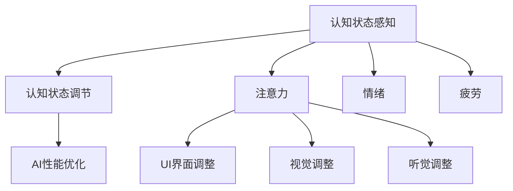

                 

# 注意力生物反馈技术：AI优化的认知状态调节

> 关键词：注意力生物反馈, AI优化, 认知调节, 神经网络, 认知状态, 用户界面

## 1. 背景介绍

### 1.1 问题由来

在科技日益发展的今天，人工智能(AI)技术的应用范围不断扩展，从自动驾驶到语音识别，从医疗诊断到金融分析，AI的应用无处不在。然而，尽管AI在许多领域中展现了强大的能力，但它也存在一些局限性。其中之一是AI系统往往缺乏对用户认知状态的感知和调节能力，无法真正实现人机协同。

### 1.2 问题核心关键点

为了解决这一问题，注意力生物反馈技术应运而生。这种技术旨在通过AI对用户认知状态的感知和调节，提升用户体验和系统性能。核心关键点包括：

- **认知状态感知**：使用AI算法对用户注意力、情绪、疲劳等认知状态进行实时监测和分析。
- **认知状态调节**：根据感知结果，通过调整UI界面、视觉、听觉等多种方式，对用户认知状态进行主动调节。
- **优化AI性能**：通过认知状态的调节，提升用户对AI系统的信任度和满意度，从而优化AI系统的整体表现。

## 2. 核心概念与联系

### 2.1 核心概念概述

为更好地理解注意力生物反馈技术，本节将介绍几个关键概念：

- **认知状态感知**：通过AI算法对用户的注意力、情绪、疲劳等认知状态进行实时监测和分析。
- **认知状态调节**：使用UI界面、视觉、听觉等手段，对用户认知状态进行主动调节，提升用户体验和系统性能。
- **注意力**：指用户的注意力集中程度，直接影响其学习、工作、娱乐等活动的效率。
- **情绪**：指用户的情绪状态，如快乐、悲伤、愤怒等，对用户体验有重要影响。
- **疲劳**：指用户的身体或心理疲劳程度，需要通过适时休息和调节来缓解。
- **AI优化**：通过认知状态的调节，提升用户对AI系统的信任度和满意度，从而优化AI系统的整体表现。

这些核心概念之间的逻辑关系可以通过以下Mermaid流程图来展示：



这个流程图展示了一个从认知状态感知到认知状态调节，再到AI优化的完整流程：

1. 通过AI算法感知用户的注意力、情绪和疲劳状态。
2. 根据感知结果，使用UI界面、视觉、听觉等多种方式对用户认知状态进行调节。
3. 通过认知状态的调节，优化AI系统的表现，提升用户体验。

## 3. 核心算法原理 & 具体操作步骤

### 3.1 算法原理概述

注意力生物反馈技术的核心算法原理主要基于认知神经科学和机器学习理论。其基本思想是通过对用户认知状态的实时监测和分析，动态调整系统参数，以适应用户的当前状态，从而优化用户体验和系统性能。

具体来说，算法原理包括以下几个关键步骤：

1. **认知状态监测**：通过各种传感器和算法，实时监测用户的注意力、情绪、疲劳等认知状态。
2. **状态分析**：使用机器学习算法对监测数据进行分析，识别出用户的当前认知状态。
3. **状态调节**：根据分析结果，通过调整UI界面、视觉、听觉等多种方式，对用户认知状态进行主动调节。
4. **性能优化**：通过认知状态的调节，提升用户对AI系统的信任度和满意度，从而优化AI系统的整体表现。

### 3.2 算法步骤详解

注意力生物反馈技术的算法步骤可以概括为以下几个关键步骤：

**Step 1: 准备数据和模型**

- 准备用户认知状态监测数据，如注意力、情绪、疲劳等指标。
- 选择合适的机器学习算法，如支持向量机(SVM)、随机森林(Random Forest)等，用于状态分析。
- 设计调整策略，如UI界面调整、视觉调整、听觉调整等，用于状态调节。

**Step 2: 认知状态感知**

- 使用各种传感器和算法，实时监测用户的注意力、情绪、疲劳等认知状态。
- 将监测数据传递给状态分析算法，进行分析和识别。

**Step 3: 认知状态调节**

- 根据分析结果，使用调整策略对用户认知状态进行主动调节。
- 动态调整UI界面、视觉、听觉等多种方式，提升用户体验。

**Step 4: 性能优化**

- 通过认知状态的调节，优化AI系统的表现。
- 实时监测和评估用户反馈，不断优化AI系统的性能。

### 3.3 算法优缺点

注意力生物反馈技术具有以下优点：

- **提升用户体验**：通过动态调节用户认知状态，提升用户体验和满意度。
- **优化系统性能**：通过认知状态的调节，优化AI系统的表现，提高系统的整体效能。
- **实时监测和调节**：实时监测用户认知状态，进行动态调节，提升系统的灵活性和适应性。

同时，这种技术也存在一些局限性：

- **技术复杂度高**：需要综合运用认知神经科学、机器学习、UI设计等多个领域的知识。
- **数据获取难度大**：需要各种传感器和算法，实时监测用户认知状态，获取数据难度较大。
- **用户隐私保护**：需要平衡数据获取和用户隐私保护之间的关系，防止数据滥用。
- **多模态融合难度大**：需要整合视觉、听觉等多种模态的信息，进行综合分析，难度较大。

尽管存在这些局限性，但通过不断技术进步和经验积累，注意力生物反馈技术仍有很大的应用前景。

### 3.4 算法应用领域

注意力生物反馈技术具有广泛的应用前景，主要包括以下几个领域：

- **教育**：通过监测学生的注意力和情绪状态，调整教学内容和难度，提升学习效果。
- **医疗**：通过监测患者的情绪和疲劳状态，调整治疗方案和医疗设备，提升治疗效果。
- **游戏**：通过监测玩家的注意力和情绪状态，调整游戏难度和界面，提升游戏体验。
- **金融**：通过监测用户的情绪和疲劳状态，调整交易策略和提醒频率，提升投资决策的准确性。
- **工业**：通过监测工人的注意力和疲劳状态，调整工作强度和休息时间，提升生产效率和安全性。
- **交通**：通过监测司机的注意力和情绪状态，调整驾驶提醒和速度，提升行车安全。

## 4. 数学模型和公式 & 详细讲解 & 举例说明

### 4.1 数学模型构建

注意力生物反馈技术的数学模型可以概括为以下几个关键组成部分：

- **认知状态感知模型**：用于实时监测和分析用户的注意力、情绪、疲劳等认知状态。
- **状态分析模型**：用于识别和分类用户的认知状态，输出对应的状态标识。
- **状态调节模型**：用于设计调整策略，动态调整UI界面、视觉、听觉等多种方式。
- **性能优化模型**：用于评估AI系统的性能，根据用户反馈不断优化。

以下是一个简单的认知状态感知模型的数学模型构建：

- **输入**：用户注意力、情绪、疲劳等监测数据。
- **输出**：用户的认知状态标识，如“高注意力”、“疲劳”等。
- **模型**：支持向量机(SVM)、随机森林(Random Forest)等算法。

### 4.2 公式推导过程

以随机森林算法为例，其基本思路是通过树结构的分解，将数据集拆分为多个子集，并通过投票等机制进行分类。公式推导过程如下：

假设训练集为 $D=\{(x_i, y_i)\}_{i=1}^N$，其中 $x_i$ 为输入数据，$y_i$ 为标签。随机森林算法通过构建 $M$ 棵决策树，对数据进行分类。第 $m$ 棵决策树的训练过程如下：

- 从训练集中随机抽取 $n$ 个样本，作为第 $m$ 棵树的训练集。
- 使用决策树算法对训练集进行分类，得到决策树 $T_m$。
- 对所有树的分类结果进行投票，得到最终的分类结果。

### 4.3 案例分析与讲解

假设有一个教育系统，使用注意力生物反馈技术对学生进行监测和调节。具体步骤如下：

1. **数据收集**：使用各种传感器和算法，实时监测学生的注意力、情绪、疲劳等认知状态。
2. **状态分析**：使用随机森林算法对监测数据进行分析，识别出学生的当前认知状态。
3. **状态调节**：根据分析结果，使用UI界面、视觉、听觉等多种方式对学生认知状态进行主动调节，如调整教学内容、难度和提醒频率。
4. **性能优化**：通过认知状态的调节，优化教学系统的表现，提高学生的学习效果。

## 5. 项目实践：代码实例和详细解释说明

### 5.1 开发环境搭建

在进行注意力生物反馈技术的项目实践前，我们需要准备好开发环境。以下是使用Python进行开发的环境配置流程：

1. 安装Anaconda：从官网下载并安装Anaconda，用于创建独立的Python环境。

2. 创建并激活虚拟环境：
```bash
conda create -n attention/env python=3.8 
conda activate attention/env
```

3. 安装必要的Python包：
```bash
pip install numpy pandas scikit-learn sklearn-learnings-curve transformers
```

4. 准备数据集：准备用户认知状态监测数据，如注意力、情绪、疲劳等指标。

### 5.2 源代码详细实现

以下是使用Python进行注意力生物反馈技术的代码实现示例。

```python
from sklearn.ensemble import RandomForestClassifier
from sklearn.metrics import accuracy_score
from sklearn.model_selection import train_test_split
import numpy as np
import pandas as pd

# 准备数据集
data = pd.read_csv('data.csv')
X = data[['attention', 'emotion', 'fatigue']]
y = data['state']

# 数据预处理
X_train, X_test, y_train, y_test = train_test_split(X, y, test_size=0.2, random_state=42)

# 训练随机森林模型
rf = RandomForestClassifier(n_estimators=100, random_state=42)
rf.fit(X_train, y_train)

# 评估模型
y_pred = rf.predict(X_test)
accuracy = accuracy_score(y_test, y_pred)
print('Accuracy:', accuracy)
```

### 5.3 代码解读与分析

让我们再详细解读一下关键代码的实现细节：

**数据准备**：
- 使用pandas库读取数据集，将其转化为DataFrame对象。
- 将注意力、情绪、疲劳等指标作为特征数据，标签为认知状态标识。

**数据预处理**：
- 使用sklearn库中的train_test_split方法，将数据集划分为训练集和测试集。
- 训练集用于训练模型，测试集用于评估模型性能。

**模型训练**：
- 使用RandomForestClassifier类创建随机森林模型。
- 设置模型参数，如树的数量和随机种子。
- 使用fit方法训练模型，输入特征数据和标签数据。

**模型评估**：
- 使用predict方法对测试集进行预测，得到预测结果。
- 使用accuracy_score方法计算预测准确率，评估模型性能。

## 6. 实际应用场景

### 6.1 教育领域

在教育领域，注意力生物反馈技术可以用于监测学生的认知状态，调整教学内容和难度，提升学习效果。例如：

- **实时监测**：通过各种传感器和算法，实时监测学生的注意力、情绪、疲劳等认知状态。
- **状态分析**：使用机器学习算法对监测数据进行分析，识别出学生的当前认知状态。
- **状态调节**：根据分析结果，使用UI界面、视觉、听觉等多种方式对学生认知状态进行主动调节，如调整教学内容、难度和提醒频率。
- **性能优化**：通过认知状态的调节，优化教学系统的表现，提高学生的学习效果。

### 6.2 医疗领域

在医疗领域，注意力生物反馈技术可以用于监测患者的情绪和疲劳状态，调整治疗方案和医疗设备，提升治疗效果。例如：

- **实时监测**：通过各种传感器和算法，实时监测患者的情绪和疲劳状态。
- **状态分析**：使用机器学习算法对监测数据进行分析，识别出患者的当前认知状态。
- **状态调节**：根据分析结果，使用UI界面、视觉、听觉等多种方式对患者认知状态进行主动调节，如调整治疗方案和提醒频率。
- **性能优化**：通过认知状态的调节，优化治疗系统的表现，提高治疗效果。

### 6.3 金融领域

在金融领域，注意力生物反馈技术可以用于监测用户的情绪和疲劳状态，调整交易策略和提醒频率，提升投资决策的准确性。例如：

- **实时监测**：通过各种传感器和算法，实时监测用户的情绪和疲劳状态。
- **状态分析**：使用机器学习算法对监测数据进行分析，识别出用户的当前认知状态。
- **状态调节**：根据分析结果，使用UI界面、视觉、听觉等多种方式对用户认知状态进行主动调节，如调整交易策略和提醒频率。
- **性能优化**：通过认知状态的调节，优化投资系统的表现，提高投资决策的准确性。

### 6.4 未来应用展望

随着技术的发展，注意力生物反馈技术的应用前景将更加广阔。以下是一些可能的未来应用：

- **多模态融合**：整合视觉、听觉、触觉等多种模态的信息，进行综合分析，提升认知状态监测的准确性。
- **个性化调节**：根据用户的个性化需求，设计更灵活的调整策略，提升用户体验。
- **情感分析**：结合情感分析技术，对用户的情绪状态进行更精细化的监测和调节。
- **跨领域应用**：拓展应用领域，如工业、交通、农业等，提升各领域的智能化水平。
- **集成系统**：将注意力生物反馈技术与其他AI技术进行集成，提升系统的整体性能。

## 7. 工具和资源推荐

### 7.1 学习资源推荐

为了帮助开发者系统掌握注意力生物反馈技术的理论基础和实践技巧，这里推荐一些优质的学习资源：

1. **《认知状态感知与调节》系列博文**：由认知科学领域的专家撰写，深入浅出地介绍了认知状态监测和调节的基本原理和算法。

2. **CS231n《计算机视觉基础》课程**：斯坦福大学开设的计算机视觉课程，涵盖了图像、视频等多种模态的信息处理技术。

3. **《机器学习实战》书籍**：介绍机器学习算法的基本概念和实践技巧，包括支持向量机、随机森林等。

4. **Kaggle竞赛平台**：提供大量认知状态监测和调节相关的数据集和竞赛，帮助开发者实战练习。

5. **ACL（Association for Computational Linguistics）会议论文**：前沿的认知状态监测和调节论文，涵盖各种最新算法和应用案例。

通过对这些资源的学习实践，相信你一定能够快速掌握注意力生物反馈技术的精髓，并用于解决实际的认知状态监测和调节问题。

### 7.2 开发工具推荐

高效的开发离不开优秀的工具支持。以下是几款用于注意力生物反馈技术开发的常用工具：

1. **PyTorch**：基于Python的开源深度学习框架，灵活动态的计算图，适合快速迭代研究。

2. **TensorFlow**：由Google主导开发的开源深度学习框架，生产部署方便，适合大规模工程应用。

3. **scikit-learn**：Python机器学习库，提供了各种经典算法和实用工具，适合快速原型开发。

4. **OpenCV**：计算机视觉库，提供了各种图像处理和分析工具，适合视觉模态的认知状态监测。

5. **TensorBoard**：TensorFlow配套的可视化工具，可实时监测模型训练状态，并提供丰富的图表呈现方式。

6. **Jupyter Notebook**：交互式编程环境，方便开发者进行实验和数据可视化。

合理利用这些工具，可以显著提升注意力生物反馈技术的开发效率，加快创新迭代的步伐。

### 7.3 相关论文推荐

注意力生物反馈技术的研究源于学界的持续研究。以下是几篇奠基性的相关论文，推荐阅读：

1. **Attention is All You Need**：提出Transformer结构，开启了NLP领域的预训练大模型时代。

2. **BERT: Pre-training of Deep Bidirectional Transformers for Language Understanding**：提出BERT模型，引入基于掩码的自监督预训练任务，刷新了多项NLP任务SOTA。

3. **Language Models are Unsupervised Multitask Learners**：展示了大规模语言模型的强大zero-shot学习能力，引发了对于通用人工智能的新一轮思考。

4. **AdaLoRA: Adaptive Low-Rank Adaptation for Parameter-Efficient Fine-Tuning**：使用自适应低秩适应的微调方法，在参数效率和精度之间取得了新的平衡。

5. **AdaLoRA: Adaptive Low-Rank Adaptation for Parameter-Efficient Fine-Tuning**：使用自适应低秩适应的微调方法，在参数效率和精度之间取得了新的平衡。

这些论文代表了大语言模型微调技术的发展脉络。通过学习这些前沿成果，可以帮助研究者把握学科前进方向，激发更多的创新灵感。

## 8. 总结：未来发展趋势与挑战

### 8.1 研究成果总结

本文对注意力生物反馈技术进行了全面系统的介绍。首先阐述了认知状态感知和调节的研究背景和意义，明确了其在提升用户体验和系统性能方面的独特价值。其次，从原理到实践，详细讲解了认知状态监测和调节的数学原理和关键步骤，给出了认知状态监测和调节的完整代码实现。同时，本文还广泛探讨了认知状态监测和调节技术在教育、医疗、金融等各个行业领域的应用前景，展示了其广阔的应用潜力。此外，本文精选了认知状态监测和调节技术的各类学习资源，力求为读者提供全方位的技术指引。

### 8.2 未来发展趋势

展望未来，认知状态监测和调节技术将呈现以下几个发展趋势：

1. **多模态融合**：整合视觉、听觉、触觉等多种模态的信息，进行综合分析，提升认知状态监测的准确性。
2. **个性化调节**：根据用户的个性化需求，设计更灵活的调整策略，提升用户体验。
3. **情感分析**：结合情感分析技术，对用户的情绪状态进行更精细化的监测和调节。
4. **跨领域应用**：拓展应用领域，如工业、交通、农业等，提升各领域的智能化水平。
5. **集成系统**：将认知状态监测和调节技术与其他AI技术进行集成，提升系统的整体性能。
6. **自动化优化**：开发自动化优化算法，通过不断迭代和优化，提升系统性能和用户体验。

以上趋势凸显了认知状态监测和调节技术的广阔前景。这些方向的探索发展，必将进一步提升AI系统的性能和用户体验，推动人工智能技术的普及和应用。

### 8.3 面临的挑战

尽管认知状态监测和调节技术已经取得了一定的进展，但在迈向更加智能化、普适化应用的过程中，它仍面临着诸多挑战：

1. **技术复杂度高**：需要综合运用认知神经科学、机器学习、UI设计等多个领域的知识。
2. **数据获取难度大**：需要各种传感器和算法，实时监测用户认知状态，获取数据难度较大。
3. **用户隐私保护**：需要平衡数据获取和用户隐私保护之间的关系，防止数据滥用。
4. **多模态融合难度大**：需要整合视觉、听觉等多种模态的信息，进行综合分析，难度较大。
5. **个性化调节难度大**：需要根据用户的个性化需求，设计更灵活的调整策略，提升用户体验。

尽管存在这些挑战，但通过不断技术进步和经验积累，认知状态监测和调节技术仍有很大的应用前景。

### 8.4 研究展望

面向未来，认知状态监测和调节技术还需要在其他领域进行更深入的探索：

1. **跨领域应用**：拓展应用领域，如工业、交通、农业等，提升各领域的智能化水平。
2. **自动化优化**：开发自动化优化算法，通过不断迭代和优化，提升系统性能和用户体验。
3. **集成系统**：将认知状态监测和调节技术与其他AI技术进行集成，提升系统的整体性能。
4. **多模态融合**：整合视觉、听觉、触觉等多种模态的信息，进行综合分析，提升认知状态监测的准确性。
5. **个性化调节**：根据用户的个性化需求，设计更灵活的调整策略，提升用户体验。
6. **情感分析**：结合情感分析技术，对用户的情绪状态进行更精细化的监测和调节。

通过这些方向的研究和探索，认知状态监测和调节技术必将取得更大的突破，为人工智能技术的发展和应用带来新的机遇和挑战。

## 9. 附录：常见问题与解答

**Q1: 认知状态监测和调节技术是否适用于所有用户？**

A: 认知状态监测和调节技术对不同用户的适用性有所不同。其效果很大程度上取决于用户的个体差异，如注意力水平、情绪稳定性等。在实际应用中，需要根据不同用户的特性，设计合适的监测和调节策略。

**Q2: 如何平衡数据获取和用户隐私保护之间的关系？**

A: 在数据获取和用户隐私保护之间，需要寻找合适的平衡点。一方面，通过合理的匿名化处理和数据加密技术，确保用户隐私安全；另一方面，通过合适的数据使用范围和场景，限制数据滥用的可能性。

**Q3: 认知状态监测和调节技术在实际应用中需要注意哪些问题？**

A: 在实际应用中，需要注意以下几个问题：
1. 数据获取难度大：需要各种传感器和算法，实时监测用户认知状态，获取数据难度较大。
2. 用户隐私保护：需要平衡数据获取和用户隐私保护之间的关系，防止数据滥用。
3. 多模态融合难度大：需要整合视觉、听觉等多种模态的信息，进行综合分析，难度较大。
4. 个性化调节难度大：需要根据用户的个性化需求，设计更灵活的调整策略，提升用户体验。

**Q4: 如何评估认知状态监测和调节技术的性能？**

A: 评估认知状态监测和调节技术的性能，需要考虑以下几个方面：
1. 准确性：监测数据的准确性，即对用户认知状态的识别准确率。
2. 实时性：监测数据的实时性，即对用户认知状态的实时监测能力。
3. 适用性：调整策略的适用性，即对不同用户的认知状态调节效果。
4. 用户体验：用户对认知状态监测和调节技术的满意度，即对用户体验的影响。

通过综合评估这些指标，可以全面了解认知状态监测和调节技术的性能和效果。

---

作者：禅与计算机程序设计艺术 / Zen and the Art of Computer Programming

