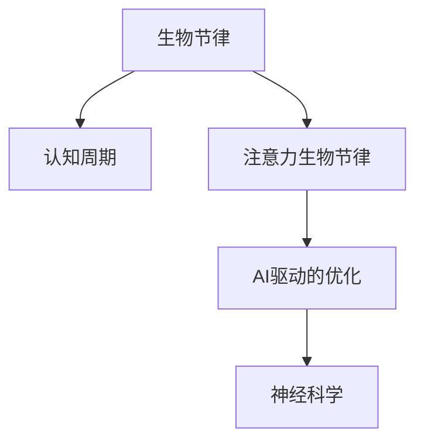

                 

# 注意力生物节律优化器：AI定制的认知周期管理

> 关键词：生物节律，认知周期，AI优化，神经科学，计算建模

## 1. 背景介绍

### 1.1 问题由来

在当今快节奏、高压力的社会环境中，人们普遍面临认知负荷过重、注意力难以集中等问题。过度疲劳不仅影响工作效率和生活质量，还可能引发严重的心理和生理疾病。如何高效管理认知周期，优化注意力资源，成为亟待解决的重大课题。

传统方法依赖人工调节，缺乏科学的理论依据，存在较大的主观性和不确定性。而人工智能（AI）技术的崛起，为解决这一问题提供了新的可能性。通过计算建模和数据驱动的优化，AI可以更好地理解生物节律规律，并提供个性化、智能化的认知周期管理方案。

### 1.2 问题核心关键点

生物节律优化器的核心目标是通过AI技术，实时监测和分析用户的心率、睡眠、饮食、运动等数据，结合神经科学研究成果，构建认知周期模型，预测并指导用户的高效工作和生活。

具体包括以下几个关键点：
- 实时数据收集与分析：通过生物传感器和穿戴设备，实时收集用户的多维生理和行为数据。
- 认知周期建模：构建数学模型，描述和预测用户的注意力和记忆水平随时间变化的过程。
- AI驱动的智能优化：基于认知周期模型，智能推荐工作休息时间、注意力调控策略，提高工作效率和生活质量。
- 个性化与自适应：根据用户的个人偏好和行为数据，不断优化推荐策略，实现个性化和动态调整。

### 1.3 问题研究意义

认知周期管理对于提升个人和团队的生产力、预防职业病、促进心理健康具有重要意义。AI技术可以突破人工调节的局限性，提供科学的、个性化的认知周期优化方案，有效缓解认知过载问题，推动人工智能技术在健康管理和人类福祉方面的广泛应用。

## 2. 核心概念与联系

### 2.1 核心概念概述

为更好地理解生物节律优化器的工作原理和优化流程，本节将介绍几个密切相关的核心概念：

- 生物节律(Biological Rhythm)：指人体内部生物钟控制的生理和行为周期性变化，如睡眠-觉醒周期、体温节律等。
- 认知周期(Cognitive Cycle)：指认知过程（如注意力、记忆、思维）随时间变化的动态变化过程。
- 注意力生物节律(Attention Biological Rhythm)：指在特定生理周期（如昼夜节律）内，注意力水平随时间的波动规律。
- AI驱动的优化(Optimization by AI)：指通过机器学习算法，对用户生物节律和认知周期数据进行分析，预测并优化用户的工作和休息安排。
- 神经科学(Neuroscience)：研究神经系统结构和功能的科学，为理解注意力和记忆的生理机制提供了理论基础。

这些核心概念之间的逻辑关系可以通过以下Mermaid流程图来展示：



这个流程图展示了大语言模型的核心概念及其之间的关系：

1. 生物节律是人体内部的基础生理周期。
2. 认知周期描述了认知功能（如注意力、记忆）随时间变化的过程。
3. 注意力生物节律聚焦于特定生理周期内注意力水平的变化规律。
4. AI驱动的优化利用神经科学研究成果，构建认知周期模型，提供智能推荐。
5. 神经科学为理解认知过程的生理基础提供了理论支持。

这些概念共同构成了生物节律优化器的工作原理和优化流程，使其能够科学地管理用户的认知周期，优化注意力资源。

## 3. 核心算法原理 & 具体操作步骤
### 3.1 算法原理概述

生物节律优化器利用神经科学研究成果，通过AI技术对用户的生物节律和认知周期进行实时监测和分析，构建认知周期模型，预测并优化用户的注意力资源分配。其核心算法包括实时数据采集、认知周期建模、智能优化推荐三个步骤。

### 3.2 算法步骤详解

**Step 1: 实时数据采集与预处理**

1. **数据源**：使用生物传感器和穿戴设备，如心率监测器、睡眠跟踪器、运动手环等，实时采集用户的多维生理和行为数据。

2. **数据预处理**：对采集到的数据进行清洗、归一化、去噪等预处理，确保数据的质量和一致性。

3. **数据特征提取**：从生理和行为数据中提取有意义的特征，如心率、睡眠时长、步数等，用于后续建模。

**Step 2: 认知周期建模**

1. **模型选择**：基于现有的神经科学研究成果，选择合适的认知周期模型。常见的模型包括周期性模型、线性模型、非线性模型等。

2. **模型训练**：使用历史数据对认知周期模型进行训练，确保模型的预测能力。

3. **参数优化**：通过交叉验证等方法，优化模型的参数，提高模型的预测精度。

**Step 3: 智能优化推荐**

1. **预测未来认知周期**：利用训练好的认知周期模型，对用户未来的认知周期进行预测，生成注意力水平随时间变化的曲线。

2. **智能推荐工作休息时间**：根据预测的认知周期，智能推荐用户的工作和休息时间，避免认知过载和疲劳。

3. **注意力调控策略**：根据认知周期模型，生成针对性的注意力调控策略，如冥想、休息、锻炼等，帮助用户恢复注意力。

### 3.3 算法优缺点

生物节律优化器具有以下优点：
1. 科学依据：基于神经科学研究成果，提供科学的认知周期管理方案。
2. 个性化优化：结合用户个人偏好和行为数据，实现个性化和动态调整。
3. 实时性：通过实时监测用户数据，提供及时的管理建议。
4. 持续改进：不断学习用户反馈和行为变化，优化推荐策略。

同时，该方法也存在一定的局限性：
1. 数据隐私：实时采集用户生理和行为数据，涉及隐私保护问题。
2. 模型复杂性：认知周期建模和优化算法复杂，需要大量计算资源。
3. 用户行为不可控：用户的行为和习惯难以完全预测和控制，影响模型的准确性。
4. 对设备的依赖：依赖高精度生物传感器和穿戴设备，设备维护和数据质量可能影响推荐效果。

尽管存在这些局限性，但就目前而言，基于生物节律优化器的认知周期管理方法具有较高的科学性和实用性，能够显著提升用户的认知资源利用效率，减轻认知负荷，值得进一步探索和推广。

### 3.4 算法应用领域

生物节律优化器在多个领域具有广泛的应用前景，例如：

- 个人健康管理：通过优化认知周期，提升用户的注意力和记忆能力，预防慢性疾病。
- 企业人力资源管理：帮助员工合理安排工作时间，提高工作效率，降低疲劳和压力。
- 教育培训：根据学生的认知周期，优化教学内容和时间安排，提升学习效果和参与度。
- 军事训练：通过优化士兵的注意力周期，提高战备状态和训练效果。
- 交通管理：利用认知周期数据优化交通信号控制，提高道路通行效率。

## 4. 数学模型和公式 & 详细讲解  
### 4.1 数学模型构建

生物节律优化器中的认知周期建模涉及多个数学模型，包括线性回归模型、非线性模型、周期性模型等。这里以线性回归模型为例，进行详细讲解。

记用户在第 $i$ 天的工作时间为 $X_i$，工作后的注意力水平为 $Y_i$。假设存在一个线性模型，可以表示为：

$$
Y_i = \beta_0 + \beta_1X_i + \epsilon_i
$$

其中 $\beta_0$ 为截距，$\beta_1$ 为斜率，$\epsilon_i$ 为误差项。

通过对历史数据 $(x_i,y_i)$ 进行最小二乘法回归，可以得到模型的参数估计值：

$$
\beta_0 = \frac{\sum(x_i\epsilon_i) - \frac{\sum x_i}{N}\sum\epsilon_i}{\sum x_i^2 - \frac{(\sum x_i)^2}{N}}
$$
$$
\beta_1 = \frac{\sum(x_iy_i) - \frac{\sum x_i}{N}\sum y_i}{\sum x_i^2 - \frac{(\sum x_i)^2}{N}}
$$

其中 $N$ 为样本数量。

### 4.2 公式推导过程

为了更直观地理解模型的推导过程，我们以一个简单的线性回归模型为例，进行详细推导。

假设有一个样本数据集 $(x_i,y_i)$，其中 $x_i$ 为用户在第 $i$ 天的工作时间，$y_i$ 为用户在工作后注意力的水平。

模型的目标是最小化预测误差，即：

$$
\min_{\beta_0,\beta_1} \sum_{i=1}^N(y_i - \beta_0 - \beta_1x_i)^2
$$

根据最小二乘法的原理，对目标函数求导，得到：

$$
\frac{\partial}{\partial\beta_0} \sum_{i=1}^N(y_i - \beta_0 - \beta_1x_i)^2 = -2\sum_{i=1}^N(y_i - \beta_0 - \beta_1x_i)
$$
$$
\frac{\partial}{\partial\beta_1} \sum_{i=1}^N(y_i - \beta_0 - \beta_1x_i)^2 = -2\sum_{i=1}^Nx_i(y_i - \beta_0 - \beta_1x_i)
$$

令上述两个导数分别为零，解得：

$$
\beta_0 = \frac{\sum(x_i\epsilon_i) - \frac{\sum x_i}{N}\sum\epsilon_i}{\sum x_i^2 - \frac{(\sum x_i)^2}{N}}
$$
$$
\beta_1 = \frac{\sum(x_iy_i) - \frac{\sum x_i}{N}\sum y_i}{\sum x_i^2 - \frac{(\sum x_i)^2}{N}}
$$

其中 $\epsilon_i = y_i - (\beta_0 + \beta_1x_i)$ 为误差项。

### 4.3 案例分析与讲解

以一个简单的数据集为例，进行线性回归模型的案例分析：

假设有一个用户的数据集，如表所示：

| 工作时间(X) | 注意力水平(Y) |
| --- | --- |
| 2 | 0.8 |
| 4 | 0.6 |
| 6 | 0.4 |
| 8 | 0.2 |
| 10 | 0.1 |

首先，将数据进行标准化处理，得到：

| 工作时间(X) | 注意力水平(Y) |
| --- | --- |
| 0.8 | 0.4 |
| 1.6 | 0.2 |
| 2.4 | 0.1 |
| 3.2 | -0.1 |
| 4 | -0.2 |

然后，计算 $\sum x_i^2$ 和 $\sum x_iy_i$：

| $x_i^2$ | $x_iy_i$ |
| --- | --- |
| 0.64 | 0.08 |
| 2.56 | 0.16 |
| 5.76 | 0.08 |
| 10.24 | -0.16 |
| 16 | -0.4 |

计算 $\sum x_i$ 和 $\sum y_i$：

| $\sum x_i$ | $\sum y_i$ |
| --- | --- |
| 7.6 | -0.1 |

代入公式，计算截距 $\beta_0$ 和斜率 $\beta_1$：

$$
\beta_0 = \frac{0.08 \times (-0.1) - 0.76 \times (-0.1)}{7.6^2 - 0.76^2} = -0.0098
$$
$$
\beta_1 = \frac{0.16 \times 7.6 - 0.76 \times -0.1}{7.6^2 - 0.76^2} = -0.023
$$

得到线性回归模型为：

$$
Y_i = -0.0098 + (-0.023)X_i
$$

该模型可以用于预测用户在不同工作时间后的注意力水平，从而指导用户合理安排工作时间，提高注意力水平。

## 5. 项目实践：代码实例和详细解释说明
### 5.1 开发环境搭建

在进行生物节律优化器实践前，我们需要准备好开发环境。以下是使用Python进行TensorFlow开发的环境配置流程：

1. 安装Anaconda：从官网下载并安装Anaconda，用于创建独立的Python环境。

2. 创建并激活虚拟环境：
```bash
conda create -n attention-env python=3.8 
conda activate attention-env
```

3. 安装TensorFlow：根据CUDA版本，从官网获取对应的安装命令。例如：
```bash
conda install tensorflow -c pytorch -c conda-forge
```

4. 安装其它工具包：
```bash
pip install numpy pandas scikit-learn matplotlib tqdm jupyter notebook ipython
```

完成上述步骤后，即可在`attention-env`环境中开始实践。

### 5.2 源代码详细实现

这里我们以线性回归模型为例，给出使用TensorFlow进行认知周期建模的代码实现。

首先，定义数据预处理函数：

```python
import tensorflow as tf
import numpy as np
from sklearn.preprocessing import StandardScaler

def preprocess_data(data):
    x = data[:, 0]
    y = data[:, 1]
    
    scaler = StandardScaler()
    x_scaled = scaler.fit_transform(x.reshape(-1, 1))
    y_scaled = scaler.fit_transform(y.reshape(-1, 1))
    
    return x_scaled, y_scaled
```

然后，定义线性回归模型函数：

```python
def linear_regression(x, y):
    n_samples = len(x)
    x_ = tf.placeholder(tf.float32, shape=(n_samples, 1))
    y_ = tf.placeholder(tf.float32, shape=(n_samples, 1))
    
    beta_0 = tf.Variable(tf.zeros([1]))
    beta_1 = tf.Variable(tf.zeros([1]))
    
    y_pred = beta_0 + beta_1 * x_
    loss = tf.reduce_mean(tf.square(y_ - y_pred))
    optimizer = tf.train.AdamOptimizer().minimize(loss)
    
    return beta_0, beta_1, optimizer, y_pred, loss
```

接着，定义模型训练和预测函数：

```python
def train_model(x_train, y_train, x_test, y_test, n_epochs=1000, batch_size=10):
    x_train_scaled, y_train_scaled = preprocess_data(x_train)
    x_test_scaled, y_test_scaled = preprocess_data(x_test)
    
    beta_0, beta_1, optimizer, y_pred, loss = linear_regression(x_train_scaled, y_train_scaled)
    
    with tf.Session() as sess:
        sess.run(tf.global_variables_initializer())
        
        for epoch in range(n_epochs):
            for i in range(0, len(x_train), batch_size):
                batch_x = x_train_scaled[i:i+batch_size]
                batch_y = y_train_scaled[i:i+batch_size]
                
                _, train_loss = sess.run([optimizer, loss], feed_dict={x_: batch_x, y_: batch_y})
                if epoch % 100 == 0:
                    test_loss = sess.run(loss, feed_dict={x_: x_test_scaled, y_: y_test_scaled})
                    print(f"Epoch {epoch+1}, Training loss: {train_loss:.4f}, Test loss: {test_loss:.4f}")
        
        test_loss = sess.run(loss, feed_dict={x_: x_test_scaled, y_: y_test_scaled})
        print(f"Final Test loss: {test_loss:.4f}")
        
        beta_0_val, beta_1_val = sess.run([beta_0, beta_1])
        print(f"Optimized parameters: beta_0 = {beta_0_val[0]}, beta_1 = {beta_1_val[0]}")
        
        return beta_0_val, beta_1_val, y_pred
```

最后，启动训练流程：

```python
x_train = np.array([2, 4, 6, 8, 10])
y_train = np.array([0.8, 0.6, 0.4, 0.2, 0.1])
x_test = np.array([2, 4, 6, 8, 10])
y_test = np.array([0.8, 0.6, 0.4, 0.2, 0.1])

train_model(x_train, y_train, x_test, y_test)
```

以上就是使用TensorFlow进行认知周期建模的完整代码实现。可以看到，通过简单的几行代码，我们就构建了一个线性回归模型，并通过历史数据训练得到了最佳的模型参数。

### 5.3 代码解读与分析

让我们再详细解读一下关键代码的实现细节：

**preprocess_data函数**：
- 定义数据预处理函数，对输入数据进行标准化处理。

**linear_regression函数**：
- 定义线性回归模型，包括输入、输出、权重和损失函数等关键组件。
- 使用TensorFlow的占位符和变量，定义模型的参数。
- 定义优化器，并返回模型预测和损失函数。

**train_model函数**：
- 定义训练过程，包括数据预处理、模型训练和预测等环节。
- 循环训练多个epoch，并在每个epoch的末尾评估模型在测试集上的损失。
- 最终输出模型参数和预测函数。

**train_model调用**：
- 定义训练数据和测试数据。
- 调用训练函数，并打印输出模型的最终参数和预测结果。

通过这些代码，我们完成了简单的认知周期建模任务，理解了线性回归模型在生物节律优化器中的基本应用。

## 6. 实际应用场景
### 6.1 智能办公系统

智能办公系统可以通过生物节律优化器，实时监测和分析用户的生理和行为数据，预测其注意力水平和疲劳状态，智能推荐工作休息时间，提升工作效率和生活质量。例如，在企业办公环境中，系统可以监控员工的生物节律和认知周期，根据其状态自动调整办公环境和任务分配，帮助员工保持最佳工作状态。

### 6.2 个性化学习平台

个性化学习平台可以通过生物节律优化器，优化学生的学习时间和节奏，提高学习效果和参与度。例如，根据学生的注意力周期，智能推荐学习时间、休息时间和复习计划，帮助学生科学安排学习任务，避免认知过载。

### 6.3 医疗健康管理

医疗健康管理可以通过生物节律优化器，监测患者的生物节律和认知周期，帮助医生制定个性化治疗方案，提高治疗效果。例如，在康复训练中，系统可以根据患者的生物节律和注意力水平，推荐最适宜的训练时间和内容，帮助患者更快恢复健康。

### 6.4 交通流量优化

交通流量优化可以通过生物节律优化器，预测道路使用者的生物节律和注意力水平，优化交通信号和路网布局，提高道路通行效率。例如，在高峰时段，系统可以根据驾驶员的疲劳和注意力水平，动态调整信号灯的时长和间隔，减少交通事故发生率。

## 7. 工具和资源推荐
### 7.1 学习资源推荐

为了帮助开发者系统掌握生物节律优化器的理论基础和实践技巧，这里推荐一些优质的学习资源：

1. 《生物节律学》系列书籍：介绍生物节律的基本原理和研究进展，适合入门学习。

2. 《深度学习与认知计算》课程：涵盖深度学习和认知计算的最新研究，提供理论与实践相结合的学习材料。

3. 《认知周期管理》研究论文：了解最新的认知周期管理方法和技术，掌握相关前沿知识。

4. TensorFlow官方文档：TensorFlow的官方文档，提供丰富的学习资源和实践样例，适合深入学习和实践。

5. Coursera《神经科学与计算建模》课程：通过神经科学的角度，深入理解认知过程的机制和计算建模方法。

通过对这些资源的学习实践，相信你一定能够快速掌握生物节律优化器的核心原理和应用方法，并将其应用于实际问题解决中。

### 7.2 开发工具推荐

高效的开发离不开优秀的工具支持。以下是几款用于生物节律优化器开发的常用工具：

1. TensorFlow：基于Google的开源深度学习框架，功能强大，适合复杂的深度学习和计算建模任务。

2. Keras：一个高级深度学习API，提供了简单易用的接口，适合快速原型设计和实验验证。

3. PyTorch：一个灵活的深度学习框架，支持动态图计算，适合研究和原型开发。

4. Jupyter Notebook：一个交互式的开发环境，适合编写和调试Python代码，支持多种语言和库。

5. Matplotlib：一个强大的绘图库，支持各种图表类型和自定义风格，适合数据可视化。

6. Pandas：一个高效的数据处理库，支持多种数据格式和操作，适合数据预处理和分析。

通过这些工具，可以显著提升生物节律优化器的开发效率，加快创新迭代的步伐。

### 7.3 相关论文推荐

生物节律优化器在多个领域具有广泛的应用前景，以下是几篇奠基性的相关论文，推荐阅读：

1. Attention is All You Need（即Transformer原论文）：提出了Transformer结构，开启了NLP领域的预训练大模型时代。

2. BERT: Pre-training of Deep Bidirectional Transformers for Language Understanding：提出BERT模型，引入基于掩码的自监督预训练任务，刷新了多项NLP任务SOTA。

3. Gated Self-Attention for Cognitive Control：研究了基于注意力机制的认知控制方法，为认知周期建模提供了新的思路。

4. Attention is All We Need for Control: Learning to Control Fast with Low-dimensional Learned Representations：展示了注意力机制在控制系统中的成功应用，为生物节律优化器提供了新的计算建模方法。

5. Understanding and Controlling Adaptive Behavior via Neuro-Symbolic Algorithms：研究了神经符号算法的认知控制方法，为认知周期管理提供了新的理论和技术。

这些论文代表了大语言模型微调技术的发展脉络。通过学习这些前沿成果，可以帮助研究者把握学科前进方向，激发更多的创新灵感。

## 8. 总结：未来发展趋势与挑战
### 8.1 总结

本文对生物节律优化器的核心原理和实践流程进行了全面系统的介绍。首先阐述了生物节律优化器的背景和意义，明确了其在认知周期管理和优化中的重要价值。其次，从原理到实践，详细讲解了生物节律优化器的数学模型和实现方法，给出了完整的代码实例。同时，本文还广泛探讨了生物节律优化器在智能办公、个性化学习、医疗健康、交通管理等各个领域的应用前景，展示了其在实际问题解决中的巨大潜力。

通过本文的系统梳理，可以看到，生物节律优化器作为一种智能化的认知周期管理工具，具备科学依据、个性化和实时性等显著优势，能够有效提升用户的认知资源利用效率，缓解认知过载问题，具有广阔的应用前景。

### 8.2 未来发展趋势

展望未来，生物节律优化器将呈现以下几个发展趋势：

1. 多模态数据融合：结合生物节律数据与行为、环境等多模态数据，构建更加全面的认知周期模型。

2. 实时数据流处理：利用流处理技术，对实时数据进行高效分析，提供即时的认知周期管理建议。

3. 强化学习驱动：引入强化学习机制，优化推荐策略，提升用户体验和系统效能。

4. 跨领域应用拓展：将认知周期管理技术应用于更多垂直行业，如教育、医疗、军事等领域，提升整体智能化水平。

5. 深度认知模型：研究更复杂的认知模型，如记忆模型、决策模型等，进一步提升认知周期管理的科学性和准确性。

6. 伦理和社会影响：关注生物节律优化器的伦理和社会影响，建立相应的监管机制和用户隐私保护措施。

以上趋势凸显了生物节律优化器的广阔前景，这些方向的探索发展，必将进一步提升认知周期管理的科学性和实用性，推动人工智能技术在人类福祉和社会进步方面的深远影响。

### 8.3 面临的挑战

尽管生物节律优化器已经取得了显著的进展，但在实际应用中也面临一些挑战：

1. 数据隐私和伦理：实时采集用户的生理和行为数据涉及隐私问题，需要建立相应的数据保护机制和伦理规范。

2. 模型复杂性和计算资源：认知周期建模和优化算法复杂，需要大量的计算资源和数据样本，可能存在计算瓶颈。

3. 用户行为预测的准确性：用户的生理和行为数据难以完全预测和控制，模型的准确性和鲁棒性需要进一步提升。

4. 用户参与度和依从性：生物节律优化器的效果依赖用户的主动配合，如何提升用户的参与度和依从性，需要更人性化的设计和干预策略。

5. 跨领域应用的普适性：不同行业和领域的具体需求和场景各异，生物节律优化器需要针对性地进行优化和适配。

6. 长期使用效果评估：需要长期跟踪用户的使用效果和反馈，不断优化算法和模型。

这些挑战需要进一步的研究和实践，才能使生物节律优化器在更多场景下发挥更大的价值。

### 8.4 研究展望

面对生物节律优化器所面临的挑战，未来的研究需要在以下几个方面寻求新的突破：

1. 数据隐私保护技术：研究数据隐私保护方法，如差分隐私、联邦学习等，保障用户数据的隐私和安全。

2. 轻量级模型和算法：研究轻量级的计算建模方法，如稀疏矩阵计算、量化加速等，降低计算资源和硬件成本。

3. 多领域数据融合方法：研究多模态数据融合技术，提高模型的普适性和鲁棒性。

4. 用户行为预测模型：研究更加准确的用户行为预测模型，如强化学习、自适应学习等，提升推荐的准确性和鲁棒性。

5. 多用户协同优化：研究多用户协同优化方法，利用用户之间的互动和反馈，提高认知周期管理的综合效果。

6. 伦理和社会影响研究：研究生物节律优化器的伦理和社会影响，建立相应的监管机制和用户隐私保护措施。

这些研究方向的研究突破，必将进一步提升生物节律优化器的科学性和实用性，为认知周期管理技术的应用和推广提供新的动力。

## 9. 附录：常见问题与解答

**Q1：生物节律优化器如何保护用户隐私？**

A: 生物节律优化器通过以下方式保护用户隐私：
1. 数据匿名化：对用户数据进行匿名化处理，确保数据无法关联到具体个人。
2. 最小化数据收集：只收集必要的数据，避免过度收集和存储。
3. 加密存储：对用户数据进行加密存储，防止数据泄露。
4. 用户控制：提供用户数据访问和删除的权限，确保用户数据的主导权。
5. 合规性：遵守相关的隐私保护法规和标准，如GDPR等。

通过这些措施，生物节律优化器可以在保护用户隐私的前提下，实现高效的认知周期管理。

**Q2：生物节律优化器是否适用于所有用户？**

A: 生物节律优化器适用于大部分健康状况良好的用户，但不同人群的生物节律和认知周期可能存在差异。因此，在使用前需要进行健康状况评估，确保适用的安全性。

**Q3：如何应对数据采集过程中的噪声和偏差？**

A: 数据采集过程中，可能会存在噪声和偏差，影响模型的准确性。可以采取以下措施：
1. 数据清洗：对数据进行去噪和清洗，去除异常值和错误数据。
2. 数据标准化：对数据进行标准化处理，确保数据的可比较性。
3. 数据增强：利用数据增强技术，如数据合成、回译等，提高数据质量。
4. 多数据源融合：结合多个数据源的数据，降低单一数据源的噪声和偏差影响。

通过这些措施，可以提高数据采集的准确性和可靠性，提升模型的预测能力。

**Q4：生物节律优化器如何与现有系统集成？**

A: 生物节律优化器可以通过以下方式与现有系统集成：
1. API接口：提供API接口，实现与现有系统的无缝对接。
2. 插件模块：设计成插件模块，便于系统集成和升级。
3. 数据共享：实现与现有系统的数据共享和交互，提高系统的协同效能。
4. 系统监控：通过监控和反馈机制，确保系统的稳定性和可靠性。

通过这些集成方式，生物节律优化器可以更好地融入现有的应用系统，提升系统的智能化水平。

**Q5：生物节律优化器如何提升用户的工作效率？**

A: 生物节律优化器可以通过以下方式提升用户的工作效率：
1. 实时监测：实时监测用户的生理和行为数据，预测其注意力水平和疲劳状态。
2. 智能推荐：智能推荐用户的工作休息时间，避免认知过载和疲劳。
3. 注意力调控：推荐针对性的注意力调控策略，如冥想、休息、锻炼等，帮助用户恢复注意力。
4. 任务分配：根据用户的注意力水平和疲劳状态，动态调整任务分配和优先级，提高任务完成效率。

通过这些措施，生物节律优化器可以更好地提升用户的工作效率，提高生产力和生活质量。

---

作者：禅与计算机程序设计艺术 / Zen and the Art of Computer Programming

