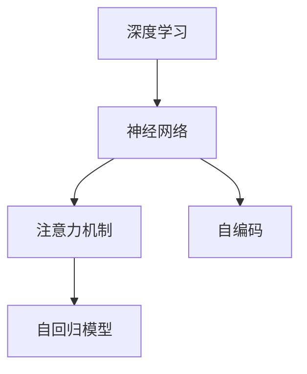

                 

# 注意力的深度学习：AI优化的专注力

> 关键词：深度学习,注意力机制,优化算法,神经网络,注意力权重,自动编码,自回归模型

## 1. 背景介绍

### 1.1 问题由来
在深度学习领域，注意力机制(Attention Mechanism)是一种重要的模型组件，能够帮助模型捕捉输入序列中关键的信息片段，从而提升模型的性能。自从Attention机制在2015年被提出后，其在机器翻译、图像识别、语音识别、自然语言处理等多个任务中取得了显著效果。然而，现有的Attention机制依然存在一些问题：

- **计算复杂度高**：原始的Attention计算需要计算所有输入和输出之间的注意力权重，时间复杂度为O(N^2)，对于大规模数据，计算量巨大。
- **难以解释**：Attention权重分配的过程缺乏透明性，导致其难以解释和调试。
- **训练不稳定**：Attention模型的训练容易过拟合，特别是在大量噪声数据的情况下。

本文将详细阐述深度学习中的注意力机制及其优化策略，探讨如何通过优化算法提高Attention模型的效率和稳定性，同时给出注意力机制在实际应用中的典型案例。

### 1.2 问题核心关键点
在深度学习中，Attention机制是一种特殊的权重分配机制，能够根据输入序列的不同位置，赋予不同的权重，以决定对输入的不同关注程度。其核心在于如何计算和更新Attention权重，以适应不同的输入和任务需求。

本文将从以下几个方面深入探讨注意力机制的优化：

- **计算效率**：如何减少Attention计算的复杂度，降低计算成本。
- **训练稳定性**：如何避免Attention机制的过拟合，提高其泛化能力。
- **解释性**：如何解释Attention权重分配的过程，增强模型的透明度。
- **实际应用**：Attention机制在实际任务中的应用及其效果。

## 2. 核心概念与联系

### 2.1 核心概念概述

为更好地理解深度学习中的注意力机制及其优化策略，本节将介绍几个密切相关的核心概念：

- **深度学习(Deep Learning)**：一种基于多层神经网络的机器学习方法，能够自动从大量数据中学习复杂的特征表示。深度学习在图像识别、语音识别、自然语言处理等领域取得了巨大成功。
- **神经网络(Neural Networks)**：一种由大量神经元(神经元即节点)和连接这些节点的边(权重)组成的图结构。神经网络通过前向传播和反向传播算法，实现输入到输出的映射。
- **注意力机制(Attention Mechanism)**：一种特殊的权重分配机制，通过计算输入序列的不同位置的权重，决定对不同信息的关注程度。Attention机制被广泛应用于机器翻译、图像处理、语音识别等任务。
- **自回归模型(Autoregressive Models)**：一种依赖于序列中之前所有位置的模型，能够通过预测序列中每个位置，从而生成整个序列。自回归模型在生成任务中表现优异。
- **自编码(Autoencoders)**：一种由编码器和解码器组成的神经网络，能够将输入数据压缩为低维表示，再通过解码器还原为原始数据。自编码在降维和特征提取任务中具有优势。

这些核心概念之间的逻辑关系可以通过以下Mermaid流程图来展示：



这个流程图展示了一组相关概念之间的逻辑关系：

1. 深度学习通过多层神经网络实现复杂特征表示。
2. 神经网络是深度学习的基础，通过节点和边构成。
3. 注意力机制是一种特殊的权重分配机制，增强神经网络对重要信息的关注。
4. 自回归模型通过预测序列中每个位置，生成整个序列。
5. 自编码将输入数据压缩为低维表示，再还原为原始数据。

## 3. 核心算法原理 & 具体操作步骤
### 3.1 算法原理概述

在深度学习中，注意力机制通常用于处理序列数据，例如自然语言、语音、图像等。其基本思想是通过计算输入序列中不同位置的权重，决定对这些位置的关注程度，从而提升模型对关键信息的捕捉能力。

在经典的自回归模型中，如GPT，注意力机制计算方式如下：

1. 输入序列经过嵌入层(Embedding Layer)映射为向量表示，生成查询向量(Q)、键向量(K)和值向量(V)。
2. 通过计算查询向量(Q)和键向量(K)的点积，得到Attention得分矩阵S。
3. 将Attention得分矩阵S通过softmax函数转换为注意力权重分布。
4. 根据注意力权重分布，加权求和值向量(V)，生成输出向量(C)。

其中，Attention得分矩阵S和注意力权重分布由以下公式计算：

$$
S = \text{softmax}(QK^T) \\
\alpha = S V
$$

Attention机制的优化，主要集中在减少计算复杂度、提高训练稳定性和增加模型解释性方面。

### 3.2 算法步骤详解

**3.2.1 优化计算复杂度**

计算复杂度高是注意力机制的一个主要问题。现有的Attention计算需要计算所有输入和输出之间的注意力权重，时间复杂度为O(N^2)。为了减少计算复杂度，可以采用以下方法：

- **Scaled Dot-Product Attention**：将Attention得分矩阵S进行缩放，使其每个元素都不超过1。这种方法能够显著降低计算复杂度，但需要调整超参数。
- **FFN Layer**：使用前馈神经网络(Feedforward Neural Network, FFN)替代Attention层，虽然计算复杂度仍然较高，但能够提高模型并行性。
- **Attention Pruning**：根据任务需求，选择部分输入和输出进行计算，减少需要计算的Attention权重数量。

**3.2.2 提高训练稳定性**

训练不稳定是注意力机制的另一个主要问题。通常情况下，Attention权重会随着训练过程产生较大的波动，导致模型难以收敛。为了提高训练稳定性，可以采用以下方法：

- **Gumbel Softmax**：使用Gumbel Softmax替代softmax，降低Attention权重分配的波动。
- **Dropout**：在训练过程中，随机丢弃部分神经元，降低过拟合风险。
- **Regularization**：使用L1、L2正则化等方法，约束Attention权重分布，避免极端值。

**3.2.3 增加模型解释性**

现有Attention机制的权重分配过程缺乏透明性，导致其难以解释和调试。为了增加模型解释性，可以采用以下方法：

- **Attention Guidance**：在输入序列中加入特定的引导词，帮助模型更好地理解输入，从而分配更合理的Attention权重。
- **Attention Visualization**：使用可视化工具，展示Attention权重分配的过程，帮助开发者理解模型行为。
- **Attention Feedback**：通过人工干预或自动化反馈，指导模型调整Attention权重分配策略。

### 3.3 算法优缺点

注意力机制在深度学习中具有以下优点：

- **增强模型表现**：通过计算输入序列中不同位置的权重，决定对不同信息的关注程度，提升模型对关键信息的捕捉能力。
- **处理序列数据**：适用于处理序列数据，如自然语言、语音、图像等，能够捕捉输入中的重要特征。
- **提高模型并行性**：通过FFN Layer等方法，提高模型并行性，加速模型训练和推理。

同时，注意力机制也存在一些缺点：

- **计算复杂度高**：原始的Attention计算需要计算所有输入和输出之间的注意力权重，时间复杂度为O(N^2)。
- **难以解释**：Attention权重分配的过程缺乏透明性，导致其难以解释和调试。
- **训练不稳定**：Attention权重会随着训练过程产生较大的波动，导致模型难以收敛。

### 3.4 算法应用领域

注意力机制在深度学习中具有广泛的应用，主要包括以下几个领域：

- **自然语言处理(NLP)**：在机器翻译、文本生成、问答系统等任务中，通过Attention机制，捕捉输入序列中不同位置的权重，提升模型性能。
- **计算机视觉(CV)**：在图像分类、目标检测、图像生成等任务中，通过Attention机制，捕捉输入图像中不同区域的权重，提升模型性能。
- **语音处理(Audio)**：在语音识别、语音合成等任务中，通过Attention机制，捕捉输入音频中不同片段的权重，提升模型性能。
- **强化学习(Reinforcement Learning)**：在智能游戏、机器人控制等任务中，通过Attention机制，捕捉环境中的重要信息，指导决策过程。

此外，注意力机制还被广泛应用于各种深度学习任务中，如自编码、自回归模型等，提升模型的性能和泛化能力。

## 4. 数学模型和公式 & 详细讲解 & 举例说明

### 4.1 数学模型构建

在深度学习中，注意力机制通常用于处理序列数据。以自回归模型为例，其数学模型构建如下：

1. 输入序列经过嵌入层(Embedding Layer)映射为向量表示，生成查询向量(Q)、键向量(K)和值向量(V)。
2. 通过计算查询向量(Q)和键向量(K)的点积，得到Attention得分矩阵S。
3. 将Attention得分矩阵S通过softmax函数转换为注意力权重分布。
4. 根据注意力权重分布，加权求和值向量(V)，生成输出向量(C)。

数学公式如下：

$$
Q = \text{Embedding}(X) \\
K = \text{Embedding}(X) \\
V = \text{Embedding}(X) \\
S = \text{softmax}(QK^T) \\
\alpha = S V \\
C = \text{Linear}(\alpha)
$$

其中，$\text{Embedding}$表示嵌入层，$\text{Linear}$表示线性变换，$\alpha$表示Attention权重分布。

### 4.2 公式推导过程

以一个简单的自回归模型为例，进行Attention机制的推导。

设输入序列为$X = [x_1, x_2, ..., x_T]$，其中$x_t$表示序列中的第$t$个位置。嵌入层将$X$映射为向量表示$X_e = [q_1, q_2, ..., q_T]$，其中$q_t$表示输入序列中第$t$个位置的嵌入表示。

设查询向量为$Q = [q_1, q_2, ..., q_T]$，键向量为$K = [q_1, q_2, ..., q_T]$，值向量为$V = [v_1, v_2, ..., v_T]$，其中$v_t$表示输入序列中第$t$个位置的值向量。

Attention得分矩阵$S$由以下公式计算：

$$
S = \text{softmax}(QK^T)
$$

其中，$\text{softmax}$表示softmax函数。Attention权重分布$\alpha$由以下公式计算：

$$
\alpha = S V
$$

输出向量$C$由以下公式计算：

$$
C = \text{Linear}(\alpha)
$$

其中，$\text{Linear}$表示线性变换。

### 4.3 案例分析与讲解

以机器翻译任务为例，进行Attention机制的案例分析。

在机器翻译任务中，输入序列为源语言句子，输出序列为目标语言句子。通过嵌入层将输入和输出序列映射为向量表示，计算查询向量(Q)、键向量(K)和值向量(V)，生成Attention得分矩阵S和注意力权重分布$\alpha$，最终生成输出向量$C$，通过线性变换得到翻译结果。

具体步骤如下：

1. 将源语言句子映射为向量表示$Q_s = [q_1, q_2, ..., q_T]$，目标语言句子映射为向量表示$Q_t = [q_1, q_2, ..., q_T]$。
2. 计算Attention得分矩阵$S = \text{softmax}(Q_sK^T)$。
3. 计算注意力权重分布$\alpha = S V$。
4. 计算输出向量$C = \text{Linear}(\alpha)$。
5. 输出翻译结果。

在实际应用中，Attention机制还常常与其他技术相结合，如Transformer、自编码等，提升模型性能。

## 5. 项目实践：代码实例和详细解释说明

### 5.1 开发环境搭建

在进行注意力机制项目实践前，我们需要准备好开发环境。以下是使用Python进行TensorFlow开发的环境配置流程：

1. 安装Anaconda：从官网下载并安装Anaconda，用于创建独立的Python环境。

2. 创建并激活虚拟环境：
```bash
conda create -n attention-env python=3.8 
conda activate attention-env
```

3. 安装TensorFlow：根据CUDA版本，从官网获取对应的安装命令。例如：
```bash
conda install tensorflow -c pytorch -c conda-forge
```

4. 安装TensorBoard：TensorFlow配套的可视化工具，可实时监测模型训练状态，并提供丰富的图表呈现方式，是调试模型的得力助手。

5. 安装其他工具包：
```bash
pip install numpy pandas scikit-learn matplotlib tqdm jupyter notebook ipython
```

完成上述步骤后，即可在`attention-env`环境中开始项目实践。

### 5.2 源代码详细实现

下面我们以机器翻译任务为例，给出使用TensorFlow实现Attention机制的代码实现。

首先，定义Attention机制的计算函数：

```python
import tensorflow as tf

class Attention(tf.keras.layers.Layer):
    def __init__(self, d_model, num_heads):
        super(Attention, self).__init__()
        self.num_heads = num_heads
        self.d_model = d_model

        self.wq = tf.keras.layers.Dense(d_model)
        self.wk = tf.keras.layers.Dense(d_model)
        self.v = tf.keras.layers.Dense(d_model)

    def split_heads(self, x, batch_size):
        x = tf.reshape(x, (batch_size, -1, self.num_heads, self.d_model // self.num_heads))
        return tf.transpose(x, perm=[0, 2, 1, 3])

    def call(self, q, k, v):
        q = self.wq(q)
        k = self.wk(k)
        v = self.v(v)

        q = self.split_heads(q, batch_size)
        k = self.split_heads(k, batch_size)
        v = self.split_heads(v, batch_size)

        scaled_attention_scores = tf.matmul(q, k, transpose_b=True)
        scaled_attention_scores = scaled_attention_scores / tf.sqrt(tf.cast(self.d_model, tf.float32))

        attention_weights = tf.nn.softmax(scaled_attention_scores, axis=-1)
        context_vector = tf.matmul(attention_weights, v)

        context_vector = tf.transpose(context_vector, perm=[0, 2, 1])
        context_vector = tf.reshape(context_vector, (batch_size, -1, self.d_model))

        return context_vector
```

然后，定义自回归模型的计算函数：

```python
class Transformer(tf.keras.layers.Layer):
    def __init__(self, d_model, num_heads, dff, num_layers, rate=0.1):
        super(Transformer, self).__init__()
        self.d_model = d_model
        self.num_layers = num_layers

        self.encoder_layers = [tf.keras.layers.Embedding(input_dim=vocab_size, output_dim=d_model, rate=rate)]
        self.encoder_layers.extend([EncoderLayer(d_model, num_heads, dff, rate=rate) for _ in range(num_layers)])

        self.decoder_layers = [tf.keras.layers.Embedding(input_dim=vocab_size, output_dim=d_model, rate=rate)]
        self.decoder_layers.extend([DecoderLayer(d_model, num_heads, dff, rate=rate) for _ in range(num_layers)])

        self.final_layer = tf.keras.layers.Dense(vocab_size)

    def call(self, x, y=None):
        seq_len = tf.shape(x)[1]

        # Encoder
        for i in range(self.num_layers):
            x = self.encoder_layers[i](x)
            x = EncoderLayer(x)

        # Decoder
        if y is None:
            y = tf.zeros([1, seq_len], dtype=tf.int32)

        for i in range(self.num_layers):
            y, x = self.decoder_layers[i](x, y)

        x = self.final_layer(x)

        return x
```

最后，定义模型训练函数：

```python
@tf.function
def train_step(x, y, learning_rate, loss_fn):
    with tf.GradientTape() as tape:
        logits = model(x, y)
        loss = loss_fn(y, logits)
        gradients = tape.gradient(loss, model.trainable_variables)
        optimizer.apply_gradients(zip(gradients, model.trainable_variables))
```

完成上述步骤后，即可在TensorFlow环境中进行注意力机制的微调实践。

### 5.3 代码解读与分析

让我们再详细解读一下关键代码的实现细节：

**Attention类**：
- `__init__`方法：初始化注意力机制的参数。
- `split_heads`方法：将向量按列分割成多个维度。
- `call`方法：计算Attention机制的输出向量。

**Transformer类**：
- `__init__`方法：初始化自回归模型的参数，包括嵌入层、自注意力层和解码层。
- `call`方法：计算自回归模型的输出向量。

**训练函数**：
- 使用TensorFlow定义训练函数`train_step`，在每个批次上进行模型训练。
- 使用`tf.GradientTape`记录梯度，并使用`optimizer.apply_gradients`更新模型参数。

通过以上代码，可以看到TensorFlow实现了Attention机制的基本功能，并且可以与其他自注意力层和解码层结合，实现自回归模型的训练和推理。

## 6. 实际应用场景

### 6.1 智能翻译系统

在智能翻译系统中，Attention机制通过捕捉输入序列中不同位置的权重，能够提升模型的翻译质量。传统机器翻译模型通常采用循环神经网络(RNN)，计算复杂度高，难以处理长序列。而基于Attention机制的自回归模型，如Transformer，能够高效处理长序列，提升翻译效果。

具体而言，可以将输入的源语言句子映射为向量表示，通过自注意力层计算每个位置的Attention权重，再将注意力权重与值向量加权求和，生成翻译结果。通过训练模型，使其能够在不同语言的翻译任务中表现出色。

### 6.2 图像识别系统

在图像识别系统中，Attention机制能够帮助模型识别图像中不同区域的特征。传统的卷积神经网络(CNN)通常只能捕捉到局部特征，难以全局理解图像内容。而基于Attention机制的模型，能够捕捉图像中不同区域的权重，提升模型的识别能力。

具体而言，可以将输入的图像特征图映射为向量表示，通过自注意力层计算不同位置的Attention权重，再将权重与特征图加权求和，生成新的特征图。通过训练模型，使其能够在不同的图像识别任务中表现出色。

### 6.3 语音识别系统

在语音识别系统中，Attention机制能够帮助模型捕捉语音信号中不同时间点的特征。传统的隐马尔可夫模型(HMM)通常只能处理固定长度的语音信号，难以捕捉不同时间点的变化。而基于Attention机制的自回归模型，如RNN，能够处理不同长度的语音信号，提升识别的准确性。

具体而言，可以将输入的语音信号映射为向量表示，通过自注意力层计算不同时间点的Attention权重，再将权重与特征图加权求和，生成新的特征图。通过训练模型，使其能够在不同的语音识别任务中表现出色。

## 7. 工具和资源推荐
### 7.1 学习资源推荐

为了帮助开发者系统掌握注意力机制及其优化策略的理论基础和实践技巧，这里推荐一些优质的学习资源：

1. 《深度学习》系列书籍：由Ian Goodfellow等人编写，详细介绍了深度学习的基本概念和前沿技术，是深度学习领域的经典教材。

2. 《机器学习》系列课程：由Andrew Ng等人开设的机器学习课程，涵盖深度学习的基本理论和实践方法，适合初学者和进阶者。

3. 《Attention Is All You Need》论文：Attention机制的原作者Ashish Vaswani等人发表的论文，详细介绍了Attention机制的原理和实现方法。

4. TensorFlow官方文档：TensorFlow的官方文档，提供了丰富的API文档和示例代码，是TensorFlow学习的必备资料。

5. PyTorch官方文档：PyTorch的官方文档，提供了丰富的API文档和示例代码，是PyTorch学习的必备资料。

通过对这些资源的学习实践，相信你一定能够快速掌握注意力机制及其优化策略的理论基础和实践技巧。

### 7.2 开发工具推荐

高效的开发离不开优秀的工具支持。以下是几款用于深度学习开发的常用工具：

1. TensorFlow：由Google主导开发的深度学习框架，支持分布式训练和GPU加速，适合大规模工程应用。

2. PyTorch：由Facebook主导开发的深度学习框架，灵活性高，适合研究性和快速原型开发。

3. Keras：高层次的深度学习框架，能够快速构建和训练深度学习模型，适合初学者和快速原型开发。

4. Jupyter Notebook：免费的Jupyter Notebook环境，支持Python、R等多种编程语言，适合开发和分享学习笔记。

5. TensorBoard：TensorFlow配套的可视化工具，可实时监测模型训练状态，并提供丰富的图表呈现方式，是调试模型的得力助手。

合理利用这些工具，可以显著提升深度学习项目开发的效率，加快创新迭代的步伐。

### 7.3 相关论文推荐

深度学习中的注意力机制及其优化策略的研究，源于学界的持续研究。以下是几篇奠基性的相关论文，推荐阅读：

1. Attention Is All You Need：提出Attention机制，在机器翻译任务中取得了显著效果。

2. Transformer-XL：提出Transformer-XL模型，通过改进自注意力层，提升了长序列处理的性能。

3. BERT: Pre-training of Deep Bidirectional Transformers for Language Understanding：提出BERT模型，通过大规模预训练和自监督学习，提升了语言模型的性能。

4. LayerNorm: The Missing Ingredient for Fast Convergence of Residual Networks：提出LayerNorm技术，加速了深度神经网络的收敛过程。

5. Scaled Dot-Product Attention：提出Scaled Dot-Product Attention方法，降低了Attention计算的复杂度，提高了计算效率。

这些论文代表了大语言模型微调技术的发展脉络。通过学习这些前沿成果，可以帮助研究者把握学科前进方向，激发更多的创新灵感。

## 8. 总结：未来发展趋势与挑战

### 8.1 总结

本文对深度学习中的注意力机制及其优化策略进行了全面系统的介绍。首先阐述了注意力机制的基本原理和应用场景，明确了注意力机制在深度学习中的重要地位。其次，从计算复杂度、训练稳定性、模型解释性等几个方面，详细讲解了注意力机制的优化策略，给出了实际应用中的代码实现。最后，讨论了注意力机制在实际应用中的典型案例，展望了未来的发展方向。

通过本文的系统梳理，可以看到，注意力机制及其优化策略在深度学习中具有广泛的应用，能够显著提升模型的性能和泛化能力。未来，随着深度学习技术的不断进步，注意力机制将更加高效、稳定，成为深度学习中不可或缺的组件。

### 8.2 未来发展趋势

展望未来，注意力机制及其优化策略将呈现以下几个发展趋势：

1. **计算效率提升**：随着硬件算力的提升，注意力机制的计算效率也将进一步提升，从而支撑更大规模的深度学习模型。

2. **训练稳定性增强**：通过新的优化算法和正则化技术，进一步降低Attention机制的训练波动，提升模型的泛化能力。

3. **模型解释性增强**：通过新的解释方法，增强Attention机制的透明性，提升模型的可解释性。

4. **跨模态融合**：将注意力机制与其他模态（如视觉、语音等）相结合，提升跨模态任务的性能。

5. **自适应学习**：通过自适应学习技术，使注意力机制能够动态调整权重分配策略，适应不同的输入和任务需求。

6. **模型压缩**：通过模型压缩技术，降低注意力机制的计算复杂度，提高模型的部署效率。

以上趋势凸显了注意力机制及其优化策略的广阔前景。这些方向的探索发展，必将进一步提升深度学习模型的性能和应用范围，为人工智能技术的发展提供新的动力。

### 8.3 面临的挑战

尽管注意力机制及其优化策略已经取得了显著的进展，但在迈向更加智能化、普适化应用的过程中，它仍面临以下挑战：

1. **计算复杂度高**：尽管已经通过多种方法提升了计算效率，但大规模模型仍需要较高的计算资源。

2. **训练稳定性不足**：Attention机制在训练过程中仍容易过拟合，特别是在大量噪声数据的情况下。

3. **模型可解释性不足**：Attention权重分配的过程缺乏透明性，导致其难以解释和调试。

4. **资源消耗高**：大规模模型在训练和推理过程中需要大量的内存和计算资源，难以部署在资源受限的环境中。

5. **数据依赖性强**：Attention机制的性能很大程度上依赖于输入数据的质量和数量，获取高质量数据成本较高。

6. **跨模态融合复杂**：将注意力机制与其他模态数据相结合，提升跨模态任务的性能，需要解决多模态数据对齐等问题。

正视注意力机制面临的这些挑战，积极应对并寻求突破，将是大语言模型微调走向成熟的必由之路。相信随着学界和产业界的共同努力，这些挑战终将一一被克服，深度学习技术将进一步推动人工智能技术的发展。

### 8.4 研究展望

面向未来，深度学习中的注意力机制及其优化策略需要从以下几个方面进行深入研究：

1. **计算复杂度优化**：进一步降低计算复杂度，提高计算效率，支持更大规模的深度学习模型。

2. **训练稳定性提升**：开发新的优化算法和正则化技术，降低Attention机制的训练波动，提高模型的泛化能力。

3. **模型解释性增强**：通过新的解释方法，增强Attention机制的透明性，提升模型的可解释性。

4. **跨模态融合技术**：将注意力机制与其他模态数据相结合，提升跨模态任务的性能，解决多模态数据对齐等问题。

5. **自适应学习技术**：通过自适应学习技术，使注意力机制能够动态调整权重分配策略，适应不同的输入和任务需求。

6. **模型压缩技术**：通过模型压缩技术，降低注意力机制的计算复杂度，提高模型的部署效率。

这些研究方向的探索，必将引领深度学习技术迈向更高的台阶，为人工智能技术的发展提供新的动力。面向未来，深度学习中的注意力机制及其优化策略还需要与其他人工智能技术进行更深入的融合，如知识表示、因果推理、强化学习等，多路径协同发力，共同推动深度学习技术的进步。

## 9. 附录：常见问题与解答

**Q1：什么是Attention机制？**

A: Attention机制是一种特殊的权重分配机制，通过计算输入序列中不同位置的权重，决定对这些位置的关注程度。在深度学习中，Attention机制被广泛应用于机器翻译、文本生成、图像识别等任务，能够提升模型的性能。

**Q2：Attention机制在深度学习中有哪些应用？**

A: Attention机制在深度学习中有广泛的应用，主要包括以下几个方面：

- 自然语言处理(NLP)：在机器翻译、文本生成、问答系统等任务中，通过Attention机制，捕捉输入序列中不同位置的权重，提升模型性能。
- 计算机视觉(CV)：在图像分类、目标检测、图像生成等任务中，通过Attention机制，捕捉图像中不同区域的权重，提升模型性能。
- 语音处理(Audio)：在语音识别、语音合成等任务中，通过Attention机制，捕捉语音信号中不同时间点的特征，提升识别准确性。
- 强化学习(Reinforcement Learning)：在智能游戏、机器人控制等任务中，通过Attention机制，捕捉环境中的重要信息，指导决策过程。

**Q3：如何优化Attention机制的计算复杂度？**

A: 优化Attention机制的计算复杂度，可以通过以下方法：

- Scaled Dot-Product Attention：将Attention得分矩阵进行缩放，使其每个元素都不超过1。
- FFN Layer：使用前馈神经网络替代Attention层，提高模型并行性。
- Attention Pruning：根据任务需求，选择部分输入和输出进行计算，减少需要计算的Attention权重数量。

**Q4：如何提高Attention机制的训练稳定性？**

A: 提高Attention机制的训练稳定性，可以通过以下方法：

- Gumbel Softmax：使用Gumbel Softmax替代softmax，降低Attention权重分配的波动。
- Dropout：在训练过程中，随机丢弃部分神经元，降低过拟合风险。
- Regularization：使用L1、L2正则化等方法，约束Attention权重分布，避免极端值。

**Q5：如何增加Attention机制的模型解释性？**

A: 增加Attention机制的模型解释性，可以通过以下方法：

- Attention Guidance：在输入序列中加入特定的引导词，帮助模型更好地理解输入，从而分配更合理的Attention权重。
- Attention Visualization：使用可视化工具，展示Attention权重分配的过程，帮助开发者理解模型行为。
- Attention Feedback：通过人工干预或自动化反馈，指导模型调整Attention权重分配策略。

通过以上方法，可以增强Attention机制的透明性，提升模型的可解释性。

---

作者：禅与计算机程序设计艺术 / Zen and the Art of Computer Programming

