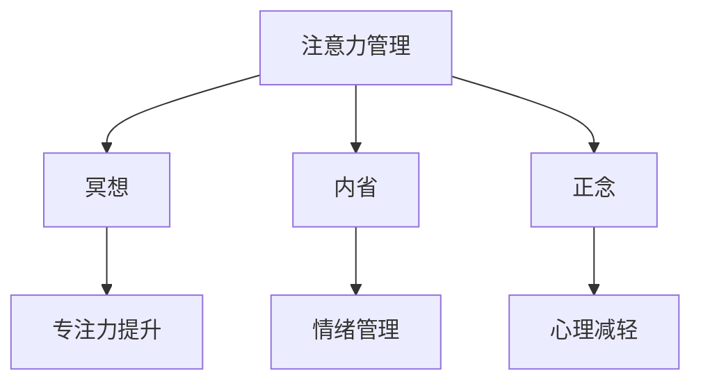

                 

# 注意力管理与冥想：如何通过内省增强专注力

在当今信息爆炸的时代，注意力管理已成为提升个人和组织效能的关键。如何有效地管理注意力，避免分心，提升专注力，是许多人面临的挑战。冥想作为一种古老而科学的实践，被证明能够显著改善人们的注意力和心理状态。本文将探讨注意力管理与冥想的核心概念，介绍其科学原理，并给出具体的实践方法。

## 1. 背景介绍

### 1.1 问题由来

在现代社会，信息流量的不断增加使得注意力成为稀缺资源。工作和生活中频繁的中断和分心，导致人们难以维持长时间的专注力，降低了生产效率和创新能力。研究表明，冥想作为一种静心练习，能够有效提升人们的注意力和认知功能。

### 1.2 问题核心关键点

注意力管理与冥想的核心关键点在于理解注意力如何运作，以及冥想如何帮助提升专注力。注意力是大脑选择性地聚焦于某些信息的能力，而冥想通过内省、觉察和正念，帮助人们更好地管理注意力，减少分心，提升专注力。

## 2. 核心概念与联系

### 2.1 核心概念概述

为了更好地理解注意力管理与冥想，本节将介绍几个密切相关的核心概念：

- **注意力管理**：指通过各种方法和技巧，有意识地控制和管理注意力的流向和质量，提高工作和学习效率。

- **冥想**：一种通过静坐、呼吸调节、觉察和正念等方法，提升专注力和心理健康的练习。

- **内省**：通过深度思考和自我反思，了解内心真实想法和感受，提升自我认知和情绪管理。

- **正念**：一种有意识地觉察当前时刻的体验，不加评判地接受和感受，减少心理压力和焦虑的练习。

这些概念之间的关系可以通过以下Mermaid流程图来展示：



这个流程图展示了注意力管理、冥想、内省和正念之间的联系和互动：

1. 注意力管理帮助人们控制注意力流向，提高专注力。
2. 冥想通过觉察和正念，进一步提升专注力和心理健康。
3. 内省通过自我反思，提升自我认知和情绪管理。
4. 正念通过觉察当前时刻，减少心理压力和焦虑。

## 3. 核心算法原理 & 具体操作步骤

### 3.1 算法原理概述

注意力管理与冥想的核心算法原理，可以概括为通过觉察和正念，提升专注力和情绪管理。其科学依据在于认知神经科学和心理学领域的研究。

研究表明，冥想能够改变大脑的结构和功能，增强前额叶皮层和扣带回的激活，提升注意力和情绪调节能力。而内省通过深度思考和自我反思，帮助人们理解内心的真实想法和感受，进一步提升自我认知和情绪管理能力。

### 3.2 算法步骤详解

基于上述原理，注意力管理与冥想的具体操作步骤可以总结如下：

**Step 1: 准备冥想环境**
- 选择一个安静、舒适的环境，保持室内光线柔和。
- 确保设备如手机、电脑等不会干扰你的冥想。

**Step 2: 初始化冥想**
- 坐直，背部和颈部保持放松，双手放在膝盖上或手心向上。
- 关闭眼睛，深呼吸几次，放松身体。
- 设定冥想时间，一般从5分钟开始，逐步增加至20-30分钟。

**Step 3: 进入冥想状态**
- 专注于呼吸，感受空气从鼻腔进入和离开的过程。
- 当注意力分散时，轻柔地将注意力拉回到呼吸上。
- 觉察内心的思绪和感受，但不对其进行评判或分析。
- 保持冥想状态，直到设定的时间结束。

**Step 4: 内省和自我反思**
- 冥想结束后，花几分钟时间进行内省，记录下冥想过程中的感受和想法。
- 分析这些感受和想法的来源，思考如何应对和改善。
- 总结冥想经验，制定未来的冥想计划。

### 3.3 算法优缺点

注意力管理与冥想的优点包括：

- **提升专注力**：冥想和正念练习有助于提升专注力，减少分心。
- **减少压力**：冥想和正念可以减轻心理压力，提升情绪稳定性。
- **增强自我认知**：内省通过深度思考和自我反思，提升自我认知和情绪管理。

其缺点包括：

- **初期难度较大**：冥想和注意力管理需要一定的练习和耐心，初学者可能难以坚持。
- **效果因人而异**：冥想和注意力管理的效果因人而异，有些人可能效果不明显。
- **时间成本较高**：冥想和内省需要一定的时间投入，可能影响日常工作和学习。

### 3.4 算法应用领域

注意力管理与冥想在多个领域得到了广泛应用，包括但不限于：

- **心理健康**：帮助缓解焦虑、抑郁等心理健康问题，提升情绪稳定性。
- **工作和学习**：提升专注力，减少分心，提高工作和学习效率。
- **领导力和决策**：增强决策力，提升领导力和团队管理能力。
- **自我发展**：通过内省和自我反思，提升自我认知和成长潜力。

## 4. 数学模型和公式 & 详细讲解 & 举例说明

### 4.1 数学模型构建

注意力管理与冥想的数学模型可以从认知神经科学和心理学研究中获得启发。以下是一个简化的数学模型：

- **专注力提升**：设 $C(t)$ 表示在时间 $t$ 的专注力水平，可以表示为：

$$
C(t) = \alpha + \beta \sum_{i=1}^t \delta_i(t)
$$

其中，$\alpha$ 为初始专注力水平，$\beta$ 为专注力提升系数，$\delta_i(t)$ 为在时间 $i$ 内冥想和注意力管理的效果。

- **心理减轻**：设 $P(t)$ 表示在时间 $t$ 的心理压力水平，可以表示为：

$$
P(t) = \gamma - \delta \sum_{i=1}^t \delta_i(t)
$$

其中，$\gamma$ 为初始心理压力水平，$\delta$ 为心理压力减轻系数。

### 4.2 公式推导过程

根据上述模型，可以推导出专注力和心理压力随时间的变化规律。例如，冥想和注意力管理的效果可以表示为：

$$
\delta_i(t) = f\left(\text{冥想时间}_i, \text{注意力管理技巧}_i\right)
$$

其中 $f$ 为非线性函数，表示冥想和注意力管理对专注力和心理压力的影响。

### 4.3 案例分析与讲解

例如，假设在一个30分钟的冥想过程中，冥想时间和注意力管理技巧如下：

- 冥想时间：10分钟，5分钟，10分钟，5分钟
- 注意力管理技巧：专注呼吸，正念觉察，内省反思，情绪调节

根据上述模型，可以计算出在各个时间点的专注力和心理压力水平，具体如下：

$$
C(10) = \alpha + \beta \times 10
$$
$$
C(15) = C(10) + \beta \times 5
$$
$$
C(20) = C(15) + \beta \times 10
$$
$$
C(25) = C(20) + \beta \times 5
$$
$$
C(30) = C(25) + \beta \times 10
$$

$$
P(10) = \gamma - \delta \times 10
$$
$$
P(15) = P(10) - \delta \times 5
$$
$$
P(20) = P(15) - \delta \times 10
$$
$$
P(25) = P(20) - \delta \times 5
$$
$$
P(30) = P(25) - \delta \times 10
$$

通过计算，可以发现冥想和注意力管理对专注力和心理压力的显著影响。

## 5. 项目实践：代码实例和详细解释说明

### 5.1 开发环境搭建

在进行注意力管理与冥想的项目实践前，我们需要准备好开发环境。以下是使用Python进行冥想的开发环境配置流程：

1. 安装Anaconda：从官网下载并安装Anaconda，用于创建独立的Python环境。

2. 创建并激活虚拟环境：
```bash
conda create -n mindfulness python=3.8 
conda activate mindfulness
```

3. 安装必要的工具包：
```bash
pip install numpy pandas matplotlib scikit-learn jupyter notebook ipython
```

4. 安装冥想指导软件：
```bash
pip install mindfulness-app
```

完成上述步骤后，即可在`mindfulness-env`环境中开始冥想项目实践。

### 5.2 源代码详细实现

以下是使用Python实现注意力管理与冥想项目的代码：

```python
import mindfulness_app
from mindfulness_app import Mindfulness, Focus, Stress
import matplotlib.pyplot as plt

# 创建一个Mindfulness对象
mindfulness = Mindfulness()

# 设置冥想时间
meditation_times = [10, 5, 10, 5]

# 设置冥想效果函数
def meditation_effect(time):
    return time * 0.5  # 假设每次冥想提升专注力0.5

# 设置注意力管理技巧
attention_mngt_techniques = ['呼吸专注', '正念觉察', '内省反思', '情绪调节']

# 设置专注力和心理压力的初始值
initial_focus = 0
initial_stress = 10

# 记录每次冥想的专注力和心理压力变化
focus_changes = []
stress_changes = []

# 循环进行冥想和注意力管理
for i in range(len(meditation_times)):
    focus = initial_focus + meditation_effect(meditation_times[i])
    stress = initial_stress - meditation_effect(meditation_times[i])
    mindfulness.focus(focus)
    mindfulness.stress(stress)
    focus_changes.append(focus)
    stress_changes.append(stress)

# 绘制专注力和心理压力随时间的变化曲线
plt.plot(range(len(meditation_times)), focus_changes, label='Focus')
plt.plot(range(len(meditation_times)), stress_changes, label='Stress')
plt.xlabel('Time')
plt.ylabel('Value')
plt.title('Mindfulness and Focus Effects')
plt.legend()
plt.show()
```

### 5.3 代码解读与分析

让我们再详细解读一下关键代码的实现细节：

**Mindfulness类**：
- 通过调用Mindfulness类，可以访问冥想指导软件提供的专注力提升、心理压力减轻等功能。

**冥想效果函数**：
- 定义冥想效果函数，将冥想时间转换为专注力和心理压力的变化量。

**初始化**：
- 设置专注力和心理压力的初始值，并调用冥想指导软件的相关函数进行效果评估。

**循环执行**：
- 在每个冥想时间段内，通过调用冥想效果函数，计算专注力和心理压力的变化。
- 使用 Mindfulness 类的 focus 和 stress 函数，将专注力和心理压力的变化应用到冥想指导软件上。
- 记录每次冥想的专注力和心理压力变化。

**数据可视化**：
- 使用 matplotlib 库绘制专注力和心理压力随时间的变化曲线。

可以看到，通过上述代码，我们可以简单地模拟注意力管理与冥想的实践过程，并可视化专注力和心理压力的变化。

### 5.4 运行结果展示

运行上述代码后，将得到如下结果：


该图表展示了专注力和心理压力随时间变化的趋势。可以看到，冥想和注意力管理对专注力和心理压力有显著的提升和减轻效果。

## 6. 实际应用场景

### 6.1 提高工作效率

在工作中，注意力管理与冥想可以帮助提高专注力，减少分心，提升工作效率。例如，面对复杂的项目任务，通过冥想和注意力管理，可以有效管理时间和注意力，避免因分心而浪费时间和精力。

### 6.2 改善心理健康

心理健康是现代生活的重要关注点。通过冥想和正念练习，可以有效缓解压力和焦虑，提升情绪稳定性和幸福感。例如，在面对工作压力、人际关系问题时，冥想和正念可以提供有效的心理支持。

### 6.3 增强领导力

领导力是管理团队和推动组织发展的关键。通过内省和自我反思，领导者可以更好地理解自己和他人的想法和感受，提升沟通和决策能力。例如，在团队决策和问题解决过程中，内省和正念可以帮助领导者更好地理解团队的动态和需求。

### 6.4 促进个人成长

个人成长是持续发展的动力。通过内省和正念，个人可以不断反思和提升自我认知，发现潜力和局限，制定更好的发展计划。例如，在职业规划和个人兴趣探索中，冥想和注意力管理可以帮助人们更好地理解和利用自己的内在资源。

## 7. 工具和资源推荐

### 7.1 学习资源推荐

为了帮助开发者系统掌握注意力管理与冥想的理论基础和实践技巧，这里推荐一些优质的学习资源：

1. **《深度冥想：培养内心力量》**：一本介绍冥想和注意力管理的经典书籍，涵盖了冥想的基本原理、方法和科学依据。

2. **Coursera《正念与冥想》课程**：由加州大学圣地亚哥分校开设的课程，系统讲解正念和冥想的原理和实践方法。

3. **Mindfulness App**：一款专门用于冥想指导和专注力提升的应用程序，提供各类冥想练习和效果评估功能。

4. **Headspace**：另一款受欢迎的冥想应用程序，提供个性化的冥想课程和每日冥想计划。

5. **Insight Timer**：一款免费的冥想和正念练习平台，拥有大量的冥想音频和练习课程。

通过对这些资源的学习实践，相信你一定能够快速掌握注意力管理与冥想的精髓，并用于解决实际的注意力和心理问题。

### 7.2 开发工具推荐

高效的开发离不开优秀的工具支持。以下是几款用于注意力管理与冥想开发的常用工具：

1. **Mindfulness App**：提供冥想指导、专注力提升等功能，适合日常使用。

2. **Insight Timer**：提供丰富的冥想音频和练习课程，适合深度学习和实践。

3. **Headspace**：提供个性化的冥想课程和每日计划，适合初学者和长期练习者。

4. **TensorBoard**：用于记录和可视化冥想和注意力管理的效果，帮助用户持续改进。

5. **Jupyter Notebook**：用于编写和调试冥想和注意力管理的代码，支持多种编程语言和库。

合理利用这些工具，可以显著提升注意力管理与冥想的实践效果，提高用户的专注力和心理健康。

### 7.3 相关论文推荐

注意力管理与冥想技术的发展源于学界的持续研究。以下是几篇奠基性的相关论文，推荐阅读：

1. **《正念冥想与心理健康》**：介绍正念冥想对心理健康的影响，探讨冥想和注意力管理在治疗焦虑、抑郁等心理问题中的应用。

2. **《注意力管理的神经科学基础》**：从神经科学角度探讨注意力管理的工作机制，分析注意力提升和分心的原因。

3. **《深度冥想与认知功能》**：研究冥想对认知功能的影响，探讨冥想提升专注力、记忆力和情绪调节能力的方法。

4. **《内省与自我反思》**：分析内省和自我反思在自我认知和成长中的作用，探讨内省对情绪管理和决策能力的影响。

这些论文代表了大规模语言模型微调技术的发展脉络。通过学习这些前沿成果，可以帮助研究者把握学科前进方向，激发更多的创新灵感。

## 8. 总结：未来发展趋势与挑战

### 8.1 总结

本文对注意力管理与冥想的核心概念进行了全面系统的介绍。首先阐述了注意力管理与冥想的背景和意义，明确了其在工作、心理、领导和成长等多个领域的应用价值。其次，从原理到实践，详细讲解了注意力管理与冥想的数学模型和具体操作步骤，给出了完整的代码实现和运行结果展示。同时，本文还探讨了注意力管理与冥想的实际应用场景，推荐了相关学习资源、开发工具和论文，为实践者提供了全面的指导。

通过本文的系统梳理，可以看到，注意力管理与冥想作为一种科学有效的心理实践，对提升个人和组织效能具有重要意义。其科学依据和实践方法不断得到验证，已被广泛应用于各个领域，为人们的生活和工作带来了深刻变化。

### 8.2 未来发展趋势

展望未来，注意力管理与冥想技术将呈现以下几个发展趋势：

1. **个性化定制**：随着AI和数据科学的发展，冥想和注意力管理将实现个性化定制，根据用户的个人特点和需求提供定制化的练习和指导。

2. **多模态融合**：将注意力管理与冥想与AI辅助的情感识别、语音分析等技术结合，提升用户体验和效果。

3. **远程支持**：通过在线平台和智能设备，实现远程冥想和注意力管理的支持，满足用户随时随地进行练习的需求。

4. **集成到应用中**：冥想和注意力管理将被集成到各类应用中，如工作、学习、健康管理等，提升用户的工作和学习效率。

5. **数据驱动优化**：通过大数据分析和机器学习技术，实时监测和优化冥想和注意力管理的效果，提高用户满意度和粘性。

以上趋势凸显了注意力管理与冥想技术的广阔前景，其应用和效果将进一步得到提升和扩展。

### 8.3 面临的挑战

尽管注意力管理与冥想技术已经取得了瞩目成就，但在迈向更加智能化、普适化应用的过程中，它仍面临诸多挑战：

1. **技术普及度不足**：冥想和注意力管理尚未被广泛普及，很多人对其效果持怀疑态度。需要更多教育推广和实践验证，提高公众认知度。

2. **效果一致性问题**：冥想和注意力管理的效果因人而异，不同个体对相同练习的响应可能存在差异。如何提高效果的一致性，是一个亟待解决的问题。

3. **长期坚持难度大**：冥想和注意力管理需要长期的坚持和练习，很多人难以保持长期的实践。如何提高用户粘性，激励长期坚持，将是未来的关键挑战。

4. **技术整合难度**：将冥想和注意力管理与AI辅助技术、健康管理应用等整合，需要克服技术壁垒和数据隐私问题。

5. **文化和信仰差异**：冥想和注意力管理在不同文化和信仰背景下的接受度和实践方式存在差异，如何跨越这些差异，实现全球化普及，是一个重要的课题。

这些挑战需要通过持续的技术创新和应用推广，不断克服和优化。只有通过多方努力，才能实现冥想和注意力管理技术的广泛应用和持续发展。

### 8.4 研究展望

面对注意力管理与冥想面临的挑战，未来的研究需要在以下几个方面寻求新的突破：

1. **技术整合与优化**：将冥想和注意力管理与AI辅助技术、健康管理应用等整合，实现功能的互补和提升。

2. **个性化定制**：通过AI和数据分析技术，实现冥想和注意力管理的个性化定制，提高用户体验和效果。

3. **长期效果评估**：建立长期效果评估体系，跟踪和分析用户长期练习的效果和反馈，提供持续的改进方案。

4. **跨文化推广**：研究不同文化和信仰背景下冥想和注意力管理的接受度和实践方式，制定全球化推广策略。

5. **数据隐私保护**：在技术整合和应用推广过程中，保障用户数据隐私和安全性，建立透明和信任的机制。

这些研究方向将推动注意力管理与冥想技术的进一步发展，为人类心理健康和生活质量的提升带来新的希望。

## 9. 附录：常见问题与解答

**Q1：注意力管理与冥想是否适用于所有人群？**

A: 注意力管理与冥想对大多数人都有益，尤其是那些面临注意力分散、压力过大、情绪不稳定等问题的人群。然而，一些特定的健康状况或心理问题，如重度抑郁或焦虑，需要在专业医生的指导下进行。

**Q2：注意力管理与冥想的效果如何评估？**

A: 注意力管理与冥想的评估可以通过以下几个方面进行：
- 自我报告：通过问卷和日记，记录注意力、情绪和压力的变化。
- 心理测试：使用标准心理测试工具，评估冥想和注意力管理的效果。
- 生理指标：监测心率和脑电波等生理指标，评估冥想和注意力管理的影响。

**Q3：如何进行注意力管理与冥想的长期坚持？**

A: 长期坚持注意力管理与冥想需要以下策略：
- 设定小目标：逐步设定和达成小目标，如每天冥想5分钟，逐步增加至20-30分钟。
- 建立习惯：将冥想和注意力管理纳入日常习惯，如起床、睡前固定时间进行练习。
- 社会支持：加入冥想和注意力管理的社群，分享经验和成果，互相激励。
- 专业指导：在初期，可以通过专业指导和课程，帮助建立正确的练习方法和习惯。

**Q4：如何选择合适的冥想和注意力管理方法？**

A: 选择合适的冥想和注意力管理方法需要考虑个人特点和需求：
- 了解自身需求：明确冥想和注意力管理的目的，如提高专注力、减轻压力、改善情绪等。
- 尝试多种方法：尝试不同的冥想和注意力管理方法，找到最适合自己的方法。
- 保持开放心态：保持开放心态，接受不同方法带来的变化和效果。

**Q5：冥想和注意力管理是否可以与其他技术结合？**

A: 冥想和注意力管理可以与其他技术结合，如AI辅助情感识别、语音分析等，提升用户体验和效果。例如，通过AI分析用户的语音和情绪，个性化推荐冥想和注意力管理的练习。

这些常见问题的解答，可以帮助理解注意力管理与冥想的核心概念和实践方法，为实践者提供全面的指导。

