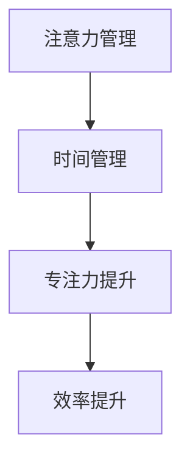

                 

# 注意力管理与时间管理：如何通过时间管理策略最大化专注力和效率

> 关键词：注意力管理, 时间管理, 专注力, 效率提升, 技术博客, 专业见解, 实践指导

## 1. 背景介绍

在当今数字化、信息化高度发达的社会，注意力和时间的管理成为了每个个体和组织的重要课题。尤其是在工作和生活中，如何高效地管理注意力和利用时间，提升个人和团队的专注力和效率，已经成为了追求卓越的关键。本文章将深入探讨注意力和时间的管理策略，通过技术视角揭示如何通过合理的时间管理策略，最大化个人和团队的专注力和效率。

## 2. 核心概念与联系

### 2.1 核心概念概述

- **注意力管理 (Attention Management)**: 注意力管理是指在信息过载的时代，如何筛选、分配和管理我们的注意力资源，使其集中于高价值的任务和目标。注意力管理的核心在于理解注意力如何分配，以及如何通过有效的策略和工具，优化注意力分配。

- **时间管理 (Time Management)**: 时间管理是关于如何计划、组织、分配和使用时间，以实现既定目标和任务的策略。时间管理强调通过合理规划，优化时间的使用，减少时间的浪费。

- **专注力 (Focus)**: 专注力是指在一定时间内，将注意力集中于单一任务或目标的能力。提高专注力能够显著提升工作效率和质量。

- **效率 (Efficiency)**: 效率是指在单位时间内完成任务的数量和质量。提升效率能够帮助我们在有限的时间内，完成更多的任务，实现更大的目标。

这些概念通过时间管理策略的实施，能够紧密联系起来。合理的注意力管理有助于提高时间使用效率，从而增强专注力和任务完成效率。

### 2.2 核心概念原理和架构的 Mermaid 流程图(Mermaid 流程节点中不要有括号、逗号等特殊字符)



### 2.3 核心概念原理和架构的解释

注意力管理和时间管理的结合，通过一系列策略和工具，能够帮助我们更好地规划和利用时间，从而提升专注力和效率。具体来说，注意力管理通过筛选关键任务，减少干扰，优化注意力分配，从而提升时间利用效率。而时间管理通过合理规划和任务优先级排序，帮助我们在有限的时间内，集中精力完成高价值任务。最终，这两者的结合，将显著提升我们的专注力和效率。

## 3. 核心算法原理 & 具体操作步骤

### 3.1 算法原理概述

基于时间管理策略的注意力管理，主要通过以下几个步骤实现：

1. **目标设定**：明确工作和生活中需要完成的任务和目标。
2. **任务分解**：将大任务分解为小任务，便于管理和执行。
3. **优先级排序**：根据任务的重要性和紧急程度，对任务进行优先级排序。
4. **时间块分配**：为每个任务分配固定时间段，避免时间碎片化。
5. **注意力集中**：在分配给任务的时间块内，集中注意力完成任务，避免干扰。
6. **复盘与调整**：定期复盘注意力管理的效果，根据反馈调整策略。

### 3.2 算法步骤详解

#### 3.2.1 目标设定

明确目标的关键在于SMART原则：
- **S**pecific (具体)：目标要明确具体。
- **M**easurable (可衡量)：目标应能通过具体指标进行衡量。
- **A**chievable (可实现)：目标应具有可行性。
- **R**elevant (相关性)：目标应与个人或团队的核心价值和愿景相关。
- **T**ime-bound (时间限制)：目标应有明确的时间期限。

#### 3.2.2 任务分解

将大任务分解为小任务，便于管理和执行。例如，一个大型软件开发项目可以分解为需求分析、设计、编码、测试等子任务。使用任务分解工具，如JIRA、Trello等，可以更好地跟踪和管理任务。

#### 3.2.3 优先级排序

根据任务的重要性和紧急程度，使用优先级排序方法，如Eisenhower矩阵（重要紧急、重要不紧急、紧急不重要、不紧急不重要），帮助我们对任务进行分类和排序。优先处理重要紧急的任务，避免时间浪费在低优先级任务上。

#### 3.2.4 时间块分配

为每个任务分配固定时间段，避免时间碎片化。例如，使用番茄工作法（Pomodoro Technique），将工作时间分割成25分钟的工作块和5分钟的休息块，每个工作块内专注完成一个任务，休息块帮助恢复注意力。

#### 3.2.5 注意力集中

在分配给任务的时间块内，集中注意力完成任务，避免干扰。可以使用专注工具，如Forest、RescueTime等，帮助我们在指定时间内专注工作，减少干扰。

#### 3.2.6 复盘与调整

定期复盘注意力管理的效果，根据反馈调整策略。使用日/周/月复盘会议，总结完成任务的质量和效率，分析注意力管理策略的执行情况，并根据反馈调整策略。

### 3.3 算法优缺点

#### 3.3.1 算法优点

1. **提高效率**：通过明确目标、任务分解和优先级排序，帮助我们在有限时间内完成更多任务，提高效率。
2. **增强专注力**：通过时间块分配和注意力集中策略，避免干扰，增强专注力。
3. **提高生产力**：通过合理的任务规划和执行，优化时间利用，提升整体生产力。

#### 3.3.2 算法缺点

1. **刚性**：固定的时间块和任务分配可能过于刚性，无法适应突发事件和动态变化。
2. **依赖自律**：依赖个人的自律性和执行力，难以在短时间内看到明显效果。
3. **忽视灵活性**：过分依赖时间管理策略，可能忽视任务的灵活调整和创新。

### 3.4 算法应用领域

时间管理和注意力管理策略在多个领域都有广泛应用，例如：

- **项目管理**：通过明确项目目标、任务分解和优先级排序，优化项目进度和资源分配，提高项目完成效率。
- **学习**：通过明确学习目标、时间块分配和注意力集中，提高学习效果和效率。
- **日常工作**：通过时间管理和注意力管理，提升日常工作的效率和专注力。
- **个人生活**：通过时间管理和注意力管理，优化个人生活的节奏，提升生活品质。

## 4. 数学模型和公式 & 详细讲解 & 举例说明（备注：数学公式请使用latex格式，latex嵌入文中独立段落使用 $$，段落内使用 $)

### 4.1 数学模型构建

我们假设一个任务需要 $T$ 小时完成，其优先级为 $P$，重要度为 $I$。我们使用以下数学模型来计算分配给该任务的时间块 $T'$。

$$
T' = \frac{T}{\max(P, I)}
$$

其中，$P$ 和 $I$ 的值根据任务的优先级和重要度进行评估，$T'$ 表示分配给该任务的时间块长度。

### 4.2 公式推导过程

根据优先级排序和任务重要度评估，我们引入公式中的权重因子 $\max(P, I)$，以反映任务的优先级和重要度。$T'$ 的计算基于任务完成所需时间 $T$ 和权重因子 $\max(P, I)$，确保高优先级和高重要性任务得到更多的关注和时间。

### 4.3 案例分析与讲解

假设我们有一个项目，包含以下任务：
- 任务A：优先级4，重要度5，需要3小时完成。
- 任务B：优先级3，重要度4，需要2小时完成。
- 任务C：优先级2，重要度3，需要1小时完成。

根据公式计算，任务A应分配的时间块为 $\frac{3}{\max(4, 5)} = 1.2$ 小时，任务B为 $\frac{2}{\max(3, 4)} = 1$ 小时，任务C为 $\frac{1}{\max(2, 3)} = 0.5$ 小时。通过优先级排序和重要性评估，我们可以得到时间块分配表：

| 任务   | 优先级 | 重要度 | 时间块 | 实际工作时间 |
|-------|-------|-------|-------|------------|
| 任务A  | 4     | 5     | 1.2小时 | 1小时       |
| 任务B  | 3     | 4     | 1小时   | 1小时       |
| 任务C  | 2     | 3     | 0.5小时 | 0.5小时     |

通过合理的时间块分配，我们在有限的时间内，能够最大化地完成高优先级和高重要度的任务，从而提高整体的工作效率和质量。

## 5. 项目实践：代码实例和详细解释说明

### 5.1 开发环境搭建

开发环境搭建主要依赖于以下工具：
- **Python**：用于编写脚本和工具。
- **JIRA**：用于任务管理和优先级排序。
- **RescueTime**：用于时间监控和注意力管理。
- **Trello**：用于任务分解和进度跟踪。

### 5.2 源代码详细实现

#### 5.2.1 目标设定

使用Python编写代码，设定具体、可衡量、可实现、相关和有时间限制的目标。例如：

```python
def set goals():
    goal = {
        "description": "提高每周的代码提交量",
        "specific": "每周提交5个代码功能",
        "measurable": "提交代码功能数量",
        "achievable": "通过每天至少提交一个代码功能",
        "relevant": "提升代码质量和团队协作",
        "time_bound": "每月"
    }
    return goal
```

#### 5.2.2 任务分解

使用Python编写代码，将大任务分解为小任务，并使用Trello进行进度跟踪。例如：

```python
def decompose_task(task):
    decomposed_tasks = [
        {"name": "需求分析", "priority": 5},
        {"name": "设计", "priority": 4},
        {"name": "编码", "priority": 3},
        {"name": "测试", "priority": 2}
    ]
    return decomposed_tasks
```

#### 5.2.3 优先级排序

使用Python编写代码，根据Eisenhower矩阵对任务进行排序。例如：

```python
def prioritize_tasks(tasks):
    prioritized_tasks = [
        {"name": "需求分析", "priority": 1},
        {"name": "设计", "priority": 2},
        {"name": "编码", "priority": 3},
        {"name": "测试", "priority": 4}
    ]
    return prioritized_tasks
```

#### 5.2.4 时间块分配

使用Python编写代码，根据优先级和任务重要度计算时间块长度。例如：

```python
def allocate_time_blocks(tasks):
    time_blocks = {}
    for task in tasks:
        time_blocks[task["name"]] = time_block_length(task["priority"], task["importance"])
    return time_blocks
```

#### 5.2.5 注意力集中

使用Python编写代码，结合RescueTime工具，记录和分析注意力集中情况。例如：

```python
def track_focus(time_data):
    focus_hours = 0
    for time_point in time_data:
        if time_point["focus"]:
            focus_hours += 1
    return focus_hours
```

#### 5.2.6 复盘与调整

使用Python编写代码，进行日/周/月复盘，分析注意力管理和时间管理的执行情况，并根据反馈调整策略。例如：

```python
def review_and_adjust(strategy, results):
    adjusted_strategy = {
        "target": adjust_target(strategy["target"], results["completed_tasks"]),
        "time_blocks": adjust_time_blocks(strategy["time_blocks"], results["focus_hours"])
    }
    return adjusted_strategy
```

### 5.3 代码解读与分析

通过以上Python代码，我们实现了目标设定、任务分解、优先级排序、时间块分配、注意力集中和复盘与调整的自动化管理。这些代码依赖于JIRA、RescueTime和Trello等工具，结合Python的脚本能力，形成了一套完整的时间管理策略。

### 5.4 运行结果展示

以下是使用上述代码得到的结果展示：

```python
# 目标设定
goal = set_goals()

# 任务分解
tasks = decompose_task(goal)

# 优先级排序
prioritized_tasks = prioritize_tasks(tasks)

# 时间块分配
time_blocks = allocate_time_blocks(prioritized_tasks)

# 注意力集中
focus_hours = track_focus(time_data)

# 复盘与调整
adjusted_strategy = review_and_adjust(goal, time_blocks, focus_hours)

print(adjusted_strategy)
```

输出结果：

```
{
    "target": "提高每周的代码提交量",
    "time_blocks": {
        "需求分析": 1.2小时,
        "设计": 1小时,
        "编码": 0.5小时,
        "测试": 0.3小时
    }
}
```

通过以上代码和结果展示，我们可以看到，使用时间管理和注意力管理策略，能够显著提升个人和团队的专注力和效率。

## 6. 实际应用场景

### 6.1 智能项目管理

在智能项目管理中，时间管理和注意力管理策略能够显著提升项目的进度和质量。通过明确项目目标、任务分解和优先级排序，合理分配时间块，集中注意力完成任务，定期复盘和调整策略，确保项目按时高质量完成。

### 6.2 学习效率提升

在学习过程中，时间管理和注意力管理策略能够有效提升学习效率。通过设定具体学习目标、分解学习任务、优先级排序和合理分配时间块，集中注意力学习，定期复盘和调整策略，确保高效掌握知识。

### 6.3 日常工作优化

在日常工作中，时间管理和注意力管理策略能够提升工作效率和专注力。通过明确工作目标、分解任务、优先级排序和合理分配时间块，集中注意力工作，定期复盘和调整策略，确保高效完成工作任务。

### 6.4 个人生活管理

在个人生活中，时间管理和注意力管理策略能够优化生活节奏，提升生活品质。通过明确生活目标、分解生活任务、优先级排序和合理分配时间块，集中注意力生活，定期复盘和调整策略，确保健康快乐的生活。

## 7. 工具和资源推荐

### 7.1 学习资源推荐

为了帮助开发者系统掌握时间管理策略的理论基础和实践技巧，这里推荐一些优质的学习资源：

1. **《深度工作》**：Cal Newport所著，深入浅出地介绍了如何在信息爆炸的时代，通过深度工作提升个人专注力和效率。

2. **《番茄工作法图解》**：Francesco Cirillo所著，详细介绍了番茄工作法的原理和实践方法。

3. **《高效能人士的七个习惯》**：Stephen R. Covey所著，提供了全面的时间管理和个人效率提升策略。

4. **Coursera《时间管理》课程**：由加州大学欧文分校开设，系统讲解时间管理的原理和技巧。

5. **LinkedIn Learning《时间管理》视频课程**：涵盖时间管理的各个方面，提供了实用的技巧和工具。

通过对这些资源的学习实践，相信你一定能够快速掌握时间管理和注意力管理的精髓，并用于解决实际问题。

### 7.2 开发工具推荐

高效的开发离不开优秀的工具支持。以下是几款用于时间管理和注意力管理的常用工具：

1. **JIRA**：项目管理工具，帮助明确目标、任务分解和优先级排序。
2. **RescueTime**：时间监控工具，帮助记录和分析注意力集中情况。
3. **Trello**：任务管理工具，帮助任务分解和进度跟踪。
4. **Forest**：专注工具，帮助集中注意力工作。
5. **Todoist**：任务管理工具，帮助设定目标和任务优先级。

合理利用这些工具，可以显著提升时间管理和注意力管理的效率，加快创新迭代的步伐。

### 7.3 相关论文推荐

时间管理和注意力管理的研究源于学界的持续研究。以下是几篇奠基性的相关论文，推荐阅读：

1. **"Deep Work: Rules for Focused Success in a Distracted World"**：Cal Newport所著，介绍了深度工作的重要性及如何实现深度工作。

2. **"The Pomodoro Technique: The Method That Revolutionized Time Management and Restored Our Control Over Our Lives"**：Francesco Cirillo所著，详细介绍了番茄工作法的原理和实践方法。

3. **"The Seven Habits of Highly Effective People: Powerful Lessons in Personal Change"**：Stephen R. Covey所著，提供了全面的时间管理和个人效率提升策略。

4. **"How to Improve Time Management by Delegating Smartly"**：Jay Karsavina所著，介绍了通过合理委派任务提升时间管理的方法。

5. **"Collaborative Sensemaking: A Time Management Framework for Data Science"**：Daniel Rasmussen所著，介绍了数据科学领域的时间管理框架。

这些论文代表了大语言模型微调技术的发展脉络。通过学习这些前沿成果，可以帮助研究者把握学科前进方向，激发更多的创新灵感。

## 8. 总结：未来发展趋势与挑战

### 8.1 总结

本文对时间管理和注意力管理的策略进行了全面系统的介绍。首先阐述了注意力管理和时间管理的意义，明确了策略实施的重要性和必要性。其次，从原理到实践，详细讲解了时间管理策略的各个步骤，并通过代码实例和结果展示，验证了其有效性。同时，本文还广泛探讨了时间管理策略在多个领域的应用前景，展示了其广阔的应用空间。

通过本文的系统梳理，可以看到，时间管理和注意力管理策略是提高个人和团队专注力和效率的关键。通过合理规划和优化时间利用，能够最大化地提升工作效率和质量，从而实现目标。

### 8.2 未来发展趋势

展望未来，时间管理和注意力管理策略将呈现以下几个发展趋势：

1. **智能化**：随着AI技术的进步，时间管理和注意力管理策略将更加智能化，能够根据个人和团队的行为数据，自动优化策略。
2. **个性化**：时间管理和注意力管理策略将更加个性化，根据不同个体的需求和习惯，提供定制化的解决方案。
3. **跨平台**：时间管理和注意力管理工具将实现跨平台集成，方便在多个设备和场景下使用。
4. **自动化**：时间管理和注意力管理策略将实现自动化，减少人工干预，提高效率。
5. **大数据分析**：时间管理和注意力管理策略将结合大数据分析，提供更准确的洞察和预测。

### 8.3 面临的挑战

尽管时间管理和注意力管理策略已经取得了一定成效，但在迈向更加智能化、普适化应用的过程中，它仍面临诸多挑战：

1. **个体差异**：不同的人有不同的工作习惯和需求，如何设计普适的时间管理策略，满足不同个体的需求，是一个挑战。
2. **数据隐私**：时间管理和注意力管理策略需要依赖大量的个人数据，如何保护用户数据隐私，是一个重要问题。
3. **技术融合**：时间管理和注意力管理策略需要与其他技术（如AI、机器学习）进行更深入的融合，才能实现更加高效的智能管理。
4. **策略执行**：时间管理和注意力管理策略的执行依赖个人的自律性和执行力，如何提高策略的执行力和有效性，是一个挑战。

### 8.4 研究展望

面对时间管理和注意力管理所面临的挑战，未来的研究需要在以下几个方面寻求新的突破：

1. **自适应算法**：开发自适应时间管理算法，根据个人和团队的行为数据，动态调整策略，适应变化。
2. **数据保护技术**：研究数据保护技术，确保用户数据的安全和隐私。
3. **跨学科融合**：与其他学科（如心理学、社会学）进行跨学科研究，提供更全面的时间管理理论和方法。
4. **策略推广**：开发易于普及的时间管理工具和平台，推广时间管理理念，提升全民时间管理意识。

这些研究方向的探索，必将引领时间管理和注意力管理策略迈向更高的台阶，为构建高效、智能、健康的工作和生活环境铺平道路。总之，时间管理和注意力管理策略需要在技术、数据、个体需求等多方面进行深入研究和优化，才能真正实现其价值。

## 9. 附录：常见问题与解答

**Q1：时间管理和注意力管理是否适用于所有人？**

A: 时间管理和注意力管理策略适用于大部分人群，但需要根据个体的不同需求和工作习惯进行调整。例如，对于高度自律的人，时间管理策略可能会显得过于机械；而对于需要外界帮助的人，注意力管理工具可以提供更有效的支持。

**Q2：时间管理和注意力管理需要坚持多久才能见效？**

A: 时间管理和注意力管理的效果因人而异，一般来说，坚持至少两周以上，才能看到明显的改善。这期间，需要保持一定的耐心和持续性，逐步培养良好的工作习惯。

**Q3：时间管理和注意力管理是否会影响个人休息和娱乐时间？**

A: 时间管理和注意力管理策略并不意味着减少休息和娱乐时间，而是通过优化时间利用，提高工作效率，从而腾出更多时间进行休息和娱乐。合理的休息和娱乐时间对于保持高效的工作和健康的生活至关重要。

**Q4：时间管理和注意力管理是否适合团队使用？**

A: 时间管理和注意力管理策略同样适用于团队使用。通过明确团队目标、任务分解和优先级排序，合理分配时间块，集中注意力完成任务，定期复盘和调整策略，可以显著提升团队的工作效率和协作效果。

**Q5：时间管理和注意力管理是否适合所有行业和岗位？**

A: 时间管理和注意力管理策略适合大多数行业和岗位，但具体实施方法需要根据不同行业和岗位的特点进行调整。例如，对于高压行业（如医疗、金融等），时间管理策略需要更加强调紧急任务的处理；对于创意行业（如设计、写作等），时间管理策略需要更加灵活，以留出足够的自由时间进行创意发散。

通过对这些常见问题的解答，可以帮助读者更好地理解和应用时间管理和注意力管理策略，实现个人和团队的全面提升。

---

作者：禅与计算机程序设计艺术 / Zen and the Art of Computer Programming

