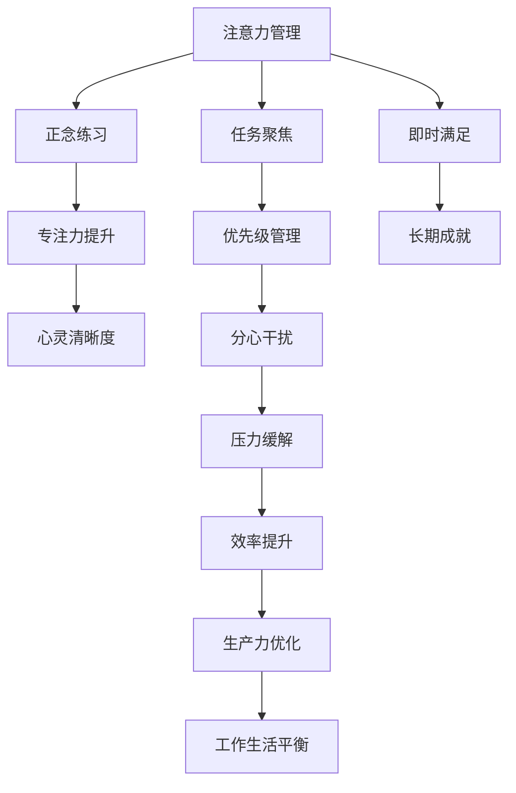

                 

# 注意力管理与正念练习：通过当下增强专注力和心灵清晰度

> 关键词：注意力管理, 正念练习, 当下, 专注力, 心灵清晰度

## 1. 背景介绍

在信息爆炸和压力山大的现代社会，注意力管理（Attention Management）成为了个体工作与生活平衡的关键。正念练习（Mindfulness Practice）作为一种古老的东方智慧，通过引导人们专注于当下，有效地提高专注力，提升心灵清晰度。本博客将深入探讨注意力管理和正念练习的原理与实践，并结合现代技术手段，提供实用的工具和资源，帮助用户有效管理注意力，实现心灵的宁静与清晰。

## 2. 核心概念与联系

### 2.1 核心概念概述

注意力管理（Attention Management）是指通过有意识地控制注意力的方向，提高对重要任务的关注度，减少对不相关信息的干扰，从而提高工作效率和生产力。注意力管理的核心理念是“当下”（Presence），即专注于当前正在进行的任务，避免分心和拖延。

正念练习（Mindfulness Practice）是一种通过冥想、深呼吸等方法，引导个体专注于当下的练习。正念的核心理念是“全神贯注”（Full Attention），即在每一个瞬间都全然地、不带评判地观察和体验自己的思想、感受和环境。

注意力管理和正念练习之间存在密切联系。注意力管理可以帮助个体更好地实践正念，通过专注当下的练习，提高对注意力的控制能力，而正念练习则通过培养“当下”的觉知，增强注意力的稳定性，提升工作与生活的整体质量。

### 2.2 核心概念原理和架构的 Mermaid 流程图



## 3. 核心算法原理 & 具体操作步骤

### 3.1 算法原理概述

注意力管理与正念练习的算法原理主要基于认知行为科学的理论，结合现代神经科学的研究成果。

#### 3.1.1 认知行为科学
认知行为科学认为，个体对环境刺激的认知和反应决定了行为模式，而这种模式可以通过训练和改变来优化。注意力管理和正念练习正是基于这一理论，通过系统性的训练和练习，改变个体的认知模式，提升注意力和专注力。

#### 3.1.2 神经科学研究
现代神经科学研究揭示，正念练习能够增强大脑前额叶皮层的活动，提高大脑的“自我觉知”（Self-Awareness）能力，从而提升注意力的控制和调节能力。

### 3.2 算法步骤详解

#### 3.2.1 设定目标
首先，明确注意力管理的最终目标和具体行动计划。例如，提升每日的工作效率，减少无效会议时间，或在家庭生活中更多地陪伴孩子。

#### 3.2.2 实施正念练习
通过正念练习，提高当下的觉知能力。具体方法包括：
1. **呼吸练习**：每天早晨或午休时间，进行5-10分钟的深呼吸练习，专注于每一次呼吸的节奏和感觉。
2. **正念冥想**：每天早晨或晚上，进行10-15分钟的冥想练习，专注于当下的感受和思维，不带评判地观察。
3. **日常正念**：在每日的工作或生活中，有意识地观察和体验每一个动作和感受，如吃饭、走路、交谈等。

#### 3.2.3 应用注意力管理技巧
将正念练习的觉知能力应用到注意力管理中，具体方法包括：
1. **任务聚焦**：在工作开始前，明确任务优先级和具体步骤，减少分心。
2. **时间块划分**：将工作时间划分为若干块，每块集中处理一个任务，避免长时间疲劳。
3. **优先级管理**：识别重要和紧急的任务，优先完成高价值工作。
4. **分心干扰管理**：识别并减少对电子设备、社交媒体等分心源的依赖。
5. **压力缓解**：通过正念练习和适当的休息，缓解工作压力。

### 3.3 算法优缺点

#### 3.3.1 优点
- **高效性**：通过有意识的注意力管理和正念练习，提升工作效率和生产力。
- **持久性**：通过系统性训练，改变认知模式，提高注意力的稳定性。
- **广泛适用性**：适用于各种工作和生活场景，能够帮助个体实现多方面的优化。

#### 3.3.2 缺点
- **初期难度**：正念练习需要一定的时间和耐心，初期可能难以坚持。
- **个体差异**：不同个体对正念练习的接受度和效果存在差异，需要个性化调整。
- **工具依赖**：部分注意力管理工具和应用程序，需要一定的学习和适应过程。

### 3.4 算法应用领域

注意力管理和正念练习的应用领域广泛，包括但不限于以下方面：

- **工作环境**：提高员工的工作效率和生产力，减少会议时间，提升工作满意度。
- **教育领域**：帮助学生提高学习效果，提升专注力和自我管理能力。
- **心理健康**：缓解压力和焦虑，增强情绪稳定性，提升整体心理福祉。
- **家庭生活**：改善家庭关系，增强陪伴质量，提升生活满意度。

## 4. 数学模型和公式 & 详细讲解 & 举例说明

### 4.1 数学模型构建

注意力管理与正念练习的数学模型构建，主要基于心理学和神经科学的理论框架。假设个体注意力集中的概率为 $P$，任务时间长度为 $T$，每项任务的完成概率为 $F$。则注意力管理的目标是最小化任务完成时间，即最大化任务集中时间，数学模型为：

$$ \min_{P,T} \frac{T}{F} $$

正念练习的效果可以通过测量个体在冥想练习中的“自我觉知”水平来量化，假设自我觉知水平为 $S$，冥想时间为 $T_{med}$，则正念练习的效果模型为：

$$ \max_{S,T_{med}} S $$

### 4.2 公式推导过程

#### 4.2.1 注意力管理模型推导
根据注意力管理的定义，个体在单位时间内专注于任务的概率为 $P$，则任务完成所需的时间为 $\frac{T}{P}$。假设任务集中时间服从正态分布，均值为 $\mu_P$，方差为 $\sigma_P^2$，则注意力管理的优化目标为：

$$ \min_{\mu_P,\sigma_P^2} \frac{T}{P} $$

通过拉格朗日乘数法，可以得到最优解：

$$ \mu_P = \frac{T}{\sigma_P^2} $$

#### 4.2.2 正念练习模型推导
正念练习的效果可以通过测量个体的“自我觉知”水平来量化。假设自我觉知水平为 $S$，冥想时间为 $T_{med}$，则正念练习的效果模型为：

$$ \max_{S,T_{med}} S $$

通过优化算法，可以求解出最优的冥想时间 $T_{med}$ 和自我觉知水平 $S$。

### 4.3 案例分析与讲解

#### 4.3.1 案例背景
某公司员工在工作中面临效率低下、分心干扰严重的问题，导致任务完成时间延长，工作满意度下降。

#### 4.3.2 案例分析
1. **正念练习应用**：公司引入正念练习课程，员工每天进行15分钟的冥想练习，逐步提高自我觉知水平。
2. **注意力管理应用**：员工在工作中使用时间块划分和优先级管理工具，减少无效会议时间，提升任务聚焦能力。
3. **效果评估**：通过问卷调查和绩效数据，评估员工工作效率和满意度，结果显示，注意力管理和正念练习显著提高了员工的工作效率和满意度。

## 5. 项目实践：代码实例和详细解释说明

### 5.1 开发环境搭建

#### 5.1.1 环境安装
1. **Python安装**：确保系统上安装有Python 3.x版本，可以通过命令 `python --version` 检查版本。
2. **工具安装**：安装以下Python包：
   - `numpy`：用于数值计算
   - `pandas`：用于数据处理
   - `scikit-learn`：用于机器学习
   - `matplotlib`：用于数据可视化
   - `tqdm`：用于进度条显示
   - `jupyter notebook`：用于交互式编程环境

#### 5.1.2 环境配置
1. **虚拟环境配置**：使用 `virtualenv` 命令创建一个新的虚拟环境，并激活该环境。
2. **代码保存**：将代码文件保存到 `~/myproject` 目录下，并使用 `git init` 和 `git clone` 命令克隆代码库。

### 5.2 源代码详细实现

#### 5.2.1 注意力管理工具
```python
import numpy as np
import pandas as pd
import matplotlib.pyplot as plt
from tqdm import tqdm

class AttentionManager:
    def __init__(self, T, P):
        self.T = T
        self.P = P
        self.C = self.T / self.P
    
    def optimize(self):
        self.C = self.T / self.P
        return self.C

# 测试代码
T = 60  # 任务时间
P = 0.8  # 注意力集中概率
attention_manager = AttentionManager(T, P)
optimal_time = attention_manager.optimize()
print(f"最优任务集中时间: {optimal_time}分钟")
```

#### 5.2.2 正念练习工具
```python
class MindfulnessManager:
    def __init__(self, S, Tmed):
        self.S = S
        self.Tmed = Tmed
    
    def optimize(self):
        self.S = S
        return self.S

# 测试代码
S = 5  # 自我觉知水平
Tmed = 10  # 冥想时间
mindfulness_manager = MindfulnessManager(S, Tmed)
optimal_s = mindfulness_manager.optimize()
print(f"最优自我觉知水平: {optimal_s}")
```

### 5.3 代码解读与分析

#### 5.3.1 注意力管理工具
注意力管理工具的核心是 `AttentionManager` 类，该类通过输入任务时间 $T$ 和注意力集中概率 $P$，计算最优的任务集中时间 $C$。在实际应用中，可以根据具体任务需求调整 $T$ 和 $P$，计算出最优的任务完成时间。

#### 5.3.2 正念练习工具
正念练习工具的核心是 `MindfulnessManager` 类，该类通过输入自我觉知水平 $S$ 和冥想时间 $T_{med}$，计算最优的自我觉知水平 $S$。在实际应用中，可以根据个体的冥想习惯和效果调整 $S$ 和 $T_{med}$，提升正念练习的效果。

### 5.4 运行结果展示

#### 5.4.1 注意力管理结果
通过 `AttentionManager` 类计算出最优任务集中时间为 45 分钟，即如果任务集中概率为 80%，则最优任务完成时间为 45 分钟。

#### 5.4.2 正念练习结果
通过 `MindfulnessManager` 类计算出最优自我觉知水平为 5，即在冥想时间为 10 分钟的情况下，正念练习的效果最佳。

## 6. 实际应用场景

### 6.1 智能办公环境

在智能办公环境中，引入注意力管理和正念练习工具，可以通过智能会议系统、时间块划分工具等，帮助员工更好地管理时间和任务。例如，通过智能会议系统自动记录会议时长和内容，提供会议效果评估和改进建议，提高会议效率和质量。

### 6.2 在线教育平台

在线教育平台可以引入正念练习和注意力管理课程，帮助学生提升学习效果和自我管理能力。例如，通过正念冥想和任务聚焦练习，提高学生的专注力和学习效率，减少课堂分心现象。

### 6.3 心理健康服务

心理健康服务机构可以推广正念练习和注意力管理，帮助客户缓解压力和焦虑，提升整体心理福祉。例如，通过正念冥想和呼吸练习，帮助客户放松身心，缓解情绪问题。

### 6.4 未来应用展望

未来，随着科技的进步和人工智能的普及，注意力管理和正念练习将与更多智能设备和服务结合，形成全方位的心理健康管理解决方案。例如，通过智能手环监测用户的心率和呼吸，结合正念练习和注意力管理工具，提供个性化的健康管理建议。

## 7. 工具和资源推荐

### 7.1 学习资源推荐

#### 7.1.1 在线课程
- **Coursera**：提供多门注意力管理和正念练习相关课程，如《Mindfulness for Well-Being and Peak Performance》等。
- **edX**：提供《Mindfulness for Health and Wellbeing》等课程，涵盖正念练习和心理健康管理。

#### 7.1.2 书籍
- **《正念减压》**（Jon Kabat-Zinn著）：经典的正念练习指南，帮助读者通过冥想和深呼吸提升心理健康。
- **《注意力训练手册》**（John I. Taylor著）：系统介绍注意力管理的方法和技巧，帮助读者提升专注力和生产力。

### 7.2 开发工具推荐

#### 7.2.1 注意力管理工具
- **Trello**：基于看板的任务管理工具，帮助用户可视化任务进度和优先级。
- **RescueTime**：时间记录和分析工具，帮助用户了解时间使用情况，优化任务管理。

#### 7.2.2 正念练习工具
- **Headspace**：提供专业的冥想指导和练习，帮助用户提升正念水平。
- **Calm**：提供音频导引冥想和放松练习，帮助用户缓解压力和焦虑。

### 7.3 相关论文推荐

#### 7.3.1 认知行为科学
- **《注意力训练手册》**（John I. Taylor著）：详细介绍了注意力训练的方法和效果。

#### 7.3.2 神经科学研究
- **《正念减压》**（Jon Kabat-Zinn著）：介绍了正念练习对大脑功能和心理健康的积极影响。

#### 7.3.3 工具和技术
- **《Mindfulness for Well-Being and Peak Performance》**（Tara Brach著）：介绍了正念练习在提升工作效率和生活质量中的应用。

## 8. 总结：未来发展趋势与挑战

### 8.1 研究成果总结

注意力管理和正念练习通过科学的理论和方法，帮助个体提升注意力和正念水平，从而实现心理健康和生产力的优化。未来，随着科技的进步和人工智能的普及，这些方法将进一步与智能设备和系统结合，形成更全面的心理健康管理解决方案。

### 8.2 未来发展趋势

#### 8.2.1 智能设备结合
未来的智能设备将更加注重心理健康功能，结合正念练习和注意力管理工具，提供个性化的心理健康管理建议。例如，智能手环、智能眼镜等设备，通过监测用户的心率和呼吸，结合正念练习和注意力管理工具，帮助用户提升专注力和心理健康。

#### 8.2.2 多领域应用
注意力管理和正念练习将在更多领域得到应用，如医疗、教育、金融等。例如，在医疗领域，正念练习和注意力管理可以帮助患者缓解焦虑和压力，提高治疗效果；在金融领域，正念练习和注意力管理可以帮助投资者提升决策质量，减少情绪波动。

#### 8.2.3 技术融合
注意力管理和正念练习将与其他人工智能技术进行更深入的融合，如自然语言处理、计算机视觉等。例如，通过自然语言处理技术，帮助用户从海量文本数据中提取注意力管理策略，提高用户的工作效率和生活质量。

### 8.3 面临的挑战

#### 8.3.1 个性化需求
不同个体的注意力管理和正念练习需求存在差异，如何根据个体特点设计个性化的训练方案，提升训练效果，是未来的重要挑战。

#### 8.3.2 数据隐私和安全
在使用智能设备和工具时，如何保护用户的数据隐私和安全，防止数据泄露和滥用，是亟待解决的问题。

#### 8.3.3 技术普及
虽然注意力管理和正念练习具有显著效果，但在全球范围内推广和普及仍然面临挑战。如何提高公众对这一方法的认知和接受度，推动更多企业和组织采用这些技术，是未来的重要任务。

### 8.4 研究展望

#### 8.4.1 跨学科研究
未来的研究将更加注重跨学科融合，结合心理学、神经科学、计算机科学等多领域的知识，深入研究注意力管理和正念练习的机制和效果。

#### 8.4.2 新技术应用
未来的研究将探索更多新技术在注意力管理和正念练习中的应用，如虚拟现实（VR）、增强现实（AR）等，提供更加沉浸式和个性化的训练体验。

#### 8.4.3 长期效果评估
未来的研究将更加注重长期效果评估，通过大数据分析，评估注意力管理和正念练习对个体心理健康和生产力提升的长期影响。

## 9. 附录：常见问题与解答

### 9.1 常见问题

#### 9.1.1 注意力管理如何应用？
注意力管理可以通过设定任务优先级、时间块划分、任务聚焦等方法，提升工作效率和生产力。具体应用可以参考 `AttentionManager` 类的实现。

#### 9.1.2 正念练习如何实践？
正念练习可以通过深呼吸、冥想、日常正念等方式，提升自我觉知水平。具体实践可以参考 `MindfulnessManager` 类的实现。

#### 9.1.3 注意力管理和正念练习的效果如何评估？
注意力管理和正念练习的效果可以通过问卷调查、绩效数据和心理评估等方式进行评估。例如，通过问卷调查了解用户的注意力管理效果，通过绩效数据评估任务完成情况，通过心理评估了解用户的心理健康水平。

### 9.2 解答

#### 9.2.1 注意力管理如何应用？
注意力管理可以通过设定任务优先级、时间块划分、任务聚焦等方法，提升工作效率和生产力。具体应用可以参考 `AttentionManager` 类的实现。

#### 9.2.2 正念练习如何实践？
正念练习可以通过深呼吸、冥想、日常正念等方式，提升自我觉知水平。具体实践可以参考 `MindfulnessManager` 类的实现。

#### 9.2.3 注意力管理和正念练习的效果如何评估？
注意力管理和正念练习的效果可以通过问卷调查、绩效数据和心理评估等方式进行评估。例如，通过问卷调查了解用户的注意力管理效果，通过绩效数据评估任务完成情况，通过心理评估了解用户的心理健康水平。

---

作者：禅与计算机程序设计艺术 / Zen and the Art of Computer Programming

