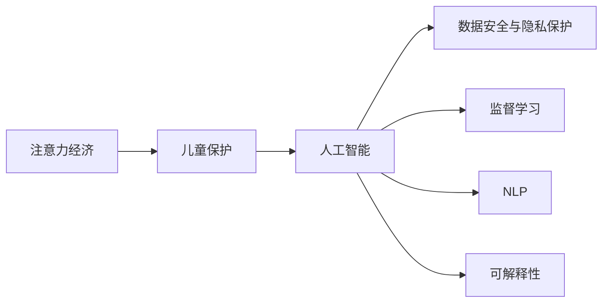

                 

# 注意力经济下的儿童保护问题

> 关键词：人工智能, 儿童保护, 数据安全, 隐私保护, 机器学习, 监督学习, 自然语言处理, 可解释性

## 1. 背景介绍

### 1.1 问题由来

随着互联网和移动互联网的迅猛发展，信息爆炸时代的到来让人们的生活变得更加便利，但同时也带来了新的问题和挑战。特别是儿童保护问题，随着各种电子设备和网络服务的普及，儿童日益成为新的风险群体。

在数字化、信息化的大背景下，儿童接触信息的渠道和方式日趋多样化，也意味着他们面临的风险和危害更加复杂和隐蔽。因此，如何利用先进的科技手段，保护儿童免受网络信息侵害，成为当下亟待解决的重要课题。

### 1.2 问题核心关键点

儿童保护问题涉及的关键点包括但不限于：

1. **网络信息的过滤与监控**：在海量信息中识别并过滤有害内容，预防儿童受到网络色情、暴力、虚假信息等不良信息的影响。
2. **隐私保护与数据安全**：保护儿童的个人信息不被非法获取、泄露或滥用。
3. **行为监测与干预**：监控儿童在网络上的行为，及时发现异常并进行干预。
4. **可解释性与人机协作**：确保算法决策过程透明、可解释，便于家长和教育工作者理解和使用。
5. **跨领域合作与政策制定**：结合心理学、社会学、法律等多学科知识，制定全面、系统的儿童保护策略。

## 2. 核心概念与联系

### 2.1 核心概念概述

要深入理解注意力经济下的儿童保护问题，需要从以下几个核心概念出发：

- **注意力经济（Attention Economy）**：指在信息过载时代，人们更加倾向于关注那些能引起注意的信息，而非信息本身的实际价值。该概念强调在信息消费中对注意力的争夺，以及如何利用注意力来创造价值。

- **儿童保护**：指通过各种手段保护儿童免受伤害，包括但不限于网络安全、隐私保护、行为监控等方面。

- **人工智能（AI）**：使用计算机算法和模型，模仿人类智能解决实际问题。在儿童保护中，AI主要用于有害信息的过滤、异常行为的监测、隐私保护等。

- **数据安全与隐私保护**：确保数据不被未授权访问、泄露或滥用，保证儿童个人信息的安全。

- **监督学习**：一种基于已标注数据进行模型训练的机器学习方法，广泛用于有害信息识别、行为分类等任务。

- **自然语言处理（NLP）**：使计算机能够理解、处理人类语言的技术，在儿童保护中主要用于理解网络文本内容、生成提示信息等。

- **可解释性（Explainability）**：确保AI决策过程透明、可理解，便于用户（如家长）理解和信任AI系统。

这些概念之间的关系可以通过以下Mermaid流程图来展示：



这个流程图展示了注意力经济如何通过人工智能、数据安全、监督学习、NLP和可解释性等手段，共同作用于儿童保护问题。

## 3. 核心算法原理 & 具体操作步骤

### 3.1 算法原理概述

儿童保护问题的解决，离不开先进的数据处理和分析技术。以下简要介绍几种常见的技术：

- **监督学习**：通过已标注的正面/负面样本训练模型，自动识别和过滤有害信息。
- **自然语言处理（NLP）**：分析文本中的情感、主题等信息，实现情感分析、文本分类等任务。
- **序列模型**：如LSTM、GRU等，用于处理时间序列数据，监测儿童的网络行为模式。

### 3.2 算法步骤详解

以下是基于监督学习的儿童保护问题解决步骤：

1. **数据收集与标注**：收集儿童在网络上的互动数据，并标注为正面或负面行为（如社交互动、浏览内容、搜索历史等）。

2. **数据预处理**：清洗、归一化数据，并进行分词、向量化等操作。

3. **模型选择与训练**：选择合适的模型（如LSTM、BERT等），在已标注数据上训练模型，优化损失函数。

4. **模型评估与验证**：在验证集上评估模型性能，使用准确率、召回率、F1值等指标衡量模型效果。

5. **模型部署与监测**：将训练好的模型部署到实际应用中，持续监测模型表现，并进行调优。

### 3.3 算法优缺点

监督学习方法在儿童保护问题上的优势包括：

- **高效**：在少量标注数据下就能取得较好效果。
- **可解释性**：模型决策过程透明，便于理解和调试。
- **鲁棒性**：对于数据分布变化具有一定的适应性。

但同样存在以下局限：

- **数据依赖**：模型的效果高度依赖于标注数据的质量和数量。
- **泛化能力**：如果训练数据与实际应用场景差异较大，模型性能可能下降。
- **隐私问题**：在标注数据中可能会涉及儿童隐私信息，需要严格处理。

### 3.4 算法应用领域

监督学习在儿童保护中的应用领域主要包括：

- **网络有害信息过滤**：识别和过滤网络上的色情、暴力、虚假信息等。
- **行为监测与分析**：监测儿童在网络上的行为模式，识别异常行为。
- **隐私保护与数据安全**：保护儿童的个人信息不被非法获取或滥用。
- **智能客服与咨询**：通过聊天机器人等提供安全上网指导和咨询服务。

## 4. 数学模型和公式 & 详细讲解 & 举例说明

### 4.1 数学模型构建

以有害信息的过滤为例，构建基于监督学习的文本分类模型：

- **输入**：网络文本数据 $x$。
- **输出**：有害/非有害分类标签 $y$。

定义模型 $M_{\theta}(x)$，其中 $\theta$ 为模型参数。使用交叉熵损失函数 $L$ 来衡量模型预测与真实标签之间的差异。目标是最小化损失函数：

$$
\min_{\theta} \frac{1}{N} \sum_{i=1}^N \mathcal{L}(M_{\theta}(x_i), y_i)
$$

其中 $\mathcal{L}$ 为交叉熵损失函数：

$$
\mathcal{L}(M_{\theta}(x), y) = -(y\log M_{\theta}(x) + (1-y)\log(1-M_{\theta}(x)))
$$

### 4.2 公式推导过程

以二分类问题为例，推导模型训练过程：

1. **前向传播**：

$$
\hat{y} = M_{\theta}(x)
$$

2. **损失计算**：

$$
L(M_{\theta}(x), y) = -y\log \hat{y} - (1-y)\log(1-\hat{y})
$$

3. **反向传播**：

$$
\frac{\partial L}{\partial \theta} = -\frac{\partial \mathcal{L}}{\partial M_{\theta}(x)} \frac{\partial M_{\theta}(x)}{\partial \theta}
$$

其中 $\frac{\partial \mathcal{L}}{\partial M_{\theta}(x)}$ 为模型输出对损失函数的偏导数，可通过反向传播算法求得。

4. **梯度更新**：

$$
\theta \leftarrow \theta - \eta \frac{\partial L}{\partial \theta}
$$

其中 $\eta$ 为学习率，控制参数更新的步长。

### 4.3 案例分析与讲解

以BERT模型为例，其在儿童保护中的应用包括：

- **有害信息过滤**：使用BERT作为特征提取器，构建分类模型，训练识别网络上的有害信息。
- **行为监测**：利用BERT分析儿童在网络上的行为文本，识别异常行为模式。
- **隐私保护**：使用BERT生成隐私保护提示，指导儿童安全上网。

## 5. 项目实践：代码实例和详细解释说明

### 5.1 开发环境搭建

为实现上述功能，需要搭建相应的开发环境。以下以Python和TensorFlow为例：

1. 安装Anaconda并创建虚拟环境：

```bash
conda create -n ai_env python=3.8
conda activate ai_env
```

2. 安装TensorFlow和其他依赖库：

```bash
pip install tensorflow pandas scikit-learn nltk transformers
```

3. 下载并准备预训练模型（如BERT）：

```bash
wget https://huggingface.co/models/bert-base-uncased/resolve/main/config.json
```

### 5.2 源代码详细实现

以下是一个使用BERT进行有害信息过滤的Python代码实现：

```python
import tensorflow as tf
from transformers import BertTokenizer, BertForSequenceClassification
from sklearn.metrics import accuracy_score

# 加载BERT模型和分词器
tokenizer = BertTokenizer.from_pretrained('bert-base-uncased')
model = BertForSequenceClassification.from_pretrained('bert-base-uncased', num_labels=2)

# 加载并预处理数据
train_data = ...
train_labels = ...
dev_data = ...
dev_labels = ...

# 构建数据预处理函数
def tokenize(text):
    return tokenizer.encode(text, add_special_tokens=True)

# 构建数据生成器
def generate_data(data, labels):
    for text, label in zip(data, labels):
        yield tokenize(text), label

# 构建训练函数
def train(model, data_generator, batch_size, epochs):
    model.compile(optimizer='adam', loss='sparse_categorical_crossentropy', metrics=['accuracy'])
    model.fit(data_generator, epochs=epochs, batch_size=batch_size)

# 评估模型
def evaluate(model, dev_data, dev_labels):
    dev_data = [tokenize(text) for text, _ in dev_data]
    dev_labels = [label for _, label in dev_data]
    y_pred = model.predict(dev_data)
    y_pred = np.argmax(y_pred, axis=1)
    acc = accuracy_score(dev_labels, y_pred)
    print('Accuracy:', acc)

# 训练并评估模型
train_model = BertForSequenceClassification.from_pretrained('bert-base-uncased', num_labels=2)
train(train_model, generate_data(train_data, train_labels), batch_size=32, epochs=5)
evaluate(train_model, generate_data(dev_data, dev_labels))
```

### 5.3 代码解读与分析

上述代码中，关键步骤如下：

- **数据预处理**：使用BERT的分词器将文本数据预处理为模型输入格式。
- **模型构建**：选择合适的BERT模型，并构建分类任务。
- **训练与评估**：通过训练和验证数据，评估模型性能。
- **应用部署**：将训练好的模型部署到实际应用中，持续监测和优化。

## 6. 实际应用场景

### 6.1 智能客服系统

智能客服系统可以帮助家长及时了解儿童的网络行为，并提供安全上网指导和咨询服务。以下是具体实现步骤：

1. **数据收集**：收集儿童与客服系统的互动记录，包括文本、语音等。
2. **数据标注**：标注文本数据，标记有害信息、敏感信息等。
3. **模型训练**：使用监督学习模型，训练有害信息过滤、行为分类等任务。
4. **系统集成**：将训练好的模型集成到智能客服系统中，实时监控儿童网络行为。
5. **效果评估**：定期评估系统性能，根据用户反馈进行调整。

### 6.2 儿童在线教育平台

儿童在线教育平台需要保证课程内容的健康性和安全性，以下是具体实现步骤：

1. **课程内容审查**：定期审查课程内容，识别和过滤有害信息。
2. **行为监测**：监控儿童在学习平台上的行为，识别异常学习行为。
3. **隐私保护**：保护儿童的个人信息不被非法获取或滥用。
4. **智能推荐**：根据儿童的学习行为，提供个性化的课程推荐。

### 6.3 儿童社交网络平台

儿童社交网络平台需要保证儿童的网络安全，以下是具体实现步骤：

1. **好友审核**：审核并管理儿童的好友关系，避免接触不良信息。
2. **内容过滤**：过滤有害信息，防止儿童受到不良信息影响。
3. **行为监控**：监控儿童在平台上的行为，防止网络欺凌等不良行为。
4. **数据安全**：保护儿童的个人信息不被非法获取或滥用。

### 6.4 未来应用展望

未来，儿童保护问题将借助更多先进技术手段得到解决：

- **多模态信息融合**：结合视觉、听觉等多种信息源，提高儿童保护的准确性和全面性。
- **智能推荐系统**：利用深度学习模型，推荐健康、安全的上网内容，提升儿童的网络素养。
- **跨领域合作**：结合心理学、社会学、法律等多学科知识，制定全面的儿童保护策略。
- **可解释性AI**：确保AI决策过程透明、可理解，便于家长和教育工作者理解和使用。

## 7. 工具和资源推荐

### 7.1 学习资源推荐

为了帮助开发者系统掌握儿童保护问题中的AI技术，推荐以下学习资源：

1. **《深度学习与自然语言处理》**：介绍深度学习和自然语言处理的基本概念和应用。
2. **《机器学习实战》**：通过实际案例，讲解机器学习算法和模型。
3. **Kaggle**：通过参与实际项目，学习数据处理、模型训练等技能。
4. **Coursera**：提供多种AI相关的在线课程，涵盖从基础到高级的内容。
5. **HuggingFace官方文档**：提供丰富的预训练模型和代码示例，帮助快速上手。

### 7.2 开发工具推荐

以下是一些用于儿童保护问题中AI技术开发的常用工具：

1. **TensorFlow**：开源的深度学习框架，适合复杂模型的训练和部署。
2. **PyTorch**：灵活的深度学习框架，适合快速迭代研究。
3. **Jupyter Notebook**：交互式的代码编写环境，便于分享和协作。
4. **NLTK**：自然语言处理工具包，提供丰富的文本处理功能。
5. **Scikit-learn**：机器学习库，提供多种算法和工具。

### 7.3 相关论文推荐

以下推荐一些相关论文，帮助深入理解AI在儿童保护中的应用：

1. **《儿童网络行为分析与预测》**：研究儿童在网络上的行为模式，提出基于机器学习的预测模型。
2. **《儿童社交网络安全模型》**：构建社交网络安全模型，识别并过滤有害信息。
3. **《基于深度学习的儿童保护系统》**：介绍使用深度学习技术，构建儿童保护系统的具体实现。
4. **《儿童隐私保护算法研究》**：研究如何保护儿童的隐私信息，防止数据泄露。

## 8. 总结：未来发展趋势与挑战

### 8.1 总结

本文对注意力经济下的儿童保护问题进行了系统介绍，从多个角度探讨了AI技术的应用。通过理论分析、实际案例和代码实现，帮助读者全面理解儿童保护问题中的AI应用。

### 8.2 未来发展趋势

未来，AI在儿童保护中的应用将更加广泛和深入，主要发展趋势包括：

- **技术进步**：AI模型和算法不断优化，提高儿童保护的准确性和有效性。
- **多模态融合**：结合视觉、听觉等多种信息源，全面提升儿童保护的能力。
- **跨领域合作**：结合心理学、社会学、法律等多学科知识，制定全面的儿童保护策略。
- **隐私保护**：加强数据隐私保护，确保儿童个人信息的安全。

### 8.3 面临的挑战

尽管AI在儿童保护中的应用前景广阔，但仍面临诸多挑战：

- **数据获取**：获取高质量、大规模的儿童行为数据不易，且涉及隐私保护。
- **模型泛化**：模型在实际应用中可能面临数据分布变化，泛化性能下降。
- **算法可解释性**：确保AI决策过程透明、可理解，便于家长和教育工作者理解和使用。
- **伦理道德**：确保AI决策符合伦理道德规范，避免滥用和误导。

### 8.4 研究展望

为应对上述挑战，未来的研究重点应包括：

- **数据增强技术**：通过数据合成等手段，扩充数据集，提升模型泛化能力。
- **多学科融合**：结合心理学、社会学、法律等多学科知识，制定全面的儿童保护策略。
- **可解释性算法**：开发可解释性强的AI模型，提升决策透明度和可信度。
- **伦理道德规范**：制定AI技术的伦理道德规范，确保技术的健康发展。

## 9. 附录：常见问题与解答

### 9.1 Q1：如何确保AI在儿童保护中的数据隐私？

A: 数据隐私保护是儿童保护中非常重要的一环。以下是一些常见措施：

1. **匿名化处理**：对数据进行去标识化处理，确保个人信息无法被识别。
2. **访问控制**：对数据访问进行严格控制，防止未经授权的访问。
3. **数据加密**：对数据进行加密存储和传输，防止数据泄露。
4. **合规审查**：确保数据处理符合相关法律法规，如GDPR等。

### 9.2 Q2：AI在儿童保护中面临的主要技术挑战是什么？

A: AI在儿童保护中面临的主要技术挑战包括：

1. **数据获取**：获取高质量、大规模的儿童行为数据不易，且涉及隐私保护。
2. **模型泛化**：模型在实际应用中可能面临数据分布变化，泛化性能下降。
3. **算法可解释性**：确保AI决策过程透明、可理解，便于家长和教育工作者理解和使用。
4. **伦理道德**：确保AI决策符合伦理道德规范，避免滥用和误导。

### 9.3 Q3：如何使用AI技术构建儿童保护系统？

A: 使用AI技术构建儿童保护系统，一般分为以下几个步骤：

1. **数据收集与标注**：收集儿童在网络上的互动数据，并标注为正面或负面行为。
2. **数据预处理**：清洗、归一化数据，并进行分词、向量化等操作。
3. **模型选择与训练**：选择合适的模型（如LSTM、BERT等），在已标注数据上训练模型，优化损失函数。
4. **模型评估与验证**：在验证集上评估模型性能，使用准确率、召回率、F1值等指标衡量模型效果。
5. **模型部署与监测**：将训练好的模型部署到实际应用中，持续监测模型表现，并进行调优。

### 9.4 Q4：AI在儿童保护中的应用有哪些？

A: AI在儿童保护中的应用主要包括以下几个方面：

1. **有害信息过滤**：识别和过滤网络上的有害信息。
2. **行为监测与分析**：监控儿童在网络上的行为模式，识别异常行为。
3. **隐私保护**：保护儿童的个人信息不被非法获取或滥用。
4. **智能客服与咨询**：通过聊天机器人等提供安全上网指导和咨询服务。

---

作者：禅与计算机程序设计艺术 / Zen and the Art of Computer Programming

