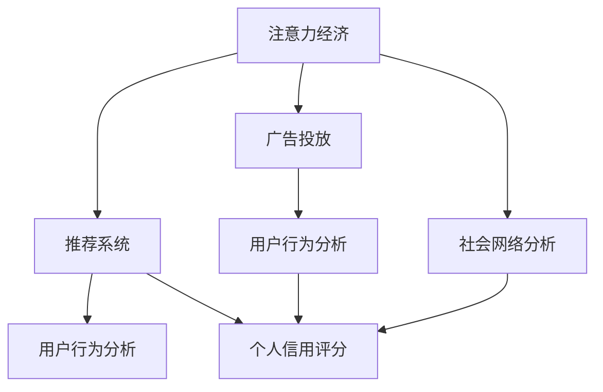

                 

# 注意力经济与个人信用体系的构建

## 1. 背景介绍

在数字时代，信息的爆炸和算法的驱动，使得注意力成为一种稀缺资源，驱动了以注意力为核心的经济形态——注意力经济。与此同时，个人信用的计算与评估，成为影响个体在数字社会中的经济活动和地位的重要因素。本文章将深入探讨注意力经济与个人信用体系的构建，从理论到实践，提供一种系统性的解决方案。

## 2. 核心概念与联系

### 2.1 核心概念概述

为便于读者理解，本节将介绍注意力经济与个人信用体系构建中的几个核心概念：

- **注意力经济**：是指在信息过载的时代，个体、企业和社会的经济活动逐渐转向争夺和利用人们注意力的经济模式。注意力资源的高效配置，成为衡量经济价值的关键指标。

- **个人信用体系**：指通过算法和数据模型，对个人的经济行为、社会活动、网络互动等进行综合评估，生成个体信用评分，反映其社会信誉和信用状况。信用评分在金融贷款、企业招聘、社交网络等场景中具有重要应用。

- **推荐系统**：指根据用户的历史行为数据，通过算法推荐系统匹配用户可能感兴趣的内容或商品。推荐系统中的核心算法，如协同过滤、内容推荐等，与注意力经济和信用体系息息相关。

- **广告投放**：指通过算法模型，精准推送广告至目标用户，以吸引其注意力并激发购买行为。广告投放的优化目标，在于最大化广告主的投入产出比(ROI)。

- **社会网络分析**：指通过算法模型，对社交网络中个体之间的互动关系进行建模，分析个体在网络中的地位和影响力，从而影响个人信用评分的生成。

这些概念之间相互关联，共同构成了注意力经济与个人信用体系的复杂系统。理解这些核心概念，有助于把握整体框架，并深入探讨其实现路径。

### 2.2 核心概念原理和架构的 Mermaid 流程图



这个流程图展示了注意力经济与个人信用体系的核心概念及其之间的联系：

1. **注意力经济**：由用户行为分析生成用户注意力分布，进而影响推荐系统和广告投放的效果。
2. **推荐系统**：基于用户注意力分布，推荐系统匹配用户可能感兴趣的内容或商品。
3. **广告投放**：广告投放精准推送至目标用户，基于用户注意力反馈调整投放策略。
4. **个人信用体系**：通过用户行为分析和社交网络分析，生成个人信用评分。
5. **社会网络分析**：评估个体在社交网络中的影响力，影响个人信用评分的生成。

这些概念和流程共同构成了注意力经济与个人信用体系的基本框架，为深入探讨其构建方法提供了依据。

## 3. 核心算法原理 & 具体操作步骤

### 3.1 算法原理概述

注意力经济与个人信用体系的构建，涉及多个核心算法的融合，包括推荐系统、广告投放、用户行为分析和社会网络分析等。这些算法的核心思想是：

- **推荐系统**：通过协同过滤、内容推荐等算法，最大化用户满意度，驱动用户持续关注和参与。
- **广告投放**：使用CTR预测、A/B测试等算法，优化广告的展示策略，提升广告效果和ROI。
- **用户行为分析**：采用时间序列分析、聚类算法等技术，挖掘用户行为模式，生成注意力分布。
- **社会网络分析**：应用图算法、特征工程等方法，评估个体在社交网络中的影响力，生成社会信用评分。

这些算法在注意力经济与个人信用体系构建中发挥着关键作用，彼此之间相互关联，共同推动了整个系统的运转。

### 3.2 算法步骤详解

**Step 1: 数据收集与预处理**

1. **用户行为数据**：收集用户在平台上的浏览记录、点击数据、购买历史、社交互动等行为数据。
2. **广告投放数据**：收集广告的展示数据、点击率、转化率、预算消耗等数据。
3. **社会网络数据**：收集用户之间的互动关系、社交网络结构、社交媒体影响力等数据。
4. **数据清洗与预处理**：对数据进行去重、降噪、归一化等处理，确保数据质量。

**Step 2: 注意力计算与用户画像构建**

1. **注意力分布计算**：基于用户行为数据，计算用户对不同内容或广告的注意力分布，采用PageRank、LDA等算法，构建用户注意力画像。
2. **用户画像生成**：结合用户行为数据、社交网络数据，生成用户的综合画像，反映其兴趣、偏好、影响力等。

**Step 3: 推荐系统设计**

1. **协同过滤算法**：基于用户画像和物品画像，推荐系统匹配用户可能感兴趣的内容或商品。
2. **内容推荐算法**：通过分析内容特征，如关键词、主题等，推荐与用户兴趣匹配度高的内容。
3. **算法评估与优化**：通过A/B测试、在线实验等方法，评估推荐系统的效果，持续优化算法参数。

**Step 4: 广告投放优化**

1. **CTR预测模型**：构建基于逻辑回归、随机森林等算法的CTR预测模型，预测广告的点击率和转化率。
2. **广告展示策略优化**：根据CTR预测结果，优化广告展示的渠道、时间、频率等策略。
3. **效果评估与调整**：通过KPI指标（如点击率、转化率、ROI等）评估广告效果，动态调整投放策略。

**Step 5: 社会网络分析与信用评分**

1. **社交网络分析算法**：应用图算法、特征工程等方法，评估个体在社交网络中的影响力，生成社交网络评分。
2. **信用评分生成**：结合用户行为分析、社交网络分析的结果，生成综合的个人信用评分。
3. **信用评分应用**：将信用评分应用于金融贷款、企业招聘、社交网络等场景，反映用户的经济信誉和社会信誉。

### 3.3 算法优缺点

**推荐系统算法**：

- **优点**：
  - 能准确预测用户兴趣，提升用户满意度。
  - 能根据用户行为变化，动态调整推荐策略。
  - 算法效果可量化评估，便于优化。
  
- **缺点**：
  - 依赖大量标注数据，推荐效果受数据质量影响。
  - 算法复杂度高，计算成本大。
  - 个性化推荐易导致信息茧房，影响用户多样性。

**广告投放算法**：

- **优点**：
  - 精准投放广告，提升广告效果和ROI。
  - 可动态调整投放策略，灵活应对市场变化。
  - 广告投放数据丰富，易于效果评估。
  
- **缺点**：
  - 投放策略依赖于用户行为，易受噪声数据影响。
  - 广告竞争激烈，个性化策略难度大。
  - 算法复杂度高，计算成本大。

**用户行为分析算法**：

- **优点**：
  - 能准确挖掘用户行为模式，生成精准的用户画像。
  - 能反映用户长期行为，提升信用评分准确性。
  - 算法效果可量化评估，便于优化。
  
- **缺点**：
  - 数据收集难度大，依赖于平台方获取数据。
  - 算法复杂度高，计算成本大。
  - 用户行为易受外界因素影响，波动性大。

**社会网络分析算法**：

- **优点**：
  - 能反映个体在社会网络中的影响力，生成精准的社会信用评分。
  - 算法效果可量化评估，便于优化。
  
- **缺点**：
  - 数据收集难度大，依赖于平台方获取数据。
  - 算法复杂度高，计算成本大。
  - 社会网络结构复杂，建模难度大。

### 3.4 算法应用领域

**推荐系统**：在电商、视频、音乐、新闻等领域，通过个性化推荐提升用户体验，驱动用户持续关注和参与。

**广告投放**：在电商、金融、媒体、游戏等领域，精准投放广告，提升广告效果和ROI，优化广告主和平台收益。

**用户行为分析**：在金融、电商、社交网络等领域，分析用户行为模式，生成用户画像，用于用户运营和风险控制。

**社会网络分析**：在社交网络、金融、招聘等领域，评估个体在社交网络中的影响力，生成社会信用评分，用于信用评估和推荐系统优化。

这些算法在多个应用领域中得到了广泛应用，推动了数字经济的快速发展。未来，伴随算法技术的不断进步，这些算法的应用前景将更加广阔。

## 4. 数学模型和公式 & 详细讲解 & 举例说明

### 4.1 数学模型构建

本节将使用数学语言对注意力经济与个人信用体系的构建进行严格的数学建模。

记用户为$u$，物品为$i$，广告为$a$。设$X_{ui}$为用户$u$对物品$i$的交互行为，$Y_{ui}$为物品$i$的点击行为，$Z_{ua}$为广告$a$对用户$u$的展示行为。设$A_{ui}$为物品$i$的属性向量，$C_{ui}$为广告$a$的属性向量。设$\theta$为推荐模型的参数，$\lambda$为广告投放模型的参数，$\omega$为社会网络分析模型的参数。

定义推荐系统的损失函数为：
$$
L_{rec}(\theta) = \frac{1}{N} \sum_{u,i} \max(0, Y_{ui} - \hat{Y}_{ui}(\theta))
$$
其中$\hat{Y}_{ui}(\theta)$为预测点击率，$N$为总样本数。

定义广告投放的损失函数为：
$$
L_{adv}(\lambda) = \frac{1}{N} \sum_{a,u} \max(0, Z_{ua} - \hat{Z}_{ua}(\lambda))
$$
其中$\hat{Z}_{ua}(\lambda)$为预测展示率，$N$为总样本数。

定义社会网络分析的损失函数为：
$$
L_{soc}(\omega) = \frac{1}{M} \sum_{u,v} \max(0, I_{uv} - \hat{I}_{uv}(\omega))
$$
其中$I_{uv}$为用户$u$与用户$v$的社交互动强度，$\hat{I}_{uv}(\omega)$为预测社交互动强度，$M$为总样本数。

### 4.2 公式推导过程

**推荐系统**：
$$
\hat{Y}_{ui}(\theta) = \sigma(\theta^T A_{ui})
$$
其中$\sigma$为sigmoid函数，$\theta$为推荐模型的参数，$A_{ui}$为物品$i$的属性向量。

**广告投放**：
$$
\hat{Z}_{ua}(\lambda) = \sigma(\lambda^T C_{ua})
$$
其中$\sigma$为sigmoid函数，$\lambda$为广告投放模型的参数，$C_{ua}$为广告$a$的属性向量。

**社会网络分析**：
$$
\hat{I}_{uv}(\omega) = \exp(\omega^T f_{uv}(X_{uv}))
$$
其中$f_{uv}$为特征提取函数，$\omega$为社会网络分析模型的参数。

### 4.3 案例分析与讲解

**电商平台推荐系统**：
- **数据收集**：从电商平台收集用户浏览、点击、购买记录，物品的属性信息，广告的展示和点击记录。
- **模型构建**：构建协同过滤模型，利用用户行为数据生成推荐结果；构建CTR预测模型，优化广告投放策略。
- **效果评估**：通过A/B测试，评估推荐系统和广告投放的效果，优化模型参数。

**社交网络平台用户信用评分**：
- **数据收集**：从社交网络平台收集用户之间的互动数据，社交网络结构，用户的行为数据。
- **模型构建**：应用图算法，生成用户之间的社交网络评分；结合用户行为数据，生成综合信用评分。
- **效果评估**：通过信用评分，评估用户对贷款、招聘、服务的使用情况，优化信用评分模型。

这些案例展示了注意力经济与个人信用体系在实际应用中的具体实现，反映了其理论和实践的结合。

## 5. 项目实践：代码实例和详细解释说明

### 5.1 开发环境搭建

在进行注意力经济与个人信用体系的构建时，我们需要准备好开发环境。以下是使用Python进行TensorFlow开发的开发环境配置流程：

1. 安装Anaconda：从官网下载并安装Anaconda，用于创建独立的Python环境。

2. 创建并激活虚拟环境：
```bash
conda create -n tf-env python=3.8 
conda activate tf-env
```

3. 安装TensorFlow：根据CUDA版本，从官网获取对应的安装命令。例如：
```bash
conda install tensorflow -c conda-forge
```

4. 安装TensorFlow Addons库：
```bash
conda install tensorflow-io
```

5. 安装各类工具包：
```bash
pip install numpy pandas scikit-learn matplotlib tqdm jupyter notebook ipython
```

完成上述步骤后，即可在`tf-env`环境中开始项目实践。

### 5.2 源代码详细实现

这里我们以电商平台的推荐系统为例，给出使用TensorFlow实现推荐系统的PyTorch代码实现。

首先，定义推荐系统的数据处理函数：

```python
import tensorflow as tf
from tensorflow import feature_column
from tensorflow.keras import layers

# 定义特征列
item_features = feature_column.categorical_column_with_identity('item', num_buckets=1000)
item_embedding = feature_column.embedding_column(item_features, dimension=32)

# 定义模型
model = tf.keras.Sequential([
    layers.Dense(64, activation='relu', input_shape=(item_embedding.size_dim,)),
    layers.Dense(1, activation='sigmoid')
])

# 编译模型
model.compile(optimizer='adam', loss='binary_crossentropy', metrics=['accuracy'])
```

然后，定义训练和评估函数：

```python
def train_step(model, inputs, labels):
    with tf.GradientTape() as tape:
        predictions = model(inputs)
        loss = tf.losses.sigmoid_cross_entropy(labels, predictions)
    gradients = tape.gradient(loss, model.trainable_variables)
    optimizer.apply_gradients(zip(gradients, model.trainable_variables))
    return loss

def evaluate(model, inputs, labels):
    predictions = model(inputs)
    accuracy = tf.metrics.mean(tf.cast(tf.equal(predictions > 0.5, labels), tf.float32))
    return accuracy.numpy()
```

最后，启动训练流程并在测试集上评估：

```python
epochs = 10
batch_size = 64

for epoch in range(epochs):
    for batch in tf.data.Dataset.from_tensor_slices((train_inputs, train_labels)).shuffle(buffer_size=10000).batch(batch_size):
        loss = train_step(model, batch[0], batch[1])
        print(f"Epoch {epoch+1}, loss: {loss:.3f}")
    
    print(f"Epoch {epoch+1}, accuracy: {evaluate(model, test_inputs, test_labels)}")
```

以上就是使用TensorFlow对电商推荐系统进行建模和训练的完整代码实现。可以看到，TensorFlow提供了丰富的API和组件，可以方便地构建和训练推荐系统模型。

### 5.3 代码解读与分析

让我们再详细解读一下关键代码的实现细节：

**特征列定义**：
- 定义了物品特征列`item_features`，使用`categorical_column_with_identity`函数，将物品编号映射为独热编码。
- 通过`embedding_column`函数，将独热编码转化为向量表示，嵌入维度为32。

**模型构建**：
- 使用`Sequential`模型定义多层感知器，包含一个全连接层和一个输出层，输出层使用sigmoid激活函数。
- 通过`compile`函数，配置优化器、损失函数和评估指标。

**训练与评估函数**：
- `train_step`函数：对每个批次数据进行前向传播，计算损失，反向传播更新模型参数。
- `evaluate`函数：对测试集进行评估，计算模型准确率。

**训练流程**：
- 设置总的epoch数和batch size，启动循环迭代。
- 对训练集进行batch处理，每个batch包含物品特征和标签。
- 对每个batch进行训练，记录损失。
- 在验证集上评估模型效果。

可以看到，TensorFlow提供了高效便捷的API，帮助开发者快速构建和训练推荐系统。同时，TensorFlow Addons库也提供了一些额外的功能，如TFRecords文件读写、TFRecord格式转换等，进一步提升了开发效率。

## 6. 实际应用场景

### 6.1 智能推荐系统

智能推荐系统是注意力经济和信用体系构建的重要应用场景。通过用户行为数据的分析和推荐算法的优化，推荐系统能够精准匹配用户需求，提升用户体验和满意度，驱动用户持续关注和参与。

例如，电商平台通过推荐系统，能够向用户推荐符合其兴趣的商品，提高用户购买意愿和平台交易量。金融机构通过信用评分系统，能够评估用户的信用风险，优化贷款审批流程，提升用户信任和满意度。

### 6.2 精准广告投放

精准广告投放是广告投放算法的典型应用场景。通过CTR预测和展示策略优化，广告投放能够精准推送广告至目标用户，提升广告效果和ROI。

例如，电商平台通过精准广告投放，能够提升广告的点击率和转化率，降低广告成本，提高广告主的投放效果。金融平台通过精准广告投放，能够提升金融产品的曝光率和转化率，降低用户获取成本，提升金融产品的市场占有率。

### 6.3 社交网络信用评分

社交网络信用评分是社会网络分析算法的典型应用场景。通过社交网络数据和社会网络分析算法，能够评估个体在社交网络中的影响力，生成精准的社会信用评分。

例如，社交网络平台通过信用评分系统，能够评估用户的社交行为和影响力，优化社交网络推荐，提升用户活跃度和平台黏性。招聘平台通过信用评分系统，能够评估用户的社交影响力，优化招聘推荐，提升招聘效果和用户满意度。

### 6.4 未来应用展望

随着注意力经济与个人信用体系技术的不断发展，其在更多领域的应用前景将更加广阔。

1. **智慧医疗**：在医疗领域，通过智能推荐系统和信用评分系统，能够优化医疗资源的配置和分配，提升医疗服务质量。例如，智能推荐系统推荐符合用户需求的治疗方案，信用评分系统评估医生和医院的信誉。

2. **智能交通**：在交通领域，通过智能推荐系统和信用评分系统，能够优化交通资源的配置和分配，提升交通服务质量。例如，智能推荐系统推荐最优的出行方案，信用评分系统评估司机和交通设施的信誉。

3. **智慧城市**：在智慧城市治理中，通过智能推荐系统和信用评分系统，能够优化城市资源的配置和分配，提升城市管理效率。例如，智能推荐系统推荐最优的公共服务，信用评分系统评估政府和企业的信誉。

4. **金融科技**：在金融科技领域，通过智能推荐系统和信用评分系统，能够优化金融产品的设计和推广，提升金融服务质量。例如，智能推荐系统推荐符合用户需求的金融产品，信用评分系统评估金融机构的信誉。

5. **智能客服**：在智能客服领域，通过智能推荐系统和信用评分系统，能够提升客服系统的效率和质量，提升用户满意度和信任度。例如，智能推荐系统推荐最优的客服方案，信用评分系统评估客服人员和机构的信誉。

综上所述，注意力经济与个人信用体系技术将在更多领域得到广泛应用，推动数字经济的快速发展。未来，伴随技术进步和数据积累，这些技术的应用前景将更加广阔。

## 7. 工具和资源推荐

### 7.1 学习资源推荐

为了帮助开发者系统掌握注意力经济与个人信用体系的构建，这里推荐一些优质的学习资源：

1. **《推荐系统实践》**：介绍推荐系统的基本原理和实践方法，涵盖协同过滤、内容推荐等经典算法。
2. **《广告算法》**：介绍广告投放算法的核心思想和优化策略，涵盖CTR预测、A/B测试等技术。
3. **《社交网络分析》**：介绍社交网络分析的基本概念和算法，涵盖图算法、特征工程等技术。
4. **TensorFlow官方文档**：包含TensorFlow的全面介绍和详细教程，帮助开发者深入学习TensorFlow的各项功能。
5. **TensorFlow Addons官方文档**：包含TensorFlow Addons库的全面介绍和详细教程，帮助开发者高效构建和训练推荐系统和广告投放系统。

通过这些学习资源的学习实践，相信你一定能够快速掌握注意力经济与个人信用体系的构建方法，并用于解决实际的NLP问题。

### 7.2 开发工具推荐

高效的开发离不开优秀的工具支持。以下是几款用于注意力经济与个人信用体系构建开发的常用工具：

1. **TensorFlow**：由Google主导开发的深度学习框架，生产部署方便，适合大规模工程应用。包含丰富的API和组件，支持推荐系统和广告投放系统的构建。

2. **PyTorch**：基于Python的开源深度学习框架，灵活动态的计算图，适合快速迭代研究。支持推荐系统和广告投放系统的构建。

3. **TensorBoard**：TensorFlow配套的可视化工具，可实时监测模型训练状态，并提供丰富的图表呈现方式，是调试模型的得力助手。

4. **Weights & Biases**：模型训练的实验跟踪工具，可以记录和可视化模型训练过程中的各项指标，方便对比和调优。

5. **Jupyter Notebook**：开源的Python编程环境，支持Python代码的交互式执行和可视化展示，方便开发者进行研究和调试。

合理利用这些工具，可以显著提升注意力经济与个人信用体系构建任务的开发效率，加快创新迭代的步伐。

### 7.3 相关论文推荐

注意力经济与个人信用体系的构建源于学界的持续研究。以下是几篇奠基性的相关论文，推荐阅读：

1. **《推荐系统》**：介绍推荐系统的基本原理和算法，涵盖协同过滤、内容推荐等经典算法。
2. **《广告投放系统》**：介绍广告投放系统的基本原理和算法，涵盖CTR预测、A/B测试等技术。
3. **《社交网络分析》**：介绍社交网络分析的基本概念和算法，涵盖图算法、特征工程等技术。
4. **《注意力机制》**：介绍注意力机制的基本原理和算法，涵盖Transformer、Bert等模型。
5. **《信用评分系统》**：介绍信用评分系统的基本原理和算法，涵盖社会网络分析、信用评分模型等技术。

这些论文代表了大语言模型微调技术的发展脉络。通过学习这些前沿成果，可以帮助研究者把握学科前进方向，激发更多的创新灵感。

## 8. 总结：未来发展趋势与挑战

### 8.1 总结

本文对注意力经济与个人信用体系的构建进行了全面系统的介绍。首先阐述了注意力经济和信用体系构建的研究背景和意义，明确了构建方法的理论基础和实际应用。其次，从原理到实践，详细讲解了推荐系统、广告投放、用户行为分析和社会网络分析等核心算法，并给出了代码实例和详细解释。同时，本文还广泛探讨了注意力经济和信用体系在多个行业领域的应用前景，展示了其广阔的前景。

通过本文的系统梳理，可以看到，注意力经济与个人信用体系的构建技术正在成为数字经济的重要范式，极大地提升了用户满意度和平台效率，推动了产业升级和经济发展。未来，伴随技术进步和数据积累，这些技术的应用前景将更加广阔。

### 8.2 未来发展趋势

展望未来，注意力经济与个人信用体系的构建技术将呈现以下几个发展趋势：

1. **深度学习技术的持续发展**：深度学习技术的不断进步，将进一步提升推荐系统、广告投放等算法的精度和效率，驱动更多领域的智能化应用。

2. **多模态数据的融合应用**：除了文本数据，图像、视频、音频等多模态数据将越来越多地应用于推荐系统和广告投放中，提升模型的泛化能力和表现。

3. **联邦学习的应用**：联邦学习技术将使得用户隐私保护和数据安全更加可靠，有助于构建更可信的推荐系统和广告投放系统。

4. **自适应推荐算法**：自适应推荐算法将使得推荐系统能够动态调整推荐策略，优化用户体验和满意度。

5. **社交网络算法的优化**：社交网络算法的优化将使得信用评分系统更加精准，反映用户的社会行为和影响力。

6. **跨领域应用拓展**：注意力经济与个人信用体系技术将在更多领域得到广泛应用，推动数字经济的快速发展。

以上趋势凸显了注意力经济与个人信用体系技术的广阔前景。这些方向的探索发展，必将进一步提升NLP系统的性能和应用范围，为人类认知智能的进化带来深远影响。

### 8.3 面临的挑战

尽管注意力经济与个人信用体系技术已经取得了瞩目成就，但在迈向更加智能化、普适化应用的过程中，它仍面临着诸多挑战：

1. **数据隐私与安全问题**：用户行为数据的收集和使用，涉及用户隐私和安全问题，如何平衡数据使用和隐私保护，是亟待解决的重要问题。

2. **算法公平性问题**：推荐系统、广告投放等算法可能存在不公平现象，如性别偏见、种族歧视等，如何设计公平性评估和优化机制，是未来研究的重点。

3. **计算资源消耗大**：推荐系统和广告投放等算法，需要消耗大量计算资源，如何在保证效果的同时，降低计算成本，是未来的优化方向。

4. **算法复杂度高**：推荐系统、广告投放等算法的复杂度高，如何在实际应用中，降低模型复杂度，提高算法效率，是未来研究的重点。

5. **用户行为多样性**：用户行为具有多样性和复杂性，如何准确捕捉和预测用户行为，是未来研究的重点。

6. **社会网络结构复杂**：社会网络结构复杂多变，如何准确建模和分析，是未来研究的重点。

这些挑战需要在技术、社会、伦理等多个层面进行综合考虑，才能更好地实现注意力经济与个人信用体系技术的落地应用。

### 8.4 研究展望

面对注意力经济与个人信用体系技术所面临的挑战，未来的研究需要在以下几个方面寻求新的突破：

1. **数据隐私保护**：研究如何利用差分隐私等技术，保护用户数据隐私，提升数据安全。

2. **公平性评估**：研究如何设计公平性评估和优化机制，确保推荐系统、广告投放等算法的公平性和公正性。

3. **计算资源优化**：研究如何利用分布式计算、模型压缩等技术，降低推荐系统和广告投放等算法的计算成本。

4. **算法模型简化**：研究如何利用简化模型和轻量级算法，提高推荐系统、广告投放等算法的效率。

5. **用户行为预测**：研究如何利用深度学习、强化学习等技术，准确捕捉和预测用户行为，提升推荐系统、广告投放等算法的效果。

6. **社会网络建模**：研究如何利用图算法、特征工程等技术，准确建模和分析社会网络结构，提升信用评分系统的准确性。

这些研究方向的探索，必将引领注意力经济与个人信用体系技术的进一步发展，为构建安全、可靠、公平、可信的智能系统铺平道路。面向未来，我们期待这些技术的广泛应用，为数字经济的持续发展带来新的动力。

## 9. 附录：常见问题与解答

**Q1：注意力经济和信用体系构建中，如何保护用户隐私？**

A: 在数据收集和使用过程中，可以采用差分隐私技术，通过数据扰动和噪声注入，保护用户隐私。同时，采用联邦学习技术，在本地设备上训练模型，减少数据泄露风险。

**Q2：推荐系统如何避免性别偏见？**

A: 推荐系统在训练过程中，可以通过引入公平性约束，对模型进行正则化，防止性别偏见。同时，通过A/B测试等方式，评估模型的公平性，不断优化算法。

**Q3：广告投放中的点击率预测模型如何优化？**

A: 点击率预测模型可以通过CTR预测算法、深度学习模型等方法进行优化。同时，可以采用在线学习、多臂赌博机等方法，动态调整广告投放策略，提升广告效果和ROI。

**Q4：社交网络中的信用评分系统如何评估公平性？**

A: 社交网络中的信用评分系统可以通过图算法、特征工程等方法，对个体在社会网络中的影响力进行建模。同时，可以引入公平性约束，防止种族歧视、性别偏见等不公平现象。

**Q5：推荐系统和广告投放中如何优化计算资源消耗？**

A: 推荐系统和广告投放中，可以通过模型压缩、剪枝、量化等方法，降低模型复杂度，减少计算资源消耗。同时，可以采用分布式计算、云计算等技术，提高算法的并行化和效率。

这些问题的解答，展示了在注意力经济与个人信用体系构建中，如何应对挑战并实现技术突破。通过这些方法，可以构建更加智能、可信、公平的推荐系统和广告投放系统，推动数字经济的持续发展。

