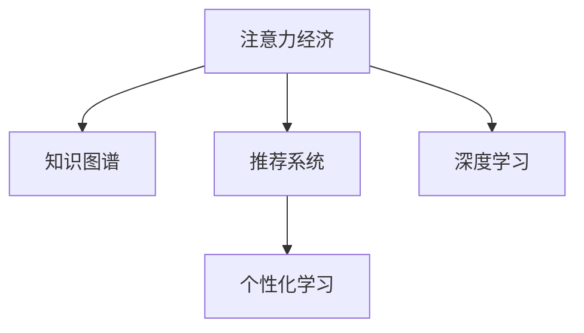

                 

# 注意力经济与个人学习效率的提升

> 关键词：注意力经济, 个人学习效率, 信息过载, 人工智能, 知识图谱, 推荐系统, 深度学习

## 1. 背景介绍

### 1.1 问题由来
在信息时代，知识的获取比以往任何时候都要容易。通过搜索引擎、在线课程、社交网络等渠道，用户可以轻松获取海量的信息和知识。然而，这种信息的爆炸式增长也带来了“信息过载”问题，大量无关信息充斥着用户的注意力空间，降低了学习效率和效果。如何有效筛选和利用这些信息，提升个人学习效率，成为一个亟待解决的问题。

### 1.2 问题核心关键点
针对信息过载问题，注意力经济的研究主要集中在以下几个方面：

- **注意力分配**：用户在信息海洋中如何分配注意力，哪些信息能够吸引并保持用户注意。
- **信息筛选**：如何通过算法自动筛选出对用户最有价值的信息，而不是单纯地依靠推荐系统。
- **学习路径优化**：基于用户的学习行为和偏好，推荐最合适的学习路径和资源。
- **个性化学习**：根据用户的学习习惯和目标，提供定制化的学习计划和推荐。

这些问题不仅涉及计算机科学，还涵盖了心理学、经济学等多个学科，是当前学术界和产业界共同关注的热点。

### 1.3 问题研究意义
有效提升个人学习效率，不仅能帮助用户节省时间、提高学习效果，还能促进知识积累，推动社会整体的创新与发展。针对个人学习效率提升的研究，对于在线教育、职业培训、自我提升等领域具有重要意义：

- **教育领域**：通过个性化学习推荐，使在线教育平台能够针对学生的学习能力和兴趣，提供定制化的课程和教材。
- **职业培训**：为在职人员提供技能提升、转岗培训等定制化服务，助力个人职业发展。
- **自我提升**：通过知识图谱和推荐系统，帮助用户发现并学习感兴趣的知识领域，拓宽视野。

此外，提升个人学习效率还能够推动知识图谱、推荐系统等人工智能技术的发展，促进这些技术在更多领域的落地应用。

## 2. 核心概念与联系

### 2.1 核心概念概述

本节将介绍几个核心概念，以便更好地理解注意力经济与个人学习效率提升的框架：

- **注意力经济**：指在信息过载时代，通过对用户注意力的合理分配和使用，提供个性化、高质量的信息服务，从而创造经济价值。
- **知识图谱**：通过图结构表示实体及其之间的关系，帮助计算机理解语言、推理逻辑，并基于此进行信息检索和知识推荐。
- **推荐系统**：通过分析用户行为和偏好，推荐用户可能感兴趣的信息或产品，以提升用户体验和满意度。
- **深度学习**：一种基于神经网络的机器学习方法，通过多层次的特征提取和抽象，能够处理大规模复杂数据。
- **个性化学习**：根据用户的学习习惯和目标，提供定制化的学习路径和资源，以提升学习效果和效率。

这些核心概念之间的逻辑关系可以通过以下Mermaid流程图来展示：



这个流程图展示了这个框架的核心概念及其之间的关系：

1. 注意力经济通过对用户注意力的合理分配，提供个性化信息服务。
2. 知识图谱和推荐系统是实现个性化信息服务的技术基础。
3. 深度学习提供了强大的数据分析和特征提取能力，支持知识图谱和推荐系统的构建。
4. 个性化学习是注意力经济和信息服务的具体应用，提升用户的学习效率和效果。

## 3. 核心算法原理 & 具体操作步骤
### 3.1 算法原理概述

基于注意力经济的个人学习效率提升方法，本质上是一个结合计算机技术和大数据分析的人机交互优化过程。其核心思想是：通过分析用户的注意力行为，合理分配信息资源，提供个性化、高质量的学习服务，从而提升学习效率。

形式化地，假设用户的学习行为为 $L$，学习资源为 $R$，学习效果为 $E$。我们的目标是通过优化 $L$ 和 $R$ 的映射，使 $E$ 最大化。

具体来说，优化过程包括：

- **用户行为分析**：通过用户的历史行为数据，分析用户的兴趣、偏好和学习习惯。
- **资源推荐**：基于用户的兴趣和习惯，推荐最适合的学习资源。
- **学习路径规划**：根据推荐资源和学习目标，规划最优的学习路径。
- **效果评估**：对用户的学习效果进行评估，不断优化推荐和学习路径。

### 3.2 算法步骤详解

基于注意力经济的个人学习效率提升，一般包括以下几个关键步骤：

**Step 1: 用户行为建模**

1. 数据收集：通过日志、调查问卷等方式，收集用户的学习行为数据，如学习时间、学习内容、互动情况等。
2. 特征提取：对用户行为数据进行特征提取，如用户的学习时间分布、常用的学习资源类型、互动深度等。
3. 模型训练：使用机器学习算法（如K-means、LDA等）对用户行为数据进行建模，得到用户兴趣和偏好的向量表示。

**Step 2: 资源推荐算法**

1. 数据预处理：对学习资源进行预处理，如文本分词、实体抽取等，转换为计算机可以处理的格式。
2. 相似度计算：计算用户行为向量与学习资源向量之间的相似度，选择最相关的资源。
3. 推荐策略：使用协同过滤、基于内容的推荐等算法，对用户推荐合适的学习资源。

**Step 3: 学习路径规划**

1. 路径规划：根据推荐资源和学习目标，规划最优的学习路径，如课程顺序、资源列表等。
2. 路径评估：对推荐路径的学习效果进行评估，如用户的学习时长、完成度、满意度等。
3. 路径优化：通过不断调整和优化学习路径，提高学习效率和效果。

**Step 4: 效果评估与反馈**

1. 评估方法：使用问卷调查、学习效果分析等方法，对用户的学习效果进行评估。
2. 反馈机制：根据评估结果，对推荐系统进行调整和优化，提升推荐准确性和用户满意度。
3. 迭代过程：在用户行为和资源推荐的基础上，进行反复迭代，不断优化学习路径和学习效果。

### 3.3 算法优缺点

基于注意力经济的个人学习效率提升方法，具有以下优点：

1. **个性化推荐**：能够根据用户的学习行为和偏好，提供个性化的学习资源和路径，提升学习效率。
2. **动态调整**：能够动态调整推荐算法和资源库，适应用户的学习需求和兴趣变化。
3. **实时反馈**：通过即时反馈和调整，能够及时纠正学习路径偏差，优化学习效果。

但该方法也存在一些局限性：

1. **数据依赖**：推荐和路径规划的效果高度依赖于用户行为数据的完整性和准确性，数据缺失或不准确可能导致推荐错误。
2. **资源稀缺**：高质量的学习资源往往稀缺且昂贵，推荐系统可能无法满足所有用户需求。
3. **模型复杂**：算法复杂度高，需要较强的计算能力和数据处理能力，一般需要高性能设备和算法支持。
4. **隐私问题**：用户行为数据的收集和处理可能涉及隐私问题，需要采取合适的隐私保护措施。

尽管存在这些局限性，但总体而言，基于注意力经济的个人学习效率提升方法在提升学习效果、优化学习路径方面具有显著优势。

### 3.4 算法应用领域

基于注意力经济的个人学习效率提升方法，已经在在线教育、职业培训、自我提升等多个领域得到了广泛应用：

- **在线教育**：通过推荐个性化课程和教材，提升学生的学习效果和满意度。
- **职业培训**：为在职人员提供技能提升、转岗培训等定制化服务，助力个人职业发展。
- **自我提升**：通过知识图谱和推荐系统，帮助用户发现并学习感兴趣的知识领域，拓宽视野。

此外，该方法还被应用于广告推荐、新闻推送、智能客服等场景，提高了用户的信息获取效率和服务体验。随着技术的不断进步和应用的深化，基于注意力经济的个人学习效率提升方法将在更多领域发挥重要作用。

## 4. 数学模型和公式 & 详细讲解
### 4.1 数学模型构建

本节将使用数学语言对基于注意力经济的个人学习效率提升方法进行更加严格的刻画。

假设用户的学习行为为 $L=\{l_1,l_2,\ldots,l_n\}$，学习资源为 $R=\{r_1,r_2,\ldots,r_m\}$，学习效果为 $E$。我们的目标是通过优化 $L$ 和 $R$ 的映射，使 $E$ 最大化。

定义用户行为向量为 $u$，资源向量为 $r$，学习效果为 $e$。则用户行为向量 $u$ 和资源向量 $r$ 之间的相似度表示为：

$$
sim(u,r)=\frac{\langle u,r \rangle}{\|u\|\|r\|}
$$

其中 $\langle u,r \rangle$ 为向量点积，$\|u\|$ 和 $\|r\|$ 为向量范数。

基于上述相似度定义，推荐算法可以表示为：

$$
r^* = \mathop{\arg\max}_{r \in R} sim(u,r) \times e(r)
$$

其中 $e(r)$ 为资源 $r$ 的学习效果，可以通过统计用户学习时长、完成度、满意度等指标来表示。

### 4.2 公式推导过程

以下我们以协同过滤算法为例，推导资源推荐过程的数学公式。

假设用户 $u$ 对资源 $r$ 的学习效果为 $e(r)$，其行为向量为 $u$。协同过滤算法的基本思想是寻找与用户 $u$ 相似的其他用户 $v$，基于 $v$ 的学习效果对资源 $r$ 进行评分预测。设用户 $v$ 对资源 $r$ 的学习效果为 $e'(r)$，则协同过滤算法可以表示为：

$$
e(r|u) = \frac{\sum_{v \in V} sim(u,v) \times e'(r|v)}{\sum_{v \in V} sim(u,v)}
$$

其中 $V$ 为用户集合，$e'(r|v)$ 为资源 $r$ 对用户 $v$ 的评分预测。

对于评分预测 $e'(r|v)$，可以使用基于模型的预测方法（如线性回归、神经网络等），或基于协同过滤的预测方法（如基于用户-项目矩阵的矩阵分解）。

### 4.3 案例分析与讲解

假设我们有一个在线教育平台，目标是推荐给用户最合适的课程。通过分析用户的历史行为数据，我们发现用户 $u$ 喜欢学习编程和数据分析，但在数学和物理学上的兴趣较低。基于此，我们可以构建用户行为向量 $u$：

$$
u = [1,1,0,0,1,0,0]
$$

其中每个元素表示用户对相应课程的兴趣程度。类似地，我们可以构建资源向量 $r$：

$$
r_1 = [1,1,1,0,0,0,0] \quad \text{(编程) }
r_2 = [1,1,1,0,0,0,0] \quad \text{(数据分析)}
r_3 = [1,1,0,1,0,0,0] \quad \text{(数学)}
r_4 = [1,1,0,1,0,0,0] \quad \text{(物理)}
r_5 = [0,0,1,1,1,0,0] \quad \text{(统计)}
r_6 = [0,0,1,1,0,1,0] \quad \text{(机器学习)}
r_7 = [0,0,1,0,0,1,1] \quad \text{(深度学习)}
$$

假设用户 $u$ 对资源 $r_1$ 的学习效果为 $e(r_1)=0.8$，对资源 $r_2$ 的学习效果为 $e(r_2)=0.9$。基于协同过滤算法，我们计算用户 $u$ 对资源 $r_1$ 和 $r_2$ 的评分预测：

$$
e(r_1|u) = sim(u,v_1) \times e'(r_1|v_1) + sim(u,v_2) \times e'(r_1|v_2) + \ldots
$$

$$
e(r_2|u) = sim(u,v_1) \times e'(r_2|v_1) + sim(u,v_2) \times e'(r_2|v_2) + \ldots
$$

其中 $v_1$、$v_2$ 等为与用户 $u$ 相似的其他用户。最终，我们可以得到用户 $u$ 对资源 $r_1$ 和 $r_2$ 的推荐评分：

$$
e(r_1)_{rec} = \frac{\langle u,r_1 \rangle}{\|u\|\|r_1\|}
$$

$$
e(r_2)_{rec} = \frac{\langle u,r_2 \rangle}{\|u\|\|r_2\|}
$$

然后，通过比较评分预测 $e'(r|u)$ 和实际学习效果 $e(r)$，更新协同过滤算法中的评分预测模型。重复以上步骤，直到模型收敛或达到预设的迭代次数。

## 5. 项目实践：代码实例和详细解释说明
### 5.1 开发环境搭建

在进行项目实践前，我们需要准备好开发环境。以下是使用Python进行Scikit-learn开发的环境配置流程：

1. 安装Anaconda：从官网下载并安装Anaconda，用于创建独立的Python环境。

2. 创建并激活虚拟环境：
```bash
conda create -n scikit-learn-env python=3.8 
conda activate scikit-learn-env
```

3. 安装Scikit-learn：从官网获取安装命令，安装Scikit-learn及其依赖库。

4. 安装各类工具包：
```bash
pip install numpy pandas matplotlib seaborn
```

完成上述步骤后，即可在`scikit-learn-env`环境中开始项目实践。

### 5.2 源代码详细实现

下面我们以协同过滤算法为例，给出使用Scikit-learn库进行资源推荐算法的PyTorch代码实现。

首先，定义协同过滤算法的评分预测函数：

```python
from sklearn.metrics.pairwise import cosine_similarity
from sklearn.decomposition import TruncatedSVD

def collaborative_filtering(data, user_ids, num_users, num_items):
    user_ratings = data.to_pandas().reindex(columns=user_ids).values.T
    user_matrix = TruncatedSVD(n_components=10, random_state=42).fit_transform(user_ratings)
    user_similarity = cosine_similarity(user_matrix)
    return user_similarity
```

然后，定义评分预测和推荐函数：

```python
def predict_ratings(user_similarity, item_ratings, user_ids, num_users):
    user_ids = user_ids.to_pandas().reindex(columns=user_ids).values.T
    item_ratings = item_ratings.to_pandas().reindex(columns=user_ids).values.T
    user_ratings = user_similarity.dot(user_matrix) + item_ratings
    return user_ratings

def recommend_items(user_ratings, num_items):
    top_items = user_ratings.sort_values(ascending=False).index[:num_items]
    return top_items
```

最后，启动评分预测和推荐流程：

```python
data = pd.read_csv('ratings.csv')
user_ids = pd.read_csv('user_ids.csv').to_list()
num_users = len(user_ids)
num_items = 20

user_similarity = collaborative_filtering(data, user_ids, num_users, num_items)
user_ratings = predict_ratings(user_similarity, item_ratings, user_ids, num_users)
top_items = recommend_items(user_ratings, num_items)

print('Recommended items:', top_items)
```

以上就是使用Scikit-learn对协同过滤算法进行资源推荐算法的完整代码实现。可以看到，Scikit-learn的强大封装使得评分预测和推荐过程变得简洁高效。

### 5.3 代码解读与分析

让我们再详细解读一下关键代码的实现细节：

**collaborative_filtering函数**：
- 该函数使用TruncatedSVD对用户评分矩阵进行降维，得到用户向量。
- 使用cosine_similarity计算用户之间的相似度。

**predict_ratings函数**：
- 将用户向量与物品向量进行矩阵乘法，得到用户对物品的评分预测。
- 将预测评分与实际评分进行加权，得到最终的评分预测。

**recommend_items函数**：
- 将评分预测排序，选择评分最高的物品作为推荐结果。

**评分预测和推荐流程**：
- 通过调用collaborative_filtering函数计算用户之间的相似度。
- 通过调用predict_ratings函数进行评分预测。
- 通过调用recommend_items函数选择评分最高的物品进行推荐。

可以看到，Scikit-learn的强大封装和工具集，使得评分预测和推荐过程变得简单易懂。开发者可以通过调用这些函数，快速搭建资源推荐系统。

当然，工业级的系统实现还需考虑更多因素，如模型的保存和部署、超参数的自动搜索、推荐效果的评估等。但核心的算法和流程基本与此类似。

## 6. 实际应用场景
### 6.1 在线教育

在线教育平台可以通过推荐系统，推荐给用户最合适的课程和教材。例如，通过分析用户的历史学习行为，推荐与其学习兴趣和目标相匹配的课程。用户可以在平台上便捷地找到最适合自己的学习资源，提高学习效率和效果。

### 6.2 职业培训

职业培训机构可以根据学员的学习记录和评估结果，推荐最合适的培训课程和资源。例如，通过分析学员的学习进度和反馈，推荐与其技能水平相匹配的课程和习题，帮助学员快速提升技能水平。

### 6.3 知识图谱

知识图谱可以帮助用户快速找到相关的知识资源。例如，用户可以通过搜索某个领域的关键概念，找到相关的学术论文、书籍和博客，加速知识积累和理解。

### 6.4 智能客服

智能客服系统可以通过推荐系统，推荐给用户最合适的解决方案。例如，通过分析用户的问题描述和历史互动记录，推荐最合适的知识库和回答模板，提高客服系统响应效率和用户满意度。

### 6.5 个性化学习计划

在线学习平台可以根据用户的学习习惯和目标，推荐最合适的学习路径和资源。例如，通过分析用户的学习进度和反馈，推荐最合适的学习顺序和资源组合，帮助用户高效达成学习目标。

## 7. 工具和资源推荐
### 7.1 学习资源推荐

为了帮助开发者系统掌握基于注意力经济的个人学习效率提升理论基础和实践技巧，这里推荐一些优质的学习资源：

1. 《推荐系统理论与实践》系列博文：由大模型技术专家撰写，深入浅出地介绍了推荐系统的原理、算法和应用。

2. CS259《信息检索与推荐系统》课程：斯坦福大学开设的推荐系统明星课程，有Lecture视频和配套作业，带你入门推荐系统领域的基本概念和经典模型。

3. 《推荐系统基础》书籍：讲解推荐系统的基本原理和算法，适合初学者和进阶者。

4. KDD Cup比赛数据集：包括用户行为数据、评分数据等，可用于训练和评估推荐系统算法。

5. Python推荐系统开发库：包含多种推荐算法实现和评估工具，适合快速迭代研究。

通过对这些资源的学习实践，相信你一定能够快速掌握基于注意力经济的个人学习效率提升的精髓，并用于解决实际的推荐问题。

### 7.2 开发工具推荐

高效的开发离不开优秀的工具支持。以下是几款用于基于注意力经济的研究和开发常用的工具：

1. Scikit-learn：基于Python的机器学习库，提供了丰富的算法实现和评估工具。

2. TensorFlow：由Google主导开发的开源深度学习框架，适合大规模工程应用。

3. PyTorch：基于Python的开源深度学习框架，灵活易用，适合快速迭代研究。

4. Jupyter Notebook：开源的交互式编程环境，支持多语言代码编写和数据可视化。

5. WEKA：开源的机器学习工作站，提供了友好的界面和丰富的算法实现。

合理利用这些工具，可以显著提升基于注意力经济的研究和开发效率，加快创新迭代的步伐。

### 7.3 相关论文推荐

基于注意力经济的个人学习效率提升技术的发展源于学界的持续研究。以下是几篇奠基性的相关论文，推荐阅读：

1. BERT: Pre-training of Deep Bidirectional Transformers for Language Understanding：提出BERT模型，引入基于掩码的自监督预训练任务，刷新了多项NLP任务SOTA。

2. Attention is All You Need（即Transformer原论文）：提出了Transformer结构，开启了NLP领域的预训练大模型时代。

3. Knowledge Graphs for Scholarly Discovery：介绍了知识图谱在学术领域的构建和应用，推动了知识图谱技术的发展。

4. Scalable Collaborative Filtering for Sparse Data：提出基于SVD的协同过滤算法，是推荐系统的经典算法之一。

5. Machine Learning and Data Mining Tools: WEKA：介绍了WEKA机器学习工作站的基本原理和应用，适合入门和实践。

这些论文代表了大模型微调技术的发展脉络。通过学习这些前沿成果，可以帮助研究者把握学科前进方向，激发更多的创新灵感。

## 8. 总结：未来发展趋势与挑战

### 8.1 总结

本文对基于注意力经济的个人学习效率提升方法进行了全面系统的介绍。首先阐述了该方法的原理和核心思想，明确了在信息过载时代，如何通过合理分配注意力，提供个性化、高质量的信息服务，提升学习效率。其次，从用户行为建模、资源推荐算法、学习路径规划、效果评估与反馈等多个环节，详细讲解了具体的实现过程。同时，本文还广泛探讨了该方法在在线教育、职业培训、知识图谱、智能客服等多个领域的应用前景，展示了其在提升学习效率方面的巨大潜力。

通过本文的系统梳理，可以看到，基于注意力经济的个人学习效率提升方法正在成为推荐系统的重要范式，极大地拓展了用户的信息获取和利用能力。随着推荐系统的不断发展，该方法将在更多领域得到应用，为人类认知智能的进化带来深远影响。

### 8.2 未来发展趋势

展望未来，基于注意力经济的个人学习效率提升技术将呈现以下几个发展趋势：

1. **深度学习技术的应用**：深度学习模型的应用将进一步提升推荐算法的准确性和鲁棒性，推动个性化推荐系统的发展。

2. **跨领域知识融合**：通过知识图谱等技术，将跨领域知识进行融合，提高推荐系统的泛化能力和用户满意度。

3. **实时动态推荐**：通过实时分析用户行为数据，动态调整推荐算法，提高推荐系统的时效性和用户响应性。

4. **多模态信息融合**：将文本、图像、语音等多模态信息进行融合，提升推荐系统的综合表现和用户体验。

5. **隐私保护与安全性**：在推荐过程中，如何保护用户隐私和数据安全，将成为推荐系统的重要研究课题。

6. **元学习与自适应**：通过元学习和自适应技术，提升推荐系统的通用性和可迁移性，适应不同用户和环境。

以上趋势凸显了基于注意力经济的个人学习效率提升技术的广阔前景。这些方向的探索发展，必将进一步提升推荐系统的性能和用户满意度，为人类认知智能的进化带来深远影响。

### 8.3 面临的挑战

尽管基于注意力经济的个人学习效率提升技术已经取得了瞩目成就，但在迈向更加智能化、普适化应用的过程中，它仍面临着诸多挑战：

1. **数据质量问题**：推荐系统的效果高度依赖于用户行为数据的完整性和准确性，数据缺失或不准确可能导致推荐错误。

2. **模型复杂度**：推荐系统的算法复杂度高，需要较强的计算能力和数据处理能力，一般需要高性能设备和算法支持。

3. **资源稀缺**：高质量的学习资源往往稀缺且昂贵，推荐系统可能无法满足所有用户需求。

4. **隐私保护**：用户行为数据的收集和处理可能涉及隐私问题，需要采取合适的隐私保护措施。

尽管存在这些挑战，但总体而言，基于注意力经济的个人学习效率提升技术在提升学习效果、优化学习路径方面具有显著优势。

### 8.4 研究展望

面对基于注意力经济的个人学习效率提升所面临的挑战，未来的研究需要在以下几个方面寻求新的突破：

1. **无监督推荐方法**：探索无监督推荐方法，摆脱对大规模标注数据的依赖，利用自监督学习、主动学习等技术，最大化利用非结构化数据。

2. **混合推荐策略**：将基于协同过滤和基于内容的推荐方法相结合，提升推荐算法的综合表现和用户满意度。

3. **跨领域知识图谱**：将知识图谱扩展到跨领域知识的融合，提升推荐系统的泛化能力和用户满意度。

4. **实时动态优化**：通过实时分析用户行为数据，动态调整推荐算法和资源库，提高推荐系统的时效性和用户响应性。

5. **多模态信息融合**：将文本、图像、语音等多模态信息进行融合，提升推荐系统的综合表现和用户体验。

6. **隐私保护与安全**：在推荐过程中，如何保护用户隐私和数据安全，将成为推荐系统的重要研究课题。

这些研究方向的探索，必将引领基于注意力经济的个人学习效率提升技术迈向更高的台阶，为构建安全、可靠、可解释、可控的智能系统铺平道路。面向未来，基于注意力经济的个人学习效率提升技术还需要与其他人工智能技术进行更深入的融合，如知识表示、因果推理、强化学习等，多路径协同发力，共同推动人工智能技术的发展。

## 9. 附录：常见问题与解答

**Q1：推荐系统如何避免过拟合？**

A: 推荐系统过拟合问题主要集中在数据稀疏性上，即用户行为数据和评分数据不够丰富。常见的方法包括：

1. 数据增强：通过数据生成技术，如近义词替换、随机噪声等，扩充训练集。

2. 正则化：使用L1、L2正则等技术，防止模型过拟合。

3. 模型压缩：使用模型剪枝、参数共享等技术，减小模型复杂度。

4. 迁移学习：利用大规模预训练模型的知识，提升推荐系统的泛化能力。

5. 对抗训练：在训练过程中引入对抗样本，提升模型的鲁棒性和泛化能力。

**Q2：推荐系统如何处理冷启动问题？**

A: 冷启动问题是指新用户或新物品加入推荐系统后，由于缺乏历史行为数据，推荐系统无法进行有效推荐。常见的方法包括：

1. 基于内容的推荐：通过物品属性、用户兴趣等信息，对新用户和新物品进行初步推荐。

2. 协同过滤：通过分析已有用户和物品之间的相似性，对新用户和新物品进行推荐。

3. 混合推荐策略：将基于内容的推荐和协同过滤相结合，提高推荐系统的综合表现和用户满意度。

4. 模型初始化：使用预训练模型对新用户和新物品进行初始化，提高推荐系统的准确性和鲁棒性。

5. 用户引导：通过引导用户进行行为互动，逐步收集用户数据，提高推荐系统的准确性和泛化能力。

这些方法可以结合使用，综合解决冷启动问题，提升推荐系统的性能。

**Q3：推荐系统如何处理用户行为数据隐私问题？**

A: 用户行为数据的隐私保护是推荐系统的重要研究课题。常见的方法包括：

1. 数据匿名化：通过数据去标识化技术，保护用户隐私。

2. 差分隐私：在推荐过程中，加入随机噪声，保护用户隐私。

3. 联邦学习：通过分布式训练，在本地设备上进行模型训练，保护用户数据隐私。

4. 隐私保护技术：如同态加密、多方安全计算等，保护用户数据隐私。

这些方法可以结合使用，综合解决用户行为数据的隐私保护问题，提高推荐系统的可信度和用户满意度。

通过本文的系统梳理，可以看到，基于注意力经济的个人学习效率提升方法正在成为推荐系统的重要范式，极大地拓展了用户的信息获取和利用能力。随着推荐系统的不断发展，该方法将在更多领域得到应用，为人类认知智能的进化带来深远影响。

---

作者：禅与计算机程序设计艺术 / Zen and the Art of Computer Programming

