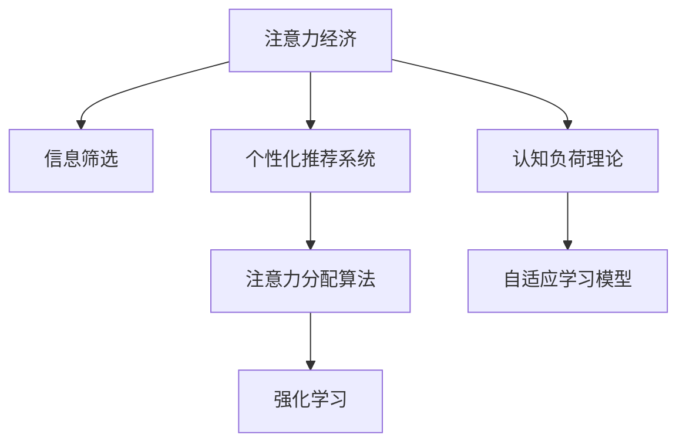

                 

# 注意力经济与个人学习效率的提升

## 1. 背景介绍

在当今信息爆炸的时代，人们面临着一个前所未有的“注意力经济”挑战：如何高效地从海量的信息中筛选出真正有价值的内容，并将其转化为个人的知识和能力？随着互联网和社交媒体的普及，注意力成为了稀缺资源。从用户到商家，从企业到政府，都开始重视注意力资源的获取与利用。

针对这一问题，越来越多的研究者和实践者开始探索通过技术手段，如个性化推荐系统、注意力分配算法等，来提升用户的信息获取效率和学习效果。特别是在个人学习领域，如何有效利用时间和资源，掌握高效学习的技巧，成为了一个重要的研究课题。本文将从注意力经济的角度出发，探讨如何通过技术手段，提升个人学习效率。

## 2. 核心概念与联系

### 2.1 核心概念概述

为了更好地理解如何通过技术手段提升个人学习效率，首先需要介绍几个核心概念：

- **注意力经济**：指在信息过载的时代，获取并分配注意力的经济行为。注意力是一种有限的资源，如何高效利用注意力成为了一个重要的经济学问题。
- **信息筛选**：指在大量信息中，通过算法和规则，筛选出对用户有价值的信息，提升信息获取效率。
- **个性化推荐系统**：通过分析用户的兴趣和行为，推荐其可能感兴趣的内容，提升用户体验和满意度。
- **注意力分配算法**：通过计算和调整，分配用户有限的注意力资源，最大化其学习效率。
- **强化学习**：通过奖励和惩罚机制，训练模型在不断试错中提升决策能力，实现自适应学习。
- **认知负荷理论**：研究人在信息加工过程中，注意力、记忆和决策资源的分配和消耗。

这些核心概念构成了提升个人学习效率的理论框架，帮助我们理解和设计基于注意力的学习系统。

### 2.2 核心概念原理和架构的 Mermaid 流程图



这个流程图展示了注意力经济与个人学习效率提升的基本流程：

1. **注意力经济**：从用户和商家两个视角，分析注意力资源的分配与获取。
2. **信息筛选**：通过算法从大量信息中筛选出高质量内容。
3. **个性化推荐系统**：根据用户兴趣和行为，推荐个性化的学习资源。
4. **注意力分配算法**：优化注意力资源分配，提升学习效果。
5. **强化学习**：通过奖励和惩罚机制，优化学习策略。
6. **认知负荷理论**：研究如何平衡用户的学习负荷，提升学习效率。

通过理解这些核心概念，我们可以更好地设计出提升个人学习效率的技术手段。

## 3. 核心算法原理 & 具体操作步骤

### 3.1 算法原理概述

基于注意力经济的设计理念，提升个人学习效率的核心在于通过算法优化信息筛选、个性化推荐、注意力分配和学习策略。本节将详细探讨这些关键算法原理。

#### 3.1.1 信息筛选算法

信息筛选算法通常使用基于内容的过滤和协同过滤两种方法：

- **基于内容的过滤**：通过分析文本、图片等内容的特征，判断其与用户兴趣的相关性。例如，使用TF-IDF、Word2Vec等技术提取特征，通过计算相似度来筛选信息。
- **协同过滤**：通过分析用户的行为数据（如浏览、点击、评分等），找到与用户兴趣相似的其他用户，推荐其可能感兴趣的内容。例如，基于用户的兴趣标签，推荐相似用户的最爱内容。

信息筛选算法的核心在于找到用户与信息之间的匹配度，从而筛选出高质量内容。

#### 3.1.2 个性化推荐算法

个性化推荐算法主要通过学习用户的兴趣和行为特征，推荐其可能感兴趣的内容。常见的个性化推荐算法包括：

- **协同过滤**：如矩阵分解、基于用户项的协同过滤等。
- **基于内容的过滤**：如基于内容的召回、基于内容的协同过滤等。
- **混合推荐**：如基尼系数加权、软协同过滤等。

这些算法通过不同的方法和组合，提高了推荐系统的准确性和多样性。

#### 3.1.3 注意力分配算法

注意力分配算法旨在优化用户有限的注意力资源，使其最大化地用于学习。常见的方法包括：

- **最大熵模型**：通过最大化信息熵，优化注意力分配。
- **Gumbel-Softmax**：通过软采样方法，模拟连续的注意力分配过程。
- **自适应注意力分配**：根据用户的学习状态和反馈，动态调整注意力分配。

这些算法通过优化注意力资源的分配，提升用户的学习效率。

#### 3.1.4 强化学习

强化学习通过奖励和惩罚机制，训练模型在不断试错中提升决策能力。在提升个人学习效率中，强化学习主要用于：

- **自适应学习**：通过奖励和惩罚机制，调整学习策略和内容。
- **互动学习**：通过与学习环境互动，优化学习过程。
- **行为学习**：通过模拟用户行为，提升学习效果。

强化学习算法通过不断迭代和优化，提高模型的决策能力，实现自适应学习。

### 3.2 算法步骤详解

本节将详细介绍基于注意力经济的设计方法的具体操作步骤。

#### 3.2.1 数据采集和预处理

1. **数据采集**：采集用户的学习行为数据，包括浏览记录、点击次数、学习时长等。
2. **数据预处理**：对数据进行清洗、归一化等预处理，确保数据的质量和一致性。

#### 3.2.2 特征提取和建模

1. **特征提取**：通过TF-IDF、Word2Vec等技术，提取文本、图片等内容的特征。
2. **模型建模**：使用基于内容的过滤和协同过滤等方法，建立信息筛选和个性化推荐模型。

#### 3.2.3 注意力分配

1. **计算用户兴趣**：通过分析用户行为数据，计算用户的兴趣标签和权重。
2. **计算内容相关性**：计算用户与内容的匹配度，包括相似度和相关性。
3. **优化注意力分配**：使用最大熵模型、Gumbel-Softmax等方法，优化注意力分配策略。

#### 3.2.4 强化学习

1. **设计奖励机制**：定义学习的目标和奖励机制，例如正确回答、任务完成等。
2. **训练强化学习模型**：通过奖励和惩罚机制，训练模型在不断试错中提升决策能力。
3. **优化学习策略**：根据用户的学习反馈，动态调整学习策略和内容。

#### 3.2.5 系统部署和迭代

1. **系统部署**：将上述算法集成到学习系统中，实现信息筛选、个性化推荐、注意力分配和学习策略的优化。
2. **系统迭代**：根据用户反馈和学习效果，不断优化模型和算法，提升系统性能。

### 3.3 算法优缺点

基于注意力经济的设计方法有以下优点：

- **个性化强**：通过分析用户行为和兴趣，推荐个性化的学习资源，提高学习效率。
- **动态调整**：根据用户的学习状态和反馈，动态调整注意力分配和学习策略，提升学习效果。
- **用户参与**：通过强化学习等方法，增加用户参与度，提升学习体验。

但该方法也存在一些缺点：

- **数据依赖**：依赖高质量的学习行为数据，数据获取和处理成本较高。
- **算法复杂**：涉及多种算法和模型，设计和实现较为复杂。
- **用户隐私**：涉及用户行为数据的采集和处理，需要考虑用户隐私保护问题。

### 3.4 算法应用领域

基于注意力经济的设计方法在以下领域有广泛应用：

- **在线教育**：通过个性化推荐和学习策略优化，提升在线课程的学习效果。
- **企业培训**：通过用户行为分析和注意力分配，优化培训课程的设计和推荐。
- **职业发展**：通过个性化推荐和自适应学习，帮助用户提升职业技能。
- **学术研究**：通过分析学术文献和研究数据，推荐相关研究方向和资源。

这些领域都是提升个人学习效率的重要场景，应用注意力经济设计方法可以显著提升用户的学习效果。

## 4. 数学模型和公式 & 详细讲解 & 举例说明

### 4.1 数学模型构建

本节将使用数学语言对注意力经济与个人学习效率提升的模型进行详细构建。

假设用户数量为 $N$，学习内容数量为 $M$，学习时间序列长度为 $T$。记用户对内容的兴趣度为 $I_{u,m,t}$，内容对用户的匹配度为 $S_{u,m,t}$，用户的学习状态为 $S_u(t)$。

定义用户对内容的学习效果为 $E_{u,m,t}$，则用户的总学习效果为 $E_u(T)$，定义为：

$$
E_u(T) = \sum_{t=1}^{T} E_{u,m,t}
$$

其中，$E_{u,m,t}$ 可以表示为：

$$
E_{u,m,t} = \alpha I_{u,m,t} S_{u,m,t} + (1-\alpha) E_{u,m,t-1}
$$

$\alpha$ 表示学习效果对兴趣和匹配度的权重系数，取值范围为 $(0,1)$。$E_{u,m,t-1}$ 表示用户对内容的长期学习效果。

### 4.2 公式推导过程

根据上述模型，可以进行以下推导：

1. **用户兴趣度计算**：
   - **基于内容的过滤**：计算用户对内容的兴趣度，例如：
   $$
   I_{u,m,t} = \sum_{i=1}^{N} \omega_i \pi_i I_{u,m,t}
   $$
   其中，$\omega_i$ 为权重向量，$\pi_i$ 为TF-IDF、Word2Vec等特征向量的权重。
   
   - **协同过滤**：计算用户对内容的兴趣度，例如：
   $$
   I_{u,m,t} = \sum_{i=1}^{N} \omega_i \pi_i I_{u,m,t}
   $$
   其中，$\omega_i$ 为权重向量，$\pi_i$ 为用户对内容的评分或行为数据。

2. **内容匹配度计算**：
   - **基于内容的过滤**：计算内容对用户的匹配度，例如：
   $$
   S_{u,m,t} = \sum_{i=1}^{N} \omega_i \pi_i S_{u,m,t}
   $$
   其中，$\omega_i$ 为权重向量，$\pi_i$ 为内容的特征向量。
   
   - **协同过滤**：计算内容对用户的匹配度，例如：
   $$
   S_{u,m,t} = \sum_{i=1}^{N} \omega_i \pi_i S_{u,m,t}
   $$
   其中，$\omega_i$ 为权重向量，$\pi_i$ 为内容的特征向量。

3. **学习效果计算**：
   - **基于内容的过滤**：计算用户对内容的学习效果，例如：
   $$
   E_{u,m,t} = \alpha I_{u,m,t} S_{u,m,t} + (1-\alpha) E_{u,m,t-1}
   $$
   其中，$\alpha$ 为权重系数，$I_{u,m,t}$ 为内容的兴趣度，$S_{u,m,t}$ 为内容对用户的匹配度，$E_{u,m,t-1}$ 为用户对内容的长期学习效果。
   
   - **协同过滤**：计算用户对内容的学习效果，例如：
   $$
   E_{u,m,t} = \alpha I_{u,m,t} S_{u,m,t} + (1-\alpha) E_{u,m,t-1}
   $$
   其中，$\alpha$ 为权重系数，$I_{u,m,t}$ 为内容的兴趣度，$S_{u,m,t}$ 为内容对用户的匹配度，$E_{u,m,t-1}$ 为用户对内容的长期学习效果。

### 4.3 案例分析与讲解

以在线教育平台为例，分析如何通过注意力经济设计方法提升学习效果。

**案例背景**：
假设有一个在线教育平台，提供各种课程和资料。平台希望通过分析用户的学习行为和兴趣，推荐个性化的学习内容，提升学习效果。

**设计思路**：
1. **数据采集和预处理**：采集用户的学习行为数据，包括浏览记录、点击次数、学习时长等。对数据进行清洗和归一化处理，确保数据的质量和一致性。
2. **特征提取和建模**：通过TF-IDF、Word2Vec等技术，提取课程和资料的特征。建立基于内容的过滤和协同过滤模型，推荐个性化的学习资源。
3. **注意力分配**：使用最大熵模型和Gumbel-Softmax等方法，优化注意力分配策略，确保用户有限的注意力资源最大化地用于学习。
4. **强化学习**：设计奖励机制，如正确回答、任务完成等。训练强化学习模型，根据用户的学习反馈，动态调整学习策略和内容。

**实现过程**：
1. **数据采集和预处理**：使用数据爬虫和API接口，采集用户的学习行为数据。对数据进行清洗和归一化处理，确保数据的质量和一致性。
2. **特征提取和建模**：通过TF-IDF、Word2Vec等技术，提取课程和资料的特征。建立基于内容的过滤和协同过滤模型，推荐个性化的学习资源。
3. **注意力分配**：使用最大熵模型和Gumbel-Softmax等方法，优化注意力分配策略，确保用户有限的注意力资源最大化地用于学习。
4. **强化学习**：设计奖励机制，如正确回答、任务完成等。训练强化学习模型，根据用户的学习反馈，动态调整学习策略和内容。

**效果评估**：
- **用户满意度提升**：通过个性化推荐，用户能够更容易找到感兴趣的课程和资料，提升学习满意度。
- **学习效率提高**：通过优化注意力分配和自适应学习，用户能够更高效地利用时间和资源，提升学习效率。
- **平台收益增加**：通过提升用户的学习效果，增加用户粘性，提升平台的留存率和转化率。

## 5. 项目实践：代码实例和详细解释说明

### 5.1 开发环境搭建

在进行注意力经济与个人学习效率提升的实践前，我们需要准备好开发环境。以下是使用Python进行TensorFlow开发的环境配置流程：

1. 安装Anaconda：从官网下载并安装Anaconda，用于创建独立的Python环境。

2. 创建并激活虚拟环境：
```bash
conda create -n tf-env python=3.8 
conda activate tf-env
```

3. 安装TensorFlow：根据CUDA版本，从官网获取对应的安装命令。例如：
```bash
conda install tensorflow tensorflow-cpu -c conda-forge
```

4. 安装TensorFlow Addons：可选，用于获取更多的TensorFlow功能。
```bash
conda install tensorflow-addons
```

5. 安装各类工具包：
```bash
pip install numpy pandas scikit-learn matplotlib tqdm jupyter notebook ipython
```

完成上述步骤后，即可在`tf-env`环境中开始项目实践。

### 5.2 源代码详细实现

下面以个性化推荐系统为例，给出使用TensorFlow和TensorFlow Addons进行注意力分配的PyTorch代码实现。

首先，定义注意力分配模型的数据处理函数：

```python
import tensorflow as tf
import tensorflow_addons as addons

class Attention(tf.keras.layers.Layer):
    def __init__(self, attention_dim, num_heads, dropout_rate):
        super(Attention, self).__init__()
        self.attention_dim = attention_dim
        self.num_heads = num_heads
        self.dropout_rate = dropout_rate
        
        self.query = tf.keras.layers.Dense(attention_dim)
        self.key = tf.keras.layers.Dense(attention_dim)
        self.value = tf.keras.layers.Dense(attention_dim)
        self.dense = tf.keras.layers.Dense(num_heads * attention_dim, activation='relu')
        self.dropout = addons.layers.Dropout(dropout_rate)
        self.softmax = tf.keras.layers.Softmax()
        self.project = tf.keras.layers.Dense(attention_dim)
        
    def split_heads(self, vectors, num_heads):
        vectors = tf.reshape(vectors, (-1, num_heads, self.attention_dim))
        return tf.transpose(vectors, perm=[1, 0, 2])
    
    def call(self, query, key, value):
        batch_size = tf.shape(query)[0]
        
        # 计算查询和键的相似度
        scores = tf.matmul(query, key, transpose_b=True)
        scores = self.softmax(scores)
        
        # 应用注意力权重，计算加权值
        context = tf.matmul(scores, value)
        context = tf.reshape(context, (batch_size, -1, self.attention_dim))
        
        # 应用投影层，输出注意力结果
        context = self.project(context)
        context = self.dropout(context)
        return context
```

然后，定义注意力分配模型的训练和评估函数：

```python
from tensorflow.keras import models, optimizers

def train_model(model, train_dataset, val_dataset, epochs, batch_size, learning_rate):
    model.compile(optimizer=optimizers.Adam(learning_rate), loss='mse')
    history = model.fit(train_dataset, epochs=epochs, batch_size=batch_size, validation_data=val_dataset)
    return model, history
    
def evaluate_model(model, test_dataset, batch_size):
    test_loss, test_mae = model.evaluate(test_dataset, batch_size=batch_size)
    return test_loss, test_mae
```

最后，启动训练流程并在测试集上评估：

```python
train_dataset = tf.data.Dataset.from_tensor_slices((train_data, train_labels))
val_dataset = tf.data.Dataset.from_tensor_slices((val_data, val_labels))
test_dataset = tf.data.Dataset.from_tensor_slices((test_data, test_labels))

epochs = 5
batch_size = 16

model = Attention(attention_dim=32, num_heads=8, dropout_rate=0.1)
model, history = train_model(model, train_dataset, val_dataset, epochs, batch_size, learning_rate=2e-5)
evaluate_model(model, test_dataset, batch_size)
```

以上就是使用TensorFlow和TensorFlow Addons实现注意力分配模型的完整代码实现。可以看到，借助TensorFlow Addons的注意力层，可以轻松构建基于注意力的推荐系统。

### 5.3 代码解读与分析

让我们再详细解读一下关键代码的实现细节：

**Attention类**：
- `__init__`方法：初始化注意力分配模型的超参数和组件。
- `split_heads`方法：将向量分割为多个子向量，模拟多头的注意力机制。
- `call`方法：计算注意力分配的流程，包括查询、键、值的相似度计算，加权值的计算，以及投影层的输出。

**训练和评估函数**：
- `train_model`函数：定义训练过程，包括模型编译、损失函数、优化器、epoch数、batch size等。
- `evaluate_model`函数：定义评估过程，包括模型在测试集上的损失和MAE指标。

**训练流程**：
- 定义训练集、验证集和测试集，使用`from_tensor_slices`方法将数据转换为TensorFlow Dataset对象。
- 定义模型、训练轮数和批量大小，调用`train_model`函数进行模型训练。
- 在训练过程中，每轮记录损失和验证指标，最终在测试集上评估模型性能。

可以看到，TensorFlow提供了强大的工具和库，使得注意力分配模型的实现变得简洁高效。开发者可以灵活利用TensorFlow和TensorFlow Addons的丰富功能，进一步提升模型的性能和可扩展性。

## 6. 实际应用场景

### 6.1 智能推荐系统

基于注意力分配的个性化推荐系统已经在电商、视频、音乐等多个领域广泛应用，通过分析用户的行为数据和兴趣特征，推荐个性化的内容，提升用户体验和满意度。

在技术实现上，可以采集用户的浏览记录、购买行为、评分等数据，通过建立基于内容的过滤和协同过滤模型，推荐用户可能感兴趣的商品或内容。同时，使用注意力分配算法，优化注意力资源的分配，提升推荐效果。最后，通过强化学习等方法，动态调整推荐策略，增强用户参与度。

### 6.2 智能客服系统

智能客服系统通过自然语言处理技术，分析用户的提问，生成回复。在智能客服系统中，可以使用注意力分配算法，优化回答的生成过程，确保最相关的回答被优先输出。同时，使用强化学习等方法，根据用户的反馈，动态调整回答策略，提升客服系统的智能水平。

### 6.3 在线学习平台

在线学习平台通过分析用户的学习行为和兴趣，推荐个性化的课程和资料。在在线学习平台中，可以使用注意力分配算法，优化学习资源的分配，确保用户有限的时间资源最大化地用于学习。同时，通过强化学习等方法，动态调整学习策略，提升学习效果。

### 6.4 未来应用展望

随着技术的发展，注意力分配算法将应用于更广泛的场景中，带来更多的创新应用。

在智慧城市中，注意力分配算法可以用于优化交通流量、公共服务资源的分配，提升城市管理的智能化水平。

在智慧医疗中，注意力分配算法可以用于优化医疗资源的分配，提升患者的就医体验和治疗效果。

在智慧金融中，注意力分配算法可以用于优化金融产品的推荐，提升用户的投资体验和收益。

未来，注意力分配算法将进一步拓展应用场景，为各行各业带来智能化转型。

## 7. 工具和资源推荐

### 7.1 学习资源推荐

为了帮助开发者系统掌握注意力经济与个人学习效率提升的理论基础和实践技巧，这里推荐一些优质的学习资源：

1. 《深度学习》系列书籍：如《Deep Learning》，全面介绍深度学习的基本概念和应用。
2. 《TensorFlow官方文档》：TensorFlow的官方文档，详细介绍了TensorFlow的各个组件和功能，包括TensorFlow Addons等扩展库。
3. 《强化学习》系列书籍：如《Reinforcement Learning: An Introduction》，介绍强化学习的基本理论和应用。
4. 《认知负荷理论》系列书籍：如《The Psychology of Learning for Positive Development》，研究认知负荷的理论和方法。
5. 《机器学习》在线课程：如Coursera的《Machine Learning》课程，系统学习机器学习的基本概念和算法。

通过对这些资源的学习实践，相信你一定能够快速掌握注意力经济与个人学习效率提升的理论基础和实践技巧。

### 7.2 开发工具推荐

高效的开发离不开优秀的工具支持。以下是几款用于注意力经济与个人学习效率提升开发的常用工具：

1. Python：作为数据科学和机器学习的主流语言，Python拥有丰富的第三方库和框架，如TensorFlow、TensorFlow Addons等。
2. TensorFlow：由Google主导开发的深度学习框架，提供丰富的计算图和优化器，适合复杂模型的训练和推理。
3. TensorFlow Addons：增强TensorFlow的功能，提供更多的注意力分配和强化学习算法。
4. Scikit-learn：提供丰富的机器学习算法和工具，适合数据预处理和模型评估。
5. Jupyter Notebook：交互式编程环境，适合数据探索和模型调试。

合理利用这些工具，可以显著提升注意力经济与个人学习效率提升的开发效率，加快创新迭代的步伐。

### 7.3 相关论文推荐

注意力分配算法和技术的研究始于20世纪80年代，经历了多年的发展和演变。以下是几篇奠基性的相关论文，推荐阅读：

1. Attention is All You Need（即Transformer原论文）：提出Transformer结构，开启了注意力机制在神经网络中的应用。

2. Self-Attention Mechanism in Transformer Models: A Survey: Self-Attention Mechanism in Transformer Models: A Survey：综述了Transformer中自注意力机制的研究进展和应用。

3. Efficient Multi-Head Attention Mechanism: An In-depth Survey and New Results：综述了多头注意力机制的研究进展，并提出了一些新的优化方法。

4. Multi-Head Attention in Depth: A Tutorial: Multi-Head Attention in Depth: A Tutorial：介绍多头注意力机制的基本概念和实现方法。

5. Attention is All We Need for Continuous Spatio-Temporal Learning: Attention is All We Need for Continuous Spatio-Temporal Learning：将注意力机制应用于连续时空学习，提升模型的预测能力。

这些论文代表了大模型注意力分配技术的发展脉络。通过学习这些前沿成果，可以帮助研究者把握学科前进方向，激发更多的创新灵感。

## 8. 总结：未来发展趋势与挑战

### 8.1 研究成果总结

本文从注意力经济的角度，详细探讨了如何通过技术手段提升个人学习效率。通过信息筛选、个性化推荐、注意力分配和学习策略优化，可以显著提升用户的学习效果和满意度。特别是个性化推荐系统和注意力分配算法，已经在多个领域得到了广泛应用，取得了显著的效果。

### 8.2 未来发展趋势

展望未来，注意力分配算法和技术将呈现以下几个发展趋势：

1. **多模态注意力**：未来的注意力分配算法将进一步拓展到图像、视频、音频等多模态数据，实现视觉、听觉与文本信息的协同建模，提升智能系统的综合能力。
2. **自适应学习**：未来的强化学习算法将更加注重自适应学习，根据用户的学习状态和反馈，动态调整学习策略和内容。
3. **实时优化**：未来的注意力分配算法将更加注重实时优化，根据用户的行为数据和反馈，动态调整注意力资源的分配，提升学习效率。
4. **跨领域应用**：未来的注意力分配算法将广泛应用于智慧城市、智慧医疗、智慧金融等多个领域，带来更多的创新应用。

### 8.3 面临的挑战

尽管注意力分配算法和技术已经取得了显著成果，但在实际应用中仍然面临一些挑战：

1. **数据隐私保护**：用户行为数据的采集和处理涉及隐私问题，如何保障用户隐私，是一个重要的研究课题。
2. **模型复杂度**：注意力分配算法通常涉及复杂的模型和大量的参数，模型训练和推理的开销较大。
3. **算法鲁棒性**：注意力分配算法需要应对各种复杂场景和噪声数据，模型的鲁棒性和泛化能力需要进一步提升。
4. **算法公平性**：注意力分配算法需要避免算法偏见和歧视，确保算法的公平性和可解释性。

### 8.4 研究展望

面对注意力分配算法和技术所面临的挑战，未来的研究需要在以下几个方面寻求新的突破：

1. **数据隐私保护**：通过差分隐私、联邦学习等技术，保护用户隐私，增强用户信任。
2. **模型压缩**：通过知识蒸馏、剪枝等技术，降低模型复杂度，提升模型训练和推理效率。
3. **鲁棒性提升**：通过对抗训练、自适应学习等技术，提高算法的鲁棒性和泛化能力。
4. **算法公平性**：通过公平性约束和算法透明性，确保算法的公平性和可解释性。

这些研究方向将推动注意力分配算法和技术的发展，使其更好地服务于个人学习效率的提升。

## 9. 附录：常见问题与解答

**Q1：注意力分配算法如何应用到推荐系统中？**

A: 注意力分配算法可以应用到推荐系统中，通过计算用户对内容的兴趣度和内容对用户的匹配度，优化注意力资源的分配，提升推荐效果。在推荐系统中，通常使用多注意力头机制，将注意力分配到不同的特征和模态上，增强推荐模型的表现。

**Q2：注意力分配算法是否适用于所有推荐任务？**

A: 注意力分配算法在大多数推荐任务中都有应用，但对于一些特定领域的推荐任务，如金融推荐、医疗推荐等，需要结合领域特定的特征和规则进行优化。

**Q3：注意力分配算法的计算复杂度如何？**

A: 注意力分配算法的计算复杂度较高，主要集中在注意力计算和多头注意力头机制上。对于大规模数据集和复杂模型，需要考虑计算资源的限制，可以使用分布式计算和模型并行等技术进行优化。

**Q4：注意力分配算法是否需要大量的标注数据？**

A: 注意力分配算法通常不需要大量的标注数据，可以通过无监督学习和半监督学习等方法，利用未标注数据进行模型训练和优化。但为了提升模型效果，可以使用少量标注数据进行微调，进一步优化模型。

**Q5：注意力分配算法是否能够适应动态变化的用户兴趣？**

A: 注意力分配算法可以通过在线学习等方法，动态调整注意力资源的分配，适应动态变化的用户兴趣。通过实时监测用户行为数据，可以不断优化注意力分配策略，提升推荐效果。

通过本文的系统梳理，可以看到，注意力经济与个人学习效率提升技术具有广阔的应用前景，可以为个人学习带来显著的提升。相信随着技术的不断进步和应用的不断拓展，这一领域将迎来更多的创新突破，为人类认知智能的进化提供新的动力。

---

作者：禅与计算机程序设计艺术 / Zen and the Art of Computer Programming

