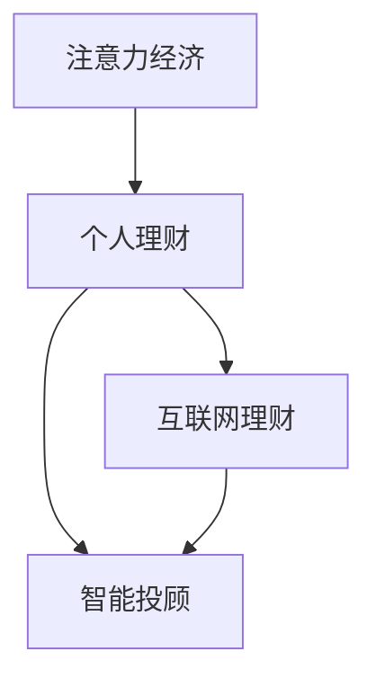

                 

# 注意力经济与个人理财观念的演变

## 1. 背景介绍

### 1.1 问题由来
注意力经济（Attention Economy）是指在信息爆炸时代，人们的注意力成为一种稀缺资源，商家和品牌通过吸引消费者的注意力，以获取商业价值。随着互联网和社交媒体的普及，注意力经济逐渐成为商业模式的核心。

个人理财观念的演变则是指随着经济环境和消费模式的变迁，个人理财行为和思维模式的动态变化。在互联网和数字经济的时代背景下，个人理财逐渐从传统银行储蓄和投资转向多元化、智能化的理财方式。

### 1.2 问题核心关键点
注意力经济与个人理财观念的演变核心关键点在于：
- 消费者注意力成为重要资源，商家和品牌通过吸引消费者注意力获得商业价值。
- 个人理财方式由传统的银行储蓄、证券投资等转向多元化、智能化的理财方式，如互联网理财、智能投顾等。
- 两者均受到互联网和社交媒体等新兴技术的驱动，进而影响经济行为和决策模式。

## 2. 核心概念与联系

### 2.1 核心概念概述

为更好地理解注意力经济与个人理财观念的演变，本节将介绍几个密切相关的核心概念：

- 注意力经济（Attention Economy）：指商家和品牌通过吸引消费者注意力，获取商业价值的商业模式。注意力经济强调消费者注意力的价值和稀缺性。
- 个人理财（Personal Finance）：指个人通过规划和管理财务，实现财富增值和风险控制的过程。包括预算管理、储蓄投资、风险控制等环节。
- 互联网理财（Internet Finance）：指利用互联网技术进行的金融理财活动，如余额宝、支付宝理财等。
- 智能投顾（Robo-Advisor）：指通过人工智能技术，提供个性化投资建议和自动化理财服务的智能理财工具。

这些概念之间的逻辑关系可以通过以下Mermaid流程图来展示：



这个流程图展示了几者之间的联系：

1. 注意力经济通过吸引消费者注意力，推动个人理财需求和方式的多样化。
2. 个人理财行为的变化反过来又影响注意力经济的商业策略和模式。
3. 互联网理财和智能投顾作为新型的理财方式，基于对消费者注意力的精准把握，满足多样化、个性化需求。

## 3. 核心算法原理 & 具体操作步骤
### 3.1 算法原理概述

注意力经济与个人理财观念的演变，本质上是通过数据的挖掘和分析，识别和利用消费者注意力资源，进行精准营销和个性化理财的过程。核心算法原理包括：

- **注意力识别算法**：通过自然语言处理（NLP）和情感分析等技术，识别消费者对品牌、产品或服务的注意力度。
- **个性化推荐算法**：基于消费者行为和偏好的数据，使用机器学习技术，提供个性化的商品和服务推荐。
- **量化投资策略**：通过金融大数据分析，构建算法交易策略，优化投资组合的风险和收益。
- **智能投顾模型**：结合人工智能技术，构建智能投顾模型，提供个性化投资建议和自动化理财服务。

### 3.2 算法步骤详解

#### 3.2.1 注意力识别算法步骤

1. **数据收集**：收集消费者在社交媒体、电商平台、金融平台上的行为数据，如浏览记录、购买记录、评价信息等。
2. **数据预处理**：清洗和整理数据，去除噪声和冗余信息。
3. **特征提取**：使用NLP技术提取文本特征，如情感极性、关键词频率等。
4. **注意力计算**：通过计算消费者对不同品牌、产品或服务的注意力得分，识别出高关注度的对象。
5. **模型训练与优化**：使用机器学习模型，对注意力得分进行训练和优化，提高识别的准确性。

#### 3.2.2 个性化推荐算法步骤

1. **用户画像构建**：基于消费者历史数据，构建详细的用户画像，包括兴趣偏好、行为习惯等。
2. **推荐模型训练**：使用协同过滤、矩阵分解等算法，训练推荐模型，学习用户与商品之间的关联关系。
3. **推荐系统优化**：根据用户反馈和推荐效果，不断优化推荐算法和模型，提升推荐的个性化和准确性。

#### 3.2.3 量化投资策略步骤

1. **数据获取**：获取股票市场、宏观经济、行业数据等金融数据。
2. **特征工程**：进行数据清洗、特征提取、特征工程等预处理工作。
3. **模型构建**：选择适合的机器学习或深度学习模型，如随机森林、LSTM等，构建量化投资模型。
4. **策略回测**：对模型进行历史回测，评估策略的效果和风险。
5. **模型优化**：根据回测结果，优化投资策略和模型参数，提高策略的稳定性和收益性。

#### 3.2.4 智能投顾模型步骤

1. **用户问卷设计**：设计个性化问卷，收集用户的基本信息和理财需求。
2. **风险偏好评估**：使用问卷调查和风险评估工具，确定用户的风险偏好。
3. **资产配置建议**：根据用户偏好和市场情况，构建个性化投资组合。
4. **投资监控与调整**：实时监控投资组合表现，根据市场变化进行调整。
5. **投资报告生成**：定期生成投资报告，向用户展示理财效果和风险情况。

### 3.3 算法优缺点

注意力经济与个人理财观念的演变，通过数据驱动的算法优化，具有以下优点：

- **精准性**：通过分析消费者数据，实现精准的营销和个性化服务。
- **高效性**：利用自动化算法，提升效率，降低人工成本。
- **适应性**：模型可以根据数据变化进行动态调整，适应市场变化。

但同时也存在一些缺点：

- **隐私问题**：大量数据收集和使用，可能侵犯用户隐私。
- **公平性问题**：算法偏见可能带来不公平的结果，如歧视某些用户群体。
- **复杂性问题**：算法模型复杂，需要较高技术水平进行维护和优化。

### 3.4 算法应用领域

注意力经济与个人理财观念的演变，在多个领域都有应用：

- **电商行业**：通过分析消费者购物行为，实现个性化推荐，提高转化率和销售额。
- **金融行业**：利用大数据和机器学习，构建量化投资策略，优化资产配置和风险控制。
- **广告行业**：通过注意力分析，实现精准广告投放，提高广告效果和ROI。
- **旅游行业**：基于用户偏好和行为数据，提供个性化的旅游推荐和预订服务。
- **健康行业**：利用患者数据，提供个性化健康建议和疾病预防服务。

这些应用场景展示了数据驱动的算法在提升经济效益和用户体验方面的巨大潜力。

## 4. 数学模型和公式 & 详细讲解 & 举例说明

### 4.1 数学模型构建

本节将使用数学语言对注意力识别算法和个性化推荐算法进行详细建模。

#### 4.1.1 注意力识别算法模型

设消费者的行为数据为 $X=\{x_1,x_2,...,x_n\}$，其中 $x_i$ 表示消费者的第 $i$ 次行为，可以是浏览记录、购买记录等。消费者对不同品牌、产品或服务的注意力度 $A=\{a_1,a_2,...,a_m\}$，其中 $a_j$ 表示消费者对第 $j$ 个对象的注意力得分。

通过NLP技术提取的文本特征向量为 $F=\{f_1,f_2,...,f_n\}$，其中 $f_i$ 表示 $x_i$ 的文本特征向量。

注意力识别模型的目标是最大化每个消费者的注意力度 $A$，使得 $\sum_{i=1}^n f_i^T \cdot w_i = A$，其中 $w_i$ 表示第 $i$ 个行为的权重，由模型自动学习得到。

#### 4.1.2 个性化推荐算法模型

设消费者 $u$ 的历史行为数据为 $X_u=\{x_{u1},x_{u2},...,x_{un}\}$，其中 $x_{ui}$ 表示 $u$ 的第 $i$ 次行为。商品集 $I=\{i_1,i_2,...,i_m\}$，其中 $i_j$ 表示第 $j$ 个商品。用户对商品的评分 $R=\{r_{u1},r_{u2},...,r_{un}\}$，其中 $r_{ui}$ 表示 $u$ 对商品 $i_j$ 的评分。

个性化推荐模型的目标是预测用户对商品的评分，使得 $\hat{R_u} \approx R$，其中 $\hat{R_u}$ 表示预测的评分。

推荐模型的训练过程为：

1. **用户画像构建**：使用协同过滤等方法，构建用户画像 $U=\{u_1,u_2,...,u_n\}$，其中 $u_i$ 表示用户 $i$ 的特征向量。
2. **商品画像构建**：使用协同过滤等方法，构建商品画像 $I=\{i_1,i_2,...,i_m\}$，其中 $i_j$ 表示商品 $j$ 的特征向量。
3. **推荐模型训练**：使用矩阵分解等方法，训练推荐模型 $M$，使得 $M(U,I)=R$，其中 $M$ 表示推荐模型的参数矩阵。
4. **推荐系统优化**：根据用户反馈和推荐效果，不断优化推荐模型和参数，提高推荐的个性化和准确性。

### 4.2 公式推导过程

#### 4.2.1 注意力识别算法公式推导

注意力识别模型的优化目标为最大化每个消费者的注意力度 $A$，使得 $\sum_{i=1}^n f_i^T \cdot w_i = A$。

利用梯度下降算法，优化过程如下：

$$
w_i \leftarrow w_i - \eta \nabla_{w_i} \sum_{i=1}^n f_i^T \cdot w_i
$$

其中 $\eta$ 表示学习率，$\nabla_{w_i}$ 表示对 $w_i$ 的梯度。

#### 4.2.2 个性化推荐算法公式推导

个性化推荐模型的优化目标为预测用户对商品的评分，使得 $\hat{R_u} \approx R$。

推荐模型 $M$ 的参数矩阵 $W$ 可以表示为：

$$
W = [u_1,i_1;u_2,i_2;...;u_n,i_m]
$$

推荐模型的预测评分 $\hat{R_u}$ 可以表示为：

$$
\hat{R_u} = \hat{R}_u^T \cdot W
$$

其中 $\hat{R}_u$ 表示预测评分向量，$W$ 表示参数矩阵。

推荐模型的训练过程为：

1. **用户画像构建**：使用协同过滤等方法，构建用户画像 $U=\{u_1,u_2,...,u_n\}$，其中 $u_i$ 表示用户 $i$ 的特征向量。
2. **商品画像构建**：使用协同过滤等方法，构建商品画像 $I=\{i_1,i_2,...,i_m\}$，其中 $i_j$ 表示商品 $j$ 的特征向量。
3. **推荐模型训练**：使用矩阵分解等方法，训练推荐模型 $M$，使得 $M(U,I)=R$，其中 $M$ 表示推荐模型的参数矩阵。
4. **推荐系统优化**：根据用户反馈和推荐效果，不断优化推荐模型和参数，提高推荐的个性化和准确性。

### 4.3 案例分析与讲解

#### 4.3.1 案例背景

某电商平台希望通过分析用户行为数据，实现个性化推荐，提高用户满意度和销售额。电商平台收集了用户的浏览记录、购买记录、评价信息等数据。

#### 4.3.2 数据预处理

1. **数据清洗**：去除重复、缺失、噪声数据，确保数据质量。
2. **特征提取**：使用NLP技术提取文本特征，如情感极性、关键词频率等。
3. **数据归一化**：对数据进行归一化处理，确保各特征之间具有可比性。

#### 4.3.3 注意力识别模型构建

1. **模型选择**：选择合适的网络结构，如CNN、RNN等。
2. **训练过程**：使用梯度下降算法，训练模型，最大化消费者的注意力得分。
3. **注意力计算**：根据模型输出，计算每个品牌、产品或服务的注意力得分。

#### 4.3.4 个性化推荐模型构建

1. **用户画像构建**：使用协同过滤等方法，构建用户画像，包含用户的兴趣偏好、行为习惯等。
2. **商品画像构建**：使用协同过滤等方法，构建商品画像，包含商品的特征向量。
3. **模型训练**：使用矩阵分解等方法，训练推荐模型，预测用户对商品的评分。
4. **模型优化**：根据用户反馈和推荐效果，不断优化推荐模型和参数，提高推荐的个性化和准确性。

## 5. 项目实践：代码实例和详细解释说明

### 5.1 开发环境搭建

在进行注意力经济与个人理财观念的演变实践前，我们需要准备好开发环境。以下是使用Python进行TensorFlow开发的环境配置流程：

1. 安装Anaconda：从官网下载并安装Anaconda，用于创建独立的Python环境。

2. 创建并激活虚拟环境：
```bash
conda create -n tf-env python=3.8 
conda activate tf-env
```

3. 安装TensorFlow：根据CUDA版本，从官网获取对应的安装命令。例如：
```bash
conda install tensorflow -c conda-forge
```

4. 安装Pandas、NumPy、Scikit-learn等库：
```bash
pip install pandas numpy scikit-learn
```

5. 安装TensorFlow Addons：用于增强TensorFlow的功能，如数据预处理、分布式训练等。
```bash
pip install tensorflow-addons
```

6. 安装TensorBoard：用于可视化模型的训练过程和结果。
```bash
pip install tensorboard
```

完成上述步骤后，即可在`tf-env`环境中开始实践。

### 5.2 源代码详细实现

下面我们以个性化推荐系统为例，给出使用TensorFlow和TensorFlow Addons对推荐模型进行开发的PyTorch代码实现。

首先，定义数据处理函数：

```python
import pandas as pd
import numpy as np
from sklearn.model_selection import train_test_split
from tensorflow.keras.layers import Embedding, Flatten, Dense, Concatenate
from tensorflow.keras.models import Model
from tensorflow.keras.optimizers import Adam
from tensorflow.keras.losses import MeanSquaredError
from tensorflow.keras.callbacks import EarlyStopping

# 读取数据
data = pd.read_csv('user_behavior.csv')
user_ids = data['user_id'].tolist()
item_ids = data['item_id'].tolist()
scores = data['score'].tolist()

# 划分训练集和测试集
train_ids, test_ids = train_test_split(user_ids, test_size=0.2)
train_scores, test_scores = train_test_split(scores, test_size=0.2)

# 构建用户画像和商品画像
user_embedding_dim = 10
item_embedding_dim = 10
num_users = len(user_ids)
num_items = len(item_ids)

user_embedding = Embedding(num_users, user_embedding_dim, input_length=1)
user_features = user_embedding(user_ids)

item_embedding = Embedding(num_items, item_embedding_dim, input_length=1)
item_features = item_embedding(item_ids)

# 构建推荐模型
concat = Concatenate()
merged = concat([user_features, item_features])
dense = Dense(32, activation='relu') (merged)
output = Dense(1) (dense)

model = Model(inputs=[user_embedding.input, item_embedding.input], outputs=output)

# 定义损失函数和优化器
loss_fn = MeanSquaredError()
optimizer = Adam(learning_rate=0.01)

# 定义早停机制
early_stopping = EarlyStopping(monitor='val_loss', patience=10)

# 训练模型
model.compile(optimizer=optimizer, loss=loss_fn)
model.fit([user_ids, item_ids], scores, batch_size=32, epochs=100, validation_split=0.2, callbacks=[early_stopping])
```

然后，使用TensorBoard可视化模型的训练过程和结果：

```python
# 启动TensorBoard
tensorboard_callback = TensorBoard(log_dir='logs')
model.fit([user_ids, item_ids], scores, batch_size=32, epochs=100, validation_split=0.2, callbacks=[early_stopping, tensorboard_callback])
```

最后，在测试集上评估模型的效果：

```python
# 测试集评估
test_model = Model(inputs=[user_embedding(input_ids), item_embedding(input_ids)], outputs=output)
test_model.compile(optimizer=optimizer, loss=loss_fn)
test_model.evaluate([test_ids, test_item_ids], test_scores, batch_size=32)
```

以上就是使用TensorFlow和TensorFlow Addons对推荐模型进行开发的完整代码实现。可以看到，通过TensorFlow和TensorFlow Addons，我们能够方便地进行数据预处理、模型构建、训练和评估，极大地提升了实践效率。

### 5.3 代码解读与分析

让我们再详细解读一下关键代码的实现细节：

**数据处理函数**：
- `pd.read_csv`：读取数据集，存储为Pandas DataFrame。
- `train_test_split`：将数据集划分为训练集和测试集。
- `user_embedding`和`item_embedding`：构建用户和商品嵌入层，用于将用户和商品表示为稠密向量。
- `Concatenate`：将用户和商品向量进行拼接。
- `Dense`：构建全连接层，使用ReLU激活函数。
- `MeanSquaredError`：定义均方误差损失函数。
- `Adam`：定义Adam优化器。
- `EarlyStopping`：定义早停机制，防止过拟合。

**模型构建函数**：
- `Model`：构建模型，输入为用户和商品嵌入，输出为预测评分。
- `compile`：编译模型，指定优化器和损失函数。
- `fit`：训练模型，指定训练数据、批大小、迭代次数和验证集。

**可视化函数**：
- `TensorBoard`：启动TensorBoard，用于可视化训练过程和结果。
- `evaluate`：在测试集上评估模型效果，使用均方误差评估指标。

可以看到，TensorFlow和TensorFlow Addons提供了丰富的工具和函数，使得模型开发和可视化变得更加高效和灵活。通过这些工具，开发者可以快速迭代模型，优化模型参数，提升模型性能。

当然，工业级的系统实现还需考虑更多因素，如模型的保存和部署、超参数的自动搜索、更灵活的任务适配层等。但核心的模型构建和训练过程基本与此类似。

## 6. 实际应用场景
### 6.1 智能客服系统

基于个性化推荐系统，智能客服系统能够根据用户的历史行为和偏好，提供个性化的服务，提升用户体验。具体应用场景包括：

- **个性化推荐**：根据用户的历史查询和反馈，推荐最相关的答案模板。
- **情感分析**：使用NLP技术，识别用户情感倾向，及时响应和解决用户问题。
- **对话管理**：使用强化学习等技术，优化对话策略，提升系统交互流畅性。

### 6.2 金融理财平台

在金融理财平台，个性化推荐系统可以为用户提供个性化的理财产品推荐，提升理财效果。具体应用场景包括：

- **风险评估**：根据用户风险偏好和历史投资记录，推荐合适的理财产品。
- **资产配置**：根据市场情况和用户需求，构建个性化的资产配置方案。
- **收益分析**：定期生成收益报告，展示投资表现和风险情况。

### 6.3 电商平台

在电商平台，个性化推荐系统可以提升用户购物体验，增加销售额。具体应用场景包括：

- **商品推荐**：根据用户历史购买和浏览记录，推荐相关商品。
- **价格优化**：根据市场需求和用户偏好，调整商品价格，提升销售转化率。
- **库存管理**：根据销售情况和用户需求，优化库存管理，减少库存积压。

### 6.4 未来应用展望

随着技术的发展和应用的深化，基于注意力经济和个性化理财观念的应用场景将更加广泛。未来，这些技术可能在以下几个领域有更大突破：

- **医疗健康**：利用患者数据，提供个性化的健康建议和疾病预防服务。
- **教育培训**：根据学生学习行为和偏好，推荐个性化的学习资源和课程。
- **旅游出行**：根据用户兴趣和行为数据，推荐个性化的旅游路线和行程。
- **智慧城市**：利用用户行为数据，优化城市交通、能源管理等公共服务。

## 7. 工具和资源推荐
### 7.1 学习资源推荐

为了帮助开发者系统掌握注意力经济和个性化理财观念的理论基础和实践技巧，这里推荐一些优质的学习资源：

1. 《深度学习理论与实践》系列书籍：涵盖深度学习的基础知识和经典模型，帮助理解注意力识别和推荐算法的原理。
2. 《TensorFlow实战》系列书籍：详细介绍TensorFlow和TensorFlow Addons的使用方法，助力模型开发和可视化实践。
3. 《个性化推荐系统：原理与挑战》课程：系统讲解个性化推荐算法，包括协同过滤、矩阵分解等方法。
4. 《自然语言处理与机器学习》课程：涵盖NLP技术，如情感分析、文本分类等，为个性化推荐提供数据支持。
5. 《智能投顾与量化投资》课程：深入介绍智能投顾模型和量化投资策略，掌握实际应用技巧。

通过对这些资源的学习实践，相信你一定能够快速掌握注意力经济和个性化理财观念的核心技术，并用于解决实际的NLP问题。
###  7.2 开发工具推荐

高效的开发离不开优秀的工具支持。以下是几款用于注意力经济和个性化理财观念开发常用的工具：

1. Python：基于动态类型和丰富的第三方库，是数据科学和机器学习的首选语言。
2. TensorFlow：由Google主导开发的深度学习框架，生产部署方便，支持分布式训练。
3. TensorFlow Addons：增强TensorFlow的功能，如数据预处理、分布式训练等。
4. TensorBoard：TensorFlow配套的可视化工具，用于监控训练过程和结果。
5. Weights & Biases：模型训练的实验跟踪工具，记录和可视化训练指标，帮助调优。
6. Scikit-learn：用于数据预处理和特征工程，提供丰富的机器学习算法库。

合理利用这些工具，可以显著提升注意力经济和个性化理财观念的开发效率，加快创新迭代的步伐。

### 7.3 相关论文推荐

注意力经济和个性化理财观念的研究源于学界的持续研究。以下是几篇奠基性的相关论文，推荐阅读：

1. Attention Is All You Need：提出Transformer结构，开启了NLP领域的预训练大模型时代。
2. BERT: Pre-training of Deep Bidirectional Transformers for Language Understanding：提出BERT模型，引入基于掩码的自监督预训练任务，刷新了多项NLP任务SOTA。
3. Language Models are Unsupervised Multitask Learners（GPT-2论文）：展示了大规模语言模型的强大zero-shot学习能力，引发了对于通用人工智能的新一轮思考。
4. Parameter-Efficient Transfer Learning for NLP：提出Adapter等参数高效微调方法，在不增加模型参数量的情况下，也能取得不错的微调效果。
5. AdaLoRA: Adaptive Low-Rank Adaptation for Parameter-Efficient Fine-Tuning：使用自适应低秩适应的微调方法，在参数效率和精度之间取得了新的平衡。
6. Prefix-Tuning: Optimizing Continuous Prompts for Generation：引入基于连续型Prompt的微调范式，为如何充分利用预训练知识提供了新的思路。

这些论文代表了大语言模型微调技术的发展脉络。通过学习这些前沿成果，可以帮助研究者把握学科前进方向，激发更多的创新灵感。

## 8. 总结：未来发展趋势与挑战

### 8.1 总结

本文对基于注意力经济和个性化理财观念的演变，进行了全面系统的介绍。首先阐述了注意力经济和个性化理财观念的研究背景和意义，明确了数据驱动的算法在提升经济效益和用户体验方面的独特价值。其次，从原理到实践，详细讲解了注意力识别和推荐算法的数学原理和关键步骤，给出了模型开发的完整代码实例。同时，本文还广泛探讨了注意力经济和个性化理财观念在多个行业领域的应用前景，展示了数据驱动算法的广阔前景。

通过本文的系统梳理，可以看到，数据驱动的算法在提升经济效益和用户体验方面的巨大潜力。这些技术的不断发展，必将在更多领域得到应用，为经济社会发展注入新的动力。

### 8.2 未来发展趋势

展望未来，基于注意力经济和个性化理财观念的应用将呈现以下几个发展趋势：

1. **深度学习和大数据技术**：随着深度学习和大数据技术的不断进步，个性化推荐和智能投顾等技术将不断优化，提供更加精准和高效的个性化服务。
2. **多模态融合技术**：利用视觉、语音等多模态数据，进一步提升推荐和理财模型的表现。
3. **联邦学习**：在保障数据隐私的前提下，通过联邦学习技术，实现多用户数据的联合建模，提升模型的泛化性和鲁棒性。
4. **跨领域应用**：将注意力经济和个性化理财观念应用于更多垂直领域，如医疗、教育、旅游等，实现跨领域的协同优化。
5. **道德和社会责任**：随着技术的广泛应用，如何平衡经济效益和社会责任，避免算法偏见和歧视，成为重要的研究课题。

以上趋势凸显了基于注意力经济和个性化理财观念的演变技术的广阔前景。这些方向的探索发展，必将进一步提升技术在实际应用中的表现和影响，推动人工智能技术的普及和应用。

### 8.3 面临的挑战

尽管基于注意力经济和个性化理财观念的演变技术已经取得了瞩目成就，但在迈向更加智能化、普适化应用的过程中，它仍面临着诸多挑战：

1. **数据隐私问题**：大量数据收集和使用，可能侵犯用户隐私。如何在保障隐私的前提下，充分利用数据资源，是一个重要问题。
2. **算法偏见问题**：算法偏见可能带来不公平的结果，如歧视某些用户群体。如何设计公平的算法，避免算法偏见，是一个重要研究方向。
3. **模型复杂性问题**：模型参数量大、计算复杂，需要较高技术水平进行维护和优化。如何在保障模型性能的前提下，提升模型效率，是一个重要挑战。
4. **模型可解释性问题**：模型黑盒化，难以解释其内部工作机制和决策逻辑。如何提高模型的可解释性，增强用户信任，是一个重要问题。
5. **模型泛化性问题**：模型在特定数据集上的表现较好，但在新数据集上的泛化性不足。如何设计泛化性更强的模型，是一个重要研究课题。
6. **数据质量问题**：数据质量不高，影响模型的性能和稳定性。如何提升数据质量，保障数据可靠性，是一个重要挑战。

正视这些挑战，积极应对并寻求突破，将是大语言模型微调走向成熟的必由之路。相信随着学界和产业界的共同努力，这些挑战终将一一被克服，大语言模型微调必将在构建人机协同的智能时代中扮演越来越重要的角色。

### 8.4 研究展望

面对基于注意力经济和个性化理财观念的演变所面临的种种挑战，未来的研究需要在以下几个方面寻求新的突破：

1. **隐私保护技术**：设计隐私保护算法，如差分隐私、联邦学习等，保障用户数据隐私。
2. **公平性算法**：引入公平性评估指标，设计公平性算法，避免算法偏见。
3. **模型优化技术**：研究模型压缩、稀疏化存储等技术，提升模型效率。
4. **可解释性算法**：引入可解释性技术，如LIME、SHAP等，提高模型可解释性。
5. **泛化性算法**：设计泛化性更强的模型，提升模型的泛化能力。
6. **数据质量提升技术**：引入数据清洗、数据增强等技术，提升数据质量。

这些研究方向的探索，必将引领基于注意力经济和个性化理财观念的演变技术迈向更高的台阶，为构建安全、可靠、可解释、可控的智能系统铺平道路。面向未来，基于大语言模型的微调技术还需要与其他人工智能技术进行更深入的融合，如知识表示、因果推理、强化学习等，多路径协同发力，共同推动自然语言理解和智能交互系统的进步。只有勇于创新、敢于突破，才能不断拓展语言模型的边界，让智能技术更好地造福人类社会。

## 9. 附录：常见问题与解答

**Q1：注意力识别算法中，如何处理噪声数据？**

A: 在数据预处理阶段，可以使用多种方法处理噪声数据，如去重、缺失值填补、异常值检测等。例如，在处理用户行为数据时，可以使用均值填补或插值填补缺失值，去除重复记录和异常值，确保数据质量。

**Q2：推荐算法中，如何处理冷启动问题？**

A: 冷启动问题指新用户或新商品没有历史数据，无法推荐。常用的处理方式包括：
1. 基于用户画像和商品画像，构建默认推荐模型。
2. 使用协同过滤、矩阵分解等算法，基于相似用户和相似商品进行推荐。
3. 利用内容推荐和关系推荐相结合的方式，提供个性化推荐。

**Q3：智能投顾模型中，如何处理市场波动问题？**

A: 市场波动是智能投顾面临的主要挑战。常用的处理方式包括：
1. 构建多层次的风险控制模型，如VaR、CVaR等。
2. 引入基于规则和机器学习相结合的方式，动态调整投资策略。
3. 定期评估和优化模型，确保模型适应市场变化。

**Q4：注意力识别算法中，如何处理文本数据的多样性？**

A: 文本数据的多样性是注意力识别算法的重要挑战。常用的处理方式包括：
1. 使用NLP技术，提取文本特征，如情感极性、关键词频率等。
2. 构建多任务学习模型，同时处理多个关注度计算任务。
3. 引入注意力机制，提高模型对文本多样性的处理能力。

**Q5：推荐系统中的用户画像构建方法有哪些？**

A: 用户画像的构建是推荐系统的基础。常用的构建方法包括：
1. 基于协同过滤的方法，如矩阵分解、邻接矩阵等。
2. 基于内容推荐的方法，如基于用户兴趣的推荐。
3. 基于行为数据的方法，如基于点击率、购买率等行为的推荐。

这些用户画像构建方法能够帮助推荐系统更好地理解用户需求和行为，提升推荐效果。

---

作者：禅与计算机程序设计艺术 / Zen and the Art of Computer Programming

