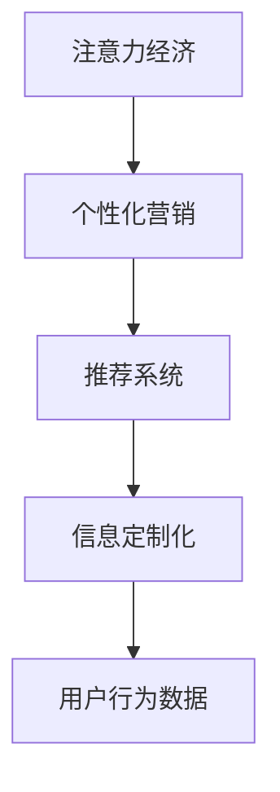

                 

# 注意力经济与个性化营销策略：如何为受众创建定制信息

在数字化时代，信息爆炸让消费者处于信息过载之中，如何在纷繁复杂的信息流中脱颖而出，成为企业亟待解决的难题。本文将从“注意力经济”的角度出发，探讨如何通过个性化营销策略，为受众创建定制信息，提升用户粘性和品牌忠诚度。

## 1. 背景介绍

### 1.1 问题由来

随着互联网和移动互联网的普及，信息获取变得前所未有的便捷，消费者可以随时随地获取到海量的商品和服务信息。然而，这些信息也使得消费者的注意力分散，难以精准触及和维持其注意力。因此，如何吸引和保持用户注意力，成为企业数字营销的核心挑战。

### 1.2 问题核心关键点

- **注意力资源稀缺**：在海量信息中，消费者的注意力是最稀缺的资源，有效的信息传递需要精准定位。
- **个性化需求上升**：不同用户具有不同偏好和需求，个性化营销能够提供更加贴合用户的定制信息。
- **数据驱动决策**：数据在个性化营销中扮演着重要角色，通过分析用户行为数据，实现个性化推荐。
- **多渠道整合**：在多个线上线下渠道进行内容同步分发，扩大信息的覆盖面。

## 2. 核心概念与联系

### 2.1 核心概念概述

为更好地理解注意力经济与个性化营销策略，本节将介绍几个密切相关的核心概念：

- **注意力经济**：在信息过载的时代，注意力成为一种稀缺资源，吸引并保持用户注意力是创造商业价值的关键。
- **个性化营销**：根据用户的个体差异，定制信息内容和展示方式，提高营销效果。
- **推荐系统**：利用机器学习等技术，对用户行为数据进行分析，实现个性化推荐。
- **信息定制化**：通过分析用户数据，定制个性化的内容、广告和互动方式，满足用户需求。
- **用户行为数据**：包括浏览记录、购买行为、反馈信息等，用于理解用户需求和行为模式。

这些核心概念之间的逻辑关系可以通过以下Mermaid流程图来展示：



这个流程图展示了几者之间的联系：

1. 注意力经济通过个性化营销吸引用户注意力。
2. 个性化营销依赖推荐系统进行用户行为分析。
3. 信息定制化基于用户行为数据实现个性化推荐。

这些概念共同构成了个性化营销的基本框架，通过理解用户行为，定制符合用户需求的信息，从而吸引和保持用户注意力。

## 3. 核心算法原理 & 具体操作步骤

### 3.1 算法原理概述

个性化营销的核心在于利用机器学习和大数据技术，精准识别和预测用户需求，提供定制化的信息内容和展示方式。其基本流程可以概括为以下几个步骤：

1. **用户行为数据收集**：收集用户在平台上的各种行为数据，包括浏览记录、点击行为、购买记录等。
2. **用户画像构建**：通过分析用户行为数据，构建用户画像，了解用户的兴趣、偏好和行为模式。
3. **内容推荐**：基于用户画像，利用推荐算法生成个性化内容推荐列表，推送给用户。
4. **反馈循环优化**：根据用户对推荐内容的反馈，不断调整推荐算法和内容策略，提升推荐效果。

这一过程可以视作一种循环迭代，通过不断的反馈和优化，实现信息的精准传递和用户注意力的持续吸引。

### 3.2 算法步骤详解

个性化营销算法主要包括以下几个关键步骤：

#### 3.2.1 用户行为数据收集

- 通过网站、APP、邮件等渠道，收集用户的操作日志、浏览记录、搜索关键词、购买行为等数据。
- 使用数据仓库工具如Apache Hadoop、Apache Spark等，对数据进行清洗和整合，生成统一的数据格式。
- 确保数据隐私和安全，遵循数据保护法规，如GDPR、CCPA等，保护用户隐私。

#### 3.2.2 用户画像构建

- 使用机器学习算法如聚类分析、协同过滤等，对用户行为数据进行分析，形成用户画像。
- 用户画像应包含用户的基本信息、兴趣偏好、行为模式等，形成多维度的用户特征。
- 通过可视化工具如Tableau、Power BI等，生成用户画像的可视化报表，便于理解和管理。

#### 3.2.3 内容推荐

- 根据用户画像，选择合适的推荐算法，如基于协同过滤的推荐算法、基于深度学习的推荐算法等。
- 构建推荐模型，输入用户画像和内容特征，输出推荐列表。
- 使用A/B测试等方法，评估推荐效果，不断优化推荐算法和策略。

#### 3.2.4 反馈循环优化

- 收集用户对推荐内容的反馈数据，如点击率、停留时间、购买转化率等。
- 使用强化学习等方法，不断优化推荐算法和内容策略，提高推荐效果。
- 定期更新用户画像和推荐模型，确保其与用户需求和市场变化同步。

### 3.3 算法优缺点

个性化营销算法具有以下优点：

- **提升用户体验**：通过精准的个性化推荐，提升用户满意度和粘性，降低流失率。
- **优化营销效果**：通过数据驱动的推荐，提高营销活动的效果和ROI。
- **增强品牌忠诚度**：个性化的信息传递，使品牌更加贴合用户需求，提升品牌忠诚度。

同时，个性化营销算法也存在一定的局限性：

- **数据隐私问题**：收集和分析用户行为数据，需要严格遵守数据隐私法规，保护用户隐私。
- **算法偏差**：如果用户画像和推荐算法存在偏差，可能导致个性化推荐效果不佳。
- **推荐多样性**：个性化推荐往往聚焦于少数高点击率内容，导致推荐多样性不足。
- **冷启动问题**：新用户缺乏足够行为数据，难以构建准确的用户画像，影响个性化推荐效果。

尽管存在这些局限性，但就目前而言，个性化营销算法在提升用户体验和优化营销效果方面已经显示出显著的优势，成为数字营销的重要手段。

### 3.4 算法应用领域

个性化营销算法已经在多个领域得到了广泛应用，例如：

- **电子商务**：电商平台通过个性化推荐，提高商品销售转化率，提升用户体验。
- **新闻媒体**：新闻网站和应用通过个性化推荐，精准推送新闻内容，提高用户停留时间和互动率。
- **社交网络**：社交平台通过个性化推荐，增加用户互动和内容消费，提升平台活跃度。
- **流媒体服务**：视频网站和音乐平台通过个性化推荐，提供符合用户偏好的内容和播放建议，增加用户粘性。
- **旅游和出行**：旅游和出行平台通过个性化推荐，提供定制化的旅游和出行方案，提升用户预订率。

除了上述这些经典应用外，个性化营销算法也被创新性地应用到更多场景中，如医疗健康、教育培训、金融服务等领域，为各类行业数字化转型提供了新的思路。

## 4. 数学模型和公式 & 详细讲解 & 举例说明

### 4.1 数学模型构建

个性化推荐系统通常基于协同过滤和深度学习模型。这里以协同过滤为例，构建数学模型。

设用户集为 $U=\{u_1,u_2,\ldots,u_M\}$，商品集为 $I=\{i_1,i_2,\ldots,i_N\}$，用户 $u$ 对商品 $i$ 的评分记为 $r_{ui}$。协同过滤推荐系统可以分为两种：基于用户的协同过滤和基于物品的协同过滤。

#### 4.1.1 基于用户的协同过滤

设用户 $u$ 对商品 $i$ 的评分矩阵为 $R \in \mathbb{R}^{M\times N}$，基于用户的协同过滤方法为：

$$
\hat{r}_{ui} = \frac{\sum_{v\in N(u)\setminus i} r_{uv} \cdot r_{vi}}{\sqrt{\sum_{v\in N(u)\setminus i} r_{uv}^2} \cdot \sqrt{\sum_{v\in N(i)\setminus u} r_{vi}^2}}
$$

其中 $N(u)$ 和 $N(i)$ 分别为用户 $u$ 和商品 $i$ 的邻居集合，$\setminus$ 表示集合的差集。

#### 4.1.2 基于物品的协同过滤

基于物品的协同过滤方法同样基于评分矩阵 $R$，将 $R$ 视为用户对物品的评分矩阵，计算方法为：

$$
\hat{r}_{ui} = \frac{\sum_{j\in N(i)\setminus u} r_{ij} \cdot r_{uj}}{\sqrt{\sum_{j\in N(i)\setminus u} r_{ij}^2} \cdot \sqrt{\sum_{j\in N(u)\setminus i} r_{uj}^2}}
$$

其中 $N(i)$ 和 $N(u)$ 分别为物品 $i$ 和用户 $u$ 的邻居集合。

### 4.2 公式推导过程

以上是协同过滤推荐系统的基本模型和计算方法。下面推导一下基于协同过滤的推荐系统如何通过用户行为数据生成推荐结果。

设用户 $u$ 对商品 $i$ 的评分向量为 $\boldsymbol{r}_u$，物品 $i$ 的评分向量为 $\boldsymbol{r}_i$，则基于用户的协同过滤方法可以表示为：

$$
\hat{r}_{ui} = \boldsymbol{r}_u^T \boldsymbol{r}_i / (\|\boldsymbol{r}_u\|\|\boldsymbol{r}_i\|)
$$

其中 $\|\boldsymbol{r}_u\|$ 和 $\|\boldsymbol{r}_i\|$ 分别为向量 $\boldsymbol{r}_u$ 和 $\boldsymbol{r}_i$ 的模长。

通过计算所有物品的 $\hat{r}_{ui}$ 值，排序后生成推荐列表。对于用户 $u$，其推荐列表中的物品按照 $\hat{r}_{ui}$ 值从大到小排序。

### 4.3 案例分析与讲解

以电子商务平台为例，分析个性化推荐系统的工作流程：

1. **数据收集**：电商平台收集用户浏览、点击、购买等行为数据，形成评分矩阵 $R$。
2. **用户画像**：使用协同过滤算法，对用户评分矩阵进行分析，构建用户画像 $P_u$。
3. **推荐生成**：根据用户画像 $P_u$ 和物品评分矩阵 $R$，计算用户 $u$ 对每个物品 $i$ 的推荐分数 $\hat{r}_{ui}$。
4. **结果排序**：根据 $\hat{r}_{ui}$ 值对物品进行排序，生成推荐列表。
5. **用户反馈**：收集用户对推荐结果的反馈数据，如点击率、购买率等，不断优化推荐算法。

在实际应用中，推荐系统还可以引入更多技术，如深度学习、迁移学习、强化学习等，以提高推荐效果和多样性。

## 5. 项目实践：代码实例和详细解释说明

### 5.1 开发环境搭建

在进行个性化推荐系统开发前，我们需要准备好开发环境。以下是使用Python进行Scikit-learn开发的环境配置流程：

1. 安装Anaconda：从官网下载并安装Anaconda，用于创建独立的Python环境。

2. 创建并激活虚拟环境：
```bash
conda create -n personalized-env python=3.8 
conda activate personalized-env
```

3. 安装Scikit-learn：
```bash
pip install scikit-learn
```

4. 安装Pandas和NumPy：
```bash
pip install pandas numpy
```

5. 安装TensorFlow和Keras：
```bash
pip install tensorflow keras
```

完成上述步骤后，即可在`personalized-env`环境中开始开发实践。

### 5.2 源代码详细实现

这里我们以协同过滤推荐系统为例，给出使用Scikit-learn库对电子商务数据进行推荐系统开发的PyTorch代码实现。

首先，定义推荐系统的数据集：

```python
import pandas as pd
from sklearn.preprocessing import StandardScaler

# 加载电商数据集
df = pd.read_csv('ecommerce_data.csv')
# 处理缺失值
df = df.dropna()
# 标准化处理
scaler = StandardScaler()
df[['rating', 'price']] = scaler.fit_transform(df[['rating', 'price']])
# 生成评分矩阵
R = df.pivot(index='user_id', columns='item_id', values='rating').values
```

然后，定义推荐函数：

```python
from sklearn.metrics.pairwise import cosine_similarity
from scipy.sparse import csr_matrix

def collaborative_filtering(R):
    N, M = R.shape
    # 生成物品-物品评分矩阵
    R_u = R.T @ R
    R_u = csr_matrix(R_u)
    # 计算用户-物品评分矩阵
    R_u_inv = R_u.todense()
    # 计算用户-物品评分
    R_u_inv = R_u_inv / np.sqrt(np.diag(R_u_inv) + 1e-9)
    # 计算推荐分数
    scores = R @ R_u_inv
    return scores
```

最后，调用推荐函数进行推荐：

```python
# 计算推荐分数
scores = collaborative_filtering(R)
# 生成推荐列表
top_items = np.argsort(scores)[:10]
# 输出推荐结果
for item in top_items:
    print(f'推荐商品ID: {item}, 评分: {scores[0, item]}')
```

以上就是使用Scikit-learn对电子商务数据进行协同过滤推荐系统的完整代码实现。可以看到，Scikit-learn提供了丰富的机器学习算法和工具，使得个性化推荐系统的开发变得相对简单。

### 5.3 代码解读与分析

让我们再详细解读一下关键代码的实现细节：

**电商数据集**：
- 使用Pandas库加载电商数据集，并进行处理。
- 标准化处理评分和价格数据，以提高模型的鲁棒性。
- 生成评分矩阵 $R$，其中的每个元素为用户的评分。

**推荐函数**：
- 使用Scikit-learn库的cosine_similarity计算用户-物品评分矩阵 $R_u$，其中的每个元素为物品的评分。
- 对 $R_u$ 进行逆标准化处理，以消除数据规模差异。
- 计算用户-物品评分 $R_u^{-1}$，并使用矩阵乘法计算推荐分数 $scores$。

**推荐调用**：
- 调用推荐函数，生成推荐分数矩阵。
- 取分数矩阵的前10个元素作为推荐列表。
- 输出推荐商品ID和评分，用于展示推荐结果。

可以看到，Scikit-learn使得机器学习算法的实现变得简单易懂，开发者可以将更多精力放在数据处理和模型优化上，而不必过多关注底层算法细节。

当然，工业级的系统实现还需考虑更多因素，如模型压缩、缓存机制、在线学习等。但核心的推荐范式基本与此类似。

## 6. 实际应用场景

### 6.1 电商推荐

个性化推荐系统在电子商务中的应用非常广泛，通过推荐系统，电商平台可以提升用户购买转化率，优化用户体验。具体应用包括：

- **商品推荐**：根据用户浏览和购买行为，推荐相似或相关的商品。
- **价格优化**：通过分析用户对不同价格的反应，优化商品定价策略。
- **库存管理**：根据推荐系统生成的预测需求，调整库存管理策略。
- **营销活动**：根据用户画像和推荐结果，定制个性化的营销活动，提高活动效果。

### 6.2 新闻推荐

新闻平台通过个性化推荐系统，可以精准推送用户感兴趣的新闻内容，提高用户的停留时间和互动率。具体应用包括：

- **个性化新闻**：根据用户兴趣和行为数据，推荐相关新闻文章。
- **内容聚合**：通过推荐系统，聚合用户感兴趣的多源新闻内容。
- **用户反馈**：根据用户对推荐内容的态度，调整推荐策略，优化推荐效果。

### 6.3 社交网络

社交平台通过个性化推荐，可以提升用户互动和平台活跃度。具体应用包括：

- **好友推荐**：根据用户好友关系和互动数据，推荐新的好友。
- **内容推荐**：根据用户浏览和分享行为，推荐相关内容。
- **兴趣社区**：通过推荐系统，引导用户进入兴趣社区，增加用户粘性。

### 6.4 流媒体服务

流媒体平台通过个性化推荐，可以提升用户体验和内容消费。具体应用包括：

- **内容推荐**：根据用户观看历史和偏好，推荐相关视频和电影。
- **个性化频道**：根据用户行为，生成个性化频道，提供定制化的内容体验。
- **视频标签**：通过推荐系统，自动生成视频的标签和分类，提高内容搜索的准确性。

### 6.5 医疗健康

医疗健康平台通过个性化推荐，可以提升用户的健康管理和医疗体验。具体应用包括：

- **健康知识**：根据用户健康数据，推荐相关健康知识和医疗建议。
- **个性化健康计划**：根据用户健康需求，生成个性化的健康计划和饮食建议。
- **医疗服务**：根据用户健康状况，推荐附近的医疗机构和医生。

### 6.6 教育培训

教育培训平台通过个性化推荐，可以提升用户的学习效果和平台粘性。具体应用包括：

- **课程推荐**：根据用户学习历史和兴趣，推荐相关课程和教材。
- **学习计划**：根据用户学习进度和效果，生成个性化的学习计划。
- **互动社区**：通过推荐系统，引导用户进入学习兴趣社区，增加互动和交流。

### 6.7 金融服务

金融服务平台通过个性化推荐，可以提升用户理财体验和满意度。具体应用包括：

- **理财规划**：根据用户财务数据和需求，推荐相关理财方案。
- **投资建议**：根据用户投资偏好和市场动态，提供个性化的投资建议。
- **风险管理**：通过推荐系统，帮助用户识别和管理投资风险。

### 6.8 未来应用展望

随着个性化推荐技术的发展，其在更多领域的应用前景将更加广阔：

1. **智慧城市**：通过推荐系统，为用户提供个性化的城市服务和信息，提高城市管理效率和用户体验。
2. **智能交通**：根据用户出行习惯和偏好，推荐个性化的出行方案，优化交通流量。
3. **智能家居**：根据用户的生活习惯和需求，推荐个性化的家居设备和智能方案。
4. **智能农业**：通过推荐系统，优化农作物的种植和管理方案，提高农业生产效率和质量。
5. **智能制造**：根据用户需求和设备状态，推荐个性化的生产方案和设备维护策略，提高生产效率和设备利用率。

以上应用场景展示了个性化推荐系统的巨大潜力，未来随着技术的发展，将有更多创新应用涌现，进一步提升各行业的数字化水平。

## 7. 工具和资源推荐

### 7.1 学习资源推荐

为了帮助开发者系统掌握个性化推荐系统的理论基础和实践技巧，这里推荐一些优质的学习资源：

1. **《推荐系统实战》**：李航著，全面介绍了推荐系统的原理、算法和应用，适合深入学习推荐系统。
2. **Coursera的“Recommender Systems”课程**：斯坦福大学的推荐系统课程，涵盖推荐系统的基础理论和实践技术。
3. **Deep Learning with Python**：Francois Chollet著，介绍了深度学习在推荐系统中的应用，适合入门和进阶学习。
4. **Kaggle推荐系统竞赛**：通过参与实际竞赛，实践推荐系统的算法和应用，提高实战能力。
5. **Recommender Systems Survey**：KDD'2020上的综述论文，全面总结了推荐系统的最新进展和应用。

通过对这些资源的学习实践，相信你一定能够快速掌握个性化推荐系统的精髓，并用于解决实际的推荐问题。

### 7.2 开发工具推荐

高效的开发离不开优秀的工具支持。以下是几款用于个性化推荐系统开发的常用工具：

1. **Python**：灵活的编程语言，拥有丰富的第三方库和框架，适合推荐系统的开发。
2. **Scikit-learn**：开源的机器学习库，提供了丰富的推荐算法和评估指标，适合快速原型开发。
3. **TensorFlow**：开源的深度学习框架，适合大规模深度学习模型的训练和部署。
4. **PyTorch**：灵活的深度学习框架，适合快速实验和模型优化。
5. **Keras**：高层神经网络API，适合快速搭建和训练推荐模型。

合理利用这些工具，可以显著提升个性化推荐系统的开发效率，加快创新迭代的步伐。

### 7.3 相关论文推荐

个性化推荐技术的发展源于学界的持续研究。以下是几篇奠基性的相关论文，推荐阅读：

1. **“Collaborative Filtering for Implicit Feedback Datasets”**：提出基于协同过滤的推荐算法，奠定了协同过滤算法的基础。
2. **“The BellKor algorithm for collaborative filtering”**：提出了基于梯度下降的协同过滤算法，优化推荐效果。
3. **“Deep Collaborative Filtering with Multiple Latent Features”**：引入深度学习模型，进一步提升推荐效果。
4. **“Neural Collaborative Filtering”**：通过神经网络模型，实现更加准确和鲁棒的推荐。
5. **“A Matrix Factorization Approach with Support Vector Machine”**：结合SVM算法，优化推荐系统的性能。
6. **“Adaptive Collaborative Filtering via Matrix Factorization Techniques”**：提出自适应矩阵分解方法，提高推荐系统的稳定性和多样性。

这些论文代表了个性化推荐技术的发展脉络。通过学习这些前沿成果，可以帮助研究者把握学科前进方向，激发更多的创新灵感。

## 8. 总结：未来发展趋势与挑战

### 8.1 总结

本文对个性化推荐系统进行了全面系统的介绍。首先阐述了注意力经济和个性化营销的背景和意义，明确了推荐系统在吸引和保持用户注意力中的核心价值。其次，从原理到实践，详细讲解了推荐算法的数学模型和具体操作步骤，给出了推荐系统开发的完整代码实例。同时，本文还广泛探讨了推荐系统在多个行业领域的应用前景，展示了个性化推荐系统的广泛潜力。此外，本文精选了推荐系统的学习资源，力求为读者提供全方位的技术指引。

通过本文的系统梳理，可以看到，个性化推荐系统通过精准分析用户行为数据，实现了信息的定制化传递，成功吸引了用户注意力，提升了用户体验和平台粘性。未来，随着技术的不断发展，推荐系统将不断拓展其应用领域，带来更多创新应用，为各行各业带来变革性影响。

### 8.2 未来发展趋势

展望未来，个性化推荐系统的发展趋势包括：

1. **数据驱动决策**：利用更丰富的用户行为数据，深入理解用户需求和行为模式，提升推荐效果。
2. **模型多样化**：结合更多先进技术，如深度学习、强化学习、对抗训练等，提升推荐系统的稳定性和多样性。
3. **实时性增强**：通过在线学习等技术，实现推荐系统的实时更新和优化，提高推荐效果。
4. **多渠道整合**：在多个线上线下渠道进行内容同步分发，扩大信息的覆盖面。
5. **个性化定制**：通过更灵活的推荐算法和用户画像生成方法，实现更准确的个性化推荐。
6. **用户反馈循环**：不断根据用户反馈，调整推荐算法和策略，提升推荐效果和用户满意度。

这些趋势将使个性化推荐系统更加智能和高效，提升用户的个性化体验和平台的商业价值。

### 8.3 面临的挑战

尽管个性化推荐系统已经取得了显著的效果，但在迈向更加智能化、普适化应用的过程中，仍面临诸多挑战：

1. **数据隐私问题**：推荐系统需要收集大量用户行为数据，如何保护用户隐私是一个重要问题。
2. **算法公平性**：推荐系统可能存在算法偏见，导致不同用户得到不公平的推荐结果。
3. **冷启动问题**：新用户缺乏足够行为数据，难以构建准确的用户画像，影响推荐效果。
4. **计算资源消耗**：大规模推荐系统对计算资源和存储资源的需求较高，如何优化系统性能是一个挑战。
5. **推荐多样性不足**：个性化推荐往往聚焦于少数高点击率内容，可能导致推荐多样性不足。
6. **模型透明性**：推荐系统的决策过程缺乏透明性，难以解释推荐结果的原因。

这些挑战需要通过技术创新和政策法规的完善，逐步解决，才能实现个性化推荐系统的全面普及和应用。

### 8.4 研究展望

面对个性化推荐系统所面临的挑战，未来的研究需要在以下几个方面寻求新的突破：

1. **数据隐私保护**：引入差分隐私等技术，保护用户隐私。
2. **公平性优化**：研究推荐系统的公平性问题，减少算法偏见。
3. **冷启动优化**：引入更多先验知识和内容，加快新用户的推荐适应。
4. **模型压缩与优化**：通过模型压缩、稀疏化存储等方法，优化推荐系统的资源消耗。
5. **推荐多样性提升**：引入推荐多样性算法，增加推荐内容的多样性。
6. **模型透明性与可解释性**：提高推荐系统的透明性和可解释性，增加用户信任。

这些研究方向的探索，将引领个性化推荐系统技术迈向更高的台阶，为构建智能推荐系统铺平道路。面向未来，个性化推荐技术还需要与其他人工智能技术进行更深入的融合，如知识表示、因果推理、强化学习等，多路径协同发力，共同推动推荐系统的进步。只有勇于创新、敢于突破，才能不断拓展推荐系统的边界，让推荐系统更好地服务于用户。

## 9. 附录：常见问题与解答

**Q1：推荐系统如何保护用户隐私？**

A: 推荐系统在数据收集和分析过程中，需要严格遵循数据隐私法规，如GDPR、CCPA等，保护用户隐私。具体措施包括：

- **数据匿名化**：对用户行为数据进行匿名化处理，去除可以唯一识别用户的信息。
- **差分隐私**：引入差分隐私技术，限制模型对个体数据的依赖，保护用户隐私。
- **用户控制**：提供用户控制选项，让用户选择是否共享其数据。

**Q2：推荐系统如何处理冷启动问题？**

A: 冷启动问题是指新用户缺乏足够行为数据，难以构建准确的用户画像。推荐系统可以采取以下方法：

- **先验知识注入**：通过引入领域知识、专家规则等先验信息，加快用户画像的构建。
- **多源数据融合**：利用社交网络、在线行为等多元数据源，综合构建用户画像。
- **内容推荐**：根据用户兴趣标签或热门内容，提供初始推荐列表，加速用户画像的构建。

**Q3：推荐系统如何提高多样性？**

A: 推荐系统可以通过以下方法提高推荐多样性：

- **协同过滤**：使用基于协同过滤的推荐算法，推荐不同用户感兴趣的多样化内容。
- **混合推荐**：结合基于内容的推荐和基于协同过滤的推荐，提高推荐多样性。
- **模型集成**：通过集成多个推荐模型，综合不同模型的推荐结果，增加推荐内容的多样性。

**Q4：推荐系统如何优化资源消耗？**

A: 推荐系统可以通过以下方法优化资源消耗：

- **模型压缩**：使用模型压缩技术，减少模型的大小和计算量。
- **稀疏化存储**：对用户行为数据进行稀疏化存储，减少存储空间和计算资源消耗。
- **分布式计算**：利用分布式计算技术，实现推荐系统的并行计算和优化。

**Q5：推荐系统如何提高实时性？**

A: 推荐系统可以通过以下方法提高实时性：

- **在线学习**：利用在线学习算法，实时更新推荐模型，提高推荐效果。
- **缓存机制**：使用缓存机制，缓存常用推荐结果，减少计算开销。
- **负载均衡**：通过负载均衡技术，平衡计算资源，提高推荐系统的响应速度。

**Q6：推荐系统如何增强透明性和可解释性？**

A: 推荐系统可以通过以下方法增强透明性和可解释性：

- **推荐理由生成**：通过生成推荐理由，解释推荐结果的原因。
- **特征重要性分析**：分析推荐模型中各特征的重要性，增加推荐过程的透明性。
- **用户反馈机制**：建立用户反馈机制，收集用户对推荐结果的反馈，优化推荐算法和策略。

这些措施将使推荐系统更加透明和可解释，增加用户信任和满意度。

---

作者：禅与计算机程序设计艺术 / Zen and the Art of Computer Programming

