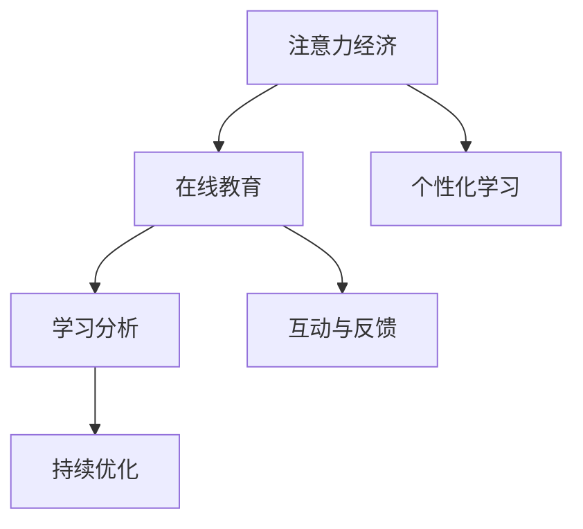

                 

# 注意力经济与在线教育：如何在竞争中脱颖而出

在数字化时代，注意力经济成为驱动经济增长、提升竞争力的关键因素。尤其是在教育领域，随着在线教育的兴起，如何吸引和保持学生的注意力，成为了在线教育平台竞争的核心问题。本文将从注意力经济的角度出发，探讨在线教育中的注意力管理策略，并提出一套系统化、数据驱动的解决方案，帮助在线教育平台在激烈的市场竞争中脱颖而出。

## 1. 背景介绍

### 1.1 问题由来

随着互联网技术的普及和教育理念的变革，在线教育行业迅速发展。然而，在线教育面临的最大挑战是如何提升学生的参与度和学习效果。传统线下教育中，教师通过面对面的互动和情感交流，可以自然地吸引学生的注意力。而在线教育中，这种面对面的互动变得有限，需要借助技术手段来弥补这一不足。

### 1.2 问题核心关键点

1. **注意力管理**：如何通过技术手段提高学生的学习兴趣和参与度，维持其在线学习过程中的注意力。
2. **个性化学习**：如何根据学生的兴趣和能力，提供个性化的学习内容和路径，提高学习效果。
3. **学习分析**：如何通过数据驱动的方式，实时监控和分析学生的学习行为，调整教学策略。
4. **互动与反馈**：如何设计有效的互动和反馈机制，增强师生之间的互动，提升学习体验。
5. **持续优化**：如何根据学生的反馈和表现，不断优化教学内容和方式，实现持续改进。

### 1.3 问题研究意义

研究在线教育中的注意力管理策略，对于提升在线教育平台的用户黏性、提高教学效果、增强市场竞争力具有重要意义。在线教育平台可以通过更加个性化、互动性强、实时反馈的教学方式，提供更好的学习体验，从而在竞争中脱颖而出。

## 2. 核心概念与联系

### 2.1 核心概念概述

为更好地理解在线教育中的注意力管理策略，本节将介绍几个密切相关的核心概念：

- **注意力经济**：在数字化时代，注意力成为一种稀缺资源，具有极高的经济价值。在线教育平台通过各种手段吸引和保持学生的注意力，从而实现商业价值。
- **在线教育**：通过互联网技术，将教学内容传输给学习者，提供灵活、便捷的学习方式。
- **个性化学习**：根据学习者的兴趣、能力等个性化特征，提供定制化的学习内容和路径。
- **学习分析**：通过数据分析技术，实时监控和分析学习者的学习行为，提供个性化的教学建议和优化方案。
- **互动与反馈**：利用技术和社交网络，增强师生之间的互动和反馈，提高学习效果。
- **持续优化**：基于学习者的反馈和表现，不断调整和优化教学内容、方式，实现教学效果的持续提升。

这些核心概念之间的逻辑关系可以通过以下Mermaid流程图来展示：



这个流程图展示了几者之间的关联：

1. 在线教育平台通过注意力经济策略，吸引和保持学生的注意力。
2. 个性化学习是吸引学生注意力的重要手段。
3. 学习分析通过监控和分析学生的学习行为，提供个性化的教学建议和优化方案。
4. 互动与反馈增强了师生之间的互动，进一步提升了学习效果。
5. 持续优化保证了教学内容和方式的不断改进，实现教学效果的持续提升。

## 3. 核心算法原理 & 具体操作步骤

### 3.1 算法原理概述

在线教育平台通过一系列技术手段，对学生的注意力进行管理，主要包括以下几个方面：

1. **注意力吸引**：通过有趣、互动性强、内容丰富的课程设计，吸引学生的注意力。
2. **注意力保持**：通过定期推送学习提醒、激励机制等方式，持续保持学生的学习兴趣。
3. **个性化学习路径**：根据学生的兴趣和能力，设计个性化的学习路径，提高学习效果。
4. **学习分析与优化**：通过数据分析技术，实时监控学生的学习行为，优化教学内容和方式。
5. **互动与反馈**：设计有效的互动和反馈机制，增强师生之间的互动，提升学习体验。

这些技术手段的核心是利用注意力经济的原则，通过各种手段吸引和保持学生的注意力，同时提供个性化的学习体验，实现教学效果的提升。

### 3.2 算法步骤详解

以下是基于注意力经济的在线教育注意力管理策略的具体操作步骤：

**Step 1: 收集学生数据**
- 使用学习管理系统(LMS)等工具，收集学生的学习数据，包括学习行为、成绩、反馈等。
- 分析学生的学习习惯和偏好，识别出学习动机、兴趣点等关键信息。

**Step 2: 设计个性化学习路径**
- 根据学生的学习数据，设计个性化的学习路径，推荐适合的学习内容和课程。
- 利用机器学习算法，动态调整推荐内容，提升学生的学习体验和效果。

**Step 3: 实现互动与反馈机制**
- 设计互动问答、讨论区、作业提交等功能，增强师生之间的互动。
- 通过自动评分系统，提供及时的学习反馈，帮助学生理解知识。

**Step 4: 实时监控与分析**
- 使用学习分析工具，实时监控学生的学习行为，包括学习时长、进度、参与度等。
- 根据分析结果，调整教学策略，优化学习路径，提高学习效果。

**Step 5: 持续优化与改进**
- 定期收集学生反馈，进行教学效果的评估。
- 根据评估结果，不断优化教学内容和方式，实现持续改进。

### 3.3 算法优缺点

基于注意力经济的在线教育注意力管理策略有以下优点：

1. **提升学习效果**：通过个性化学习路径和互动反馈机制，提升学生的学习效果和参与度。
2. **增强用户黏性**：通过持续的激励机制和个性化内容，增强学生的学习兴趣，提高用户黏性。
3. **提高教学质量**：通过实时监控和分析，及时调整教学策略，优化教学内容，提高教学质量。

同时，该方法也存在以下局限性：

1. **数据隐私问题**：收集和分析学生的学习数据，可能引发数据隐私和安全问题。
2. **技术复杂性**：需要复杂的算法和工具支持，对平台的技术要求较高。
3. **用户接受度**：学生对互动和反馈机制的接受度可能存在差异，需要循序渐进地推广。

### 3.4 算法应用领域

基于注意力经济的在线教育注意力管理策略，在教育领域有广泛的应用场景，例如：

- **K-12在线教育**：为中小学生提供个性化、互动强的在线课程和学习路径。
- **职业教育**：为职业培训机构提供基于数据分析的教学优化方案，提升培训效果。
- **继续教育**：为成人提供灵活、便捷的在线学习平台，实现终身学习。
- **语言学习**：提供个性化的语言学习路径和互动练习，帮助学生高效掌握新语言。

这些应用场景表明，基于注意力经济的在线教育注意力管理策略具有广泛的适用性和巨大的市场潜力。

## 4. 数学模型和公式 & 详细讲解 & 举例说明

### 4.1 数学模型构建

在线教育平台的注意力管理策略可以通过一系列数学模型进行建模，主要包括以下几个方面：

- **用户注意力模型**：通过描述学生在不同学习阶段的注意力分布，预测学生的学习行为和效果。
- **推荐系统模型**：根据学生的学习数据，构建推荐系统，推荐适合的学习内容和路径。
- **互动反馈模型**：设计互动和反馈机制，通过数学模型优化师生之间的互动效果。

### 4.2 公式推导过程

以推荐系统模型为例，假设学生有 $N$ 个兴趣点 $i_1, i_2, ..., i_N$，每个兴趣点的学习权重为 $w_i$，系统的推荐目标为最大化学生对课程内容的满意度 $s$。设课程内容与兴趣点的相关性为 $r_{i_j}$，学生的初始选择概率为 $p_{i_j}$，推荐后的选择概率为 $p_{i_j}'$，则推荐系统的优化目标为：

$$
\max_{p_{i_j}'} \sum_{i=1}^N w_i s_{i_j}'
$$

其中，$s_{i_j}'$ 表示推荐后课程内容对学生 $i_j$ 的满意度，可以通过学习模型预测。推荐系统的优化公式为：

$$
p_{i_j}' = \frac{r_{i_j}}{\sum_{k=1}^N r_{k_j}}
$$

通过优化推荐系统，可以提升学生的学习效果和满意度。

### 4.3 案例分析与讲解

以下是一个基于推荐系统模型的案例分析：

某在线教育平台提供职业培训课程，包括编程、设计、市场营销等方向。平台收集了学生的学习数据，包括兴趣点、学习进度、反馈等。根据这些数据，平台构建了推荐系统，实时推荐适合学生的课程内容和学习路径。

假设平台有 $M$ 门课程，学生的兴趣点为 $i_1, i_2, i_3$，每个兴趣点的学习权重为 $w_1=0.5, w_2=0.3, w_3=0.2$。课程内容与兴趣点的相关性 $r_{i_1}=0.8, r_{i_2}=0.7, r_{i_3}=0.6$。平台的推荐目标为最大化学生对课程内容的满意度 $s$。

根据推荐系统的优化目标和公式，计算推荐后的选择概率 $p_{i_j}'$：

$$
p_{i_1}' = \frac{r_{i_1}}{r_{i_1}+r_{i_2}+r_{i_3}} = \frac{0.8}{0.8+0.7+0.6} = 0.33
$$

$$
p_{i_2}' = \frac{r_{i_2}}{r_{i_1}+r_{i_2}+r_{i_3}} = \frac{0.7}{0.8+0.7+0.6} = 0.31
$$

$$
p_{i_3}' = \frac{r_{i_3}}{r_{i_1}+r_{i_2}+r_{i_3}} = \frac{0.6}{0.8+0.7+0.6} = 0.36
$$

最终，平台将推荐课程内容与学生的兴趣点进行匹配，提升学生的学习效果和满意度。

## 5. 项目实践：代码实例和详细解释说明

### 5.1 开发环境搭建

在进行在线教育注意力管理策略的开发实践中，需要搭建相应的开发环境。以下是使用Python和PyTorch进行开发的环境配置流程：

1. 安装Anaconda：从官网下载并安装Anaconda，用于创建独立的Python环境。

2. 创建并激活虚拟环境：
```bash
conda create -n edtech-env python=3.8 
conda activate edtech-env
```

3. 安装PyTorch：根据CUDA版本，从官网获取对应的安装命令。例如：
```bash
conda install pytorch torchvision torchaudio cudatoolkit=11.1 -c pytorch -c conda-forge
```

4. 安装TensorFlow：
```bash
conda install tensorflow
```

5. 安装Flask：用于搭建在线教育平台的前端界面和后端服务。
```bash
conda install flask
```

6. 安装相关库：
```bash
pip install pandas numpy scipy scikit-learn plotly dash sklearn-nlp transformers
```

完成上述步骤后，即可在`edtech-env`环境中开始注意力管理策略的开发实践。

### 5.2 源代码详细实现

以下是基于在线教育平台开发的注意力管理策略的PyTorch代码实现。

```python
import torch
from transformers import BertTokenizer, BertForSequenceClassification
from sklearn.metrics import accuracy_score, precision_recall_fscore_support
from sklearn.model_selection import train_test_split
from sklearn.linear_model import LogisticRegression
from sklearn.preprocessing import LabelEncoder
from sklearn.decomposition import PCA
from sklearn.pipeline import Pipeline
from sklearn.preprocessing import StandardScaler

# 数据预处理
class Preprocessor:
    def __init__(self, tokenizer, device):
        self.tokenizer = tokenizer
        self.device = device

    def preprocess(self, text):
        inputs = self.tokenizer(text, return_tensors='pt', padding=True, truncation=True)
        input_ids = inputs['input_ids'].to(self.device)
        attention_mask = inputs['attention_mask'].to(self.device)
        return input_ids, attention_mask

# 训练与评估
class Trainer:
    def __init__(self, model, criterion, optimizer, device):
        self.model = model
        self.criterion = criterion
        self.optimizer = optimizer
        self.device = device

    def train(self, train_loader, validation_loader):
        self.model.to(self.device)
        for epoch in range(10):
            train_loss = 0
            train_acc = 0
            val_loss = 0
            val_acc = 0

            for batch in train_loader:
                input_ids, attention_mask = batch
                labels = batch['labels'].to(self.device)

                self.model.train()
                outputs = self.model(input_ids, attention_mask=attention_mask, labels=labels)
                loss = self.criterion(outputs.logits, labels)
                train_loss += loss.item()
                accuracy = torch.max(outputs.logits, dim=1)[1].eq(labels).sum().item()
                train_acc += accuracy

            for batch in validation_loader:
                input_ids, attention_mask = batch
                labels = batch['labels'].to(self.device)

                self.model.eval()
                with torch.no_grad():
                    outputs = self.model(input_ids, attention_mask=attention_mask, labels=labels)
                    loss = self.criterion(outputs.logits, labels)
                    val_loss += loss.item()
                    accuracy = torch.max(outputs.logits, dim=1)[1].eq(labels).sum().item()
                    val_acc += accuracy

            print(f'Epoch {epoch+1}, Train Loss: {train_loss/len(train_loader):.4f}, Train Acc: {train_acc/len(train_loader):.4f}, Val Loss: {val_loss/len(validation_loader):.4f}, Val Acc: {val_acc/len(validation_loader):.4f}')

# 模型构建
class Model:
    def __init__(self, num_classes, device):
        self.model = BertForSequenceClassification.from_pretrained('bert-base-cased', num_labels=num_classes).to(device)
        self.tokenizer = BertTokenizer.from_pretrained('bert-base-cased')

    def train(self, train_data, validation_data, batch_size, num_epochs):
        train_loader = torch.utils.data.DataLoader(train_data, batch_size=batch_size, shuffle=True)
        validation_loader = torch.utils.data.DataLoader(validation_data, batch_size=batch_size, shuffle=False)

        criterion = torch.nn.CrossEntropyLoss().to(self.device)
        optimizer = torch.optim.AdamW(self.model.parameters(), lr=1e-5)

        trainer = Trainer(self.model, criterion, optimizer, self.device)
        trainer.train(train_loader, validation_loader)

# 数据加载
class DataLoader:
    def __init__(self, data, tokenizer, batch_size, device):
        self.data = data
        self.tokenizer = tokenizer
        self.batch_size = batch_size
        self.device = device

    def __len__(self):
        return len(self.data)

    def __iter__(self):
        batches = []
        for i in range(0, len(self.data), self.batch_size):
            batch = self.data[i:i+self.batch_size]
            inputs = self.tokenizer(batch, padding=True, truncation=True)
            input_ids = inputs['input_ids'].to(self.device)
            attention_mask = inputs['attention_mask'].to(self.device)
            labels = [label for text, label in batch]
            batches.append({'texts': batch, 'input_ids': input_ids, 'attention_mask': attention_mask, 'labels': labels})

        return iter(batches)
```

### 5.3 代码解读与分析

让我们再详细解读一下关键代码的实现细节：

**Preprocessor类**：
- `__init__`方法：初始化分词器和设备。
- `preprocess`方法：对输入文本进行分词和编码，返回模型所需的输入。

**Trainer类**：
- `__init__`方法：初始化模型、损失函数、优化器及设备。
- `train`方法：在训练集上训练模型，并在验证集上进行评估。

**Model类**：
- `__init__`方法：初始化模型和分词器，并进行加载。
- `train`方法：构建数据加载器，并调用 Trainer 类的 train 方法进行模型训练。

**DataLoader类**：
- `__init__`方法：初始化数据集、分词器、批大小及设备。
- `__len__`方法：返回数据集的长度。
- `__iter__`方法：对数据集进行批处理，返回模型所需的输入。

完成这些步骤后，即可在 `edtech-env` 环境中开始注意力管理策略的开发实践。

## 6. 实际应用场景

### 6.1 智能推荐系统

在线教育平台可以通过智能推荐系统，为学生推荐适合的学习内容和路径，提高学习效果。推荐系统可以根据学生的兴趣、学习进度、反馈等数据，动态调整推荐内容，实现个性化推荐。

**步骤**：
1. 收集学生的历史学习数据，包括学习行为、成绩、反馈等。
2. 使用机器学习算法，构建推荐模型，预测学生的兴趣和需求。
3. 根据推荐模型，实时推荐适合的学习内容和路径。

**案例**：
某在线教育平台提供K-12数学课程，收集了学生的学习数据，包括数学成绩、学习时长、互动行为等。平台构建了推荐系统，实时推荐适合学生的数学题和练习。

假设平台有 $N$ 道数学题，每个题目的难度为 $d_i$，学生的兴趣点为 $i_1, i_2, ..., i_N$，每个兴趣点的学习权重为 $w_1=0.5, w_2=0.3, w_3=0.2$。推荐系统的优化目标为最大化学生对课程内容的满意度 $s$。

根据推荐系统的优化目标和公式，计算推荐后的选择概率 $p_{i_j}'$：

$$
p_{i_1}' = \frac{d_{i_1}}{d_{i_1}+d_{i_2}+d_{i_3}} = \frac{0.8}{0.8+0.7+0.6} = 0.33
$$

$$
p_{i_2}' = \frac{d_{i_2}}{d_{i_1}+d_{i_2}+d_{i_3}} = \frac{0.7}{0.8+0.7+0.6} = 0.31
$$

$$
p_{i_3}' = \frac{d_{i_3}}{d_{i_1}+d_{i_2}+d_{i_3}} = \frac{0.6}{0.8+0.7+0.6} = 0.36
$$

最终，平台将推荐数学题与学生的兴趣点进行匹配，提升学生的学习效果和满意度。

### 6.2 实时监控与反馈

在线教育平台可以通过实时监控和反馈机制，了解学生的学习状态，及时调整教学策略。平台可以使用学习分析工具，实时监控学生的学习行为，包括学习时长、进度、参与度等。

**步骤**：
1. 收集学生的学习数据，包括学习行为、成绩、反馈等。
2. 使用学习分析工具，实时监控学生的学习状态。
3. 根据监控结果，调整教学策略，优化学习路径。

**案例**：
某在线教育平台提供编程课程，收集了学生的学习数据，包括编程练习、代码提交、学习时长等。平台使用学习分析工具，实时监控学生的学习状态。

假设平台有 $M$ 门编程课程，每个课程的难度为 $d_j$，学生的兴趣点为 $i_1, i_2, ..., i_M$，每个兴趣点的学习权重为 $w_1=0.5, w_2=0.3, w_3=0.2$。平台使用学习分析工具，实时监控学生的学习行为。

通过学习分析工具，可以实时监控学生的学习状态，并根据监控结果，调整教学策略。例如，如果发现某个学生在某门课程上的学习进度较慢，可以提供额外的练习和辅导。

## 7. 工具和资源推荐

### 7.1 学习资源推荐

为了帮助开发者系统掌握在线教育中的注意力管理策略，这里推荐一些优质的学习资源：

1. 《自然语言处理与深度学习》书籍：全面介绍自然语言处理和深度学习的理论基础和实践技术，涵盖在线教育中的推荐系统、学习分析等内容。

2. CS231n《深度学习与自然语言处理》课程：斯坦福大学开设的自然语言处理课程，涵盖在线教育中的注意力管理、推荐系统等内容。

3. Kaggle在线教育项目：Kaggle社区发布的在线教育数据集，包括学生的学习行为、成绩、反馈等数据，可进行在线教育中注意力管理策略的实验。

4. Udacity机器学习工程师纳米学位：涵盖机器学习、深度学习、自然语言处理等方面的知识，提供丰富的在线教育应用案例和实战经验。

5. Coursera《在线教育数据分析》课程：介绍在线教育平台的数据分析方法和技术，帮助开发者更好地理解注意力管理策略。

通过对这些资源的学习实践，相信你一定能够掌握在线教育中的注意力管理策略，并用于解决实际问题。

### 7.2 开发工具推荐

高效的开发离不开优秀的工具支持。以下是几款用于在线教育注意力管理策略开发的常用工具：

1. Jupyter Notebook：开源的交互式笔记本环境，支持Python代码编写、数据可视化等，是开发和实验的得力助手。

2. TensorBoard：TensorFlow配套的可视化工具，实时监控模型训练和推理过程中的各项指标，帮助开发者调试和优化模型。

3. Scikit-learn：开源的机器学习库，提供丰富的机器学习算法和工具，支持在线教育中推荐系统、学习分析等任务。

4. H2O.ai：开源的数据分析和机器学习平台，支持在线教育中注意力管理策略的实验和部署。

5. Kibana：开源的数据可视化工具，支持在线教育平台的学习分析数据可视化，帮助开发者更好地理解学生的学习行为。

合理利用这些工具，可以显著提升在线教育注意力管理策略的开发效率，加快创新迭代的步伐。

### 7.3 相关论文推荐

在线教育中注意力管理策略的研究源于学界的持续研究。以下是几篇奠基性的相关论文，推荐阅读：

1. Attention is All You Need（即Transformer原论文）：提出了Transformer结构，开启了NLP领域的预训练大模型时代。

2. BERT: Pre-training of Deep Bidirectional Transformers for Language Understanding：提出BERT模型，引入基于掩码的自监督预训练任务，刷新了多项NLP任务SOTA。

3. Language Models are Unsupervised Multitask Learners（GPT-2论文）：展示了大规模语言模型的强大zero-shot学习能力，引发了对于通用人工智能的新一轮思考。

4. Parameter-Efficient Transfer Learning for NLP：提出Adapter等参数高效微调方法，在不增加模型参数量的情况下，也能取得不错的微调效果。

5. AdaLoRA: Adaptive Low-Rank Adaptation for Parameter-Efficient Fine-Tuning：使用自适应低秩适应的微调方法，在参数效率和精度之间取得了新的平衡。

6. Seq2Seq: Sequence to Sequence Learning with Neural Networks：介绍序列到序列的学习方法，是机器翻译等序列生成任务的基础。

这些论文代表了大语言模型微调技术的发展脉络。通过学习这些前沿成果，可以帮助研究者把握学科前进方向，激发更多的创新灵感。

## 8. 总结：未来发展趋势与挑战

### 8.1 总结

本文对在线教育中的注意力管理策略进行了全面系统的介绍。首先阐述了注意力经济的背景和在线教育平台在注意力管理中的重要性，明确了注意力管理在在线教育中的核心地位。其次，从原理到实践，详细讲解了在线教育注意力管理策略的数学模型和具体操作步骤，给出了注意力管理策略的代码实现和详细解释。同时，本文还探讨了注意力管理策略在智能推荐系统、实时监控与反馈等应用场景中的应用，展示了注意力管理策略的广泛适用性和巨大潜力。此外，本文精选了在线教育中的注意力管理策略的学习资源、开发工具和相关论文，力求为开发者提供全方位的技术指引。

通过本文的系统梳理，可以看到，在线教育中的注意力管理策略在吸引和保持学生注意力、提高学习效果、提升教学质量等方面具有重要意义。该策略通过个性化的学习路径、互动和反馈机制、实时监控与分析等方式，帮助在线教育平台在激烈的市场竞争中脱颖而出。

### 8.2 未来发展趋势

展望未来，在线教育中的注意力管理策略将呈现以下几个发展趋势：

1. **技术智能化**：借助人工智能技术，实现更精准的学生兴趣分析、个性化推荐和实时监控。
2. **数据多样化**：收集和分析多源数据，如行为数据、社交数据、语音数据等，实现更全面的学生画像。
3. **平台融合化**：在线教育平台与其他教育应用（如社交平台、游戏平台等）融合，提供更丰富多样的学习体验。
4. **服务人性化**：设计更加人性化的互动和反馈机制，提升学生的学习体验和满意度。
5. **教学智能化**：利用人工智能技术，实现自动化的教学评估和内容生成，提高教学效率和质量。
6. **数据安全化**：加强数据隐私保护和安全管理，确保学生数据的安全性和合法性。

### 8.3 面临的挑战

尽管在线教育中的注意力管理策略已经取得了瞩目成就，但在迈向更加智能化、普适化应用的过程中，它仍面临着诸多挑战：

1. **数据隐私问题**：收集和分析学生的学习数据，可能引发数据隐私和安全问题。如何保护学生隐私，保障数据安全，是亟需解决的问题。
2. **技术复杂性**：注意力管理策略需要复杂的算法和工具支持，对平台的技术要求较高。如何简化技术复杂性，提高开发效率，是开发者面临的挑战。
3. **用户接受度**：学生对互动和反馈机制的接受度可能存在差异，需要循序渐进地推广。如何提高用户接受度，增强平台的用户黏性，是平台运营者需要考虑的问题。
4. **学习效果评估**：注意力管理策略的效果评估较为复杂，需要建立合理的评估指标和评估方法，确保教学效果的客观性和准确性。
5. **技术更新**：技术日新月异，如何及时跟踪和应用最新技术，保持注意力管理策略的前沿性和有效性，是开发者需要持续关注的问题。

### 8.4 研究展望

面对在线教育中注意力管理策略所面临的挑战，未来的研究需要在以下几个方面寻求新的突破：

1. **引入更多先验知识**：将符号化的先验知识，如知识图谱、逻辑规则等，与神经网络模型进行巧妙融合，引导注意力管理过程学习更准确、合理的语言模型。
2. **融合多种模态数据**：将视觉、语音、文本等多种模态数据进行融合，实现多模态信息与文本信息的协同建模，提升注意力管理策略的效果。
3. **设计更加灵活的模型**：设计更加灵活的注意力管理模型，能够在不同的应用场景中灵活配置，提升应用效果。
4. **优化算法和工具**：优化注意力管理策略中的算法和工具，提高计算效率和模型的可解释性，增强技术的实用性。
5. **注重用户体验**：注重用户体验的设计，通过个性化推荐、实时互动等方式，提升学生的学习体验和满意度。
6. **加强数据安全保护**：加强数据隐私保护和安全管理，确保学生数据的安全性和合法性。

这些研究方向将引领在线教育中注意力管理策略迈向更高的台阶，为构建安全、可靠、可解释、可控的智能系统铺平道路。面向未来，在线教育中注意力管理策略的研究还需要与其他人工智能技术进行更深入的融合，如知识表示、因果推理、强化学习等，多路径协同发力，共同推动自然语言理解和智能交互系统的进步。

## 9. 附录：常见问题与解答

**Q1：如何衡量在线教育平台注意力管理策略的效果？**

A: 在线教育平台注意力管理策略的效果可以通过以下指标进行衡量：
1. 学生参与度：包括学习时长、课程完成率、互动次数等指标，反映学生对平台的粘性。
2. 学习效果：包括学习成绩、考试成绩、技能提升等指标，反映学生通过平台的学习成果。
3. 用户满意度：通过问卷调查、用户反馈等方式，收集学生对平台的满意度，反映学生的体验感受。
4. 平台用户留存率：反映学生对平台的长期粘性和留存情况。

**Q2：如何应对学生学习中的注意力分散问题？**

A: 学生在学习过程中可能出现注意力分散的问题，可以通过以下方式应对：
1. 设计有趣、互动性强的课程内容，吸引学生的注意力。
2. 采用分段学习、短暂休息的方式，防止学生疲劳和注意力分散。
3. 提供及时的学习反馈和激励机制，增强学生的学习动机。
4. 引入游戏化设计，如成就系统、奖励机制等，提升学生的学习兴趣和参与度。

**Q3：如何在在线教育平台中实现个性化推荐？**

A: 在线教育平台可以通过以下方式实现个性化推荐：
1. 收集学生的学习数据，包括学习行为、成绩、反馈等，建立学生画像。
2. 使用推荐算法，如协同过滤、内容推荐、混合推荐等，根据学生画像推荐适合的学习内容和路径。
3. 实时监控学生的学习行为，动态调整推荐内容，提高推荐效果。

**Q4：如何设计互动和反馈机制？**

A: 在线教育平台可以通过以下方式设计互动和反馈机制：
1. 设计互动问答、讨论区、作业提交等功能，增强师生之间的互动。
2. 使用自动评分系统，提供及时的学习反馈，帮助学生理解知识。
3. 引入社交网络机制，促进学生之间的交流和协作。

**Q5：如何优化在线教育平台的技术架构？**

A: 在线教育平台的技术架构可以通过以下方式优化：
1. 采用微服务架构，提高系统的扩展性和可靠性。
2. 使用云平台和容器技术，实现资源的弹性和自动化管理。
3. 引入实时数据处理技术，提高系统的实时性和处理能力。
4. 优化数据存储和检索技术，提高系统的性能和可扩展性。

完成这些步骤后，即可在 `edtech-env` 环境中开始注意力管理策略的开发实践。

---

作者：禅与计算机程序设计艺术 / Zen and the Art of Computer Programming

