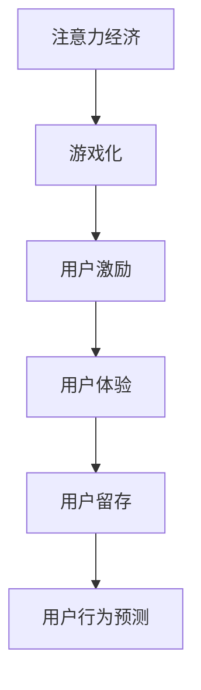

                 

# 注意力经济与游戏化：如何利用游戏机制吸引受众

> 关键词：注意力经济,游戏化,用户激励,用户体验,营销策略,用户留存,行为分析,用户行为预测

## 1. 背景介绍

### 1.1 问题由来

随着互联网技术的飞速发展，信息过载成为普遍现象。用户在面对海量信息和内容时，会经历认知负担和疲劳，逐渐失去兴趣和参与度。如何高效吸引用户注意力，提升用户体验，成为互联网企业面临的严峻挑战。

在这一背景下，注意力经济（Economics of Attention）的概念被提出，强调在信息爆炸的互联网时代，如何通过提升用户注意力价值，实现商业变现。游戏化（Gamification）则是利用游戏机制，将非游戏元素变成游戏体验，提高用户参与度和满意度的有效手段。

游戏化通过引入游戏机制，如积分、排行榜、成就等，激励用户积极参与，并在互动和反馈中建立情感连接。游戏化的核心在于设计具有吸引力的机制，引导用户进入持续互动的循环中，从而提升用户黏性和忠诚度。

### 1.2 问题核心关键点

基于注意力经济和游戏化的核心概念，本文将探讨如何通过游戏机制吸引用户注意力，提升用户体验，以及在游戏化策略实施中应注意的关键点。

## 2. 核心概念与联系

### 2.1 核心概念概述

为更好地理解注意力经济和游戏化的应用，本节将介绍几个密切相关的核心概念：

- **注意力经济**：信息时代，用户注意力的稀缺性成为一种稀缺资源，如何通过设计吸引用户注意力，获得商业价值。
- **游戏化**：通过引入游戏机制，如积分、成就、排行榜等，提高用户参与度和忠诚度，提升用户体验。
- **用户激励**：通过奖励和激励，激励用户积极参与，实现用户行为改变和增强。
- **用户体验**：用户在应用或服务中获得的整体感知和感受，包括界面、性能、互动等方面。
- **用户留存**：通过策略和机制，提升用户在平台或产品中的持续使用和参与，延长用户生命周期。
- **用户行为预测**：通过分析用户行为数据，预测用户未来行为，实现个性化推荐和服务。

这些核心概念之间的逻辑关系可以通过以下Mermaid流程图来展示：



这个流程图展示了大语言模型的核心概念及其之间的关系：

1. 注意力经济通过游戏化吸引用户注意力。
2. 游戏化通过用户激励机制提高用户参与度。
3. 用户激励机制提升用户体验。
4. 用户体验提升用户留存率。
5. 用户留存率通过用户行为预测进一步优化。

这些概念共同构成了提升用户注意力的框架，使企业能够更好地吸引和保持用户。

## 3. 核心算法原理 & 具体操作步骤
### 3.1 算法原理概述

注意力经济和游戏化的核心在于通过设计吸引用户注意力的机制，通过游戏化激励用户积极参与，提升用户体验，从而实现用户留存和商业变现。其核心思想是：

1. **用户激励设计**：通过积分、成就、徽章等机制，激励用户完成特定行为或任务。
2. **用户体验优化**：通过界面设计、性能优化、互动反馈等手段，提升用户在使用过程中的整体感受。
3. **用户行为分析**：通过分析用户行为数据，预测用户兴趣和需求，提供个性化推荐和服务。

### 3.2 算法步骤详解

注意力经济和游戏化的实现过程通常包括以下关键步骤：

**Step 1: 用户行为建模**
- 收集用户行为数据，包括点击、浏览、购买、互动等行为。
- 通过统计分析，构建用户行为模型，识别用户偏好和需求。

**Step 2: 游戏机制设计**
- 设计合适的游戏机制，如积分系统、排行榜、成就体系等。
- 定义任务和目标，明确用户需要完成哪些行为才能获得奖励。

**Step 3: 用户激励实施**
- 实现用户激励机制，记录用户完成任务的情况，提供奖励。
- 设计多层次激励，如即时反馈和长期激励结合，吸引用户持续参与。

**Step 4: 用户体验优化**
- 优化应用界面，提升用户体验，增强用户对平台的粘性。
- 实时收集用户反馈，不断改进产品和服务。

**Step 5: 用户行为分析**
- 分析用户行为数据，预测用户需求和偏好。
- 基于预测结果，提供个性化推荐和定制化服务。

### 3.3 算法优缺点

注意力经济和游戏化在吸引用户注意力方面具有以下优点：
1. 提升用户参与度。通过游戏机制激励，用户更愿意主动参与，提升互动和留存。
2. 增强用户忠诚度。用户通过完成任务获得成就感和奖励，对平台形成归属感。
3. 优化用户体验。游戏机制提升互动性和反馈感，增强用户满意度和黏性。
4. 实现商业变现。通过提升用户参与度和留存率，实现更高频次的消费和转化。

同时，该方法也存在一定的局限性：
1. 依赖用户粘性。如果用户不具备足够的粘性，游戏机制的吸引力有限。
2. 激励设计复杂。设计复杂的游戏机制，需要投入大量时间和资源。
3. 激励效果不确定。过度依赖奖励机制，可能导致用户对奖励的依赖性增强，降低长期参与意愿。
4. 可能引起用户反感。设计不当的游戏机制，可能导致用户反感，影响用户体验。

尽管存在这些局限性，但就目前而言，注意力经济和游戏化仍是吸引用户注意力、提升用户体验的重要手段。未来相关研究的重点在于如何更好地设计游戏机制，平衡激励与体验，同时兼顾可解释性和伦理安全性等因素。

### 3.4 算法应用领域

注意力经济和游戏化技术已经在电商、社交、娱乐、教育等多个领域得到了广泛的应用，为各类平台带来了显著的商业价值。

- **电商**：通过积分、优惠券、评价排名等游戏机制，提升用户购买意愿和频次。
- **社交**：通过点赞、评论、分享等社交行为的游戏化，增强用户互动和粘性。
- **娱乐**：通过积分、排行榜、成就等游戏机制，提高用户参与度和娱乐体验。
- **教育**：通过积分、打卡、挑战等游戏机制，激发学生学习兴趣，提高学习效果。

除了上述这些经典应用外，游戏化还在企业培训、健康管理、政府服务等众多领域得到创新性的应用，为各行业带来了新的活力和生机。

## 4. 数学模型和公式 & 详细讲解  
### 4.1 数学模型构建

注意力经济和游戏化的数学模型可以通过用户行为数据进行建模，并通过博弈论和强化学习等方法进行优化。

假设用户集合为 $U$，行为集合为 $A$，奖励集合为 $R$，定义用户行为序列 $T=(A_1, A_2, ..., A_t)$，每项行为对应的奖励为 $R_t$。记用户完成某一行为的概率为 $P(A|U)$，模型目标为最大化用户行为的总期望奖励。

数学模型可以表示为：

$$
\max_{P(A|U)} \mathbb{E} \left[ \sum_{t=1}^T R_t \right]
$$

### 4.2 公式推导过程

在博弈论框架下，用户行为可以看作是一个多轮博弈过程。用户在每一轮中都会根据当前状态和奖励，选择最优的行为策略。假设每轮博弈的奖励函数为 $r_t(A)$，用户行为选择的策略为 $p_t(A)$，则博弈过程的期望总奖励为：

$$
\mathbb{E} \left[ \sum_{t=1}^T r_t(A) p_t(A) \right]
$$

通过逆向归纳法，可以找到每一轮的最优策略，即：

$$
p_t(A) = \frac{r_t(A)}{\sum_{a \in A} r_t(a)}
$$

将每轮的最优策略代入博弈过程，即可求解最优的用户行为策略，从而实现最大化总期望奖励的目标。

### 4.3 案例分析与讲解

以下是一个电商平台的积分奖励机制设计案例：

假设电商平台通过积分奖励用户购买行为，每消费一定金额获得一定积分，积分可兑换优惠券或商品。用户完成某次购买行为的概率为 $P(A|U)$，每笔交易的积分奖励为 $R_t$，总交易金额为 $T$。

通过建立数学模型，求解最优的积分奖励策略 $R_t$ 和用户行为策略 $P(A|U)$，使得总期望收益最大化。

具体步骤如下：

1. 收集用户历史交易数据，统计不同消费金额下的积分奖励。
2. 建立用户行为模型，识别不同消费水平的用户特征。
3. 根据用户行为模型和历史积分奖励数据，求解最优的积分奖励策略 $R_t$。
4. 根据最优积分奖励策略和用户行为模型，求解用户完成某次购买行为的概率 $P(A|U)$。
5. 基于最优策略，提升用户购买意愿和留存率。

这个案例展示了通过数学模型和博弈论方法，如何设计有效的积分奖励机制，最大化用户参与度和平台收益。

## 5. 项目实践：代码实例和详细解释说明
### 5.1 开发环境搭建

在进行游戏化项目实践前，我们需要准备好开发环境。以下是使用Python进行Flask开发的开发环境配置流程：

1. 安装Anaconda：从官网下载并安装Anaconda，用于创建独立的Python环境。

2. 创建并激活虚拟环境：
```bash
conda create -n pyenv python=3.8 
conda activate pyenv
```

3. 安装Flask：
```bash
pip install flask
```

4. 安装其他必要的工具包：
```bash
pip install numpy pandas sklearn pytorch torchvision torchaudio scikit-learn matplotlib tqdm jupyter notebook ipython
```

完成上述步骤后，即可在`pyenv`环境中开始游戏化项目开发。

### 5.2 源代码详细实现

这里我们以一个简单的积分奖励机制为例，展示如何使用Flask实现用户行为跟踪和积分奖励。

首先，定义积分和用户模型：

```python
from flask import Flask, request, jsonify

app = Flask(__name__)

# 用户和积分数据
users = {"Alice": {"id": "1", "score": 0}, "Bob": {"id": "2", "score": 0}}
scores = {}

@app.route('/user', methods=['POST'])
def user_request():
    user_id = request.json['user_id']
    if user_id in users:
        users[user_id]['score'] += 1
        scores[user_id] = users[user_id]['score']
    else:
        users[user_id] = {"id": user_id, "score": 1}
        scores[user_id] = 1
    return jsonify(scores)
```

然后，定义积分兑换和排行榜接口：

```python
@app.route('/exchange', methods=['POST'])
def exchange_request():
    user_id = request.json['user_id']
    if user_id in scores:
        score = scores[user_id]
        if score >= 100:
            scores[user_id] -= 100
            return jsonify({"message": "兑换成功", "remaining_score": scores[user_id]})
        else:
            return jsonify({"message": "积分不足"})
    else:
        return jsonify({"message": "用户不存在"})

@app.route('/leaderboard', methods=['GET'])
def leaderboard_request():
    sorted_scores = sorted(scores.items(), key=lambda x: x[1], reverse=True)
    return jsonify(sorted_scores)
```

最后，启动Flask服务：

```python
if __name__ == '__main__':
    app.run(debug=True)
```

完成上述步骤后，即可在`pyenv`环境中通过浏览器访问Flask应用，实现用户行为跟踪和积分奖励。

### 5.3 代码解读与分析

让我们再详细解读一下关键代码的实现细节：

**Flask应用**：
- 定义应用对象，创建Flask实例。
- 定义用户和积分数据，初始化用户行为数据。
- 实现用户行为跟踪接口，根据请求更新用户积分。
- 实现积分兑换接口，根据积分进行兑换。
- 实现排行榜接口，根据积分排名。

**用户行为跟踪接口**：
- 通过POST请求接收用户行为数据。
- 判断用户是否存在，不存在则新增用户。
- 根据用户行为更新积分数据，返回更新后的积分记录。

**积分兑换接口**：
- 通过POST请求接收积分兑换请求。
- 判断用户是否存在，积分是否充足。
- 根据兑换规则更新积分数据，返回兑换结果。

**排行榜接口**：
- 通过GET请求获取排行榜数据。
- 根据积分数据进行排序，返回排名信息。

可以看到，Flask框架使得游戏化功能的开发变得简洁高效。开发者可以将更多精力放在数据处理、策略优化等高层逻辑上，而不必过多关注底层的实现细节。

当然，工业级的系统实现还需考虑更多因素，如用户行为数据的安全性、积分兑换的复杂逻辑、排行榜的实时性等。但核心的游戏化功能基本与此类似。

## 6. 实际应用场景
### 6.1 电商平台

基于积分奖励机制的游戏化策略，可以广泛应用于电商平台的营销活动中。通过积分奖励用户购买行为，提升用户粘性和复购率。

具体而言，可以设计以下积分奖励机制：
- 用户每消费一定金额获得一定积分。
- 积分可兑换优惠券、商品等奖励。
- 通过排行榜和成就体系，激励用户持续参与，提升平台收益。

在技术实现上，可以建立Flask应用，记录用户行为，生成积分奖励，提供排行榜和兑换服务。通过积分机制，电商平台可以大幅度提升用户参与度和留存率，实现更高的商业价值。

### 6.2 社交平台

社交平台通过点赞、评论、分享等游戏机制，增强用户互动和粘性。用户通过完成任务获得积分、徽章等奖励，提升平台体验。

具体实现步骤如下：
- 记录用户的点赞、评论、分享等行为，生成积分和徽章。
- 通过排行榜展示用户积分和排名，激励用户积极互动。
- 设计成就体系，如连续签到、完成特定任务等，提升用户参与度。

在技术实现上，可以构建Flask应用，记录用户行为，生成积分和徽章，提供排行榜和成就展示。通过游戏化机制，社交平台可以提升用户互动和留存率，构建更活跃的社区环境。

### 6.3 娱乐平台

娱乐平台通过积分、排行榜、成就等游戏机制，提高用户参与度和娱乐体验。用户通过完成任务获得积分和奖励，实现持续参与。

具体实现步骤如下：
- 记录用户的游戏行为，如关卡、任务完成等，生成积分和成就。
- 通过排行榜展示用户积分和排名，激励用户积极参与。
- 设计成就体系，如通关关卡、获得特殊道具等，提升用户体验。

在技术实现上，可以构建Flask应用，记录用户游戏行为，生成积分和成就，提供排行榜和成就展示。通过游戏化机制，娱乐平台可以提升用户参与度和娱乐体验，实现更高的用户粘性。

### 6.4 未来应用展望

随着游戏化技术的发展，基于注意力经济和游戏化的应用场景将不断拓展，为更多行业带来新的生机和活力。

在智慧医疗领域，通过游戏化机制，可以激励用户进行健康监测和运动，提升健康管理效果。

在智能教育领域，通过游戏化机制，可以激发学生学习兴趣，提升学习效果。

在智慧城市治理中，通过游戏化机制，可以提升市民参与度和满意度，构建更智能、高效的城市治理体系。

此外，在游戏化技术的基础上，可以进一步发展智能推荐、社交互动、内容创作等应用场景，为各行各业带来更丰富的创新。

## 7. 工具和资源推荐
### 7.1 学习资源推荐

为了帮助开发者系统掌握游戏化技术，这里推荐一些优质的学习资源：

1. **《游戏化设计指南》**：一本详细介绍游戏化设计原理和应用场景的书籍，适合初学者和进阶开发者。

2. **Coursera《游戏化设计》课程**：由UCLA教授讲授的游戏化设计课程，涵盖游戏化的理论和实践，适合深度学习。

3. **Gamasutra网站**：游戏行业权威技术平台，提供大量游戏化设计和开发案例，适合实战学习。

4. **GameStorm游戏化峰会**：国际游戏化峰会，汇集全球顶尖游戏化设计师和开发者，分享最新理论和实践。

5. **GameBrew游戏化社区**：游戏化开发者交流平台，提供丰富的游戏化工具和资源，适合开发者交流学习。

通过对这些资源的学习实践，相信你一定能够快速掌握游戏化技术的精髓，并用于解决实际的业务问题。

### 7.2 开发工具推荐

高效的开发离不开优秀的工具支持。以下是几款用于游戏化开发常用的工具：

1. **Flask**：基于Python的轻量级Web框架，适合快速开发游戏化应用。

2. **Django**：基于Python的全栈Web框架，适合构建复杂的后台管理系统。

3. **React**：基于JavaScript的前端框架，适合开发交互式游戏化应用。

4. **Unity3D**：一款强大的游戏引擎，适合开发复杂的3D游戏和游戏化应用。

5. **Tableau**：数据可视化工具，适合分析用户行为数据，生成排行榜和可视化图表。

6. **Kaggle**：数据科学竞赛平台，适合探索和验证游戏化策略的有效性。

合理利用这些工具，可以显著提升游戏化应用的开发效率，加快创新迭代的步伐。

### 7.3 相关论文推荐

游戏化技术的发展源于学界的持续研究。以下是几篇奠基性的相关论文，推荐阅读：

1. **"Beyond Hedonic Psychology: Understanding the Fun Elements of Video Games"**：通过分析游戏元素和用户体验，探讨游戏化的心理机制。

2. **"The Power of Fun: How to Motivate and Engage People With Game Mechanics"**：研究游戏机制对用户激励的影响，提供游戏化设计理论。

3. **"Gamification by Design"**：介绍游戏化设计过程和策略，提供实际案例和应用指南。

4. **"The Serious Gamer: Gamification in Marketing and Media"**：研究游戏化在营销和媒体中的应用，提供商业化策略和实施方案。

这些论文代表了大语言模型微调技术的发展脉络。通过学习这些前沿成果，可以帮助研究者把握学科前进方向，激发更多的创新灵感。

## 8. 总结：未来发展趋势与挑战
### 8.1 总结

本文对注意力经济和游戏化的概念和应用进行了全面系统的介绍。首先阐述了游戏化在提升用户注意力和体验方面的重要作用，明确了游戏化在企业落地应用中的独特价值。其次，从原理到实践，详细讲解了游戏化的数学模型和核心算法，给出了游戏化项目开发的完整代码实例。同时，本文还广泛探讨了游戏化方法在游戏、电商、社交等众多领域的应用前景，展示了游戏化范式的广阔前景。最后，本文精选了游戏化技术的各类学习资源，力求为读者提供全方位的技术指引。

通过本文的系统梳理，可以看到，游戏化技术正在成为提升用户体验、吸引用户注意力的重要手段，极大地拓展了企业应用的范围和深度。受益于游戏化技术的发展，企业可以更好地利用用户注意力，实现商业价值的最大化。未来，伴随游戏化技术的持续演进，游戏化范式必将在更多领域得到应用，为各类企业带来新的生机和活力。

### 8.2 未来发展趋势

展望未来，游戏化技术将呈现以下几个发展趋势：

1. **泛化到更多场景**：游戏化技术将从传统的游戏行业，向电商、社交、娱乐、教育等多个领域拓展，为更多行业带来新的生机和活力。

2. **个性化和定制化**：游戏化设计将更加个性化和定制化，根据用户行为和偏好，提供量身定制的游戏体验，提升用户体验。

3. **跨平台和跨设备**：游戏化应用将突破平台和设备的限制，实现跨平台、跨设备的无缝体验，提升用户粘性。

4. **数据驱动的决策**：游戏化设计将更加依赖数据驱动，通过数据分析和预测，优化游戏机制和激励策略，提升用户参与度。

5. **情感和心理研究**：游戏化设计将更多地关注用户体验的情感和心理层面，通过心理学研究，设计更加吸引用户的游戏机制。

6. **AI辅助设计**：游戏化设计将引入AI技术，通过自动生成游戏元素和激励策略，提升设计效率和效果。

以上趋势凸显了游戏化技术的发展方向，这些方向的探索发展，必将进一步提升用户体验和平台收益，为各行业带来新的机遇和挑战。

### 8.3 面临的挑战

尽管游戏化技术已经取得了瞩目成就，但在迈向更加智能化、普适化应用的过程中，它仍面临诸多挑战：

1. **用户数据隐私**：游戏化应用需要收集大量用户行为数据，如何保护用户隐私，避免数据滥用，是一个重要问题。

2. **激励设计复杂**：设计复杂的游戏机制，需要投入大量时间和资源，且需要反复迭代和优化。

3. **用户适应性**：不同用户对游戏机制的适应性不同，如何设计多样化的游戏机制，满足不同用户的需求，是一个重要挑战。

4. **激励效果不确定**：过度依赖奖励机制，可能导致用户对奖励的依赖性增强，降低长期参与意愿。

5. **用户体验不一致**：游戏化应用在不同平台和设备上的用户体验可能不一致，如何实现跨平台一致性，是一个重要问题。

6. **模型复杂度**：游戏化设计涉及复杂的数据分析和模型预测，如何简化模型，提升效率和效果，是一个重要挑战。

这些挑战凸显了游戏化技术在落地应用中的复杂性和不确定性。游戏化技术的研究和应用，还需要不断探索和优化，才能更好地适应市场需求和用户需求。

### 8.4 研究展望

面对游戏化面临的种种挑战，未来的研究需要在以下几个方面寻求新的突破：

1. **数据隐私保护**：通过加密和匿名化技术，保护用户隐私，避免数据滥用。

2. **激励设计简化**：引入自动生成技术和AI辅助设计，简化激励设计过程，提高设计效率。

3. **用户体验优化**：通过跨平台和跨设备技术，提升用户体验的一致性，增强用户粘性。

4. **用户适应性增强**：通过个性化和定制化设计，满足不同用户的需求，提升用户参与度。

5. **激励效果优化**：通过多层次激励和动态调整，优化激励效果，提高用户长期参与意愿。

6. **模型简化**：通过简化模型和优化算法，提高游戏化设计的效率和效果。

这些研究方向的探索，必将引领游戏化技术迈向更高的台阶，为提升用户体验、吸引用户注意力提供新的解决方案。相信伴随技术的持续演进，游戏化技术必将在更多领域得到应用，为各类企业带来新的生机和活力。

## 9. 附录：常见问题与解答
----------------------------------------------------------------

**Q1：游戏化技术是否适用于所有企业？**

A: 游戏化技术在提升用户参与度和体验方面具有广泛的应用前景，适用于需要增强用户互动和留存率的企业，如电商、社交、娱乐、教育等。但不同企业的需求和应用场景不同，需要根据具体情况进行定制化设计和实施。

**Q2：如何衡量游戏化效果？**

A: 游戏化效果的衡量可以从多个维度进行，包括用户参与度、留存率、转化率、满意度等。常用的衡量指标包括：
- 用户互动频率：如点赞、评论、分享等行为次数。
- 用户留存率：不同时间段的用户留存情况。
- 用户转化率：新用户到活跃用户的转化比例。
- 用户满意度：通过问卷调查等方式，了解用户对游戏化机制的反馈和满意度。

**Q3：如何设计合理的游戏机制？**

A: 设计合理的游戏机制需要考虑以下因素：
- 用户需求和行为：根据用户特点和行为模式，设计合适的游戏机制。
- 目标和激励设计：明确游戏机制的目标和激励，设计合适的奖励和反馈机制。
- 多层次激励：设计多层次激励，包括即时反馈和长期激励，激励用户持续参与。
- 跨平台一致性：保证游戏机制在不同平台和设备上的用户体验一致。

**Q4：如何保护用户隐私？**

A: 保护用户隐私是游戏化应用的重要问题，可以通过以下措施进行保护：
- 数据匿名化：在数据分析和建模过程中，对用户数据进行匿名化处理，避免数据滥用。
- 加密传输：通过加密技术，保护用户数据在传输过程中的安全性。
- 用户同意：在收集用户数据前，明确告知用户数据用途，获取用户同意。

**Q5：游戏化是否会导致用户依赖？**

A: 过度依赖游戏化机制，可能导致用户对奖励和激励的依赖性增强，降低长期参与意愿。为了解决这一问题，可以设计多层次激励机制，避免过度依赖单一激励，同时设计多样化的游戏元素和互动方式，提升用户参与的趣味性和多样性。

这些问题的解答，为游戏化技术的实施提供了指导和参考，帮助企业在应用游戏化技术时，更好地平衡激励和体验，提升用户参与度和满意度。相信伴随游戏化技术的不断演进，游戏化范式必将在更多领域得到应用，为各类企业带来新的生机和活力。

