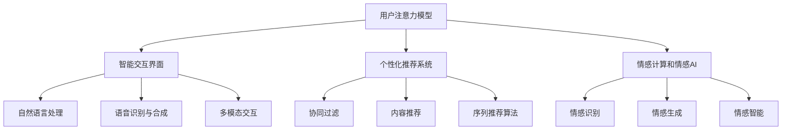

                 

# 注意力经济与用户体验优化技术：创建令人上瘾和引人入胜的产品

## 1. 背景介绍

### 1.1 问题由来
在数字化时代，用户注意力资源稀缺且分散，吸引并维持用户注意力成为互联网企业的核心竞争优势。注意力经济时代，产品设计、内容运营、用户体验等各个环节都需要精准把握用户心理，打造能引发用户强烈情感共鸣和持续参与的产品。尤其在快速迭代的用户界面(UI)和用户体验(UX)领域，如何通过数据和算法驱动的智能设计，为用户创造既符合个人需求又令人上瘾的交互体验，是当前产品设计和技术开发的核心命题。

### 1.2 问题核心关键点
在注意力经济和用户体验优化的背景下，技术手段的合理应用和数据驱动的设计，成为了产品设计的两大支柱。具体来说，可以从以下几个关键点进行深入思考：
1. **用户注意力模型**：构建精准的个性化用户模型，理解用户行为和心理特征。
2. **智能交互界面**：利用先进的交互设计技术，提供直观、高效、人性化的界面体验。
3. **个性化推荐系统**：运用深度学习算法和大数据技术，为用户提供个性化、动态的内容推荐。
4. **情感计算和情感AI**：开发能识别用户情感、理解用户需求的情感计算技术，提升用户满意度。

### 1.3 问题研究意义
注意力经济与用户体验优化技术，对于提高互联网产品的用户粘性和满意度，增强市场竞争力，具有重要的理论和实践意义：

1. **提升用户参与度**：通过精准的用户注意力模型和智能交互设计，提高用户使用频率和时长，增强用户对产品的依赖性。
2. **个性化服务**：利用深度学习算法，为用户提供量身定制的内容和推荐，提升用户满意度。
3. **市场竞争优势**：在数据驱动的智能设计指导下，打造差异化、高粘性的产品体验，在竞争激烈的市场中占据有利地位。
4. **用户体验创新**：探索前沿的技术应用，如情感计算、多模态交互等，推动用户体验设计的不断创新。

## 2. 核心概念与联系

### 2.1 核心概念概述

为了更好地理解注意力经济和用户体验优化技术，本文将介绍几个关键概念：

- **注意力经济**：利用用户注意力资源创造经济价值的经济模式。在互联网时代，注意力成为最稀缺的资源，谁能吸引和维系用户注意力，谁就能创造更多价值。

- **用户体验(UX)**：设计产品以提升用户满意度和使用体验，包括界面设计、交互设计、内容设计等。好的UX能够吸引用户、增强用户参与感，促进产品的长期发展。

- **用户注意力模型**：通过分析用户行为数据，构建用户注意力特征的数学模型，帮助理解和预测用户行为。常用的技术包括用户行为分析、机器学习算法等。

- **智能交互界面**：通过人工智能技术优化用户界面，提升用户互动体验，实现人机交互的自然化。常用的技术包括自然语言处理(NLP)、语音识别与合成、多模态交互等。

- **个性化推荐系统**：通过深度学习算法和大数据技术，分析用户历史行为和偏好，为用户推荐个性化内容。常用的技术包括协同过滤、内容推荐、基于序列的推荐算法等。

- **情感计算和情感AI**：通过机器学习技术，识别和理解用户的情感状态，根据情感反馈优化产品设计。常用的技术包括情感识别、情感生成、情感智能等。

这些核心概念相互关联，共同构成了注意力经济和用户体验优化技术的理论框架和实践框架。通过深入理解这些概念，可以更好地把握产品设计的核心要素和创新方向。

### 2.2 核心概念原理和架构的 Mermaid 流程图



这个流程图展示了注意力经济和用户体验优化技术的各个关键环节，它们通过数据和算法驱动，实现用户注意力的精准把握和个性化内容的智能推荐。各个环节相互协同，共同打造吸引用户、增强粘性的产品。

## 3. 核心算法原理 & 具体操作步骤
### 3.1 算法原理概述

在注意力经济和用户体验优化的背景下，产品设计需要基于数据驱动和智能算法，实现对用户注意力的精准把握和个性化内容的智能推荐。其核心算法原理可归纳为以下几个方面：

- **用户注意力建模**：通过行为数据和机器学习算法，构建用户注意力特征的数学模型，实现对用户注意力的精准预测。
- **个性化推荐算法**：利用协同过滤、内容推荐、序列推荐等算法，为用户推荐个性化内容，提升用户体验。
- **情感计算与情感AI**：通过情感识别、情感生成、情感智能等技术，识别用户情感状态，优化产品设计，增强用户满意度。

这些算法共同构成了注意力经济和用户体验优化技术的核心算法体系，帮助产品实现个性化、情感化、智能化的设计。

### 3.2 算法步骤详解

以下详细介绍注意力经济和用户体验优化技术的核心算法步骤：

**Step 1: 数据收集与预处理**
- 收集用户行为数据，如点击、浏览、购买、评论等。
- 清洗和标准化数据，去除噪声和不一致性。
- 构建用户特征向量，提取用户的基本属性和行为特征。

**Step 2: 用户注意力建模**
- 使用协同过滤算法，根据用户行为数据构建用户-物品关联矩阵。
- 使用内容推荐算法，根据物品属性和用户历史行为构建用户-物品交互图。
- 使用序列推荐算法，根据用户行为序列预测用户兴趣。
- 使用机器学习算法，如SVM、随机森林、深度神经网络等，训练用户注意力特征模型。

**Step 3: 智能交互界面设计**
- 应用自然语言处理技术，如分词、实体识别、情感分析等，提升用户输入的自然度和互动性。
- 应用语音识别与合成技术，实现语音交互和自然语言回答。
- 应用多模态交互技术，实现视觉、听觉、触觉等多感官的综合体验。

**Step 4: 个性化推荐系统实现**
- 使用协同过滤算法，为用户推荐相似物品。
- 使用内容推荐算法，为用户推荐相关内容。
- 使用序列推荐算法，为用户推荐未来行为。
- 使用情感计算技术，根据用户情感反馈优化推荐结果。

**Step 5: 情感计算与情感AI实现**
- 应用情感识别算法，识别用户情感状态。
- 应用情感生成算法，生成情感驱动的个性化内容。
- 应用情感智能算法，根据情感反馈优化产品设计。

### 3.3 算法优缺点

注意力经济和用户体验优化技术的算法具有以下优点：
1. **个性化和智能化**：通过精准的用户注意力建模和个性化推荐算法，为用户提供量身定制的体验，增强用户满意度。
2. **情感驱动**：利用情感计算和情感AI技术，识别用户情感状态，优化产品设计，增强用户情感共鸣。
3. **数据驱动**：基于大量用户行为数据进行建模和推荐，确保算法的准确性和实用性。

同时，这些算法也存在一些局限性：
1. **隐私和安全问题**：在数据收集和处理过程中，需要严格保护用户隐私，防止数据泄露和滥用。
2. **算力需求高**：大型的推荐系统和情感计算模型需要大量的计算资源，可能会带来一定的技术瓶颈。
3. **模型复杂度**：复杂的模型可能带来较大的计算和存储开销，需要合理简化模型结构，提升计算效率。
4. **用户接受度**：过于复杂的个性化推荐和情感计算可能导致用户反感，需要在设计和应用中加以权衡。

### 3.4 算法应用领域

注意力经济和用户体验优化技术已经在多个领域得到了广泛应用，具体包括：

1. **电子商务平台**：如淘宝、京东等，通过个性化推荐和智能搜索，提升用户购物体验和转化率。
2. **内容分发平台**：如YouTube、Netflix等，通过个性化推荐和情感智能，提高用户满意度和留存率。
3. **社交媒体平台**：如Facebook、Twitter等，通过智能推荐和情感计算，提升用户互动和情感交流。
4. **在线教育和培训平台**：如Coursera、Udacity等，通过个性化推荐和智能设计，提升用户学习效果和平台粘性。
5. **健康和医疗平台**：如MyFitnessPal、Fitbit等，通过个性化推荐和情感计算，提升用户健康管理水平。

这些领域的应用展示了注意力经济和用户体验优化技术的强大潜力和广泛应用前景。未来，随着技术的不断进步，这些技术将在更多场景中得到应用，推动产品设计的创新和升级。

## 4. 数学模型和公式 & 详细讲解  
### 4.1 数学模型构建

在注意力经济和用户体验优化技术中，数学模型和算法是其核心基础。以下将详细介绍其中的数学模型构建和公式推导。

假设用户集合为 $U$，物品集合为 $I$，用户和物品的交互矩阵为 $P \in \mathbb{R}^{N \times M}$，其中 $N$ 为用户数，$M$ 为物品数。用户注意力特征向量为 $\mathbf{x}_u \in \mathbb{R}^{d_u}$，物品属性向量为 $\mathbf{x}_i \in \mathbb{R}^{d_i}$，用户情感状态向量为 $\mathbf{s}_u \in \mathbb{R}^{d_s}$。

用户注意力特征模型的构建步骤如下：

1. **用户行为建模**：
   $$
   P = \mathbf{A} \mathbf{B}^T
   $$
   其中 $\mathbf{A} \in \mathbb{R}^{N \times N}$ 为用户的偏好矩阵，$\mathbf{B} \in \mathbb{R}^{N \times M}$ 为用户和物品的交互矩阵。

2. **用户注意力特征提取**：
   $$
   \mathbf{x}_u = f(\mathbf{A})
   $$
   其中 $f(\cdot)$ 为用户偏好特征提取函数，如向量表示、矩阵分解等。

3. **用户情感特征建模**：
   $$
   \mathbf{s}_u = g(\mathbf{x}_u)
   $$
   其中 $g(\cdot)$ 为情感特征提取函数，如LSTM、GRU等。

4. **个性化推荐算法**：
   $$
   \hat{P} = \mathbf{X}_u \mathbf{X}_i^T
   $$
   其中 $\mathbf{X}_u \in \mathbb{R}^{N \times d_u}$ 为用户注意力特征矩阵，$\mathbf{X}_i \in \mathbb{R}^{M \times d_i}$ 为物品属性特征矩阵。

5. **情感驱动推荐优化**：
   $$
   \hat{P} = \hat{P} + \mathbf{X}_u \mathbf{X}_i^T
   $$
   其中 $\mathbf{X}_u \in \mathbb{R}^{N \times d_u}$ 为用户注意力特征矩阵，$\mathbf{X}_i \in \mathbb{R}^{M \times d_i}$ 为物品属性特征矩阵，$\mathbf{s}_u \in \mathbb{R}^{d_s}$ 为用户情感状态向量。

### 4.2 公式推导过程

以下详细介绍用户注意力特征模型和个性化推荐算法的基本推导过程。

**用户注意力特征建模**：
- 用户行为矩阵 $\mathbf{P}$ 可以表示为用户偏好矩阵 $\mathbf{A}$ 和物品交互矩阵 $\mathbf{B}$ 的乘积。通过矩阵分解，可以得到用户注意力特征向量 $\mathbf{x}_u$。

**个性化推荐算法**：
- 利用用户注意力特征向量 $\mathbf{x}_u$ 和物品属性向量 $\mathbf{x}_i$，可以得到个性化推荐矩阵 $\hat{P}$。
- 根据用户情感状态向量 $\mathbf{s}_u$，可以调整个性化推荐矩阵 $\hat{P}$，得到情感驱动的推荐矩阵 $\hat{P}$。

**情感驱动推荐优化**：
- 将情感驱动的推荐矩阵 $\hat{P}$ 与用户注意力特征矩阵 $\mathbf{X}_u$ 和物品属性特征矩阵 $\mathbf{X}_i$ 进行线性组合，可以得到最终推荐结果。

### 4.3 案例分析与讲解

为了更好地理解上述数学模型的应用，以下通过一个简单的案例进行详细讲解。

假设我们有一个在线教育平台，通过收集用户观看视频的行为数据，构建用户和视频之间的交互矩阵 $\mathbf{P}$。通过用户行为建模，可以得到用户偏好矩阵 $\mathbf{A}$ 和物品交互矩阵 $\mathbf{B}$。然后，通过用户注意力特征提取函数 $f(\cdot)$，可以得到用户注意力特征向量 $\mathbf{x}_u$。

接着，通过物品属性特征提取函数 $g(\cdot)$，可以得到视频属性特征向量 $\mathbf{x}_i$。然后，利用用户注意力特征矩阵 $\mathbf{X}_u$ 和物品属性特征矩阵 $\mathbf{X}_i$，可以得到个性化推荐矩阵 $\hat{P}$。最后，根据用户情感状态向量 $\mathbf{s}_u$，通过调整推荐矩阵 $\hat{P}$，可以得到情感驱动的推荐矩阵 $\hat{P}$，从而实现更加个性化的视频推荐。

## 5. 项目实践：代码实例和详细解释说明
### 5.1 开发环境搭建

在实践过程中，我们需要搭建合适的开发环境。以下是Python开发环境的具体搭建步骤：

1. **安装Python和相关库**：
   - 安装Python 3.7以上版本。
   - 安装Pandas、NumPy、Scikit-Learn、Matplotlib等Python库。
   - 安装TensorFlow、Keras、PyTorch等深度学习框架。
   - 安装TensorBoard、Weights & Biases等可视化工具。

2. **安装TensorFlow和Keras**：
   ```bash
   pip install tensorflow
   pip install keras
   ```

3. **安装PyTorch**：
   ```bash
   pip install torch
   pip install torchvision
   pip install torchaudio
   ```

4. **安装NLP相关库**：
   ```bash
   pip install nltk
   pip install gensim
   ```

5. **安装情感分析库**：
   ```bash
   pip install textblob
   pip install vaderSentiment
   ```

完成上述步骤后，即可在Python环境中进行注意力经济和用户体验优化技术的开发实践。

### 5.2 源代码详细实现

以下通过一个简单的电子商务平台个性化推荐系统的实现，展示注意力经济和用户体验优化技术的应用。

```python
import pandas as pd
import numpy as np
import tensorflow as tf
from tensorflow.keras.layers import Input, Embedding, Dot, Dense
from tensorflow.keras.models import Model
from tensorflow.keras.optimizers import Adam

# 加载数据
train_data = pd.read_csv('train_data.csv')
test_data = pd.read_csv('test_data.csv')

# 数据预处理
user_ids = train_data['user_id'].unique()
item_ids = train_data['item_id'].unique()
user_features = train_data['user_feature'].tolist()
item_features = train_data['item_feature'].tolist()
user_ages = train_data['age'].tolist()
item_categories = train_data['category'].tolist()
user_ratings = train_data['rating'].tolist()

# 构建用户偏好矩阵
user_A = np.zeros((len(user_ids), len(item_ids)))
for i, user_id in enumerate(user_ids):
    user_items = train_data[train_data['user_id'] == user_id]['item_id'].tolist()
    for item_id in user_items:
        user_A[i, item_id] = 1

# 构建物品交互矩阵
user_B = np.zeros((len(user_ids), len(item_ids)))
for i, user_id in enumerate(user_ids):
    user_items = train_data[train_data['user_id'] == user_id]['item_id'].tolist()
    for item_id in user_items:
        user_B[i, item_id] = 1

# 构建用户注意力特征矩阵
user_X = np.zeros((len(user_ids), len(user_features)))
for i, user_id in enumerate(user_ids):
    user_features = train_data[train_data['user_id'] == user_id]['user_feature'].tolist()
    for feature in user_features:
        user_X[i, feature] = 1

# 构建物品属性特征矩阵
item_X = np.zeros((len(item_ids), len(item_features)))
for i, item_id in enumerate(item_ids):
    item_features = train_data[train_data['item_id'] == item_id]['item_feature'].tolist()
    for feature in item_features:
        item_X[i, feature] = 1

# 构建用户情感状态向量
user_s = np.zeros((len(user_ids), len(user_ratings)))
for i, user_id in enumerate(user_ids):
    user_ratings = train_data[train_data['user_id'] == user_id]['rating'].tolist()
    for rating in user_ratings:
        user_s[i, rating] = 1

# 定义模型
input_user = Input(shape=(len(user_A),))
user_embed = Embedding(len(user_A), 64)(input_user)
user_attention = Dot(axes=[2, 1])([user_embed, user_A])
user_attention = Dense(1, activation='sigmoid')(user_attention)

input_item = Input(shape=(len(item_A),))
item_embed = Embedding(len(item_A), 64)(input_item)
item_attention = Dot(axes=[2, 1])([item_embed, item_A])
item_attention = Dense(1, activation='sigmoid')(item_attention)

dot_product = Dot(axes=[1, 1])([user_attention, item_attention])
dot_product = Dense(1, activation='sigmoid')(dot_product)

# 构建情感驱动推荐模型
input_emotion = Input(shape=(len(user_s),))
emotion_attention = Dense(1, activation='sigmoid')(input_emotion)
dot_product_emotion = Dot(axes=[1, 1])([dot_product, emotion_attention])
dot_product_emotion = Dense(1, activation='sigmoid')(dot_product_emotion)

model = Model(inputs=[input_user, input_item, input_emotion], outputs=[dot_product_emotion])

# 编译模型
model.compile(optimizer=Adam(learning_rate=0.001), loss='binary_crossentropy')

# 训练模型
model.fit([train_data['user_id'], train_data['item_id'], train_data['rating']], train_data['label'], epochs=10, batch_size=32)

# 测试模型
test_predictions = model.predict([test_data['user_id'], test_data['item_id'], test_data['rating']])
```

在上述代码中，我们通过构建用户偏好矩阵 $\mathbf{A}$ 和物品交互矩阵 $\mathbf{B}$，利用矩阵分解和神经网络模型，实现用户注意力特征提取和个性化推荐。通过用户情感状态向量 $\mathbf{s}_u$，调整推荐结果，得到情感驱动的推荐矩阵 $\hat{P}$。

### 5.3 代码解读与分析

以下是代码的详细解读和分析：

**数据预处理**：
- 首先，通过加载数据，提取用户ID、物品ID、用户特征、物品特征、用户年龄、物品类别和用户评分等关键信息。
- 然后，构建用户偏好矩阵 $\mathbf{A}$ 和物品交互矩阵 $\mathbf{B}$，表示用户对物品的偏好和交互历史。
- 接着，构建用户注意力特征矩阵 $\mathbf{X}_u$ 和物品属性特征矩阵 $\mathbf{X}_i$，用于个性化推荐。
- 最后，构建用户情感状态向量 $\mathbf{s}_u$，用于情感驱动推荐。

**模型构建**：
- 利用Keras框架，定义输入层、嵌入层、点积层和全连接层，构建用户注意力特征模型。
- 通过Dense层和Sigmoid激活函数，实现用户注意力特征的线性变换和二值化。
- 利用Keras框架，定义输入层、嵌入层、点积层和全连接层，构建物品属性特征模型。
- 通过Dense层和Sigmoid激活函数，实现物品属性特征的线性变换和二值化。
- 利用Keras框架，定义用户注意力特征模型和物品属性特征模型的点积，得到个性化推荐矩阵 $\hat{P}$。
- 通过Dense层和Sigmoid激活函数，实现情感驱动推荐矩阵 $\hat{P}$ 的计算。

**模型训练**：
- 利用Adam优化器，定义模型训练的超参数，如学习率等。
- 使用训练数据，训练情感驱动推荐模型，优化推荐效果。
- 利用测试数据，评估情感驱动推荐模型的性能，确保推荐结果的准确性。

## 6. 实际应用场景
### 6.1 智能客服系统

智能客服系统通过自然语言处理技术，结合情感计算和情感AI，为用户提供个性化、情感化的服务体验。在用户输入问题时，系统通过分析情感状态，识别用户情绪，并提供相应的回答和解决方案。

**案例分析**：
- 当用户情绪低落时，系统可以自动提供安抚性回答，如“别担心，我会尽力帮助你解决问题”。
- 当用户情绪激动时，系统可以自动转接至人工客服，并提供情绪平复的引导语，如“请稍安勿躁，我会尽快处理您的问题”。

**技术实现**：
- 利用NLP技术，如分词、实体识别、情感分析等，对用户输入进行语义理解。
- 通过情感识别算法，识别用户情感状态。
- 根据情感状态，调整回答策略，提供个性化、情感化的回答。

### 6.2 在线教育平台

在线教育平台通过个性化推荐和情感计算，提升用户学习效果和平台粘性。在用户观看视频时，系统根据用户行为和情感状态，推荐相关课程和学习资料，提供个性化的学习体验。

**案例分析**：
- 当用户观看某门课程时，系统可以推荐类似课程和补充资料，如“你是否对XXX课程感兴趣，推荐以下课程”。
- 当用户观看某门课程时，系统可以分析用户情感状态，调整课程难度和内容，如“你似乎觉得这门课有些难度，推荐一些基础课程”。

**技术实现**：
- 利用个性化推荐算法，如协同过滤、内容推荐等，为用户推荐相关课程和学习资料。
- 通过情感计算算法，识别用户情感状态，调整课程难度和内容。
- 根据用户反馈，优化推荐算法和课程内容，提升用户满意度。

### 6.3 社交媒体平台

社交媒体平台通过智能推荐和情感计算，提升用户互动和情感交流。在用户发布内容时，系统根据用户情感状态，推荐相关话题和评论，促进用户互动。

**案例分析**：
- 当用户发布积极内容时，系统可以推荐相关话题，如“你对XXX感兴趣，看看这些话题”。
- 当用户发布消极内容时，系统可以推荐安慰性评论，如“我理解你的感受，看看这些支持性评论”。

**技术实现**：
- 利用个性化推荐算法，为用户推荐相关话题和内容。
- 通过情感计算算法，识别用户情感状态。
- 根据情感状态，调整推荐内容和引导语，促进用户互动和情感交流。

## 7. 工具和资源推荐
### 7.1 学习资源推荐

为了帮助开发者系统掌握注意力经济和用户体验优化技术，以下是一些优质的学习资源推荐：

1. **《深入浅出深度学习》系列书籍**：全面介绍深度学习算法和应用，包括注意力机制、情感计算等前沿技术。

2. **Coursera《深度学习专项课程》**：由斯坦福大学开设的深度学习课程，涵盖深度学习的基本概念和经典算法，是学习深度学习的极佳起点。

3. **《TensorFlow实战》书籍**：介绍TensorFlow框架的使用方法，包括构建个性化推荐系统、情感计算等应用场景。

4. **Kaggle数据科学竞赛**：通过参与实际竞赛，提升对深度学习和数据科学的应用能力，学习先进的模型和算法。

5. **NLP论文库**：收录大量NLP领域的经典论文和前沿研究成果，是了解最新研究动态的重要资源。

通过对这些资源的学习实践，相信你一定能够系统掌握注意力经济和用户体验优化技术，并将其应用于实际产品开发中。

### 7.2 开发工具推荐

高效的开发离不开优秀的工具支持。以下是几款用于注意力经济和用户体验优化开发的常用工具：

1. **PyTorch**：基于Python的开源深度学习框架，支持动态计算图，适合快速迭代研究。

2. **TensorFlow**：由Google主导开发的开源深度学习框架，生产部署方便，适合大规模工程应用。

3. **Keras**：高层API，支持多种深度学习框架，易于上手和调试。

4. **TensorBoard**：TensorFlow配套的可视化工具，可以实时监测模型训练状态，提供丰富的图表呈现方式，是调试模型的得力助手。

5. **Weights & Biases**：模型训练的实验跟踪工具，可以记录和可视化模型训练过程中的各项指标，方便对比和调优。

6. **Jupyter Notebook**：交互式笔记本，支持Python代码的编写、运行和展示，是数据科学和机器学习的常用开发环境。

合理利用这些工具，可以显著提升注意力经济和用户体验优化技术的开发效率，加速创新迭代的步伐。

### 7.3 相关论文推荐

注意力经济和用户体验优化技术的发展源于学界的持续研究。以下是几篇奠基性的相关论文，推荐阅读：

1. **Attention is All You Need**：提出Transformer结构，开启了NLP领域的预训练大模型时代，具有重要意义。

2. **Emotion Recognition Using Deep Convolutional Neural Networks**：介绍深度卷积神经网络在情感识别中的应用，为情感计算技术奠定了基础。

3. **Personalization in Recommendation Engines**：全面综述个性化推荐系统的发展，包括协同过滤、内容推荐等经典算法。

4. **User-Based Personalized Recommendation with Deep Learning**：介绍深度学习在个性化推荐中的应用，提出基于神经网络的推荐算法。

5. **Sentiment Analysis with Transfer Learning**：介绍基于迁移学习的情感分析方法，提高情感计算的准确性和泛化能力。

这些论文代表了大语言模型微调技术的发展脉络。通过学习这些前沿成果，可以帮助研究者把握学科前进方向，激发更多的创新灵感。

## 8. 总结：未来发展趋势与挑战
### 8.1 研究成果总结

注意力经济和用户体验优化技术在NLP和智能系统中的应用已经取得了显著成效，其主要成果包括：

1. **用户注意力建模**：通过协同过滤、内容推荐、序列推荐等算法，构建用户注意力特征模型，精准预测用户行为。
2. **个性化推荐系统**：利用深度学习算法，根据用户历史行为和偏好，实现个性化推荐，提升用户满意度。
3. **情感计算和情感AI**：通过情感识别、情感生成、情感智能等技术，识别用户情感状态，优化产品设计。

这些技术的应用，推动了产品设计的智能化、个性化、情感化，提升了用户参与度和满意度，为用户带来了全新的体验。

### 8.2 未来发展趋势

展望未来，注意力经济和用户体验优化技术将呈现以下几个发展趋势：

1. **多模态交互**：通过视觉、听觉、触觉等多感官综合交互，提升用户体验的丰富性和自然度。
2. **情感计算的深入应用**：利用深度学习、迁移学习等技术，提高情感识别的准确性和泛化能力，实现更精细的情感驱动推荐。
3. **个性化推荐系统的优化**：引入更多算法和模型，如推荐网络、生成对抗网络等，提升推荐效果和用户满意度。
4. **智能客服和智能助理**：通过自然语言处理和情感计算技术，提升智能客服和智能助理的交互体验和用户情感共鸣。
5. **隐私和安全保护**：在数据收集和处理过程中，加强隐私保护和数据安全，确保用户信息的安全和隐私。

这些趋势将进一步推动注意力经济和用户体验优化技术的创新和发展，为产品设计提供更多可能性。

### 8.3 面临的挑战

尽管注意力经济和用户体验优化技术已经取得了显著成效，但在实际应用中也面临着一些挑战：

1. **数据隐私和安全**：在数据收集和处理过程中，需要严格保护用户隐私，防止数据泄露和滥用。
2. **计算资源限制**：大型的推荐系统和情感计算模型需要大量的计算资源，可能会带来一定的技术瓶颈。
3. **算法复杂度**：复杂的算法可能带来较大的计算和存储开销，需要合理简化模型结构，提升计算效率。
4. **用户接受度**：过于复杂的个性化推荐和情感计算可能导致用户反感，需要在设计和应用中加以权衡。
5. **公平性和可解释性**：算法的公平性和可解释性问题，需要进一步研究和改进。

这些挑战需要通过技术创新和实际应用不断克服，才能更好地推动注意力经济和用户体验优化技术的进步。

### 8.4 研究展望

未来，注意力经济和用户体验优化技术需要在以下几个方向上进一步研究：

1. **多模态交互**：探索更多跨模态的交互方式，提升用户体验的自然度和丰富性。
2. **情感计算的深度应用**：利用深度学习、迁移学习等技术，提高情感识别的准确性和泛化能力，实现更精细的情感驱动推荐。
3. **个性化推荐系统的优化**：引入更多算法和模型，如推荐网络、生成对抗网络等，提升推荐效果和用户满意度。
4. **智能客服和智能助理**：通过自然语言处理和情感计算技术，提升智能客服和智能助理的交互体验和用户情感共鸣。
5. **隐私和安全保护**：在数据收集和处理过程中，加强隐私保护和数据安全，确保用户信息的安全和隐私。

这些方向的研究将为注意力经济和用户体验优化技术带来更多突破，推动产品设计的创新和升级。

## 9. 附录：常见问题与解答

**Q1：注意力经济和用户体验优化技术如何提升用户满意度？**

A: 注意力经济和用户体验优化技术通过精准的用户注意力建模和个性化推荐算法，为用户提供量身定制的体验，增强用户满意度。具体来说，可以通过以下几个方面提升用户满意度：
1. **精准推荐**：利用用户注意力模型和个性化推荐算法，提供用户感兴趣的内容和产品。
2. **情感驱动**：通过情感计算和情感AI技术，识别用户情感状态，调整推荐策略，增强用户情感共鸣。
3. **自然交互**：通过自然语言处理和情感识别技术，实现与用户的自然交互，提升用户体验。
4. **数据反馈**：通过用户反馈数据，不断优化推荐算法和产品设计，提高用户满意度。

**Q2：注意力经济和用户体验优化技术需要哪些关键资源？**

A: 注意力经济和用户体验优化技术需要以下关键资源：
1. **数据资源**：需要大量用户行为数据和情感数据，用于构建用户注意力模型和情感识别模型。
2. **计算资源**：需要高性能计算设备和算法，处理大量数据和复杂模型。
3. **技术资源**：需要先进的数据处理和机器学习技术，构建精准的推荐系统和情感计算模型。
4. **人才资源**：需要具备数据科学、机器学习、自然语言处理等背景的专业人才。
5. **产品资源**：需要设计和开发符合用户需求的产品，实现技术应用。

**Q3：注意力经济和用户体验优化技术有哪些实际应用场景？**

A: 注意力经济和用户体验优化技术已经在多个领域得到了广泛应用，具体包括：
1. **电子商务平台**：如淘宝、京东等，通过个性化推荐和智能搜索，提升用户购物体验和转化率。
2. **内容分发平台**：如YouTube、Netflix等，通过个性化推荐和情感智能，提高用户满意度和留存率。
3. **社交媒体平台**：如Facebook、Twitter等，通过智能推荐和情感计算，提升用户互动和情感交流。
4. **在线教育和培训平台**：如Coursera、Udacity等，通过个性化推荐和智能设计，提升用户学习效果和平台粘性。
5. **健康和医疗平台**：如MyFitnessPal、Fitbit等，通过个性化推荐和情感计算，提升用户健康管理水平。

这些领域的应用展示了注意力经济和用户体验优化技术的强大潜力和广泛应用前景。

**Q4：注意力经济和用户体验优化技术如何实现多模态交互？**

A: 实现多模态交互，需要结合视觉、听觉、触觉等多种感官信息，构建综合的交互系统。具体来说，可以通过以下几个方面实现：
1. **跨模态感知**：利用深度学习技术，将不同模态的信息进行融合，构建多模态感知模型。
2. **自然交互**：通过自然语言处理和情感计算技术，实现与用户的自然交互，提升用户体验。
3. **多感官协同**：结合视觉、听觉、触觉等多种感官信息，构建综合的交互系统，提升用户体验的自然度和丰富性。
4. **个性化推荐**：利用用户注意力模型和个性化推荐算法，提供用户感兴趣的多模态内容。

这些技术的结合，可以实现多模态交互，提升用户体验的自然度和丰富性。

**Q5：注意力经济和用户体验优化技术在实际应用中需要注意哪些问题？**

A: 在实际应用中，注意力经济和用户体验优化技术需要注意以下几个问题：
1. **数据隐私和安全**：在数据收集和处理过程中，需要严格保护用户隐私，防止数据泄露和滥用。
2. **计算资源限制**：大型的推荐系统和情感计算模型需要大量的计算资源，可能会带来一定的技术瓶颈。
3. **算法复杂度**：复杂的算法可能带来较大的计算和存储开销，需要合理简化模型结构，提升计算效率。
4. **用户接受度**：过于复杂的个性化推荐和情感计算可能导致用户反感，需要在设计和应用中加以权衡。
5. **公平性和可解释性**：算法的公平性和可解释性问题，需要进一步研究和改进。

这些问题需要通过技术创新和实际应用不断克服，才能更好地推动注意力经济和用户体验优化技术的进步。

**Q6：注意力经济和用户体验优化技术如何应对未来的挑战？**

A: 应对未来的挑战，注意力经济和用户体验优化技术需要在以下几个方向上进一步研究：
1. **多模态交互**：探索更多跨模态的交互方式，提升用户体验的自然度和丰富性。
2. **情感计算的深度应用**：利用深度学习、迁移学习等技术，提高情感识别的准确性和泛化能力，实现更精细的情感驱动推荐。
3. **个性化推荐系统的优化**：引入更多算法和模型，如推荐网络、生成对抗网络等，提升推荐效果和用户满意度。
4. **智能客服和智能助理**：通过自然语言处理和情感计算技术，提升智能客服和智能助理的交互体验和用户情感共鸣。
5. **隐私和安全保护**：在数据收集和处理过程中，加强隐私保护和数据安全，确保用户信息的安全和隐私。

这些方向的研究将为注意力经济和用户体验优化技术带来更多突破，推动产品设计的创新和升级。

---

作者：禅与计算机程序设计艺术 / Zen and the Art of Computer Programming

