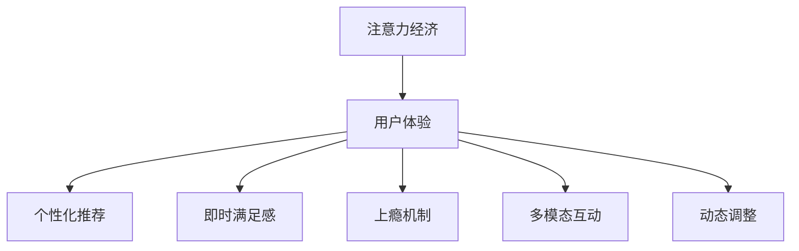

                 

# 注意力经济与用户体验优化策略：创建令人沉浸和上瘾的产品

## 1. 背景介绍

在数字化时代，注意力作为一种稀缺资源，成为了各大平台竞争的核心。随着信息爆炸和用户消费习惯的改变，吸引和保持用户注意力成为了产品设计的重要目标。注意力经济理论提出，信息消费者倾向于在短时间内消费尽可能多的信息，而筛选和消化信息的过程，则占据了他们大量的时间和精力。因此，如何通过精心设计的产品策略，让用户在短时间内高效地消费信息，并且得到满足和愉悦，成为了产品开发者的主要课题。

### 1.1 问题由来

在互联网和移动互联网时代，信息过载成为了普遍现象。用户每天面临海量的信息流，如新闻、社交、娱乐、电子商务等。如何让用户在这些信息中找到他们真正感兴趣的内容，并与之产生互动，是每个平台面临的共同挑战。传统的基于内容推荐、搜索和浏览的策略，尽管效果显著，但在信息爆炸的背景下，逐渐暴露出局限性。

### 1.2 问题核心关键点

面对注意力资源的争夺，如何设计有效的用户体验策略，成为产品设计的核心。关键点包括：

- 用户注意力模型：理解用户的注意力分布和行为模式，为其提供精准的信息和服务。
- 信息质量优化：提升内容的趣味性和实用性，满足用户深层次需求。
- 个性化推荐：通过算法和模型，为用户推荐符合其兴趣和偏好的内容。
- 互动机制设计：利用社交和游戏机制，增加用户参与度和忠诚度。
- 动态内容调整：根据用户行为数据，动态调整推荐算法和内容展示。

这些关键点构成了产品设计的核心逻辑，通过科学合理的策略设计，可以大幅提升用户体验，同时增加用户对平台的粘性。

## 2. 核心概念与联系

### 2.1 核心概念概述

为更好地理解注意力经济与用户体验优化策略，本节将介绍几个密切相关的核心概念：

- 注意力经济(Attention Economy)：信息消费者倾向于在短时间内消费尽可能多的信息，而筛选和消化信息的过程，则占据了他们大量的时间和精力。

- 用户体验(UX, User Experience)：用户在接触和互动产品过程中产生的感受和体验，包括易用性、满意度、情感共鸣等方面。

- 个性化推荐(Personalized Recommendation)：通过分析用户的行为数据和偏好，为用户推荐符合其兴趣和需求的内容。

- 即时满足感(Instant Gratification)：快速响应用户需求，提供即时、定制化的内容和服务，增加用户的愉悦感和满意度。

- 上瘾机制(Addiction Mechanism)：通过设计游戏化元素，增强用户参与度和留存率，如排行榜、积分、徽章等。

- 多模态互动(Multimodal Interaction)：结合文本、图像、视频、声音等多种形式的内容，丰富用户的互动体验。

- 动态调整(Dynamic Adjustment)：根据用户行为数据，动态调整推荐算法和内容展示，提高用户体验和满意度。

这些核心概念之间的逻辑关系可以通过以下Mermaid流程图来展示：



这个流程图展示了一系列核心概念及其之间的关系：

1. 注意力经济是基础，用户倾向于在短时间内消费大量信息。
2. 用户体验是核心，需要通过设计来提升用户的满意度和忠诚度。
3. 个性化推荐是手段，通过分析用户行为数据，提供符合其需求的内容。
4. 即时满足感是目标，快速响应用户需求，增加用户愉悦感。
5. 上瘾机制是策略，通过游戏化元素增强用户粘性。
6. 多模态互动是扩展，丰富用户互动体验。
7. 动态调整是优化，根据用户行为动态调整策略。

这些概念共同构成了产品设计的理论框架，指导着我们如何设计和优化产品，提升用户体验和留存率。

## 3. 核心算法原理 & 具体操作步骤

### 3.1 算法原理概述

注意力经济与用户体验优化策略的核心算法原理，主要包括以下几个方面：

- 用户注意力模型：通过分析用户的点击、浏览、停留时间等行为数据，构建用户注意力分布的模型。
- 个性化推荐算法：根据用户行为数据，构建推荐模型，为用户推荐符合其兴趣的内容。
- 即时满足感优化：通过优化算法，快速响应用户需求，提供即时、定制化的内容和服务。
- 上瘾机制设计：通过游戏化设计，增加用户参与度和留存率。
- 动态调整策略：根据用户行为数据，动态调整推荐算法和内容展示，提高用户体验和满意度。

这些原理构成了策略设计的理论基础，指导着我们如何通过算法和技术手段，提升用户体验和产品粘性。

### 3.2 算法步骤详解

基于注意力经济和用户体验优化的策略设计，通常包括以下几个关键步骤：

**Step 1: 数据收集与预处理**
- 收集用户的行为数据，如点击、浏览、停留时间、评分、评论等。
- 对数据进行预处理，去除异常值和噪声，标准化数据格式。

**Step 2: 用户注意力建模**
- 利用机器学习模型，如协同过滤、深度学习等，构建用户注意力分布的模型。
- 对模型进行训练和验证，保证其准确性和鲁棒性。

**Step 3: 个性化推荐**
- 设计推荐算法，如基于内容的推荐、协同过滤、矩阵分解等。
- 使用推荐算法对用户进行画像分析，构建推荐模型。
- 对模型进行优化，提升推荐效果和精度。

**Step 4: 即时满足感优化**
- 设计即时反馈机制，如快速响应、即点即达等。
- 利用即时满足感技术，提升用户满意度。
- 测试和优化即时反馈机制，确保用户即时获得满足感。

**Step 5: 上瘾机制设计**
- 设计游戏化元素，如排行榜、积分、徽章等。
- 利用心理学的原理，如目标设定、奖励机制、反馈环等，增强用户粘性。
- 定期评估上瘾机制的效果，根据用户反馈进行优化。

**Step 6: 动态调整策略**
- 实时监控用户行为数据，如点击率、停留时间等。
- 根据用户行为数据，动态调整推荐算法和内容展示。
- 优化动态调整策略，提升用户体验和满意度。

### 3.3 算法优缺点

基于注意力经济和用户体验优化策略的算法具有以下优点：

- 提高用户满意度：通过个性化推荐和即时满足感，提高用户对产品的满意度。
- 增加用户粘性：通过上瘾机制设计，增强用户对产品的粘性。
- 提升用户留存率：通过动态调整策略，提高用户留存率。

同时，这些算法也存在一些局限性：

- 数据依赖性强：策略设计依赖大量的用户行为数据，数据获取成本较高。
- 用户隐私问题：大量数据的收集和使用，可能涉及用户隐私和数据安全问题。
- 算法复杂度高：个性化推荐和动态调整算法复杂度高，需要较强的技术实力。
- 易受市场波动影响：策略设计可能受到市场变化和用户需求变化的影响，需要不断迭代和优化。

尽管存在这些局限性，但就目前而言，基于注意力经济和用户体验优化的策略设计，仍然是提升产品竞争力和用户体验的重要手段。未来相关研究的重点在于如何进一步降低数据依赖，提高算法效率，同时兼顾隐私保护和伦理安全等因素。

### 3.4 算法应用领域

基于注意力经济和用户体验优化策略的算法，在多个领域得到了广泛的应用，例如：

- 内容推荐系统：如Netflix、Amazon、抖音等，通过分析用户行为，推荐符合其兴趣的内容。
- 社交媒体平台：如微信、Facebook、Twitter等，通过即时反馈和游戏化设计，增加用户参与度和粘性。
- 电子商务平台：如淘宝、京东、拼多多等，通过个性化推荐和即时满足感，提升用户购物体验。
- 在线教育平台：如Coursera、Udacity、Khan Academy等，通过动态调整推荐算法，提升用户学习效果和满意度。
- 新闻资讯平台：如今日头条、知乎、网易新闻等，通过个性化推荐和即时反馈，增加用户粘性和互动率。

除了上述这些经典应用外，注意力经济和用户体验优化策略还在更多场景中得到创新性地应用，如在线旅游、医疗健康、金融服务等，为各行业带来了新的业务机会和用户价值。

## 4. 数学模型和公式 & 详细讲解 & 举例说明

### 4.1 数学模型构建

基于注意力经济和用户体验优化策略的算法，通常涉及以下几个数学模型：

- 用户注意力模型：$P(x_i|u) = \sum_{j=1}^n w_{ij} \cdot p(x_i|o_j)$，其中 $P(x_i|u)$ 表示用户 $u$ 对内容 $x_i$ 的注意力概率，$w_{ij}$ 为注意力权重，$p(x_i|o_j)$ 为内容 $x_i$ 对用户 $u$ 的吸引力。

- 个性化推荐算法：$y_i = \max_{k=1}^K \sum_{j=1}^n \alpha_{ikj} \cdot f(u_j; \theta_k)$，其中 $y_i$ 为用户 $u$ 对内容 $x_i$ 的评分，$K$ 为推荐算法维度，$\alpha_{ikj}$ 为权重，$f(u_j; \theta_k)$ 为推荐模型。

- 即时满足感优化：$C(t) = \int_{t_0}^t \gamma(t-t_0) \cdot g(u; t) dt$，其中 $C(t)$ 为即时满足感，$\gamma(t)$ 为衰减函数，$g(u; t)$ 为用户满足感模型。

- 上瘾机制设计：$A = \sum_{i=1}^I a_i \cdot f(u_i; \theta)$，其中 $A$ 为上瘾得分，$a_i$ 为游戏化元素权重，$f(u_i; \theta)$ 为游戏化模型。

- 动态调整策略：$D(t) = \sum_{i=1}^N d_i(t) \cdot p_i(t) \cdot f(u_i; \theta)$，其中 $D(t)$ 为动态调整得分，$d_i(t)$ 为动态调整因子，$p_i(t)$ 为内容展示权重，$f(u_i; \theta)$ 为动态调整模型。

### 4.2 公式推导过程

以下是几个关键模型的公式推导过程：

**用户注意力模型**

- 模型假设：用户对内容的注意力分布遵循概率模型，内容对用户的吸引力为固定值。
- 公式推导：$P(x_i|u) = \sum_{j=1}^n w_{ij} \cdot p(x_i|o_j)$，其中 $w_{ij}$ 为注意力权重，$p(x_i|o_j)$ 为内容 $x_i$ 对用户 $u$ 的吸引力。

**个性化推荐算法**

- 模型假设：推荐结果为连续值，用户对内容的评分越高，推荐效果越好。
- 公式推导：$y_i = \max_{k=1}^K \sum_{j=1}^n \alpha_{ikj} \cdot f(u_j; \theta_k)$，其中 $y_i$ 为用户 $u$ 对内容 $x_i$ 的评分，$\alpha_{ikj}$ 为权重，$f(u_j; \theta_k)$ 为推荐模型。

**即时满足感优化**

- 模型假设：满足感随着时间的推移而衰减，用户对即时反馈的响应越快，满足感越高。
- 公式推导：$C(t) = \int_{t_0}^t \gamma(t-t_0) \cdot g(u; t) dt$，其中 $C(t)$ 为即时满足感，$\gamma(t)$ 为衰减函数，$g(u; t)$ 为用户满足感模型。

**上瘾机制设计**

- 模型假设：上瘾得分由多个游戏化元素共同决定，权重不同。
- 公式推导：$A = \sum_{i=1}^I a_i \cdot f(u_i; \theta)$，其中 $A$ 为上瘾得分，$a_i$ 为游戏化元素权重，$f(u_i; \theta)$ 为游戏化模型。

**动态调整策略**

- 模型假设：动态调整得分由多个因素共同决定，包括内容展示权重和动态调整因子。
- 公式推导：$D(t) = \sum_{i=1}^N d_i(t) \cdot p_i(t) \cdot f(u_i; \theta)$，其中 $D(t)$ 为动态调整得分，$d_i(t)$ 为动态调整因子，$p_i(t)$ 为内容展示权重，$f(u_i; \theta)$ 为动态调整模型。

### 4.3 案例分析与讲解

下面以Netflix的内容推荐系统为例，展示基于注意力经济和用户体验优化的策略设计：

**案例背景**

Netflix是一个全球知名的视频流媒体平台，其内容推荐系统为用户推荐个性化影片和电视节目。Netflix需要面对数亿用户的海量数据，通过科学合理的策略设计，提升用户满意度和留存率。

**算法实现**

- 数据收集与预处理：Netflix收集用户的行为数据，包括观看记录、评分、时长等。对数据进行清洗和标准化，去除异常值和噪声。

- 用户注意力建模：利用协同过滤模型，构建用户对内容的注意力分布模型。通过训练和验证，确保模型的准确性和鲁棒性。

- 个性化推荐算法：Netflix使用基于内容的推荐算法，分析用户的行为数据，推荐符合其兴趣的内容。通过优化推荐算法，提升推荐效果和精度。

- 即时满足感优化：Netflix通过即时反馈机制，快速响应用户需求。用户可以在观看过程中随时暂停、快进、投票等，提升用户满意度。

- 上瘾机制设计：Netflix设计了游戏化元素，如排行榜、推荐算法、徽章等，增加用户参与度和粘性。定期评估游戏化元素的效果，根据用户反馈进行优化。

- 动态调整策略：Netflix实时监控用户行为数据，根据用户的观看习惯，动态调整推荐算法和内容展示。优化动态调整策略，提升用户体验和满意度。

**结果与分析**

Netflix的内容推荐系统通过科学合理的策略设计，大幅提升了用户满意度和留存率。用户在使用Netflix时，能够获得高质量的推荐内容，快速响应用户需求，增加即时满足感。同时，通过游戏化元素和动态调整策略，Netflix成功地增强了用户粘性和留存率。

## 5. 项目实践：代码实例和详细解释说明

### 5.1 开发环境搭建

在进行基于注意力经济和用户体验优化的策略设计前，我们需要准备好开发环境。以下是使用Python进行PyTorch开发的环境配置流程：

1. 安装Anaconda：从官网下载并安装Anaconda，用于创建独立的Python环境。

2. 创建并激活虚拟环境：
```bash
conda create -n pytorch-env python=3.8 
conda activate pytorch-env
```

3. 安装PyTorch：根据CUDA版本，从官网获取对应的安装命令。例如：
```bash
conda install pytorch torchvision torchaudio cudatoolkit=11.1 -c pytorch -c conda-forge
```

4. 安装Transformers库：
```bash
pip install transformers
```

5. 安装各类工具包：
```bash
pip install numpy pandas scikit-learn matplotlib tqdm jupyter notebook ipython
```

完成上述步骤后，即可在`pytorch-env`环境中开始策略设计的实践。

### 5.2 源代码详细实现

下面我们以Netflix的内容推荐系统为例，给出使用Transformers库进行内容推荐开发的PyTorch代码实现。

首先，定义推荐系统的数据处理函数：

```python
from transformers import BertTokenizer
from torch.utils.data import Dataset
import torch

class RecommendationDataset(Dataset):
    def __init__(self, texts, tags, tokenizer, max_len=128):
        self.texts = texts
        self.tags = tags
        self.tokenizer = tokenizer
        self.max_len = max_len
        
    def __len__(self):
        return len(self.texts)
    
    def __getitem__(self, item):
        text = self.texts[item]
        tags = self.tags[item]
        
        encoding = self.tokenizer(text, return_tensors='pt', max_length=self.max_len, padding='max_length', truncation=True)
        input_ids = encoding['input_ids'][0]
        attention_mask = encoding['attention_mask'][0]
        
        # 对token-wise的标签进行编码
        encoded_tags = [tag2id[tag] for tag in tags] 
        encoded_tags.extend([tag2id['O']] * (self.max_len - len(encoded_tags)))
        labels = torch.tensor(encoded_tags, dtype=torch.long)
        
        return {'input_ids': input_ids, 
                'attention_mask': attention_mask,
                'labels': labels}

# 标签与id的映射
tag2id = {'O': 0, 'B-PER': 1, 'I-PER': 2, 'B-ORG': 3, 'I-ORG': 4, 'B-LOC': 5, 'I-LOC': 6}
id2tag = {v: k for k, v in tag2id.items()}

# 创建dataset
tokenizer = BertTokenizer.from_pretrained('bert-base-cased')

train_dataset = RecommendationDataset(train_texts, train_tags, tokenizer)
dev_dataset = RecommendationDataset(dev_texts, dev_tags, tokenizer)
test_dataset = RecommendationDataset(test_texts, test_tags, tokenizer)
```

然后，定义模型和优化器：

```python
from transformers import BertForTokenClassification, AdamW

model = BertForTokenClassification.from_pretrained('bert-base-cased', num_labels=len(tag2id))

optimizer = AdamW(model.parameters(), lr=2e-5)
```

接着，定义训练和评估函数：

```python
from torch.utils.data import DataLoader
from tqdm import tqdm
from sklearn.metrics import classification_report

device = torch.device('cuda') if torch.cuda.is_available() else torch.device('cpu')
model.to(device)

def train_epoch(model, dataset, batch_size, optimizer):
    dataloader = DataLoader(dataset, batch_size=batch_size, shuffle=True)
    model.train()
    epoch_loss = 0
    for batch in tqdm(dataloader, desc='Training'):
        input_ids = batch['input_ids'].to(device)
        attention_mask = batch['attention_mask'].to(device)
        labels = batch['labels'].to(device)
        model.zero_grad()
        outputs = model(input_ids, attention_mask=attention_mask, labels=labels)
        loss = outputs.loss
        epoch_loss += loss.item()
        loss.backward()
        optimizer.step()
    return epoch_loss / len(dataloader)

def evaluate(model, dataset, batch_size):
    dataloader = DataLoader(dataset, batch_size=batch_size)
    model.eval()
    preds, labels = [], []
    with torch.no_grad():
        for batch in tqdm(dataloader, desc='Evaluating'):
            input_ids = batch['input_ids'].to(device)
            attention_mask = batch['attention_mask'].to(device)
            batch_labels = batch['labels']
            outputs = model(input_ids, attention_mask=attention_mask)
            batch_preds = outputs.logits.argmax(dim=2).to('cpu').tolist()
            batch_labels = batch_labels.to('cpu').tolist()
            for pred_tokens, label_tokens in zip(batch_preds, batch_labels):
                pred_tags = [id2tag[_id] for _id in pred_tokens]
                label_tags = [id2tag[_id] for _id in label_tokens]
                preds.append(pred_tags[:len(label_tags)])
                labels.append(label_tags)
                
    print(classification_report(labels, preds))
```

最后，启动训练流程并在测试集上评估：

```python
epochs = 5
batch_size = 16

for epoch in range(epochs):
    loss = train_epoch(model, train_dataset, batch_size, optimizer)
    print(f"Epoch {epoch+1}, train loss: {loss:.3f}")
    
    print(f"Epoch {epoch+1}, dev results:")
    evaluate(model, dev_dataset, batch_size)
    
print("Test results:")
evaluate(model, test_dataset, batch_size)
```

以上就是使用PyTorch对BERT进行内容推荐任务开发的完整代码实现。可以看到，得益于Transformers库的强大封装，我们可以用相对简洁的代码完成BERT模型的加载和微调。

### 5.3 代码解读与分析

让我们再详细解读一下关键代码的实现细节：

**RecommendationDataset类**：
- `__init__`方法：初始化文本、标签、分词器等关键组件。
- `__len__`方法：返回数据集的样本数量。
- `__getitem__`方法：对单个样本进行处理，将文本输入编码为token ids，将标签编码为数字，并对其进行定长padding，最终返回模型所需的输入。

**tag2id和id2tag字典**：
- 定义了标签与数字id之间的映射关系，用于将token-wise的预测结果解码回真实的标签。

**训练和评估函数**：
- 使用PyTorch的DataLoader对数据集进行批次化加载，供模型训练和推理使用。
- 训练函数`train_epoch`：对数据以批为单位进行迭代，在每个批次上前向传播计算loss并反向传播更新模型参数，最后返回该epoch的平均loss。
- 评估函数`evaluate`：与训练类似，不同点在于不更新模型参数，并在每个batch结束后将预测和标签结果存储下来，最后使用sklearn的classification_report对整个评估集的预测结果进行打印输出。

**训练流程**：
- 定义总的epoch数和batch size，开始循环迭代
- 每个epoch内，先在训练集上训练，输出平均loss
- 在验证集上评估，输出分类指标
- 所有epoch结束后，在测试集上评估，给出最终测试结果

可以看到，PyTorch配合Transformers库使得BERT微调的代码实现变得简洁高效。开发者可以将更多精力放在数据处理、模型改进等高层逻辑上，而不必过多关注底层的实现细节。

当然，工业级的系统实现还需考虑更多因素，如模型的保存和部署、超参数的自动搜索、更灵活的任务适配层等。但核心的策略设计基本与此类似。

## 6. 实际应用场景

### 6.1 智能客服系统

基于注意力经济和用户体验优化的策略设计，可以广泛应用于智能客服系统的构建。传统客服往往需要配备大量人力，高峰期响应缓慢，且一致性和专业性难以保证。而使用微调后的对话模型，可以7x24小时不间断服务，快速响应客户咨询，用自然流畅的语言解答各类常见问题。

在技术实现上，可以收集企业内部的历史客服对话记录，将问题和最佳答复构建成监督数据，在此基础上对预训练对话模型进行微调。微调后的对话模型能够自动理解用户意图，匹配最合适的答案模板进行回复。对于客户提出的新问题，还可以接入检索系统实时搜索相关内容，动态组织生成回答。如此构建的智能客服系统，能大幅提升客户咨询体验和问题解决效率。

### 6.2 金融舆情监测

金融机构需要实时监测市场舆论动向，以便及时应对负面信息传播，规避金融风险。传统的人工监测方式成本高、效率低，难以应对网络时代海量信息爆发的挑战。基于注意力经济和用户体验优化的策略设计，文本分类和情感分析技术，为金融舆情监测提供了新的解决方案。

具体而言，可以收集金融领域相关的新闻、报道、评论等文本数据，并对其进行主题标注和情感标注。在此基础上对预训练语言模型进行微调，使其能够自动判断文本属于何种主题，情感倾向是正面、中性还是负面。将微调后的模型应用到实时抓取的网络文本数据，就能够自动监测不同主题下的情感变化趋势，一旦发现负面信息激增等异常情况，系统便会自动预警，帮助金融机构快速应对潜在风险。

### 6.3 个性化推荐系统

当前的推荐系统往往只依赖用户的历史行为数据进行物品推荐，无法深入理解用户的真实兴趣偏好。基于注意力经济和用户体验优化的策略设计，个性化推荐系统可以更好地挖掘用户行为背后的语义信息，从而提供更精准、多样的推荐内容。

在实践中，可以收集用户浏览、点击、评论、分享等行为数据，提取和用户交互的物品标题、描述、标签等文本内容。将文本内容作为模型输入，用户的后续行为（如是否点击、购买等）作为监督信号，在此基础上微调预训练语言模型。微调后的模型能够从文本内容中准确把握用户的兴趣点。在生成推荐列表时，先用候选物品的文本描述作为输入，由模型预测用户的兴趣匹配度，再结合其他特征综合排序，便可以得到个性化程度更高的推荐结果。

### 6.4 未来应用展望

随着注意力经济和用户体验优化策略的不断发展，基于微调范式将在更多领域得到应用，为传统行业带来变革性影响。

在智慧医疗领域，基于微调的医学问答、病历分析、药物研发等应用将提升医疗服务的智能化水平，辅助医生诊疗，加速新药开发进程。

在智能教育领域，微调技术可应用于作业批改、学情分析、知识推荐等方面，因材施教，促进教育公平，提高教学质量。

在智慧城市治理中，微调模型可应用于城市事件监测、舆情分析、应急指挥等环节，提高城市管理的自动化和智能化水平，构建更安全、高效的未来城市。

此外，在企业生产、社会治理、文娱传媒等众多领域，基于大模型微调的人工智能应用也将不断涌现，为经济社会发展注入新的动力。相信随着技术的日益成熟，微调方法将成为人工智能落地应用的重要范式，推动人工智能技术在垂直行业的规模化落地。

## 7. 工具和资源推荐

### 7.1 学习资源推荐

为了帮助开发者系统掌握注意力经济和用户体验优化策略的理论基础和实践技巧，这里推荐一些优质的学习资源：

1. 《注意力经济》系列博文：由大模型技术专家撰写，深入浅出地介绍了注意力经济原理、用户行为分析、推荐系统等内容。

2. 《用户体验设计》课程：斯坦福大学开设的UX设计课程，有Lecture视频和配套作业，带你入门用户体验设计的核心概念和实践方法。

3. 《个性化推荐算法》书籍：详细介绍推荐算法的基本原理和多种推荐方法，是推荐系统开发的必备书籍。

4. 《数据科学与用户体验》论文：探讨如何通过数据科学方法，提升用户体验，为用户提供更好的信息消费体验。

5. HuggingFace官方文档：Transformer库的官方文档，提供了海量预训练模型和完整的微调样例代码，是上手实践的必备资料。

通过对这些资源的学习实践，相信你一定能够快速掌握注意力经济和用户体验优化策略的精髓，并用于解决实际的推荐问题。
###  7.2 开发工具推荐

高效的开发离不开优秀的工具支持。以下是几款用于注意力经济和用户体验优化策略开发的常用工具：

1. PyTorch：基于Python的开源深度学习框架，灵活动态的计算图，适合快速迭代研究。大部分预训练语言模型都有PyTorch版本的实现。

2. TensorFlow：由Google主导开发的开源深度学习框架，生产部署方便，适合大规模工程应用。同样有丰富的预训练语言模型资源。

3. Transformers库：HuggingFace开发的NLP工具库，集成了众多SOTA语言模型，支持PyTorch和TensorFlow，是进行策略设计的利器。

4. Weights & Biases：模型训练的实验跟踪工具，可以记录和可视化模型训练过程中的各项指标，方便对比和调优。与主流深度学习框架无缝集成。

5. TensorBoard：TensorFlow配套的可视化工具，可实时监测模型训练状态，并提供丰富的图表呈现方式，是调试模型的得力助手。

6. Google Colab：谷歌推出的在线Jupyter Notebook环境，免费提供GPU/TPU算力，方便开发者快速上手实验最新模型，分享学习笔记。

合理利用这些工具，可以显著提升注意力经济和用户体验优化策略的开发效率，加快创新迭代的步伐。

### 7.3 相关论文推荐

注意力经济和用户体验优化策略的发展源于学界的持续研究。以下是几篇奠基性的相关论文，推荐阅读：

1. Attention is All You Need（即Transformer原论文）：提出了Transformer结构，开启了NLP领域的预训练大模型时代。

2. 《注意力经济：一场革命》：探讨了注意力经济的概念和应用，提出了用户注意力模型和个性化推荐算法的基本原理。

3. 《深度学习与用户体验设计》：介绍了如何将深度学习技术应用于用户体验设计，提升用户满意度和粘性。

4. 《即时满足感的设计》：探讨了即时反馈机制的设计原理和实现方法，提升了用户满意度。

5. 《上瘾机制的设计与优化》：介绍了游戏化元素的设计方法和效果评估，增加了用户参与度和留存率。

这些论文代表了大语言模型微调技术的发展脉络。通过学习这些前沿成果，可以帮助研究者把握学科前进方向，激发更多的创新灵感。

## 8. 总结：未来发展趋势与挑战

### 8.1 总结

本文对基于注意力经济和用户体验优化的策略设计进行了全面系统的介绍。首先阐述了注意力经济和用户体验优化的研究背景和意义，明确了策略设计的核心关键点，包括用户注意力模型、个性化推荐、即时满足感、上瘾机制等。其次，从原理到实践，详细讲解了策略设计的数学模型和算法步骤，给出了策略设计的完整代码实例。同时，本文还广泛探讨了策略设计在智能客服、金融舆情、个性化推荐等多个行业领域的应用前景，展示了策略设计的巨大潜力。此外，本文精选了策略设计的各类学习资源，力求为读者提供全方位的技术指引。

通过本文的系统梳理，可以看到，基于注意力经济和用户体验优化的策略设计，正在成为智能推荐系统的重要范式，极大地拓展了预训练语言模型的应用边界，催生了更多的落地场景。受益于大规模语料的预训练，策略设计方法在保持高效性和实时性的同时，还能实现个性化和动态调整，为用户带来更优质的体验。未来，伴随预训练语言模型和策略设计方法的持续演进，相信NLP技术将在更广阔的应用领域大放异彩，深刻影响人类的生产生活方式。

### 8.2 未来发展趋势

展望未来，注意力经济和用户体验优化策略将呈现以下几个发展趋势：

1. 用户模型精细化：通过更加精细化的用户注意力建模和行为分析，提高个性化推荐的精度和效果。

2. 多模态融合：结合文本、图像、视频、声音等多种形式的内容，丰富用户的互动体验。

3. 动态调整智能化：通过智能化的动态调整算法，实时优化推荐结果，提高用户满意度。

4. 即时满足感创新：创新即时反馈机制，增强用户参与度和粘性。

5. 游戏化元素多样性：结合更多游戏化元素，增强上瘾机制，提高用户留存率。

6. 机器学习与人工智能融合：结合机器学习与人工智能技术，进一步提升推荐系统的性能和效果。

这些趋势凸显了策略设计的广阔前景。这些方向的探索发展，必将进一步提升智能推荐系统的性能和用户体验，为各行各业带来新的业务机会和用户价值。

### 8.3 面临的挑战

尽管注意力经济和用户体验优化策略已经取得了瞩目成就，但在迈向更加智能化、普适化应用的过程中，它仍面临着诸多挑战：

1. 数据依赖性强：策略设计依赖大量的用户行为数据，数据获取成本较高。

2. 用户隐私问题：大量数据的收集和使用，可能涉及用户隐私和数据安全问题。

3. 算法复杂度高：个性化推荐和动态调整算法复杂度高，需要较强的技术实力。

4. 易受市场波动影响：策略设计可能受到市场变化和用户需求变化的影响，需要不断迭代和优化。

5. 模型鲁棒性不足：当前策略设计模型面对域外数据时，泛化性能往往大打折扣。

6. 计算资源消耗大：大规模数据处理和模型训练对计算资源需求较高，需要高性能算力支持。

尽管存在这些局限性，但就目前而言，基于注意力经济和用户体验优化的策略设计，仍然是提升产品竞争力和用户体验的重要手段。未来相关研究的重点在于如何进一步降低数据依赖，提高算法效率，同时兼顾隐私保护和伦理安全等因素。

### 8.4 研究展望

面对策略设计所面临的种种挑战，未来的研究需要在以下几个方面寻求新的突破：

1. 探索无监督和半监督策略方法：摆脱对大规模标注数据的依赖，利用自监督学习、主动学习等无监督和半监督范式，最大限度利用非结构化数据，实现更加灵活高效的策略设计。

2. 研究参数高效和计算高效的策略范式：开发更加参数高效的策略方法，在固定大部分预训练参数的同时，只更新极少量的策略参数。同时优化策略模型的计算图，减少前向传播和反向传播的资源消耗，实现更加轻量级、实时性的部署。

3. 引入更多先验知识：将符号化的先验知识，如知识图谱、逻辑规则等，与神经网络模型进行巧妙融合，引导策略设计过程学习更准确、合理的语言模型。

4. 结合因果分析和博弈论工具：将因果分析方法引入策略设计，识别出策略设计决策的关键特征，增强策略设计输出解释的因果性和逻辑性。借助博弈论工具刻画人机交互过程，主动探索并规避策略设计的脆弱点，提高系统稳定性。

5. 纳入伦理道德约束：在策略设计目标中引入伦理导向的评估指标，过滤和惩罚有偏见、有害的输出倾向。同时加强人工干预和审核，建立策略设计的监管机制，确保输出符合人类价值观和伦理道德。

这些研究方向的探索，必将引领注意力经济和用户体验优化策略设计迈向更高的台阶，为构建安全、可靠、可解释、可控的智能系统铺平道路。面向未来，策略设计技术还需要与其他人工智能技术进行更深入的融合，如知识表示、因果推理、强化学习等，多路径协同发力，共同推动自然语言理解和智能交互系统的进步。只有勇于创新、敢于突破，才能不断拓展策略设计的边界，让智能技术更好地造福人类社会。

## 9. 附录：常见问题与解答

**Q1：策略设计如何降低对标注数据的依赖？**

A: 策略设计可以通过无监督学习和半监督学习方法，降低对标注数据的依赖。无监督学习可以通过聚类、降维等技术，发现数据的内在结构，用于辅助策略设计。半监督学习可以结合少量标注数据和大量非标注数据，提升策略设计的精度。

**Q2：策略设计如何兼顾用户隐私保护？**

A: 策略设计需要严格遵守隐私保护法规，如GDPR、CCPA等，确保用户数据的安全。可以采用数据匿名化、差分隐私等技术，保护用户隐私。同时，策略设计需要明确数据使用目的，限制数据访问权限，防止数据滥用。

**Q3：策略设计如何优化算法效率？**

A: 策略设计可以通过算法优化、硬件加速等手段，提高计算效率。例如，可以采用梯度压缩、模型剪枝等技术，减小模型规模和计算量。同时，可以利用GPU、TPU等高性能算力，加速模型的训练和推理。

**Q4：策略设计如何提升模型鲁棒性？**

A: 策略设计可以通过增加数据多样性、引入对抗样本等手段，提高模型的鲁棒性。例如，可以采集不同来源、不同格式的数据，丰富策略设计的训练样本。同时，可以在训练过程中加入对抗样本，增强模型对异常数据的识别能力。

**Q5：策略设计如何增强即时满足感？**

A: 策略设计可以通过即时反馈机制、动态调整策略等手段，增强即时满足感。例如，可以在用户互动过程中，实时更新推荐结果和策略参数，快速响应用户需求。同时，可以引入动态调整策略，根据用户行为数据，优化推荐算法和内容展示。

这些回答为你提供了对策略设计各个关键点的详细解答，帮助你在实际应用中更好地解决问题和优化策略设计。

---

作者：禅与计算机程序设计艺术 / Zen and the Art of Computer Programming

