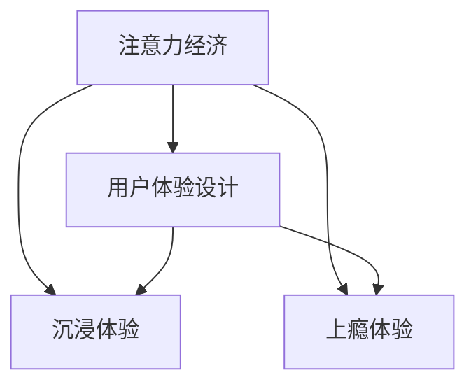

                 

## 1. 背景介绍

### 1.1 问题由来

在数字经济的时代，注意力成为最稀缺的资源之一。无论是广告主、社交媒体平台，还是内容生产者，都在通过各种策略来争夺用户的时间与注意力。在这种背景下，用户体验（User Experience，UX）设计不仅仅是一种产品开发的辅助工具，更是构建用户忠诚度和长期价值的关键。设计一个令人沉浸和上瘾的体验，不仅能够提高用户满意度和留存率，还能为产品带来更大的商业价值。

### 1.2 问题核心关键点

用户体验设计的核心在于“以用户为中心”，通过设计和优化用户与产品互动的各个环节，从而提升用户满意度和产品价值。本文将围绕如何构建令人沉浸和上瘾的用户体验，探讨设计原则与实践方法。具体来说，我们将从注意力经济的角度出发，深入分析用户体验设计的核心要素，并提出具体的设计策略。

## 2. 核心概念与联系

### 2.1 核心概念概述

- **注意力经济**：指在信息爆炸的时代，注意力成为一种经济资源，用户在获取信息或服务时，注意力资源的分配成为了一种战略性选择。有效的用户体验设计，能够最大化利用用户的注意力，从而实现产品价值。
- **用户体验设计**：通过设计产品的操作流程、界面、交互方式等，以提升用户使用产品的满意度和愉悦感，从而提高产品的价值。
- **沉浸体验**：指通过精心设计，使用户完全沉浸在产品中，忘却时间流逝，增强产品粘性。
- **上瘾体验**：指设计的产品能够让用户在使用过程中产生强烈的需求感和依赖感，形成重复使用的习惯。

### 2.2 核心概念原理和架构的 Mermaid 流程图



这个流程图展示了注意力经济、用户体验设计、沉浸体验和上瘾体验之间的联系。注意力经济是整个模型的基础，用户体验设计是实现注意力经济的关键手段，而沉浸体验和上瘾体验则是用户体验设计的目标，通过这两个维度，用户对产品的黏性进一步增强。

## 3. 核心算法原理 & 具体操作步骤

### 3.1 算法原理概述

创建令人沉浸和上瘾的用户体验，需要从用户的心理和生理需求出发，综合考虑视觉、听觉、触觉等多感官体验。设计的关键在于通过巧妙的用户交互方式和视觉元素设计，引导用户自然地进入一种沉浸状态，并通过连续的正面反馈和奖励机制，增强用户对产品的依赖感。

### 3.2 算法步骤详解

#### 3.2.1 用户画像与需求分析

- **用户画像**：通过问卷调查、用户访谈等方式，收集用户的基本信息、兴趣、使用习惯等，建立用户画像。
- **需求分析**：根据用户画像，分析用户在使用产品时的核心需求和痛点，找出改进的机会。

#### 3.2.2 界面设计与视觉元素

- **界面布局**：采用直观易用的界面布局，让用户能够迅速找到所需功能。
- **视觉元素**：使用色彩、排版、动画等视觉元素，引导用户的注意力，提升用户的情感体验。

#### 3.2.3 交互设计与动效

- **交互设计**：设计直观、流畅的交互流程，减少用户的操作步骤和认知负担。
- **动效设计**：合理运用动效，增强界面的生动性和可交互性。

#### 3.2.4 激励与奖励机制

- **正反馈**：通过及时的正面反馈（如弹窗提示、声音提醒等），增强用户的满足感。
- **奖励机制**：设计合理的奖励系统，如积分、勋章等，激励用户持续使用产品。

#### 3.2.5 数据驱动优化

- **数据收集**：通过分析用户行为数据，了解用户的使用习惯和偏好。
- **持续优化**：根据数据分析结果，持续优化用户体验，提升产品价值。

### 3.3 算法优缺点

#### 3.3.1 优点

- **用户黏性高**：通过沉浸体验和上瘾体验，使用户产生强烈的依赖感，提高用户留存率。
- **个性化强**：能够根据用户画像和需求，提供个性化定制的服务，提升用户满意度。
- **效率提升**：通过直观的交互设计和数据驱动的优化，提高用户的操作效率。

#### 3.3.2 缺点

- **设计复杂**：需要综合考虑多种感官体验和交互设计，设计难度较大。
- **成本较高**：在设计和开发阶段需要投入更多资源，初期成本较高。
- **用户适应性**：用户体验设计需要不断迭代优化，才能适应用户的变化和需求。

### 3.4 算法应用领域

用户体验设计的应用领域非常广泛，包括但不限于：

- **社交媒体**：如Instagram、Facebook等，通过视觉化和互动性强的设计，吸引用户的注意力。
- **电子商务**：如Amazon、淘宝等，通过个性化推荐和用户界面优化，提升购物体验。
- **移动应用**：如游戏、金融、健康等，通过沉浸式和上瘾式的设计，增强用户粘性。

## 4. 数学模型和公式 & 详细讲解 & 举例说明

### 4.1 数学模型构建

用户体验设计的数学模型可以从用户满意度（User Satisfaction）、用户黏性（User Stickiness）和用户参与度（User Engagement）三个方面来构建：

$$
\text{User Satisfaction} = \sum_{i=1}^{n} w_i \times \text{Satisfaction}_{i}
$$

$$
\text{User Stickiness} = \frac{\text{Daily Active Users}}{\text{Total Users}}
$$

$$
\text{User Engagement} = \text{Interactions} \times \text{Duration}
$$

其中，$w_i$ 是不同满意度的权重，$\text{Satisfaction}_{i}$ 是用户在不同满意度维度上的得分，$\text{Daily Active Users}$ 和 $\text{Total Users}$ 分别表示日活跃用户和总用户数，$\text{Interactions}$ 和 $\text{Duration}$ 分别表示用户的操作次数和停留时间。

### 4.2 公式推导过程

通过以上公式，我们可以构建用户体验设计的数学模型，并通过对各项指标的优化，提升整体的用户体验。以下是具体的推导过程：

$$
\text{Optimize} \quad \text{User Satisfaction} \quad \text{and} \quad \text{User Engagement}
$$

$$
\begin{aligned}
\text{Maximize} \quad &\sum_{i=1}^{n} w_i \times \text{Satisfaction}_{i} \\
\text{Subject to} \quad &\frac{\text{Daily Active Users}}{\text{Total Users}} \geq k \\
\text{and} \quad &\text{Interactions} \times \text{Duration} \geq l
\end{aligned}
$$

其中，$k$ 和 $l$ 分别是用户黏性和参与度的最小阈值。

### 4.3 案例分析与讲解

以一个在线视频平台的例子来说明如何应用上述数学模型：

- **用户画像与需求分析**：通过数据分析，发现用户主要分为两类：年轻用户和中年用户，年轻用户更关注视频的娱乐性和互动性，中年用户则更关注视频的深度和知识性。
- **界面设计与视觉元素**：针对不同用户群体，设计不同的界面布局和视觉元素，如年轻用户的界面更加时尚和动态，中年用户的界面更加简洁和稳定。
- **交互设计与动效**：设计直观的操作流程和流畅的动效，如视频推荐、视频暂停等功能，通过动画效果增强用户的视觉体验。
- **激励与奖励机制**：通过积分系统奖励用户的观看时长和互动行为，提升用户参与度和黏性。
- **数据驱动优化**：定期收集用户行为数据，分析用户反馈，优化界面设计和交互方式。

通过这样的设计，该视频平台不仅能够满足不同用户群体的需求，还能通过数据驱动不断优化用户体验，提升用户满意度和黏性。

## 5. 项目实践：代码实例和详细解释说明

### 5.1 开发环境搭建

为了进行用户体验设计的实践，需要搭建一个开发环境。以下是Python环境下搭建环境的步骤：

1. **安装Python和相关库**：
   - 安装Python 3.x版本，推荐使用Anaconda。
   - 安装Pip库：`pip install pipenv`
   - 安装Flask：`pip install Flask`
   - 安装Django：`pip install Django`
   - 安装Jinja2：`pip install Jinja2`

2. **创建虚拟环境**：
   - 创建虚拟环境：`pipenv create`
   - 激活虚拟环境：`pipenv shell`

3. **安装Web前端框架**：
   - 安装Bootstrap：`pip install bootstrap`
   - 安装Chart.js：`pip install chart.js`

### 5.2 源代码详细实现

以下是使用Flask和Django框架进行用户体验设计的示例代码：

```python
# Flask示例代码
from flask import Flask, render_template
app = Flask(__name__)

@app.route('/')
def index():
    return render_template('index.html')

if __name__ == '__main__':
    app.run(debug=True)

# Django示例代码
from django.shortcuts import render
from django.http import HttpResponse

def index(request):
    return render(request, 'index.html')

def analytics(request):
    # 处理用户行为数据
    # 返回分析结果
    return HttpResponse("Analytic results")
```

### 5.3 代码解读与分析

**Flask示例代码解读**：

- `app = Flask(__name__)`：创建Flask应用。
- `@app.route('/')`：定义路由，当用户访问主页时，执行对应的函数。
- `render_template('index.html')`：渲染模板，显示页面内容。

**Django示例代码解读**：

- `from django.shortcuts import render`：导入渲染模板的函数。
- `def index(request)`: 定义首页的渲染函数。
- `def analytics(request)`: 定义用户行为数据分析函数。

### 5.4 运行结果展示

运行上述代码，在浏览器中访问指定地址，即可看到渲染的页面。例如，Flask应用中访问 `http://localhost:5000/`，Django应用中访问 `http://localhost:8000/`，即可显示对应的页面内容。

## 6. 实际应用场景

### 6.1 社交媒体平台

社交媒体平台如Facebook、Instagram等，通过精心设计的界面布局、视觉元素和互动机制，吸引用户的注意力。例如，Instagram的发现页面，通过图片的无限滚动、热门话题的推荐等设计，让用户在浏览过程中产生强烈的参与感和沉浸感。

### 6.2 电子商务平台

电子商务平台如Amazon、淘宝等，通过个性化推荐和用户界面优化，提升购物体验。例如，Amazon的推荐系统，通过分析用户的浏览和购买历史，为用户推荐个性化的商品，提高用户的购买转化率。

### 6.3 在线视频平台

在线视频平台如Netflix、爱奇艺等，通过沉浸式和上瘾式的设计，增强用户黏性。例如，Netflix的界面设计，通过精简的界面布局和高质量的视频推荐，让用户沉浸在观看体验中，产生强烈的需求感和依赖感。

### 6.4 未来应用展望

随着技术的进步和用户需求的不断变化，用户体验设计的未来发展趋势如下：

1. **多模态交互**：结合语音、手势、视觉等多种模态，提升用户的互动体验。
2. **智能推荐**：通过机器学习和大数据分析，提供更加个性化的推荐，提升用户满意度和留存率。
3. **情感计算**：通过分析用户情感变化，优化界面设计和交互方式，增强用户的情感体验。
4. **AR/VR应用**：利用增强现实和虚拟现实技术，创建更加沉浸式的用户体验。
5. **用户生成内容**：鼓励用户参与内容创作，提升用户的参与感和归属感。

## 7. 工具和资源推荐

### 7.1 学习资源推荐

- **《Don't Make Me Think》**：本书介绍了用户界面设计的原则和技巧，是一本经典的用户体验设计入门书籍。
- **《UX Design Patterns》**：介绍了常见和有效的用户体验设计模式，帮助设计师进行参考和借鉴。
- **《Interaction of Computers and Cognition》**：本书探讨了人机交互的理论和实践，提供了深入的用户体验设计理论支持。
- **《Interaction Design Foundation》**：提供系统的用户体验设计课程和资源，适合设计师进行系统的学习。

### 7.2 开发工具推荐

- **Sketch**：流行的UI/UX设计工具，支持多种设计格式和协作功能。
- **Figma**：云端设计工具，支持实时协作和共享。
- **Adobe XD**：专业的UI/UX设计工具，支持复杂的设计和原型制作。

### 7.3 相关论文推荐

- **《Designing with the Mind in Mind》**：深入探讨用户体验设计的原则和方法，提供了丰富的案例分析。
- **《Human-Centered Design》**：介绍了用户体验设计的核心原则，帮助设计师进行系统思考。
- **《The Elements of User Experience》**：提供了用户体验设计的系统框架和实践指南，适合初学者和进阶用户参考。

## 8. 总结：未来发展趋势与挑战

### 8.1 研究成果总结

本文对注意力经济和用户体验设计的核心概念进行了深入分析，探讨了如何构建令人沉浸和上瘾的用户体验。通过多个案例和实践示例，展示了用户体验设计的具体方法和效果。同时，本文也提出了未来发展的趋势和面临的挑战。

### 8.2 未来发展趋势

- **多模态设计**：随着技术的进步，结合多模态设计和智能推荐，将为用户带来更加丰富和个性化的体验。
- **情感计算**：通过情感分析，优化界面设计和交互方式，提升用户的情感体验。
- **AR/VR应用**：利用增强现实和虚拟现实技术，创建更加沉浸式的用户体验。
- **AI驱动设计**：通过AI和大数据分析，优化用户体验设计，提升用户满意度和留存率。

### 8.3 面临的挑战

- **用户需求多样性**：不同用户群体的需求差异较大，设计需要兼顾多样性。
- **设计资源投入**：设计和开发阶段需要投入大量资源，初期成本较高。
- **用户适应性**：用户体验设计需要不断迭代优化，才能适应用户的变化和需求。

### 8.4 研究展望

未来，用户体验设计需要结合更多的技术手段和研究方法，通过跨学科合作，推动用户体验设计的进步。设计师、开发人员和研究人员需要紧密合作，不断探索和创新，才能应对未来用户体验设计的多样性和复杂性。

## 9. 附录：常见问题与解答

**Q1: 如何评估用户体验设计的有效性？**

A: 用户体验设计的有效性可以通过以下指标进行评估：

- **用户满意度**：通过问卷调查或满意度评分，评估用户对产品的满意度。
- **用户黏性**：通过分析用户的使用频率和停留时间，评估用户对产品的黏性。
- **用户参与度**：通过分析用户的操作次数和交互深度，评估用户的参与度。

**Q2: 用户体验设计中的数据驱动方法有哪些？**

A: 用户体验设计中的数据驱动方法包括：

- **A/B测试**：通过对比不同版本的设计，评估用户对不同设计方案的偏好。
- **用户行为分析**：通过分析用户的操作路径和行为数据，发现用户的需求和痛点。
- **热图分析**：通过热图分析用户在页面上的点击和停留位置，优化界面设计和交互方式。
- **可用性测试**：通过用户测试，评估产品的可用性和易用性。

**Q3: 如何在用户体验设计中应用情感计算？**

A: 情感计算可以帮助设计师更好地理解用户的情感状态，优化界面设计和交互方式，具体方法包括：

- **情感分析**：通过分析用户的文字和语音，识别用户的情感状态。
- **情感反馈**：通过反馈机制，增强用户对产品的情感体验，如通过表情符号和语音提示等。
- **情感设计**：通过视觉和听觉元素，增强用户的情感体验，如使用暖色调和柔和的音效。

---

作者：禅与计算机程序设计艺术 / Zen and the Art of Computer Programming

