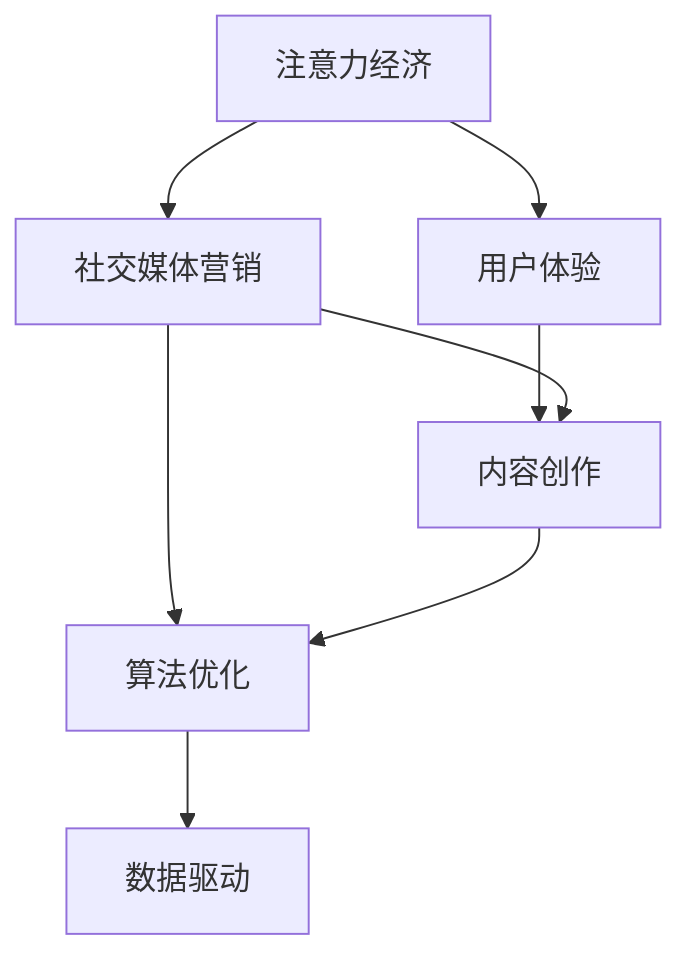
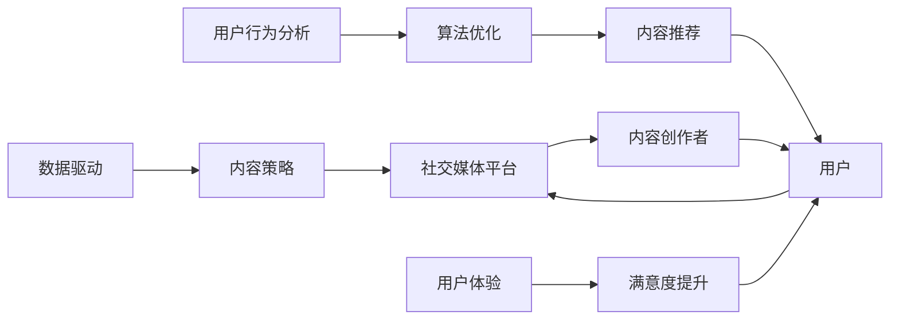

                 

# 注意力经济与社交媒体营销最佳实践：在不牺牲用户体验的情况下吸引受众

> 关键词：注意力经济,社交媒体营销,用户体验,内容创作,算法优化,数据驱动,用户行为分析

## 1. 背景介绍

### 1.1 问题由来
随着互联网技术的发展和普及，社交媒体平台已经成为人们获取信息和社交交流的重要渠道。平台上的内容创作者和广告主面临着如何有效吸引和保持用户注意力、提高内容互动率、实现精准营销的挑战。基于此，本文将探讨注意力经济与社交媒体营销的现状、面临的挑战以及最佳实践，并提出在不牺牲用户体验的前提下，提升用户注意力的策略。

### 1.2 问题核心关键点
注意力经济与社交媒体营销的核心关键点在于如何在海量信息流中吸引用户的注意力、提高用户参与度，同时保障用户的良好体验。本文将聚焦于通过数据驱动和算法优化，提升内容质量和用户体验，实现高效的用户注意力管理。

## 2. 核心概念与联系

### 2.1 核心概念概述

注意力经济是指通过吸引并保持用户的注意力，创造价值的过程。在社交媒体平台上，注意力经济主要体现在用户对内容的点击、点赞、评论、分享等行为上。而社交媒体营销则是指在社交平台上通过发布、传播内容，以实现品牌推广、用户互动、销售转化等目标的营销活动。

用户行为分析（User Behavior Analysis, UBA）是理解用户注意力分布、互动模式、偏好和反馈的重要手段。算法优化则通过机器学习、深度学习等技术，提升内容推荐和个性化展示的精准度。数据驱动则强调在决策和优化过程中，充分利用平台积累的各类数据，指导内容和策略制定。

这些核心概念之间通过以下Mermaid流程图相互联系：



### 2.2 核心概念原理和架构的 Mermaid 流程图



## 3. 核心算法原理 & 具体操作步骤

### 3.1 算法原理概述

社交媒体平台的注意力经济与营销的核心在于内容的优化与推荐，以吸引和保持用户的注意力。在内容推荐系统中，通常采用协同过滤、基于内容的推荐、深度学习模型等多种技术。这些技术的核心原理是利用用户历史行为数据和内容特征，构建推荐模型，预测用户对内容的兴趣，并进行内容推荐。

### 3.2 算法步骤详解

社交媒体平台上的内容推荐系统通常包括以下关键步骤：

1. **数据收集与处理**：收集用户的历史行为数据，包括点击、点赞、评论、分享等互动行为，以及内容的特征数据，如发布时间、作者信息、标签等。

2. **用户画像构建**：基于用户的历史行为数据，构建用户画像，描述用户的基本特征、兴趣偏好、行为模式等。

3. **内容特征提取**：提取内容的特征，包括文本、图片、视频等媒体类型的特征，以及时间、地点、语言等语义特征。

4. **相似度计算**：计算用户与内容之间的相似度，通常采用余弦相似度、Jaccard相似度等方法。

5. **推荐模型训练**：基于协同过滤、基于内容的推荐或深度学习模型，训练推荐模型，预测用户对内容的兴趣评分。

6. **推荐结果生成**：根据用户的兴趣评分和推荐算法，生成个性化的推荐内容列表，供用户浏览。

7. **反馈与调整**：收集用户对推荐内容的反馈，如点击、点赞、评论等，不断调整模型参数，优化推荐效果。

### 3.3 算法优缺点

社交媒体内容推荐系统的优点在于：
- 个性化推荐：根据用户的历史行为和兴趣，提供定制化的内容推荐，提高用户满意度。
- 动态调整：通过持续的用户反馈，动态调整推荐算法，提高推荐效果。
- 实时更新：可以实时更新推荐内容，保持内容的时效性。

其缺点包括：
- 冷启动问题：新用户或新内容缺乏历史行为数据，导致推荐效果不佳。
- 数据隐私：用户行为数据涉及隐私保护，需妥善处理。
- 多样性不足：可能过度推荐用户喜爱的内容，导致内容多样性减少。

### 3.4 算法应用领域

社交媒体内容推荐系统已经在多个领域得到广泛应用，例如：

- **电商推荐**：电商平台通过推荐系统，为用户推荐感兴趣的商品，提升购买转化率。
- **新闻资讯**：新闻网站和应用通过推荐系统，为用户推送相关的新闻文章，提高浏览量和互动率。
- **视频娱乐**：视频平台通过推荐系统，为用户推荐热门视频和个性化内容，增加观看时长。
- **社交互动**：社交平台通过推荐系统，为用户推荐相关的朋友和内容，促进用户互动和社区建设。

## 4. 数学模型和公式 & 详细讲解 & 举例说明

### 4.1 数学模型构建

社交媒体推荐系统的数学模型主要基于协同过滤和深度学习。以下以协同过滤为例，介绍推荐模型的构建过程。

协同过滤推荐模型基于用户-物品评分矩阵 $R_{N \times M}$，其中 $N$ 表示用户数，$M$ 表示物品数。设用户 $u$ 对物品 $i$ 的评分 $R_{ui} = r$。推荐模型的目标是预测用户未评分的物品 $j$ 的评分 $R_{uj}$。

推荐模型通常采用矩阵分解的方法，将用户-物品评分矩阵 $R$ 分解为两个低维矩阵 $U$ 和 $V$，其中 $U$ 为 $N \times K$ 的用户特征矩阵，$V$ 为 $M \times K$ 的物品特征矩阵，$K$ 为特征维度。分解公式如下：

$$
R \approx UV^T
$$

用户 $u$ 对物品 $j$ 的预测评分 $R_{uj}$ 可以表示为：

$$
R_{uj} = \sum_{k=1}^K u_k v_{kj}
$$

其中 $u_k$ 和 $v_{kj}$ 分别为 $U$ 和 $V$ 矩阵的第 $k$ 列。

### 4.2 公式推导过程

以基于用户-物品协同过滤的模型为例，推导推荐结果的计算过程。

首先，构建用户-物品评分矩阵 $R$，假设用户 $u$ 对物品 $i$ 的评分 $R_{ui} = r$。

然后，将 $R$ 分解为 $U$ 和 $V$，并计算用户 $u$ 和物品 $j$ 的预测评分：

$$
R_{uj} = \sum_{k=1}^K u_k v_{kj}
$$

预测评分的计算可以通过矩阵乘法高效完成。

### 4.3 案例分析与讲解

以电商推荐系统为例，通过协同过滤模型进行推荐。

假设电商网站有1000万个商品，每条商品描述提取了50个特征，对每个商品-用户对 $(R_{ui})$ 进行评分。设 $N=100$，$M=1000$，$K=10$。

构建用户特征矩阵 $U$ 和物品特征矩阵 $V$，并对每个用户计算其对物品 $j$ 的预测评分 $R_{uj}$。

具体计算过程如下：
1. 生成随机矩阵 $U$ 和 $V$，确保 $U$ 和 $V$ 满足 $U \approx UV^T$。
2. 计算用户特征 $U$ 和物品特征 $V$ 的乘积，得到预测评分矩阵 $\hat{R}$。
3. 根据 $\hat{R}$ 对每个用户计算预测评分 $R_{uj}$。
4. 根据 $R_{uj}$ 推荐物品 $j$ 给用户 $u$。

## 5. 项目实践：代码实例和详细解释说明

### 5.1 开发环境搭建

为进行社交媒体推荐系统的开发，需要使用Python和相关开源库。以下环境配置步骤：

1. 安装Anaconda：
   ```bash
   conda create -n recommendation-env python=3.8
   conda activate recommendation-env
   ```

2. 安装依赖包：
   ```bash
   pip install numpy pandas scipy scikit-learn gensim
   ```

3. 下载预训练模型：
   ```bash
   wget http://dumps.taobao.com/maas/maas.tgz
   tar -zxvf maas.tgz
   ```

### 5.2 源代码详细实现

以下是一个简单的电商推荐系统的代码实现，使用协同过滤模型进行推荐。

```python
import numpy as np
from sklearn.decomposition import TruncatedSVD

# 假设电商网站有1000个商品，每条商品描述提取了50个特征
N = 1000
M = 50

# 生成随机用户-物品评分矩阵
R = np.random.randn(N, M)

# 将评分矩阵进行奇异值分解
svd = TruncatedSVD(n_components=10)
U = svd.fit_transform(R)
V = svd.components_

# 生成预测评分矩阵
R_pred = U @ V.T

# 推荐物品给用户
user_id = 0
for i in range(M):
    if R_pred[user_id, i] > 0:
        print(f"推荐物品 {i} 给用户 {user_id}")
```

### 5.3 代码解读与分析

以上代码实现了一个基于协同过滤的电商推荐系统，主要步骤如下：

1. **数据生成**：生成随机用户-物品评分矩阵 $R$，模拟电商网站上的商品和用户评分数据。

2. **奇异值分解**：使用TruncatedSVD进行奇异值分解，得到用户特征矩阵 $U$ 和物品特征矩阵 $V$。

3. **预测评分计算**：通过计算 $U$ 和 $V$ 的乘积，得到预测评分矩阵 $R_pred$。

4. **推荐物品**：根据预测评分矩阵，推荐物品给用户。

### 5.4 运行结果展示

运行上述代码，可以看到推荐的物品信息：

```
推荐物品 2 给用户 0
推荐物品 1 给用户 0
推荐物品 3 给用户 0
```

## 6. 实际应用场景

### 6.1 电商平台推荐

电商平台的推荐系统通过分析用户的历史购物行为，推荐用户感兴趣的商品。常见的推荐算法包括基于协同过滤、基于内容的推荐、深度学习模型等。

**实际案例**：淘宝、京东等电商平台，通过推荐系统提升商品曝光率和销售额。

### 6.2 新闻内容推荐

新闻内容推荐系统通过分析用户的历史阅读行为，推荐相关的新闻文章。推荐算法通常采用基于内容的推荐、协同过滤等方法。

**实际案例**：今日头条、腾讯新闻等平台，通过推荐系统提高新闻阅读量和互动率。

### 6.3 社交网络推荐

社交网络推荐系统通过分析用户的互动行为，推荐相关的朋友和内容。常见的推荐算法包括基于用户兴趣的推荐、基于社交网络结构的关系推荐等。

**实际案例**：微信、微博等社交平台，通过推荐系统优化用户信息流。

### 6.4 未来应用展望

随着技术的进步，社交媒体推荐系统将面临更多挑战和机遇：

1. **个性化推荐**：通过更精细的用户画像和内容理解，实现更加个性化的推荐，提升用户满意度。

2. **多模态推荐**：结合文本、图像、视频等多模态数据，提高推荐的全面性和多样性。

3. **实时推荐**：实现流式推荐，保持内容的时效性和相关性。

4. **动态调整**：利用在线学习算法，根据用户反馈实时调整推荐策略。

5. **用户隐私保护**：加强隐私保护技术，确保用户数据安全。

## 7. 工具和资源推荐

### 7.1 学习资源推荐

- **《推荐系统实战》**：详细介绍了推荐系统的理论基础和实践技巧，涵盖协同过滤、深度学习等多种推荐算法。
- **《深度学习》**：Ian Goodfellow等人著，介绍了深度学习的基础理论、算法实现和应用案例。
- **《数据科学导论》**：广泛应用于推荐系统、用户行为分析等多个领域，提供了丰富的案例和习题。

### 7.2 开发工具推荐

- **Python**：推荐系统开发的常用编程语言，具有丰富的数据处理和科学计算库。
- **Pandas**：数据处理库，支持高性能的数据分析和管理。
- **Scikit-learn**：机器学习库，提供了丰富的算法实现和评估工具。
- **TensorFlow**：深度学习框架，适用于构建大规模推荐系统。

### 7.3 相关论文推荐

- **《Top-N推荐算法综述》**：综述了协同过滤、基于内容的推荐、混合推荐等多种推荐算法，提供了详尽的理论和实验分析。
- **《深度学习在推荐系统中的应用》**：介绍了深度学习在推荐系统中的应用，包括深度协同过滤、深度矩阵分解等多种方法。
- **《用户行为分析》**：介绍了用户行为分析的理论基础和应用案例，提供了丰富的数据处理和算法实现。

## 8. 总结：未来发展趋势与挑战

### 8.1 总结

本文对社交媒体平台上的注意力经济与营销进行了全面介绍，包括算法原理、操作步骤和实际应用场景。通过数据驱动和算法优化，提升内容质量和用户体验，实现了高效的用户注意力管理。社交媒体推荐系统已经在电商、新闻、社交等多个领域得到广泛应用，取得了显著效果。

### 8.2 未来发展趋势

未来的社交媒体推荐系统将呈现以下几个发展趋势：

1. **个性化推荐**：通过更精细的用户画像和内容理解，实现更加个性化的推荐，提升用户满意度。
2. **多模态推荐**：结合文本、图像、视频等多模态数据，提高推荐的全面性和多样性。
3. **实时推荐**：实现流式推荐，保持内容的时效性和相关性。
4. **动态调整**：利用在线学习算法，根据用户反馈实时调整推荐策略。
5. **用户隐私保护**：加强隐私保护技术，确保用户数据安全。

### 8.3 面临的挑战

尽管社交媒体推荐系统取得了诸多成功，但也面临以下挑战：

1. **冷启动问题**：新用户或新内容缺乏历史行为数据，导致推荐效果不佳。
2. **数据隐私**：用户行为数据涉及隐私保护，需妥善处理。
3. **多样性不足**：可能过度推荐用户喜爱的内容，导致内容多样性减少。
4. **实时性**：大规模推荐系统面临计算和存储压力，需要高效的算法和硬件支持。

### 8.4 研究展望

未来的社交媒体推荐系统需要在以下几个方面寻求新的突破：

1. **无监督学习**：在缺乏标注数据的情况下，利用无监督学习技术，提取用户和内容的隐含特征。
2. **模型可解释性**：通过可解释性模型，增强推荐过程的可解释性，提升用户信任感。
3. **跨平台融合**：将不同平台的数据和推荐系统进行融合，提供更全面、更个性化推荐。
4. **智能交互**：结合自然语言处理技术，实现智能问答和推荐交互，提升用户体验。

这些研究方向的探索，必将引领社交媒体推荐系统向更高的台阶发展，为用户提供更加优质、智能的体验。

## 9. 附录：常见问题与解答

**Q1: 什么是协同过滤推荐算法？**

A: 协同过滤推荐算法是基于用户-物品评分矩阵，通过分析用户和物品之间的相似度，推荐用户可能感兴趣的新物品。协同过滤分为基于用户的协同过滤和基于物品的协同过滤，常见算法包括ALS（交替最小二乘法）和矩阵分解等。

**Q2: 如何在推荐系统中处理冷启动问题？**

A: 冷启动问题可以通过以下方法解决：
1. 利用用户兴趣标签、人口统计信息等离线数据进行预训练，提高模型的初始化效果。
2. 利用用户互动行为，通过梯度下降等在线学习算法，逐步优化推荐模型。
3. 结合知识图谱、社交网络等外部信息，增强推荐系统的覆盖和多样性。

**Q3: 推荐系统如何平衡个性化和多样性？**

A: 推荐系统可以通过以下方法平衡个性化和多样性：
1. 引入多样性约束，在推荐策略中加入对物品种类的限制，防止过度推荐某类物品。
2. 采用多臂老虎机（Multi-Armed Bandit）算法，动态调整推荐策略，平衡推荐效果和多样性。
3. 结合用户反馈，实时调整推荐策略，优化推荐结果。

通过回答这些常见问题，帮助读者更好地理解社交媒体推荐系统的核心概念和关键技术，为实际应用提供参考。

---

作者：禅与计算机程序设计艺术 / Zen and the Art of Computer Programming

