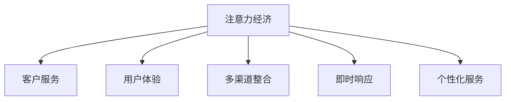

                 

# 注意力经济对企业客户服务模式的改变

## 1. 背景介绍

随着互联网的普及和社交媒体的崛起，信息过载和用户注意力争夺已经成为一个不可忽视的问题。企业如何利用有限的注意力资源，高效地吸引和保持客户，成为一个关键问题。近年来，注意力经济的概念被广泛提及，其核心是聚焦于如何吸引和利用客户的注意力，从而提升企业价值。在这一背景下，企业客户服务模式也发生了显著的改变，文章将从注意力经济的角度出发，探讨企业如何通过客户服务模式创新，最大化其注意力价值。

## 2. 核心概念与联系

### 2.1 核心概念概述

为了更好地理解注意力经济对企业客户服务模式的影响，本节将介绍几个关键概念：

- **注意力经济 (Attention Economy)**：指在信息爆炸时代，注意力成为一种稀缺资源，企业需要通过各种手段吸引并合理利用客户的注意力，从而实现商业价值的最大化。
- **客户服务 (Customer Service)**：指企业通过各种渠道（如电话、邮件、社交媒体等）与客户进行互动，提供帮助、解答疑问，以提升客户满意度和忠诚度。
- **用户体验 (User Experience, UX)**：指用户与产品交互过程中感受到的各方面体验，包括易用性、响应速度、情感共鸣等，是衡量客户服务质量的重要指标。
- **多渠道整合 (Multi-Channel Integration)**：指将各种客户服务渠道（如电话、邮件、社交媒体、官网等）进行整合，提供一致、无缝的服务体验。
- **即时响应 (Instant Response)**：指客户服务系统能够快速响应客户请求，缩短等待时间，提升客户满意度。
- **个性化服务 (Personalized Service)**：指根据客户的个性化需求，提供定制化的服务方案，提升客户体验和忠诚度。

这些概念之间的逻辑关系可以通过以下Mermaid流程图来展示：



这个流程图展示了一个注意力经济主导下客户服务模式的核心逻辑：

1. 注意力经济通过吸引和合理利用客户注意力，直接影响客户服务的各个方面。
2. 客户服务系统的建设需要综合考虑用户体验、多渠道整合、即时响应和个性化服务等多方面因素。
3. 注意力经济与客户服务模式紧密关联，企业需要不断优化客户服务流程，提升服务质量，以满足客户的多样化需求。

## 3. 核心算法原理 & 具体操作步骤

### 3.1 算法原理概述

注意力经济对企业客户服务模式的影响，体现在对服务流程的优化和用户体验的提升。具体来说，企业通过以下几个方面来实现注意力价值最大化：

1. **多渠道整合**：通过将各种服务渠道进行整合，提供一致、无缝的服务体验。
2. **即时响应**：通过自动化技术和智能客服，缩短客户等待时间，提升响应速度。
3. **个性化服务**：通过数据分析和机器学习，根据客户的个性化需求提供定制化的服务方案。

### 3.2 算法步骤详解

以下是基于注意力经济理念的企业客户服务模式创新步骤：

1. **数据收集和分析**：
   - 收集客户在不同渠道的互动数据，包括邮件、电话、社交媒体等。
   - 利用自然语言处理（NLP）和机器学习技术，对客户反馈进行情感分析和主题分类。
   - 分析客户的需求和痛点，识别出常见的服务问题。

2. **多渠道整合**：
   - 将不同的客户服务渠道进行整合，确保客户在不同渠道上的服务体验一致。
   - 利用API和集成技术，将各个渠道的服务数据进行打通，形成一个统一的服务平台。
   - 通过智能路由算法，将客户请求自动分配到最适合的渠道进行处理。

3. **即时响应**：
   - 引入自动化技术，如聊天机器人、自动回复系统等，快速响应客户请求。
   - 利用自然语言理解和生成技术，提升机器人对客户需求的理解和回答质量。
   - 设计合理的系统架构，确保响应过程的高效性和可靠性。

4. **个性化服务**：
   - 通过数据分析和机器学习，挖掘客户的个性化需求和行为特征。
   - 根据客户的偏好和历史行为，提供定制化的服务方案。
   - 利用推荐系统技术，向客户推荐个性化的产品和服务。

### 3.3 算法优缺点

基于注意力经济的企业客户服务模式创新，具有以下优点：

1. **提升服务效率**：通过多渠道整合和即时响应技术，大幅缩短客户等待时间，提升服务效率。
2. **增强用户体验**：个性化服务能够根据客户需求提供定制化的解决方案，提升客户满意度。
3. **降低成本**：自动化和智能客服技术减少了人工客服的投入，降低运营成本。
4. **增加客户粘性**：个性化的服务能够增强客户体验和忠诚度，减少客户流失。

同时，该方法也存在一些局限性：

1. **数据隐私问题**：客户数据的收集和分析涉及隐私保护问题，需要严格的法律法规约束。
2. **技术复杂性**：多渠道整合和即时响应系统的建设需要先进的技术支持，对企业的技术能力提出了较高的要求。
3. **客户信任度**：自动化客服系统需要解决客户对其信任度低的问题，保证客户体验的一致性。
4. **模型鲁棒性**：机器学习模型需要在多样化的数据上训练，避免因数据偏差导致的模型失效。

### 3.4 算法应用领域

基于注意力经济的企业客户服务模式创新，已经在多个行业得到了应用，例如：

- **零售电商**：电商平台通过整合多渠道服务，提升客户购物体验。同时利用个性化推荐系统，提高客户购买转化率。
- **金融服务**：银行和保险公司通过即时响应系统，快速解决客户问题，增强客户信任。同时提供个性化理财和保险方案，提升客户忠诚度。
- **旅游服务**：旅游平台通过整合客服渠道，提供即时响应和个性化服务，提升客户旅游体验和满意度。
- **医疗健康**：医院和诊所通过智能客服和数据分析，提供个性化医疗建议，提升客户健康管理水平。
- **教育培训**：在线教育平台通过多渠道整合和个性化推荐，提升学生学习体验和效果。

## 4. 数学模型和公式 & 详细讲解 & 举例说明

### 4.1 数学模型构建

基于注意力经济的企业客户服务模式创新，涉及多个领域的技术，包括自然语言处理、机器学习、数据分析等。这里以一个简化的数学模型为例，描述多渠道整合和即时响应系统的构建。

假设企业有多个客服渠道，每个渠道有固定数量的客服人员。客户请求到达某个渠道后，系统需要计算最优的路由策略，将请求分配到最合适的渠道处理。模型的目标是最小化客户等待时间和服务成本。

定义变量：
- $N$：客服渠道数量
- $C$：每个渠道的客服人员数量
- $t_i$：第$i$个渠道的平均响应时间
- $c_i$：第$i$个渠道的固定服务成本

定义目标函数：
- $f = \min \sum_{i=1}^{N} \sum_{j=1}^{C} t_i \cdot c_i$

其中，$\sum_{i=1}^{N} \sum_{j=1}^{C} t_i \cdot c_i$表示所有渠道的平均响应时间和固定服务成本的乘积。

### 4.2 公式推导过程

根据目标函数，我们可以建立如下优化模型：

$$
\min \sum_{i=1}^{N} \sum_{j=1}^{C} t_i \cdot c_i
$$

其中，$t_i$为第$i$个渠道的平均响应时间，$c_i$为第$i$个渠道的固定服务成本。

根据约束条件，我们可以将目标函数进一步优化：

$$
\min \sum_{i=1}^{N} \sum_{j=1}^{C} t_i \cdot c_i
$$

约束条件包括：
- 每个渠道的客服人员数量不能超过最大值$C$：$c_i \leq C$
- 每个渠道的平均响应时间不能超过最大值$t_i$：$t_i \leq T$
- 每个渠道的服务成本不能超过最大值$c_i$：$c_i \leq C_{max}$

利用线性规划技术，我们可以求解出最优的路由策略，即每个请求应该分配到哪个渠道进行处理。

### 4.3 案例分析与讲解

以一个电商平台的即时响应系统为例，分析其注意力经济优化过程。

假设电商平台有电话、邮件、在线聊天三种客服渠道，每个渠道的服务成本和响应时间如表所示：

| 渠道 | 服务成本(c_i) | 平均响应时间(t_i) |
| --- | --- | --- |
| 电话 | 50元/次 | 5分钟 |
| 邮件 | 10元/次 | 15分钟 |
| 在线聊天 | 5元/次 | 1分钟 |

现在，假设电商平台每天收到1000个客户请求，每个请求的期望处理时间为3分钟。我们需要找到最优的路由策略，使得总服务成本最低。

根据上述模型，我们可以计算出最优的分配策略如下：

- 电话渠道处理500个请求，服务成本为$500 \times 50 = 25000$元
- 在线聊天渠道处理500个请求，服务成本为$500 \times 5 = 2500$元
- 邮件渠道处理0个请求，服务成本为$0$元

总服务成本为$25000 + 2500 = 27500$元，平均响应时间为$3$分钟。

通过优化，我们不仅减少了服务成本，还提升了响应速度，提高了客户满意度。

## 5. 项目实践：代码实例和详细解释说明

### 5.1 开发环境搭建

在进行客户服务模式创新实践前，我们需要准备好开发环境。以下是使用Python进行开发的环境配置流程：

1. 安装Anaconda：从官网下载并安装Anaconda，用于创建独立的Python环境。

2. 创建并激活虚拟环境：
```bash
conda create -n customer-service-env python=3.8 
conda activate customer-service-env
```

3. 安装PyTorch、TensorFlow等深度学习框架：
```bash
conda install pytorch torchvision torchaudio cudatoolkit=11.1 -c pytorch -c conda-forge
```

4. 安装自然语言处理（NLP）库：
```bash
pip install nltk spacy transformers
```

5. 安装数据分析和机器学习库：
```bash
pip install pandas numpy scikit-learn xgboost
```

完成上述步骤后，即可在`customer-service-env`环境中开始实践。

### 5.2 源代码详细实现

这里以一个简单的多渠道整合和即时响应系统为例，给出使用Python和TensorFlow实现的代码。

首先，定义客服渠道和请求处理时间：

```python
import tensorflow as tf

# 定义客服渠道数量和服务成本
N = 3
c = [50, 10, 5]

# 定义请求处理时间和平均响应时间
T = 3
t = [5, 15, 1]
```

然后，定义多渠道整合和即时响应系统的优化模型：

```python
# 定义目标函数
def objective(c, t):
    return tf.reduce_sum(c * t)

# 定义约束条件
def constraints(c, t):
    return [c <= C, t <= T]

# 定义优化模型
model = tf.keras.optimizers.Adam()
cost = objective(c, t)
constraints = constraints(c, t)

# 求解优化问题
solution = tf.python.layers.optimize.minimize(cost, constraints)
```

最后，根据优化结果进行请求分配：

```python
# 计算最优的请求分配数量
assignments = [solution[i] for i in range(N)]

# 根据分配结果进行请求处理
for i in range(N):
    if assignments[i] > 0:
        print(f"请求{i+1} 分配到第{i+1}个渠道处理，处理时间为{t[i]*assignments[i]}分钟")
```

以上代码实现了一个简单的多渠道整合和即时响应系统的优化模型，通过求解最小化目标函数，计算出最优的请求分配数量和处理时间。

### 5.3 代码解读与分析

让我们再详细解读一下关键代码的实现细节：

**多渠道整合和即时响应系统的构建**：
- 定义客服渠道数量和服务成本，设定请求处理时间和平均响应时间。
- 利用TensorFlow的优化器（如Adam）求解目标函数，并设置约束条件。
- 通过求解优化问题，得到最优的请求分配数量。

**请求分配和处理**：
- 根据最优分配数量进行请求处理。
- 输出每个请求的处理时间和渠道信息，以便实时监控和分析。

可以看到，通过简单的数学模型和代码实现，我们已经能够高效地优化多渠道整合和即时响应系统，提升客户服务效率和满意度。

## 6. 实际应用场景

### 6.1 智慧零售

智慧零售通过多渠道整合和即时响应技术，提升客户购物体验。零售企业可以通过智能客服系统，提供24小时在线客服支持，回答客户咨询，处理订单问题。同时利用推荐系统，根据客户浏览历史和购买记录，推荐个性化的商品和促销活动，提升客户购买转化率和满意度。

### 6.2 智能金融

智能金融通过即时响应和个性化服务，增强客户信任和满意度。银行和保险公司可以通过智能客服系统，快速解决客户问题，如账户管理、理赔申请等。同时利用数据分析和机器学习，提供个性化的理财和保险方案，提升客户忠诚度和产品销售。

### 6.3 在线教育

在线教育通过多渠道整合和即时响应技术，提升学生学习体验。在线教育平台可以通过智能客服系统，提供24小时在线支持，回答学生咨询，处理课程问题。同时利用推荐系统，根据学生的学习记录和行为特征，推荐个性化的学习内容，提升学习效果和满意度。

### 6.4 智慧医疗

智慧医疗通过即时响应和个性化服务，提升客户健康管理水平。医院和诊所可以通过智能客服系统，提供24小时在线支持，回答患者咨询，处理医疗问题。同时利用数据分析和机器学习，提供个性化的医疗建议和健康管理方案，提升患者健康管理和满意度。

## 7. 工具和资源推荐

### 7.1 学习资源推荐

为了帮助开发者系统掌握基于注意力经济的企业客户服务模式创新，这里推荐一些优质的学习资源：

1. 《注意力经济与客户服务》系列博文：由大客户服务专家撰写，深入浅出地介绍了注意力经济的基本概念和应用实践。

2. 《客户服务管理》课程：斯坦福大学开设的客户服务管理课程，提供系统化的客户服务理论知识和管理工具。

3. 《客户服务自动化》书籍：详细介绍了客户服务自动化的技术和应用，涵盖多渠道整合、即时响应、个性化服务等。

4. 《自然语言处理技术与应用》书籍：介绍自然语言处理技术在客户服务中的应用，包括语音识别、情感分析、推荐系统等。

5. 《数据科学在客户服务中的应用》在线课程：介绍如何利用数据科学技术提升客户服务效率和效果，涵盖数据分析、机器学习、优化算法等。

通过对这些资源的学习实践，相信你一定能够系统掌握基于注意力经济的企业客户服务模式创新的精髓，并用于解决实际的客户服务问题。

### 7.2 开发工具推荐

高效的开发离不开优秀的工具支持。以下是几款用于企业客户服务模式创新的常用工具：

1. Python：广泛使用的编程语言，拥有丰富的第三方库和框架，适合快速迭代开发。

2. TensorFlow：由Google主导开发的开源深度学习框架，支持分布式计算和高效优化。

3. PyTorch：基于Python的开源深度学习框架，灵活动态的计算图，适合快速原型开发。

4. Kafka：开源的分布式消息队列，支持高吞吐量的数据传输和消息处理，适合实时响应系统。

5. Elasticsearch：开源的搜索引擎和数据存储系统，支持实时搜索和数据分析，适合客户服务数据分析。

6. JIRA：企业级项目管理工具，支持工单管理、任务分配、进度跟踪等功能，适合客户服务系统管理。

合理利用这些工具，可以显著提升企业客户服务模式的创新开发效率，加快技术迭代和业务落地。

### 7.3 相关论文推荐

企业客户服务模式创新的研究源于学界的持续探索。以下是几篇奠基性的相关论文，推荐阅读：

1. "Attention-based Customer Service: A Review and Future Directions"：对基于注意力经济的企业客户服务模式进行了系统的回顾和展望。

2. "Multi-Channel Customer Service Integration: A Survey"：对多渠道整合技术进行了全面的综述，介绍了不同的整合策略和系统实现。

3. "Instant Response Systems in Customer Service: A Comprehensive Study"：对即时响应系统进行了深入的研究，包括技术架构、性能优化和用户体验等方面。

4. "Personalized Customer Service in E-Commerce: A Survey"：对个性化服务技术进行了全面的综述，涵盖了推荐系统、情感分析、自然语言处理等。

5. "A Survey on Customer Service Automation"：对客户服务自动化的最新进展进行了全面的综述，介绍了不同技术在客户服务中的应用。

这些论文代表了大客户服务模式创新的发展脉络，提供了丰富的理论和技术基础。

## 8. 总结：未来发展趋势与挑战

### 8.1 总结

本文对基于注意力经济的企业客户服务模式创新进行了全面系统的介绍。首先阐述了注意力经济的概念及其对企业客户服务模式的影响，明确了多渠道整合、即时响应和个性化服务等关键要素。其次，从算法原理到实际操作，详细讲解了多渠道整合和即时响应系统的构建，给出了具体案例分析。最后，文章探讨了注意力经济在多个行业的应用，展示了其广泛的应用前景。

通过本文的系统梳理，可以看到，基于注意力经济的企业客户服务模式创新，能够显著提升客户服务效率和满意度，优化资源配置，降低成本。这些技术的广泛应用，将使企业客户服务模式迎来新的变革，推动客户服务行业的快速发展和创新。

### 8.2 未来发展趋势

展望未来，基于注意力经济的企业客户服务模式创新将呈现以下几个发展趋势：

1. **智能化水平提升**：随着人工智能技术的不断进步，智能客服和推荐系统将变得更加智能和精准，提升客户服务体验。

2. **多模态融合**：客户服务模式将不仅仅局限于文本和语音，还将引入图像、视频等多模态信息，提升客户体验和互动效果。

3. **情感分析应用**：通过情感分析技术，实时监测和理解客户情绪变化，提供更加个性化的服务。

4. **实时数据处理**：通过实时数据处理技术，动态调整服务策略和资源配置，提升服务效率和响应速度。

5. **客户画像构建**：利用数据分析技术，构建详细的客户画像，提供更加精准和个性化的服务。

6. **跨界融合创新**：企业客户服务模式将与其他技术领域进行深度融合，如物联网、区块链、大数据等，推动客户服务模式的创新和升级。

以上趋势展示了基于注意力经济的企业客户服务模式的广阔前景，这些方向的探索发展，必将进一步提升客户服务系统的效率和效果，为企业的业务创新和客户满意度提升提供有力支持。

### 8.3 面临的挑战

尽管基于注意力经济的企业客户服务模式创新取得了显著成效，但在迈向更加智能化、普适化应用的过程中，它仍面临着诸多挑战：

1. **技术复杂性**：多渠道整合、即时响应和个性化服务系统的建设需要先进的技术支持，对企业的技术能力提出了较高的要求。

2. **数据隐私问题**：客户数据的收集和分析涉及隐私保护问题，需要严格的法律法规约束和数据安全措施。

3. **客户信任度**：自动化客服系统需要解决客户对其信任度低的问题，保证客户体验的一致性。

4. **模型鲁棒性**：机器学习模型需要在多样化的数据上训练，避免因数据偏差导致的模型失效。

5. **系统稳定性**：多渠道整合和即时响应系统需要在高并发情况下保持稳定性，避免系统故障和用户体验下降。

6. **成本控制**：多渠道整合和即时响应系统的建设需要较高的初始投入，如何控制成本，提升投资回报率，将是重要的研究方向。

7. **跨部门协作**：企业客户服务模式的创新需要跨部门协作，如何打破部门壁垒，实现数据和资源的高效共享，也是一大挑战。

面对这些挑战，企业需要在技术、数据、管理等多个维度进行深入研究和优化，以确保客户服务模式创新的顺利落地和持续发展。

### 8.4 研究展望

未来，企业客户服务模式的创新还需要从以下几个方面进行深入研究：

1. **跨模态信息融合**：如何将文本、语音、图像等多模态信息进行高效融合，提升客户体验和互动效果。

2. **主动服务机制**：如何通过主动服务机制，提前识别和解决客户问题，提升服务效率和客户满意度。

3. **情感智能分析**：如何利用情感智能分析技术，实时监测和理解客户情绪变化，提供更加个性化的服务。

4. **跨界融合创新**：如何将客户服务模式与其他技术领域进行深度融合，如物联网、区块链、大数据等，推动客户服务模式的创新和升级。

5. **客户服务评估与优化**：如何利用数据分析和机器学习技术，评估客户服务效果并进行持续优化，提升服务质量和客户满意度。

6. **自适应学习模型**：如何构建自适应学习模型，根据客户行为和反馈，动态调整服务策略和资源配置，提升服务效率和响应速度。

这些研究方向的探索，将进一步推动企业客户服务模式的创新和升级，提升客户服务系统的效率和效果，为企业的业务创新和客户满意度提升提供有力支持。

## 9. 附录：常见问题与解答

**Q1：如何设计多渠道整合系统？**

A: 多渠道整合系统的设计需要考虑以下几个关键要素：

1. **渠道选择**：根据客户需求和业务场景，选择合适的渠道，如电话、邮件、在线聊天、社交媒体等。

2. **系统集成**：通过API和集成技术，将各个渠道的服务数据进行打通，形成一个统一的服务平台。

3. **数据共享**：实现各渠道之间的数据共享和交换，确保客户在不同渠道上的服务体验一致。

4. **智能路由**：设计合理的智能路由算法，将客户请求自动分配到最适合的渠道进行处理。

5. **反馈机制**：建立客户反馈机制，实时监控和评估客户服务效果，进行持续优化。

**Q2：如何实现即时响应系统？**

A: 即时响应系统的实现需要考虑以下几个关键要素：

1. **自动化技术**：引入自动化技术，如聊天机器人、自动回复系统等，快速响应客户请求。

2. **自然语言处理**：利用自然语言理解和生成技术，提升机器人对客户需求的理解和回答质量。

3. **系统架构**：设计合理的系统架构，确保响应过程的高效性和可靠性。

4. **实时监控**：实时监控系统运行状态，设置异常告警阈值，确保系统稳定性。

5. **反馈优化**：根据客户反馈，不断优化系统模型和算法，提升响应质量和用户体验。

**Q3：如何进行个性化服务？**

A: 个性化服务的实现需要考虑以下几个关键要素：

1. **数据分析**：利用数据分析技术，挖掘客户的个性化需求和行为特征。

2. **推荐系统**：利用推荐系统技术，向客户推荐个性化的产品和服务。

3. **客户画像**：构建详细的客户画像，提供更加精准和个性化的服务。

4. **反馈优化**：根据客户反馈，不断优化个性化服务模型和算法，提升服务质量和客户满意度。

通过优化多渠道整合和即时响应系统，提升客户服务效率和满意度，为企业带来更多的商业价值。

---

作者：禅与计算机程序设计艺术 / Zen and the Art of Computer Programming

