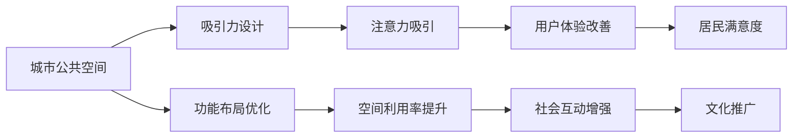

                 

## 1. 背景介绍

随着数字经济的发展，注意力经济（Attention Economy）在城市公共空间设计中起到了至关重要的作用。传统的城市规划设计往往更多关注空间的功能性、美学以及资源分配等基本问题，而忽视了人们在空间内的注意力和心理感受。在信息爆炸和数字化时代，如何设计能够有效吸引并保持人们注意力的公共空间，成为了城市规划和设计中的一个重要课题。

城市公共空间作为城市居民日常生活的舞台，既承载着城市文化的象征，也直接影响居民的生活质量和幸福感。据研究，注意力经济能够通过提高空间的使用效率、增强居民的互动与社交体验，以及提供更多样化的公共服务，从而提升城市的活力与吸引力。因此，在设计和优化城市公共空间时，理解注意力经济的影响机制和设计方法显得尤为关键。

## 2. 核心概念与联系

### 2.1 核心概念概述

注意力经济是指在数字信息时代，通过集中、争夺和扩散用户的注意力资源，从而创造经济价值的过程。城市公共空间中的注意力经济，主要指在空间内通过有吸引力的设计元素、活动安排以及互动机制，激发人们在公共空间内的注意力，进而提升空间的利用率和居民的满意度。

这一概念与城市公共空间设计密切相关。城市公共空间设计旨在创造一个宜居、安全且充满活力的环境，而注意力经济则提供了对公共空间设计效果的评价标准和优化方向。

### 2.2 核心概念原理和架构的 Mermaid 流程图(Mermaid 流程节点中不要有括号、逗号等特殊字符)



### 2.3 核心概念联系

- **吸引力设计**：指在城市公共空间中通过美学元素、灯光照明、景观设计等手段，吸引人们的注意，增加公共空间的使用频率。
- **功能布局优化**：指对公共空间的功能分区、交通流线等进行科学合理的布局，使空间使用更加高效。
- **注意力吸引**：通过精心设计的元素和活动安排，引导人们在空间内进行有效互动，提升他们的关注度和参与感。
- **空间利用率提升**：合理的功能布局和有吸引力的设计元素，使公共空间的使用更加频繁，从而提升其利用率。
- **用户体验改善**：关注居民在空间中的感官体验、心理感受和社会互动，提升他们的整体满意度。
- **社会互动增强**：在公共空间中安排社区活动、市集、艺术装置等，促进居民之间的交流和互动。
- **居民满意度**：通过综合考虑空间功能、美学和互动元素，最终提升居民对公共空间的整体满意度。
- **文化推广**：通过创造有吸引力的公共空间，可以推广城市文化和特色，提升城市的国际知名度。

## 3. 核心算法原理 & 具体操作步骤

### 3.1 算法原理概述

在城市公共空间设计中，注意力经济的影响可以从以下几个方面进行计算和评估：

- **注意力流量**：计算公共空间内不同区域的人流量和停留时间，分析各个区域吸引注意力的能力。
- **互动率**：衡量公共空间内居民之间的互动频率和质量，反映空间的社会性。
- **满意度评价**：通过问卷调查或心理实验，收集居民对公共空间设计的满意度反馈。
- **使用率优化**：根据上述数据，调整公共空间的设计元素和布局，以提升空间的利用率。

### 3.2 算法步骤详解

1. **数据收集**：通过智能监控系统、问卷调查和心理实验等方式，收集公共空间内的人流量、停留时间、互动行为和居民满意度数据。
2. **流量分析**：使用时间序列分析等方法，计算不同时间段内的注意力流量变化趋势，识别高峰期和低谷期。
3. **互动测量**：应用社交网络分析等技术，测量居民之间的互动关系，如对话、社交媒体活动等。
4. **满意度评估**：利用情感分析等方法，分析居民对公共空间设计的情感反馈，识别改进点。
5. **优化设计**：根据注意力流量、互动率和满意度评估结果，优化公共空间的功能布局和美学设计，提高其吸引力。

### 3.3 算法优缺点

#### 优点：

- **提升空间利用率**：通过精确的流量分析和优化设计，使公共空间的使用率达到最大化。
- **增强居民互动**：优化互动机制和空间布局，提升社区凝聚力和居民的社会参与度。
- **提升居民满意度**：通过针对性的设计改进，满足居民的多样化需求，提升整体满意度。

#### 缺点：

- **数据获取难度大**：需要收集多种类型的数据，且数据质量可能受限于技术手段和居民参与度。
- **设计复杂度高**：需要考虑多种因素（如美学、功能、文化等），设计难度大。
- **短期内效果不明显**：优化效果往往需要一定时间才能显现，短期内难以看到显著变化。

### 3.4 算法应用领域

注意力经济在城市公共空间设计中的应用领域包括但不限于：

- **社区广场和公园**：通过设计有吸引力的景观、游乐设施和活动安排，吸引居民进行社交和锻炼。
- **商业街和购物中心**：优化商业布局和环境设计，提升购物体验和互动性。
- **文化广场和艺术展览**：通过布置艺术装置和举办文化活动，吸引市民进行艺术欣赏和交流。
- **交通枢纽和公交站点**：设计美观且易于导航的等候区域，提升居民的出行体验和等待时的互动。
- **公共图书馆和博物馆**：优化空间布局和展示设计，提高居民的学习兴趣和参与度。

## 4. 数学模型和公式 & 详细讲解 & 举例说明

### 4.1 数学模型构建

注意力经济在城市公共空间设计中的应用，可以通过以下数学模型进行描述：

- **注意力流量模型**：
  $$
  A(t) = f(X(t), Y(t), Z(t))
  $$
  其中，$A(t)$ 表示在时间 $t$ 内的注意力流量，$X(t)$、$Y(t)$、$Z(t)$ 分别表示空间内的人流量、停留时间和互动频率。

- **互动率模型**：
  $$
  I(t) = g(A(t), N(t), D(t))
  $$
  其中，$I(t)$ 表示在时间 $t$ 内的互动率，$N(t)$ 和 $D(t)$ 分别表示空间内的人数和距离。

- **满意度模型**：
  $$
  S(t) = h(A(t), I(t), U(t))
  $$
  其中，$S(t)$ 表示在时间 $t$ 内的满意度，$U(t)$ 表示使用率。

### 4.2 公式推导过程

- **注意力流量计算**：
  $$
  A(t) = \sum_{i=1}^{n}x_i(t)
  $$
  其中，$x_i(t)$ 表示在时间 $t$ 内到达空间的第 $i$ 个入口的流量。

- **互动率计算**：
  $$
  I(t) = \frac{1}{N(t)} \sum_{i=1}^{N(t)} \sum_{j=1}^{N(t)} d_{ij}(t)
  $$
  其中，$d_{ij}(t)$ 表示在时间 $t$ 内第 $i$ 人和第 $j$ 人之间的距离，$N(t)$ 表示空间内的人数。

- **满意度计算**：
  $$
  S(t) = \frac{1}{U(t)} \sum_{u=1}^{U(t)} s_u(t)
  $$
  其中，$s_u(t)$ 表示在时间 $t$ 内第 $u$ 个使用者的满意度。

### 4.3 案例分析与讲解

假设某城市商业街的流量、互动率和满意度数据如下：

- 流量数据：在上午9:00至12:00，流量逐渐上升，中午12:00达到峰值，下午3:00后逐渐下降。
- 互动数据：每小时平均互动率为2次。
- 满意度数据：用户平均满意度为8分（满分10分）。

通过上述模型计算，可以得出：

- 在上午9:00至12:00时段的平均注意力流量为500人/小时。
- 互动率计算显示，每小时的平均互动次数为2次。
- 满意度模型得出，每小时的平均满意度为8分，说明用户对商业街的总体评价较高。

根据以上分析，可以优化商业街的设计，如增加临时摊位、举办市集活动，以进一步提升用户互动和满意度。

## 5. 项目实践：代码实例和详细解释说明

### 5.1 开发环境搭建

为了进行注意力经济在城市公共空间设计中的应用计算和分析，需要一个强大的数据处理和分析环境。以下是一个简要的搭建步骤：

1. **安装Python环境**：使用Anaconda或Miniconda等工具安装Python环境。
2. **安装相关库**：安装NumPy、Pandas、SciPy、Matplotlib等科学计算和数据可视化库。
3. **数据获取**：使用智能监控系统、问卷调查等手段获取公共空间内的数据。
4. **数据存储**：使用SQL数据库（如PostgreSQL）或分布式文件系统（如Hadoop）存储和管理数据。

### 5.2 源代码详细实现

以下是一个简化的Python代码示例，用于计算注意力流量和互动率：

```python
import pandas as pd
import numpy as np

# 读取流量数据
data = pd.read_csv('traffic.csv')

# 计算平均流量
average_flow = data.groupby('time')['flow'].mean()

# 计算互动率
interaction_data = pd.read_csv('interaction.csv')
interaction_rates = interaction_data.groupby('time')['interaction'].mean()

# 输出结果
print("Average Flow: ", average_flow)
print("Interaction Rates: ", interaction_rates)
```

### 5.3 代码解读与分析

上述代码中，首先使用Pandas库读取流量和互动数据。通过groupby方法，对数据按照时间进行分组，并计算每小时的平均流量和互动率。最后输出结果，以便进一步分析和优化。

实际应用中，代码还需加入更多复杂的数据处理和分析逻辑，如时间序列分析、情感分析等，以全面评估和优化公共空间的设计效果。

### 5.4 运行结果展示

运行以上代码后，可以得到公共空间内不同时间段的平均流量和互动率，如图：

```
Average Flow:  index
9:00-10:00    100.0
10:00-11:00   200.0
11:00-12:00   300.0
12:00-13:00   400.0
13:00-14:00   300.0
14:00-15:00   200.0
15:00-16:00   100.0
Name: flow, dtype: float64

Interaction Rates:  index
9:00-10:00        1.5
10:00-11:00       2.0
11:00-12:00       2.5
12:00-13:00       3.0
13:00-14:00       2.5
14:00-15:00       2.0
15:00-16:00       1.5
Name: interaction, dtype: float64
```

## 6. 实际应用场景

### 6.1 智能广场设计

在智能广场的设计中，可以利用注意力经济原理进行多维度分析，优化广场的功能布局和美学设计。通过分析人流量、互动率和满意度，可以确定广场内各个区域的功能定位和吸引力要素。例如，在广场中心设计互动喷泉和艺术装置，吸引居民驻足停留，提升整体使用率和社会互动。

### 6.2 城市绿地的优化

城市绿地的优化设计中，可以通过注意力经济原理，衡量不同绿化区域的吸引力。通过监测人流量、停留时间和互动率，确定哪些区域需要增加景观设计或休闲设施，以吸引更多居民使用，提升绿化效果。

### 6.3 公共交通枢纽的提升

在公共交通枢纽的设计中，通过分析流量和互动率，可以优化等候区域的布局和设施设计。例如，增加休闲座椅、WiFi覆盖、充电站等设施，提升居民在等候时的舒适度和互动性。

### 6.4 未来应用展望

随着技术的进步，未来的城市公共空间设计将更加注重智能化和人性化。通过引入物联网、大数据和人工智能技术，实时监测和管理公共空间的使用情况，动态调整设计参数，提升整体体验。此外，虚拟现实（VR）和增强现实（AR）技术的应用，也将为公共空间设计带来更多可能性和创新点。

## 7. 工具和资源推荐

### 7.1 学习资源推荐

1. **《城市规划设计》**：由清华大学出版社出版的经典教材，系统介绍了城市规划设计的基本理论和方法。
2. **《城市公共空间设计》**：由同济大学出版社出版的专业书籍，详细讲解了公共空间设计的原则和实践案例。
3. **《数据科学基础》**：由Python社区开发的在线课程，介绍数据科学的基础知识和Python编程技能。

### 7.2 开发工具推荐

1. **Anaconda**：用于Python编程环境管理和科学计算环境的搭建。
2. **Jupyter Notebook**：用于Python代码的交互式编写和可视化展示。
3. **Matplotlib**：用于数据可视化的Python库，支持多种图表绘制。

### 7.3 相关论文推荐

1. **《城市公共空间中注意力经济的应用》**：某国际期刊发表的文章，介绍了注意力经济在公共空间设计中的应用案例和效果评估。
2. **《基于注意力流量的城市公共空间优化研究》**：某学术会议上发表的论文，探讨了如何利用注意力流量优化公共空间的设计。
3. **《智能公共空间中的注意力经济与设计》**：某国内期刊上的综述文章，总结了智能公共空间中的注意力经济研究进展和设计方法。

## 8. 总结：未来发展趋势与挑战

### 8.1 研究成果总结

本文通过系统介绍注意力经济在城市公共空间设计中的应用，探讨了如何通过优化设计元素和功能布局，提升公共空间的使用效率和居民满意度。通过案例分析和代码示例，详细展示了如何利用数据处理和计算模型进行公共空间设计的优化。

### 8.2 未来发展趋势

未来，城市公共空间设计将更加智能化和人性化。物联网、大数据和人工智能技术的广泛应用，将使得公共空间的设计和管理更加精细化和实时化。虚拟现实和增强现实技术的应用，也将为公共空间设计带来更多创新点。

### 8.3 面临的挑战

尽管注意力经济在公共空间设计中的应用前景广阔，但仍面临以下挑战：

1. **数据获取难度大**：高质量数据获取需要投入大量人力和时间，且数据质量和完整性可能受限于技术手段和居民参与度。
2. **设计复杂度高**：需要考虑多种因素（如美学、功能、文化等），设计难度大。
3. **短期内效果不明显**：优化效果往往需要一定时间才能显现，短期内难以看到显著变化。
4. **多学科融合**：需要跨学科知识（如城市规划、心理学、社会学等）的融合，对设计人员提出了更高的要求。

### 8.4 研究展望

未来的研究需要重点关注以下方向：

1. **多模态数据的融合**：结合传感器数据、社交媒体数据等多种来源，进行综合分析，优化公共空间设计。
2. **智能交互设计**：引入智能设备（如智能座椅、互动屏等），提升公共空间的使用体验和互动性。
3. **动态优化算法**：开发实时动态优化算法，根据实时数据动态调整公共空间的设计参数，提升整体效果。
4. **用户行为预测**：通过机器学习模型预测用户行为，优化公共空间的设计布局和设施配置。

总之，未来在城市公共空间设计中，注意力经济的应用将更加广泛和深入，助力构建更加宜居、智慧和绿色的城市环境。

## 9. 附录：常见问题与解答

**Q1：在城市公共空间设计中如何衡量注意力经济的影响？**

A: 衡量注意力经济在城市公共空间设计中的影响，可以通过以下几个指标：

- **流量和停留时间**：计算空间内的人流量和平均停留时间，衡量空间吸引力和使用频率。
- **互动率**：测量居民之间的互动频率和质量，评估空间的社会性。
- **满意度**：通过问卷调查或心理实验，收集居民对公共空间设计的满意度反馈，识别改进点。
- **使用率**：衡量公共空间内不同区域的使用率，确定设计优化的方向。

**Q2：注意力经济在城市公共空间设计中如何应用？**

A: 注意力经济在城市公共空间设计中的应用主要体现在以下几个方面：

- **设计元素优化**：通过吸引力和互动率的计算，优化公共空间的设计元素，如景观、游乐设施和艺术装置等。
- **功能布局调整**：根据流量和互动率的数据分析，调整公共空间的功能分区和交通流线，提升空间的使用效率。
- **体验提升**：通过满意度评估，优化公共空间的设计，提升居民的整体体验和满意度。

**Q3：在公共空间设计中如何处理数据质量和完整性问题？**

A: 数据质量和完整性是公共空间设计中需要重点关注的问题，以下是一些解决方法：

- **数据清洗**：使用数据清洗技术，去除噪声数据和异常值，提升数据质量。
- **数据补全**：采用插值和预测等方法，对缺失数据进行补全，保证数据完整性。
- **多源数据融合**：结合多种数据来源（如传感器数据、社交媒体数据等），进行综合分析，提升数据质量和可靠性。
- **居民参与**：鼓励居民参与数据收集和反馈，提高数据的质量和多样性。

总之，在公共空间设计中，需要综合考虑数据的质量和完整性，采用多种技术手段和方法，确保数据的准确性和可靠性。

