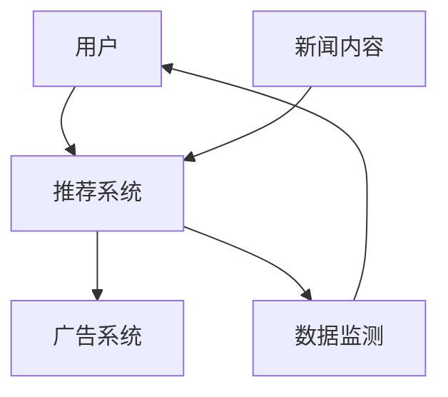

                 

## 1. 背景介绍

### 1.1 问题由来

在互联网时代，信息爆炸已成为不争的事实，新闻传播也随之发生了翻天覆地的变化。传统的新闻媒体，如报纸、电视等，因其时效性和权威性，曾长期占据信息传播的主导地位。但随着社交媒体、即时通讯、在线视频等新媒体形式的兴起，传统媒体的受众流失严重，市场份额逐渐被蚕食。

### 1.2 问题核心关键点

1. **信息过载**：互联网带来了海量信息，用户面临着前所未有的选择困难。如何高效过滤、聚合有用的信息，成为新闻传播亟需解决的问题。
2. **内容消费模式变化**：短视频、图文、音频等形式的多样化，改变了用户的消费习惯，对新闻内容的生产和分发提出了新的要求。
3. **用户注意力争夺**：在海量信息中，如何吸引用户注意力、保持用户粘性，是媒体平台面临的核心挑战。
4. **个性化推荐**：用户的偏好和需求各不相同，新闻平台需通过算法推荐，精准推送符合用户口味的内容。

### 1.3 问题研究意义

探索注意力经济对新闻传播模式的影响，可以帮助我们理解新媒体时代的受众行为，优化内容生产与分发策略，提升用户满意度和平台活跃度。同时，针对个性化推荐、广告投放等关键问题，寻找高效、公正的解决方案，对新闻媒体平台的长远发展具有重要意义。

## 2. 核心概念与联系

### 2.1 核心概念概述

为更好地理解注意力经济在新闻传播中的应用，本节将介绍几个关键概念：

- **注意力经济**：指在信息过载的背景下，如何通过算法优化，引导用户注意力，最大化信息价值。新闻媒体平台，尤其是社交媒体，可以通过算法推送个性化的新闻内容，从而提升用户黏性，实现经济价值。
- **新闻内容推荐**：通过算法模型，预测用户对新闻内容的兴趣，按需推送相关内容，提升用户停留时间和互动率。
- **广告投放优化**：在新闻内容中精准投放广告，利用用户注意力提升广告点击率和转化率，实现商业变现。
- **实时数据监测**：通过数据监测和分析，不断调整推荐策略，优化用户体验和广告效果。

这些核心概念之间存在密切联系，共同构成了新闻媒体平台的运营基础。

### 2.2 核心概念原理和架构的 Mermaid 流程图



这个流程图展示了新闻内容推荐和广告投放的流程，以及实时数据监测的作用。用户通过推荐系统获取个性化内容，广告系统在内容中精准投放广告，数据监测则实时反馈用户行为，不断优化推荐策略。

## 3. 核心算法原理 & 具体操作步骤
### 3.1 算法原理概述

基于注意力经济的新闻内容推荐和广告投放，本质上是一种优化问题。其目标是通过最小化用户损失函数，最大化广告效益函数，找到最佳的推荐和投放策略。

设新闻内容集合为 $\mathcal{X}$，用户集合为 $\mathcal{Y}$，推荐内容为 $x_i \in \mathcal{X}$，用户行为为 $y_i \in \mathcal{Y}$。目标是找到一个推荐策略 $\pi: \mathcal{X} \rightarrow [0,1]$，使得：

$$
\min_{\pi} \mathbb{E} \left[ \sum_{i} \pi(x_i) c(y_i,x_i) \right]
$$

其中 $c(y_i,x_i)$ 为内容推荐给用户 $i$ 的损失函数，可以是点击率、停留时间、互动率等。广告效益函数为目标广告系统的广告点击率、转化率、ROI等指标。

### 3.2 算法步骤详解

基于注意力经济的新闻推荐和广告投放流程包括以下关键步骤：

1. **数据预处理**：
   - 收集用户行为数据，包括点击、停留、分享、评论等行为数据。
   - 收集新闻内容特征，包括标题、摘要、作者、发布时间等。
   - 将用户与内容映射到向量空间，生成用户特征向量 $u_i$ 和内容特征向量 $v_j$。

2. **模型训练**：
   - 构建推荐系统模型，如协同过滤、基于内容的推荐、深度学习等模型。
   - 使用训练数据集 $D = \{(x_i,y_i)\}_{i=1}^N$，其中 $x_i$ 为用户行为，$y_i$ 为用户对内容的评分或行为。
   - 通过损失函数 $\mathcal{L}$ 优化模型参数 $\theta$，最小化损失函数：
     \[
     \theta^* = \arg\min_{\theta} \mathcal{L}(\theta;D)
     \]

3. **广告投放优化**：
   - 将推荐内容中的广告进行分类，生成广告特征向量。
   - 通过A/B测试、CTR预估等方法，预测广告点击率。
   - 根据广告效果，调整投放策略，优化广告转化率、ROI等指标。

4. **实时数据监测**：
   - 实时采集用户行为数据，更新推荐模型。
   - 实时监控广告点击率、转化率等指标，调整投放策略。
   - 通过数据反馈不断优化推荐算法和广告投放策略，提升用户体验和广告效果。

### 3.3 算法优缺点

基于注意力经济的新闻推荐和广告投放算法具有以下优点：
1. **提升用户粘性**：通过个性化推荐，增加用户对平台的依赖，提高用户停留时间和互动率。
2. **精准广告投放**：利用用户注意力，提高广告点击率和转化率，实现更高的广告效益。
3. **实时优化**：通过实时数据监测，不断优化推荐和广告投放策略，适应市场变化。
4. **数据驱动决策**：依赖大规模数据进行模型训练和优化，使决策更加科学和客观。

同时，该算法也存在一些局限性：
1. **隐私问题**：用户数据隐私保护是关键问题，需要采用数据匿名化、加密等措施，防止用户信息泄露。
2. **冷启动问题**：新用户和新内容的推荐难度较大，初期需要手动干预，逐步优化推荐模型。
3. **数据质量问题**：推荐系统的效果依赖数据质量，不准确的数据可能导致误导性推荐。
4. **算法公平性**：算法可能存在偏见，导致某些用户或内容被忽视，需进一步研究公平性问题。

### 3.4 算法应用领域

基于注意力经济的新闻推荐和广告投放算法广泛应用于各种新闻媒体平台，如社交媒体、在线新闻网站、视频平台等。具体应用领域包括：

1. **社交媒体平台**：如微信、微博、抖音等，通过推荐系统提供个性化的新闻、视频、短视频等内容，提升用户活跃度和粘性。
2. **在线新闻网站**：如今日头条、网易新闻等，通过推荐系统提供新闻资讯，增加用户停留时间和点击率。
3. **视频平台**：如YouTube、Netflix等，通过推荐系统提供视频内容，提升用户观看时长和满意度。
4. **电子商务平台**：如Amazon、淘宝等，通过推荐系统提供商品推荐，提高转化率和用户满意度。

这些应用领域展示了注意力经济对新闻传播模式的深远影响，也证明了算法推荐技术在现代媒体平台中的重要地位。

## 4. 数学模型和公式 & 详细讲解 & 举例说明

### 4.1 数学模型构建

我们以协同过滤算法为例，构建基于用户行为数据的推荐系统模型。

设用户对新闻内容的评分矩阵为 $R \in \mathbb{R}^{m \times n}$，其中 $m$ 为新闻内容数量，$n$ 为用户数量。目标是找到一个推荐矩阵 $P \in \mathbb{R}^{m \times n}$，使得 $P$ 与 $R$ 尽可能接近。

推荐矩阵 $P$ 的生成公式为：
\[
P = \mathop{\arg\min}_{P} \| P - R \|_F^2
\]

其中 $\| P - R \|_F$ 为矩阵 $P$ 和 $R$ 的 Frobenius 范数，表示两者之间的距离。

### 4.2 公式推导过程

协同过滤算法的基本思想是通过用户历史行为数据，找到用户与内容的相似度，从而预测用户对未接触过内容的评分。

设用户 $i$ 对新闻内容 $j$ 的评分为 $r_{ij}$，对新闻内容 $j$ 的推荐分数为 $\hat{r}_{ij}$，则推荐矩阵 $P$ 的生成公式为：
\[
\hat{r}_{ij} = \sum_{k=1}^n a_{ik} \times b_{kj}
\]

其中 $a_{ik}$ 和 $b_{kj}$ 为用户的特征向量和内容的特征向量，$n$ 为所有用户数量。

为了提升推荐效果，我们可以采用矩阵分解方法，将 $R$ 分解为两个矩阵的乘积：
\[
R = \mathbb{U} \mathbb{V}^T
\]

其中 $\mathbb{U} \in \mathbb{R}^{m \times k}$ 和 $\mathbb{V} \in \mathbb{R}^{k \times n}$ 为低秩矩阵，$k$ 为分解因子。则推荐矩阵 $P$ 可以表示为：
\[
P = \mathbb{U} \mathbb{V}^T
\]

### 4.3 案例分析与讲解

以社交媒体平台为例，说明协同过滤算法的应用。

假设一个用户 $i$ 对新闻内容 $j$ 的评分为 $r_{ij}$，则推荐算法通过以下步骤计算推荐分数 $\hat{r}_{ij}$：
1. 计算用户 $i$ 和内容 $j$ 的相似度：
\[
\alpha_{ij} = \frac{a_{ik} \cdot b_{kj}}{\sqrt{\sum_{k=1}^n a_{ik}^2} \cdot \sqrt{\sum_{k=1}^n b_{kj}^2}}
\]
2. 计算所有用户 $k$ 与内容 $j$ 的相似度之和：
\[
s_j = \sum_{k=1}^n \alpha_{ik}
\]
3. 计算推荐分数：
\[
\hat{r}_{ij} = \frac{1}{s_j} \sum_{k=1}^n \alpha_{ik} \times r_{kj}
\]

这样，推荐算法便可以根据用户的历史行为数据，预测其对新内容的评分，生成个性化的推荐列表。

## 5. 项目实践：代码实例和详细解释说明
### 5.1 开发环境搭建

在进行新闻推荐和广告投放的实践前，我们需要准备好开发环境。以下是使用Python进行TensorFlow开发的环境配置流程：

1. 安装Anaconda：从官网下载并安装Anaconda，用于创建独立的Python环境。

2. 创建并激活虚拟环境：
```bash
conda create -n tf-env python=3.8 
conda activate tf-env
```

3. 安装TensorFlow：
```bash
pip install tensorflow
```

4. 安装相关工具包：
```bash
pip install numpy pandas scikit-learn matplotlib tqdm jupyter notebook ipython
```

完成上述步骤后，即可在`tf-env`环境中开始新闻推荐和广告投放的实践。

### 5.2 源代码详细实现

下面我们以社交媒体平台的新闻推荐为例，给出使用TensorFlow实现协同过滤算法的PyTorch代码实现。

首先，定义协同过滤模型的输入和输出：

```python
import tensorflow as tf
import numpy as np
import pandas as pd

# 定义输入数据
user_ids = [1, 2, 3, 4, 5]
item_ids = [6, 7, 8, 9, 10]
ratings = [4.5, 3.5, 5.0, 2.5, 4.0]
data = pd.DataFrame({
    'user_id': user_ids,
    'item_id': item_ids,
    'rating': ratings
})

# 将数据转换为TensorFlow张量
user_ids = tf.constant(user_ids)
item_ids = tf.constant(item_ids)
ratings = tf.constant(ratings)
```

然后，构建协同过滤模型的矩阵分解部分：

```python
# 定义矩阵分解的维度
k = 2

# 定义用户和内容的特征向量
user_factors = tf.Variable(tf.random.normal([len(user_ids), k]))
item_factors = tf.Variable(tf.random.normal([len(item_ids), k]))

# 定义相似度矩阵
similarity_matrix = tf.matmul(user_factors, item_factors, transpose_b=True)
```

接着，计算推荐分数：

```python
# 定义推荐分数的输出
def get_recommendation(user_id, item_id):
    user_factor = user_factors[user_id]
    item_factor = item_factors[item_id]
    similarity = tf.reduce_sum(user_factor * item_factor)
    similarity = similarity / tf.linalg.norm(user_factor) / tf.linalg.norm(item_factor)
    return similarity

# 计算每个用户对每个物品的推荐分数
recommendations = []
for user_id, item_id in enumerate(item_ids):
    similarity = get_recommendation(user_id, item_id)
    recommendation = similarity * ratings[item_id]
    recommendations.append(recommendation)
```

最后，输出推荐结果：

```python
# 输出推荐结果
print(recommendations)
```

### 5.3 代码解读与分析

让我们再详细解读一下关键代码的实现细节：

**user_factors和item_factors变量**：
- 定义了用户和内容的特征向量，每个用户和物品有一个 $k$ 维的特征向量，$k$ 为用户和物品的共同维度。

**similarity_matrix变量**：
- 通过矩阵乘法计算用户和内容的相似度矩阵，即：
  \[
  \mathbb{U} \mathbb{V}^T = \text{similarity\_matrix}
  \]
  其中 $\mathbb{U}$ 为用户特征矩阵，$\mathbb{V}$ 为内容特征矩阵，$\mathbb{U} \mathbb{V}^T$ 为相似度矩阵。

**get_recommendation函数**：
- 计算用户 $i$ 对物品 $j$ 的推荐分数：
  \[
  \alpha_{ij} = \frac{a_{ik} \cdot b_{kj}}{\sqrt{\sum_{k=1}^n a_{ik}^2} \cdot \sqrt{\sum_{k=1}^n b_{kj}^2}}
  \]
  其中 $a_{ik}$ 和 $b_{kj}$ 为用户 $i$ 和物品 $j$ 的特征向量。

**recommendations列表**：
- 计算每个用户对每个物品的推荐分数，并将结果存储在列表中。

**输出结果**：
- 输出推荐结果列表，展示每个用户对物品的推荐分数。

可以看到，TensorFlow提供了方便的张量计算功能，使得协同过滤算法的实现变得简洁高效。开发者可以将更多精力放在数据处理和模型优化上，而不必过多关注底层实现细节。

## 6. 实际应用场景

### 6.1 社交媒体平台

社交媒体平台上的新闻推荐是注意力经济的重要应用场景。通过推荐系统，平台可以精准推送用户感兴趣的新闻内容，提升用户活跃度和粘性，同时带来更多广告收益。

以抖音为例，抖音通过推荐算法，精准推送用户喜爱的短视频内容，同时在其中精准投放广告，实现了商业变现。抖音的推荐算法包括协同过滤、深度学习等多种方法，根据用户的浏览历史、点赞、评论等行为数据，生成个性化的新闻推荐列表。

### 6.2 在线新闻网站

在线新闻网站如今日头条、网易新闻等，通过推荐系统向用户推送新闻资讯，提升用户停留时间和点击率。例如，今日头条采用深度学习推荐算法，结合内容质量和用户行为数据，生成个性化新闻推荐列表，使用户能够更快地获取感兴趣的新闻信息。

### 6.3 视频平台

视频平台如YouTube、Netflix等，通过推荐算法推荐视频内容，提升用户观看时长和满意度。YouTube的推荐算法基于用户行为数据，如观看历史、点赞、评论等，生成个性化视频推荐列表，同时精准投放广告，实现商业变现。

### 6.4 未来应用展望

伴随算法推荐技术的不断发展，基于注意力经济的新闻推荐和广告投放将呈现出更加多样化的应用场景，带来更大的商业价值和社会影响力。

1. **多模态推荐**：将视频、音频、图像等多模态信息与文本信息结合，提升推荐系统的表现。
2. **个性化广告**：通过推荐系统精准投放个性化广告，提升广告点击率和转化率，实现更高的商业价值。
3. **实时推荐**：实时采集用户行为数据，动态调整推荐策略，提升用户体验和广告效果。
4. **跨平台推荐**：通过跨平台数据共享，实现多平台无缝推荐，提升用户粘性和活跃度。
5. **隐私保护**：采用数据匿名化、加密等措施，保护用户隐私，增强用户信任。

这些应用场景展示了基于注意力经济的新闻推荐和广告投放的广阔前景，也证明了算法推荐技术在现代媒体平台中的重要地位。

## 7. 工具和资源推荐

### 7.1 学习资源推荐

为了帮助开发者系统掌握注意力经济对新闻传播的影响，这里推荐一些优质的学习资源：

1. 《推荐系统实战》书籍：由KDD Cup冠军团队撰写，深入浅出地介绍了推荐系统的基本原理和应用，涵盖协同过滤、深度学习等推荐方法。
2. 《深度学习理论与实践》课程：斯坦福大学开设的深度学习课程，详细讲解深度学习的基本概念和应用，适合初学者入门。
3. 《自然语言处理与深度学习》课程：Coursera平台上的深度学习课程，结合NLP技术，讲解推荐系统的理论和实践。
4. 《TensorFlow官方文档》：TensorFlow的官方文档，提供了详细的API和示例代码，是上手TensorFlow实践的最佳资料。
5. 《推荐系统评价》论文：提出基于协同过滤和深度学习的推荐系统评价方法，提供了系统评估的理论基础和实践指南。

通过对这些资源的学习实践，相信你一定能够快速掌握基于注意力经济的新闻推荐技术，并用于解决实际的推荐问题。

### 7.2 开发工具推荐

高效的开发离不开优秀的工具支持。以下是几款用于注意力经济推荐系统开发的常用工具：

1. TensorFlow：基于Python的深度学习框架，灵活性强，支持多种推荐算法实现。
2. PyTorch：灵活的深度学习框架，支持动态图计算，适合快速迭代研究。
3. Keras：基于TensorFlow的高级API，简化模型搭建过程，适合初学者和研究人员。
4. H2O.ai：开源的机器学习平台，支持多种推荐算法实现，易于部署和使用。
5. LightGBM：高效的梯度提升算法，支持推荐系统的特征工程和模型训练。

合理利用这些工具，可以显著提升注意力经济推荐系统的开发效率，加快创新迭代的步伐。

### 7.3 相关论文推荐

注意力经济推荐系统的发展源于学界的持续研究。以下是几篇奠基性的相关论文，推荐阅读：

1. "Collaborative Filtering for Implicit Feedback Datasets"：提出了协同过滤算法的经典方法，为推荐系统奠定了基础。
2. "Trust-aware Matrix Factorization Models for Recommendation"：提出基于信任关系的推荐模型，解决了推荐系统中的偏见问题。
3. "Deep Matrix Factorization for Recommendations"：提出了深度学习推荐模型，提升了推荐系统的效果。
4. "An End-to-End Recommender Framework"：提出基于图神经网络的推荐模型，提升了推荐系统的泛化能力。
5. "Personalized Recommendation with Bayesian Adaptive Matrix Factorization"：提出基于贝叶斯网络的推荐模型，提升了推荐系统的准确性和鲁棒性。

这些论文代表了大语言模型微调技术的发展脉络。通过学习这些前沿成果，可以帮助研究者把握学科前进方向，激发更多的创新灵感。

## 8. 总结：未来发展趋势与挑战

### 8.1 总结

本文对基于注意力经济的新闻内容推荐和广告投放方法进行了全面系统的介绍。首先阐述了新闻传播模式在互联网时代的变化，明确了注意力经济在提升用户体验和广告效益方面的独特价值。其次，从原理到实践，详细讲解了协同过滤算法的基本思想和实现步骤，给出了代码实例和详细解释。同时，本文还广泛探讨了注意力经济推荐系统在多个行业领域的应用前景，展示了推荐技术的广阔前景。

通过本文的系统梳理，可以看到，基于注意力经济的新闻推荐和广告投放技术正在成为新闻媒体平台的重要范式，极大地提升了信息传播的效率和用户满意度。未来，伴随推荐技术的不断进步，新闻媒体平台将能够更加精准地推送信息，实现更好的用户粘性和广告效果。

### 8.2 未来发展趋势

展望未来，基于注意力经济的新闻推荐和广告投放技术将呈现以下几个发展趋势：

1. **多模态推荐**：将视频、音频、图像等多模态信息与文本信息结合，提升推荐系统的表现。
2. **个性化广告**：通过推荐系统精准投放个性化广告，提升广告点击率和转化率，实现更高的商业价值。
3. **实时推荐**：实时采集用户行为数据，动态调整推荐策略，提升用户体验和广告效果。
4. **跨平台推荐**：通过跨平台数据共享，实现多平台无缝推荐，提升用户粘性和活跃度。
5. **隐私保护**：采用数据匿名化、加密等措施，保护用户隐私，增强用户信任。

这些趋势凸显了基于注意力经济的新闻推荐和广告投放技术的广阔前景，也证明了算法推荐技术在现代媒体平台中的重要地位。

### 8.3 面临的挑战

尽管基于注意力经济的新闻推荐和广告投放技术已经取得了显著进展，但在迈向更加智能化、普适化应用的过程中，它仍面临诸多挑战：

1. **隐私问题**：推荐系统需要收集大量用户数据，如何保护用户隐私，避免数据泄露，是关键问题。
2. **冷启动问题**：新用户和新内容的推荐难度较大，初期需要手动干预，逐步优化推荐模型。
3. **数据质量问题**：推荐系统的效果依赖数据质量，不准确的数据可能导致误导性推荐。
4. **算法公平性**：算法可能存在偏见，导致某些用户或内容被忽视，需进一步研究公平性问题。

### 8.4 研究展望

面对基于注意力经济的新闻推荐和广告投放技术所面临的挑战，未来的研究需要在以下几个方面寻求新的突破：

1. **引入更多的特征信息**：除了用户行为数据，引入更多外部信息，如社交网络、知识图谱等，提升推荐系统的表现。
2. **优化推荐算法**：开发更加高效、公平的推荐算法，提升推荐系统的准确性和鲁棒性。
3. **探索新的推荐策略**：引入基于深度学习的推荐模型，如神经协同过滤、自适应神经网络等，提升推荐系统的泛化能力和性能。
4. **增强用户交互**：通过增强用户互动，如游戏化推荐、交互式推荐等，提升用户体验和满意度。
5. **研究隐私保护机制**：开发隐私保护技术，如差分隐私、联邦学习等，保护用户隐私，增强用户信任。

这些研究方向将引领基于注意力经济的新闻推荐和广告投放技术迈向更高的台阶，为构建人机协同的智能系统铺平道路。

## 9. 附录：常见问题与解答

**Q1：基于注意力经济的新闻推荐和广告投放是否适用于所有NLP任务？**

A: 基于注意力经济的新闻推荐和广告投放算法主要适用于具有明确反馈机制的推荐场景，如电商平台、社交媒体等。而对于某些NLP任务，如情感分析、文本生成等，该算法并不适用。

**Q2：如何缓解推荐系统中的冷启动问题？**

A: 冷启动问题可以通过以下方法缓解：
1. 采用半监督学习，利用用户已有的少量行为数据，训练推荐模型。
2. 使用协同过滤算法，通过用户兴趣相似度，推荐相似用户的推荐结果。
3. 采用基于内容的推荐，利用物品特征，生成个性化推荐列表。

**Q3：推荐系统中的广告投放如何实现个性化？**

A: 广告投放个性化可以通过以下方法实现：
1. 利用用户行为数据，生成用户兴趣画像。
2. 根据兴趣画像，推荐相关广告。
3. 通过A/B测试，不断优化广告投放策略，提升广告效果。

**Q4：推荐系统如何保护用户隐私？**

A: 推荐系统可以通过以下方法保护用户隐私：
1. 数据匿名化，将用户数据进行脱敏处理。
2. 采用差分隐私技术，保护用户隐私。
3. 联邦学习，在本地设备上进行模型训练，保护用户数据不被集中存储。

**Q5：推荐系统的实时优化如何实现？**

A: 推荐系统的实时优化可以通过以下方法实现：
1. 实时采集用户行为数据，更新推荐模型。
2. 实时监控广告点击率、转化率等指标，调整推荐策略。
3. 通过增量学习，不断优化推荐算法，提升用户体验和广告效果。

这些问题的解答，展示了基于注意力经济的新闻推荐和广告投放技术的实际应用场景，也提供了相关研究的思路和方法。通过持续优化推荐算法和广告投放策略，我们可以更好地提升用户满意度和广告效益，实现商业价值的最大化。

---

作者：禅与计算机程序设计艺术 / Zen and the Art of Computer Programming

