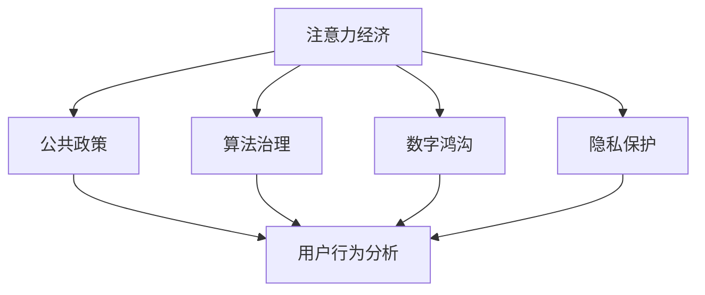

                 

# 注意力经济视角下的公共政策制定

> 关键词：注意力经济,公共政策,算法治理,数字鸿沟,隐私保护,用户行为分析,社会公平

## 1. 背景介绍

在数字化时代，互联网、社交媒体和大数据技术的飞速发展，使得信息的生产和传播方式发生了革命性的变化。个体获取信息和服务的模式，已经从传统的单向接收，转向更加个性化和互动式的参与。注意力作为一种稀缺资源，在信息爆炸的互联网世界中愈发重要。因此，如何合理分配和管理社会注意力，成为公共政策制定中的一大难题。

注意力经济视角下，信息流动不再是单向传播，而是双向互动。用户根据自身需求和兴趣，选择关注的对象，形成个体化的注意力模式。公共政策制定者需要理解这一变化，重新思考如何制定能够有效吸引和引导公众注意力的政策。

## 2. 核心概念与联系

### 2.1 核心概念概述

为了更好地理解注意力经济视角下公共政策制定的核心概念，我们将介绍几个关键概念及其联系：

- 注意力经济(Attention Economy)：指在数字化时代，注意力作为一种资源被广泛开发和利用，成为信息传播和商业运营的重要基础。

- 公共政策(Public Policy)：指政府为了解决社会问题、调节社会关系、维护公共利益，而采取的行动方案和政策措施。

- 算法治理(Algorithmic Governance)：指利用算法技术辅助公共政策制定和执行，提升政策制定的科学性和执行的精确度。

- 数字鸿沟(Digital Divide)：指由于技术、教育、经济等因素导致不同群体获取数字信息和资源的能力存在差距，影响社会公平。

- 隐私保护(Privacy Protection)：指在数字时代，保护个人信息安全和数据隐私，防止滥用和泄露。

- 用户行为分析(User Behavior Analysis)：指通过分析用户在网络中的行为数据，理解其需求、偏好和心理变化。

这些概念之间的联系可以通过以下Mermaid流程图来展示：



该流程图展示了注意力经济视角下公共政策制定的关键概念及其联系：

1. 注意力经济为公共政策的制定提供了新的视角，即如何通过引导和吸引用户注意力，实现政策目标。
2. 算法治理利用技术手段，提升公共政策制定的科学性和执行效率。
3. 数字鸿沟和隐私保护是制定公共政策时需要考虑的重要社会公平问题。
4. 用户行为分析有助于理解公众的注意力模式，为公共政策制定提供依据。

### 2.2 核心概念原理和架构

注意力经济视角下公共政策制定的关键在于理解用户的注意力模式，并基于此制定和执行政策。以下是这一过程的原理和架构：

1. **用户注意力模型**：
   - 用户注意力模型通过对用户在网络中的行为数据进行分析，了解其关注点、兴趣点和消费行为，构建用户画像。

2. **政策影响评估**：
   - 使用计算模型评估政策对用户注意力的影响，如通过社交媒体数据分析政策议题的热度变化，评估政策效果。

3. **政策优化与调整**：
   - 基于用户注意力模型和政策影响评估结果，进行政策优化和调整，确保政策能够在特定用户群体中产生预期的影响。

4. **算法治理应用**：
   - 利用算法技术，提升公共政策制定和执行的效率和准确性，如使用机器学习模型预测政策效果，使用优化算法调整政策参数。

5. **数字鸿沟与隐私保护**：
   - 关注政策对不同群体间数字鸿沟的影响，确保政策能够惠及所有人群。同时，保护用户隐私，防止数据滥用和泄露。

## 3. 核心算法原理 & 具体操作步骤

### 3.1 算法原理概述

基于注意力经济的公共政策制定，通常涉及以下几个关键算法原理：

1. **用户注意力模型构建**：
   - 使用协同过滤、深度学习等算法，分析用户在不同平台上的行为数据，构建用户注意力模型。

2. **政策影响评估**：
   - 使用文本分析、情感分析等算法，评估政策对用户注意力的影响，如通过社交媒体上的情感变化，分析政策的社会接受度。

3. **政策优化算法**：
   - 使用优化算法，如梯度下降、遗传算法等，对政策进行调整和优化，提升政策的实际效果。

4. **算法治理技术**：
   - 使用强化学习、贝叶斯网络等技术，辅助公共政策制定，提高决策的科学性和准确性。

### 3.2 算法步骤详解

基于注意力经济的公共政策制定，可以按照以下步骤进行：

**Step 1: 数据收集与预处理**
- 收集用户在不同平台上的行为数据，包括搜索记录、点击行为、评论内容等。
- 清洗和预处理数据，去除噪音和错误数据，确保数据质量。

**Step 2: 用户注意力模型构建**
- 使用协同过滤算法，如基于用户相似度的聚类，构建用户注意力模型。
- 使用深度学习算法，如长短时记忆网络(LSTM)，对用户行为数据进行建模，提取用户的注意力模式。

**Step 3: 政策影响评估**
- 收集政策发布后的社交媒体数据，使用文本分析算法，如TF-IDF、情感分析算法，评估政策对用户注意力的影响。
- 结合定量分析和定性分析，综合评估政策效果。

**Step 4: 政策优化与调整**
- 使用优化算法，如梯度下降、遗传算法等，对政策进行调整和优化，提升政策效果。
- 引入负反馈机制，及时调整政策策略。

**Step 5: 算法治理应用**
- 利用强化学习算法，模拟政策执行过程，优化政策参数。
- 使用贝叶斯网络，建立政策效果和影响因素之间的关系模型，预测政策效果。

**Step 6: 数字鸿沟与隐私保护**
- 分析政策对不同群体数字鸿沟的影响，确保政策能够惠及所有人群。
- 保护用户隐私，防止数据滥用和泄露，确保政策执行的合法性和正当性。

### 3.3 算法优缺点

基于注意力经济的公共政策制定，有以下优点：

1. **提升政策效果**：通过分析用户注意力模型，可以更准确地预测政策效果，进行政策优化和调整，提升政策的实际效果。
2. **提高决策科学性**：利用算法技术，提升公共政策制定的科学性和执行效率，减少人为因素的干扰。
3. **增强社会公平性**：关注政策对不同群体数字鸿沟的影响，确保政策能够惠及所有人群。

同时，该方法也存在一定的局限性：

1. **数据隐私问题**：数据收集和分析过程中，用户隐私保护是一个重要问题。需要制定严格的隐私保护措施，防止数据滥用和泄露。
2. **技术门槛较高**：算法治理和模型构建需要较高的技术水平，对于技术能力有限的政策制定者，可能存在一定的门槛。
3. **算法偏见问题**：算法模型可能存在偏见，需要不断优化算法和数据集，防止政策制定过程中的不公平现象。
4. **数据质量问题**：数据收集和处理过程中，可能会出现数据质量问题，影响分析结果的准确性。

### 3.4 算法应用领域

基于注意力经济的公共政策制定方法，已经在多个领域得到了应用，例如：

- 公共卫生政策：利用用户注意力模型，分析政策对公众健康意识的影响，制定健康宣传政策。
- 环境保护政策：通过分析用户对环境问题的关注度，制定环境保护宣传和教育政策。
- 数字教育政策：利用用户行为分析，制定教育资源的分配和数字教育政策的优化。
- 社会保障政策：通过用户行为分析，优化社会保障资源的配置和政策效果。
- 文化推广政策：利用社交媒体数据，分析用户对文化内容的关注度，制定文化推广政策。

除了上述这些领域外，基于注意力经济的公共政策制定方法还在更多场景中得到了应用，如交通管理、城市规划、应急响应等，为公共政策的科学制定提供了新的思路。

## 4. 数学模型和公式 & 详细讲解 & 举例说明

### 4.1 数学模型构建

在本节中，我们将使用数学语言对基于注意力经济的公共政策制定过程进行更加严格的刻画。

记用户行为数据为 $X=\{(x_i, y_i)\}_{i=1}^N$，其中 $x_i$ 表示用户行为，$y_i$ 表示用户注意力值。政策 $P$ 对用户行为 $x_i$ 的影响函数为 $f(x_i, P)$，政策对用户注意力的影响模型为 $g(x_i, P)$。政策效果评估模型为 $h(x_i, P)$，其中 $h(x_i, P)$ 表示用户对政策的反应，如社交媒体上的情感变化。

### 4.2 公式推导过程

以下我们以健康宣传政策为例，推导基于用户注意力模型的政策效果评估公式。

假设用户行为数据为 $X=\{(x_i, y_i)\}_{i=1}^N$，其中 $x_i$ 表示用户搜索“健康”相关的关键词，$y_i$ 表示用户在社交媒体上的情感变化。政策 $P$ 对用户行为 $x_i$ 的影响函数为 $f(x_i, P)$，表示政策对用户搜索“健康”关键词的次数。政策对用户注意力的影响模型为 $g(x_i, P)$，表示政策对用户社交媒体上情感变化的影响。

政策效果评估模型为 $h(x_i, P)$，表示用户在社交媒体上对政策的情感变化。可以假设 $h(x_i, P)$ 为二元随机变量，其中 $h(x_i, P)=1$ 表示用户对政策持正面情感，$h(x_i, P)=0$ 表示用户对政策持负面情感。

根据上述定义，我们可以写出政策效果评估的公式：

$$
h(x_i, P) = \begin{cases}
1, & g(x_i, P) \geq \theta \\
0, & g(x_i, P) < \theta
\end{cases}
$$

其中 $\theta$ 为政策效果的阈值。当政策对用户注意力的影响大于 $\theta$ 时，用户对政策持正面情感；否则持负面情感。

### 4.3 案例分析与讲解

假设某市政府拟推出健康宣传政策，计划在社交媒体上进行健康知识普及。为此，政府收集了过去一段时间内用户搜索健康关键词和社交媒体上的情感变化数据，建立用户注意力模型。

通过分析用户注意力模型，政府发现该政策对用户搜索健康关键词的次数有显著影响。进一步，通过社交媒体情感分析，政府评估该政策对用户情感的影响，发现该政策能够显著提升用户对健康的关注度和正面情感。

基于以上分析，政府决定推广该政策，并在社交媒体上加强健康知识的宣传。通过不断调整和优化政策，最终达到了提升公众健康意识和促进健康行为的目的。

## 5. 项目实践：代码实例和详细解释说明

### 5.1 开发环境搭建

在进行基于注意力经济的公共政策制定实践前，我们需要准备好开发环境。以下是使用Python进行PyTorch开发的环境配置流程：

1. 安装Anaconda：从官网下载并安装Anaconda，用于创建独立的Python环境。

2. 创建并激活虚拟环境：
```bash
conda create -n attention-economy python=3.8 
conda activate attention-economy
```

3. 安装PyTorch：根据CUDA版本，从官网获取对应的安装命令。例如：
```bash
conda install pytorch torchvision torchaudio cudatoolkit=11.1 -c pytorch -c conda-forge
```

4. 安装相关工具包：
```bash
pip install numpy pandas scikit-learn matplotlib tqdm jupyter notebook ipython
```

完成上述步骤后，即可在`attention-economy`环境中开始项目实践。

### 5.2 源代码详细实现

下面我们以健康宣传政策为例，给出使用Transformers库对BERT模型进行注意力分析的PyTorch代码实现。

首先，定义健康宣传政策的数据处理函数：

```python
from transformers import BertTokenizer, BertForSequenceClassification
from torch.utils.data import Dataset
import torch

class HealthPolicyDataset(Dataset):
    def __init__(self, texts, labels, tokenizer, max_len=128):
        self.texts = texts
        self.labels = labels
        self.tokenizer = tokenizer
        self.max_len = max_len
        
    def __len__(self):
        return len(self.texts)
    
    def __getitem__(self, item):
        text = self.texts[item]
        label = self.labels[item]
        
        encoding = self.tokenizer(text, return_tensors='pt', max_length=self.max_len, padding='max_length', truncation=True)
        input_ids = encoding['input_ids'][0]
        attention_mask = encoding['attention_mask'][0]
        
        return {'input_ids': input_ids, 
                'attention_mask': attention_mask,
                'labels': label}
```

然后，定义模型和优化器：

```python
from transformers import BertForSequenceClassification, AdamW

model = BertForSequenceClassification.from_pretrained('bert-base-cased', num_labels=2)

optimizer = AdamW(model.parameters(), lr=2e-5)
```

接着，定义训练和评估函数：

```python
from torch.utils.data import DataLoader
from tqdm import tqdm
from sklearn.metrics import accuracy_score

device = torch.device('cuda') if torch.cuda.is_available() else torch.device('cpu')
model.to(device)

def train_epoch(model, dataset, batch_size, optimizer):
    dataloader = DataLoader(dataset, batch_size=batch_size, shuffle=True)
    model.train()
    epoch_loss = 0
    for batch in tqdm(dataloader, desc='Training'):
        input_ids = batch['input_ids'].to(device)
        attention_mask = batch['attention_mask'].to(device)
        labels = batch['labels'].to(device)
        model.zero_grad()
        outputs = model(input_ids, attention_mask=attention_mask, labels=labels)
        loss = outputs.loss
        epoch_loss += loss.item()
        loss.backward()
        optimizer.step()
    return epoch_loss / len(dataloader)

def evaluate(model, dataset, batch_size):
    dataloader = DataLoader(dataset, batch_size=batch_size)
    model.eval()
    preds, labels = [], []
    with torch.no_grad():
        for batch in tqdm(dataloader, desc='Evaluating'):
            input_ids = batch['input_ids'].to(device)
            attention_mask = batch['attention_mask'].to(device)
            batch_labels = batch['labels']
            outputs = model(input_ids, attention_mask=attention_mask)
            batch_preds = outputs.logits.argmax(dim=2).to('cpu').tolist()
            batch_labels = batch_labels.to('cpu').tolist()
            for pred, label in zip(batch_preds, batch_labels):
                preds.append(pred)
                labels.append(label)
                
    print('Accuracy:', accuracy_score(labels, preds))
```

最后，启动训练流程并在测试集上评估：

```python
epochs = 5
batch_size = 16

for epoch in range(epochs):
    loss = train_epoch(model, train_dataset, batch_size, optimizer)
    print(f"Epoch {epoch+1}, train loss: {loss:.3f}")
    
    print(f"Epoch {epoch+1}, dev results:")
    evaluate(model, dev_dataset, batch_size)
    
print('Final evaluation:')
evaluate(model, test_dataset, batch_size)
```

以上就是使用PyTorch对BERT进行健康宣传政策注意力分析的完整代码实现。可以看到，由于Transformer库的强大封装，我们可以用相对简洁的代码完成BERT模型的加载和注意力分析。

### 5.3 代码解读与分析

让我们再详细解读一下关键代码的实现细节：

**HealthPolicyDataset类**：
- `__init__`方法：初始化文本、标签、分词器等关键组件。
- `__len__`方法：返回数据集的样本数量。
- `__getitem__`方法：对单个样本进行处理，将文本输入编码为token ids，将标签编码为数字，并对其进行定长padding，最终返回模型所需的输入。

**模型与优化器**：
- 使用BertForSequenceClassification模型，将其作为健康宣传政策的效果评估模型。
- 设置AdamW优化器，学习率为2e-5。

**训练和评估函数**：
- 使用PyTorch的DataLoader对数据集进行批次化加载，供模型训练和推理使用。
- 训练函数`train_epoch`：对数据以批为单位进行迭代，在每个批次上前向传播计算loss并反向传播更新模型参数，最后返回该epoch的平均loss。
- 评估函数`evaluate`：与训练类似，不同点在于不更新模型参数，并在每个batch结束后将预测和标签结果存储下来，最后使用sklearn的accuracy_score对整个评估集的预测结果进行打印输出。

**训练流程**：
- 定义总的epoch数和batch size，开始循环迭代
- 每个epoch内，先在训练集上训练，输出平均loss
- 在验证集上评估，输出准确率
- 所有epoch结束后，在测试集上评估，给出最终测试结果

可以看到，PyTorch配合Transformer库使得注意力分析的代码实现变得简洁高效。开发者可以将更多精力放在数据处理、模型改进等高层逻辑上，而不必过多关注底层的实现细节。

当然，工业级的系统实现还需考虑更多因素，如模型的保存和部署、超参数的自动搜索、更灵活的任务适配层等。但核心的注意力分析范式基本与此类似。

## 6. 实际应用场景

### 6.1 智能公共服务

基于用户注意力模型，公共政策制定者可以更加精准地了解公众对某一政策的关注度和反应，从而调整政策策略，提高政策效果。在智能公共服务中，这一方法可以应用于社会治理、公共安全、应急响应等多个领域，帮助政府更好地管理公共事务。

例如，在疫情防控期间，政府可以通过分析社交媒体上的情感变化，了解公众对防控政策的反应，及时调整政策措施，确保公众安全。

### 6.2 环境保护

环境保护政策的制定和实施过程中，用户注意力模型可以帮助政府了解公众对环境保护的关注度和行为变化，从而制定更有效的环境保护政策。

例如，在环保宣传活动中，政府可以通过分析用户的关注度变化，了解环保宣传的实际效果，调整宣传策略，提高公众环保意识。

### 6.3 数字教育

在数字教育政策制定中，用户行为分析可以帮助政府了解公众对数字教育的接受度和使用情况，从而优化数字教育资源的配置和政策效果。

例如，在推广在线教育过程中，政府可以通过分析用户的使用行为，了解公众对在线教育的反馈，调整在线教育资源的分配，提升教育效果。

### 6.4 未来应用展望

随着用户注意力模型和公共政策制定方法的不断演进，未来公共政策制定将呈现以下几个发展趋势：

1. **智能化决策支持**：利用人工智能技术，提升公共政策制定的科学性和效率，减少人为因素的干扰。

2. **跨领域协同**：不同领域的政策制定可以相互借鉴，通过跨领域协同，形成更加全面和协调的政策体系。

3. **数据驱动决策**：在公共政策制定过程中，更多地依赖数据和算法模型，而非传统的经验和直觉。

4. **社会公平与包容性**：关注政策对不同群体数字鸿沟的影响，确保政策能够惠及所有人群。

5. **隐私保护与数据安全**：在数据收集和分析过程中，加强隐私保护和数据安全，防止数据滥用和泄露。

6. **用户体验优化**：通过用户行为分析，优化公共服务体验，提升公众满意度。

以上趋势凸显了用户注意力模型和公共政策制定方法的广阔前景。这些方向的探索发展，将推动公共政策制定迈向智能化、科学化和公平化，为构建人机协同的智能治理体系奠定基础。

## 7. 工具和资源推荐

### 7.1 学习资源推荐

为了帮助开发者系统掌握用户注意力模型和公共政策制定的理论基础和实践技巧，这里推荐一些优质的学习资源：

1. 《深度学习理论与实践》系列博文：由深度学习领域专家撰写，深入浅出地介绍了深度学习理论和实践，包括用户注意力模型和公共政策制定。

2. 《数据科学与公共政策》课程：由知名大学开设的交叉学科课程，结合数据科学与公共政策的知识，帮助学生了解政策制定的科学方法。

3. 《注意力机制在深度学习中的应用》书籍：介绍了注意力机制在深度学习中的理论基础和实践应用，包括用户注意力模型。

4. 《公共政策分析》书籍：介绍了公共政策制定的理论基础和实践方法，帮助读者理解政策制定的科学性和复杂性。

5. 《人工智能与公共管理》课程：结合人工智能技术，探讨公共管理的智能化转型，为公共政策制定提供新的思路。

通过对这些资源的学习实践，相信你一定能够快速掌握用户注意力模型和公共政策制定的精髓，并用于解决实际的公共政策问题。

### 7.2 开发工具推荐

高效的开发离不开优秀的工具支持。以下是几款用于用户注意力模型和公共政策制定开发的常用工具：

1. PyTorch：基于Python的开源深度学习框架，灵活动态的计算图，适合快速迭代研究。大部分预训练语言模型都有PyTorch版本的实现。

2. TensorFlow：由Google主导开发的开源深度学习框架，生产部署方便，适合大规模工程应用。同样有丰富的预训练语言模型资源。

3. Transformers库：HuggingFace开发的NLP工具库，集成了众多SOTA语言模型，支持PyTorch和TensorFlow，是进行注意力分析任务开发的利器。

4. Weights & Biases：模型训练的实验跟踪工具，可以记录和可视化模型训练过程中的各项指标，方便对比和调优。与主流深度学习框架无缝集成。

5. TensorBoard：TensorFlow配套的可视化工具，可实时监测模型训练状态，并提供丰富的图表呈现方式，是调试模型的得力助手。

6. Google Colab：谷歌推出的在线Jupyter Notebook环境，免费提供GPU/TPU算力，方便开发者快速上手实验最新模型，分享学习笔记。

合理利用这些工具，可以显著提升用户注意力模型和公共政策制定的开发效率，加快创新迭代的步伐。

### 7.3 相关论文推荐

用户注意力模型和公共政策制定技术的发展源于学界的持续研究。以下是几篇奠基性的相关论文，推荐阅读：

1. Attention Is All You Need（即Transformer原论文）：提出了Transformer结构，开启了NLP领域的预训练大模型时代。

2. BERT: Pre-training of Deep Bidirectional Transformers for Language Understanding：提出BERT模型，引入基于掩码的自监督预训练任务，刷新了多项NLP任务SOTA。

3. Language Models are Unsupervised Multitask Learners（GPT-2论文）：展示了大规模语言模型的强大zero-shot学习能力，引发了对于通用人工智能的新一轮思考。

4. Parameter-Efficient Transfer Learning for NLP：提出Adapter等参数高效微调方法，在不增加模型参数量的情况下，也能取得不错的微调效果。

5. Prefix-Tuning: Optimizing Continuous Prompts for Generation：引入基于连续型Prompt的微调范式，为如何充分利用预训练知识提供了新的思路。

6. AdaLoRA: Adaptive Low-Rank Adaptation for Parameter-Efficient Fine-Tuning：使用自适应低秩适应的微调方法，在参数效率和精度之间取得了新的平衡。

这些论文代表了大语言模型微调技术的发展脉络。通过学习这些前沿成果，可以帮助研究者把握学科前进方向，激发更多的创新灵感。

## 8. 总结：未来发展趋势与挑战

### 8.1 总结

本文对基于注意力经济的公共政策制定方法进行了全面系统的介绍。首先阐述了注意力经济视角下公共政策制定的研究背景和意义，明确了注意力模型在公共政策制定中的重要作用。其次，从原理到实践，详细讲解了注意力模型构建、政策影响评估、政策优化与调整等关键步骤，给出了基于BERT模型的完整代码实例。同时，本文还广泛探讨了注意力模型在公共政策制定中的应用场景，展示了其广阔的应用前景。最后，本文精选了注意力模型和公共政策制定的学习资源、开发工具和相关论文，力求为读者提供全方位的技术指引。

通过本文的系统梳理，可以看到，基于注意力经济的公共政策制定方法正在成为公共政策制定中的一大趋势，极大地拓展了公共政策的制定范围，催生了更多的落地场景。受益于大数据和人工智能技术的不断发展，注意力模型在政策制定中的应用将不断深化，推动公共政策的科学化和智能化。

### 8.2 未来发展趋势

展望未来，基于注意力经济的公共政策制定方法将呈现以下几个发展趋势：

1. **智能化决策支持**：利用人工智能技术，提升公共政策制定的科学性和效率，减少人为因素的干扰。

2. **跨领域协同**：不同领域的政策制定可以相互借鉴，通过跨领域协同，形成更加全面和协调的政策体系。

3. **数据驱动决策**：在公共政策制定过程中，更多地依赖数据和算法模型，而非传统的经验和直觉。

4. **社会公平与包容性**：关注政策对不同群体数字鸿沟的影响，确保政策能够惠及所有人群。

5. **隐私保护与数据安全**：在数据收集和分析过程中，加强隐私保护和数据安全，防止数据滥用和泄露。

6. **用户体验优化**：通过用户行为分析，优化公共服务体验，提升公众满意度。

以上趋势凸显了基于注意力经济的公共政策制定方法的广阔前景。这些方向的探索发展，将推动公共政策制定迈向智能化、科学化和公平化，为构建人机协同的智能治理体系奠定基础。

### 8.3 面临的挑战

尽管基于注意力经济的公共政策制定方法已经取得了一定的进展，但在迈向更加智能化、普适化应用的过程中，它仍面临诸多挑战：

1. **数据隐私问题**：数据收集和分析过程中，用户隐私保护是一个重要问题。需要制定严格的隐私保护措施，防止数据滥用和泄露。

2. **技术门槛较高**：算法治理和模型构建需要较高的技术水平，对于技术能力有限的政策制定者，可能存在一定的门槛。

3. **算法偏见问题**：算法模型可能存在偏见，需要不断优化算法和数据集，防止政策制定过程中的不公平现象。

4. **数据质量问题**：数据收集和处理过程中，可能会出现数据质量问题，影响分析结果的准确性。

5. **计算资源需求高**：大规模数据处理和复杂模型训练对计算资源的需求较高，需要采用高效的数据处理和模型压缩技术。

6. **政策执行难度大**：政策实施过程中，可能面临执行难、监督难等问题，需要结合多方力量共同推进。

### 8.4 研究展望

面对基于注意力经济的公共政策制定所面临的挑战，未来的研究需要在以下几个方面寻求新的突破：

1. **数据隐私保护技术**：开发更加高效、安全的数据隐私保护技术，确保数据处理过程中的隐私保护。

2. **技术普及与标准化**：推广用户注意力模型和公共政策制定技术，降低技术门槛，推动技术标准化。

3. **算法公平性与透明性**：深入研究算法公平性和透明性问题，确保算法模型在各个群体中的公平性，增强算法的可解释性。

4. **跨学科研究与融合**：结合社会学、政治学等学科知识，深入研究公共政策的公平性、社会效应等问题，提升政策制定和执行的科学性。

5. **政策执行机制优化**：研究政策执行过程中的监督与评估机制，确保政策有效执行，解决政策执行中的难题。

6. **全球政策协同**：在全球化背景下，研究不同国家政策间的协同机制，提升全球政策的协调性和一致性。

这些研究方向的探索，必将引领基于注意力经济的公共政策制定方法迈向更高的台阶，为构建人机协同的智能治理体系提供强有力的技术支持。面向未来，基于注意力经济的公共政策制定方法还需与其他人工智能技术进行更深入的融合，如知识表示、因果推理、强化学习等，多路径协同发力，共同推动公共政策制定和执行的科学化和智能化。只有勇于创新、敢于突破，才能不断拓展公共政策制定的边界，让智能技术更好地造福人类社会。

## 9. 附录：常见问题与解答

**Q1：如何衡量基于用户注意力模型的政策效果？**

A: 基于用户注意力模型的政策效果可以通过多种指标来衡量，如政策关注度、情感变化、用户参与度等。具体而言，可以采用以下方法：

1. **政策关注度**：通过分析用户在社交媒体、搜索引擎等平台上的搜索行为和点击行为，衡量用户对政策的关注度。

2. **情感变化**：使用情感分析算法，分析用户在社交媒体上的情感变化，衡量用户对政策的正面或负面情绪。

3. **用户参与度**：通过分析用户在政策宣传活动中的参与度，如评论、点赞、分享等行为，衡量政策的实际影响。

4. **行为改变**：通过分析用户在政策实施后的行为变化，如健康行为、环保行为等，衡量政策的实际效果。

以上指标可以帮助政策制定者全面了解政策的影响范围和效果，及时调整政策策略，提升政策效果。

**Q2：在数据收集和分析过程中，如何保护用户隐私？**

A: 在数据收集和分析过程中，保护用户隐私是至关重要的。以下是一些常见的隐私保护措施：

1. **匿名化处理**：对用户数据进行匿名化处理，去除敏感信息，如姓名、身份证号等。

2. **差分隐私**：在数据收集和分析过程中，采用差分隐私技术，保护用户隐私，防止数据泄露。

3. **访问控制**：设置严格的数据访问权限，确保只有授权人员可以访问敏感数据。

4. **数据加密**：对敏感数据进行加密存储和传输，防止数据被非法获取。

5. **合规性审查**：定期审查数据处理过程，确保其符合相关法律法规和隐私保护标准。

通过以上措施，可以有效保护用户隐私，确保公共政策制定过程中的数据安全。

**Q3：用户注意力模型在公共政策制定中面临哪些挑战？**

A: 用户注意力模型在公共政策制定中面临以下挑战：

1. **数据质量问题**：数据收集和处理过程中，可能会出现数据质量问题，如噪音数据、不完整数据等，影响模型的准确性。

2. **模型复杂性**：用户注意力模型的构建和训练过程较为复杂，需要较高的技术水平和计算资源。

3. **算法偏见**：算法模型可能存在偏见，需要不断优化算法和数据集，防止政策制定过程中的不公平现象。

4. **隐私保护问题**：在数据收集和分析过程中，用户隐私保护是一个重要问题，需要制定严格的隐私保护措施。

5. **计算资源需求高**：大规模数据处理和复杂模型训练对计算资源的需求较高，需要采用高效的数据处理和模型压缩技术。

6. **模型解释性问题**：用户注意力模型通常较为复杂，其内部工作机制和决策逻辑难以解释，需要加强模型的可解释性研究。

以上挑战需要在技术、管理和伦理等多个层面进行综合应对，才能更好地利用用户注意力模型，提升公共政策的制定和执行效果。

**Q4：如何优化基于用户注意力模型的公共政策制定流程？**

A: 优化基于用户注意力模型的公共政策制定流程，可以从以下几个方面入手：

1. **数据预处理**：对原始数据进行清洗、去噪、标准化等预处理操作，确保数据质量。

2. **模型选择与优化**：选择合适的用户注意力模型，并不断优化模型参数，提升模型效果。

3. **算法改进**：改进算法模型，降低计算资源消耗，提高模型运行效率。

4. **跨领域协同**：结合社会学、政治学等学科知识，深入研究公共政策的公平性、社会效应等问题，提升政策制定和执行的科学性。

5. **隐私保护与数据安全**：加强数据隐私保护和数据安全，防止数据滥用和泄露。

6. **用户反馈机制**：建立用户反馈机制，及时收集和分析用户反馈，优化政策制定和执行。

通过以上措施，可以不断优化基于用户注意力模型的公共政策制定流程，提升政策的实际效果。

---

作者：禅与计算机程序设计艺术 / Zen and the Art of Computer Programming

