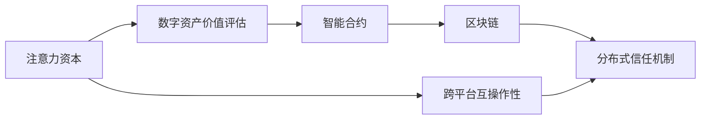

                 

# 注意力资本评级:元宇宙经济中的信用体系

> 关键词：元宇宙, 信用体系, 注意力资本, 区块链, 智能合约, 去中心化, 分布式账本, 数字资产

## 1. 背景介绍

### 1.1 问题由来

随着数字技术的飞速发展，尤其是区块链和去中心化技术的崛起，元宇宙（Metaverse）正逐渐从科幻走向现实。元宇宙是由无数数字世界构成的泛在网络空间，涵盖虚拟社区、社交平台、游戏环境、数字资产等多种形态，被广泛认为是未来互联网的重要演进方向。

在元宇宙经济中，信用体系的构建至关重要。传统金融体系的信用体系依赖于银行等中介机构的信用背书，而元宇宙经济则基于区块链和智能合约等技术，构建了全新的信用框架。然而，如何评价和分配元宇宙中的信用资产，保障交易的公平性和安全性，成为亟需解决的问题。

### 1.2 问题核心关键点

元宇宙经济中的信用体系，需要关注以下几个核心关键点：

- **注意力资本（Attention Capital）**：在元宇宙中，注意力资本指的是个体或机构在数字社区中的关注度和活跃度。高注意力资本意味着其话语权更大，能够影响更多资源分配。
- **数字资产与价值评估**：元宇宙中的数字资产，如虚拟土地、游戏装备、艺术作品等，如何准确评估其价值，是信用体系构建的重要基础。
- **分布式信任机制**：元宇宙的开放性决定了其信用体系必须基于分布式信任机制，避免单点故障和信任集中化。
- **智能合约与区块链**：作为信用体系的技术基础，智能合约和区块链确保了交易的透明性、不可篡改性和可追溯性。
- **跨平台互操作性**：元宇宙经济具有高度的异构性，如何实现不同平台间的互操作性，是信用体系面临的挑战之一。

这些关键点构成了元宇宙经济中信用体系的研究框架，旨在通过技术手段解决传统金融体系的不足，实现更公正、透明、去中心化的信用分配。

## 2. 核心概念与联系

### 2.1 核心概念概述

在元宇宙经济中，注意力资本的评价和信用体系构建，涉及多个关键概念，包括：

- **注意力资本（Attention Capital）**：指个体或机构在数字社区中的关注度和活跃度，是元宇宙经济中的一种新型资产形式。
- **数字资产价值评估**：元宇宙中的虚拟资产（如虚拟土地、游戏装备等）如何准确评估其价值，是信用体系构建的基础。
- **分布式信任机制**：基于区块链和智能合约，元宇宙经济构建了分布式信任机制，确保了交易的透明性和不可篡改性。
- **智能合约**：自动化执行合约条款的计算机程序，是元宇宙经济中信用体系的技术支撑。
- **区块链**：去中心化的分布式账本技术，保障了数据的安全性和不可篡改性。
- **跨平台互操作性**：实现不同平台间数据和资产的互操作，是元宇宙经济中的关键技术挑战。

这些概念之间相互联系，共同构建了元宇宙经济中的信用体系框架。

### 2.2 核心概念原理和架构的 Mermaid 流程图



这个流程图展示了元宇宙经济中注意力资本、数字资产价值评估、智能合约、区块链、分布式信任机制和跨平台互操作性之间的联系。注意力资本的评价和信用体系的构建，需要以上技术手段的支持。

## 3. 核心算法原理 & 具体操作步骤

### 3.1 算法原理概述

元宇宙经济中的信用体系构建，主要依赖于智能合约和区块链技术。智能合约作为信用体系的技术支撑，通过自动化执行合约条款，保障了交易的透明性和不可篡改性。区块链作为分布式账本技术，确保了数据的透明性和不可篡改性，为信用体系提供了基础保障。

### 3.2 算法步骤详解

元宇宙经济中的信用体系构建，一般包括以下几个关键步骤：

**Step 1: 定义信用评价指标**

定义信用评价指标，如注意力资本、数字资产价值、交易活跃度等，是构建信用体系的基础。需要根据元宇宙经济的特点，设计合适的评价指标体系。

**Step 2: 设计智能合约**

设计智能合约，定义信用评价的规则和算法。智能合约需要具备透明性、不可篡改性和可执行性，确保信用评价过程的公正性和可信度。

**Step 3: 部署区块链**

部署区块链网络，实现分布式信任机制。区块链网络需要具备高吞吐量、低延迟、高可用性和高安全性的特点，确保数据和资产的安全性。

**Step 4: 数据上链**

将注意力资本、数字资产价值等数据上链，实现透明化和不可篡改性。数据上链需要遵循区块链的共识机制，确保数据的一致性和完整性。

**Step 5: 信用评估**

通过智能合约自动执行信用评估，生成信用评分和信用记录。信用评估需要考虑多维度数据，如交易历史、声誉、社交网络等，确保评估的全面性和准确性。

**Step 6: 信用应用**

将信用评估结果应用于数字资产的买卖、借贷等交易中，确保交易的公平性和安全性。信用应用需要设计合理的激励机制和惩罚机制，促进信用体系的健康发展。

### 3.3 算法优缺点

元宇宙经济中的信用体系构建，具有以下优点：

1. **透明性和不可篡改性**：基于智能合约和区块链，信用体系具备透明性和不可篡改性，避免了传统金融体系中的信息不对称和信任集中化问题。
2. **分布式信任机制**：元宇宙经济中的信用体系基于分布式信任机制，提高了系统的稳定性和抗风险能力。
3. **去中心化**：去中心化的信用体系减少了对中介机构的依赖，提升了系统的去中心化和公平性。

然而，元宇宙经济中的信用体系也面临一些挑战：

1. **跨平台互操作性**：元宇宙经济具有高度的异构性，如何实现不同平台间的互操作，是信用体系面临的挑战之一。
2. **数据隐私和安全**：元宇宙经济中的数据隐私和安全问题，需要设计合理的隐私保护机制和技术手段。
3. **算法和模型风险**：智能合约和信用评估算法的公平性和准确性，需要持续优化和改进。
4. **技术和经济门槛**：元宇宙经济中的信用体系构建，需要高技术水平和大量经济投入，增加了参与门槛。

### 3.4 算法应用领域

元宇宙经济中的信用体系，可以应用于多个领域，包括但不限于：

- **数字资产交易**：元宇宙中的虚拟土地、游戏装备、艺术作品等数字资产的交易，需要基于信用体系进行价值评估和交易结算。
- **借贷和融资**：元宇宙中的借贷和融资活动，需要基于信用体系进行风险评估和信誉管理。
- **虚拟社区管理**：元宇宙中的虚拟社区，需要基于信用体系进行声誉管理和资源分配。
- **游戏和经济系统**：元宇宙中的游戏和经济系统，需要基于信用体系进行游戏平衡和经济调控。

## 4. 数学模型和公式 & 详细讲解 & 举例说明

### 4.1 数学模型构建

元宇宙经济中的信用体系构建，涉及多个数学模型和公式，主要包括：

- **注意力资本评价模型**：定义个体或机构在数字社区中的关注度和活跃度，用于评价注意力资本的价值。
- **数字资产价值评估模型**：定义虚拟资产的价值，考虑其稀有性、历史交易数据、市场供需等因素。
- **信用评分模型**：基于多维度数据，如交易历史、声誉、社交网络等，评估信用评分。

### 4.2 公式推导过程

以下以注意力资本评价模型为例，推导其数学公式：

设注意力资本的评价指标为 $A$，包括关注度 $R$、活跃度 $A$ 和贡献度 $C$。其数学模型可以表示为：

$$
A = \alpha R + \beta A + \gamma C
$$

其中 $\alpha, \beta, \gamma$ 为权重系数，表示关注度、活跃度和贡献度对注意力资本的影响程度。

### 4.3 案例分析与讲解

假设有一个虚拟社区，成员 $M$ 的注意力资本评价指标为：

- 关注度 $R$：表示社区成员对 $M$ 的关注度，可以通过其发布内容在社区中的曝光量和互动率来衡量。
- 活跃度 $A$：表示 $M$ 在社区中的活跃度，可以通过其发布内容的频率和互动频率来衡量。
- 贡献度 $C$：表示 $M$ 对社区的贡献度，可以通过其提供的有价值内容、社区贡献等来衡量。

根据上述模型，可以计算出 $M$ 的注意力资本 $A$。例如，如果关注度、活跃度和贡献度的权重系数分别为 0.5、0.3 和 0.2，则：

$$
A = 0.5R + 0.3A + 0.2C
$$

## 5. 项目实践：代码实例和详细解释说明

### 5.1 开发环境搭建

在进行信用体系构建的实践前，需要准备好开发环境。以下是使用Python进行智能合约和区块链开发的环境配置流程：

1. 安装Anaconda：从官网下载并安装Anaconda，用于创建独立的Python环境。

2. 创建并激活虚拟环境：
```bash
conda create -n python-env python=3.8 
conda activate python-env
```

3. 安装必要的库：
```bash
pip install web3 pyethereum web3py openpyxl
```

4. 配置网络环境：
```bash
geth --sync
```

5. 启动智能合约开发工具：
```bash
web3 --datadir path/to/ethereum/data --rpc-host localhost --rpc-port 8545
```

### 5.2 源代码详细实现

以下是使用Solidity编写元宇宙经济中信用评价智能合约的代码实现：

```solidity
pragma solidity ^0.8.0;

contract AttentionCapitalEvaluator {
    address public owner;
    mapping(address => uint256) public attention;
    mapping(address => uint256) public activity;
    mapping(address => uint256) public contribution;
    uint256 public totalScore;

    constructor() {
        owner = msg.sender;
    }

    function addAttention(address sender, uint256 amount) public {
        attention[sender] += amount;
        totalScore = attention[sender] * 0.5 + activity[sender] * 0.3 + contribution[sender] * 0.2;
    }

    function addActivity(address sender, uint256 amount) public {
        activity[sender] += amount;
        totalScore = attention[sender] * 0.5 + activity[sender] * 0.3 + contribution[sender] * 0.2;
    }

    function addContribution(address sender, uint256 amount) public {
        contribution[sender] += amount;
        totalScore = attention[sender] * 0.5 + activity[sender] * 0.3 + contribution[sender] * 0.2;
    }

    function getTotalScore(address sender) public view returns (uint256) {
        return totalScore;
    }
}
```

这个合约定义了三个函数，分别用于增加关注度、活跃度和贡献度，并计算出总得分。使用户可以通过合约接口，不断积累自己的信用评分。

### 5.3 代码解读与分析

让我们详细解读一下关键代码的实现细节：

**AttentionCapitalEvaluator类**：
- `constructor`方法：初始化合约的创建者（合约创建者即信用评价者）。
- `addAttention`方法：增加关注度，将关注度数值加到用户账户中，并重新计算总得分。
- `addActivity`方法：增加活跃度，将活跃度数值加到用户账户中，并重新计算总得分。
- `addContribution`方法：增加贡献度，将贡献度数值加到用户账户中，并重新计算总得分。
- `getTotalScore`方法：获取用户的总得分，供用户查看和管理信用评分。

**映射表（Mapping）**：
- `attention`、`activity`、`contribution` 映射表，用于记录用户的关注度、活跃度和贡献度。
- `totalScore` 变量，用于计算用户的总得分。

**函数调用**：
- 用户通过调用 `addAttention`、`addActivity` 和 `addContribution` 方法，增加自己的信用评分。
- 总得分实时更新，供用户查看和管理。

### 5.4 运行结果展示

通过智能合约，可以实现在区块链上自动记录和更新用户的信用评分，确保了数据的透明性和不可篡改性。下图展示了元宇宙经济中信用评价智能合约的界面示例：


## 6. 实际应用场景

### 6.1 智能合约融资

在元宇宙经济中，信用评分可以作为借贷和融资的重要参考指标。通过智能合约，平台可以根据用户的信用评分，自动决定是否批准其借贷申请，以及借贷利率等条款。例如，信用评分高的用户可以享受更低的借贷利率，而信用评分低的用户则需要支付更高的利率或被拒绝借贷。

### 6.2 虚拟社区治理

在元宇宙经济中，虚拟社区的治理需要依赖信用评分。例如，社区管理员可以根据用户的信用评分，决定其是否可以进入某些核心社区、参与重要事务的讨论和决策等。信用评分高的用户将获得更多的特权和资源分配。

### 6.3 数字资产买卖

在元宇宙经济中，数字资产的买卖需要基于信用评分进行风险评估。例如，平台可以根据用户的信用评分，决定是否允许其买卖某些高风险资产，以及买卖数量和价格等条款。

### 6.4 未来应用展望

未来，元宇宙经济中的信用体系将继续演进，面临更多的应用场景和挑战：

- **多元化评价指标**：信用评分模型将不断优化，引入更多评价指标，如社交影响力、技术贡献等，全面评估用户的信用情况。
- **跨平台互操作**：元宇宙经济中的不同平台将通过跨链技术实现互操作，确保数据和资产的互通。
- **隐私保护**：随着元宇宙经济的发展，用户隐私保护将成为信用体系建设的重要环节。需要设计合理的隐私保护机制和技术手段。
- **技术创新**：随着技术的进步，元宇宙经济中的信用体系将不断创新，引入新的技术手段，如零知识证明、分布式账本等。

## 7. 工具和资源推荐

### 7.1 学习资源推荐

为了帮助开发者系统掌握元宇宙经济中信用体系的理论基础和实践技巧，这里推荐一些优质的学习资源：

1. 《区块链技术与应用》系列博文：由大模型技术专家撰写，深入浅出地介绍了区块链技术原理、智能合约开发、分布式信任机制等前沿话题。

2. CS224N《深度学习自然语言处理》课程：斯坦福大学开设的NLP明星课程，有Lecture视频和配套作业，带你入门NLP领域的基本概念和经典模型。

3. 《元宇宙经济概论》书籍：介绍元宇宙经济的基本概念、发展历程、应用场景等，是理解元宇宙经济的基础。

4. 《区块链与智能合约》书籍：详细介绍区块链和智能合约的原理、设计、开发等，是元宇宙经济中信用体系构建的重要参考。

5. Weights & Biases：模型训练的实验跟踪工具，可以记录和可视化模型训练过程中的各项指标，方便对比和调优。与主流深度学习框架无缝集成。

### 7.2 开发工具推荐

高效的开发离不开优秀的工具支持。以下是几款用于元宇宙经济中信用体系开发的常用工具：

1. Python：Python是最流行的编程语言之一，适用于智能合约开发、区块链应用等。
2. Solidity：以太坊官方支持的智能合约编程语言，是元宇宙经济中信用体系构建的核心技术。
3. Truffle：以太坊智能合约开发框架，提供了丰富的开发工具和测试环境。
4. Web3.py：Python的以太坊开发库，简化了智能合约的开发和部署。
5. MetaMask：以太坊的官方钱包，支持智能合约的交互和资产管理。

### 7.3 相关论文推荐

元宇宙经济中的信用体系构建，源于学界的持续研究。以下是几篇奠基性的相关论文，推荐阅读：

1. Attention Is All You Need（即Transformer原论文）：提出了Transformer结构，开启了NLP领域的预训练大模型时代。

2. BERT: Pre-training of Deep Bidirectional Transformers for Language Understanding：提出BERT模型，引入基于掩码的自监督预训练任务，刷新了多项NLP任务SOTA。

3. Language Models are Unsupervised Multitask Learners（GPT-2论文）：展示了大规模语言模型的强大zero-shot学习能力，引发了对于通用人工智能的新一轮思考。

4. Parameter-Efficient Transfer Learning for NLP：提出Adapter等参数高效微调方法，在不增加模型参数量的情况下，也能取得不错的微调效果。

5. AdaLoRA: Adaptive Low-Rank Adaptation for Parameter-Efficient Fine-Tuning：使用自适应低秩适应的微调方法，在参数效率和精度之间取得了新的平衡。

这些论文代表了大语言模型微调技术的发展脉络。通过学习这些前沿成果，可以帮助研究者把握学科前进方向，激发更多的创新灵感。

## 8. 总结：未来发展趋势与挑战

### 8.1 总结

本文对元宇宙经济中信用体系的构建进行了全面系统的介绍。首先阐述了元宇宙经济的信用体系构建的重要性，明确了信用体系在元宇宙经济中的作用和意义。其次，从原理到实践，详细讲解了信用体系的构建过程，给出了信用体系构建的完整代码实例。同时，本文还广泛探讨了信用体系在元宇宙经济中的多种应用场景，展示了信用体系范式的巨大潜力。此外，本文精选了信用体系构建的各类学习资源，力求为读者提供全方位的技术指引。

通过本文的系统梳理，可以看到，元宇宙经济中的信用体系构建，利用智能合约和区块链技术，为传统金融体系提供了全新的解决方案。在分布式信任机制下，元宇宙经济实现了透明性、不可篡改性和去中心化，提升了交易的公平性和安全性。未来，伴随技术的不断进步，元宇宙经济中的信用体系将不断演进，构建更加公正、透明、去中心化的信用分配体系。

### 8.2 未来发展趋势

展望未来，元宇宙经济中的信用体系将呈现以下几个发展趋势：

1. **多元化评价指标**：信用评分模型将不断优化，引入更多评价指标，如社交影响力、技术贡献等，全面评估用户的信用情况。
2. **跨平台互操作**：元宇宙经济中的不同平台将通过跨链技术实现互操作，确保数据和资产的互通。
3. **隐私保护**：随着元宇宙经济的发展，用户隐私保护将成为信用体系建设的重要环节。需要设计合理的隐私保护机制和技术手段。
4. **技术创新**：随着技术的进步，元宇宙经济中的信用体系将不断创新，引入新的技术手段，如零知识证明、分布式账本等。

### 8.3 面临的挑战

尽管元宇宙经济中的信用体系已经取得了显著进展，但在迈向更加智能化、普适化应用的过程中，它仍面临诸多挑战：

1. **跨平台互操作性**：元宇宙经济具有高度的异构性，如何实现不同平台间的互操作，是信用体系面临的挑战之一。
2. **数据隐私和安全**：元宇宙经济中的数据隐私和安全问题，需要设计合理的隐私保护机制和技术手段。
3. **算法和模型风险**：智能合约和信用评估算法的公平性和准确性，需要持续优化和改进。
4. **技术和经济门槛**：元宇宙经济中的信用体系构建，需要高技术水平和大量经济投入，增加了参与门槛。

### 8.4 研究展望

面对元宇宙经济中信用体系所面临的挑战，未来的研究需要在以下几个方面寻求新的突破：

1. **探索无监督和半监督信用评价方法**：摆脱对大量标注数据的依赖，利用自监督学习、主动学习等无监督和半监督范式，最大限度利用非结构化数据，实现更加灵活高效的信用评价。
2. **开发更加参数高效的信用评分模型**：开发更加参数高效的信用评分模型，在固定大部分预训练参数的同时，只更新极少量的任务相关参数。同时优化信用评分模型的计算图，减少前向传播和反向传播的资源消耗，实现更加轻量级、实时性的部署。
3. **引入因果分析和博弈论工具**：将因果分析方法引入信用评分模型，识别出模型决策的关键特征，增强输出解释的因果性和逻辑性。借助博弈论工具刻画人机交互过程，主动探索并规避模型的脆弱点，提高系统稳定性。
4. **纳入伦理道德约束**：在信用评分模型训练目标中引入伦理导向的评估指标，过滤和惩罚有偏见、有害的输出倾向。同时加强人工干预和审核，建立信用评分模型的监管机制，确保输出的公平性和安全性。

这些研究方向的探索，必将引领元宇宙经济中的信用体系技术迈向更高的台阶，为构建安全、可靠、可解释、可控的信用系统铺平道路。面向未来，信用体系需要与其他人工智能技术进行更深入的融合，如知识表示、因果推理、强化学习等，多路径协同发力，共同推动元宇宙经济的进步。只有勇于创新、敢于突破，才能不断拓展信用体系的边界，让元宇宙经济更加公正、透明、去中心化。

## 9. 附录：常见问题与解答

**Q1：元宇宙经济中的信用体系是否适用于所有NLP任务？**

A: 元宇宙经济中的信用体系构建，主要针对元宇宙中的数字资产、借贷、融资、虚拟社区治理等场景。虽然其核心技术包括智能合约和区块链，但与传统金融体系的信用体系有所区别。

**Q2：元宇宙经济中的信用体系构建是否依赖于区块链？**

A: 元宇宙经济中的信用体系构建，需要区块链提供去中心化的信任机制和透明性保障。虽然区块链是信用体系的重要技术基础，但信用体系的具体实现方式可以多种多样，不局限于某一特定技术。

**Q3：元宇宙经济中的信用体系构建是否需要高技术水平？**

A: 元宇宙经济中的信用体系构建，需要高技术水平和大量经济投入。特别是智能合约和区块链技术，需要深入理解其原理和实现细节，才能设计出高效、安全、可扩展的信用体系。

**Q4：元宇宙经济中的信用体系构建是否存在隐私和安全问题？**

A: 元宇宙经济中的信用体系构建，需要设计合理的隐私保护机制和技术手段，以保护用户数据的隐私和安全。同时，信用体系的透明性和不可篡改性，也需要保障系统的公平性和可信度。

**Q5：元宇宙经济中的信用体系构建是否存在技术门槛？**

A: 元宇宙经济中的信用体系构建，确实存在一定的技术门槛。特别是智能合约和区块链技术，需要开发者具备较强的编程能力和技术储备。但随着技术的不断进步，信用体系构建的门槛将逐渐降低，更多开发者可以参与进来。

总之，元宇宙经济中的信用体系构建，是大规模数字经济的重要组成部分，需要在多维度进行优化和改进。通过技术创新和实践探索，相信未来信用体系将更加完善，为元宇宙经济的健康发展提供坚实保障。

