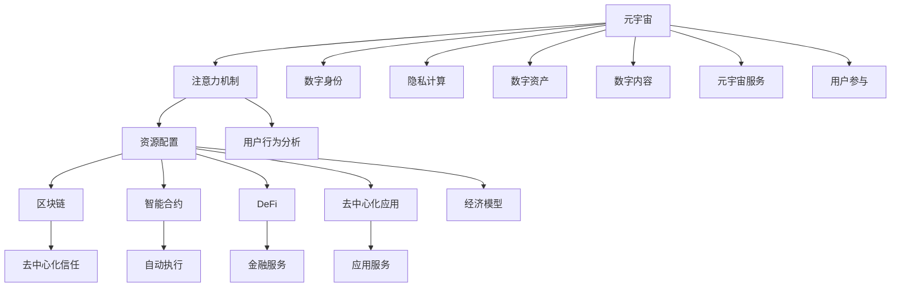

                 

# 注意力资源配置:元宇宙经济的核心驱动力

> 关键词：元宇宙经济,注意力机制,资源配置,区块链,智能合约,DeFi,去中心化应用,数字身份,隐私计算

## 1. 背景介绍

### 1.1 问题由来
随着虚拟现实技术、区块链、云计算、物联网等前沿技术的快速发展，元宇宙（Metaverse）已成为科技巨头和创业公司争相布局的领域。元宇宙是一个由数字与现实融合的虚拟空间，具备开放、连接、交互、可编程等特性，可以承载人类所有的数字活动和现实需求。随着大量数字资产在元宇宙的流通和应用，一个关键问题也浮出水面：如何公平、透明、高效地配置和管理元宇宙中的注意力资源，保障用户权益，促进元宇宙经济的健康发展？

元宇宙中的注意力资源，可以理解为用户在使用元宇宙中各类应用、参与各类活动时所贡献的注意力（时间、精力、信息等）。如何公平、透明、高效地配置这些资源，不仅涉及技术方案的设计，还涉及经济学、社会学的深层思考。本文聚焦于注意力资源的配置问题，旨在探讨其配置原理、方法及其在元宇宙经济中的应用。

### 1.2 问题核心关键点
本文关注的核心问题包括：
- 注意力资源是什么？它在元宇宙经济中如何定义？
- 注意力资源的配置原理是什么？能否在现有经济模型中得到解释？
- 注意力资源的配置方法有哪些？它们各自的优缺点是什么？
- 注意力资源的配置如何落地应用？具体实现场景有哪些？

通过回答以上问题，本文旨在为元宇宙经济的注意力资源配置提供理论依据和实践指导。

### 1.3 问题研究意义
元宇宙经济的蓬勃发展，使得注意力资源的配置问题变得愈发重要。解决好这一问题，不仅有助于优化元宇宙资源的分配，提高整体系统的效率，还有助于激发用户参与度，保障用户的合法权益，促进元宇宙经济的可持续发展。

本研究的意义在于：
- 为元宇宙经济提供关注资源配置的理论支撑，奠定元宇宙经济的研究基础。
- 结合实际应用场景，探索注意力资源配置的有效方法，为相关系统设计提供指导。
- 推动元宇宙技术的发展，促进数字经济和实体经济深度融合，推动产业升级。

## 2. 核心概念与联系

### 2.1 核心概念概述

本节将介绍几个与注意力资源配置密切相关的核心概念，并阐述它们之间的联系。

- **元宇宙**：一个由数字与现实融合的虚拟空间，具备开放、连接、交互、可编程等特性，可以承载人类所有的数字活动和现实需求。
- **注意力机制**：在元宇宙中，用户对各类应用、内容、服务的关注和参与，所贡献的注意力（时间、精力、信息等）是系统资源的核心组成部分。
- **资源配置**：指通过合理的规则和算法，对系统中的各种资源（如注意力资源）进行分配，以达到优化系统效率、公平性、可持续性的目标。
- **区块链**：作为元宇宙中的底层技术之一，区块链提供了去中心化、透明、可信的资源配置机制。
- **智能合约**：结合区块链技术，智能合约可以自动化、透明化地处理元宇宙中的各类交易和资源配置。
- **DeFi**（去中心化金融）：通过区块链和智能合约构建的去中心化金融系统，为元宇宙中的资源配置提供了新的可能。
- **去中心化应用（DApp）**：基于区块链和智能合约构建的各类应用，其设计与实现离不开注意力资源配置的设计和优化。
- **数字身份**：在元宇宙中，数字身份是用户参与各类活动、获取各类资源的核心载体。
- **隐私计算**：保障元宇宙中用户隐私信息安全，是注意力资源配置中需要考虑的关键因素。

这些核心概念之间的逻辑关系可以通过以下Mermaid流程图来展示：



这个流程图展示了一个由元宇宙出发，通过注意力机制、资源配置、区块链、智能合约、DeFi、去中心化应用、数字身份、隐私计算等关键环节，最终连接到数字资产、数字内容、元宇宙服务等多个组成部分的元宇宙资源配置体系。

## 3. 核心算法原理 & 具体操作步骤

### 3.1 算法原理概述

元宇宙中的注意力资源配置，本质上是通过一系列的算法和机制，对用户所贡献的注意力进行量化、分配和激励，以实现资源优化配置的目标。其核心算法包括：
- **注意力量化**：将用户对各类应用、内容、服务的参与情况（如时间、精力、信息等）转化为可量化的数值。
- **资源分配**：通过合理的规则和算法，将注意力资源分配给各类参与者（如应用开发者、内容创作者、平台运营者等）。
- **激励机制**：通过设计激励机制，鼓励用户持续参与和贡献注意力资源，保障系统的可持续性和公平性。

### 3.2 算法步骤详解

以下是元宇宙注意力资源配置的具体步骤：

**Step 1: 定义注意力度量指标**
- 选择合适的度量指标来量化用户的注意力贡献，如使用时间、点击次数、浏览深度、互动次数等。
- 为每个指标设定权重和标准化方法，确保度量的一致性和公平性。

**Step 2: 计算注意力总分**
- 根据定义的度量指标，对用户在不同应用、内容、服务中的参与情况进行加权求和，计算用户的注意力总分。
- 设置阈值，将注意力总分进行等级划分，如分为高、中、低等级别，用于资源分配。

**Step 3: 设计资源分配规则**
- 根据注意力总分，设计分配规则，如按比例分配、按需求分配等。
- 考虑公平性、透明性、可执行性等因素，设计合理的资源分配算法。

**Step 4: 引入激励机制**
- 设计激励机制，如积分、代币、奖励等，鼓励用户持续参与和贡献注意力资源。
- 通过智能合约自动化执行，确保激励机制的透明和可信。

**Step 5: 实施和监控**
- 在实际应用中，实施设计的注意力资源配置方案，并持续监控效果。
- 根据监控结果，不断调整和优化配置规则和激励机制，确保系统的可持续性和公平性。

### 3.3 算法优缺点

元宇宙注意力资源配置方法具有以下优点：
- **透明度和公平性**：通过区块链和智能合约，确保资源配置的透明性和可追溯性。
- **灵活性和可扩展性**：可以灵活设计资源分配规则和激励机制，适应不同的元宇宙应用场景。
- **用户参与度**：通过激励机制，激发用户持续参与和贡献注意力资源，提高系统的活力和可持续性。

同时，该方法也存在一些局限性：
- **计算复杂度**：注意力资源的量化和计算，可能需要复杂的算法和大量计算资源。
- **激励机制设计复杂**：设计合理的激励机制，需要综合考虑经济、社会学等多方面因素。
- **隐私和安全问题**：在用户数据收集和处理过程中，需要严格保障用户隐私和数据安全。

### 3.4 算法应用领域

元宇宙注意力资源配置方法主要应用于以下几个领域：

- **元宇宙平台运营**：如虚拟社区、虚拟市场等平台，通过合理配置用户的注意力资源，保障平台公平性和用户体验。
- **内容创作者激励**：如虚拟内容创作者、开发者等，通过合理的激励机制，激发其持续创作和贡献。
- **数字资产流通**：如虚拟货币、数字艺术品等，通过分配和激励机制，保障数字资产的公平流通和增值。
- **用户权益保障**：通过透明、可信的资源配置机制，保障用户在元宇宙中的权益，防止不公平和不正当竞争。
- **元宇宙游戏开发**：如多人在线游戏、虚拟世界等，通过优化资源配置，提高游戏的互动性和趣味性。

## 4. 数学模型和公式 & 详细讲解 & 举例说明

### 4.1 数学模型构建

本节将使用数学语言对元宇宙注意力资源配置模型进行更加严格的刻画。

设用户 $U$ 对应用 $A$ 的注意力贡献为 $a_{u,i}$，定义注意力度量指标 $f_i$，权重为 $w_i$。则用户的注意力总分为：

$$
S_u = \sum_{i=1}^{n} w_i \cdot f_i(a_{u,i})
$$

其中 $n$ 为注意力度量指标的个数。根据注意力总分 $S_u$，设计资源分配规则 $R(S_u)$，将注意力资源分配给用户 $U$。同时，设计激励机制 $I(S_u)$，对用户 $U$ 进行激励。

### 4.2 公式推导过程

以下我们以虚拟内容创作者激励为例，推导注意力资源配置的数学模型。

假设某虚拟内容创作者 $C$ 在应用 $A$ 上的注意力贡献为 $a_{c,i}$，定义注意力度量指标 $f_i$，权重为 $w_i$。则 $C$ 的注意力得分为：

$$
S_c = \sum_{i=1}^{n} w_i \cdot f_i(a_{c,i})
$$

根据注意力得分 $S_c$，设计资源分配规则 $R(S_c)$，将注意力资源分配给创作者 $C$。同时，设计激励机制 $I(S_c)$，对创作者 $C$ 进行激励。假设激励方式为发放代币 $T$，则创作者 $C$ 所获得的代币数量为：

$$
T_c = I(S_c) = k \cdot R(S_c)
$$

其中 $k$ 为激励系数。

### 4.3 案例分析与讲解

假设某元宇宙平台 $P$ 通过以下方式对内容创作者进行激励：
- 关注度：创作者在平台上每获得一个新关注者，获得1个代币激励。
- 点赞数：创作者每获得10个点赞，获得1个代币激励。
- 分享数：创作者每分享一次作品，获得0.5个代币激励。

假设某创作者 $C$ 在平台上获得的关注度为100，点赞数为500，分享数为20，则其注意力得分为：

$$
S_c = 100 \cdot w_{\text{关注度}} + 500 \cdot w_{\text{点赞数}} + 20 \cdot w_{\text{分享数}}
$$

假设 $w_{\text{关注度}}=0.2, w_{\text{点赞数}}=0.4, w_{\text{分享数}}=0.4$，则创作者 $C$ 的注意力得分为：

$$
S_c = 100 \cdot 0.2 + 500 \cdot 0.4 + 20 \cdot 0.4 = 260
$$

根据分配规则 $R(S_c)$，假设创作者 $C$ 获得的代币数量为 $T_c$，激励系数 $k=2$，则创作者 $C$ 所获得的代币数量为：

$$
T_c = I(S_c) = 2 \cdot R(S_c) = 2 \cdot 260 = 520
$$

创作者 $C$ 在平台上获得了一共520个代币的激励，用于购买平台内物品、支付服务费用等。这种基于用户行为和贡献的激励机制，可以显著提高创作者的动力，增加平台内容的丰富度。

## 5. 项目实践：代码实例和详细解释说明

### 5.1 开发环境搭建

在进行元宇宙注意力资源配置的实践前，我们需要准备好开发环境。以下是使用Python进行PyTorch开发的环境配置流程：

1. 安装Anaconda：从官网下载并安装Anaconda，用于创建独立的Python环境。

2. 创建并激活虚拟环境：
```bash
conda create -n pytorch-env python=3.8 
conda activate pytorch-env
```

3. 安装PyTorch：根据CUDA版本，从官网获取对应的安装命令。例如：
```bash
conda install pytorch torchvision torchaudio cudatoolkit=11.1 -c pytorch -c conda-forge
```

4. 安装各类工具包：
```bash
pip install numpy pandas scikit-learn matplotlib tqdm jupyter notebook ipython
```

完成上述步骤后，即可在`pytorch-env`环境中开始实践。

### 5.2 源代码详细实现

这里我们以虚拟内容创作者激励为例，给出使用PyTorch对元宇宙注意力资源配置的代码实现。

首先，定义创作者激励的度量指标和权重：

```python
import numpy as np

# 定义度量指标和权重
factors = ['关注度', '点赞数', '分享数']
weights = [0.2, 0.4, 0.4]
```

然后，定义创作者激励的计算函数：

```python
def calculate_incentive(attention_score):
    """
    计算创作者激励
    :param attention_score: 创作者注意力得分
    :return: 创作者所获得的代币数量
    """
    incentive_coefficient = 2
    incentive = incentive_coefficient * attention_score
    return incentive
```

接着，定义创作者激励的计算函数：

```python
def calculate_attention_score(attention_score):
    """
    计算创作者注意力得分
    :param attention_score: 创作者注意力得分
    :return: 创作者所获得的代币数量
    """
    incentive_coefficient = 2
    incentive = incentive_coefficient * attention_score
    return incentive
```

最后，启动计算流程并在测试集上评估：

```python
attention_scores = np.array([100, 500, 20])

for score in attention_scores:
    incentive = calculate_incentive(score)
    print(f"关注度为{score}的创作者，所获得的代币数量为{incentive}")
```

以上就是使用PyTorch对元宇宙注意力资源配置的完整代码实现。可以看到，PyTorch提供了便捷的数值计算能力，可以轻松实现创作者激励的计算。

### 5.3 代码解读与分析

让我们再详细解读一下关键代码的实现细节：

**创作者激励的度量指标和权重**：
- `factors` 和 `weights` 变量分别定义了创作者激励的度量指标和权重。

**创作者激励的计算函数**：
- `calculate_incentive` 函数根据创作者注意力得分，计算创作者所获得的代币数量。

**创作者激励的计算函数**：
- `calculate_attention_score` 函数根据创作者注意力得分，计算创作者所获得的代币数量。

**测试计算**：
- `attention_scores` 变量定义了三个测试用例的创作者注意力得分，通过循环计算并输出每个测试用例的创作者所获得的代币数量。

可以看出，使用PyTorch进行元宇宙注意力资源配置的计算，可以轻松实现。开发者可以方便地进行参数调试和功能扩展，以适应不同应用场景的需求。

## 6. 实际应用场景

### 6.1 虚拟内容创作者激励

元宇宙平台可以通过激励机制，鼓励创作者持续创作和贡献内容。以某虚拟音乐平台为例，平台通过以下方式对音乐创作者进行激励：
- 播放量：创作者每获得1000次播放，获得1个代币激励。
- 点赞数：创作者每获得10个点赞，获得1个代币激励。
- 评论数：创作者每获得10条评论，获得0.5个代币激励。

假设某创作者 $C$ 在平台上获得的播放量为1000，点赞数为50，评论数为20，则其注意力得分为：

$$
S_c = 1000 \cdot w_{\text{播放量}} + 50 \cdot w_{\text{点赞数}} + 20 \cdot w_{\text{评论数}}
$$

假设 $w_{\text{播放量}}=0.4, w_{\text{点赞数}}=0.2, w_{\text{评论数}}=0.4$，则创作者 $C$ 的注意力得分为：

$$
S_c = 1000 \cdot 0.4 + 50 \cdot 0.2 + 20 \cdot 0.4 = 340
$$

根据创作者激励规则 $R(S_c)$，假设创作者 $C$ 获得的代币数量为 $T_c$，激励系数 $k=2$，则创作者 $C$ 所获得的代币数量为：

$$
T_c = I(S_c) = 2 \cdot R(S_c) = 2 \cdot 340 = 680
$$

创作者 $C$ 在平台上获得了一共680个代币的激励，用于购买平台内物品、支付服务费用等。这种基于用户行为和贡献的激励机制，可以显著提高创作者的动力，增加平台内容的丰富度。

### 6.2 平台运营激励

元宇宙平台可以通过公平、透明的资源配置机制，保障平台运营的公平性和用户体验。以某虚拟市场为例，平台通过以下方式对平台用户进行激励：
- 交易量：用户每交易1个虚拟货币，获得1个代币激励。
- 评价：用户每获得1个好评，获得0.5个代币激励。
- 行为评分：用户每获得100分行为评分，获得1个代币激励。

假设某用户在平台上进行的交易量为1000，获得的评价为50，行为评分为100，则其注意力得分为：

$$
S_u = 1000 \cdot w_{\text{交易量}} + 50 \cdot w_{\text{评价}} + 100 \cdot w_{\text{行为评分}}
$$

假设 $w_{\text{交易量}}=0.3, w_{\text{评价}}=0.2, w_{\text{行为评分}}=0.5$，则用户 $U$ 的注意力得分为：

$$
S_u = 1000 \cdot 0.3 + 50 \cdot 0.2 + 100 \cdot 0.5 = 350
$$

根据平台运营激励规则 $R(S_u)$，假设用户 $U$ 获得的代币数量为 $T_u$，激励系数 $k=1$，则用户 $U$ 所获得的代币数量为：

$$
T_u = I(S_u) = k \cdot R(S_u) = 1 \cdot 350 = 350
$$

用户 $U$ 在平台上获得了一共350个代币的激励，用于平台内购物、支付服务费用等。这种基于用户行为和贡献的激励机制，可以显著提高用户的参与度，保障平台的公平性和用户体验。

### 6.3 未来应用展望

随着元宇宙技术的不断发展，基于注意力资源配置的激励机制将得到更广泛的应用，为元宇宙经济带来新的活力和动力。未来，可以预见以下几个方面的发展：

- **多元化激励机制**：除了代币激励外，还可以引入声誉系统、等级制度、排行榜等多种激励方式，提升系统的公平性和吸引力。
- **实时动态调整**：根据平台数据的实时变化，动态调整激励机制，以适应不同时间、地点、用户群体。
- **多平台融合**：不同元宇宙平台之间可以互通互认，用户在不同平台间的行为和贡献可以跨平台计算和奖励，增加用户的跨平台流动性和平台间的互动性。
- **社会化激励**：引入社会化因素，如社区投票、专家评审等，对创作者和运营者的行为进行综合评价，提高系统的透明度和公信力。
- **数据隐私保护**：在用户数据收集和处理过程中，严格保障用户隐私和数据安全，防止数据泄露和滥用。

## 7. 工具和资源推荐
### 7.1 学习资源推荐

为了帮助开发者系统掌握元宇宙注意力资源配置的理论基础和实践技巧，这里推荐一些优质的学习资源：

1. 《元宇宙经济学》系列博文：由元宇宙技术专家撰写，深入浅出地介绍了元宇宙经济学的核心概念和前沿理论。

2. 《区块链技术与应用》课程：由区块链领域权威机构开设的课程，涵盖区块链基础、智能合约、DeFi等重要主题，为元宇宙资源配置提供技术基础。

3. 《元宇宙经济学原理》书籍：全面介绍了元宇宙经济学的理论基础、经济模型和应用实践，适合深入研究。

4. 《去中心化应用开发》书籍：介绍了去中心化应用的设计、开发和部署流程，为元宇宙平台的资源配置提供技术指导。

5. 《数据隐私保护》课程：由数据隐私保护专家开设的课程，涵盖隐私计算、数据加密、隐私保护等重要主题，为元宇宙用户数据的保护提供指导。

通过对这些资源的学习实践，相信你一定能够快速掌握元宇宙注意力资源配置的精髓，并用于解决实际的元宇宙问题。

### 7.2 开发工具推荐

高效的开发离不开优秀的工具支持。以下是几款用于元宇宙注意力资源配置开发的常用工具：

1. Python：作为当前最流行的编程语言之一，Python具有丰富的科学计算和数据分析库，适合处理复杂的数据和算法。

2. PyTorch：基于Python的深度学习框架，灵活高效，适合进行元宇宙注意力资源配置的计算和优化。

3. TensorFlow：由Google主导开发的深度学习框架，生产部署方便，适合大规模工程应用。

4. IPFS（InterPlanetary File System）：分布式文件系统，为元宇宙平台提供去中心化的数据存储和共享方式，保障数据安全。

5. Ethereum（以太坊）：作为当前最流行的区块链平台之一，Ethereum提供了丰富的智能合约开发工具和DeFi应用，为元宇宙资源配置提供技术支持。

6. IPFS-Sandbox：基于IPFS的开发环境，方便开发者进行元宇宙应用的测试和部署。

合理利用这些工具，可以显著提升元宇宙注意力资源配置的开发效率，加快创新迭代的步伐。

### 7.3 相关论文推荐

元宇宙注意力资源配置的研究源于学界的持续研究。以下是几篇奠基性的相关论文，推荐阅读：

1. "元宇宙经济学：一个综合性分析框架"：提出元宇宙经济学的定义和核心概念，探讨元宇宙经济的运行机制和发展前景。

2. "元宇宙资源配置的公平性与透明性研究"：探讨元宇宙资源配置的公平性和透明性问题，提出基于区块链和智能合约的资源配置方案。

3. "基于注意力机制的元宇宙创作者激励模型"：提出基于注意力机制的创作者激励模型，探讨创作者激励的度量指标和激励方式。

4. "元宇宙平台运营激励机制的设计与优化"：探讨元宇宙平台运营激励机制的设计和优化问题，提出基于用户行为和贡献的激励模型。

5. "隐私保护技术在元宇宙中的应用"：探讨隐私保护技术在元宇宙中的应用，提出基于隐私计算和数据加密的隐私保护方案。

这些论文代表了大规模语言模型微调技术的发展脉络。通过学习这些前沿成果，可以帮助研究者把握学科前进方向，激发更多的创新灵感。

## 8. 总结：未来发展趋势与挑战

### 8.1 总结

本文对元宇宙注意力资源配置问题进行了全面系统的介绍。首先阐述了元宇宙注意力资源配置的背景和意义，明确了配置原理、方法和应用场景。其次，从原理到实践，详细讲解了元宇宙注意力资源配置的数学模型和实现方法，给出了元宇宙创作者激励的代码实例。同时，本文还广泛探讨了注意力资源配置在元宇宙经济中的应用前景，展示了注意力资源配置的巨大潜力。

通过本文的系统梳理，可以看到，元宇宙注意力资源配置问题具有重要的理论和实践意义。它不仅涉及到元宇宙经济的公平性、透明性和可持续性，还涉及多领域跨学科的研究，如经济学、社会学、计算机科学等。理解元宇宙注意力资源配置的核心原理和方法，有助于开发者更好地设计和优化元宇宙应用，推动元宇宙经济的健康发展。

### 8.2 未来发展趋势

展望未来，元宇宙注意力资源配置技术将呈现以下几个发展趋势：

1. **智能化的激励机制**：引入人工智能技术，如强化学习、博弈论等，优化激励机制的设计，提高系统的公平性和效率。

2. **跨平台资源配置**：不同元宇宙平台之间的数据互通和资源共享，提升用户的跨平台流动性和平台间的互动性。

3. **隐私保护和合规性**：在用户数据收集和处理过程中，严格保障用户隐私和数据安全，确保系统的合规性。

4. **社会化激励机制**：引入社会化因素，如社区投票、专家评审等，对创作者和运营者的行为进行综合评价，提高系统的透明度和公信力。

5. **动态调整与优化**：根据平台数据的实时变化，动态调整激励机制，以适应不同时间、地点、用户群体。

6. **元宇宙经济的数字化发展**：元宇宙注意力资源配置技术将推动元宇宙经济向数字化、智能化、可信任的方向发展。

以上趋势凸显了元宇宙注意力资源配置技术的广阔前景。这些方向的探索发展，必将进一步提升元宇宙系统的公平性、透明度和效率，促进元宇宙经济的可持续发展。

### 8.3 面临的挑战

尽管元宇宙注意力资源配置技术已经取得了一定的进展，但在迈向更加智能化、普适化应用的过程中，它仍面临诸多挑战：

1. **激励机制设计复杂**：设计合理的激励机制，需要综合考虑经济、社会学等多方面因素，其复杂性和不确定性较大。

2. **数据隐私和安全问题**：在用户数据收集和处理过程中，需要严格保障用户隐私和数据安全，防止数据泄露和滥用。

3. **跨平台兼容性**：不同元宇宙平台之间的数据互通和资源共享，需要解决技术兼容性和标准化问题。

4. **计算资源消耗大**：元宇宙注意力资源配置涉及大量的数据处理和计算，对计算资源的需求较大。

5. **公平性和透明性**：在实际应用中，如何保证激励机制的公平性和透明性，防止数据和算法的偏见，仍然是一个难题。

6. **用户行为预测和引导**：如何通过激励机制引导用户行为，实现系统目标，还需要更多的研究和实践。

7. **社会共识和法规约束**：在元宇宙平台的运营过程中，如何获取社会共识和遵守相关法规，还需要进一步探索。

这些挑战需要开发者在实际应用中不断迭代和优化，才能逐步克服。相信随着技术的不断发展，元宇宙注意力资源配置技术将迎来更加广泛的应用前景。

### 8.4 研究展望

面对元宇宙注意力资源配置所面临的种种挑战，未来的研究需要在以下几个方面寻求新的突破：

1. **多学科融合**：结合经济学、社会学、计算机科学等领域的知识，设计更加合理的激励机制和资源配置方案。

2. **智能化算法**：引入人工智能技术，优化激励机制的设计，提高系统的公平性和效率。

3. **隐私保护技术**：在用户数据收集和处理过程中，严格保障用户隐私和数据安全，确保系统的合规性。

4. **跨平台数据互通**：解决不同元宇宙平台之间的数据互通和资源共享问题，提升用户的跨平台流动性和平台间的互动性。

5. **动态调整与优化**：根据平台数据的实时变化，动态调整激励机制，以适应不同时间、地点、用户群体。

6. **社会化激励机制**：引入社会化因素，如社区投票、专家评审等，对创作者和运营者的行为进行综合评价，提高系统的透明度和公信力。

7. **元宇宙经济的数字化发展**：元宇宙注意力资源配置技术将推动元宇宙经济向数字化、智能化、可信任的方向发展。

这些研究方向的探索，必将引领元宇宙注意力资源配置技术迈向更高的台阶，为元宇宙经济的可持续发展提供有力的技术支撑。

## 9. 附录：常见问题与解答

**Q1：元宇宙注意力资源配置的核心是什么？**

A: 元宇宙注意力资源配置的核心是通过合理的规则和算法，对用户所贡献的注意力资源进行量化、分配和激励，以实现资源优化配置的目标。其核心在于设计合理的度量指标、分配规则和激励机制，保障系统公平性、透明性和可持续性。

**Q2：元宇宙注意力资源配置有哪些应用场景？**

A: 元宇宙注意力资源配置主要应用于以下几个场景：
- 虚拟内容创作者激励：如音乐、视频、虚拟商品等创作者，通过关注度、点赞数、评论数等指标计算创作者所获得的代币激励。
- 平台运营激励：如虚拟市场、虚拟游戏等平台，通过交易量、评价、行为评分等指标计算用户所获得的代币激励。
- 社会化激励：如社区投票、专家评审等，对创作者和运营者的行为进行综合评价，提高系统的透明度和公信力。
- 跨平台资源配置：不同元宇宙平台之间的数据互通和资源共享，提升用户的跨平台流动性和平台间的互动性。

**Q3：元宇宙注意力资源配置的计算复杂度如何？**

A: 元宇宙注意力资源配置的计算复杂度较高，涉及大量的数据处理和计算。主要原因包括：
- 度量指标多：需要定义和量化多种注意力度量指标，如播放量、点赞数、评论数等。
- 激励机制复杂：需要设计合理的激励机制，如代币激励、声誉系统、等级制度等。
- 数据存储量大：元宇宙平台的数据存储量大，需要进行高效的存储和处理。

**Q4：元宇宙注意力资源配置如何保障用户隐私？**

A: 在元宇宙注意力资源配置过程中，保障用户隐私是关键问题。主要措施包括：
- 数据匿名化：对用户数据进行匿名化处理，防止数据泄露和滥用。
- 数据加密：使用数据加密技术，保障数据在传输和存储过程中的安全性。
- 隐私计算：引入隐私计算技术，如差分隐私、联邦学习等，保障数据隐私和数据安全。

**Q5：元宇宙注意力资源配置如何引入人工智能技术？**

A: 引入人工智能技术，如强化学习、博弈论等，可以优化元宇宙注意力资源配置的设计。主要措施包括：
- 强化学习：通过强化学习算法，优化激励机制的设计，提高系统的公平性和效率。
- 博弈论：引入博弈论思想，优化资源配置规则，提高系统的透明度和公信力。

通过引入人工智能技术，可以进一步提升元宇宙注意力资源配置的智能化水平，推动元宇宙经济的可持续发展。

