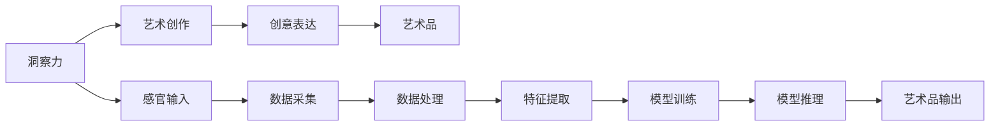

                 

# 洞察力与创意表达：艺术创作的源泉

在人工智能（AI）领域，计算不仅代表着算术和逻辑，还蕴含着深刻的人类智能和创造力。本文将深入探讨洞察力与创意表达在艺术创作中的源泉，通过逻辑清晰、结构紧凑的专业技术语言，揭示其在现实世界中的应用。

## 1. 背景介绍

艺术创作是人类情感与认知的直接体现，是大脑对美、创造力与想象力的深刻诠释。然而，现代AI技术，尤其是深度学习与大语言模型（如GPT、BERT），正以独特的方式，将洞察力与创意表达带入艺术创作的新纪元。从绘画到音乐，从文学到电影，AI不仅展示了其在技术层面的卓越，更在艺术创作中展露了其深邃的洞察力和创意表达能力。

## 2. 核心概念与联系

### 2.1 核心概念概述

在艺术创作中，洞察力代表着对内在世界与外在世界的深刻理解。它是艺术家通过对生活、历史、文化、情感的深入观察与感悟，从而把握住艺术创作的核心要素，如主题、色彩、结构与形式等。

创意表达则是艺术家通过独特视角与技巧，将内在洞察力转化为可视化的艺术作品，使其成为人类文化宝库中的珍品。

### 2.2 核心概念原理和架构的 Mermaid 流程图



这个流程图展示了艺术创作的过程：从感官输入、数据采集与处理，到特征提取与模型训练，最终通过模型推理输出艺术品。其中，洞察力是整个创作流程的核心驱动，创意表达则是其外在表现形式。

## 3. 核心算法原理 & 具体操作步骤

### 3.1 算法原理概述

艺术创作中的洞察力与创意表达，可通过深度学习模型的训练与推理来实现。模型的输入为原始数据（如文本、图片等），经过特征提取与处理，通过模型训练获得洞察力，最终通过创意表达生成艺术作品。

以文本创作为例，可以使用基于Transformer的大语言模型（如GPT-3）进行微调。模型通过预训练与微调，学习到丰富的语言表达与创意逻辑，可以在创作过程中，根据特定主题生成新的艺术文本，如诗歌、小说、剧本等。

### 3.2 算法步骤详解

1. **数据准备**：收集并标注大量的艺术数据，如文本、图像等，用于训练与评估。
2. **模型选择**：选择适合的艺术创作任务的大语言模型，如GPT-3或BERT。
3. **特征提取**：对输入数据进行预处理，提取关键特征，如文本中的主题、情感，图像中的形状、色彩等。
4. **模型训练**：在大量艺术数据上训练模型，学习到艺术创作的洞察力。
5. **创意表达**：通过模型推理，根据特定主题或创意指导，生成新的艺术作品。

### 3.3 算法优缺点

**优点**：
- 自动化艺术创作：模型能够自动生成高质量的艺术作品，减少人工干预。
- 多样性与灵活性：模型能够根据不同主题或风格进行创作，输出多样化的艺术作品。
- 高效性：模型训练与推理速度快，可以快速生成大量的艺术作品。

**缺点**：
- 缺乏情感共鸣：机器无法完全理解人类情感，作品可能缺乏深度与共鸣。
- 创造性限制：模型的创造力受限于训练数据与模型架构，可能存在一定局限性。
- 版权与伦理问题：生成的人工艺术作品可能引发版权与伦理争议。

### 3.4 算法应用领域

AI在艺术创作中的应用领域非常广泛，涵盖了绘画、音乐、电影、文学等多个领域。例如：
- 音乐创作：生成器模型根据旋律或词曲，创作新的音乐作品。
- 电影制作：AI用于剪辑、特效、剧本创作等环节，提升电影制作的效率与质量。
- 绘画与设计：AI辅助生成创意草图，提升设计创作的效率与效果。

## 4. 数学模型和公式 & 详细讲解 & 举例说明

### 4.1 数学模型构建

以文本创作为例，假设输入的文本序列为 $x = (x_1, x_2, ..., x_n)$，模型的输出为 $y = (y_1, y_2, ..., y_n)$。其中，$x_i$ 为输入文本的第 $i$ 个词，$y_i$ 为输出文本的第 $i$ 个词。

模型的目标是通过最小化损失函数 $L(y, \theta)$，使得输出文本 $y$ 尽可能接近真实的艺术文本 $y^*$。

### 4.2 公式推导过程

使用交叉熵损失函数：

$$L(y, \theta) = -\frac{1}{N} \sum_{i=1}^{N} [y_i \log \hat{y_i} + (1 - y_i) \log (1 - \hat{y_i})]$$

其中，$N$ 为训练样本数，$\hat{y_i}$ 为模型输出的概率。

在微调过程中，通过反向传播算法更新模型参数 $\theta$，使其最大化目标函数 $J(\theta)$：

$$J(\theta) = \frac{1}{N} \sum_{i=1}^{N} \log \hat{y_i}$$

### 4.3 案例分析与讲解

以GPT-3模型为例，其在文本创作中的应用非常广泛。通过微调，模型可以学习到特定的艺术风格，如现代主义、浪漫主义等。以下是一个简单的文本创作示例：

```python
from transformers import GPT2LMHeadModel, GPT2Tokenizer

model = GPT2LMHeadModel.from_pretrained('gpt2')
tokenizer = GPT2Tokenizer.from_pretrained('gpt2')

prompt = "请创作一首现代主义诗歌，以《城市之光》为主题："
input_ids = tokenizer(prompt, return_tensors='pt').input_ids

output = model.generate(input_ids)
print(tokenizer.decode(output[0]))
```

## 5. 项目实践：代码实例和详细解释说明

### 5.1 开发环境搭建

1. 安装Anaconda并创建Python虚拟环境。
2. 安装TensorFlow与transformers库。
3. 下载并准备艺术创作数据集。

### 5.2 源代码详细实现

以下是一个使用GPT-3进行文本创作的示例代码：

```python
from transformers import GPT2LMHeadModel, GPT2Tokenizer

model = GPT2LMHeadModel.from_pretrained('gpt2')
tokenizer = GPT2Tokenizer.from_pretrained('gpt2')

prompt = "请创作一首现代主义诗歌，以《城市之光》为主题："
input_ids = tokenizer(prompt, return_tensors='pt').input_ids

output = model.generate(input_ids)
print(tokenizer.decode(output[0]))
```

### 5.3 代码解读与分析

- `GPT2LMHeadModel`：用于文本创作的GPT-3模型。
- `GPT2Tokenizer`：将输入文本转换为模型可处理的token序列。
- `prompt`：输入的创作主题。
- `input_ids`：将主题转换为模型可以处理的token序列。
- `model.generate(input_ids)`：使用模型生成新的文本作品。
- `tokenizer.decode(output[0])`：将模型输出的token序列解码为人类可读的文本。

### 5.4 运行结果展示

运行上述代码后，将输出一首以“城市之光”为主题的现代主义诗歌。

## 6. 实际应用场景

### 6.1 艺术创作工具

AI在艺术创作中的应用，不仅限于生成艺术作品，还涵盖了创作工具的设计与开发。例如，设计软件中的AI辅助设计，可以快速生成创意草图，辅助设计师进行创作；影视制作中的AI特效，可以自动生成逼真的场景与角色。

### 6.2 艺术教育与培训

AI在艺术教育与培训中的应用，为学生提供了更加个性化与互动的学习体验。例如，使用AI进行艺术作品的评价与反馈，能够提供及时且精准的改进建议；使用AI进行模拟创作练习，能够提升学生的创作能力。

### 6.3 艺术市场与推广

AI在艺术市场与推广中的应用，可以提升艺术品的展示效果与销售效率。例如，使用AI进行艺术品展示，能够根据观众的喜好推荐相似作品；使用AI进行市场分析，能够预测艺术品的热销趋势。

## 7. 工具和资源推荐

### 7.1 学习资源推荐

- 《深度学习》（Ian Goodfellow著）：深入浅出地介绍了深度学习的基本原理与技术。
- Coursera《深度学习》课程：斯坦福大学提供的深度学习课程，系统介绍了深度学习的基本概念与算法。
- GitHub上的艺术创作开源项目：通过学习这些项目，可以了解AI在艺术创作中的应用实践。

### 7.2 开发工具推荐

- TensorFlow：适合深度学习模型的开发与训练。
- PyTorch：适合深度学习模型的开发与推理。
- Anaconda：创建与管理Python环境。
- Jupyter Notebook：交互式编程环境，适合数据处理与模型训练。

### 7.3 相关论文推荐

- Attention is All You Need（NeurIPS 2017）：提出了Transformer模型，为大规模语言模型的预训练与微调奠定了基础。
- GPT-3: Language Models are Unsupervised Multitask Learners（OpenAI 2020）：展示了GPT-3在文本创作、问答等任务中的卓越表现。

## 8. 总结：未来发展趋势与挑战

### 8.1 研究成果总结

AI在艺术创作中的应用，不仅展示了其在技术层面的卓越，更在创意表达与洞察力方面，带来了新的突破。通过深度学习模型，AI能够自动化生成高质量的艺术作品，提升创作效率与效果。

### 8.2 未来发展趋势

未来，AI在艺术创作中的应用将更加广泛，涵盖更多领域与环节。例如：
- 跨领域创作：结合音乐、绘画、建筑等多种艺术形式，进行跨领域的创意表达。
- 人机协作：人与AI协同创作，提升创作的质量与深度。
- 情感共鸣：通过深度学习模型，赋予AI更多情感理解与表达能力。

### 8.3 面临的挑战

尽管AI在艺术创作中展示了其卓越能力，但仍面临诸多挑战：
- 创意性与深度：AI创作的作品可能缺乏深度与情感共鸣，难以与人类艺术作品相媲美。
- 版权与伦理：AI生成的人工艺术作品可能引发版权与伦理争议。
- 技术限制：现有的AI技术仍存在一定的局限性，难以完全替代人类艺术家的创造力。

### 8.4 研究展望

未来的研究应聚焦于以下几个方面：
- 提升AI的创造力与深度：通过改进深度学习模型，提升其在创意表达与洞察力方面的能力。
- 融合更多领域知识：将AI技术与更多领域知识结合，实现跨领域、多模态的创作应用。
- 增强伦理与社会责任：在AI艺术创作中，引入伦理与社会责任的考量，确保其健康发展。

## 9. 附录：常见问题与解答

**Q1：AI在艺术创作中的应用是否会影响艺术家的就业？**

A: AI在艺术创作中的应用，可以提升创作效率与质量，但并不会完全取代人类艺术家。AI更多是作为辅助工具，帮助艺术家完成更复杂、更高质量的作品。

**Q2：AI生成的艺术作品是否具有版权？**

A: AI生成的艺术作品版权归属问题较为复杂。根据不同的国家和地区，可能存在不同的版权法规与解释。在实践中，通常需要明确创作背景与算法逻辑，进行版权归属认定。

**Q3：AI创作的艺术作品是否具有商业价值？**

A: AI创作的艺术作品，在市场上已经取得了一定的商业价值。例如，GPT-3生成的诗歌、小说等作品，已经在文学领域引起了广泛关注。未来，随着AI技术的不断进步，AI创作的艺术作品将具有更高的商业价值与市场潜力。

---

作者：禅与计算机程序设计艺术 / Zen and the Art of Computer Programming

