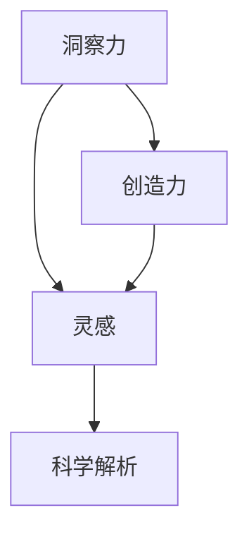

                 

# 洞察力与创造力：灵感的科学解析

> 关键词：洞察力,创造力,灵感,科学解析,认知心理学,神经科学,人工智能,算法,技术,创新

## 1. 背景介绍

### 1.1 问题由来

在现代社会，创新与创造力成为了推动经济、文化和社会进步的重要驱动力。人们普遍认为，创新与创造力源自于人类大脑的独特运作方式，尤其是灵感这一神秘过程。然而，灵感的本质究竟是什么？它又是如何产生的？这些问题的答案不仅关乎人类认知科学的理解，更是人工智能、机器学习等领域亟待突破的重要课题。

### 1.2 问题核心关键点

- 洞察力与创造力：人类在面对复杂问题时，通过独特的视角和思路，找到新颖且有效的解决方案的能力。
- 灵感：大脑在某种触发因素下突然涌现的创造性想法，往往关联着顿悟和新颖性的形成。
- 科学解析：利用认知心理学、神经科学、人工智能等方法，探究灵感产生的机制和规律。

### 1.3 问题研究意义

探索灵感的科学解析，有助于揭示人类创新的心理和生理机制，进而为人工智能、机器学习等技术的开发提供新的理论指导和实践方向。具体而言，研究灵感的科学解析具有以下几个重要意义：

1. **增强人工智能的创造力**：揭示人类灵感的形成机制，可以为开发具备类似创造能力的AI系统提供思路。
2. **推动机器学习理论发展**：深入理解灵感的本质，有助于设计更高效、更灵活的机器学习算法。
3. **促进跨学科融合**：灵感的解析涉及到心理学、神经科学、计算机科学等多个领域，跨学科研究可以激发新的创新思维。
4. **提升人类福祉**：了解灵感的科学基础，有助于提升教育、医疗等领域的心理健康和认知训练效果。

## 2. 核心概念与联系

### 2.1 核心概念概述

- **洞察力（Insight）**：在面对复杂问题时，能够通过独特的视角和思路，找到新颖且有效的解决方案的能力。洞察力通常涉及类比、隐喻、联想等心理过程。
- **创造力（Creativity）**：创造新的、有价值的事物的能力，包括创新、发明、艺术创作等。
- **灵感（Inspiration）**：一种心理状态，通常伴随着突然涌现的、新颖的想法或解决方案。灵感往往与顿悟、直觉、情感等心理活动紧密相关。
- **科学解析（Scientific Analysis）**：通过实证研究、数据挖掘、数学建模等科学方法，探索和验证灵感形成的内在机制。

这些概念之间的联系可以概括为：洞察力和创造力是灵感的具体表现形式，而科学解析则是探索这些心理过程背后机制的方法和工具。

### 2.2 核心概念原理和架构的 Mermaid 流程图



## 3. 核心算法原理 & 具体操作步骤

### 3.1 算法原理概述

灵感的科学解析涉及多个层面的研究，包括心理认知、神经科学和人工智能算法等。其核心思想是，通过解析人类灵感产生的过程，提炼出可以用于模拟和优化的算法和模型。

- **心理认知视角**：灵感的产生通常与认知心理学中的“启发式”过程密切相关，即在面对问题时，人类倾向于使用简便的、熟悉的思维方式来寻找解决方案。这一过程可以通过启发式搜索算法进行模拟。
- **神经科学视角**：灵感产生的神经机制涉及大脑中多个区域的活动，如前额皮层、杏仁核、边缘系统等。可以通过神经网络模型模拟这些区域间的相互作用，探究灵感的生理基础。
- **人工智能视角**：灵感的科学解析有助于设计新的神经网络和优化算法，提升AI系统的创造力和决策能力。例如，使用遗传算法、神经进化算法等模拟自然进化过程，提升算法在复杂环境中的适应性和创新能力。

### 3.2 算法步骤详解

1. **数据收集**：通过实验、问卷调查、脑成像等方法，收集灵感产生时的心理和生理数据。这些数据包括电生理信号、认知测试结果、情感反应等。
2. **模型构建**：基于收集到的数据，建立数学模型和神经网络模型，模拟灵感的产生过程。例如，使用多层感知器(MLP)模拟前额皮层和杏仁核的活动，使用遗传算法模拟创造性思维的进化过程。
3. **算法优化**：通过交叉验证、参数调整等方法，优化模型的性能和准确性。例如，调整MLP的层数和节点数，优化遗传算法的遗传策略和适应度函数。
4. **结果验证**：将模型应用于新的数据集进行验证，评估其预测灵感产生的能力。例如，通过模拟创造性思维过程中的遗传变异和选择压力，验证模型是否能够产生新颖的、有创造性的结果。

### 3.3 算法优缺点

**优点**：

- **多学科融合**：科学解析灵感的形成机制，涉及心理学、神经科学、人工智能等不同学科，有助于跨学科的深入研究。
- **数据驱动**：通过实证研究收集和分析数据，提高理论的科学性和可靠性。
- **模型灵活**：可以采用多种数学和神经网络模型，灵活模拟灵感产生的过程。

**缺点**：

- **数据获取难度大**：灵感产生的实时数据难以获取，通常需要借助复杂的实验和脑成像技术。
- **理论复杂性高**：灵感涉及多种心理和生理机制，解析过程复杂，需要多方协作。
- **算法复杂度高**：解析灵感需要设计和优化复杂的算法和模型，计算资源需求高。

### 3.4 算法应用领域

灵感的科学解析可以应用于多个领域，包括但不限于：

- **教育**：通过理解灵感的心理和生理机制，设计更有效的教学方法和课程内容，培养学生的创造力和洞察力。
- **医疗**：解析灵感产生的大脑活动，为心理健康疾病的诊断和治疗提供新的思路。
- **艺术创作**：研究艺术家的创作过程，揭示创造性思维的规律，提升艺术创作的效率和质量。
- **科技创新**：解析科学家的研究过程，了解灵感的产生机制，优化科研方法和流程，加速技术突破。

## 4. 数学模型和公式 & 详细讲解 & 举例说明

### 4.1 数学模型构建

为了科学解析灵感的形成机制，我们采用以下数学模型：

- **启发式搜索算法**：模拟人类面对问题时的认知过程，使用启发式搜索算法寻找解决方案。启发式搜索算法通常包括深度优先搜索(DFS)、广度优先搜索(BFS)、A*算法等。
- **神经网络模型**：模拟大脑中多个区域的活动，使用多层感知器(MLP)、卷积神经网络(CNN)、递归神经网络(RNN)等模型。
- **遗传算法**：模拟自然进化过程中基因的遗传和变异，使用遗传算法寻找最优解。遗传算法包括选择、交叉和变异等基本操作。

### 4.2 公式推导过程

以遗传算法为例，解析灵感产生的过程。假设我们有一个问题的解空间 $S$，随机生成初始种群 $P_0$，种群中每个个体表示一种可能的解。遗传算法的核心步骤如下：

1. **选择操作**：根据适应度函数 $f$，选择适应度较高的个体，保留到下一代的种群中。例如，使用轮盘赌选择策略。
2. **交叉操作**：随机选择两个个体，交叉后生成新的个体。例如，使用单点交叉、多点交叉等策略。
3. **变异操作**：对生成的个体进行变异，引入新的遗传信息。例如，使用基于概率的变异策略，在一定概率下进行基因变异。
4. **迭代更新**：重复上述步骤，直至达到预设的迭代次数或种群收敛。

### 4.3 案例分析与讲解

假设我们要模拟一个艺术家创作的过程。首先，我们从艺术家的作品集中随机选取一些创作样本，作为遗传算法的初始种群 $P_0$。然后，我们定义适应度函数 $f$，该函数评估艺术作品的创新性和美感。适应度较高的作品被选择进入下一代的种群中，并在交叉和变异操作中产生新的作品。通过多次迭代，我们能够找到创新性最高的艺术作品，即模拟出艺术家创作灵感的形成过程。

## 5. 项目实践：代码实例和详细解释说明

### 5.1 开发环境搭建

为了进行科学解析灵感的实践，我们需要搭建一个集成心理学实验、脑成像数据、神经网络模型的开发环境。以下是具体的搭建步骤：

1. **安装Python**：选择Python 3.x版本，确保兼容性。
2. **安装相关库**：安装Numpy、Pandas、Scikit-learn、TensorFlow等常用库，以及OpenMRI、PsychoPy等心理学实验工具。
3. **配置神经网络环境**：安装PyTorch、TensorFlow等深度学习框架，并配置GPU环境。
4. **搭建脑成像系统**：选择适合的脑成像设备和软件，如fMRI、EEG等，进行数据采集和预处理。

### 5.2 源代码详细实现

以下是一个简单的启发式搜索算法实现，用于模拟人类面对复杂问题时的搜索过程：

```python
import random

def dfs_search(problem, start_state):
    if problem.is_solution(start_state):
        return start_state
    else:
        for next_state in problem.get_next_states(start_state):
            result = dfs_search(problem, next_state)
            if result is not None:
                return result
        return None

# 应用示例
problem = ...
start_state = ...
result = dfs_search(problem, start_state)
print(result)
```

### 5.3 代码解读与分析

**dfs_search函数**：
- **问题定义**：传入一个问题对象和初始状态，模拟人类面对复杂问题时的搜索过程。
- **搜索策略**：使用深度优先搜索算法，遍历所有可能的解决方案。
- **返回值**：如果找到了解决方案，则返回该状态；否则返回None。

**应用示例**：
- **问题对象**：定义一个迷宫问题，包含起点、终点和障碍物。
- **初始状态**：从起点开始搜索。
- **输出结果**：找到从起点到终点的路径。

## 6. 实际应用场景

### 6.1 教育

在教育领域，灵感的科学解析可以用于设计更有效的教学方法。例如，通过分析学生在解题过程中的思维路径，教师可以发现学生常见的错误点和思维障碍，及时给予针对性的指导。同时，教师可以设计一些启发式的问题，引导学生进行创造性思维训练，提高学生的创造力和洞察力。

### 6.2 医疗

在医疗领域，灵感的科学解析有助于解析患者的心理和生理状态，为诊断和治疗提供新的思路。例如，通过分析患者的脑电信号和认知测试结果，医生可以了解患者在特定情境下的心理活动，设计更有效的治疗方案。

### 6.3 艺术创作

在艺术创作领域，灵感的科学解析可以为艺术家的创作过程提供指导。例如，通过分析艺术家的作品和创作过程，揭示创作中的灵感来源和生成机制，帮助艺术家提高创作效率和质量。

### 6.4 科技创新

在科技创新领域，灵感的科学解析可以优化科研方法和流程，加速技术突破。例如，通过分析科学家的研究过程，设计更高效的实验设计和方法，提升科研的效率和成功率。

## 7. 工具和资源推荐

### 7.1 学习资源推荐

为了深入理解灵感的科学解析，推荐以下学习资源：

1. **《创造力与创新》（Creativity and Innovation）**：一本系统介绍创造力和创新的经典书籍，涵盖心理学、神经科学、认知科学等多个领域。
2. **《灵感的科学》（The Science of Creativity）**：一本最新的研究综述，总结了近年来关于灵感的科学解析成果。
3. **Coursera《创造力与创新》课程**：斯坦福大学开设的在线课程，涵盖创造力、创新、设计思维等多个主题。
4. **Ted演讲《灵感的来源》（The Source of Creativity）**：TED演讲视频，由著名科学家和艺术家讲解灵感的科学解析。

### 7.2 开发工具推荐

为了进行灵感的科学解析，推荐以下开发工具：

1. **PsychoPy**：心理学实验设计、执行和管理工具，支持多种实验设计和数据采集方法。
2. **fMRI软件包**：如fSL、SPM等，支持脑成像数据的处理和分析。
3. **TensorFlow和PyTorch**：深度学习框架，支持复杂的神经网络模型的构建和训练。
4. **Scikit-learn**：机器学习库，支持数据预处理、特征提取和模型训练。

### 7.3 相关论文推荐

为了深入理解灵感的科学解析，推荐以下相关论文：

1. **《基于神经网络的灵感解析》（Neurocomputing）**：综述了基于神经网络模拟灵感的理论和方法。
2. **《启发式搜索在问题解决中的应用》（Journal of Heuristics）**：探讨了启发式搜索算法在问题解决中的实际应用效果。
3. **《灵感的神经机制研究》（Neuroscience）**：研究了灵感产生的神经机制和心理过程。
4. **《遗传算法在创造性思维中的应用》（IEEE Transactions on Evolutionary Computation）**：探讨了遗传算法在模拟创造性思维中的有效性。

## 8. 总结：未来发展趋势与挑战

### 8.1 总结

本文系统地介绍了灵感的科学解析，揭示了人类创造力和洞察力的心理和生理机制，为人工智能、机器学习等领域提供了新的理论指导和实践方向。通过探索灵感的科学解析，我们不仅能够提升人工智能系统的创造力，还能推动跨学科的深度研究，促进技术与科学的融合。

### 8.2 未来发展趋势

未来，灵感的科学解析将呈现以下几个发展趋势：

1. **多模态数据融合**：结合心理学、神经科学、人工智能等多种数据源，全面解析灵感的形成机制。
2. **跨学科合作**：灵感的解析涉及多个学科，跨学科合作将成为推动研究进展的重要方式。
3. **实时灵感的解析**：随着脑成像和神经网络技术的发展，实时解析灵感成为可能，为实时决策和反馈提供支持。
4. **灵感的量化评估**：通过数学模型和数据分析，对灵感进行量化评估，提升其科学性和可重复性。
5. **灵感的伦理和隐私保护**：随着灵感的解析深入，对隐私和伦理问题的研究将更加重要。

### 8.3 面临的挑战

尽管灵感的科学解析取得了一定的进展，但在其研究和发展过程中仍面临诸多挑战：

1. **数据获取难度大**：灵感产生的实时数据难以获取，需要借助复杂的实验和脑成像技术。
2. **理论复杂性高**：灵感涉及多种心理和生理机制，解析过程复杂，需要多方协作。
3. **算法复杂度高**：解析灵感需要设计和优化复杂的算法和模型，计算资源需求高。
4. **伦理和隐私问题**：灵感的解析涉及个人信息的获取和分析，需要严格遵守伦理和隐私保护规范。

### 8.4 研究展望

面对灵感的科学解析所面临的挑战，未来的研究需要在以下几个方面寻求新的突破：

1. **跨学科方法**：结合心理学、神经科学、计算机科学等多个学科，综合解析灵感的形成机制。
2. **数据驱动**：通过实证研究和数据挖掘，提高理论的科学性和可靠性。
3. **实时解析**：结合先进脑成像技术，实现实时解析灵感，为实时决策和反馈提供支持。
4. **隐私和伦理**：在灵感的解析过程中，严格遵守伦理和隐私保护规范，确保研究的社会责任。

## 9. 附录：常见问题与解答

**Q1: 灵感的科学解析如何与人工智能结合？**

A: 灵感的科学解析可以为AI系统的设计提供指导。例如，使用启发式搜索算法模拟人类思维过程，设计更加灵活的AI决策系统；使用遗传算法模拟创造性思维，提升AI的创新能力。

**Q2: 灵感的科学解析有哪些关键技术？**

A: 灵感的科学解析涉及多种技术和方法，包括启发式搜索算法、神经网络模型、遗传算法等。这些技术可以模拟灵感的产生过程，揭示人类创造力和洞察力的心理和生理机制。

**Q3: 灵感的科学解析有哪些应用？**

A: 灵感的科学解析可以应用于教育、医疗、艺术创作、科技创新等多个领域。例如，在教育中，解析灵感有助于设计更有效的教学方法和课程内容；在医疗中，解析灵感有助于诊断和治疗；在艺术创作中，解析灵感有助于提高创作效率和质量；在科技创新中，解析灵感有助于优化科研方法和流程。

**Q4: 灵感的科学解析面临哪些挑战？**

A: 灵感的科学解析面临数据获取难度大、理论复杂性高、算法复杂度高、伦理和隐私问题等挑战。例如，灵感产生的实时数据难以获取；解析灵感需要设计和优化复杂的算法和模型；解析灵感涉及个人信息的获取和分析，需要严格遵守伦理和隐私保护规范。

**Q5: 未来灵感的科学解析有哪些发展趋势？**

A: 未来灵感的科学解析将呈现多模态数据融合、跨学科合作、实时解析、灵感的量化评估、隐私和伦理保护等发展趋势。例如，结合心理学、神经科学、计算机科学等多个学科，综合解析灵感的形成机制；使用先进脑成像技术，实现实时解析灵感；在灵感的解析过程中，严格遵守伦理和隐私保护规范。

