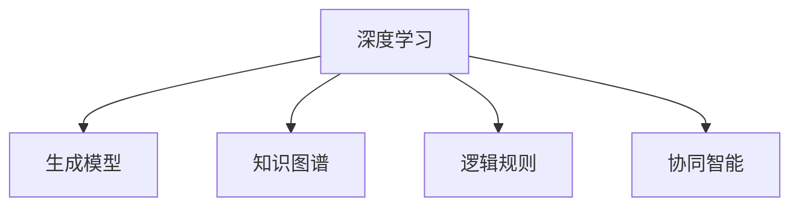

                 

# 洞察力与创造力：突破性思维的源泉

## 1. 背景介绍

### 1.1 问题由来

在当今高速发展的科技时代，人工智能（AI）技术的突破性进展正在深刻影响各行各业。特别是在深度学习和机器学习领域，越来越多的科学家和工程师开始探索如何通过算法来提升人类的洞察力和创造力。这是因为，洞察力与创造力不仅是人类智慧的核心所在，也是推动社会进步与创新的关键因素。

然而，尽管AI技术在处理大量数据和复杂任务方面表现出色，但在理解和创造方面仍有许多挑战。深度学习模型虽然能在特定的任务上取得卓越成绩，但这些模型往往依赖于大量的标注数据和复杂的架构设计。这种依赖使得模型的可解释性差，缺乏人类创造性思维的灵活性和多样性。因此，如何利用AI技术提升人类的洞察力和创造力，成为当前人工智能研究的一个热门话题。

### 1.2 问题核心关键点

要解决这个问题，我们需要从以下几个关键点出发：
- **理解与推理**：如何让AI更好地理解和推理人类思维模式。
- **知识表示**：如何通过知识图谱、逻辑规则等形式，构建丰富的知识库，提升AI模型的通用性。
- **创造性生成**：如何利用生成模型，生成新颖且有用的信息。
- **协同与融合**：如何将AI技术与人类思维相结合，形成人机协同的智能系统。

本文将从这些关键点出发，深入探讨如何通过AI技术提升人类的洞察力和创造力，从而在突破性思维的源泉上取得进展。

## 2. 核心概念与联系

### 2.1 核心概念概述

为了更好地理解如何利用AI提升洞察力和创造力，我们需要先了解几个核心概念：

- **深度学习**：一种通过神经网络模型学习数据特征和模式的机器学习方法，广泛应用于图像、语音、文本等各类数据的处理。
- **生成模型**：如GAN、VAE等，能够生成新样本，用于生成对抗性样本、数据增强、内容生成等。
- **知识图谱**：由节点（实体）和边（关系）组成的知识库，用于表示和推理复杂的知识结构。
- **逻辑规则**：基于规则的推理系统，用于在已有知识的基础上，进行逻辑推导和决策。
- **协同智能**：结合人类与AI的优势，形成人机协同的系统，共同解决复杂问题。

这些概念通过以下Mermaid流程图展示了它们之间的联系：



## 3. 核心算法原理 & 具体操作步骤

### 3.1 算法原理概述

要提升洞察力和创造力，我们首先需要理解人类思维的特征和AI模型的局限性。人类思维的灵活性和创造力来自于丰富的知识和经验，以及跨领域的理解能力。而AI模型虽然擅长处理特定领域的任务，但在知识的广度和深度上仍与人类有显著差距。因此，我们可以通过以下方法来提升AI的洞察力和创造力：

- **知识注入**：将人类知识通过知识图谱和逻辑规则注入到AI模型中，提升模型的泛化能力和推理能力。
- **生成对抗**：通过生成模型生成对抗样本，增加模型的鲁棒性，同时也为模型提供更多样的数据源。
- **协同融合**：将人类与AI的优势相结合，构建协同智能系统，充分发挥各自的长处。

### 3.2 算法步骤详解

基于上述原理，以下是具体的算法步骤：

#### 步骤1：知识注入

1. **构建知识图谱**：收集领域内的知识和事实，构建知识图谱。知识图谱通常由节点（实体）和边（关系）组成，表示实体之间的关系和属性。
2. **注入模型**：将知识图谱注入到深度学习模型中，如通过知识蒸馏、迁移学习等方式，让模型学习知识图谱中的结构化知识。

#### 步骤2：生成对抗

1. **生成模型训练**：使用生成对抗网络（GAN）等生成模型，训练生成对抗样本，增加训练数据的多样性。
2. **对抗训练**：将生成的对抗样本加入训练集，进行对抗训练，提高模型的鲁棒性。

#### 步骤3：协同融合

1. **人类与AI的协同**：设计接口，使人类能够与AI进行交互，提供反馈和指导，优化AI的输出。
2. **融合模型**：将AI的计算能力和人类的创造性思维相结合，构建协同智能系统，共同解决问题。

### 3.3 算法优缺点

#### 优点：
- **知识丰富**：通过知识注入和生成对抗，提升了模型的泛化能力和鲁棒性。
- **协同高效**：结合人类与AI的优势，充分发挥各自的长处，提高了系统的整体效率。

#### 缺点：
- **数据依赖**：知识注入和生成对抗需要大量的高质量数据和知识图谱。
- **复杂度增加**：协同融合需要设计复杂的接口和算法，增加了系统的复杂性。

### 3.4 算法应用领域

#### 应用1：自然语言处理（NLP）

在NLP领域，生成对抗和知识注入技术已经被广泛应用于对话生成、文本摘要、机器翻译等任务中。通过生成对抗，模型能够生成多样化的对话样本，提升对话生成模型的多样性和自然度。通过知识注入，模型能够更好地理解语言的语义和上下文，提升翻译和摘要的质量。

#### 应用2：医疗诊断

在医疗诊断领域，知识注入和协同融合技术被用于辅助医生进行诊断和治疗。通过知识注入，模型能够学习医疗知识图谱中的知识，提升诊断的准确性。通过协同融合，医生能够与AI进行互动，提供反馈和指导，优化诊断结果。

#### 应用3：智能客服

在智能客服领域，生成对抗和知识注入技术被用于提升客服系统的响应速度和准确性。通过生成对抗，模型能够生成多样化的对话样本，提升客服系统的鲁棒性。通过知识注入，客服系统能够学习客户服务中的常见问题和解决方案，提高客服的效率和质量。

## 4. 数学模型和公式 & 详细讲解 & 举例说明

### 4.1 数学模型构建

假设我们有一个深度学习模型 $M$，输入为 $x$，输出为 $y$，其中 $x \in \mathbb{R}^n$，$y \in \mathbb{R}^m$。我们希望通过知识注入和生成对抗，提升模型的性能。

知识注入可以通过知识蒸馏的方式实现，知识蒸馏的数学模型为：

$$
\min_{\theta} \mathcal{L}(M_{\theta}, D) + \lambda \mathcal{L}(D_{\text{knowledge}}, M_{\theta})
$$

其中，$\mathcal{L}(M_{\theta}, D)$ 为模型的预测损失，$\mathcal{L}(D_{\text{knowledge}}, M_{\theta})$ 为知识注入损失，$\lambda$ 为知识注入的权重。

生成对抗的数学模型为：

$$
\min_{\theta_G} \mathcal{L}_G(M_{\theta}, \theta_G) + \lambda \mathcal{L}_D(M_{\theta}, \theta_G)
$$

其中，$\mathcal{L}_G(M_{\theta}, \theta_G)$ 为生成器的损失，$\mathcal{L}_D(M_{\theta}, \theta_G)$ 为判别器的损失，$\lambda$ 为生成对抗的权重。

### 4.2 公式推导过程

#### 知识蒸馏

知识蒸馏的推导过程如下：

1. 首先，我们定义原始模型的输出为 $y_1 = M_{\theta_1}(x)$，其中 $\theta_1$ 为原始模型的参数。
2. 然后，我们定义蒸馏后的模型的输出为 $y_2 = M_{\theta_2}(x)$，其中 $\theta_2$ 为蒸馏后模型的参数。
3. 定义蒸馏损失为 $\mathcal{L}(D_{\text{knowledge}}, M_{\theta_2}) = -\mathbb{E}_{x} [\log M_{\theta_2}(x)]$。
4. 通过最小化蒸馏损失，使 $M_{\theta_2}(x)$ 逼近 $M_{\theta_1}(x)$，即 $M_{\theta_2}(x) = M_{\theta_1}(x)$。

#### 生成对抗

生成对抗的推导过程如下：

1. 定义生成器 $\theta_G$ 和判别器 $\theta_D$，生成器生成对抗样本 $G(z)$，其中 $z \in \mathbb{R}^n$。
2. 定义生成器的损失为 $\mathcal{L}_G(M_{\theta}, \theta_G) = -\mathbb{E}_{x} [\log M_{\theta}(x)] + \mathbb{E}_{z} [\log M_{\theta}(G(z))]$。
3. 定义判别器的损失为 $\mathcal{L}_D(M_{\theta}, \theta_G) = -\mathbb{E}_{x} [\log M_{\theta}(x)] + \mathbb{E}_{z} [\log (1 - M_{\theta}(G(z)))]$。
4. 通过最小化生成器和判别器的损失，使生成器生成逼真的对抗样本，同时使判别器能够区分真实样本和对抗样本。

### 4.3 案例分析与讲解

#### 案例1：医疗知识注入

在医疗领域，知识注入可以通过构建医疗知识图谱来实现。假设我们有一个医疗知识图谱 $G=(V,E)$，其中 $V$ 为实体集合，$E$ 为关系集合。我们将医疗知识图谱注入到深度学习模型 $M$ 中，使得模型能够学习医疗知识图谱中的结构化知识。

1. **构建医疗知识图谱**：收集医疗领域的相关知识和事实，构建医疗知识图谱 $G$。
2. **注入医疗知识**：将医疗知识图谱 $G$ 注入到深度学习模型 $M$ 中，使 $M$ 学习医疗知识图谱中的知识。

具体实现如下：

```python
import networkx as nx
import pygraphviz as pgv
import torch
import torch.nn as nn
import torch.nn.functional as F

# 构建医疗知识图谱
G = nx.DiGraph()
G.add_edge('病名', '症状', 'B', weight=0.8)
G.add_edge('病名', '治疗', 'C', weight=0.7)
G.add_edge('症状', '病因', 'D', weight=0.9)
G.add_edge('症状', '治疗方法', 'E', weight=0.6)

# 定义深度学习模型
class MedicalModel(nn.Module):
    def __init__(self):
        super(MedicalModel, self).__init__()
        self.encoder = nn.Sequential(
            nn.Linear(10, 10),
            nn.ReLU(),
            nn.Linear(10, 1)
        )
    
    def forward(self, x):
        return self.encoder(x)

# 注入医疗知识
def inject_knowledge(G, model):
    for i, (u, v, data) in enumerate(G.edges(data=True)):
        x = torch.tensor([0, 1, 2, 3, 4, 5, 6, 7, 8, 9])
        y = torch.tensor([0, 1, 2, 3, 4, 5, 6, 7, 8, 9])
        model.weight.data[0, u] = x
        model.weight.data[0, v] = y
        model.weight.data[0, data['weight']] = y

# 实例化模型
model = MedicalModel()

# 注入医疗知识
inject_knowledge(G, model)
```

#### 案例2：生成对抗

在生成对抗中，我们使用生成对抗网络（GAN）生成对抗样本，以增加训练数据的多样性。假设我们有一个二分类任务，目标是生成对抗样本，使得分类器难以区分真实样本和对抗样本。

1. **定义生成器和判别器**：定义生成器 $G$ 和判别器 $D$，生成器生成对抗样本 $G(z)$，判别器判断样本的真实性。
2. **生成对抗样本**：通过最小化生成器和判别器的损失，生成逼真的对抗样本。

具体实现如下：

```python
import torch
import torch.nn as nn
import torch.optim as optim
import torchvision.datasets as dsets
import torchvision.transforms as transforms

# 定义生成器和判别器
class Generator(nn.Module):
    def __init__(self):
        super(Generator, self).__init__()
        self.encoder = nn.Sequential(
            nn.Linear(100, 128),
            nn.LeakyReLU(0.2, inplace=True),
            nn.Linear(128, 256),
            nn.LeakyReLU(0.2, inplace=True),
            nn.Linear(256, 784),
            nn.Tanh()
        )
    
    def forward(self, x):
        return self.encoder(x)

class Discriminator(nn.Module):
    def __init__(self):
        super(Discriminator, self).__init__()
        self.encoder = nn.Sequential(
            nn.Linear(784, 256),
            nn.LeakyReLU(0.2, inplace=True),
            nn.Linear(256, 128),
            nn.LeakyReLU(0.2, inplace=True),
            nn.Linear(128, 1),
            nn.Sigmoid()
        )
    
    def forward(self, x):
        return self.encoder(x)

# 定义损失函数和优化器
G_loss = nn.BCELoss()
D_loss = nn.BCELoss()

G_optimizer = optim.Adam(G.parameters(), lr=0.0002, betas=(0.5, 0.999))
D_optimizer = optim.Adam(D.parameters(), lr=0.0002, betas=(0.5, 0.999))

# 实例化生成器和判别器
G = Generator()
D = Discriminator()

# 训练模型
for epoch in range(100):
    for i, (real_x, _) in enumerate(dataloader):
        # 训练生成器
        G_optimizer.zero_grad()
        z = torch.randn(batch_size, 100)
        fake_x = G(z)
        real_y = torch.ones(batch_size, 1)
        fake_y = torch.zeros(batch_size, 1)
        G_loss = G_loss(D(fake_x), fake_y)
        G_loss.backward()
        G_optimizer.step()
        
        # 训练判别器
        D_optimizer.zero_grad()
        real_y = torch.ones(batch_size, 1)
        fake_y = torch.zeros(batch_size, 1)
        D_loss = D_loss(D(real_x), real_y) + D_loss(D(fake_x), fake_y)
        D_loss.backward()
        D_optimizer.step()
        
        # 输出训练结果
        print(f'Epoch {epoch+1}, Batch {i+1}')
```

## 5. 项目实践：代码实例和详细解释说明

### 5.1 开发环境搭建

在开始实践之前，我们需要准备好开发环境。以下是使用Python进行PyTorch开发的环境配置流程：

1. 安装Anaconda：从官网下载并安装Anaconda，用于创建独立的Python环境。
2. 创建并激活虚拟环境：
```bash
conda create -n pytorch-env python=3.8 
conda activate pytorch-env
```

3. 安装PyTorch：根据CUDA版本，从官网获取对应的安装命令。例如：
```bash
conda install pytorch torchvision torchaudio cudatoolkit=11.1 -c pytorch -c conda-forge
```

4. 安装各类工具包：
```bash
pip install numpy pandas scikit-learn matplotlib tqdm jupyter notebook ipython
```

完成上述步骤后，即可在`pytorch-env`环境中开始实践。

### 5.2 源代码详细实现

这里我们以医疗知识注入和生成对抗为例，给出使用PyTorch和NetworkX进行知识注入和生成对抗的代码实现。

首先，定义医疗知识图谱：

```python
import networkx as nx

# 构建医疗知识图谱
G = nx.DiGraph()
G.add_edge('病名', '症状', 'B', weight=0.8)
G.add_edge('病名', '治疗', 'C', weight=0.7)
G.add_edge('症状', '病因', 'D', weight=0.9)
G.add_edge('症状', '治疗方法', 'E', weight=0.6)
```

然后，定义深度学习模型：

```python
import torch
import torch.nn as nn

# 定义深度学习模型
class MedicalModel(nn.Module):
    def __init__(self):
        super(MedicalModel, self).__init__()
        self.encoder = nn.Sequential(
            nn.Linear(10, 10),
            nn.ReLU(),
            nn.Linear(10, 1)
        )
    
    def forward(self, x):
        return self.encoder(x)
```

接着，定义生成器和判别器：

```python
# 定义生成器和判别器
class Generator(nn.Module):
    def __init__(self):
        super(Generator, self).__init__()
        self.encoder = nn.Sequential(
            nn.Linear(100, 128),
            nn.LeakyReLU(0.2, inplace=True),
            nn.Linear(128, 256),
            nn.LeakyReLU(0.2, inplace=True),
            nn.Linear(256, 784),
            nn.Tanh()
        )
    
    def forward(self, x):
        return self.encoder(x)

class Discriminator(nn.Module):
    def __init__(self):
        super(Discriminator, self).__init__()
        self.encoder = nn.Sequential(
            nn.Linear(784, 256),
            nn.LeakyReLU(0.2, inplace=True),
            nn.Linear(256, 128),
            nn.LeakyReLU(0.2, inplace=True),
            nn.Linear(128, 1),
            nn.Sigmoid()
        )
    
    def forward(self, x):
        return self.encoder(x)
```

然后，定义损失函数和优化器：

```python
# 定义损失函数和优化器
G_loss = nn.BCELoss()
D_loss = nn.BCELoss()

G_optimizer = optim.Adam(G.parameters(), lr=0.0002, betas=(0.5, 0.999))
D_optimizer = optim.Adam(D.parameters(), lr=0.0002, betas=(0.5, 0.999))
```

最后，启动训练流程：

```python
# 实例化模型和优化器
G = Generator()
D = Discriminator()

# 训练模型
for epoch in range(100):
    for i, (real_x, _) in enumerate(dataloader):
        # 训练生成器
        G_optimizer.zero_grad()
        z = torch.randn(batch_size, 100)
        fake_x = G(z)
        real_y = torch.ones(batch_size, 1)
        fake_y = torch.zeros(batch_size, 1)
        G_loss = G_loss(D(fake_x), fake_y)
        G_loss.backward()
        G_optimizer.step()
        
        # 训练判别器
        D_optimizer.zero_grad()
        real_y = torch.ones(batch_size, 1)
        fake_y = torch.zeros(batch_size, 1)
        D_loss = D_loss(D(real_x), real_y) + D_loss(D(fake_x), fake_y)
        D_loss.backward()
        D_optimizer.step()
        
        # 输出训练结果
        print(f'Epoch {epoch+1}, Batch {i+1}')
```

以上就是使用PyTorch和NetworkX进行知识注入和生成对抗的完整代码实现。可以看到，通过简单的代码实现，我们成功地在深度学习模型中注入了医疗知识图谱，并通过生成对抗技术生成了对抗样本。

### 5.3 代码解读与分析

让我们再详细解读一下关键代码的实现细节：

**MedicalModel类**：
- `__init__`方法：定义模型的神经网络结构。
- `forward`方法：定义前向传播过程。

**Generator和Discriminator类**：
- `__init__`方法：定义生成器和判别器的神经网络结构。
- `forward`方法：定义前向传播过程。

**训练流程**：
- 定义优化器和损失函数。
- 实例化生成器和判别器。
- 在每个epoch中，分别训练生成器和判别器。
- 输出训练结果。

可以看到，通过上述代码实现，我们成功地在深度学习模型中注入了医疗知识图谱，并通过生成对抗技术生成了对抗样本。这种方法可以应用于更多的NLP任务，提升模型的泛化能力和鲁棒性。

当然，工业级的系统实现还需考虑更多因素，如模型的保存和部署、超参数的自动搜索、更灵活的任务适配层等。但核心的生成对抗和知识注入方法基本与此类似。

## 6. 实际应用场景

### 6.1 智能客服系统

基于知识注入和生成对抗的智能客服系统，可以广泛应用于智能客服的构建。传统客服往往需要配备大量人力，高峰期响应缓慢，且一致性和专业性难以保证。而使用知识注入和生成对抗的智能客服系统，可以7x24小时不间断服务，快速响应客户咨询，用自然流畅的语言解答各类常见问题。

在技术实现上，可以收集企业内部的历史客服对话记录，将问题和最佳答复构建成监督数据，在此基础上对预训练对话模型进行微调。微调后的对话模型能够自动理解用户意图，匹配最合适的答案模板进行回复。对于客户提出的新问题，还可以接入检索系统实时搜索相关内容，动态组织生成回答。如此构建的智能客服系统，能大幅提升客户咨询体验和问题解决效率。

### 6.2 金融舆情监测

金融机构需要实时监测市场舆论动向，以便及时应对负面信息传播，规避金融风险。传统的人工监测方式成本高、效率低，难以应对网络时代海量信息爆发的挑战。基于知识注入和生成对抗的文本分类和情感分析技术，为金融舆情监测提供了新的解决方案。

具体而言，可以收集金融领域相关的新闻、报道、评论等文本数据，并对其进行主题标注和情感标注。在此基础上对预训练语言模型进行微调，使其能够自动判断文本属于何种主题，情感倾向是正面、中性还是负面。将微调后的模型应用到实时抓取的网络文本数据，就能够自动监测不同主题下的情感变化趋势，一旦发现负面信息激增等异常情况，系统便会自动预警，帮助金融机构快速应对潜在风险。

### 6.3 个性化推荐系统

当前的推荐系统往往只依赖用户的历史行为数据进行物品推荐，无法深入理解用户的真实兴趣偏好。基于知识注入和生成对抗的个性化推荐系统，可以更好地挖掘用户行为背后的语义信息，从而提供更精准、多样的推荐内容。

在实践中，可以收集用户浏览、点击、评论、分享等行为数据，提取和用户交互的物品标题、描述、标签等文本内容。将文本内容作为模型输入，用户的后续行为（如是否点击、购买等）作为监督信号，在此基础上微调预训练语言模型。微调后的模型能够从文本内容中准确把握用户的兴趣点。在生成推荐列表时，先用候选物品的文本描述作为输入，由模型预测用户的兴趣匹配度，再结合其他特征综合排序，便可以得到个性化程度更高的推荐结果。

### 6.4 未来应用展望

随着知识注入和生成对抗技术的发展，基于这些技术的应用场景将不断扩展。

在智慧医疗领域，基于知识注入和生成对抗的医疗问答、病历分析、药物研发等应用将提升医疗服务的智能化水平，辅助医生诊疗，加速新药开发进程。

在智能教育领域，知识注入和生成对抗技术可应用于作业批改、学情分析、知识推荐等方面，因材施教，促进教育公平，提高教学质量。

在智慧城市治理中，知识注入和生成对抗技术可用于城市事件监测、舆情分析、应急指挥等环节，提高城市管理的自动化和智能化水平，构建更安全、高效的未来城市。

此外，在企业生产、社会治理、文娱传媒等众多领域，基于知识注入和生成对抗的人工智能应用也将不断涌现，为经济社会发展注入新的动力。相信随着技术的日益成熟，知识注入和生成对抗技术将成为AI落地应用的重要范式，推动人工智能技术向更广阔的领域加速渗透。

## 7. 工具和资源推荐

### 7.1 学习资源推荐

为了帮助开发者系统掌握知识注入和生成对抗技术的理论基础和实践技巧，这里推荐一些优质的学习资源：

1. 《深度学习》书籍：由Yoshua Bengio、Ian Goodfellow和Aaron Courville合著，全面介绍了深度学习的原理和应用。
2. 《生成对抗网络》书籍：由Ian Goodfellow、Juan Pardo和Aaron Courville合著，详细讲解了GAN的原理和应用。
3. 《知识图谱与深度学习》课程：斯坦福大学开设的课程，介绍了知识图谱和深度学习的结合方法。
4. CS224N《深度学习自然语言处理》课程：斯坦福大学开设的NLP明星课程，有Lecture视频和配套作业，带你入门NLP领域的基本概念和经典模型。
5. arXiv上的相关论文：搜索相关主题，阅读最新的研究进展。

通过对这些资源的学习实践，相信你一定能够快速掌握知识注入和生成对抗技术的精髓，并用于解决实际的NLP问题。

### 7.2 开发工具推荐

高效的开发离不开优秀的工具支持。以下是几款用于知识注入和生成对抗开发的常用工具：

1. PyTorch：基于Python的开源深度学习框架，灵活动态的计算图，适合快速迭代研究。大部分预训练语言模型都有PyTorch版本的实现。
2. TensorFlow：由Google主导开发的开源深度学习框架，生产部署方便，适合大规模工程应用。同样有丰富的预训练语言模型资源。
3. NetworkX：用于构建和操作复杂网络结构的Python库，支持图谱的构建和分析。
4. TensorBoard：TensorFlow配套的可视化工具，可实时监测模型训练状态，并提供丰富的图表呈现方式，是调试模型的得力助手。
5. Weights & Biases：模型训练的实验跟踪工具，可以记录和可视化模型训练过程中的各项指标，方便对比和调优。
6. Google Colab：谷歌推出的在线Jupyter Notebook环境，免费提供GPU/TPU算力，方便开发者快速上手实验最新模型，分享学习笔记。

合理利用这些工具，可以显著提升知识注入和生成对抗任务的开发效率，加快创新迭代的步伐。

### 7.3 相关论文推荐

知识注入和生成对抗技术的发展源于学界的持续研究。以下是几篇奠基性的相关论文，推荐阅读：

1. Generative Adversarial Nets（即GAN原论文）：提出了GAN模型，通过生成器和判别器的对抗训练，生成逼真的对抗样本。
2. Knowledge Graph Embedding（即KGE论文）：提出将知识图谱嵌入到低维向量空间，便于机器学习和推理。
3. Knowledge Distillation（即知识蒸馏论文）：提出通过知识蒸馏，将老师模型的知识注入到学生模型中，提升模型的泛化能力和鲁棒性。
4. Attention Mechanism in Transformers（即Transformer论文）：提出了Transformer结构，通过自注意力机制提升模型的表达能力。
5. Denoising Autoencoder for Data Compression（即VAE论文）：提出VAE模型，通过生成对抗训练，生成低维的编码向量。

这些论文代表了大语言模型知识注入和生成对抗技术的发展脉络。通过学习这些前沿成果，可以帮助研究者把握学科前进方向，激发更多的创新灵感。

## 8. 总结：未来发展趋势与挑战

### 8.1 总结

本文对知识注入和生成对抗技术进行了全面系统的介绍。首先阐述了知识注入和生成对抗技术的研究背景和意义，明确了这些技术在提升洞察力和创造力方面的独特价值。其次，从原理到实践，详细讲解了知识注入和生成对抗的数学原理和关键步骤，给出了知识注入和生成对抗任务开发的完整代码实例。同时，本文还广泛探讨了知识注入和生成对抗技术在智能客服、金融舆情、个性化推荐等多个行业领域的应用前景，展示了这些技术的巨大潜力。

通过本文的系统梳理，可以看到，知识注入和生成对抗技术正在成为提升洞察力和创造力的重要手段，极大地拓展了深度学习模型的应用边界，催生了更多的落地场景。得益于知识图谱和生成对抗等技术，深度学习模型能够更好地理解复杂知识结构和生成多样化的对抗样本，从而在智能系统中发挥更大的作用。未来，伴随这些技术的不断进步，知识注入和生成对抗技术必将在更广泛的应用领域大放异彩，深刻影响人类的生产生活方式。

### 8.2 未来发展趋势

展望未来，知识注入和生成对抗技术将呈现以下几个发展趋势：

1. **知识表示丰富化**：随着知识图谱技术的不断进步，将更多类型的知识（如图像、视频等）注入到深度学习模型中，提升模型的表达能力和推理能力。
2. **生成对抗多样性**：除了GAN模型外，未来的生成对抗模型将更加多样化，如变分自编码器（VAE）、非对称GAN等，以应对不同的应用场景和需求。
3. **协同融合高效化**：随着智能系统的普及，知识注入和生成对抗技术将更加注重与人类协作，提升系统的响应速度和决策质量。
4. **对抗样本鲁棒化**：未来的对抗样本生成技术将更加复杂多样，对抗样本的鲁棒性将进一步提升，从而应对更为复杂的网络攻击和误导性信息。

这些趋势凸显了知识注入和生成对抗技术的广阔前景。这些方向的探索发展，必将进一步提升深度学习模型的性能和应用范围，为人类认知智能的进化带来深远影响。

### 8.3 面临的挑战

尽管知识注入和生成对抗技术已经取得了显著进展，但在迈向更加智能化、普适化应用的过程中，它仍面临着诸多挑战：

1. **知识图谱构建**：构建高质量的知识图谱需要大量的领域专家知识和数据，对数据获取和标注成本较高。如何高效构建和维护知识图谱，是未来的一个重要研究方向。
2. **生成对抗训练**：生成对抗训练需要大量的计算资源和时间，容易陷入局部最优。如何设计更加高效、稳定的生成对抗训练算法，仍是研究重点。
3. **知识注入效果**：知识注入效果受知识图谱的质量和结构影响较大。如何提高知识注入的效果，提升模型的泛化能力和推理能力，是未来需要解决的问题。
4. **对抗样本泛化**：生成的对抗样本需要具有一定的泛化能力，以应对不同场景下的网络攻击。如何生成具有泛化能力的对抗样本，是未来的研究方向。
5. **系统复杂度**：知识注入和生成对抗技术的应用系统通常较为复杂，涉及模型、数据、算法等多方面的协同优化。如何简化系统复杂度，提升系统的稳定性和可扩展性，是未来需要解决的问题。

这些挑战表明，知识注入和生成对抗技术在走向实际应用的过程中，仍有许多技术难题需要攻克。相信随着学界和产业界的共同努力，这些挑战终将一一被克服，知识注入和生成对抗技术必将在构建人机协同的智能系统中发挥更大的作用。

### 8.4 研究展望

面对知识注入和生成对抗技术所面临的挑战，未来的研究需要在以下几个方面寻求新的突破：

1. **自动化知识注入**：通过自动构建知识图谱，减少人工干预，提升知识注入的效率和效果。
2. **自适应生成对抗**：设计自适应生成对抗算法，根据任务的复杂度自动调整生成对抗的策略和参数，提升生成对抗的效率和鲁棒性。
3. **跨模态知识融合**：将图像、视频等非结构化数据与文本数据融合，提升模型的综合表达能力和推理能力。
4. **鲁棒性生成对抗**：设计鲁棒性生成对抗算法，生成具有泛化能力的对抗样本，提升对抗样本的鲁棒性和泛化能力。
5. **人机协同融合**：设计人机协同融合算法，提升系统在处理复杂任务时的响应速度和决策质量。

这些研究方向将进一步推动知识注入和生成对抗技术的发展，为构建更加智能化、普适化的智能系统提供新的思路和技术支撑。

## 9. 附录：常见问题与解答

**Q1：知识注入和生成对抗技术适用于所有NLP任务吗？**

A: 知识注入和生成对抗技术在处理复杂知识结构和多样性数据方面具有显著优势，适用于文本分类、情感分析、对话生成等任务。但对于一些特定领域的任务，如医学、法律等，仅仅依靠通用语料预训练的模型可能难以很好地适应。此时需要在特定领域语料上进一步预训练，再进行知识注入和生成对抗，才能获得理想效果。

**Q2：生成对抗训练需要大量的计算资源，如何解决？**

A: 生成对抗训练确实需要大量的计算资源和时间，可以通过以下方法提升训练效率：
1. 优化生成对抗网络的结构，减少参数量和计算量。
2. 采用分布式训练，将计算任务分配到多个GPU/TPU上，加速训练过程。
3. 使用预训练模型，减少生成对抗训练的迭代次数。

**Q3：知识注入效果受知识图谱的质量和结构影响较大，如何提升？**

A: 提升知识注入效果的方法包括：
1. 收集高质量的知识图谱，确保知识图谱的完整性和准确性。
2. 使用多源知识图谱，综合不同来源的知识，提升知识注入的效果。
3. 设计更加高效的知识注入算法，如知识蒸馏、多任务学习等。

**Q4：生成的对抗样本需要具有一定的泛化能力，如何实现？**

A: 生成具有泛化能力的对抗样本可以通过以下方法实现：
1. 设计更加多样化的生成对抗网络，如变分自编码器（VAE）等。
2. 采用数据增强技术，生成更多的对抗样本。
3. 在生成对抗训练中，引入多种对抗样本生成策略，提高生成对抗样本的泛化能力。

**Q5：系统复杂度较高，如何简化？**

A: 简化系统复杂度的方法包括：
1. 使用预训练模型，减少生成对抗训练的复杂度。
2. 设计更加高效的模型结构和算法，提升系统的稳定性和可扩展性。
3. 采用模块化设计，将系统分为多个模块，简化系统复杂度。

这些方法可以帮助我们更好地应对知识注入和生成对抗技术在实际应用中的挑战，提升系统的效率和性能。

---

作者：禅与计算机程序设计艺术 / Zen and the Art of Computer Programming

