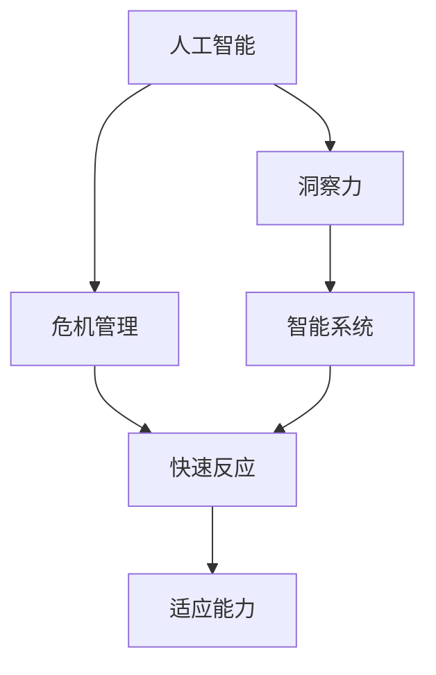

                 

# 洞察力与危机管理：快速反应与适应的能力

> 关键词：洞察力, 危机管理, 快速反应, 适应能力, 危机决策, 人工智能, 智能系统

## 1. 背景介绍

### 1.1 问题由来
在快速发展的数字化时代，企业面临的市场环境日趋复杂，不确定性因素增加。传统的基于经验和直觉的决策方式，已经难以应对突发的危机事件。如何在复杂环境中迅速、准确地做出决策，成为了现代企业需要解决的重要课题。

随着人工智能(AI)技术的兴起，越来越多的企业开始利用AI技术提升其危机应对能力。AI驱动的洞察力和决策支持系统，能够在短时间内收集、分析和预测大量数据，为管理层提供有效的决策支持。但同时，AI技术自身也存在局限性，需要与人类智慧相结合，才能更好地应对危机。

### 1.2 问题核心关键点
本文聚焦于基于AI的洞察力和危机管理系统，探讨了AI技术在危机管理中的应用，以及如何结合人类智慧，构建快速反应和适应能力强的智能系统。

### 1.3 问题研究意义
本文旨在通过深入分析AI在危机管理中的应用，为企业提供实际的危机应对策略和技术方案。AI技术能够在数据驱动下，提供快速、准确的洞察力，辅助管理者做出明智的决策。同时，本文还将介绍如何利用AI构建智能系统，提升组织的适应能力和应变速度。

## 2. 核心概念与联系

### 2.1 核心概念概述

为更好地理解AI在危机管理中的应用，本节将介绍几个关键概念：

- 人工智能(AI)：通过算法和模型，使计算机具备类似人类的智能。
- 洞察力：通过分析数据，揭示隐藏在数据背后的规律和趋势，辅助决策。
- 危机管理：企业在面对突发事件时，采取的一系列预防、应对和恢复措施。
- 智能系统：结合AI技术和人类智慧，实现自动化、智能化决策的软硬件系统。

这些概念之间的联系可以通过以下Mermaid流程图来展示：



这个流程图展示了AI、洞察力、危机管理和智能系统之间的逻辑关系：

1. AI技术通过数据分析提供洞察力，辅助危机管理。
2. 洞察力结合危机管理知识，提供快速反应的策略。
3. 智能系统整合AI和人类智慧，实现自动化决策。
4. 自动化决策通过快速反应和适应能力，提升组织应变速度。

这些概念共同构成了AI在危机管理中的核心框架，使企业能够更好地应对突发事件，保障业务的持续稳定。

## 3. 核心算法原理 & 具体操作步骤
### 3.1 算法原理概述

基于AI的洞察力和危机管理系统，本质上是一种数据驱动的决策支持系统。其核心思想是：利用AI技术分析大量数据，揭示出关键问题和潜在的危机信号，辅助管理者迅速制定应对策略，提升危机管理的效果。

形式化地，假设企业面临的危机事件为 $E$，已知的历史数据集为 $D=\{(x_i, y_i)\}_{i=1}^N$，其中 $x_i$ 为历史数据，$y_i$ 为对应标签（如是否发生了危机）。AI模型的目标是在数据集 $D$ 上进行训练，构建洞察力模型 $M_{\theta}$，使得模型能够根据当前数据 $x$ 预测事件 $E$ 的发生概率 $P(E|x)$。

通过梯度下降等优化算法，模型不断更新参数 $\theta$，最小化预测概率与实际发生情况之间的差异，即：

$$
\theta^* = \mathop{\arg\min}_{\theta} \mathcal{L}(M_{\theta},D)
$$

其中 $\mathcal{L}$ 为预测概率与真实标签之间的交叉熵损失函数。

### 3.2 算法步骤详解

基于AI的洞察力和危机管理系统一般包括以下几个关键步骤：

**Step 1: 准备数据集**
- 收集企业历史数据，包括财务、市场、运营等方面的数据。
- 对数据进行预处理和清洗，去除噪音和异常值。
- 将数据划分为训练集、验证集和测试集，确保模型在不同数据上的泛化性能。

**Step 2: 选择和训练洞察力模型**
- 根据数据类型和特征，选择合适的AI模型（如回归模型、分类模型、深度学习模型等）。
- 使用训练集数据对模型进行训练，优化模型参数。
- 在验证集上评估模型性能，调整超参数和模型结构。

**Step 3: 部署和集成**
- 将训练好的洞察力模型集成到企业的IT系统中。
- 在生产环境中，实时接收输入数据，并预测危机发生概率。
- 根据预测结果，自动触发预定的应对措施或通知。

**Step 4: 持续优化**
- 定期更新训练数据，保持模型的时效性。
- 监控模型在生产环境中的表现，收集反馈信息，进行模型微调。
- 引入新算法和新技术，不断提升模型性能和应用范围。

### 3.3 算法优缺点

基于AI的洞察力和危机管理系统具有以下优点：
1. 数据驱动决策。利用AI技术分析海量数据，提供客观、科学的决策支持。
2. 实时响应。通过实时数据输入，模型能够快速反应，迅速生成应对策略。
3. 高度定制化。可根据企业特定需求，定制化开发洞察力模型。
4. 可解释性强。AI模型的预测过程和逻辑可以被解释，便于审计和管理。

同时，该方法也存在一定的局限性：
1. 数据依赖性高。模型的性能很大程度上依赖于数据的质量和数量，数据采集和处理成本较高。
2. 模型复杂度。复杂的AI模型需要较长的训练时间和较大的计算资源，部署和维护成本较高。
3. 初始成本高。高质量洞察力模型的开发和集成需要较大的初始投资。
4. 动态适应性。AI模型难以适应突发变化和新的未知情况，需要人工干预和调整。

尽管存在这些局限性，但就目前而言，基于AI的洞察力和危机管理系统仍是大企业应对危机事件的主要手段。未来相关研究的重点在于如何进一步降低系统对数据和计算资源的依赖，提高系统的动态适应性和自学习能力。

### 3.4 算法应用领域

基于AI的洞察力和危机管理系统在多个行业领域已经得到了广泛应用，例如：

- 金融风险管理：通过实时监控市场数据，预测金融风险，辅助投资决策。
- 公共卫生应急响应：利用AI分析疫情数据，预测疫情发展趋势，优化资源配置。
- 网络安全监控：分析网络流量数据，识别潜在攻击行为，提前预防安全事件。
- 制造业供应链管理：实时监控供应链数据，预测供应链中断风险，优化供应链管理。
- 灾害预警系统：分析气象、地理等数据，预测自然灾害发生概率，提供预警信息。

除了上述这些经典应用外，AI洞察力和危机管理系统也被创新性地应用到更多场景中，如智能交通管理、智能建筑安防、智能物流等，为各类行业提供全面、系统的危机应对解决方案。

## 4. 数学模型和公式 & 详细讲解  
### 4.1 数学模型构建

本节将使用数学语言对基于AI的洞察力和危机管理系统的数学模型进行更加严格的刻画。

记洞察力模型为 $M_{\theta}:\mathcal{X} \rightarrow \mathcal{Y}$，其中 $\mathcal{X}$ 为输入空间，$\mathcal{Y}$ 为输出空间，$\theta \in \mathbb{R}^d$ 为模型参数。假设洞察力任务的数据集为 $D=\{(x_i,y_i)\}_{i=1}^N$，其中 $x_i$ 为历史数据，$y_i$ 为预测事件 $E$ 发生概率。

定义模型 $M_{\theta}$ 在数据样本 $(x,y)$ 上的损失函数为 $\ell(M_{\theta}(x),y)$，则在数据集 $D$ 上的经验风险为：

$$
\mathcal{L}(\theta) = \frac{1}{N}\sum_{i=1}^N \ell(M_{\theta}(x_i),y_i)
$$

其中 $\ell$ 为预测概率与真实标签之间的交叉熵损失函数。

### 4.2 公式推导过程

以下我们以二分类任务为例，推导交叉熵损失函数及其梯度的计算公式。

假设模型 $M_{\theta}$ 在输入 $x$ 上的输出为 $\hat{y}=M_{\theta}(x) \in [0,1]$，表示事件 $E$ 发生的概率。真实标签 $y \in \{0,1\}$。则二分类交叉熵损失函数定义为：

$$
\ell(M_{\theta}(x),y) = -[y\log \hat{y} + (1-y)\log (1-\hat{y})]
$$

将其代入经验风险公式，得：

$$
\mathcal{L}(\theta) = -\frac{1}{N}\sum_{i=1}^N [y_i\log M_{\theta}(x_i)+(1-y_i)\log(1-M_{\theta}(x_i))]
$$

根据链式法则，损失函数对参数 $\theta_k$ 的梯度为：

$$
\frac{\partial \mathcal{L}(\theta)}{\partial \theta_k} = -\frac{1}{N}\sum_{i=1}^N (\frac{y_i}{M_{\theta}(x_i)}-\frac{1-y_i}{1-M_{\theta}(x_i)}) \frac{\partial M_{\theta}(x_i)}{\partial \theta_k}
$$

其中 $\frac{\partial M_{\theta}(x_i)}{\partial \theta_k}$ 可进一步递归展开，利用自动微分技术完成计算。

### 4.3 案例分析与讲解

为了更好地理解基于AI的洞察力和危机管理系统，让我们以金融市场风险管理为例，进行具体案例分析。

**案例背景**：某大型银行需要对市场风险进行预测，以提前调整资产组合，规避潜在的风险损失。

**数据准备**：
- 收集过去5年的市场数据，包括股票价格、市场波动率、利率等。
- 对数据进行归一化处理，去除噪音和异常值。
- 将数据划分为训练集、验证集和测试集，确保模型在不同数据上的泛化性能。

**模型选择**：
- 根据数据类型和特征，选择使用LSTM模型进行风险预测。
- 使用训练集数据对LSTM模型进行训练，优化模型参数。

**模型评估**：
- 在验证集上评估模型性能，使用均方误差（MSE）作为损失函数。
- 调整超参数，如LSTM层数、学习率等，提升模型准确率。

**系统集成**：
- 将训练好的LSTM模型集成到银行的风险管理系统。
- 实时接收市场数据，预测市场波动率和金融风险。
- 根据预测结果，自动调整资产组合，降低风险损失。

**持续优化**：
- 定期更新训练数据，保持模型的时效性。
- 监控模型在生产环境中的表现，收集反馈信息，进行模型微调。
- 引入新的算法和数据源，不断提升模型性能和应用范围。

通过以上案例，我们可以看到，基于AI的洞察力和危机管理系统能够在复杂的金融市场中，通过数据分析提供科学的决策支持，帮助企业规避风险，实现稳健的金融管理。

## 5. 项目实践：代码实例和详细解释说明
### 5.1 开发环境搭建

在进行项目实践前，我们需要准备好开发环境。以下是使用Python进行TensorFlow开发的环境配置流程：

1. 安装Anaconda：从官网下载并安装Anaconda，用于创建独立的Python环境。

2. 创建并激活虚拟环境：
```bash
conda create -n tf-env python=3.8 
conda activate tf-env
```

3. 安装TensorFlow：根据CUDA版本，从官网获取对应的安装命令。例如：
```bash
conda install tensorflow tensorflow-gpu=2.7.0 -c tf -c conda-forge
```

4. 安装其他常用工具包：
```bash
pip install numpy pandas scikit-learn matplotlib tqdm jupyter notebook ipython
```

完成上述步骤后，即可在`tf-env`环境中开始项目实践。

### 5.2 源代码详细实现

下面我们以金融市场风险管理为例，给出使用TensorFlow进行LSTM模型微调的Python代码实现。

首先，定义数据预处理函数：

```python
import pandas as pd
import numpy as np
from sklearn.preprocessing import MinMaxScaler

def preprocess_data(data):
    # 将数据按时间降序排列
    data = data.sort_index(ascending=False)
    # 取前200个数据作为训练集
    train_data = data[:200]
    # 取后100个数据作为测试集
    test_data = data[200:]
    # 对数据进行归一化处理
    scaler = MinMaxScaler(feature_range=(0, 1))
    train_data = scaler.fit_transform(train_data)
    test_data = scaler.transform(test_data)
    return train_data, test_data
```

然后，定义模型和优化器：

```python
from tensorflow.keras.models import Sequential
from tensorflow.keras.layers import LSTM, Dense

model = Sequential()
model.add(LSTM(64, input_shape=(1, 1)))
model.add(Dense(1, activation='sigmoid'))

optimizer = tf.keras.optimizers.Adam(learning_rate=0.001)
```

接着，定义训练和评估函数：

```python
from tensorflow.keras.callbacks import EarlyStopping
from sklearn.metrics import mean_squared_error

def train_model(model, train_data, test_data, batch_size, epochs, optimizer):
    train_dataset = tf.data.Dataset.from_tensor_slices(train_data)
    train_dataset = train_dataset.batch(batch_size)
    model.compile(optimizer=optimizer, loss='mse', metrics=['mse'])
    early_stopping = EarlyStopping(monitor='val_loss', patience=5, restore_best_weights=True)
    model.fit(train_dataset, epochs=epochs, validation_data=test_data, callbacks=[early_stopping])
    train_mse = model.evaluate(train_dataset)[1]
    test_mse = model.evaluate(test_dataset)[1]
    return train_mse, test_mse

def evaluate_model(model, test_data):
    test_dataset = tf.data.Dataset.from_tensor_slices(test_data)
    test_dataset = test_dataset.batch(1)
    mse = model.evaluate(test_dataset)[1]
    return mse
```

最后，启动训练流程并在测试集上评估：

```python
epochs = 100
batch_size = 16

train_data, test_data = preprocess_data(df)
train_mse, test_mse = train_model(model, train_data, test_data, batch_size, epochs, optimizer)
print(f"Train MSE: {train_mse:.3f}")
print(f"Test MSE: {test_mse:.3f}")

mse = evaluate_model(model, test_data)
print(f"Test MSE: {mse:.3f}")
```

以上就是使用TensorFlow对LSTM模型进行金融市场风险管理微调的完整代码实现。可以看到，利用TensorFlow的高级API，可以很方便地构建和训练LSTM模型，并进行性能评估。

### 5.3 代码解读与分析

让我们再详细解读一下关键代码的实现细节：

**preprocess_data函数**：
- 将数据按时间降序排列，以确保时间序列的顺序性。
- 取前200个数据作为训练集，后100个数据作为测试集。
- 对数据进行归一化处理，将数据映射到0到1的范围内。

**模型构建**：
- 使用Sequential模型，添加一个LSTM层和一个全连接层。
- LSTM层的输入形状为(1, 1)，表示时间序列数据的形状。
- 全连接层的输出为1，使用sigmoid激活函数，确保输出在0到1之间。

**训练和评估函数**：
- 使用EarlyStopping回调函数，在验证集损失不再下降时停止训练。
- 使用均方误差（MSE）作为损失函数和评价指标。
- 在训练过程中，实时监测训练集和验证集的MSE，并保存最佳的权重。

**训练流程**：
- 定义训练集和测试集。
- 使用train_model函数进行模型训练，并返回训练集和测试集的MSE。
- 使用evaluate_model函数对测试集进行性能评估。
- 输出训练集和测试集的MSE，并打印最终的测试集MSE。

可以看到，TensorFlow提供了丰富的工具和API，使得LSTM模型的微调变得更加简单高效。开发者可以将更多精力放在数据处理和模型优化上，而不必过多关注底层的实现细节。

## 6. 实际应用场景
### 6.1 智能客服系统

基于AI的洞察力和危机管理系统，可以广泛应用于智能客服系统的构建。传统客服往往需要配备大量人力，高峰期响应缓慢，且一致性和专业性难以保证。而使用AI洞察力技术，可以7x24小时不间断服务，快速响应客户咨询，用自然流畅的语言解答各类常见问题。

在技术实现上，可以收集企业内部的历史客服对话记录，将问题和最佳答复构建成监督数据，在此基础上对预训练模型进行微调。微调后的模型能够自动理解用户意图，匹配最合适的答案模板进行回复。对于客户提出的新问题，还可以接入检索系统实时搜索相关内容，动态组织生成回答。如此构建的智能客服系统，能大幅提升客户咨询体验和问题解决效率。

### 6.2 公共卫生应急响应

AI洞察力和危机管理系统在公共卫生应急响应中也大有用武之地。传统的人工应急响应往往效率低下，难以快速应对突发疫情。而使用AI技术，可以实时分析疫情数据，预测疫情发展趋势，优化资源配置。

具体而言，可以收集疫情数据、医疗数据、气象数据等，并利用AI洞察力模型进行数据分析和预测。根据模型的预测结果，及时调整应急响应措施，如封闭区域、隔离人员、分发物资等。此外，AI系统还可以自动生成疫情报告，提供数据分析支持，帮助公共卫生部门做出科学的决策。

### 6.3 网络安全监控

AI洞察力和危机管理系统在网络安全监控中也有广泛应用。网络攻击和威胁层出不穷，传统的手动监控方式难以实时应对。而使用AI洞察力技术，可以实时分析网络流量数据，识别潜在攻击行为，提前预防安全事件。

具体而言，可以收集网络流量数据，并利用AI洞察力模型进行异常检测。模型可以分析数据特征，识别异常流量模式，自动报警并采取预防措施。此外，AI系统还可以自动生成安全报告，提供数据分析支持，帮助网络安全团队及时应对安全威胁。

### 6.4 未来应用展望

随着AI技术的发展，基于AI的洞察力和危机管理系统将在更多领域得到应用，为各行各业提供智能决策支持。

在智慧城市治理中，AI洞察力系统可以实时监控城市运行状态，预测突发事件，优化资源配置。在智慧农业中，AI洞察力系统可以实时分析气象数据和农情数据，预测农作物生长状态，优化种植方案。在智慧教育中，AI洞察力系统可以分析学生数据，预测学习行为，提供个性化推荐。

未来，基于AI的洞察力和危机管理系统将与更多领域进行融合，推动各行各业的数字化转型升级。借助AI技术，企业将能够更好地应对突发事件，提升决策效率，实现智能化管理。

## 7. 工具和资源推荐
### 7.1 学习资源推荐

为了帮助开发者系统掌握AI在危机管理中的应用，这里推荐一些优质的学习资源：

1. 《深度学习》课程：斯坦福大学开设的深度学习课程，涵盖深度学习的基本概念和算法，是学习AI的基础课程。
2. 《Python深度学习》书籍：由Francois Chollet撰写，详细介绍TensorFlow和Keras的使用，适合实战学习。
3. 《人工智能实战》书籍：由Google AI团队编写，涵盖AI技术的实际应用，适合动手实践。
4. Kaggle平台：数据科学和机器学习的竞赛平台，提供大量开源数据集和比赛案例，适合实战练习。
5. TensorFlow官方文档：详细介绍了TensorFlow的使用方法和API，是学习TensorFlow的必备资料。

通过对这些资源的学习实践，相信你一定能够快速掌握AI在危机管理中的应用，并用于解决实际的危机应对问题。

### 7.2 开发工具推荐

高效的开发离不开优秀的工具支持。以下是几款用于AI洞察力和危机管理系统开发的常用工具：

1. TensorFlow：由Google开发的深度学习框架，支持大规模分布式训练，适合复杂模型开发。
2. PyTorch：由Facebook开发的深度学习框架，灵活易用，适合快速原型开发。
3. Scikit-learn：Python的机器学习库，提供丰富的模型和算法，适合基础数据分析。
4. Pandas：Python的数据分析库，支持大规模数据处理和分析，适合数据预处理。
5. Jupyter Notebook：Python的交互式编程环境，适合快速迭代开发和数据可视化。

合理利用这些工具，可以显著提升AI洞察力和危机管理系统的开发效率，加快创新迭代的步伐。

### 7.3 相关论文推荐

AI洞察力和危机管理技术的发展源于学界的持续研究。以下是几篇奠基性的相关论文，推荐阅读：

1. 《Deep Learning for Business: An Introduction to Deep Learning in Business》：由Google AI团队编写，介绍了AI在商业领域的应用，包括危机管理。
2. 《Predicting Financial Crisis with Machine Learning》：利用机器学习预测金融危机，探讨了金融风险管理的AI技术。
3. 《A Survey on Network Intrusion Detection Systems》：综述了网络安全领域的研究现状，包括AI在异常检测中的应用。
4. 《Disaster Response by Predictive Analytics》：利用预测分析技术，实时监控灾害预警，优化应急响应措施。
5. 《Artificial Intelligence in Public Health: A Review》：综述了AI在公共卫生领域的应用，包括疫情预测、资源配置等。

这些论文代表了大AI在危机管理中的发展脉络。通过学习这些前沿成果，可以帮助研究者把握学科前进方向，激发更多的创新灵感。

## 8. 总结：未来发展趋势与挑战

### 8.1 总结

本文对基于AI的洞察力和危机管理系统进行了全面系统的介绍。首先阐述了AI技术在危机管理中的应用，明确了AI在数据驱动下提供科学决策的支持。其次，从原理到实践，详细讲解了洞察力模型的数学原理和关键步骤，给出了AI洞察力和危机管理系统的完整代码实现。同时，本文还广泛探讨了AI洞察力和危机管理系统在智能客服、公共卫生、网络安全等多个行业领域的应用前景，展示了AI技术在危机管理中的广阔应用空间。

通过本文的系统梳理，可以看到，基于AI的洞察力和危机管理系统能够为企业提供科学的决策支持，提升危机应对能力。未来，随着AI技术的不断发展，基于AI的洞察力和危机管理系统必将在更多领域得到应用，推动各行各业的数字化转型升级。

### 8.2 未来发展趋势

展望未来，基于AI的洞察力和危机管理系统将呈现以下几个发展趋势：

1. 模型自动化。未来的洞察力模型将更加自动化，能够根据环境变化动态调整模型结构和参数。
2. 多模态融合。未来的洞察力模型将支持多模态数据融合，将文本、图像、音频等多种信息源整合，提供更加全面的决策支持。
3. 自学习能力。未来的洞察力模型将具备自学习能力，能够不断从新数据中学习和改进，提升模型的泛化性能。
4. 跨领域应用。未来的洞察力模型将应用于更多领域，如智能交通、智慧能源、智能制造等，推动各行业的智能化管理。
5. 实时响应。未来的洞察力系统将具备实时响应能力，能够实时监控和预测突发事件，提供快速决策支持。
6. 伦理和隐私保护。未来的洞察力系统将更加注重伦理和隐私保护，确保数据使用的透明性和安全性。

以上趋势凸显了基于AI的洞察力和危机管理系统的广阔前景。这些方向的探索发展，必将进一步提升AI在危机管理中的应用效果，推动各行业的数字化转型升级。

### 8.3 面临的挑战

尽管基于AI的洞察力和危机管理系统已经取得了瞩目成就，但在迈向更加智能化、普适化应用的过程中，它仍面临着诸多挑战：

1. 数据质量和多样性。模型的性能很大程度上依赖于数据的质量和多样性，数据采集和处理成本较高。如何获取高质量、多样化的数据，是未来需要重点解决的问题。
2. 模型复杂度。复杂的AI模型需要较长的训练时间和较大的计算资源，部署和维护成本较高。如何优化模型结构，提升训练效率，是未来需要重点突破的方向。
3. 动态适应性。AI模型难以适应突发变化和新的未知情况，需要人工干预和调整。如何提升模型的动态适应性，增强模型对新场景的应对能力，是未来需要重点解决的问题。
4. 伦理和隐私保护。AI系统可能存在偏见和歧视，如何保证系统的公平性和透明性，确保数据使用的伦理和安全，是未来需要重点关注的问题。
5. 跨领域应用难度。不同领域的业务规则和数据源差异较大，如何将AI技术普适化，应用于更多领域，是未来需要重点突破的方向。
6. 系统集成难度。将AI洞察力和危机管理系统集成到现有系统中，需要考虑系统架构、数据源、接口等方面的问题，如何实现无缝集成，是未来需要重点解决的问题。

正视AI洞察力和危机管理系统面临的这些挑战，积极应对并寻求突破，将是大规模AI应用走向成熟的必由之路。相信随着学界和产业界的共同努力，这些挑战终将一一被克服，基于AI的洞察力和危机管理系统必将在构建智能社会中发挥更大的作用。

### 8.4 研究展望

面对基于AI的洞察力和危机管理系统所面临的种种挑战，未来的研究需要在以下几个方面寻求新的突破：

1. 探索无监督和半监督洞察力方法。摆脱对大规模标注数据的依赖，利用自监督学习、主动学习等无监督和半监督范式，最大限度利用非结构化数据，实现更加灵活高效的洞察力模型。
2. 研究参数高效和计算高效的洞察力范式。开发更加参数高效的洞察力方法，在固定大部分预训练参数的同时，只更新极少量的任务相关参数。同时优化洞察力模型的计算图，减少前向传播和反向传播的资源消耗，实现更加轻量级、实时性的部署。
3. 融合因果和对比学习范式。通过引入因果推断和对比学习思想，增强洞察力模型建立稳定因果关系的能力，学习更加普适、鲁棒的语言表征，从而提升模型泛化性和抗干扰能力。
4. 引入更多先验知识。将符号化的先验知识，如知识图谱、逻辑规则等，与神经网络模型进行巧妙融合，引导洞察力过程学习更准确、合理的语言模型。同时加强不同模态数据的整合，实现视觉、语音等多模态信息与文本信息的协同建模。
5. 结合因果分析和博弈论工具。将因果分析方法引入洞察力模型，识别出模型决策的关键特征，增强输出解释的因果性和逻辑性。借助博弈论工具刻画人机交互过程，主动探索并规避模型的脆弱点，提高系统稳定性。
6. 纳入伦理道德约束。在模型训练目标中引入伦理导向的评估指标，过滤和惩罚有偏见、有害的输出倾向。同时加强人工干预和审核，建立模型行为的监管机制，确保输出符合人类价值观和伦理道德。

这些研究方向的探索，必将引领基于AI的洞察力和危机管理系统迈向更高的台阶，为构建安全、可靠、可解释、可控的智能系统铺平道路。面向未来，基于AI的洞察力和危机管理系统还需要与其他人工智能技术进行更深入的融合，如知识表示、因果推理、强化学习等，多路径协同发力，共同推动智能交互系统的进步。只有勇于创新、敢于突破，才能不断拓展AI的边界，让智能技术更好地造福人类社会。

## 9. 附录：常见问题与解答

**Q1：AI洞察力和危机管理系统的核心优势是什么？**

A: AI洞察力和危机管理系统的核心优势在于：
1. 数据驱动决策。利用AI技术分析海量数据，提供客观、科学的决策支持。
2. 实时响应。通过实时数据输入，模型能够快速反应，迅速生成应对策略。
3. 高度定制化。可根据企业特定需求，定制化开发洞察力模型。
4. 可解释性强。AI模型的预测过程和逻辑可以被解释，便于审计和管理。

**Q2：如何选择合适的洞察力模型？**

A: 选择合适的洞察力模型需要考虑以下几个因素：
1. 数据类型和特征。不同类型的数据（如文本、图像、时间序列等）需要不同类型的模型（如LSTM、CNN、RNN等）。
2. 模型复杂度和计算资源。复杂的模型需要较长的训练时间和较大的计算资源，需要综合考虑企业的计算资源和训练时间。
3. 模型泛化性能。模型的泛化性能决定了其在未见过的数据上的表现，需要选择泛化性能较好的模型。
4. 模型应用场景。不同的应用场景需要不同的模型，需要根据具体应用场景进行选择。

**Q3：AI洞察力和危机管理系统在部署过程中需要注意哪些问题？**

A: 在将AI洞察力和危机管理系统部署到生产环境时，需要注意以下问题：
1. 模型裁剪和量化。去除不必要的层和参数，减小模型尺寸，加快推理速度。使用定点模型，压缩存储空间，提高计算效率。
2. 服务化封装。将模型封装为标准化服务接口，便于集成调用。
3. 弹性伸缩。根据请求流量动态调整资源配置，平衡服务质量和成本。
4. 监控告警。实时采集系统指标，设置异常告警阈值，确保服务稳定性。
5. 安全防护。采用访问鉴权、数据脱敏等措施，保障数据和模型安全。

这些问题是AI洞察力和危机管理系统在部署过程中需要重点关注的问题，需要系统性地进行考虑和解决。

**Q4：AI洞察力和危机管理系统如何在多领域应用？**

A: AI洞察力和危机管理系统在多领域应用需要考虑以下几个步骤：
1. 领域数据收集和清洗。收集领域内的数据，进行预处理和清洗，去除噪音和异常值。
2. 模型选择和训练。根据领域数据特点，选择适合的洞察力模型，并使用领域数据进行训练。
3. 模型集成和应用。将训练好的洞察力模型集成到业务系统中，进行实时监控和预测。
4. 持续优化和改进。定期更新模型，保持模型的时效性，收集反馈信息，进行模型微调。

在多领域应用中，需要根据具体领域的需求进行定制化开发，确保洞察力模型的泛化性能和应用效果。

**Q5：如何提高AI洞察力和危机管理系统的动态适应性？**

A: 提高AI洞察力和危机管理系统的动态适应性需要从以下几个方面进行：
1. 引入自适应学习算法。在模型训练过程中，引入自适应学习算法，使得模型能够动态调整参数和结构，适应新场景。
2. 数据持续更新。定期更新模型训练数据，使得模型能够及时学习新数据和新变化。
3. 多模型集成。构建多个洞察力模型，取平均输出，抑制过拟合，增强模型的鲁棒性和适应性。
4. 人工干预。在模型运行过程中，引入人工干预和调整，确保模型能够应对突发事件和未知情况。

通过以上方法，可以有效提高AI洞察力和危机管理系统的动态适应性，增强模型的鲁棒性和应用效果。

---

作者：禅与计算机程序设计艺术 / Zen and the Art of Computer Programming

