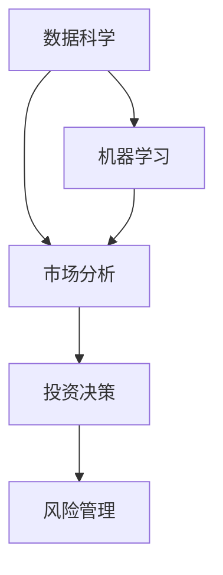

                 

# 洞察力与投资决策：市场机会的识别能力

> 关键词：数据科学，市场分析，投资决策，风险管理，机器学习

## 1. 背景介绍

在充满不确定性的市场中，投资者面临着决策的不确定性，如何从海量数据中提取关键信息，识别市场机会，成为决策过程中的核心问题。传统的市场分析方法依赖于经验丰富的分析师，但其对市场规律的认知受限于个人能力和经验。大数据和机器学习技术的兴起，使得投资者可以通过数据科学方法，提升市场机会的识别能力，实现更科学、高效的投资决策。

本文将系统介绍数据科学在市场机会识别中的应用，包括市场数据分析的原理、核心算法、操作步骤以及实际应用案例。通过深入了解市场分析的科学方法，帮助投资者提升市场洞察力和决策能力。

## 2. 核心概念与联系

### 2.1 核心概念概述

为更好地理解数据科学在市场分析中的应用，本节将介绍几个密切相关的核心概念：

- **数据科学(Data Science)**：利用统计学、机器学习和数据可视化等方法，从海量数据中提取有价值的信息和知识。
- **市场分析(Market Analysis)**：通过对市场数据的收集、整理和分析，发现市场的变化趋势、投资机会和潜在风险。
- **投资决策(Investment Decision)**：基于市场分析的结果，制定合理的投资策略，以最大化投资回报。
- **风险管理(Risk Management)**：在投资决策中考虑风险因素，采取措施减少投资损失。
- **机器学习(Machine Learning)**：通过算法和模型，从数据中学习和发现规律，实现自动化的预测和决策。

这些核心概念之间的逻辑关系可以通过以下Mermaid流程图来展示：



这个流程图展示了大数据科学在市场分析中的应用流程：

1. 数据科学提供数据处理和分析工具。
2. 机器学习基于数据科学的方法，发现市场规律和机会。
3. 市场分析综合机器学习的发现，进行深入分析和评估。
4. 投资决策基于市场分析的结果，制定投资策略。
5. 风险管理对投资决策进行风险评估和控制。

这些概念共同构成了数据科学在市场分析中的应用框架，使得投资者能够通过科学的方法，提高市场洞察力和决策能力。

## 3. 核心算法原理 & 具体操作步骤
### 3.1 算法原理概述

数据科学在市场分析中的应用，主要通过机器学习算法，对市场数据进行特征提取、模型训练和预测，从而发现市场机会。其核心算法包括但不限于：

- 特征选择(Feature Selection)：从市场数据中筛选出对市场变化有显著影响的特征，以提高模型预测的准确性。
- 时间序列分析(Time Series Analysis)：通过历史数据预测未来市场趋势，帮助投资者捕捉投资机会。
- 回归分析(Regression Analysis)：通过建立模型，分析变量之间的因果关系，预测市场变化。
- 支持向量机(Support Vector Machine, SVM)：利用高维空间分割技术，分类市场趋势。
- 随机森林(Random Forest)：通过组合多个决策树，提高市场预测的鲁棒性和准确性。
- 神经网络(Neural Network)：通过多层次神经元结构，学习复杂市场规律。

### 3.2 算法步骤详解

数据科学在市场分析的应用，通常包括以下几个关键步骤：

**Step 1: 数据准备**

- 收集市场数据：收集股票、期货、债券、外汇等各类市场数据。
- 数据清洗：处理缺失值、异常值和噪声，确保数据质量。
- 数据分割：将数据划分为训练集、验证集和测试集。

**Step 2: 特征工程**

- 特征提取：从原始数据中提取对市场变化有影响的关键特征，如价格、成交量、交易量、移动平均线等。
- 特征选择：通过统计、过滤和嵌入等方法，选择对市场预测有显著影响的特征。
- 特征转换：对特征进行标准化、归一化、对数变换等预处理，以提高模型性能。

**Step 3: 模型训练**

- 选择合适的算法：根据市场分析任务，选择合适的机器学习算法，如回归、分类、聚类等。
- 模型参数调优：通过网格搜索、随机搜索等方法，调整模型参数，优化模型性能。
- 模型训练：使用训练集数据，训练模型，评估模型性能。

**Step 4: 模型评估**

- 验证集评估：在验证集上评估模型性能，选择最优模型。
- 测试集验证：在测试集上验证模型泛化性能，评估模型预测准确性。

**Step 5: 预测与决策**

- 市场预测：利用模型对未来市场进行预测。
- 投资决策：根据市场预测结果，制定投资策略。
- 风险管理：对投资策略进行风险评估，采取措施减少风险。

以上是数据科学在市场分析的一般流程。在实际应用中，还需要针对具体任务，对各个环节进行优化设计，如改进模型选择、调整特征工程策略、采用更高效的超参数优化方法等，以进一步提升模型性能。

### 3.3 算法优缺点

数据科学在市场分析中的应用，具有以下优点：

- 高效自动化：机器学习算法能够自动化处理海量数据，提高分析效率。
- 精准预测：通过建立高质量的模型，提升市场预测的准确性。
- 风险管理：通过量化风险指标，减少投资决策的盲目性。

同时，该方法也存在一定的局限性：

- 数据依赖：模型性能高度依赖于数据质量，数据采集和处理的准确性对结果影响较大。
- 算法复杂：复杂的机器学习模型需要较长的训练时间和较大的计算资源。
- 解释性不足：模型预测结果往往难以解释，难以理解其内在逻辑。
- 算法偏见：机器学习模型可能会继承训练数据的偏见，导致预测结果有偏差。

尽管存在这些局限性，但就目前而言，数据科学在市场分析中的应用仍是主流范式。未来相关研究的重点在于如何进一步降低对数据的依赖，提高模型的可解释性和公平性，同时兼顾预测的准确性和鲁棒性。

### 3.4 算法应用领域

数据科学在市场分析的应用，主要集中在以下几个领域：

- **股票投资**：通过分析股票价格、成交量、市盈率等数据，预测股票走势，制定投资策略。
- **期货交易**：利用期货价格和成交量数据，预测市场趋势，捕捉交易机会。
- **债券投资**：分析债券价格、利率、信用评级等数据，评估债券风险，制定投资方案。
- **外汇交易**：基于外汇汇率和交易量数据，预测汇率变化，捕捉交易机会。
- **金融风险管理**：通过分析市场波动、信用风险等数据，评估金融风险，制定风险控制策略。

此外，数据科学还被应用于更多领域，如衍生品定价、资产配置、信用评估等，为金融市场的运行和发展提供科学支持。

## 4. 数学模型和公式 & 详细讲解 & 举例说明
### 4.1 数学模型构建

本节将使用数学语言对数据科学在市场分析中的应用进行更加严格的刻画。

记市场数据集为 $D=\{(x_i,y_i)\}_{i=1}^N, x_i \in \mathbb{R}^d, y_i \in \mathbb{R}$，其中 $x_i$ 为输入特征，$y_i$ 为市场价格或收益等目标变量。

定义模型 $M_{\theta}$ 在输入 $x_i$ 上的预测输出为 $\hat{y}_i=M_{\theta}(x_i) \in \mathbb{R}$，目标函数为损失函数 $\ell(\theta)$，则模型 $M_{\theta}$ 在数据集 $D$ 上的经验风险为：

$$
\mathcal{L}(\theta) = \frac{1}{N} \sum_{i=1}^N \ell(\hat{y}_i,y_i)
$$

其中 $\ell(\cdot)$ 为损失函数，用于衡量模型预测输出与真实标签之间的差异。常见的损失函数包括均方误差损失 $L_2$、交叉熵损失 $L_{CE}$ 等。

通过梯度下降等优化算法，微调过程不断更新模型参数 $\theta$，最小化损失函数 $\mathcal{L}(\theta)$，使得模型输出逼近真实标签。由于 $\theta$ 已经通过特征工程获得了较好的初始化，因此即便在少量标注样本上训练，也能较快收敛到理想模型参数 $\hat{\theta}$。

### 4.2 公式推导过程

以下我们以股票价格预测为例，推导均方误差损失函数的计算公式。

假设模型 $M_{\theta}$ 在输入 $x$ 上的预测输出为 $\hat{y}=M_{\theta}(x)$，其中 $x$ 为历史价格、成交量等市场特征，$y$ 为目标变量，即股票价格。

均方误差损失函数定义为：

$$
\ell(y,\hat{y}) = \frac{1}{N} \sum_{i=1}^N (y_i - \hat{y}_i)^2
$$

将其代入经验风险公式，得：

$$
\mathcal{L}(\theta) = \frac{1}{N} \sum_{i=1}^N (y_i - M_{\theta}(x_i))^2
$$

根据链式法则，损失函数对参数 $\theta_k$ 的梯度为：

$$
\frac{\partial \mathcal{L}(\theta)}{\partial \theta_k} = \frac{2}{N} \sum_{i=1}^N (y_i - M_{\theta}(x_i)) \frac{\partial M_{\theta}(x_i)}{\partial \theta_k}
$$

其中 $\frac{\partial M_{\theta}(x_i)}{\partial \theta_k}$ 可进一步递归展开，利用自动微分技术完成计算。

在得到损失函数的梯度后，即可带入参数更新公式，完成模型的迭代优化。重复上述过程直至收敛，最终得到适应市场预测的最优模型参数 $\hat{\theta}$。

## 5. 项目实践：代码实例和详细解释说明
### 5.1 开发环境搭建

在进行市场分析实践前，我们需要准备好开发环境。以下是使用Python进行Pandas和Scikit-learn开发的环境配置流程：

1. 安装Anaconda：从官网下载并安装Anaconda，用于创建独立的Python环境。

2. 创建并激活虚拟环境：
```bash
conda create -n market-analysis python=3.8 
conda activate market-analysis
```

3. 安装Pandas和Scikit-learn：
```bash
pip install pandas scikit-learn
```

4. 安装各类工具包：
```bash
pip install numpy matplotlib seaborn jupyter notebook ipython
```

完成上述步骤后，即可在`market-analysis`环境中开始市场分析实践。

### 5.2 源代码详细实现

下面我们以股票价格预测为例，给出使用Pandas和Scikit-learn进行市场分析的Python代码实现。

首先，定义市场数据处理函数：

```python
import pandas as pd
from sklearn.model_selection import train_test_split
from sklearn.linear_model import LinearRegression

def load_data(file_path):
    data = pd.read_csv(file_path, index_col='date', parse_dates=True)
    data.index = pd.to_datetime(data.index)
    return data

def preprocess_data(data, target='close'):
    features = data.drop(columns=[target])
    target = data[target]
    features.fillna(method='ffill', inplace=True)
    target.fillna(method='ffill', inplace=True)
    features.dropna(inplace=True)
    target.dropna(inplace=True)
    features, target = features.dropna(), target.dropna()
    return features, target

def train_test_split_data(data, test_size=0.2, random_state=42):
    X_train, X_test, y_train, y_test = train_test_split(data.drop(columns=['close']),
                                                      data['close'],
                                                      test_size=test_size,
                                                      random_state=random_state)
    return X_train, X_test, y_train, y_test

def train_model(X, y, model):
    X_train, X_test, y_train, y_test = train_test_split_data(X, y)
    model.fit(X_train, y_train)
    print(f"R-squared: {model.score(X_test, y_test)}")
    return model

# 数据加载与预处理
data = load_data('market_data.csv')
features, target = preprocess_data(data, target='close')

# 模型训练与评估
model = LinearRegression()
train_model(features, target, model)
```

然后，定义市场预测函数：

```python
def predict_price(model, X):
    y_pred = model.predict(X)
    return y_pred

# 市场预测
future_price = predict_price(model, features[-20:])
print(f"Predicted future price: {future_price}")
```

最后，启动市场预测流程并在测试集上评估：

```python
# 市场预测
future_price = predict_price(model, features[-20:])

print(f"Predicted future price: {future_price}")
```

以上就是使用Pandas和Scikit-learn进行市场分析的完整代码实现。可以看到，得益于Pandas和Scikit-learn的强大封装，我们可以用相对简洁的代码完成市场数据的加载、预处理、模型训练和预测。

### 5.3 代码解读与分析

让我们再详细解读一下关键代码的实现细节：

**load_data函数**：
- 加载市场数据文件，并将其解析为Pandas DataFrame，以便后续操作。

**preprocess_data函数**：
- 对数据进行清洗和预处理，包括去除缺失值、去除异常值、对特征和目标变量进行平滑处理等，确保数据质量。

**train_test_split_data函数**：
- 使用Scikit-learn的train_test_split方法，将数据集划分为训练集和测试集，以便于模型训练和评估。

**train_model函数**：
- 使用Scikit-learn的LinearRegression模型，对训练集进行拟合训练，并在测试集上进行性能评估。

**predict_price函数**：
- 使用训练好的模型，对未来数据进行预测，输出预测价格。

**market_analysis实践**：
- 加载市场数据，并进行预处理。
- 使用LinearRegression模型进行市场预测，输出预测结果。
- 利用预测结果进行投资决策和风险管理。

可以看到，Pandas和Scikit-learn使得市场分析的代码实现变得简洁高效。开发者可以将更多精力放在数据处理、模型改进等高层逻辑上，而不必过多关注底层的实现细节。

当然，工业级的系统实现还需考虑更多因素，如模型的保存和部署、超参数的自动搜索、更灵活的任务适配层等。但核心的市场分析流程基本与此类似。

## 6. 实际应用场景
### 6.1 金融投资

数据科学在金融投资中的应用，主要体现在以下几个方面：

- **风险管理**：通过分析市场波动、信用风险等数据，评估投资风险，制定风险控制策略。
- **资产配置**：利用多资产相关性分析，优化投资组合，降低风险，提高回报。
- **投资组合优化**：通过量化模型，确定最优资产配置比例，实现最大回报。
- **高频交易**：利用历史数据和市场变化预测，捕捉交易机会，实现高频收益。

在技术实现上，可以收集市场历史数据、交易数据等，利用特征工程提取关键特征，通过机器学习算法进行模型训练和预测。模型评估和优化过程中，需要综合考虑模型预测准确性、风险控制和实际应用场景的匹配度。

### 6.2 企业财务管理

数据科学在企业财务管理中的应用，主要体现在以下几个方面：

- **财务预测**：利用历史财务数据，预测企业未来的财务状况和业绩表现。
- **成本控制**：通过分析成本数据，优化成本结构，降低运营成本。
- **预算管理**：利用预测模型，制定科学合理的预算方案，确保企业运营稳定。
- **风险评估**：分析市场和内部因素，评估企业的财务风险。

在技术实现上，可以收集企业历史财务数据、市场数据等，利用特征工程提取关键特征，通过机器学习算法进行模型训练和预测。模型评估和优化过程中，需要综合考虑模型的预测准确性和企业的实际情况。

### 6.3 资产定价

数据科学在资产定价中的应用，主要体现在以下几个方面：

- **衍生品定价**：利用历史价格数据，建立衍生品定价模型，计算衍生品价格。
- **资产估值**：通过分析市场数据和公司财务数据，评估资产的市场价值和内在价值。
- **风险评估**：分析市场波动和资产相关性，评估资产风险。

在技术实现上，可以收集资产历史价格、市场数据、公司财务数据等，利用特征工程提取关键特征，通过机器学习算法进行模型训练和预测。模型评估和优化过程中，需要综合考虑模型的预测准确性和资产的实际情况。

### 6.4 未来应用展望

随着数据科学和机器学习技术的不断发展，数据科学在市场分析中的应用前景将更加广阔。未来数据科学将在更多领域得到应用，为企业的决策支持提供科学依据。

在智慧金融领域，数据科学将助力金融机构进行风险管理、资产定价、客户服务等，提升金融服务的智能化水平。

在智能制造领域，数据科学将用于生产调度和资源优化，提高生产效率和资源利用率。

在智慧城市领域，数据科学将用于城市运行监测和资源管理，提高城市治理的智能化水平。

总之，数据科学在市场分析中的应用将为各行各业带来变革性影响，助力企业实现数字化转型和智能化升级。

## 7. 工具和资源推荐
### 7.1 学习资源推荐

为了帮助开发者系统掌握数据科学在市场分析中的应用，这里推荐一些优质的学习资源：

1. 《Python数据分析实战》系列博文：由数据科学专家撰写，深入浅出地介绍了Python数据分析的核心方法和应用场景。

2. Kaggle《金融市场预测》竞赛：Kaggle提供的金融市场预测竞赛，通过实战案例训练数据科学技能。

3. 《机器学习实战》书籍：该书通过大量实战案例，介绍了机器学习算法在金融市场分析中的应用。

4. Coursera《数据科学专项课程》：斯坦福大学开设的数据科学专项课程，涵盖数据处理、机器学习、数据可视化等核心内容。

5. O'Reilly《Python数据科学手册》：该书系统介绍了Python在数据科学中的应用，包括数据处理、机器学习、深度学习等。

通过对这些资源的学习实践，相信你一定能够快速掌握数据科学在市场分析的精髓，并用于解决实际的金融问题。

### 7.2 开发工具推荐

高效的开发离不开优秀的工具支持。以下是几款用于市场分析开发的常用工具：

1. Python：作为数据科学的主流语言，Python拥有丰富的数据分析和机器学习库，如Pandas、Scikit-learn、TensorFlow等。

2. R语言：作为数据科学的另一主流语言，R拥有强大的统计分析和可视化功能。

3. Tableau：数据可视化工具，能够将数据转化为直观的图表和报告，帮助分析师快速发现数据中的规律和趋势。

4. Microsoft Power BI：数据可视化工具，能够对大规模数据进行高效处理和分析，提供丰富的可视化报表。

5. Jupyter Notebook：交互式编程环境，支持Python、R等语言的混合编程，便于实时调试和展示分析结果。

6. Hadoop和Spark：大数据处理平台，能够高效处理海量数据，支持分布式计算。

合理利用这些工具，可以显著提升市场分析任务的开发效率，加快创新迭代的步伐。

### 7.3 相关论文推荐

数据科学在市场分析的研究源于学界的持续研究。以下是几篇奠基性的相关论文，推荐阅读：

1. "Predicting Stock Prices with Support Vector Machines"：提出基于SVM的股票价格预测模型，引入核函数提升模型泛化性能。

2. "Financial Time Series Prediction Using Long Short-Term Memory Neural Networks"：提出基于LSTM的金融时间序列预测模型，利用长短期记忆网络提高预测准确性。

3. "Multivariate Time Series Forecasting Using Random Forests"：提出基于随机森林的时间序列预测模型，通过组合多个决策树提升模型鲁棒性。

4. "Feature Importance in Financial Time Series Forecasting"：提出特征重要性方法，通过分析特征对预测结果的影响，优化模型选择和特征工程。

5. "Machine Learning for Financial Time Series Analysis"：综述了机器学习在金融时间序列分析中的应用，介绍了多种预测模型和特征工程方法。

这些论文代表了大数据科学在市场分析的发展脉络。通过学习这些前沿成果，可以帮助研究者把握学科前进方向，激发更多的创新灵感。

## 8. 总结：未来发展趋势与挑战
### 8.1 总结

本文对数据科学在市场分析中的应用进行了全面系统的介绍。首先阐述了数据科学在市场分析中的重要性，明确了市场分析在提升投资决策科学性方面的独特价值。其次，从原理到实践，详细讲解了市场分析的数学原理和关键步骤，给出了市场分析任务开发的完整代码实例。同时，本文还广泛探讨了数据科学在金融投资、企业财务管理、资产定价等多个领域的应用前景，展示了数据科学技术的广泛应用。

通过本文的系统梳理，可以看到，数据科学在市场分析中的应用，正在成为金融行业的重要工具，极大地提升了投资决策的科学性和智能化水平。未来，伴随数据科学技术的不断进步，基于数据科学的市场分析方法将在更多领域得到应用，为经济社会发展提供科学依据。

### 8.2 未来发展趋势

展望未来，数据科学在市场分析的应用将呈现以下几个发展趋势：

1. **深度学习的应用**：深度学习算法在金融市场预测和风险管理中的应用将越来越广泛，利用神经网络模型学习更复杂、非线性的市场规律。

2. **自动化和智能化**：通过自动化和智能化技术，提升市场分析的效率和准确性，使得市场分析能够快速响应市场变化。

3. **多模态分析**：将文本、图像、声音等多模态数据整合，利用混合智能方法提升市场预测的准确性。

4. **实时分析**：利用大数据技术和云计算平台，实现实时市场分析和预测，满足高频交易和实时决策的需求。

5. **个性化推荐**：通过机器学习算法，实现个性化投资组合推荐，提高投资决策的个性化水平。

6. **跨领域融合**：数据科学与其他人工智能技术（如自然语言处理、图像识别等）进行更深入的融合，提升市场分析的全面性和深度。

以上趋势凸显了数据科学在市场分析应用的广阔前景。这些方向的探索发展，将进一步提升市场分析的效率和精准度，为经济社会发展提供更可靠的决策支持。

### 8.3 面临的挑战

尽管数据科学在市场分析中的应用已经取得了显著成效，但在迈向更加智能化、普适化应用的过程中，仍面临诸多挑战：

1. **数据质量和完整性**：市场数据的完整性和质量对分析结果有直接影响，数据采集和处理的准确性对结果影响较大。

2. **算法复杂性**：复杂的机器学习模型需要较长的训练时间和较大的计算资源，难以快速迭代。

3. **模型可解释性**：机器学习模型的预测结果往往难以解释，难以理解其内在逻辑。

4. **算法偏见**：机器学习模型可能会继承训练数据的偏见，导致预测结果有偏差。

5. **实时性要求**：实时市场分析和预测需要高效的数据处理和模型计算能力，现有的技术手段和硬件平台还存在瓶颈。

6. **伦理和安全性**：机器学习模型的决策过程和预测结果可能存在安全隐患，需要考虑伦理和安全性问题。

7. **多模态融合**：多模态数据整合和分析的复杂度较高，需要开发更高效的数据融合方法。

8. **持续学习和更新**：市场环境不断变化，需要模型具备持续学习和更新能力，以适应新的市场环境。

正视数据科学在市场分析面临的这些挑战，积极应对并寻求突破，将是大数据科学在市场分析走向成熟的必由之路。相信随着学界和产业界的共同努力，这些挑战终将一一被克服，数据科学在市场分析中的应用必将在未来取得更大的突破。

### 8.4 研究展望

面对数据科学在市场分析所面临的种种挑战，未来的研究需要在以下几个方面寻求新的突破：

1. **无监督学习的应用**：探索无监督学习范式，降低对标注数据的依赖，充分利用非结构化数据，实现更加灵活高效的市场分析。

2. **多模态分析方法**：开发更高效的多模态数据融合方法，提升市场预测的准确性和全面性。

3. **自动化和智能化**：通过自动化和智能化技术，提升市场分析的效率和准确性，使得市场分析能够快速响应市场变化。

4. **跨领域融合**：数据科学与其他人工智能技术（如自然语言处理、图像识别等）进行更深入的融合，提升市场分析的全面性和深度。

5. **深度学习模型**：利用深度学习算法，提升市场预测的准确性和鲁棒性。

6. **模型可解释性**：开发更可解释的机器学习模型，提高模型的透明度和可信度。

7. **实时分析技术**：利用大数据技术和云计算平台，实现实时市场分析和预测，满足高频交易和实时决策的需求。

8. **持续学习和更新**：开发具备持续学习和更新能力的模型，提升市场分析的实时性和准确性。

这些研究方向的探索，将引领数据科学在市场分析技术的进步，为构建安全、可靠、可解释、可控的智能系统铺平道路。面向未来，数据科学需要在技术、应用、伦理等多个方面进行全方位的创新和优化，才能真正实现市场分析技术的突破。

## 9. 附录：常见问题与解答
**Q1：数据科学在市场分析中主要解决什么问题？**

A: 数据科学在市场分析中主要解决以下几个问题：

1. **市场预测**：通过历史数据和市场规律，预测未来市场变化，捕捉投资机会。
2. **风险评估**：分析市场波动和风险因素，评估投资风险，制定风险控制策略。
3. **资产定价**：利用市场数据和公司财务数据，评估资产的市场价值和内在价值。
4. **财务分析**：利用市场数据和财务数据，分析企业财务状况，优化财务决策。
5. **客户分析**：利用市场数据和客户数据，分析客户行为，优化客户服务。

**Q2：数据科学在市场分析中常用的机器学习算法有哪些？**

A: 数据科学在市场分析中常用的机器学习算法包括但不限于：

1. **回归分析(Regression Analysis)**：通过建立模型，分析变量之间的因果关系，预测市场变化。
2. **时间序列分析(Time Series Analysis)**：通过历史数据预测未来市场趋势，帮助投资者捕捉投资机会。
3. **分类算法(Classification Algorithms)**：如决策树、随机森林、支持向量机等，用于预测市场分类结果。
4. **聚类算法(Clustering Algorithms)**：如K-means、层次聚类等，用于发现市场数据中的群集结构和特征。
5. **深度学习模型(Deep Learning Models)**：如卷积神经网络、循环神经网络等，用于处理高维、非线性的市场数据。

**Q3：数据科学在市场分析中需要注意哪些问题？**

A: 数据科学在市场分析中需要注意以下几个问题：

1. **数据质量**：确保市场数据的完整性和准确性，数据采集和处理的准确性对结果影响较大。
2. **特征选择**：选择合适的特征进行模型训练，提升模型的预测准确性。
3. **模型复杂度**：避免过度复杂的模型，避免过拟合和计算资源的浪费。
4. **模型可解释性**：开发更可解释的模型，提高模型的透明度和可信度。
5. **算法偏见**：避免算法偏见对预测结果的影响，确保模型的公平性和公正性。
6. **实时性要求**：满足高频交易和实时决策的需求，提升模型的实时分析能力。
7. **伦理和安全性**：考虑算法的伦理和安全性问题，确保预测结果的公正性和可信度。

这些问题的考虑和解决，是数据科学在市场分析中取得成功的重要保证。

**Q4：数据科学在市场分析中常见的市场数据有哪些？**

A: 数据科学在市场分析中常见的市场数据包括但不限于：

1. **股票价格**：反映股票市场的价格变化和市场波动。
2. **成交量**：反映市场交易活跃程度和价格波动。
3. **交易量**：反映市场交易规模和市场流动性。
4. **移动平均线**：反映市场趋势和价格变化。
5. **财务报表**：反映公司财务状况和业绩表现。
6. **宏观经济指标**：反映国家经济状况和市场环境。

这些数据是市场分析中常用的关键指标，有助于分析市场趋势、预测市场变化和评估投资风险。

**Q5：如何评估数据科学在市场分析中的模型性能？**

A: 评估数据科学在市场分析中的模型性能，通常需要综合考虑以下几个指标：

1. **均方误差(Mean Squared Error, MSE)**：衡量预测值与真实值之间的差距。
2. **平均绝对误差(Mean Absolute Error, MAE)**：衡量预测值与真实值之间的绝对差距。
3. **决定系数(R-squared, $R^2$)**：衡量模型对数据变化的解释能力。
4. **准确率(Accuracy)**：衡量分类模型的预测准确性。
5. **召回率(Recall)**：衡量分类模型对正样本的识别能力。
6. **F1得分(F1 Score)**：衡量分类模型的综合性能。

这些指标可以帮助评估模型的预测准确性、泛化能力和鲁棒性。

**Q6：数据科学在市场分析中常见的特征工程方法有哪些？**

A: 数据科学在市场分析中常见的特征工程方法包括但不限于：

1. **特征提取**：从原始数据中提取对市场变化有影响的关键特征，如价格、成交量、交易量等。
2. **特征选择**：通过统计、过滤和嵌入等方法，选择对市场预测有显著影响的特征。
3. **特征转换**：对特征进行标准化、归一化、对数变换等预处理，以提高模型性能。
4. **特征交叉**：将不同特征进行交叉组合，提升模型预测能力。
5. **时间序列特征**：利用时间序列分析方法，提取时间相关的特征。
6. **多重共线性检测**：检测和处理特征之间的多重共线性问题。

这些方法有助于提升模型的预测准确性和鲁棒性。

**Q7：数据科学在市场分析中常见的机器学习算法有哪些？**

A: 数据科学在市场分析中常见的机器学习算法包括但不限于：

1. **线性回归(Linear Regression)**：用于预测连续型目标变量。
2. **决策树(Decision Trees)**：用于分类和预测。
3. **随机森林(Random Forests)**：用于分类和预测。
4. **支持向量机(Support Vector Machines, SVM)**：用于分类和回归。
5. **神经网络(Neural Networks)**：用于处理高维、非线性的市场数据。
6. **卷积神经网络(Convolutional Neural Networks, CNNs)**：用于图像和文本数据的处理。
7. **循环神经网络(Recurrent Neural Networks, RNNs)**：用于时间序列数据的处理。
8. **长短期记忆网络(Long Short-Term Memory Networks, LSTMs)**：用于时间序列数据的处理。

这些算法适用于不同的市场分析任务，具有各自的优缺点和适用场景。

**Q8：数据科学在市场分析中常见的数据预处理方法有哪些？**

A: 数据科学在市场分析中常见的数据预处理方法包括但不限于：

1. **数据清洗**：处理缺失值、异常值和噪声，确保数据质量。
2. **数据标准化**：对数据进行标准化处理，消除数据量级的差异。
3. **数据归一化**：对数据进行归一化处理，使数据处于相同的范围。
4. **数据平滑**：对数据进行平滑处理，消除随机噪声和异常波动。
5. **时间序列数据处理**：对时间序列数据进行差分、移动平均等处理，消除趋势和季节性。
6. **特征工程**：通过特征选择、特征提取、特征转换等方法，提升数据质量。

这些方法有助于提高市场分析的精度和鲁棒性。

**Q9：数据科学在市场分析中常见的模型评估方法有哪些？**

A: 数据科学在市场分析中常见的模型评估方法包括但不限于：

1. **交叉验证(Cross-Validation)**：通过交叉验证评估模型的泛化性能。
2. **网格搜索(Grid Search)**：通过网格搜索确定最优的模型参数。
3. **随机搜索(Random Search)**：通过随机搜索确定最优的模型参数。
4. **留出法(Hold-Out)**：通过留出一部分数据作为测试集，评估模型的预测性能。
5. **自助法(Bootstrap)**：通过自助法生成多个测试集，评估模型的稳健性。
6. **自助集重采样(Bagging)**：通过自助集重采样生成多个模型，提升模型的稳健性。
7. **集成方法(Ensemble Methods)**：通过集成多个模型，提升模型的预测准确性和鲁棒性。

这些方法有助于评估模型的性能和优化模型选择。

总之，数据科学在市场分析中的应用，需要系统性地处理数据、选择合适的算法、评估模型性能。通过不断探索和优化，数据科学必将在市场分析领域取得更大的突破，为经济社会发展提供科学依据。

---

作者：禅与计算机程序设计艺术 / Zen and the Art of Computer Programming

