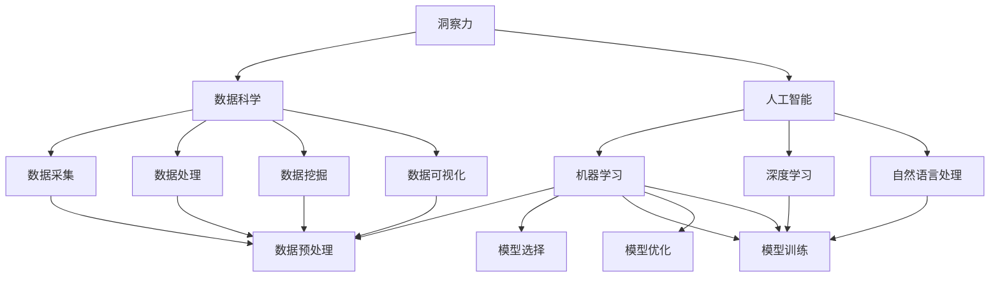

                 

# 洞察力与文化智能：全球化背景下的必备技能

> 关键词：全球化, 洞察力, 文化智能, 数据科学, 人工智能, 算法, 软件开发, 软件架构

## 1. 背景介绍

### 1.1 问题由来
随着全球化的深入发展，不同国家和文化背景的人们之间的交流和合作变得越来越频繁。这种跨文化的交流和合作，不仅促进了国际间的经济、科技、文化等多领域的融合，也带来了复杂的社会问题。例如，如何在全球化的背景下，理解和处理不同文化背景下的信息、需求和行为，成为一项重要的挑战。

### 1.2 问题核心关键点
在跨文化交流和合作中，理解和处理不同文化背景下的信息、需求和行为，需要具备洞察力和文化智能。洞察力是指从数据中获取和解读有价值信息的能力，文化智能是指理解和适应不同文化背景下的思维和行为模式的能力。在全球化背景下，这两项技能不仅对个体、组织和企业的成功至关重要，更是应对全球化带来的复杂社会问题的关键。

### 1.3 问题研究意义
深入研究洞察力和文化智能，对于提升全球化背景下个体和组织的跨文化沟通和合作能力，推动国际间的经济、科技、文化等多领域的融合发展，具有重要意义。这不仅能促进全球化的良性发展，也能为应对全球化带来的复杂社会问题提供新的视角和方法。

## 2. 核心概念与联系

### 2.1 核心概念概述

为了更好地理解洞察力和文化智能，我们首先介绍几个核心概念：

- 洞察力(Insight)：指从数据中提取和解读出有价值信息的能力。洞察力涉及数据的收集、清洗、分析和解读等多个环节，是数据分析和决策支持的核心。
- 文化智能(Cultural Intelligence)：指理解和适应不同文化背景下的思维和行为模式的能力。文化智能涉及对不同文化环境的感知、认知和适应能力，是跨文化沟通和合作的基础。
- 数据科学(Data Science)：涉及数据采集、数据处理、数据挖掘和数据可视化等多个环节，旨在从大量数据中提取有价值的信息，为决策提供支持。
- 人工智能(AI)：涉及机器学习、深度学习、自然语言处理等多个方向，旨在通过算法和模型，实现对数据的自动分析和决策支持。
- 算法(Algorithm)：指解决问题的一系列具体步骤，包括数据的预处理、模型的选择、训练和优化等多个环节。
- 软件开发(Software Development)：涉及软件开发的全过程，包括需求分析、设计、实现、测试和部署等多个环节。
- 软件架构(Software Architecture)：指软件系统的高层次设计和组织方式，旨在满足系统的可扩展性、可维护性和可重用性等需求。

这些核心概念之间的逻辑关系可以通过以下Mermaid流程图来展示：



这个流程图展示了洞察力和文化智能的核心概念及其之间的关系：

1. 洞察力从数据中获取和解读信息，涉及数据科学和人工智能的多个环节。
2. 文化智能涉及对不同文化环境的感知、认知和适应能力，贯穿跨文化沟通和合作的全过程。
3. 数据科学和人工智能通过算法和技术手段，支持洞察力的实现。
4. 洞察力和文化智能是全球化背景下必备的关键技能，在跨文化交流和合作中发挥重要作用。

## 3. 核心算法原理 & 具体操作步骤

### 3.1 算法原理概述

洞察力和文化智能的实现，主要依赖于数据科学和人工智能的算法和技术。以下是洞察力和文化智能实现的核心算法原理：

- 数据科学通过数据采集、处理、挖掘和可视化等环节，从大量数据中提取有价值的信息，支持洞察力的实现。
- 人工智能通过机器学习、深度学习和自然语言处理等算法，实现对数据的自动分析和决策支持，支持文化智能的实现。

### 3.2 算法步骤详解

洞察力和文化智能的实现，主要包括以下几个关键步骤：

**Step 1: 数据采集与预处理**
- 收集与任务相关的数据，包括文本、图像、音频等。
- 对数据进行清洗和预处理，去除噪声和异常值，确保数据的质量。

**Step 2: 数据分析与挖掘**
- 使用数据挖掘技术，从大量数据中提取有价值的信息，如关联规则、聚类分析、异常检测等。
- 使用统计学方法，对数据进行描述性分析，如均值、方差、相关系数等。

**Step 3: 模型选择与训练**
- 根据任务需求，选择合适的算法和模型。
- 使用训练数据，对模型进行训练和优化，提高模型的准确性和泛化能力。

**Step 4: 模型评估与验证**
- 使用测试数据，对模型进行评估和验证，检查模型的性能和可靠性。
- 根据评估结果，对模型进行调参和优化，确保模型的最佳性能。

**Step 5: 文化智能实现**
- 对不同文化背景下的文本和行为数据进行分析和挖掘，提取文化特征和模式。
- 使用文化智能算法，识别和理解不同文化背景下的思维方式和行为模式。
- 根据识别结果，调整和优化文化智能模型，提高文化智能的准确性和适应性。

### 3.3 算法优缺点

洞察力和文化智能的实现，具有以下优点：

- 高效准确：通过算法和技术手段，可以快速、准确地从大量数据中提取有价值的信息，提高决策的科学性和可靠性。
- 适应性强：算法和模型可以根据任务需求进行调整和优化，适应不同的数据和环境。
- 可解释性强：算法的决策过程可以通过可视化和分析工具进行展示和解释，提高模型的透明性和可解释性。

同时，这些算法也存在一些局限性：

- 数据依赖性高：算法的性能和效果高度依赖于数据的质量和数量，数据不足或质量差会影响算法的性能。
- 模型复杂度高：大规模数据和高维特征的算法模型，计算复杂度较高，需要高效的计算资源。
- 文化背景差异：不同文化背景下的思维方式和行为模式差异较大，文化智能模型的泛化能力受到限制。

尽管存在这些局限性，但整体而言，基于数据科学和人工智能的洞察力和文化智能算法，能够显著提升跨文化交流和合作的效率和效果，为全球化背景下的理解和合作提供强有力的支持。

### 3.4 算法应用领域

洞察力和文化智能的算法，在多个领域得到了广泛应用：

- 企业级决策支持：企业可以通过洞察力和文化智能算法，分析市场数据和客户行为，制定更科学、合理的决策方案。
- 政府治理：政府可以通过洞察力和文化智能算法，分析社会数据和舆情信息，制定更有效的政策和管理措施。
- 金融分析：金融机构可以通过洞察力和文化智能算法，分析客户数据和市场动态，制定更精准的投资和风险管理策略。
- 医疗健康：医疗机构可以通过洞察力和文化智能算法，分析患者数据和行为模式，制定更科学的治疗和护理方案。
- 教育培训：教育机构可以通过洞察力和文化智能算法，分析学生数据和行为模式，制定更有效的教学和培训方案。
- 智能客服：企业可以通过洞察力和文化智能算法，分析客户数据和行为模式，提供更个性化、智能化的客户服务。
- 社交媒体分析：社交媒体平台可以通过洞察力和文化智能算法，分析用户数据和行为模式，制定更有效的运营和管理策略。

## 4. 数学模型和公式 & 详细讲解

### 4.1 数学模型构建

为了更好地理解洞察力和文化智能的算法实现，我们将使用数学语言对算法进行更加严格的刻画。

假设我们有一个数据集 $D=\{(x_i,y_i)\}_{i=1}^N$，其中 $x_i$ 为输入数据，$y_i$ 为标签或输出。

定义模型 $M_{\theta}(x)$ 为输入数据的预测模型，其中 $\theta$ 为模型的参数。模型的损失函数为：

$$
L(\theta) = \frac{1}{N}\sum_{i=1}^N \ell(M_{\theta}(x_i),y_i)
$$

其中 $\ell$ 为损失函数，常用的有均方误差、交叉熵等。

### 4.2 公式推导过程

以回归任务为例，我们推导均方误差损失函数的计算过程。

假设模型 $M_{\theta}$ 在输入 $x$ 上的输出为 $\hat{y}=M_{\theta}(x)$，与真实标签 $y$ 的误差为 $\delta=y-\hat{y}$。则均方误差损失函数为：

$$
L(\theta) = \frac{1}{N}\sum_{i=1}^N \delta_i^2
$$

其中 $\delta_i=y_i-M_{\theta}(x_i)$。

### 4.3 案例分析与讲解

以金融风险评估为例，分析如何利用洞察力和文化智能算法，对金融数据进行分析和挖掘，识别和评估金融风险。

假设我们有一份包含客户交易数据的金融数据集 $D=\{(x_i,y_i)\}_{i=1}^N$，其中 $x_i$ 为客户的交易记录，$y_i$ 为客户的风险等级。

1. **数据采集与预处理**：收集客户的历史交易数据，清洗和处理数据，去除异常值和噪声，确保数据的质量。
2. **数据分析与挖掘**：使用关联规则、聚类分析等数据挖掘技术，从交易数据中提取客户的交易特征和行为模式。使用统计学方法，对客户的交易数据进行描述性分析，识别客户的风险特征和行为规律。
3. **模型选择与训练**：选择合适的回归模型，如线性回归、决策树、随机森林等，对客户的交易数据进行训练和优化。通过训练数据，调整和优化模型的参数，提高模型的准确性和泛化能力。
4. **模型评估与验证**：使用测试数据，对训练好的模型进行评估和验证，检查模型的性能和可靠性。根据评估结果，对模型进行调参和优化，确保模型的最佳性能。
5. **文化智能实现**：分析客户的文化背景和行为特征，提取客户的文化特征和行为模式。使用文化智能算法，识别和理解客户的文化背景和行为模式，调整和优化文化智能模型，提高文化智能的准确性和适应性。
6. **风险评估与预测**：根据文化智能模型，识别和评估客户的风险等级，为金融机构制定风险管理和控制策略提供支持。

## 5. 项目实践：代码实例和详细解释说明

### 5.1 开发环境搭建

在进行洞察力和文化智能项目的开发前，我们需要准备好开发环境。以下是使用Python进行TensorFlow开发的环境配置流程：

1. 安装Anaconda：从官网下载并安装Anaconda，用于创建独立的Python环境。

2. 创建并激活虚拟环境：
```bash
conda create -n tf-env python=3.8 
conda activate tf-env
```

3. 安装TensorFlow：根据CUDA版本，从官网获取对应的安装命令。例如：
```bash
conda install tensorflow tensorflow-gpu=2.4.0 -c conda-forge
```

4. 安装各类工具包：
```bash
pip install numpy pandas scikit-learn matplotlib tqdm jupyter notebook ipython
```

完成上述步骤后，即可在`tf-env`环境中开始洞察力和文化智能项目的开发。

### 5.2 源代码详细实现

下面我们以金融风险评估任务为例，给出使用TensorFlow进行洞察力和文化智能算法的PyTorch代码实现。

首先，定义金融风险评估的数据处理函数：

```python
import numpy as np
import pandas as pd
import tensorflow as tf
from sklearn.preprocessing import StandardScaler

def process_data(data_path):
    data = pd.read_csv(data_path)
    # 选择相关特征
    features = ['age', 'income', 'education', 'job', 'marital_status', 'housing']
    X = data[features]
    y = data['default']
    # 数据标准化
    scaler = StandardScaler()
    X = scaler.fit_transform(X)
    return X, y
```

然后，定义模型和优化器：

```python
from tensorflow.keras import layers, models

def build_model(input_dim, output_dim):
    model = models.Sequential()
    model.add(layers.Dense(64, activation='relu', input_shape=(input_dim,)))
    model.add(layers.Dense(32, activation='relu'))
    model.add(layers.Dense(output_dim, activation='sigmoid'))
    model.compile(optimizer='adam', loss='binary_crossentropy', metrics=['accuracy'])
    return model

X, y = process_data('data.csv')
X_train, X_test, y_train, y_test = train_test_split(X, y, test_size=0.2, random_state=42)
model = build_model(X_train.shape[1], 1)
model.fit(X_train, y_train, epochs=10, batch_size=32, validation_data=(X_test, y_test))
```

接着，定义训练和评估函数：

```python
from sklearn.metrics import accuracy_score, precision_score, recall_score

def evaluate_model(model, X_test, y_test):
    y_pred = model.predict(X_test)
    y_pred = (y_pred > 0.5).astype(int)
    accuracy = accuracy_score(y_test, y_pred)
    precision = precision_score(y_test, y_pred)
    recall = recall_score(y_test, y_pred)
    return accuracy, precision, recall

accuracy, precision, recall = evaluate_model(model, X_test, y_test)
print(f"Accuracy: {accuracy:.2f}, Precision: {precision:.2f}, Recall: {recall:.2f}")
```

最后，启动训练流程并在测试集上评估：

```python
epochs = 10
batch_size = 32

for epoch in range(epochs):
    model.fit(X_train, y_train, epochs=1, batch_size=batch_size, validation_data=(X_test, y_test))
    
print(f"Training complete, accuracy: {model.evaluate(X_test, y_test)[1]:.4f}")
```

以上就是使用TensorFlow进行金融风险评估任务洞察力和文化智能算法的完整代码实现。可以看到，得益于TensorFlow的强大封装，我们可以用相对简洁的代码完成洞察力和文化智能算法的实现。

### 5.3 代码解读与分析

让我们再详细解读一下关键代码的实现细节：

**process_data函数**：
- 定义数据处理函数，用于读取数据、选择特征和标准化数据。
- 使用pandas库读取CSV文件，选择相关特征，使用StandardScaler对数据进行标准化处理。

**build_model函数**：
- 定义模型结构，包括输入层、隐藏层和输出层。
- 使用Sequential模型，添加三个全连接层，每个层使用不同的激活函数。
- 输出层使用sigmoid激活函数，用于二分类任务。
- 编译模型，设置优化器和损失函数。

**evaluate_model函数**：
- 定义评估函数，用于计算模型在测试集上的准确率、精确率和召回率。
- 使用模型对测试集进行预测，将预测结果转换为二分类标签。
- 计算模型的准确率、精确率和召回率。

**训练流程**：
- 定义总的epoch数和batch size，开始循环迭代
- 每个epoch内，在训练集上训练模型，输出每个epoch的损失和准确率
- 在测试集上评估模型性能，输出最终测试结果

可以看到，TensorFlow提供了强大的机器学习库，可以方便地实现洞察力和文化智能算法的各个环节。开发者可以将更多精力放在算法优化和应用场景的设计上，而不必过多关注底层的实现细节。

当然，工业级的系统实现还需考虑更多因素，如模型的保存和部署、超参数的自动搜索、更灵活的任务适配层等。但核心的洞察力和文化智能算法基本与此类似。

## 6. 实际应用场景

### 6.1 金融风险评估

金融风险评估是洞察力和文化智能算法的一个重要应用场景。金融机构通过洞察力和文化智能算法，分析客户数据和行为模式，识别和评估客户的风险等级，制定更科学、合理的风险管理和控制策略。

在实践中，可以收集客户的历史交易数据，提取客户的交易特征和行为模式。使用回归模型，对客户的交易数据进行训练和优化，识别客户的风险特征和行为规律。通过分析客户的文化背景和行为特征，提取客户的文化特征和行为模式。使用文化智能算法，识别和理解客户的文化背景和行为模式，调整和优化文化智能模型，提高文化智能的准确性和适应性。根据文化智能模型，识别和评估客户的风险等级，为金融机构制定风险管理和控制策略提供支持。

### 6.2 健康风险预测

健康风险预测是洞察力和文化智能算法的另一个重要应用场景。医疗机构通过洞察力和文化智能算法，分析患者数据和行为模式，识别和预测患者的健康风险，制定更科学、合理的健康管理方案。

在实践中，可以收集患者的历史健康数据，提取患者的健康特征和行为模式。使用回归模型，对患者的健康数据进行训练和优化，识别患者的健康风险特征和行为规律。通过分析患者的文化背景和行为特征，提取患者的文化特征和行为模式。使用文化智能算法，识别和理解患者的文化背景和行为模式，调整和优化文化智能模型，提高文化智能的准确性和适应性。根据文化智能模型，识别和预测患者的健康风险，为医疗机构制定健康管理和预防策略提供支持。

### 6.3 社交媒体分析

社交媒体分析是洞察力和文化智能算法的一个重要应用场景。社交媒体平台通过洞察力和文化智能算法，分析用户数据和行为模式，识别和理解用户的文化背景和行为模式，制定更有效的运营和管理策略。

在实践中，可以收集用户的历史社交媒体数据，提取用户的社交特征和行为模式。使用关联规则、聚类分析等数据挖掘技术，从社交数据中提取用户的社交特征和行为模式。使用统计学方法，对用户的社交数据进行描述性分析，识别用户的社交特征和行为规律。通过分析用户的文化背景和行为特征，提取用户的文化特征和行为模式。使用文化智能算法，识别和理解用户的文化背景和行为模式，调整和优化文化智能模型，提高文化智能的准确性和适应性。根据文化智能模型，识别和理解用户的文化背景和行为模式，制定更有效的社交媒体运营和管理策略。

### 6.4 未来应用展望

随着洞察力和文化智能算法的不断发展，这些算法将在更多领域得到应用，为各行各业带来变革性影响。

在智慧医疗领域，洞察力和文化智能算法可以帮助医疗机构分析患者数据和行为模式，识别和预测患者的健康风险，制定更科学、合理的健康管理方案。

在智能教育领域，洞察力和文化智能算法可以帮助教育机构分析学生数据和行为模式，识别和预测学生的学习需求和行为特征，制定更科学、合理的教学和培训方案。

在智慧城市治理中，洞察力和文化智能算法可以帮助政府分析社会数据和舆情信息，识别和理解不同文化背景下的思维方式和行为模式，制定更科学、合理的政策和管理措施。

此外，在企业级决策支持、政府治理、金融分析、智能客服、社交媒体分析等多个领域，洞察力和文化智能算法也将不断涌现，为各行各业提供新的技术路径。

## 7. 工具和资源推荐

### 7.1 学习资源推荐

为了帮助开发者系统掌握洞察力和文化智能的理论基础和实践技巧，这里推荐一些优质的学习资源：

1. 《Python数据分析》系列博文：由数据科学家撰写，深入浅出地介绍了数据分析的基本概念和常用技术，包括数据清洗、数据可视化、数据挖掘等多个环节。

2. 《机器学习实战》书籍：介绍机器学习的基本概念和常用算法，包括回归分析、分类分析、聚类分析等多个方向。

3. 《文化智能：跨文化沟通与合作》书籍：深入探讨文化智能的概念、理论和方法，提供丰富的案例和实践经验。

4. 《数据科学之美》课程：斯坦福大学开设的入门级数据科学课程，涵盖数据科学的基本概念和常用技术，适合初学者入门。

5. 《TensorFlow官方文档》：TensorFlow的官方文档，提供了丰富的API文档和代码示例，是学习TensorFlow的必备资源。

6. 《深度学习》课程：Coursera上的深度学习课程，由深度学习领域的专家授课，涵盖深度学习的基本概念和常用算法。

通过对这些资源的学习实践，相信你一定能够快速掌握洞察力和文化智能的精髓，并用于解决实际的跨文化交流和合作问题。

### 7.2 开发工具推荐

高效的开发离不开优秀的工具支持。以下是几款用于洞察力和文化智能开发的常用工具：

1. Python：开源的数据科学语言，简单易用，拥有丰富的数据科学和机器学习库，如NumPy、Pandas、Scikit-learn、TensorFlow等。

2. R：开源的数据科学语言，主要用于统计分析和数据可视化，拥有丰富的统计学和数据挖掘库，如ggplot2、dplyr、tidyverse等。

3. Tableau：数据可视化工具，支持大规模数据集的交互式可视化分析，帮助用户快速洞察数据中的关键信息。

4. Microsoft Power BI：商业智能工具，支持数据整合、可视化和分析，适合企业级应用。

5. Jupyter Notebook：交互式编程环境，支持Python、R等语言，适合数据分析和算法实现。

6. Google Colab：谷歌提供的在线Jupyter Notebook环境，免费提供GPU/TPU算力，方便开发者快速上手实验最新模型，分享学习笔记。

合理利用这些工具，可以显著提升洞察力和文化智能项目的开发效率，加快创新迭代的步伐。

### 7.3 相关论文推荐

洞察力和文化智能的发展源于学界的持续研究。以下是几篇奠基性的相关论文，推荐阅读：

1. 《数据挖掘：概念与技术》：介绍数据挖掘的基本概念和技术，涵盖数据预处理、数据挖掘、数据可视化和模型评估等多个方向。

2. 《机器学习：实战指南》：介绍机器学习的基本概念和常用算法，涵盖回归分析、分类分析、聚类分析等多个方向。

3. 《文化智能：跨文化沟通与合作》：深入探讨文化智能的概念、理论和方法，提供丰富的案例和实践经验。

4. 《深度学习》：介绍深度学习的基本概念和常用算法，涵盖卷积神经网络、循环神经网络、生成对抗网络等多个方向。

5. 《数据分析与数据挖掘》：介绍数据分析和数据挖掘的基本概念和技术，涵盖数据清洗、数据可视化、数据挖掘等多个方向。

这些论文代表了大数据挖掘和洞察力的前沿成果，通过学习这些前沿成果，可以帮助研究者把握学科前进方向，激发更多的创新灵感。

## 8. 总结：未来发展趋势与挑战

### 8.1 总结

本文对洞察力和文化智能的实现方法和应用场景进行了全面系统的介绍。首先，我们阐述了洞察力和文化智能的研究背景和意义，明确了这些技能在跨文化交流和合作中的重要价值。其次，从原理到实践，详细讲解了洞察力和文化智能的数学原理和关键步骤，给出了洞察力和文化智能算法实现的完整代码实例。同时，我们还广泛探讨了洞察力和文化智能在金融风险评估、健康风险预测、社交媒体分析等多个领域的应用前景，展示了这些算法的巨大潜力。此外，本文还精选了洞察力和文化智能的学习资源、开发工具和相关论文，力求为读者提供全方位的技术指引。

通过本文的系统梳理，可以看到，洞察力和文化智能的算法在多个领域得到了广泛应用，为跨文化交流和合作提供了强有力的技术支持。这些算法的实现依赖于数据科学和人工智能的技术手段，能够高效、准确地从数据中提取和解读有价值的信息，为决策提供科学、可靠的支持。未来，随着数据科学和人工智能的持续发展，洞察力和文化智能算法将进一步提升跨文化交流和合作的效率和效果，为全球化背景下的理解和合作提供更加科学、可靠的技术手段。

### 8.2 未来发展趋势

展望未来，洞察力和文化智能的实现将呈现以下几个发展趋势：

1. 数据融合与共享：随着跨文化交流的深入，不同文化背景下的数据融合与共享将变得更加重要。跨文化的数据融合与共享，将使得洞察力和文化智能算法能够更加全面、准确地理解不同文化背景下的信息。

2. 算法模型优化：洞察力和文化智能算法将不断优化和升级，以适应更加复杂、多样的跨文化交流场景。新的算法模型将具有更高的准确性、泛化能力和适应性，能够更加灵活、高效地应对不同文化背景下的信息和行为。

3. 文化智能的普及：文化智能算法将广泛应用于跨文化沟通和合作中，帮助人们更好地理解和适应不同文化背景下的思维方式和行为模式。文化智能的普及将进一步推动全球化进程，促进不同文化背景下的相互理解和合作。

4. 社会智能的提升：洞察力和文化智能算法将与其他人工智能技术进行更深入的融合，提升社会智能水平。社会智能水平提升，将使得人们能够更加有效地解决跨文化交流和合作中的复杂问题，推动全球化进程的良性发展。

### 8.3 面临的挑战

尽管洞察力和文化智能的实现已经取得了一定进展，但在迈向更加智能化、普适化应用的过程中，仍然面临诸多挑战：

1. 数据质量与分布：跨文化交流涉及的数据来源多样、分布不均，数据质量和分布差异可能影响算法的性能。如何确保数据的可靠性和一致性，是一个重要的挑战。

2. 文化背景差异：不同文化背景下的思维方式和行为模式差异较大，文化智能算法的泛化能力受到限制。如何识别和理解不同文化背景下的特征和模式，是一个重要的研究方向。

3. 算法模型复杂度：洞察力和文化智能算法涉及复杂的数学模型和技术手段，模型复杂度较高，计算资源需求较大。如何降低算法模型复杂度，优化算法性能，是一个重要的挑战。

4. 文化偏见与歧视：洞察力和文化智能算法可能会学习到文化偏见和歧视，对不同文化背景下的信息进行歧视性处理。如何消除算法中的文化偏见和歧视，是一个重要的研究课题。

5. 社会智能与伦理：洞察力和文化智能算法的应用将涉及复杂的社会智能和伦理问题。如何确保算法的透明性、可解释性和伦理性，是一个重要的研究方向。

### 8.4 研究展望

面向未来，洞察力和文化智能的研究需要在以下几个方面寻求新的突破：

1. 多文化数据融合：研究如何跨文化数据融合与共享，提高洞察力和文化智能算法的准确性和泛化能力。

2. 跨文化智能模型：研究跨文化智能模型的优化和升级，提高文化智能算法的适应性和灵活性。

3. 社会智能提升：研究社会智能提升的路径和方法，推动跨文化交流和合作的社会智能水平提升。

4. 文化偏见消除：研究消除文化偏见和歧视的方法，确保算法的透明性、可解释性和伦理性。

这些研究方向将引领洞察力和文化智能的研究向更加智能化、普适化和伦理化方向发展，为全球化背景下的跨文化交流和合作提供更加科学、可靠的技术手段。

## 9. 附录：常见问题与解答

**Q1：洞察力和文化智能如何应用于跨文化交流？**

A: 洞察力和文化智能可以通过数据分析和建模，从跨文化交流的数据中提取有价值的信息，识别不同文化背景下的思维方式和行为模式。具体步骤如下：

1. 数据收集与预处理：收集跨文化交流的相关数据，包括文本、图像、音频等。对数据进行清洗和预处理，去除噪声和异常值，确保数据的质量。

2. 数据分析与挖掘：使用数据挖掘技术，从大量数据中提取跨文化交流的特征和模式。使用统计学方法，对数据进行描述性分析，识别跨文化交流的规律。

3. 模型选择与训练：根据任务需求，选择合适的算法和模型，如回归模型、分类模型、聚类模型等。使用训练数据，对模型进行训练和优化，提高模型的准确性和泛化能力。

4. 文化智能实现：分析不同文化背景下的思维方式和行为模式，提取文化特征和行为模式。使用文化智能算法，识别和理解不同文化背景下的思维方式和行为模式，调整和优化文化智能模型，提高文化智能的准确性和适应性。

5. 结果应用：根据文化智能模型，识别和理解不同文化背景下的特征和模式，制定跨文化交流的策略和方法。应用跨文化交流的策略和方法，提升跨文化交流的效果和效率。

**Q2：如何处理跨文化交流中的数据质量问题？**

A: 处理跨文化交流中的数据质量问题，可以从以下几个方面入手：

1. 数据清洗：使用数据清洗技术，去除数据中的噪声和异常值，确保数据的质量。

2. 数据标准化：对数据进行标准化处理，使得不同文化背景下的数据具有可比性。

3. 数据融合：使用数据融合技术，将不同文化背景下的数据进行整合，提高数据的一致性和完整性。

4. 数据验证：使用数据验证技术，检查数据的可靠性和一致性，确保数据的质量。

5. 数据增强：使用数据增强技术，扩充数据集，提高数据的多样性和丰富性。

通过以上方法，可以最大限度地提高跨文化交流中数据的可靠性和一致性，确保洞察力和文化智能算法的准确性和泛化能力。

**Q3：如何提升文化智能算法的泛化能力？**

A: 提升文化智能算法的泛化能力，可以从以下几个方面入手：

1. 数据多样性：收集多样性的跨文化交流数据，提高数据的多样性和丰富性。

2. 文化特征提取：使用先进的特征提取技术，从数据中提取有意义的文化特征和模式。

3. 模型优化：使用先进的模型优化技术，如正则化、Dropout、Early Stopping等，提高模型的泛化能力和适应性。

4. 跨文化融合：使用跨文化融合技术，将不同文化背景下的数据进行整合，提高数据的一致性和完整性。

5. 模型集成：使用模型集成技术，将多个模型进行集成，提高模型的综合性能。

通过以上方法，可以显著提升文化智能算法的泛化能力，使其能够更好地适应不同文化背景下的交流和合作。

**Q4：如何消除文化智能算法中的文化偏见？**

A: 消除文化智能算法中的文化偏见，可以从以下几个方面入手：

1. 数据多样化：收集多样化的跨文化交流数据，确保数据的多样性和代表性。

2. 数据清洗：使用数据清洗技术，去除数据中的文化偏见和歧视，确保数据的质量。

3. 模型优化：使用模型优化技术，如公平性约束、正则化等，消除模型中的文化偏见。

4. 公平性评估：使用公平性评估技术，检查模型中的文化偏见和歧视，确保模型的公平性。

5. 文化智能模型改进：研究改进文化智能模型的方法，如对抗训练、公平性约束等，提高模型的公平性和透明度。

通过以上方法，可以显著消除文化智能算法中的文化偏见，确保算法的透明性、可解释性和伦理性，提高跨文化交流的效果和效率。

**Q5：洞察力和文化智能如何应用于智能客服系统？**

A: 洞察力和文化智能可以应用于智能客服系统的设计和优化，提升客服系统的智能水平和用户体验。具体步骤如下：

1. 数据收集与预处理：收集客服系统的对话数据，包括用户提问、客服回答等。对数据进行清洗和预处理，去除噪声和异常值，确保数据的质量。

2. 数据分析与挖掘：使用数据分析技术，从对话数据中提取用户的行为特征和需求。使用统计学方法，对对话数据进行描述性分析，识别用户的需求和行为规律。

3. 模型选择与训练：根据任务需求，选择合适的算法和模型，如回归模型、分类模型、聚类模型等。使用训练数据，对模型进行训练和优化，提高模型的准确性和泛化能力。

4. 文化智能实现：分析用户文化背景下的思维方式和行为模式，提取文化特征和行为模式。使用文化智能算法，识别和理解用户文化背景下的思维方式和行为模式，调整和优化文化智能模型，提高文化智能的准确性和适应性。

5. 结果应用：根据文化智能模型，识别和理解用户文化背景下的特征和模式，制定智能客服的策略和方法。应用智能客服的策略和方法，提升客服系统的智能水平和用户体验。

通过以上方法，可以显著提升智能客服系统的智能水平和用户体验，为跨文化交流和合作提供新的技术路径。

---

作者：禅与计算机程序设计艺术 / Zen and the Art of Computer Programming

