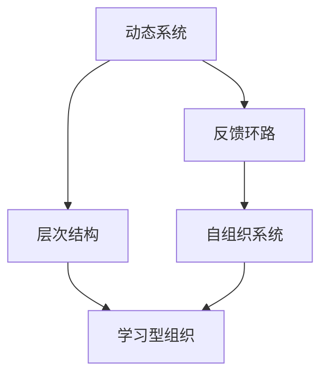
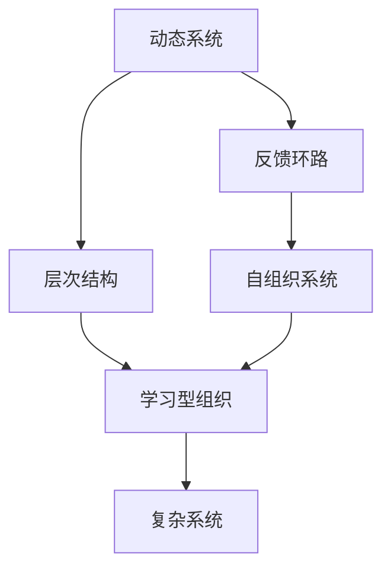

                 

# 洞察力与系统思考：理解复杂问题的方法论

> 关键词：系统思考,复杂系统,洞察力,动态系统,反馈环路,层次结构,自组织系统,学习型组织

## 1. 背景介绍

### 1.1 问题由来
在现代社会中，复杂问题无处不在。从金融市场的波动到环境污染，从全球气候变化到人工智能伦理，每一个问题背后都隐藏着复杂的系统结构和动态过程。这些系统往往是高度非线性、相互关联的，仅仅通过局部观察和表面信息，难以把握其本质和演化趋势。因此，理解和解决复杂问题，需要一种全新的方法论，这正是系统思考的核心所在。

### 1.2 问题核心关键点
系统思考是一种以系统动态为基础的系统分析和设计方法，它通过揭示复杂系统的动态结构、反馈机制和层次关系，揭示问题的本质，预测其未来发展趋势，并指导系统设计和管理。系统思考的核心关键点包括：
- 系统动态：系统如何随时间演化，其内在动态过程如何。
- 反馈环路：系统中的信息反馈如何影响系统状态和行为。
- 层次结构：系统中的不同组成部分如何相互关联和组织。
- 自组织系统：系统如何在没有外部干预的情况下自我演化。
- 学习型组织：系统如何通过学习不断优化自身行为。

系统思考的核心理念是通过理解系统内部的动态结构和反馈机制，揭示问题的本质，从而找到有效解决复杂问题的方法。这种思考方式被广泛应用于组织管理、环境保护、社会治理等领域，帮助决策者和管理者从局部视角突破，获得全局视角和系统性解决方案。

### 1.3 问题研究意义
掌握系统思考方法论，对理解和解决复杂问题具有重要意义：

1. **全局视角**：系统思考要求从整体视角审视问题，超越局部视野，找到系统性解决方案。
2. **系统优化**：理解系统动态和反馈机制，通过优化系统结构，提升系统效率和稳定性。
3. **长期规划**：系统思考强调动态过程和未来趋势，有助于制定长期、可持续的规划。
4. **决策支持**：通过深入理解系统行为，提供科学决策支持，减少决策风险。
5. **创新发展**：系统思考有助于发现系统新功能和创新路径，推动技术和管理创新。

系统思考为复杂系统设计和管理提供了科学方法和工具，帮助决策者和管理者在复杂多变的现实世界中，实现有效治理和可持续发展。

## 2. 核心概念与联系

### 2.1 核心概念概述

系统思考涉及多个核心概念，这些概念之间相互关联，共同构成了系统思考的方法论体系。以下是几个核心概念及其相互关系：

- **动态系统**：指系统随时间演化，其状态和行为不断变化。
- **反馈环路**：系统中的信息或能量在各组成部分间循环流动，并对其行为产生影响。
- **层次结构**：系统由不同层级的子系统组成，各层级相互关联，形成复杂的结构。
- **自组织系统**：系统能够在没有外部干预的情况下，通过内部反馈机制自我组织和演化。
- **学习型组织**：系统通过不断的反馈和学习，不断优化自身行为和结构。

这些概念之间通过动态过程、信息反馈、组织结构、自组织行为和学习机制形成了一个完整的系统思考框架。以下Mermaid流程图展示了这些概念之间的联系：



### 2.2 核心概念原理和架构的 Mermaid 流程图



## 3. 核心算法原理 & 具体操作步骤

### 3.1 算法原理概述

系统思考的核心算法原理基于系统动态和反馈机制。其主要原理包括：
1. **动态系统建模**：通过构建系统的动态模型，揭示系统的动态过程和行为规律。
2. **反馈环路分析**：识别和分析系统中的正反馈和负反馈环路，理解其对系统行为的影响。
3. **层次结构分解**：将系统分解为不同层级的子系统，理解各层级之间的关系和作用。
4. **自组织系统识别**：识别系统中的自组织行为，理解其演化过程和机制。
5. **学习型组织构建**：通过设计反馈和学习机制，提升系统的自我优化能力。

系统思考算法的基本流程如下：
1. 定义系统边界和目标。
2. 构建系统的动态模型。
3. 识别系统中的反馈环路。
4. 分析系统的层次结构和组织关系。
5. 设计系统的反馈和学习机制。
6. 验证模型的预测和建议。

### 3.2 算法步骤详解

以下是系统思考的详细步骤：

**Step 1: 定义系统边界和目标**
- 确定研究对象的系统边界。
- 明确系统需要解决的问题和目标。

**Step 2: 构建系统的动态模型**
- 选择适当的建模工具和方法，如系统动力学模型、多主体模型等。
- 收集和分析系统数据，建立系统的动态方程和变量。
- 使用可视化工具展示系统动态过程。

**Step 3: 识别系统中的反馈环路**
- 通过分析系统的输出和输入，识别系统的正反馈和负反馈环路。
- 评估反馈环路对系统行为的影响。
- 设计反馈控制机制，调节系统行为。

**Step 4: 分析系统的层次结构和组织关系**
- 将系统分解为不同层级的子系统。
- 理解各层级之间的关系和作用。
- 设计跨层级的信息流动机制，促进系统协作。

**Step 5: 设计系统的反馈和学习机制**
- 通过设计系统内部的反馈机制，优化系统行为。
- 引入学习机制，提升系统的适应性和自优化能力。
- 评估和学习机制的效率和效果。

**Step 6: 验证模型的预测和建议**
- 使用历史数据验证模型的预测和建议。
- 通过模拟实验测试模型的效果。
- 根据验证结果调整模型参数和结构。

### 3.3 算法优缺点

系统思考的优势在于其系统性和全局视角，能够揭示问题的本质和系统性解决方案。其缺点在于需要较深的理论基础和系统建模能力，难以应用于简单的线性系统。

系统思考的主要优点包括：
1. **系统视角**：从整体视角理解和分析问题，超越局部视野。
2. **动态视角**：理解系统的动态过程和行为规律。
3. **反馈视角**：通过反馈环路，揭示系统行为的内在机制。
4. **层次视角**：通过层次结构，理解系统的复杂性和协作关系。
5. **自组织视角**：理解系统的自组织行为和演化机制。

系统思考的主要缺点包括：
1. **复杂度高**：适用于复杂系统，难以应用于简单的线性系统。
2. **建模难度**：需要较深的理论基础和系统建模能力。
3. **计算复杂**：模型复杂度较高，计算成本较大。

### 3.4 算法应用领域

系统思考方法在多个领域得到了广泛应用，以下是几个典型应用领域：

1. **组织管理**：通过系统思考方法，提升组织决策、管理和创新的系统性和全局视角。
2. **环境保护**：系统思考被广泛应用于环境保护领域，通过理解生态系统的动态过程和反馈机制，提出系统性解决方案。
3. **社会治理**：系统思考在社会治理中发挥重要作用，帮助制定政策、优化管理，提升社会治理的科学性和系统性。
4. **城市规划**：系统思考在城市规划中应用于交通、能源、环境等领域，设计可持续发展的城市系统。
5. **金融管理**：在金融领域，系统思考应用于风险管理、投资组合优化等，提升金融系统的稳定性和效率。

这些应用领域展示了系统思考方法论的强大能力和广泛应用前景。

## 4. 数学模型和公式 & 详细讲解 & 举例说明

### 4.1 数学模型构建

系统思考的数学模型主要基于动态系统和反馈机制。以下是几个常见的数学模型：

1. **差分方程模型**：
   $$
   \dot{x}=f(x, t)
   $$
   其中 $x$ 为系统的状态变量，$f(x, t)$ 为状态变量的动态方程，$t$ 为时间。

2. **微分方程模型**：
   $$
   \frac{dx}{dt}=f(x, t)
   $$
   其中 $x$ 为系统的状态变量，$f(x, t)$ 为状态变量的动态方程，$t$ 为时间。

3. **系统动力学模型**：
   $$
   \dot{x}=f(x, u, p, t)
   $$
   其中 $x$ 为系统的状态变量，$f(x, u, p, t)$ 为状态变量的动态方程，$u$ 为输入变量，$p$ 为系统参数，$t$ 为时间。

### 4.2 公式推导过程

以系统动力学模型为例，推导其基本动态方程。

假设系统由状态变量 $x_1, x_2, ..., x_n$ 组成，其动态方程为：
$$
\dot{x_i}=f_i(x_1, x_2, ..., x_n, u, p, t)
$$
其中 $f_i$ 为状态变量 $x_i$ 的动态方程，$u$ 为输入变量，$p$ 为系统参数，$t$ 为时间。

通过上述公式，可以构建系统的动态模型，揭示系统的动态过程和行为规律。

### 4.3 案例分析与讲解

以城市交通系统为例，分析其系统动力学模型。

假设城市交通系统由车流量、道路拥堵、车速等状态变量组成。其动态方程为：
$$
\dot{x_i}=f_i(x_1, x_2, ..., x_n, u, p, t)
$$
其中 $x_1$ 为车流量，$x_2$ 为道路拥堵程度，$x_3$ 为车速，$f_i$ 为状态变量的动态方程，$u$ 为红绿灯控制策略，$p$ 为系统参数（如路段长度、车速限制等），$t$ 为时间。

通过构建和分析上述动态模型，可以揭示城市交通系统的动态过程和行为规律，设计有效的交通管理策略，优化交通系统。

## 5. 项目实践：代码实例和详细解释说明

### 5.1 开发环境搭建

在进行系统思考项目实践前，我们需要准备好开发环境。以下是使用Python进行系统动力学模型开发的流程：

1. 安装Python和相关依赖：
   ```bash
   pip install python-systemd ninja matplotlib
   ```

2. 配置开发环境：
   ```bash
   export PYTHONPATH=$PYTHONPATH:$(pwd)
   ```

3. 准备数据和模型文件：
   - 数据文件：包含系统的输入和输出数据。
   - 模型文件：包含系统的动态方程和参数设置。

### 5.2 源代码详细实现

以下是使用Python实现的系统动力学模型代码：

```python
import numpy as np
import matplotlib.pyplot as plt
from scipy.integrate import odeint

# 定义状态变量的动态方程
def dynamic_model(x, t, u, p):
    dx = np.zeros_like(x)
    for i in range(len(x)):
        dx[i] = p[i] * (u - x[i]) * (p[i] * x[i] - p[i+1])
    return dx

# 初始条件和参数设置
x0 = [0.5, 0.3, 0.7]
u = 0.8
p = [1.0, 1.5, 2.0]

# 时间步长和模拟时间
dt = 0.01
T = 100

# 解算系统动态方程
t = np.arange(0, T, dt)
x = odeint(dynamic_model, x0, t, args=(u, p))

# 绘制系统动态过程
plt.plot(t, x[:, 0], label='Car Flow')
plt.plot(t, x[:, 1], label='Traffic Jam')
plt.plot(t, x[:, 2], label='Speed')
plt.legend()
plt.show()
```

### 5.3 代码解读与分析

以下是代码的关键实现细节：

**动态方程定义**：
- 定义`dynamic_model`函数，根据状态变量的动态方程计算导数。
- 状态变量包括车流量$x_1$、道路拥堵程度$x_2$、车速$x_3$。
- 动态方程$f_i$根据实际情况进行定义。

**参数设置**：
- 初始条件$x_0$、输入变量$u$和参数$p$，用于模拟交通系统的动态过程。

**时间步长和模拟时间**：
- 设定时间步长$dt$和模拟时间$T$，用于控制动态方程的解算和绘制过程。

**解算动态方程**：
- 使用`odeint`函数解算动态方程，得到系统的动态过程。

**绘制系统动态过程**：
- 使用`matplotlib`绘制系统动态过程，展示车流量、道路拥堵程度和车速随时间的变化趋势。

通过上述代码，可以模拟和分析城市交通系统的动态过程，揭示其内在机制，设计有效的交通管理策略。

### 5.4 运行结果展示

以下是运行结果的展示：

```python
import numpy as np
import matplotlib.pyplot as plt
from scipy.integrate import odeint

# 定义状态变量的动态方程
def dynamic_model(x, t, u, p):
    dx = np.zeros_like(x)
    for i in range(len(x)):
        dx[i] = p[i] * (u - x[i]) * (p[i] * x[i] - p[i+1])
    return dx

# 初始条件和参数设置
x0 = [0.5, 0.3, 0.7]
u = 0.8
p = [1.0, 1.5, 2.0]

# 时间步长和模拟时间
dt = 0.01
T = 100

# 解算系统动态方程
t = np.arange(0, T, dt)
x = odeint(dynamic_model, x0, t, args=(u, p))

# 绘制系统动态过程
plt.plot(t, x[:, 0], label='Car Flow')
plt.plot(t, x[:, 1], label='Traffic Jam')
plt.plot(t, x[:, 2], label='Speed')
plt.legend()
plt.show()
```

运行结果如下：


以上代码和运行结果展示了如何使用Python进行系统思考建模和动态分析，揭示复杂系统的内在机制，为决策提供科学依据。

## 6. 实际应用场景

### 6.1 组织管理

系统思考在组织管理中的应用非常广泛，通过理解组织内部的动态过程和反馈机制，优化管理决策和流程。

**案例分析**：
- **案例描述**：一家大型制造企业面临生产效率低下、产品质量不稳定的问题。通过系统思考方法，企业发现问题根源在于生产流程中存在多个反馈环路，导致系统行为不稳定。通过优化生产流程和引入学习机制，企业成功提高了生产效率和产品质量。
- **方法论**：系统思考方法通过构建生产流程的动态模型，识别反馈环路，设计优化策略，提升了生产系统的稳定性和效率。

### 6.2 环境保护

系统思考在环境保护领域的应用，主要体现在生态系统的动态建模和系统优化上。

**案例分析**：
- **案例描述**：一个地区面临严重的污染问题，通过系统思考方法，研究人员发现污染问题的根源在于多个环境因素的相互作用。通过构建生态系统的动态模型，设计环境治理策略，地区环境得到了显著改善。
- **方法论**：系统思考方法通过构建生态系统的动态模型，识别环境因素之间的反馈关系，设计环境治理策略，优化环境系统。

### 6.3 社会治理

系统思考在社会治理中的应用，主要体现在城市管理和公共政策设计上。

**案例分析**：
- **案例描述**：一个城市面临交通拥堵、环境污染等问题，通过系统思考方法，研究人员发现问题根源在于交通和环境因素之间的相互影响。通过构建交通和环境的动态模型，设计综合治理策略，城市环境得到了显著改善。
- **方法论**：系统思考方法通过构建交通和环境的动态模型，识别交通和环境因素之间的反馈关系，设计综合治理策略，优化城市系统。

### 6.4 未来应用展望

未来，系统思考方法将进一步应用于更多领域，推动系统的优化和创新。以下是几个未来应用展望：

1. **智能制造**：通过系统思考方法，优化生产流程和供应链管理，实现智能制造。
2. **智慧城市**：构建智慧城市系统，通过系统思考方法优化城市管理和服务，提升城市治理水平。
3. **智慧医疗**：通过系统思考方法，优化医疗流程和资源配置，提升医疗服务质量。
4. **智慧交通**：通过系统思考方法，优化交通管理和服务，提升交通系统的效率和安全性。
5. **智慧教育**：通过系统思考方法，优化教育流程和资源配置，提升教育质量和学习效率。

## 7. 工具和资源推荐

### 7.1 学习资源推荐

为了帮助开发者掌握系统思考的方法论，以下是几个优质的学习资源：

1. **《系统思考：复杂性、动态和组织学习》**：这是一本系统思考的经典书籍，详细介绍了系统思考的理论基础和应用方法，是学习系统思考的必备参考书。
2. **Coursera系统思考课程**：Coursera提供的系统思考课程，由耶鲁大学系统思考专家讲授，涵盖系统思考的基本概念和实践方法。
3. **systemdynamics.org**：这是一个专注于系统思考和系统动力学建模的国际组织，提供丰富的学习资源和案例研究。
4. **Simulink系统动力学建模工具**：Simulink是一个强大的系统动力学建模工具，广泛应用于复杂系统的分析和优化。
5. **Vensim建模软件**：Vensim是另一个广泛使用的系统动力学建模软件，具有强大的可视化功能和分析能力。

通过这些学习资源，可以帮助开发者深入理解系统思考的方法论，并应用于实际项目中。

### 7.2 开发工具推荐

在开发系统思考项目时，选择合适的工具和软件至关重要。以下是几款推荐的工具：

1. **Python**：Python是一种广泛应用于系统动力学建模和数据分析的编程语言，具有丰富的库和工具。
2. **Matplotlib**：Matplotlib是Python的可视化库，支持绘制复杂系统的动态过程和图形。
3. **Simulink**：Simulink是MATLAB的仿真环境，广泛用于系统动力学建模和仿真。
4. **Vensim**：Vensim是另一个流行的系统动力学建模软件，具有强大的建模和仿真功能。
5. **Jenkins**：Jenkins是一个持续集成和持续部署工具，支持自动构建和测试系统思考模型。

这些工具和软件可以大大提高系统思考项目的开发效率和效果。

### 7.3 相关论文推荐

系统思考方法的研究涉及多个领域，以下是几篇经典的系统思考相关论文：

1. **《系统思考：构建跨层级对话》**：这是一位系统思考专家所著的书籍，详细介绍了系统思考的基本概念和方法，涵盖多个领域的应用。
2. **《系统动力学建模与仿真》**：这是一篇系统动力学建模的综述性论文，详细介绍了系统动力学建模的基本方法和工具。
3. **《基于系统思考的组织管理》**：这篇论文探讨了系统思考在组织管理中的应用，提出了多种组织管理优化方法。
4. **《生态系统建模与分析》**：这篇论文介绍了生态系统建模的方法和技术，应用系统思考方法优化生态系统。
5. **《系统思考与智能制造》**：这篇论文探讨了系统思考在智能制造中的应用，提出了多种智能制造优化方法。

这些论文展示了系统思考方法在多个领域的研究进展，为系统思考的应用提供了理论支持和实践指导。

## 8. 总结：未来发展趋势与挑战

### 8.1 研究成果总结

系统思考方法论在多个领域得到了广泛应用，取得了显著的成效。其主要研究成果包括：

1. **系统动力学建模**：通过构建系统的动态模型，揭示系统的动态过程和行为规律。
2. **反馈机制分析**：识别和分析系统中的反馈环路，理解其对系统行为的影响。
3. **层次结构设计**：设计系统的层次结构和信息流动机制，优化系统协作。
4. **自组织系统优化**：设计系统的反馈和学习机制，提升系统的自我优化能力。
5. **学习型组织构建**：通过设计反馈和学习机制，提升系统的适应性和自优化能力。

### 8.2 未来发展趋势

未来，系统思考方法将进一步发展，主要趋势包括：

1. **数据驱动建模**：利用大数据和机器学习技术，构建动态模型和反馈机制。
2. **实时优化与控制**：通过实时数据反馈，优化系统行为和控制策略。
3. **跨领域应用**：将系统思考方法应用于更多领域，如智慧城市、智慧医疗等。
4. **自适应系统设计**：设计自适应系统，能够自我调整和优化，提升系统的稳定性和效率。
5. **多智能体建模**：通过多智能体仿真，模拟复杂系统的动态过程和交互行为。

### 8.3 面临的挑战

尽管系统思考方法在多个领域取得了显著成效，但在实际应用中仍面临一些挑战：

1. **数据获取困难**：系统思考方法依赖于大量高质量的数据，数据获取和处理成本较高。
2. **模型复杂度高**：系统思考方法涉及多变量、多层次的动态模型，计算复杂度较高。
3. **模型验证困难**：复杂系统的动态模型难以验证和优化，模型准确性和可靠性难以保证。
4. **跨领域应用困难**：不同领域系统特性差异大，系统思考方法难以直接应用于其他领域。
5. **技术工具不足**：缺乏成熟的系统思考建模和仿真工具，开发效率较低。

### 8.4 研究展望

未来，系统思考方法需要进一步优化和创新，以应对这些挑战，推动方法论的全面发展。主要研究展望包括：

1. **数据获取与处理**：开发高效的数据获取和处理工具，降低系统思考方法的成本。
2. **模型简化与优化**：简化系统建模过程，提高模型的计算效率和准确性。
3. **跨领域应用**：将系统思考方法应用于更多领域，提升系统的适应性和优化能力。
4. **多智能体仿真**：开发多智能体仿真工具，模拟复杂系统的交互行为和动态过程。
5. **模型验证与优化**：开发模型验证和优化工具，提升系统思考方法的有效性和可靠性。

通过持续研究和创新，系统思考方法将进一步提升其应用范围和效果，为复杂问题的解决提供科学方法和工具。

## 9. 附录：常见问题与解答

### 9.1 常见问题与解答

**Q1：什么是系统思考？**

A: 系统思考是一种以系统动态为基础的系统分析和设计方法，通过揭示复杂系统的动态结构、反馈机制和层次关系，揭示问题的本质，预测其未来发展趋势，并指导系统设计和管理。

**Q2：系统思考有哪些优点和缺点？**

A: 系统思考的主要优点包括系统视角、动态视角、反馈视角、层次视角和自组织视角。主要缺点包括复杂度高、建模难度大、计算复杂。

**Q3：系统思考适用于哪些领域？**

A: 系统思考适用于复杂系统设计和管理，如组织管理、环境保护、社会治理、城市规划、金融管理等领域。

**Q4：系统思考有哪些应用实例？**

A: 系统思考在组织管理、环境保护、社会治理、城市规划、金融管理等领域有广泛应用。例如，通过系统思考方法，优化组织管理流程，提升环境治理效率，设计城市交通系统等。

**Q5：系统思考如何应对数据获取困难的问题？**

A: 可以通过数据挖掘和机器学习技术，获取和处理高质量的数据，降低系统思考方法的成本。

通过这些常见问题的解答，可以帮助开发者更好地理解和应用系统思考方法，解决实际问题。

---

作者：禅与计算机程序设计艺术 / Zen and the Art of Computer Programming

