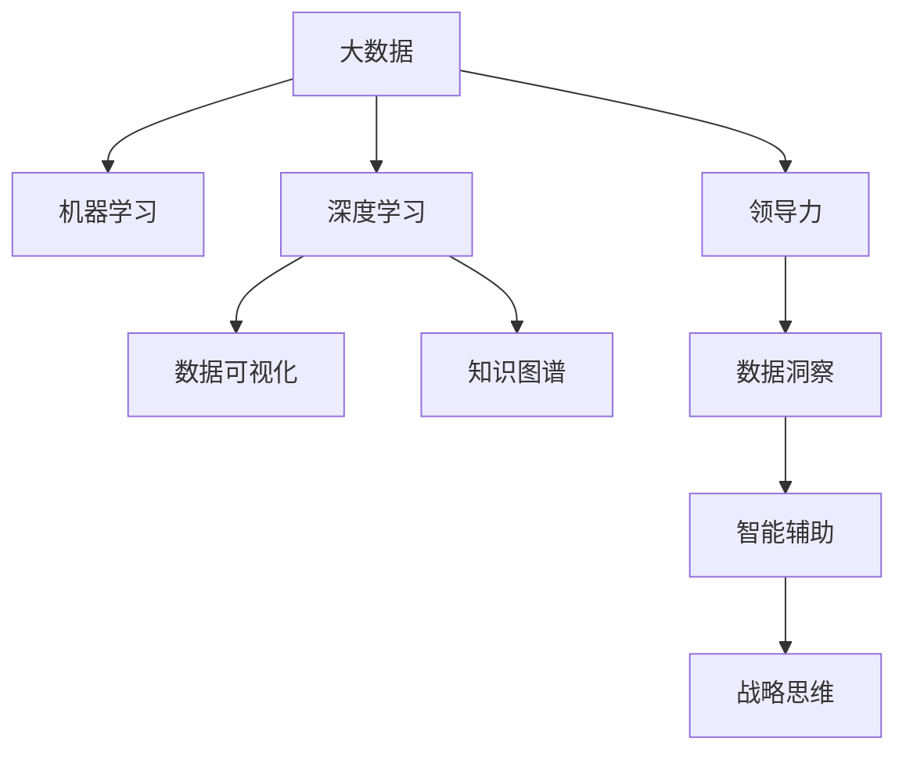

                 

## 1. 背景介绍

在数字化转型的浪潮中，洞察力与领导力成为了企业竞争力的关键。随着技术的不断进步，决策者在快速变化的市场环境中，需要迅速捕捉信息、理解和预测趋势，从而制定有效的战略。而战略思维的培养，正是洞察力与领导力的核心。本文将从多个维度探讨如何通过技术手段提升决策者的洞察力和领导力，以实现战略思维的培养。

### 1.1 问题由来

在传统的决策过程中，数据往往以孤立的形式存在，需要通过人工的查询和分析才能得出结论。这种方式不仅效率低下，还容易产生偏差。而大数据和人工智能技术的发展，为决策者提供了全新的工具和方法，能够更高效、更全面地处理和分析信息。通过数据驱动的洞察和智能辅助决策，决策者可以更准确地理解市场动态，做出更明智的战略决策。

### 1.2 问题核心关键点

战略思维的培养，本质上是提升决策者的数据洞察力和技术理解力。具体关键点包括：

- 数据洞察：通过数据清洗、处理和分析，从海量数据中提取有价值的信息。
- 智能辅助：利用机器学习和深度学习技术，实现自动化分析、预测和推荐。
- 领导力培训：通过培训和实战，提升决策者的战略思维和领导力。

## 2. 核心概念与联系

### 2.1 核心概念概述

为了更好地理解如何通过技术手段提升洞察力和领导力，我们首先需要理解几个关键概念：

- **大数据**：指数据量巨大、结构多样、来源广泛的数据集。通过大数据技术，能够对海量数据进行高效处理和分析。
- **机器学习**：指通过算法模型，自动从数据中学习规律，进行预测和分类等任务。机器学习技术在大数据背景下得以广泛应用。
- **深度学习**：指通过多层神经网络，实现复杂的非线性映射，处理高维数据和复杂模式。深度学习是机器学习的高级形式。
- **数据可视化**：指将数据通过图表、图形等形式展示出来，便于直观理解和分析。
- **知识图谱**：指通过语义关系图，将知识结构化表示，实现知识的获取和推理。
- **领导力**：指领导者在组织中展现出的影响力、决策力和组织能力，能够有效驱动团队实现目标。

这些概念之间的逻辑关系可以通过以下Mermaid流程图来展示：



这个流程图展示了大数据、机器学习、深度学习等技术手段如何帮助决策者提升洞察力和领导力，实现战略思维的培养。

## 3. 核心算法原理 & 具体操作步骤

### 3.1 算法原理概述

洞察力和领导力的提升，主要依赖于数据洞察和智能辅助两个方面。数据洞察旨在通过技术手段，从海量数据中提取有价值的信息，帮助决策者理解市场动态和竞争态势。智能辅助则通过机器学习和深度学习技术，实现自动化分析、预测和推荐，为决策者提供决策支持。

具体而言，数据洞察过程包括以下几个步骤：

1. 数据收集：通过网络爬虫、传感器等手段，收集各类数据，涵盖市场、客户、产品、运营等多个方面。
2. 数据清洗：对数据进行去重、去噪、缺失值处理等操作，确保数据质量。
3. 数据处理：通过数据仓库、大数据平台等技术，对数据进行分类、聚合、降维等处理，以便后续分析。
4. 数据可视化：通过数据可视化工具，将数据转换为图表、图形等形式，便于直观理解和分析。
5. 数据分析：通过统计分析、机器学习等方法，从数据中提取规律、模式和趋势，为决策提供支持。

智能辅助过程包括以下几个步骤：

1. 数据准备：将数据转换为模型可接受的格式，进行特征工程，如标准化、归一化、编码等。
2. 模型训练：选择合适的算法模型，如决策树、随机森林、神经网络等，在大数据上进行训练。
3. 模型优化：通过交叉验证、超参数调优等手段，优化模型性能，确保其泛化能力。
4. 预测和推荐：利用训练好的模型，对新数据进行预测和推荐，为决策提供支持。

### 3.2 算法步骤详解

以下是具体的算法步骤详解：

#### 3.2.1 数据洞察

**Step 1: 数据收集**
- 通过网络爬虫、传感器等手段，收集各类数据，涵盖市场、客户、产品、运营等多个方面。例如，收集电商平台的交易记录、社交媒体的用户评论、行业报告等。

**Step 2: 数据清洗**
- 对数据进行去重、去噪、缺失值处理等操作，确保数据质量。例如，去除重复的记录、处理缺失的数据点、过滤掉无效的记录等。

**Step 3: 数据处理**
- 通过数据仓库、大数据平台等技术，对数据进行分类、聚合、降维等处理，以便后续分析。例如，将交易记录按照日期、产品类别、用户地域等进行分类，计算平均销售额、退货率等指标。

**Step 4: 数据可视化**
- 通过数据可视化工具，将数据转换为图表、图形等形式，便于直观理解和分析。例如，使用Tableau、PowerBI等工具，生成市场趋势图、用户分布图等。

**Step 5: 数据分析**
- 通过统计分析、机器学习等方法，从数据中提取规律、模式和趋势，为决策提供支持。例如，使用回归分析、聚类分析等方法，识别市场趋势、用户偏好等。

#### 3.2.2 智能辅助

**Step 1: 数据准备**
- 将数据转换为模型可接受的格式，进行特征工程，如标准化、归一化、编码等。例如，将交易记录中的日期进行时间编码，将用户地域进行编码等。

**Step 2: 模型训练**
- 选择合适的算法模型，如决策树、随机森林、神经网络等，在大数据上进行训练。例如，使用TensorFlow、PyTorch等框架，构建神经网络模型，在大数据上进行训练。

**Step 3: 模型优化**
- 通过交叉验证、超参数调优等手段，优化模型性能，确保其泛化能力。例如，使用K-fold交叉验证，调整神经网络的层数、节点数等超参数。

**Step 4: 预测和推荐**
- 利用训练好的模型，对新数据进行预测和推荐，为决策提供支持。例如，使用训练好的神经网络模型，对新的交易数据进行分类预测，识别异常交易行为。

### 3.3 算法优缺点

数据洞察和智能辅助技术在提升洞察力和领导力方面具有以下优点：

- **高效性**：自动化处理海量数据，提高决策效率。
- **准确性**：通过科学的方法提取规律、模式和趋势，提高决策准确性。
- **可解释性**：通过可视化和解释工具，增强决策的可解释性和可信度。

同时，这些技术也存在一些缺点：

- **数据依赖**：对数据质量、数据来源依赖性强，数据缺失或不准确可能导致错误决策。
- **技术门槛**：需要具备一定的技术知识，对于非技术决策者，可能需要额外的培训。
- **隐私问题**：处理和分析用户数据可能涉及隐私问题，需要遵守相关法律法规。

### 3.4 算法应用领域

数据洞察和智能辅助技术在多个领域得到了广泛应用，例如：

- **电商行业**：通过分析交易数据、用户行为数据，预测销售趋势、优化库存管理。
- **金融行业**：通过分析市场数据、用户交易数据，识别投资机会、评估风险。
- **医疗行业**：通过分析医疗数据、患者反馈数据，预测疾病发展、优化诊疗方案。
- **教育行业**：通过分析学生成绩、课堂反馈数据，识别学习难点、个性化教学。
- **政府行业**：通过分析社会数据、公共服务数据，评估政策效果、优化公共服务。

这些领域的数据洞察和智能辅助应用，展示了数据驱动决策的巨大潜力。

## 4. 数学模型和公式 & 详细讲解 & 举例说明

### 4.1 数学模型构建

数据洞察和智能辅助过程涉及多个数学模型，主要包括以下几种：

- **统计模型**：用于描述和分析数据分布、关系等，如回归分析、聚类分析、时间序列分析等。
- **机器学习模型**：用于训练数据集，进行预测和分类，如决策树、随机森林、支持向量机等。
- **深度学习模型**：用于处理高维数据和复杂模式，如卷积神经网络、循环神经网络、生成对抗网络等。

### 4.2 公式推导过程

以下是几个常见模型的公式推导过程：

#### 4.2.1 线性回归模型

线性回归模型用于描述因变量和自变量之间的关系，公式如下：

$$
y = \beta_0 + \beta_1 x_1 + \beta_2 x_2 + ... + \beta_n x_n + \epsilon
$$

其中 $y$ 为因变量，$x_i$ 为自变量，$\beta_i$ 为回归系数，$\epsilon$ 为误差项。

线性回归模型的最小二乘法求解公式为：

$$
\hat{\beta} = (X^T X)^{-1} X^T y
$$

其中 $\hat{\beta}$ 为回归系数估计值，$X$ 为自变量矩阵，$y$ 为因变量向量。

#### 4.2.2 随机森林模型

随机森林模型通过多个决策树的集成，实现更强的预测能力。公式如下：

$$
y = \sum_{i=1}^{m} \frac{n_i}{N} y_i^{(i)}
$$

其中 $y$ 为预测结果，$y_i^{(i)}$ 为第 $i$ 棵树的预测结果，$n_i$ 为第 $i$ 棵树的样本数量，$N$ 为总样本数量。

#### 4.2.3 卷积神经网络模型

卷积神经网络模型用于处理图像数据，公式如下：

$$
f(x) = \sum_{i=1}^{k} w_i f_{i-1}(x) + b_i
$$

其中 $f(x)$ 为卷积层输出，$w_i$ 为卷积核权重，$f_{i-1}(x)$ 为前一层的输出，$b_i$ 为偏置项。

### 4.3 案例分析与讲解

#### 案例分析

假设某电商平台希望通过数据洞察和智能辅助技术，预测未来一个月的销售额。具体步骤如下：

**Step 1: 数据收集**
- 收集过去一年的销售数据、用户行为数据、市场趋势数据等。

**Step 2: 数据清洗**
- 对数据进行去重、去噪、缺失值处理等操作，确保数据质量。

**Step 3: 数据处理**
- 将销售数据按照时间、产品类别、用户地域等进行分类，计算平均销售额、退货率等指标。

**Step 4: 数据可视化**
- 使用Tableau工具，生成市场趋势图、用户分布图等，直观展示销售情况。

**Step 5: 数据分析**
- 使用线性回归模型，对销售数据进行分析，预测未来一个月的销售额。
- 使用随机森林模型，识别销售异常行为，优化库存管理。

#### 案例讲解

在本例中，数据洞察和智能辅助技术帮助电商平台准确预测了未来一个月的销售额，避免了库存积压和缺货情况。同时，通过对销售异常行为的识别，优化了库存管理，提高了销售效率和盈利能力。

## 5. 项目实践：代码实例和详细解释说明

### 5.1 开发环境搭建

在进行数据洞察和智能辅助实践前，我们需要准备好开发环境。以下是使用Python进行TensorFlow和Keras开发的简单环境配置流程：

1. 安装Anaconda：从官网下载并安装Anaconda，用于创建独立的Python环境。

2. 创建并激活虚拟环境：
```bash
conda create -n tf-env python=3.8 
conda activate tf-env
```

3. 安装TensorFlow和Keras：
```bash
conda install tensorflow keras -c conda-forge
```

4. 安装各类工具包：
```bash
pip install numpy pandas scikit-learn matplotlib tqdm jupyter notebook ipython
```

完成上述步骤后，即可在`tf-env`环境中开始项目实践。

### 5.2 源代码详细实现

以下是使用TensorFlow和Keras实现线性回归模型的Python代码示例：

```python
import tensorflow as tf
from tensorflow.keras import layers

# 数据准备
x = tf.constant([[1.0], [2.0], [3.0], [4.0], [5.0]], dtype=tf.float32)
y = tf.constant([[2.0], [4.0], [6.0], [8.0], [10.0]], dtype=tf.float32)

# 模型构建
model = tf.keras.Sequential([
    layers.Dense(units=1, input_shape=[1])
])

# 编译模型
model.compile(optimizer=tf.keras.optimizers.Adam(learning_rate=0.01),
              loss='mean_squared_error',
              metrics=['mean_absolute_error'])

# 训练模型
model.fit(x, y, epochs=50, batch_size=1, verbose=0)

# 评估模型
mse = model.evaluate(x, y)[0]
mae = model.evaluate(x, y)[1]
print(f"MSE: {mse:.2f}, MAE: {mae:.2f}")
```

### 5.3 代码解读与分析

让我们再详细解读一下关键代码的实现细节：

**数据准备**
- 使用`tf.constant`函数创建输入数据`x`和输出数据`y`。

**模型构建**
- 使用`tf.keras.Sequential`函数创建顺序模型，添加一个全连接层。

**编译模型**
- 使用`model.compile`函数编译模型，指定优化器、损失函数和评估指标。

**训练模型**
- 使用`model.fit`函数训练模型，指定训练数据、迭代次数和批量大小。

**评估模型**
- 使用`model.evaluate`函数评估模型，获取均方误差和平均绝对误差。

通过以上步骤，实现了线性回归模型的训练和评估过程。这只是一个简单的示例，实际项目中需要更复杂的模型和数据处理。

## 6. 实际应用场景

### 6.1 电商行业

电商平台可以通过数据洞察和智能辅助技术，实现以下应用场景：

**销售预测**
- 通过分析历史销售数据、市场趋势数据等，预测未来销售额，优化库存管理。

**用户行为分析**
- 通过分析用户浏览、购买数据，识别用户偏好、购买力等，优化产品推荐和营销策略。

**异常检测**
- 通过分析用户行为数据，识别异常购买行为，防范欺诈风险。

**价格优化**
- 通过分析市场价格数据、用户价格敏感度数据，优化产品定价策略。

### 6.2 金融行业

金融行业可以通过数据洞察和智能辅助技术，实现以下应用场景：

**风险评估**
- 通过分析用户信用数据、交易数据，评估信贷风险、市场风险等。

**投资分析**
- 通过分析市场数据、公司数据，预测股票价格、分析投资机会。

**反欺诈检测**
- 通过分析交易数据、用户行为数据，识别异常交易行为，防范欺诈风险。

**量化交易**
- 通过分析市场数据、技术指标，构建量化交易模型，优化交易策略。

### 6.3 医疗行业

医疗行业可以通过数据洞察和智能辅助技术，实现以下应用场景：

**疾病预测**
- 通过分析患者病历数据、基因数据，预测疾病发展趋势，优化诊疗方案。

**药品推荐**
- 通过分析患者病历数据、药品使用数据，推荐最佳药品方案，提高治疗效果。

**医院运营优化**
- 通过分析患者流量数据、诊疗数据，优化医院运营管理，提升服务质量。

**医疗影像分析**
- 通过分析医疗影像数据，辅助医生诊断疾病，提高诊断准确率。

## 7. 工具和资源推荐

### 7.1 学习资源推荐

为了帮助开发者系统掌握数据洞察和智能辅助技术，这里推荐一些优质的学习资源：

1. **《深度学习》课程**：斯坦福大学开设的深度学习课程，涵盖深度学习基础、卷积神经网络、循环神经网络等内容，适合入门学习。
2. **Kaggle竞赛**：Kaggle平台上有丰富的数据集和竞赛任务，通过实战练习，提升数据处理和模型训练能力。
3. **GitHub开源项目**：GitHub上有大量的开源项目和代码，可以通过学习优秀项目，提升自己的实战能力。

通过这些资源的学习实践，相信你一定能够快速掌握数据洞察和智能辅助技术的精髓，并用于解决实际的业务问题。

### 7.2 开发工具推荐

高效的开发离不开优秀的工具支持。以下是几款用于数据洞察和智能辅助开发的常用工具：

1. **Python**：常用的编程语言，支持丰富的第三方库和框架，适合数据处理和模型训练。
2. **TensorFlow**：谷歌主导的深度学习框架，支持分布式计算，适合大规模模型训练。
3. **Keras**：基于TensorFlow的高级API，简单易用，适合快速迭代开发。
4. **Jupyter Notebook**：交互式开发环境，支持实时展示代码执行结果，方便调试和演示。
5. **Tableau**：数据可视化工具，支持多种图表展示，方便数据分析和可视化。
6. **PowerBI**：微软推出的数据可视化工具，支持多种数据源，适合大规模数据展示。

合理利用这些工具，可以显著提升数据洞察和智能辅助任务的开发效率，加快创新迭代的步伐。

### 7.3 相关论文推荐

数据洞察和智能辅助技术的发展源于学界的持续研究。以下是几篇奠基性的相关论文，推荐阅读：

1. **《深度学习》**：Goodfellow等著，介绍深度学习的基本概念和算法，涵盖神经网络、卷积神经网络、循环神经网络等内容。
2. **《机器学习》**：Tom Mitchell著，介绍机器学习的基本概念和算法，涵盖决策树、随机森林、支持向量机等内容。
3. **《数据挖掘与统计学习》**：Witten等著，介绍数据挖掘和统计学习的基本概念和算法，涵盖关联规则、聚类分析、时间序列分析等内容。

这些论文代表了大数据和机器学习技术的发展脉络。通过学习这些前沿成果，可以帮助研究者把握学科前进方向，激发更多的创新灵感。

## 8. 总结：未来发展趋势与挑战

### 8.1 总结

本文对数据洞察和智能辅助技术的原理和实践进行了全面系统的介绍。首先阐述了这些技术在提升洞察力和领导力方面的重要意义，明确了其在大规模数据处理和模型训练中的应用。其次，从原理到实践，详细讲解了数据洞察和智能辅助的数学模型和操作步骤，给出了具体的代码实现示例。同时，本文还探讨了这些技术在电商、金融、医疗等多个行业领域的应用前景，展示了其巨大的潜力。最后，本文精选了数据洞察和智能辅助技术的各类学习资源，力求为读者提供全方位的技术指引。

通过本文的系统梳理，可以看到，数据洞察和智能辅助技术正成为决策者提升洞察力和领导力的重要工具。这些技术在多个领域得到了广泛应用，帮助决策者快速捕捉市场动态、优化决策过程，从而在激烈的市场竞争中获得优势。未来，伴随技术的不断进步和数据的持续积累，数据洞察和智能辅助技术必将在更多领域发挥更大的作用，推动决策科学的进一步发展。

### 8.2 未来发展趋势

展望未来，数据洞察和智能辅助技术将呈现以下几个发展趋势：

1. **自动化程度提升**：随着机器学习和深度学习技术的发展，自动化分析、预测和推荐的能力将进一步提升，减少人工干预，提高效率。
2. **多模态融合**：将文本、图像、语音、视频等多种数据源进行融合，实现多模态数据的协同分析，提升决策的全面性和准确性。
3. **实时性增强**：通过流式数据处理和实时计算技术，实现数据的实时分析，及时响应市场变化。
4. **跨领域应用扩展**：除了传统行业，数据洞察和智能辅助技术将在更多垂直领域得到应用，如环保、能源、农业等。
5. **知识图谱应用**：通过知识图谱技术，实现知识关联和推理，提升决策的逻辑性和系统性。

以上趋势凸显了数据洞察和智能辅助技术的广阔前景。这些方向的探索发展，必将进一步提升决策的智能化水平，为各行各业带来新的机遇和挑战。

### 8.3 面临的挑战

尽管数据洞察和智能辅助技术已经取得了瞩目成就，但在迈向更加智能化、普适化应用的过程中，仍面临诸多挑战：

1. **数据质量问题**：数据质量不高、数据缺失、数据不平衡等问题，可能导致分析结果不准确。
2. **技术门槛高**：数据洞察和智能辅助技术需要具备一定的技术知识，对非技术决策者，可能存在一定的学习门槛。
3. **隐私和安全问题**：处理和分析用户数据涉及隐私和安全问题，需要遵守相关法律法规。
4. **算力资源需求大**：大规模模型训练和复杂算法需要强大的算力支持，对于小型企业和初创公司，可能存在资源瓶颈。
5. **模型可解释性不足**：复杂模型如深度学习模型的决策过程难以解释，可能影响决策的可信度和接受度。

正视这些挑战，积极应对并寻求突破，将是大数据和机器学习技术走向成熟的必由之路。相信随着学界和产业界的共同努力，这些挑战终将一一被克服，数据洞察和智能辅助技术必将在构建人机协同的智能决策系统方面发挥更大的作用。

### 8.4 研究展望

面对数据洞察和智能辅助技术所面临的挑战，未来的研究需要在以下几个方面寻求新的突破：

1. **数据质量提升**：通过数据清洗、数据增强、数据补全等手段，提升数据质量和完整性。
2. **技术易用性增强**：开发更易用的数据分析和机器学习工具，降低技术门槛，提高决策者的接受度。
3. **隐私和安全保护**：开发隐私保护算法和工具，确保数据处理和分析过程中的隐私和安全。
4. **模型解释性增强**：开发可解释性更强的模型，增强决策的可信度和可解释性。
5. **跨领域应用研究**：在更多垂直领域开展数据洞察和智能辅助技术的研究，推动技术在更多场景下的应用。

这些研究方向将引领数据洞察和智能辅助技术走向更高的台阶，为决策科学提供更全面的支持，促进人工智能技术的进一步发展。总之，数据洞察和智能辅助技术需要在数据质量、技术易用性、隐私安全、模型解释性等方面进行全面的改进，才能真正实现其在大规模决策中的应用，推动人工智能技术在更多行业领域落地。

## 9. 附录：常见问题与解答

**Q1：如何提升数据质量？**

A: 提升数据质量可以从以下几个方面入手：

1. 数据清洗：去除重复、异常、缺失数据，确保数据完整性。
2. 数据增强：通过数据补全、数据合成等手段，提升数据量和多样性。
3. 数据补全：通过插值、回归等方法，填补缺失值，提升数据完整性。
4. 数据标注：对数据进行标注和注释，提升数据质量和可用性。

**Q2：如何降低技术门槛？**

A: 降低技术门槛可以从以下几个方面入手：

1. 使用易用的工具：选择易用的数据分析和机器学习工具，降低技术门槛。
2. 提供培训和支持：通过培训和文档支持，帮助用户快速上手。
3. 简化模型开发流程：简化模型开发流程，降低模型调优和优化难度。
4. 提供预训练模型：提供预训练模型和代码示例，降低模型开发难度。

**Q3：如何保护隐私和安全？**

A: 保护隐私和安全可以从以下几个方面入手：

1. 数据匿名化：对数据进行匿名化处理，保护用户隐私。
2. 加密传输：采用加密传输技术，保护数据传输过程中的安全性。
3. 数据权限管理：对数据访问进行权限管理，控制数据使用范围。
4. 隐私保护算法：采用隐私保护算法，如差分隐私、联邦学习等，保护用户隐私。

**Q4：如何提高模型解释性？**

A: 提高模型解释性可以从以下几个方面入手：

1. 模型简化：简化模型结构，提高模型可解释性。
2. 特征可视化：通过特征可视化技术，展示模型决策过程。
3. 解释性模型：选择解释性更强的模型，如决策树、逻辑回归等。
4. 模型解释工具：使用模型解释工具，如SHAP、LIME等，增强模型解释性。

这些问题的解答，可以帮助你更好地理解和应用数据洞察和智能辅助技术，提升决策的科学性和合理性。

---

作者：禅与计算机程序设计艺术 / Zen and the Art of Computer Programming

