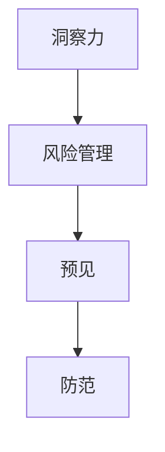

                 

# 洞察力与风险管理：预见与防范的能力

> 关键词：洞察力,风险管理,预见,防范,人工智能,机器学习,深度学习,数据科学

## 1. 背景介绍

### 1.1 问题由来
在快速变化的商业环境中，企业面临着日益复杂的风险挑战。传统的风险管理方法，如合规审查、财务分析、内部审计等，难以应对数据驱动、动态多变的业务环境。人工智能（AI）技术的兴起，为企业的风险管理提供了新的途径。

### 1.2 问题核心关键点
洞察力与风险管理是指利用数据和算法技术，帮助企业预测和防范潜在风险，提升决策效率和效果的过程。这一过程的核心关键点包括：
- **数据采集与处理**：收集和清洗大量业务数据，构建高质量的数据基础。
- **算法模型构建**：设计合适的算法模型，训练数据以提取有价值的洞察力。
- **风险识别与预警**：识别出潜在的风险因素，并及时预警。
- **决策辅助**：辅助管理层进行决策，减少人为错误，提高风险管理效率。

### 1.3 问题研究意义
洞察力与风险管理的研究，对提升企业决策质量和效率具有重要意义。具体而言，它可以帮助企业：
1. **提前预警风险**：通过数据分析和模型预测，及时发现和预警可能发生的风险事件，减少损失。
2. **优化资源配置**：借助数据分析，优化资源分配，提高资源利用率。
3. **改善客户体验**：通过数据洞察，提升产品和服务质量，增强客户满意度。
4. **促进合规性**：利用数据和算法，监测业务行为，确保合规性。
5. **强化创新能力**：基于洞察力的决策，推动业务创新，增强市场竞争力。

## 2. 核心概念与联系

### 2.1 核心概念概述

洞察力与风险管理是一个涉及数据科学、机器学习、深度学习等多个领域的技术集合。本节将详细介绍几个关键概念：

- **洞察力（Insight）**：从大量数据中提取有用信息的过程。
- **风险管理（Risk Management）**：识别、评估和缓解风险的策略和措施。
- **预见（Forecasting）**：通过模型预测未来事件的概率和影响。
- **防范（Mitigation）**：采取措施降低风险发生的概率或减轻风险影响。

这些概念之间的逻辑关系可以通过以下Mermaid流程图来展示：



这个流程图展示了洞察力与风险管理的主要流程：通过洞察力识别风险，利用预见预测风险，采取防范措施缓解风险。

## 3. 核心算法原理 & 具体操作步骤

### 3.1 算法原理概述

洞察力与风险管理的核心算法原理包括数据预处理、特征工程、模型训练和风险预警。

1. **数据预处理**：包括数据清洗、数据归一化、特征选择等步骤，保证数据的质量和一致性。
2. **特征工程**：根据业务需求和模型特点，设计和构造输入特征，提升模型性能。
3. **模型训练**：选择合适的算法模型，如回归模型、分类模型、深度学习模型等，通过训练数据优化模型参数。
4. **风险预警**：利用训练好的模型，对新数据进行预测和评估，及时发现和预警风险事件。

### 3.2 算法步骤详解

基于上述原理，洞察力与风险管理的典型操作流程如下：

**Step 1: 数据收集与清洗**
- 收集业务数据，如交易记录、客户信息、市场数据等。
- 清洗数据，处理缺失值、异常值等，确保数据质量。

**Step 2: 特征提取与选择**
- 根据业务需求，设计特征，如交易金额、客户信用评分、市场指数等。
- 使用特征选择技术，如LASSO回归、PCA等，提取最具代表性的特征。

**Step 3: 模型选择与训练**
- 选择适合的风险管理模型，如逻辑回归、随机森林、深度神经网络等。
- 分割数据集，使用训练集训练模型，验证集评估模型性能。

**Step 4: 风险识别与预警**
- 对新数据输入模型，输出风险概率或评分。
- 设定风险阈值，当风险评分超过阈值时，触发预警。

### 3.3 算法优缺点

洞察力与风险管理具有以下优点：
1. **高效性**：利用机器学习和深度学习技术，处理大量数据，提高决策效率。
2. **准确性**：通过数据分析和模型训练，提升风险预测的准确性。
3. **可解释性**：利用解释性算法，提供决策依据，增强管理层信任。
4. **适应性强**：算法模型具有较强的泛化能力，能够适应不同业务场景。

同时，该方法也存在一些局限性：
1. **数据质量依赖**：算法效果依赖于数据质量，数据缺失或异常将影响预测准确性。
2. **模型复杂度**：复杂模型可能需要大量的计算资源和训练时间。
3. **模型解释性不足**：一些高级算法模型（如深度学习）难以解释其内部工作机制。
4. **过拟合风险**：模型过度拟合训练数据，可能导致在实际应用中表现不佳。

### 3.4 算法应用领域

洞察力与风险管理在多个领域具有广泛应用，例如：

- **金融风险管理**：预测信用风险、市场风险、操作风险等。
- **医疗风险管理**：识别疾病风险、治疗效果、医疗成本等。
- **供应链风险管理**：监控供应链中断、库存积压、供应商风险等。
- **网络安全风险管理**：识别网络攻击、数据泄露、系统故障等。
- **市场营销风险管理**：预测销售趋势、客户流失、广告效果等。

## 4. 数学模型和公式 & 详细讲解 & 举例说明

### 4.1 数学模型构建

洞察力与风险管理的数学模型构建，主要基于统计学和机器学习的基本原理。以下是一个基于逻辑回归的简单风险预警模型：

设 $X=(x_1, x_2, ..., x_n)$ 为特征向量，$y$ 为风险评分，则逻辑回归模型为：

$$
P(y=1|X) = \frac{1}{1 + e^{-\theta^TX}}
$$

其中 $\theta$ 为模型参数，$P(y=1|X)$ 表示在特征 $X$ 下，事件发生的概率。

### 4.2 公式推导过程

以逻辑回归模型为例，推导其参数更新公式：

设 $L(\theta)$ 为逻辑回归模型的损失函数，通常使用交叉熵损失，即：

$$
L(\theta) = -\frac{1}{N}\sum_{i=1}^N y_i\log P(y=1|X_i) + (1-y_i)\log P(y=0|X_i)
$$

其中 $N$ 为样本数量。

对 $L(\theta)$ 求导，得：

$$
\frac{\partial L(\theta)}{\partial \theta} = \frac{1}{N}\sum_{i=1}^N P(y=1|X_i)(1 - P(y=1|X_i))X_i
$$

通过梯度下降算法，更新参数 $\theta$：

$$
\theta \leftarrow \theta - \alpha \frac{\partial L(\theta)}{\partial \theta}
$$

其中 $\alpha$ 为学习率。

### 4.3 案例分析与讲解

假设某银行想要预测客户的违约风险，收集了历史交易数据 $X$ 和违约标签 $y$，利用逻辑回归模型进行训练。训练过程如下：

1. **数据准备**：收集客户交易记录，提取特征如交易金额、信用评分等。
2. **数据清洗**：处理缺失值、异常值，确保数据质量。
3. **特征选择**：选择最重要的特征，去除无关特征。
4. **模型训练**：使用训练集数据 $X$ 和 $y$，训练逻辑回归模型，更新参数 $\theta$。
5. **风险预警**：对新客户输入特征 $X$，使用训练好的模型计算违约概率 $P(y=1|X)$，当 $P(y=1|X) > 0.5$ 时，触发预警。

## 5. 项目实践：代码实例和详细解释说明

### 5.1 开发环境搭建

在进行洞察力与风险管理项目实践前，我们需要准备好开发环境。以下是使用Python进行Scikit-learn开发的准备流程：

1. 安装Anaconda：从官网下载并安装Anaconda，用于创建独立的Python环境。

2. 创建并激活虚拟环境：
```bash
conda create -n risk-management python=3.8 
conda activate risk-management
```

3. 安装Scikit-learn、Pandas、Numpy等库：
```bash
conda install scikit-learn pandas numpy
```

4. 安装其他常用库：
```bash
pip install matplotlib seaborn statsmodels
```

完成上述步骤后，即可在`risk-management`环境中开始项目开发。

### 5.2 源代码详细实现

以下是一个基于Scikit-learn的逻辑回归风险预警模型的实现示例：

```python
import pandas as pd
from sklearn.linear_model import LogisticRegression
from sklearn.model_selection import train_test_split
from sklearn.metrics import classification_report

# 加载数据
df = pd.read_csv('credit_data.csv')

# 特征工程
X = df[['loan_amount', 'income', 'credit_score']]
y = df['default']

# 分割数据集
X_train, X_test, y_train, y_test = train_test_split(X, y, test_size=0.2, random_state=42)

# 模型训练
model = LogisticRegression()
model.fit(X_train, y_train)

# 评估模型
y_pred = model.predict(X_test)
print(classification_report(y_test, y_pred))

# 风险预警
new_customer = pd.DataFrame([[5000, 50000, 650]])
new_customer['default'] = model.predict_proba(new_customer)[:, 1]
if new_customer['default'].values[0] > 0.5:
    print('高风险客户，请采取防范措施')
```

以上代码展示了基于Scikit-learn库的逻辑回归模型实现过程。包括数据加载、特征工程、模型训练、评估和风险预警等关键步骤。

### 5.3 代码解读与分析

让我们再详细解读一下关键代码的实现细节：

**数据加载与处理**：
- `pd.read_csv('credit_data.csv')`：使用Pandas库读取数据集。
- `X = df[['loan_amount', 'income', 'credit_score']]`：提取特征列，去除无关特征。
- `y = df['default']`：提取标签列。

**模型训练**：
- `train_test_split`：将数据集分割为训练集和测试集，比例为80/20。
- `LogisticRegression()`：创建逻辑回归模型对象。
- `model.fit(X_train, y_train)`：使用训练集数据拟合模型。

**模型评估**：
- `y_pred = model.predict(X_test)`：对测试集数据进行预测。
- `classification_report(y_test, y_pred)`：输出模型的分类报告，评估模型性能。

**风险预警**：
- `new_customer = pd.DataFrame([[5000, 50000, 650]])`：构建新客户的特征数据。
- `new_customer['default'] = model.predict_proba(new_customer)[:, 1]`：使用训练好的模型计算新客户的违约概率。
- `if new_customer['default'].values[0] > 0.5`：判断新客户是否为高风险客户，并触发预警。

## 6. 实际应用场景

### 6.1 金融风险管理

金融领域是洞察力与风险管理的重要应用场景。利用机器学习模型，银行和金融机构可以实时监控和预测信贷风险、市场风险等。

在具体应用中，可以收集客户的历史交易数据、信用记录、社交媒体信息等，构建多维度的风险特征。利用训练好的模型，对新客户进行风险评分，实时预警高风险客户。

### 6.2 医疗风险管理

医疗领域中，洞察力与风险管理可以帮助医疗机构预测患者疾病风险、治疗效果、医疗费用等。

例如，通过分析患者的医疗记录、基因数据、生活习惯等，构建预测模型。对新患者的医疗需求进行预测，及时调整治疗方案，优化资源配置。

### 6.3 供应链风险管理

供应链管理中，洞察力与风险管理可以监控供应链的各个环节，识别潜在的风险因素，如供应商故障、库存积压、物流延迟等。

利用机器学习模型，对供应链数据进行实时监测和预测。一旦发现异常，立即采取措施，如调整库存、更换供应商等，保障供应链的稳定性和可靠性。

### 6.4 网络安全风险管理

网络安全领域中，洞察力与风险管理可以帮助企业识别和防范潜在的网络攻击、数据泄露等风险。

通过分析网络日志、访问记录等数据，构建异常检测模型。对新数据进行实时监测，及时预警异常行为，采取防御措施，保障网络安全。

## 7. 工具和资源推荐

### 7.1 学习资源推荐

为了帮助开发者系统掌握洞察力与风险管理的理论基础和实践技巧，这里推荐一些优质的学习资源：

1. 《数据科学与机器学习》系列博文：深入浅出地介绍了数据科学和机器学习的基本原理和实践方法。
2. 《统计学习基础》课程：由Coursera开设，详细讲解了统计学和机器学习的理论基础。
3. 《机器学习实战》书籍：由Peter Harrington所著，提供了大量实用的机器学习案例和代码实现。
4. Kaggle：全球最大的数据科学竞赛平台，提供了丰富的数据集和模型案例，适合实践学习。

通过对这些资源的学习实践，相信你一定能够快速掌握洞察力与风险管理的精髓，并用于解决实际的业务问题。

### 7.2 开发工具推荐

高效的开发离不开优秀的工具支持。以下是几款用于洞察力与风险管理开发的常用工具：

1. Scikit-learn：Python的机器学习库，提供了多种常用算法模型和工具函数，适合快速迭代研究。
2. TensorFlow：由Google主导开发的深度学习框架，支持多种算法模型，生产部署方便。
3. Keras：高层次的神经网络API，易于上手，适合快速构建和训练深度学习模型。
4. H2O.ai：提供自动化机器学习平台，支持多种算法模型和数据处理工具，适合大规模工程应用。

合理利用这些工具，可以显著提升洞察力与风险管理的开发效率，加快创新迭代的步伐。

### 7.3 相关论文推荐

洞察力与风险管理的研究源于学界的持续研究。以下是几篇奠基性的相关论文，推荐阅读：

1. "Logistic Regression: What and Why"：介绍逻辑回归模型的原理和应用，适合初学者理解。
2. "An Introduction to Statistical Learning"：由Gareth James等人合著，详细讲解了统计学习的基本原理和方法。
3. "Deep Learning"：由Ian Goodfellow等人合著，全面介绍了深度学习的理论和实践。
4. "Predictive Analytics: The Science of Using Data to Predict the Future"：介绍预测分析的基本方法和应用场景，适合业务人员理解。

这些论文代表了大数据和机器学习领域的研究进展，通过学习这些前沿成果，可以帮助研究者把握学科前进方向，激发更多的创新灵感。

## 8. 总结：未来发展趋势与挑战

### 8.1 总结

本文对洞察力与风险管理方法进行了全面系统的介绍。首先阐述了洞察力与风险管理的研究背景和意义，明确了该方法在提升企业决策质量和效率方面的独特价值。其次，从原理到实践，详细讲解了洞察力与风险管理的数学原理和关键步骤，给出了洞察力与风险管理任务的开发代码实例。同时，本文还探讨了该方法在金融、医疗、供应链等多个行业领域的应用前景，展示了其在提升业务智能化水平方面的巨大潜力。

通过本文的系统梳理，可以看到，洞察力与风险管理利用数据科学和机器学习技术，帮助企业预测和防范潜在风险，提升决策效率和效果。借助洞察力与风险管理方法，企业可以更好地适应快速变化的商业环境，提高竞争力。

### 8.2 未来发展趋势

展望未来，洞察力与风险管理技术将呈现以下几个发展趋势：

1. **自动化和智能化**：利用自动化机器学习平台，加速模型训练和调优，提升决策效率。
2. **多模态融合**：融合多种数据源，如文本、图像、音频等，提升风险预警的全面性和准确性。
3. **实时性增强**：利用流数据处理技术，实现实时监测和预警，提高风险管理的及时性。
4. **深度学习扩展**：引入深度学习模型，提升风险预测的准确性和泛化能力。
5. **跨领域应用扩展**：洞察力与风险管理技术将在更多领域得到应用，如农业、物流、能源等。
6. **模型可解释性增强**：利用可解释性算法，增强模型的透明性和可理解性，增强管理层信任。

以上趋势凸显了洞察力与风险管理技术的广阔前景。这些方向的探索发展，必将进一步提升企业决策质量，助力业务创新，为商业环境带来新的变革。

### 8.3 面临的挑战

尽管洞察力与风险管理技术已经取得了瞩目成就，但在迈向更加智能化、普适化应用的过程中，它仍面临着诸多挑战：

1. **数据质量瓶颈**：高质量数据的获取和处理仍然是一个挑战，数据缺失、异常和噪声等问题需要持续改进。
2. **模型复杂度**：复杂的算法模型需要大量的计算资源和训练时间，如何优化模型性能和资源消耗是一大难题。
3. **模型可解释性不足**：高级算法模型的复杂性，使得其内部工作机制难以解释，缺乏透明性。
4. **模型鲁棒性不足**：模型在面对新数据和新场景时，容易过拟合或泛化能力不足。
5. **安全性风险**：数据隐私和模型安全性问题需要持续关注，避免数据泄露和模型被攻击的风险。

### 8.4 研究展望

面对洞察力与风险管理所面临的种种挑战，未来的研究需要在以下几个方面寻求新的突破：

1. **数据增强技术**：利用数据增强技术，扩充数据集，提升模型的泛化能力。
2. **模型压缩与优化**：开发更加轻量级的模型压缩和优化算法，提升模型的推理速度和资源效率。
3. **跨模态融合**：研究多模态数据的融合技术，提升模型的全面性和鲁棒性。
4. **模型可解释性**：引入可解释性算法，增强模型的透明性和可理解性。
5. **模型鲁棒性**：研究鲁棒性增强技术，提高模型在面对新数据和新场景时的性能。
6. **数据安全与隐私**：开发数据安全和隐私保护技术，保障数据和模型安全。

这些研究方向的探索，必将引领洞察力与风险管理技术迈向更高的台阶，为构建安全、可靠、可解释、可控的智能系统铺平道路。面向未来，洞察力与风险管理技术还需要与其他人工智能技术进行更深入的融合，如知识表示、因果推理、强化学习等，多路径协同发力，共同推动自然语言理解和智能交互系统的进步。只有勇于创新、敢于突破，才能不断拓展技术边界，让智能技术更好地造福人类社会。

## 9. 附录：常见问题与解答

**Q1：洞察力与风险管理是否适用于所有业务场景？**

A: 洞察力与风险管理技术可以在许多业务场景中应用，但具体效果需要根据业务特点和数据质量进行评估。例如，对于一些需要实时性、高可靠性的场景，如金融风控、医疗诊断等，洞察力与风险管理技术表现尤为突出。而对于一些较为简单、数据结构明确的业务，如库存管理、任务调度等，其他更传统的业务管理方法可能更为合适。

**Q2：如何提高洞察力与风险管理的模型性能？**

A: 提高模型性能的关键在于数据质量、特征工程和算法模型。具体措施包括：
1. 数据清洗：处理缺失值、异常值，确保数据质量。
2. 特征选择：选择最具代表性的特征，去除无关特征。
3. 算法优化：选择合适的算法模型，进行参数调优，提升模型泛化能力。
4. 数据增强：利用数据增强技术，扩充数据集，提升模型泛化能力。
5. 模型集成：结合多个模型的预测结果，提升整体性能。

**Q3：洞察力与风险管理是否适用于小型企业？**

A: 洞察力与风险管理技术对数据和计算资源的需求较高，对于小型企业来说可能存在一定的挑战。但通过合理的数据采集和处理、选择合适的算法模型和工具，洞察力与风险管理技术仍然可以为小型企业带来显著的业务效益。例如，通过分析简单的业务指标，利用简单的模型进行风险预警，能够有效提升小型企业的业务决策效率和质量。

**Q4：洞察力与风险管理是否需要大量的数据？**

A: 洞察力与风险管理对数据量的需求因具体应用场景而异。一般来说，数据量越大，模型的性能越好。但对于一些小规模的、特殊领域的场景，可能需要通过数据增强等技术，扩充数据量。对于数据量较少的场景，可以采用少样本学习或半监督学习等技术，提升模型性能。

**Q5：洞察力与风险管理是否需要高水平的技术团队？**

A: 洞察力与风险管理需要一定的技术积累，但不需要非常高水平的技术团队。通过系统的培训和学习，普通工程师也可以掌握相关技术。另外，通过选择适合的工具和平台，可以大大简化开发过程，降低技术门槛。

总之，洞察力与风险管理技术具有广泛的适用性，但其效果受到数据质量、算法模型和资源投入等因素的影响。合理选择和应用该技术，能够显著提升企业的决策效率和效果。

