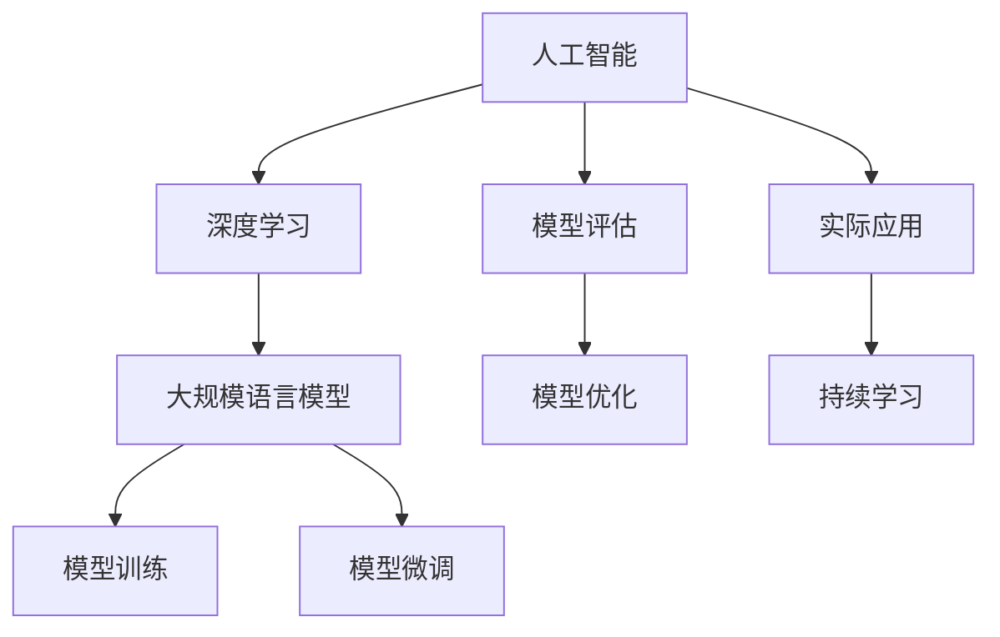

                 

# 深入理解AI、LLM和深度学习：一个实践性课程

## 1. 背景介绍

### 1.1 问题由来

人工智能（AI）、大规模语言模型（LLM）和深度学习（DL）在过去十年里取得了惊人的进展，这一波的技术浪潮深刻改变了多个行业的运作方式。从自动驾驶汽车到医疗诊断，再到金融分析和客服系统，AI和DL技术正在被应用于越来越多的场景。然而，这些技术的背后原理、实际应用以及如何从零开始构建自己的AI模型仍然是一个复杂而深奥的话题，许多从业者和爱好者都面临着理解这些技术的工作原理和构建实际应用所需的挑战。

为了帮助那些对AI和DL感兴趣的人更深入地理解这些概念，并能够实际动手构建自己的AI模型，我们将通过一个实践性的课程来探讨AI、LLM和DL的核心概念、算法原理以及它们在实际项目中的应用。我们将从理论开始，然后逐步深入到实际项目的代码实现和数据处理，最后讨论这些技术在未来发展中的潜在应用和面临的挑战。

### 1.2 问题核心关键点

课程的核心内容包括：
- 深入理解AI和DL的基本概念和算法原理
- 学习如何使用Python和TensorFlow等工具构建、训练和部署AI模型
- 探讨如何对大规模语言模型进行微调，以适应特定任务的需求
- 理解数据处理、特征工程和模型评估的重要性
- 讨论AI技术在实际应用中的伦理、法律和安全问题

本课程将覆盖从初级到高级的AI和DL知识，适合任何对AI和DL技术感兴趣的从业者或学习者。无论你是计算机科学专业的学生，还是希望在职业生涯中应用AI技术的专业人士，都将从本课程中获得丰富的知识。

## 2. 核心概念与联系

### 2.1 核心概念概述

- **人工智能（AI）**：指模拟人类智能行为的技术，包括感知、推理、学习和决策等能力。
- **深度学习（DL）**：一种机器学习技术，通过构建多层神经网络来实现数据的特征提取和模式识别。
- **大规模语言模型（LLM）**：指使用大量文本数据进行预训练的模型，能够理解和生成自然语言，是当前NLP领域最先进的技术。
- **模型训练**：通过使用大量标注数据对模型进行训练，使其能够对新数据进行预测或分类。
- **模型微调**：对预训练模型进行微调，以适应特定任务的需求，通常使用少量的标注数据。

这些概念之间的联系可以通过以下Mermaid流程图来展示：



这个流程图展示了AI和DL技术的发展路径，从基础概念到具体实现，再到模型训练、微调和实际应用的整个过程。

## 3. 核心算法原理 & 具体操作步骤

### 3.1 算法原理概述

深度学习的基本原理是构建多层神经网络，通过反向传播算法来训练模型，使其能够学习数据中的特征和模式。而大规模语言模型则是基于这种原理，通过在大规模无标签文本数据上进行预训练，学习语言的通用表示，然后通过微调来适应特定任务。

### 3.2 算法步骤详解

构建一个基于DL的AI模型的基本步骤如下：
1. **数据准备**：收集和预处理数据集，确保数据的质量和多样性。
2. **模型选择**：选择适合的神经网络架构，包括层数、节点数等。
3. **模型训练**：使用优化器（如Adam、SGD）对模型进行训练，最小化损失函数。
4. **模型微调**：对模型进行微调，适应特定任务的需求，通常使用少量的标注数据。
5. **模型评估**：使用验证集评估模型性能，调整模型参数和超参数。
6. **模型部署**：将模型部署到实际应用中，进行预测或分类。

### 3.3 算法优缺点

深度学习的主要优点包括：
- 能够自动提取数据中的特征
- 在大规模数据上训练效果显著
- 在图像、语音等复杂任务上表现优异

然而，深度学习也存在一些缺点：
- 对标注数据依赖较大
- 模型训练复杂，计算资源消耗大
- 模型解释性较差

### 3.4 算法应用领域

深度学习技术已经被广泛应用于多个领域，包括：
- 计算机视觉：如图像分类、目标检测、图像生成等。
- 自然语言处理：如机器翻译、文本生成、情感分析等。
- 语音识别：如语音转文字、语音合成等。
- 推荐系统：如电商推荐、新闻推荐等。
- 医疗健康：如医学影像分析、基因分析等。

## 4. 数学模型和公式 & 详细讲解 & 举例说明

### 4.1 数学模型构建

一个基本的深度学习模型可以表示为：
$$ y = f(x; \theta) $$
其中 $x$ 是输入数据，$y$ 是输出结果，$\theta$ 是模型的参数，$f$ 是模型的映射函数。

对于神经网络，通常使用前馈神经网络（Feedforward Neural Network, FNN）作为基本模型。FNN包含多个神经元层，每一层将前一层的输出作为输入，并通过权重和偏置进行计算。

### 4.2 公式推导过程

以一个简单的全连接神经网络为例，其前向传播的公式为：
$$ h^{(l)} = g(\mathbf{W}^{(l)}\mathbf{x} + \mathbf{b}^{(l)}) $$
其中 $h^{(l)}$ 是第$l$层的输出，$\mathbf{W}^{(l)}$ 和 $\mathbf{b}^{(l)}$ 分别是第$l$层的权重和偏置，$g$ 是非线性激活函数。

反向传播算法用于计算模型参数的梯度，以优化损失函数。其基本步骤如下：
1. 计算预测值与真实值之间的损失函数。
2. 计算损失函数对每一层输出结果的梯度。
3. 通过链式法则计算损失函数对每一层参数的梯度。
4. 使用优化器更新模型参数。

### 4.3 案例分析与讲解

以图像分类任务为例，可以使用卷积神经网络（Convolutional Neural Network, CNN）来构建模型。CNN通过卷积层、池化层等操作提取图像特征，并通过全连接层进行分类。在训练过程中，通过反向传播算法优化模型参数，最小化损失函数。

## 5. 项目实践：代码实例和详细解释说明

### 5.1 开发环境搭建

本课程将使用Python和TensorFlow作为主要开发工具。以下是环境搭建步骤：
1. 安装Python 3.x 和 Anaconda。
2. 创建虚拟环境，并激活。
3. 安装TensorFlow和其他必要的库，如Keras、NumPy等。

### 5.2 源代码详细实现

以手写数字识别任务为例，使用TensorFlow和Keras构建CNN模型。代码如下：

```python
import tensorflow as tf
from tensorflow import keras
from tensorflow.keras import layers

# 定义模型
model = keras.Sequential([
    layers.Conv2D(32, (3,3), activation='relu', input_shape=(28,28,1)),
    layers.MaxPooling2D((2,2)),
    layers.Conv2D(64, (3,3), activation='relu'),
    layers.MaxPooling2D((2,2)),
    layers.Flatten(),
    layers.Dense(128, activation='relu'),
    layers.Dense(10, activation='softmax')
])

# 编译模型
model.compile(optimizer='adam',
              loss='sparse_categorical_crossentropy',
              metrics=['accuracy'])

# 加载数据集
mnist = keras.datasets.mnist
(x_train, y_train), (x_test, y_test) = mnist.load_data()

# 数据预处理
x_train = x_train / 255.0
x_test = x_test / 255.0

# 训练模型
model.fit(x_train, y_train, epochs=10, validation_data=(x_test, y_test))
```

### 5.3 代码解读与分析

以上代码展示了从定义模型、编译模型、加载数据集、数据预处理到训练模型的完整流程。模型由多个卷积层、池化层和全连接层组成，使用softmax激活函数进行多分类预测。

## 6. 实际应用场景

### 6.1 计算机视觉

计算机视觉领域是深度学习最活跃的领域之一，如图像分类、目标检测、图像生成等任务。例如，在自动驾驶中，深度学习模型可以用于车辆识别、行人检测等。

### 6.2 自然语言处理

自然语言处理（NLP）是另一个深度学习的重要应用领域。NLP技术可以用于文本分类、情感分析、机器翻译等任务。大规模语言模型，如BERT、GPT等，已经在这些任务上取得了显著的成果。

### 6.3 推荐系统

推荐系统在电商、新闻等应用中广泛使用。深度学习模型可以分析用户行为和商品特征，推荐个性化的商品或内容。

### 6.4 医疗健康

在医疗领域，深度学习模型可以用于医学影像分析、基因分析等任务。例如，使用卷积神经网络（CNN）对医学影像进行分类，或使用循环神经网络（RNN）进行序列数据分析。

### 6.5 未来应用展望

未来的AI和DL技术将更加智能化和普适化。AI技术将在更多领域得到应用，如智慧城市、智能家居、工业自动化等。同时，DL技术也将更加高效和普适，能在更小的计算资源下运行，并在边缘设备上部署。

## 7. 工具和资源推荐

### 7.1 学习资源推荐

- **《深度学习》（Ian Goodfellow 著）**：全面介绍了深度学习的基本概念和算法，是入门深度学习的必读书籍。
- **Coursera 的深度学习课程**：由斯坦福大学的Andrew Ng教授主讲，深入浅出地介绍了深度学习的基础知识和应用。
- **Kaggle**：全球最大的数据科学竞赛平台，可以学习到许多实际项目案例，并参与到竞赛中提升自己的实战能力。

### 7.2 开发工具推荐

- **TensorFlow**：由Google开发的深度学习框架，支持多种编程语言和平台。
- **PyTorch**：Facebook开发的深度学习框架，易于使用且灵活性高。
- **Jupyter Notebook**：用于数据科学和机器学习的交互式编程环境。

### 7.3 相关论文推荐

- **ImageNet Large Scale Visual Recognition Challenge**：介绍深度学习在图像分类任务上的突破。
- **Attention is All You Need**：介绍Transformer模型及其在自然语言处理任务上的应用。
- **BERT: Pre-training of Deep Bidirectional Transformers for Language Understanding**：介绍BERT模型及其在大规模语言模型预训练中的应用。

## 8. 总结：未来发展趋势与挑战

### 8.1 研究成果总结

深度学习和AI技术在过去十年里取得了显著的进展，已经在多个领域得到广泛应用。未来，这些技术将继续发展，并在更多领域发挥更大的作用。

### 8.2 未来发展趋势

未来的深度学习技术将更加智能化、普适化和可解释性更强。随着计算资源和算法的进步，深度学习模型将更加高效和轻量化。同时，深度学习技术将与其他AI技术，如强化学习、知识图谱等进行更深入的融合，推动AI技术的进一步发展。

### 8.3 面临的挑战

尽管深度学习技术已经取得了巨大的进展，但在实际应用中仍然面临诸多挑战：
- **计算资源需求大**：深度学习模型需要大量的计算资源进行训练和推理。
- **数据隐私和安全**：深度学习模型对数据的依赖使得数据隐私和安全成为重要问题。
- **模型可解释性**：深度学习模型的决策过程难以解释，需要进一步提高其可解释性。
- **伦理和法律问题**：深度学习模型的应用需要考虑伦理和法律问题，避免滥用和误用。

### 8.4 研究展望

未来的研究需要解决这些问题，推动深度学习技术向更广泛的应用领域发展。需要进一步提升深度学习模型的可解释性和安全性，同时也需要在算法和硬件上做出更多的创新，以适应更复杂和多样化的任务需求。

## 9. 附录：常见问题与解答

**Q1：如何选择合适的深度学习模型？**

A: 选择深度学习模型需要考虑数据的特点、任务的需求以及计算资源的限制。一般来说，可以使用前馈神经网络、卷积神经网络、循环神经网络等模型，根据具体情况进行选择。

**Q2：深度学习模型训练过程中如何进行调参？**

A: 深度学习模型的调参通常包括选择合适的学习率、优化器、批大小、层数和节点数等。可以使用网格搜索、随机搜索等方法进行调参，并通过交叉验证评估模型性能。

**Q3：深度学习模型的解释性如何提升？**

A: 提升深度学习模型的解释性可以通过以下方法：
- 使用可解释性模型，如决策树、线性回归等。
- 使用可视化工具，如TensorBoard，可视化模型的训练过程和决策过程。
- 使用特征重要性分析，了解模型对输入数据的依赖。

**Q4：深度学习在实际应用中需要注意哪些伦理和安全问题？**

A: 深度学习在实际应用中需要注意以下伦理和安全问题：
- 数据隐私：确保数据的匿名性和隐私性，避免数据泄露。
- 模型公平性：避免模型偏见和歧视，确保模型的公平性。
- 算法透明性：提高算法的透明性和可解释性，避免“黑盒”模型。
- 责任归属：明确模型的责任归属，确保法律和安全问题有明确的解决方案。

---

作者：禅与计算机程序设计艺术 / Zen and the Art of Computer Programming

