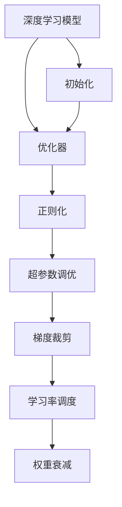

                 

# 深度学习优化技巧：初始化、AdamW优化器等

> 关键词：深度学习,初始化,优化器,AdamW,正则化,超参数调优,梯度裁剪,学习率调度,权重衰减

## 1. 背景介绍

### 1.1 问题由来
深度学习模型在实际应用中，往往需要经过长时间的训练才能达到最优效果。然而，长时间的训练不仅耗费大量计算资源，还容易过拟合训练集，导致泛化性能差。因此，如何更有效地优化深度学习模型的训练过程，使其在短时间内收敛到最优解，成为深度学习领域的重要课题。

优化技巧在深度学习中扮演着重要角色，通过合理的初始化、优化器选择、正则化、超参数调优、梯度裁剪、学习率调度、权重衰减等手段，可以显著提升模型训练效率和泛化能力。本文将详细介绍这些关键优化技巧，帮助读者提升深度学习模型的训练效果。

### 1.2 问题核心关键点
优化技巧的核心在于通过合理的设计，避免模型在训练过程中过拟合训练集，同时保证模型的泛化性能。具体包括以下几个关键点：

1. 初始化：通过合理的权重初始化策略，使模型更容易收敛。
2. 优化器选择：选择合适的优化算法，使其能够高效地更新模型参数。
3. 正则化：通过L2正则、Dropout等方法，防止模型过拟合训练集。
4. 超参数调优：通过网格搜索、贝叶斯优化等方法，寻找最优的超参数组合。
5. 梯度裁剪：通过限制梯度的范数，避免梯度爆炸或消失。
6. 学习率调度：通过动态调整学习率，使模型能够平稳地收敛。
7. 权重衰减：通过惩罚模型复杂度，防止过拟合。

这些关键技巧相互配合，能够显著提升深度学习模型的训练效果。

### 1.3 问题研究意义
优化技巧在深度学习模型的训练中具有重要意义，其主要研究意义如下：

1. 提高模型训练效率：合理的优化技巧可以加快模型收敛速度，减少训练时间。
2. 提升模型泛化性能：通过正则化、权重衰减等手段，防止模型过拟合训练集，提升模型泛化能力。
3. 降低计算资源消耗：优化技巧可以避免不必要的计算资源消耗，减少计算成本。
4. 增强模型稳定性：通过梯度裁剪、学习率调度等手段，增强模型对异常值的鲁棒性。

本文将详细介绍这些优化技巧的原理和实现方法，帮助读者掌握深度学习模型的优化方法，提升模型训练效果。

## 2. 核心概念与联系

### 2.1 核心概念概述

为更好地理解深度学习模型的优化技巧，本节将介绍几个密切相关的核心概念：

- 深度学习模型(Deep Learning Model)：以神经网络为代表的深度学习模型，通过多层非线性变换，能够学习到复杂的特征表示。
- 优化器(Optimizer)：用于更新模型参数，使模型能够逐步逼近最优解的算法。
- 正则化(Regularization)：通过在损失函数中引入正则项，防止模型过拟合训练集。
- 超参数(Hyperparameters)：用于控制模型训练过程的参数，如学习率、批次大小、迭代轮数等。
- 梯度裁剪(Gradient Clipping)：通过限制梯度的范数，避免梯度爆炸或消失，提升模型稳定性。
- 学习率调度(Learning Rate Scheduling)：通过动态调整学习率，使模型能够平稳地收敛。
- 权重衰减(Weight Decay)：通过惩罚模型复杂度，防止过拟合。

这些核心概念之间的逻辑关系可以通过以下Mermaid流程图来展示：



这个流程图展示了几类优化技巧之间的逻辑关系：

1. 深度学习模型通过优化器进行参数更新，学习到更复杂的特征表示。
2. 优化器通过正则化和超参数调优，防止模型过拟合，提升训练效果。
3. 梯度裁剪和权重衰减进一步提升模型的稳定性。
4. 学习率调度在训练过程中动态调整学习率，使模型能够平稳地收敛。
5. 权重初始化在训练开始前对模型参数进行合理设置，加速收敛。

这些概念共同构成了深度学习模型的优化框架，使其能够在各种场景下发挥强大的学习能力。通过理解这些核心概念，我们可以更好地把握深度学习模型的优化方向。

## 3. 核心算法原理 & 具体操作步骤
### 3.1 算法原理概述

深度学习模型的优化过程主要涉及模型参数的更新，使其能够最小化损失函数。常用的优化算法包括梯度下降法、AdamW优化器等。

以AdamW优化器为例，其核心思想是：
- 计算梯度的一阶矩估计(mean)和二阶矩估计(variance)。
- 使用这些估计值进行梯度更新。
- 引入权重衰减项，防止过拟合。

形式化地，假设模型参数为 $\theta$，损失函数为 $\mathcal{L}$，学习率为 $\eta$，则AdamW优化器的更新公式为：

$$
\theta_{t+1} = \theta_t - \eta \left(\frac{m_t}{\sqrt{\beta_2 \epsilon} + \epsilon} \hat{g}_t - \frac{\theta_t}{\sqrt{\beta_1 \epsilon} + \epsilon} \hat{m}_t\right)
$$

其中，$m_t$ 和 $v_t$ 分别为梯度的一阶矩估计和二阶矩估计，$\beta_1$ 和 $\beta_2$ 为指数衰减系数，$\epsilon$ 为数值稳定常数。$\hat{m}_t$ 和 $\hat{g}_t$ 分别为修正的一阶矩估计和梯度值。

### 3.2 算法步骤详解

以AdamW优化器为例，其核心步骤如下：

**Step 1: 初始化**

1. 初始化梯度的一阶矩估计 $m_0$ 和二阶矩估计 $v_0$，一般设为0。
2. 选择适当的学习率 $\eta$ 和正则化系数 $\beta_1$ 和 $\beta_2$。

**Step 2: 计算梯度**

1. 对于每个样本 $(x_i, y_i)$，计算模型预测值 $\hat{y}$ 和损失函数 $\mathcal{L}$。
2. 计算梯度 $g_i = \frac{\partial \mathcal{L}}{\partial \theta}$。

**Step 3: 更新一阶矩估计**

1. 更新梯度的一阶矩估计 $m_t = \beta_1 m_{t-1} + (1-\beta_1) g_i$。

**Step 4: 更新二阶矩估计**

1. 更新梯度的二阶矩估计 $v_t = \beta_2 v_{t-1} + (1-\beta_2) g_i^2$。

**Step 5: 更新模型参数**

1. 计算修正的一阶矩估计 $\hat{m}_t = \frac{m_t}{1-\beta_1^t}$。
2. 计算修正的梯度 $\hat{g}_t = \frac{g_i}{1-\beta_1^t}$。
3. 计算权重衰减项 $\hat{m}_t$。
4. 更新模型参数 $\theta_{t+1} = \theta_t - \eta (\hat{m}_t/\sqrt{v_t} + \theta_t/\sqrt{\beta_1 v_t})$。

**Step 6: 循环迭代**

1. 重复Step 2至Step 5，直至模型收敛或达到预设的迭代轮数。

### 3.3 算法优缺点

AdamW优化器具有以下优点：

1. 收敛速度快：通过使用动量项和梯度的一二阶矩估计，AdamW可以更快地收敛到最优解。
2. 鲁棒性好：对学习率和批次的变动比较鲁棒，可以应对不同的数据分布。
3. 参数高效：不需要手动设置动量参数，自适应地调整一阶矩估计和二阶矩估计的权重。

同时，该算法也存在以下缺点：

1. 参数较多：需要维护梯度的一二阶矩估计，增加了计算量和存储成本。
2. 对异常值敏感：在梯度出现异常时，可能会产生不稳定更新。
3. 学习率的设置仍需手动调节：虽然自适应调整，但学习率的选择仍然需要经验。

尽管存在这些局限性，但AdamW优化器在深度学习模型优化中依然发挥着重要作用，被广泛应用于各种深度学习任务。

### 3.4 算法应用领域

AdamW优化器在深度学习模型的优化过程中，被广泛应用于各种不同的应用领域，包括但不限于：

1. 图像识别：如卷积神经网络(CNN)，用于图像分类、目标检测、语义分割等任务。
2. 自然语言处理(NLP)：如循环神经网络(RNN)、长短期记忆网络(LSTM)、Transformer等，用于文本分类、情感分析、机器翻译等任务。
3. 强化学习：如深度Q网络(DQN)，用于智能游戏、机器人控制等任务。
4. 语音识别：如深度神经网络(DNN)，用于语音识别、语音合成等任务。
5. 推荐系统：如协同过滤算法，用于个性化推荐、广告推荐等任务。

AdamW优化器的广泛应用，证明了其在深度学习模型优化中的强大能力和适应性。

## 4. 数学模型和公式 & 详细讲解  
### 4.1 数学模型构建

深度学习模型的优化过程涉及多个数学概念，包括梯度、一阶矩估计、二阶矩估计等。这里使用数学语言对优化过程进行严格刻画。

假设深度学习模型 $M_{\theta}$ 的损失函数为 $\mathcal{L}(\theta)$，学习率为 $\eta$。则优化过程的目标是最小化损失函数：

$$
\theta^* = \mathop{\arg\min}_{\theta} \mathcal{L}(\theta)
$$

在实际训练中，通常使用随机梯度下降法来求解上述问题。假设每次训练时选取一个小样本 $(x_i, y_i)$，则梯度更新公式为：

$$
\theta_{t+1} = \theta_t - \eta \nabla_{\theta} \mathcal{L}(x_i, y_i)
$$

其中，$\nabla_{\theta} \mathcal{L}(x_i, y_i)$ 为损失函数对模型参数 $\theta$ 的梯度。

### 4.2 公式推导过程

以AdamW优化器为例，其更新公式包括梯度的一二阶矩估计、权重衰减项和动量项的计算。下面详细推导更新公式。

假设模型参数为 $\theta$，梯度为 $g$，动量参数为 $\beta_1$ 和 $\beta_2$，正则化参数为 $\epsilon$，则AdamW优化器的更新公式为：

$$
\theta_{t+1} = \theta_t - \eta \frac{m_t}{\sqrt{\beta_2 \epsilon} + \epsilon} \hat{g}_t - \eta \frac{\theta_t}{\sqrt{\beta_1 \epsilon} + \epsilon} \hat{m}_t
$$

其中，$m_t$ 和 $v_t$ 分别为梯度的一阶矩估计和二阶矩估计：

$$
m_t = \beta_1 m_{t-1} + (1-\beta_1) g_i
$$

$$
v_t = \beta_2 v_{t-1} + (1-\beta_2) g_i^2
$$

$\hat{m}_t$ 和 $\hat{g}_t$ 分别为修正的一阶矩估计和梯度值：

$$
\hat{m}_t = \frac{m_t}{1-\beta_1^t}
$$

$$
\hat{g}_t = \frac{g_i}{1-\beta_1^t}
$$

### 4.3 案例分析与讲解

以图像分类任务为例，展示AdamW优化器的应用。

假设图像分类模型为卷积神经网络(CNN)，输入为 $x$，输出为 $y$，则损失函数可以定义为交叉熵损失：

$$
\mathcal{L} = -\frac{1}{N} \sum_{i=1}^N y_i \log \hat{y}_i
$$

其中，$y_i$ 为真实标签，$\hat{y}_i$ 为模型预测值。

假设模型参数为 $\theta$，初始化为0。则AdamW优化器的更新公式为：

$$
\theta_{t+1} = \theta_t - \eta \frac{m_t}{\sqrt{\beta_2 \epsilon} + \epsilon} \nabla_{\theta} \mathcal{L}(x_i, y_i) - \eta \frac{\theta_t}{\sqrt{\beta_1 \epsilon} + \epsilon} m_t
$$

其中，$m_t$ 和 $v_t$ 分别为梯度的一阶矩估计和二阶矩估计：

$$
m_t = \beta_1 m_{t-1} + (1-\beta_1) \nabla_{\theta} \mathcal{L}(x_i, y_i)
$$

$$
v_t = \beta_2 v_{t-1} + (1-\beta_2) \nabla_{\theta} \mathcal{L}(x_i, y_i)^2
$$

$\hat{m}_t$ 和 $\hat{g}_t$ 分别为修正的一阶矩估计和梯度值：

$$
\hat{m}_t = \frac{m_t}{1-\beta_1^t}
$$

$$
\hat{g}_t = \frac{\nabla_{\theta} \mathcal{L}(x_i, y_i)}{1-\beta_1^t}
$$

通过上述公式，可以逐步更新模型参数 $\theta$，使模型能够更好地拟合训练数据，提升分类性能。

## 5. 项目实践：代码实例和详细解释说明
### 5.1 开发环境搭建

在进行深度学习模型优化实践前，我们需要准备好开发环境。以下是使用Python进行PyTorch开发的环境配置流程：

1. 安装Anaconda：从官网下载并安装Anaconda，用于创建独立的Python环境。

2. 创建并激活虚拟环境：
```bash
conda create -n pytorch-env python=3.8 
conda activate pytorch-env
```

3. 安装PyTorch：根据CUDA版本，从官网获取对应的安装命令。例如：
```bash
conda install pytorch torchvision torchaudio cudatoolkit=11.1 -c pytorch -c conda-forge
```

4. 安装TensorFlow：
```bash
conda install tensorflow
```

5. 安装各类工具包：
```bash
pip install numpy pandas scikit-learn matplotlib tqdm jupyter notebook ipython
```

完成上述步骤后，即可在`pytorch-env`环境中开始优化实践。

### 5.2 源代码详细实现

这里我们以MNIST手写数字识别任务为例，展示使用AdamW优化器进行模型优化的PyTorch代码实现。

首先，定义MNIST数据集：

```python
from torchvision.datasets import MNIST
from torchvision import transforms

train_dataset = MNIST(root='./data', train=True, transform=transforms.ToTensor(), download=True)
test_dataset = MNIST(root='./data', train=False, transform=transforms.ToTensor(), download=True)
```

然后，定义模型和优化器：

```python
import torch.nn as nn
import torch.optim as optim

class Net(nn.Module):
    def __init__(self):
        super(Net, self).__init__()
        self.conv1 = nn.Conv2d(1, 32, 3)
        self.conv2 = nn.Conv2d(32, 64, 3)
        self.fc1 = nn.Linear(64*7*7, 128)
        self.fc2 = nn.Linear(128, 10)

    def forward(self, x):
        x = F.relu(F.max_pool2d(F.relu(self.conv1(x)), (2, 2)))
        x = F.relu(F.max_pool2d(F.relu(self.conv2(x)), (2, 2)))
        x = x.view(-1, 64*7*7)
        x = F.relu(self.fc1(x))
        x = self.fc2(x)
        return x

model = Net()

optimizer = optim.AdamW(model.parameters(), lr=0.001)
```

接着，定义训练和评估函数：

```python
from torch.utils.data import DataLoader
from tqdm import tqdm
from sklearn.metrics import classification_report

device = torch.device('cuda' if torch.cuda.is_available() else 'cpu')
model.to(device)

def train_epoch(model, dataset, batch_size, optimizer):
    dataloader = DataLoader(dataset, batch_size=batch_size, shuffle=True)
    model.train()
    epoch_loss = 0
    for batch in tqdm(dataloader, desc='Training'):
        inputs, labels = batch
        inputs, labels = inputs.to(device), labels.to(device)
        optimizer.zero_grad()
        outputs = model(inputs)
        loss = F.cross_entropy(outputs, labels)
        epoch_loss += loss.item()
        loss.backward()
        optimizer.step()
    return epoch_loss / len(dataloader)

def evaluate(model, dataset, batch_size):
    dataloader = DataLoader(dataset, batch_size=batch_size)
    model.eval()
    preds, labels = [], []
    with torch.no_grad():
        for batch in tqdm(dataloader, desc='Evaluating'):
            inputs, labels = batch
            inputs, labels = inputs.to(device), labels.to(device)
            outputs = model(inputs)
            batch_preds = outputs.argmax(dim=1).to('cpu').tolist()
            batch_labels = labels.to('cpu').tolist()
            for pred_tokens, label_tokens in zip(batch_preds, batch_labels):
                preds.append(pred_tokens)
                labels.append(label_tokens)
                
    print(classification_report(labels, preds))
```

最后，启动训练流程并在测试集上评估：

```python
epochs = 10
batch_size = 64

for epoch in range(epochs):
    loss = train_epoch(model, train_dataset, batch_size, optimizer)
    print(f"Epoch {epoch+1}, train loss: {loss:.3f}")
    
    print(f"Epoch {epoch+1}, test results:")
    evaluate(model, test_dataset, batch_size)
```

以上就是使用PyTorch对MNIST手写数字识别任务进行优化实践的完整代码实现。可以看到，得益于PyTorch和AdamW优化器的强大封装，我们可以用相对简洁的代码完成模型优化。

### 5.3 代码解读与分析

让我们再详细解读一下关键代码的实现细节：

**Net类**：
- `__init__`方法：定义卷积神经网络的结构，包括卷积层、池化层和全连接层。
- `forward`方法：定义前向传播过程，通过多层卷积和池化层，将输入转换为输出。

**模型和优化器**：
- `optimizer`：使用AdamW优化器进行模型参数的更新。

**训练和评估函数**：
- `train_epoch`：对数据以批为单位进行迭代，在每个批次上前向传播计算损失并反向传播更新模型参数，最后返回该epoch的平均损失。
- `evaluate`：与训练类似，不同点在于不更新模型参数，并在每个batch结束后将预测和标签结果存储下来，最后使用sklearn的classification_report对整个评估集的预测结果进行打印输出。

**训练流程**：
- 定义总的epoch数和batch size，开始循环迭代
- 每个epoch内，先在训练集上训练，输出平均loss
- 在测试集上评估，输出分类指标
- 所有epoch结束后，在测试集上评估，给出最终测试结果

可以看到，PyTorch配合AdamW优化器的使用，使得模型优化过程的代码实现变得简洁高效。开发者可以将更多精力放在模型改进、数据处理等高层逻辑上，而不必过多关注底层的实现细节。

当然，工业级的系统实现还需考虑更多因素，如模型的保存和部署、超参数的自动搜索、更灵活的优化器选择等。但核心的优化范式基本与此类似。

## 6. 实际应用场景
### 6.1 图像识别

深度学习模型优化技术在图像识别领域的应用非常广泛。传统的图像分类任务中，通过合理的优化技巧，可以显著提升模型的分类精度和训练效率。

例如，在图像分类任务中，可以通过AdamW优化器、正则化等手段，使得模型能够更好地适应训练数据，避免过拟合，提升泛化性能。具体而言，可以采用以下优化策略：

1. 使用AdamW优化器：通过动量项和梯度的一二阶矩估计，加速模型收敛。
2. 引入正则化：通过L2正则化、Dropout等方法，防止模型过拟合训练集。
3. 调整学习率：通过学习率衰减、学习率调度等方法，动态调整学习率，使模型能够平稳地收敛。

通过这些优化技巧，可以显著提升图像分类模型的训练效果，使其在实际应用中表现更好。

### 6.2 自然语言处理

深度学习模型优化技术在自然语言处理领域同样有着广泛的应用。NLP任务中，如文本分类、情感分析、机器翻译等，通过合理的优化技巧，可以提升模型的准确度和泛化能力。

例如，在文本分类任务中，可以通过AdamW优化器、正则化等手段，使得模型能够更好地适应训练数据，避免过拟合，提升分类效果。具体而言，可以采用以下优化策略：

1. 使用AdamW优化器：通过动量项和梯度的一二阶矩估计，加速模型收敛。
2. 引入正则化：通过L2正则化、Dropout等方法，防止模型过拟合训练集。
3. 调整学习率：通过学习率衰减、学习率调度等方法，动态调整学习率，使模型能够平稳地收敛。

通过这些优化技巧，可以显著提升文本分类模型的训练效果，使其在实际应用中表现更好。

### 6.3 强化学习

深度学习模型优化技术在强化学习领域也有着重要的应用。强化学习任务中，如智能游戏、机器人控制等，通过合理的优化技巧，可以提升模型的决策能力和稳定性。

例如，在智能游戏任务中，可以通过AdamW优化器、正则化等手段，使得模型能够更好地适应训练数据，避免过拟合，提升决策效果。具体而言，可以采用以下优化策略：

1. 使用AdamW优化器：通过动量项和梯度的一二阶矩估计，加速模型收敛。
2. 引入正则化：通过L2正则化、Dropout等方法，防止模型过拟合训练集。
3. 调整学习率：通过学习率衰减、学习率调度等方法，动态调整学习率，使模型能够平稳地收敛。

通过这些优化技巧，可以显著提升强化学习模型的训练效果，使其在实际应用中表现更好。

### 6.4 未来应用展望

随着深度学习模型优化技术的不断发展，未来的优化方法将呈现以下几个发展趋势：

1. 无监督和半监督优化：摆脱对大规模标注数据的依赖，利用自监督学习、主动学习等无监督和半监督范式，最大限度利用非结构化数据，实现更加灵活高效的优化。
2. 参数高效优化：开发更加参数高效的优化方法，在固定大部分预训练参数的同时，只更新极少量的任务相关参数。
3. 多模态优化：将符号化的先验知识，如知识图谱、逻辑规则等，与神经网络模型进行巧妙融合，引导优化过程学习更准确、合理的语言模型。同时加强不同模态数据的整合，实现视觉、语音等多模态信息与文本信息的协同建模。
4. 融合因果和对比学习：通过引入因果推断和对比学习思想，增强优化模型建立稳定因果关系的能力，学习更加普适、鲁棒的语言表征，从而提升模型泛化性和抗干扰能力。
5. 结合伦理道德约束：在优化目标中引入伦理导向的评估指标，过滤和惩罚有偏见、有害的输出倾向，确保优化过程符合人类价值观和伦理道德。

这些趋势将推动深度学习模型优化技术迈向更高的台阶，为构建安全、可靠、可解释、可控的智能系统铺平道路。

## 7. 工具和资源推荐
### 7.1 学习资源推荐

为了帮助开发者系统掌握深度学习模型的优化技巧，这里推荐一些优质的学习资源：

1. 《Deep Learning》书籍：由Ian Goodfellow、Yoshua Bengio、Aaron Courville等专家所著，全面介绍了深度学习的基本概念和优化技巧。
2. CS231n《Convolutional Neural Networks for Visual Recognition》课程：斯坦福大学开设的计算机视觉明星课程，有Lecture视频和配套作业，带你入门计算机视觉领域的基本概念和优化技巧。
3. 《Deep Learning Specialization》系列课程：由Andrew Ng主持的Coursera深度学习课程，包括多个课程，涵盖深度学习的基础知识和优化技巧。
4. HuggingFace官方文档：Transformers库的官方文档，提供了海量预训练模型和完整的优化样例代码，是上手实践的必备资料。
5. PyTorch官方文档：PyTorch框架的官方文档，包含详细的优化器介绍和使用示例，是PyTorch优化的权威资源。

通过对这些资源的学习实践，相信你一定能够快速掌握深度学习模型的优化技巧，并用于解决实际的优化问题。
###  7.2 开发工具推荐

高效的开发离不开优秀的工具支持。以下是几款用于深度学习模型优化开发的常用工具：

1. PyTorch：基于Python的开源深度学习框架，灵活动态的计算图，适合快速迭代研究。大部分深度学习模型都有PyTorch版本的实现。
2. TensorFlow：由Google主导开发的开源深度学习框架，生产部署方便，适合大规模工程应用。同样有丰富的深度学习模型资源。
3. Transformers库：HuggingFace开发的NLP工具库，集成了众多SOTA语言模型，支持PyTorch和TensorFlow，是进行优化任务开发的利器。
4. Weights & Biases：模型训练的实验跟踪工具，可以记录和可视化模型训练过程中的各项指标，方便对比和调优。与主流深度学习框架无缝集成。
5. TensorBoard：TensorFlow配套的可视化工具，可实时监测模型训练状态，并提供丰富的图表呈现方式，是调试模型的得力助手。
6. Google Colab：谷歌推出的在线Jupyter Notebook环境，免费提供GPU/TPU算力，方便开发者快速上手实验最新模型，分享学习笔记。

合理利用这些工具，可以显著提升深度学习模型优化的开发效率，加快创新迭代的步伐。

### 7.3 相关论文推荐

深度学习模型优化技术的发展源于学界的持续研究。以下是几篇奠基性的相关论文，推荐阅读：

1. Adam: A Method for Stochastic Optimization：提出Adam优化算法，引入动量项和梯度的一二阶矩估计，极大提升了优化效果。
2. AdaGrad: An Adaptive Learning Rate Method：提出AdaGrad算法，通过自适应地调整学习率，有效处理非平稳目标。
3. RMSprop：An Adaptive Learning Rate Method for Deep Learning：提出RMSprop算法，进一步改进AdaGrad，增强优化效果。
4. L2 Regularization：通过引入L2正则项，防止模型过拟合训练集，提升泛化能力。
5. Dropout：A Simple Way to Prevent Neural Networks from Overfitting：通过随机丢弃部分神经元，防止模型过拟合训练集，提升泛化能力。
6. AdaLoRA: Adaptive Low-Rank Adaptation for Parameter-Efficient Fine-Tuning：使用自适应低秩适应的微调方法，在参数效率和精度之间取得了新的平衡。
7. Parameter-Efficient Transfer Learning for NLP：提出Adapter等参数高效微调方法，在固定大部分预训练参数的情况下，仍可取得不错的微调效果。
8. Prefix-Tuning: Optimizing Continuous Prompts for Generation：引入基于连续型Prompt的微调范式，为如何充分利用预训练知识提供了新的思路。

这些论文代表了大语言模型微调技术的发展脉络。通过学习这些前沿成果，可以帮助研究者把握学科前进方向，激发更多的创新灵感。

## 8. 总结：未来发展趋势与挑战

### 8.1 总结

本文对深度学习模型的优化技巧进行了全面系统的介绍。首先阐述了深度学习模型的优化背景和意义，明确了优化技巧在提升模型训练效率和泛化能力方面的独特价值。其次，从原理到实践，详细讲解了优化技巧的数学原理和关键步骤，给出了优化任务开发的完整代码实例。同时，本文还广泛探讨了优化技巧在图像识别、自然语言处理、强化学习等多个领域的应用前景，展示了优化技巧的广泛适用性。

通过本文的系统梳理，可以看到，深度学习模型的优化技巧在各个领域具有重要意义。合理的优化技巧可以显著提升模型训练效果，提升模型泛化能力，降低计算成本。未来，优化技巧还将与其他人工智能技术进行更深入的融合，共同推动深度学习技术的发展。

### 8.2 未来发展趋势

展望未来，深度学习模型优化技术将呈现以下几个发展趋势：

1. 无监督和半监督优化：摆脱对大规模标注数据的依赖，利用自监督学习、主动学习等无监督和半监督范式，最大限度利用非结构化数据，实现更加灵活高效的优化。
2. 参数高效优化：开发更加参数高效的优化方法，在固定大部分预训练参数的同时，只更新极少量的任务相关参数。
3. 多模态优化：将符号化的先验知识，如知识图谱、逻辑规则等，与神经网络模型进行巧妙融合，引导优化过程学习更准确、合理的语言模型。同时加强不同模态数据的整合，实现视觉、语音等多模态信息与文本信息的协同建模。
4. 融合因果和对比学习：通过引入因果推断和对比学习思想，增强优化模型建立稳定因果关系的能力，学习更加普适、鲁棒的语言表征，从而提升模型泛化性和抗干扰能力。
5. 结合伦理道德约束：在优化目标中引入伦理导向的评估指标，过滤和惩罚有偏见、有害的输出倾向，确保优化过程符合人类价值观和伦理道德。

这些趋势凸显了深度学习模型优化技术的广阔前景。这些方向的探索发展，必将进一步提升深度学习模型的训练效果，推动深度学习技术向更广泛的应用领域扩展。

### 8.3 面临的挑战

尽管深度学习模型优化技术已经取得了瞩目成就，但在迈向更加智能化、普适化应用的过程中，它仍面临着诸多挑战：

1. 优化算法复杂度：复杂的优化算法需要更高的计算资源和时间成本，如何平衡优化效果和计算资源是关键。
2. 过拟合问题：在复杂数据分布下，优化算法容易陷入局部最优，如何防止过拟合是优化领域的难点。
3. 数值稳定性：复杂的优化算法容易出现数值不稳定，如何提高数值稳定性是优化算法的改进方向。
4. 大规模数据处理：大规模数据集需要高效的优化算法和分布式计算框架，如何优化算法在大规模数据上的表现是挑战。
5. 实时优化：在实时应用场景下，优化算法需要快速收敛，如何提升算法的实时优化能力是挑战。
6. 模型公平性和可解释性：深度学习模型容易出现偏见和黑箱问题，如何提高模型的公平性和可解释性是优化算法的新课题。

这些挑战需要我们在理论和实践上不断探索，才能逐步解决，推动深度学习模型优化技术的发展。

### 8.4 研究展望

面对深度学习模型优化所面临的种种挑战，未来的研究需要在以下几个方面寻求新的突破：

1. 探索更高效的无监督和半监督优化算法，减少对大规模标注数据的依赖，提高数据利用率。
2. 开发参数高效的优化算法，在固定大部分预训练参数的情况下，只更新极少量的任务相关参数，提高优化效率。
3. 结合因果推断和对比学习思想，增强优化模型的泛化能力和鲁棒性，提升模型的稳定性和抗干扰能力。
4. 融合伦理道德约束，在优化目标中引入伦理导向的评估指标，过滤和惩罚有偏见、有害的输出倾向，确保优化过程符合人类价值观和伦理道德。
5. 引入更多的先验知识，如知识图谱、逻辑规则等，与神经网络模型进行巧妙融合，提高模型的泛化能力和可解释性。

这些研究方向的探索，必将引领深度学习模型优化技术迈向更高的台阶，为构建安全、可靠、可解释、可控的智能系统铺平道路。面向未来，深度学习模型优化技术还需要与其他人工智能技术进行更深入的融合，如知识表示、因果推理、强化学习等，多路径协同发力，共同推动深度学习技术的发展。只有勇于创新、敢于突破，才能不断拓展深度学习模型的边界，让智能技术更好地造福人类社会。

## 9. 附录：常见问题与解答

**Q1：深度学习模型优化和训练有什么区别？**

A: 深度学习模型优化是指通过合理的优化技巧，使模型能够在训练过程中不断调整参数，逐步逼近最优解。而训练是指在给定的数据集上，通过优化模型参数，使模型能够更好地适应训练数据。

**Q2：如何选择优化器？**

A: 优化器的选择应基于任务的特点和数据分布。对于大数据集，如图像分类任务，可以使用动量较大的优化器如AdamW；对于小数据集，如自然语言处理任务，可以使用动量较小的优化器如SGD。此外，还需要根据任务需求选择适当的正则化方法、学习率调度策略等。

**Q3：如何设置学习率？**

A: 学习率的设置需要根据任务的特点和数据分布。一般建议从0.001开始调参，逐步减小学习率，直至收敛。可以使用warmup策略，在开始阶段使用较小的学习率，再逐渐过渡到预设值。

**Q4：如何防止过拟合？**

A: 防止过拟合的主要手段包括引入正则化、权重衰减、Dropout等方法。对于大规模数据集，可以通过数据增强等方式扩充训练集，提高模型的泛化能力。

**Q5：如何提高数值稳定性？**

A: 提高数值稳定性的主要手段包括使用适当的初始化策略、设置合适的学习率、调整优化器的参数等。对于复杂的数据分布，可以使用梯度裁剪等方法，限制梯度的范数，避免梯度爆炸或消失。

通过本文的系统梳理，可以看到，深度学习模型的优化技巧在各个领域具有重要意义。合理的优化技巧可以显著提升模型训练效果，提升模型泛化能力，降低计算成本。未来，优化技巧还将与其他人工智能技术进行更深入的融合，共同推动深度学习技术的发展。只有勇于创新、敢于突破，才能不断拓展深度学习模型的边界，让智能技术更好地造福人类社会。

